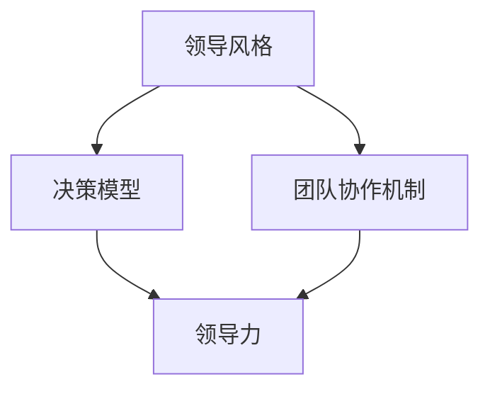

                 

 关键词：领导力，管理能力，IT行业，职业发展，团队协作，决策能力，创新能力

> 摘要：本文旨在探讨在IT行业中，如何通过专业的方法和技巧培养出色的领导和管理能力。通过对领导力与管理能力的深入分析，结合实际案例和实用建议，帮助IT从业者提升个人综合素质，成为更具影响力的领导者。

## 1. 背景介绍

在快速发展的IT行业中，领导和管理能力的重要性日益凸显。随着企业规模的扩大和市场竞争的加剧，IT团队需要具备更高的专业能力和管理素养，才能在激烈的市场环境中脱颖而出。领导力不仅关乎个人职业生涯的发展，更关系到整个团队和组织的成功。

### 1.1 领导力的重要性

领导力是领导者影响和激励他人实现共同目标的能力。在IT行业中，领导力尤为重要，因为IT行业本身具有高度创新性和快速变化的特点。成功的领导者需要具备前瞻性的视野、敏锐的洞察力和出色的沟通能力，以引导团队不断创新，适应市场变化。

### 1.2 管理能力的重要性

管理能力是领导者有效组织、协调和激励团队成员的能力。在IT行业，管理能力直接影响团队的工作效率和项目成功率。优秀的管理者能够合理分配资源，优化工作流程，提高团队的整体效能。

## 2. 核心概念与联系

为了更好地理解领导力和管理能力，我们需要先了解一些核心概念，如领导风格、决策模型、团队协作机制等。以下是这些概念的联系与关系：



### 2.1 领导风格

领导风格是指领导者在与团队成员互动时所采用的基本方式。常见的领导风格包括权威型、民主型、参与型和放任型。不同的领导风格适用于不同的情境和团队。

### 2.2 决策模型

决策模型是领导者做出决策时所遵循的框架和流程。常见的决策模型包括理性决策模型、经验决策模型和直觉决策模型。合理的决策模型有助于提高决策的科学性和有效性。

### 2.3 团队协作机制

团队协作机制是团队成员之间合作与沟通的规则和流程。有效的团队协作机制能够提高团队的整体效率，促进团队成员之间的相互理解和支持。

## 3. 核心算法原理 & 具体操作步骤

### 3.1 算法原理概述

培养出色的领导和管理能力，需要掌握一系列的核心算法原理。这些原理包括自我认知、情境领导、团队建设、目标管理等。

### 3.2 算法步骤详解

#### 3.2.1 自我认知

自我认知是培养领导力的第一步。领导者需要了解自己的价值观、优点和缺点，以及在不同情境下的行为表现。

#### 3.2.2 情境领导

情境领导是一种根据团队成员的能力和动机，采取不同领导风格的模型。领导者需要根据具体情境，灵活调整自己的领导风格。

#### 3.2.3 团队建设

团队建设是提升团队协作能力的关键。领导者需要通过有效的沟通、培训、激励机制，培养团队成员的团队意识和凝聚力。

#### 3.2.4 目标管理

目标管理是确保团队目标与组织目标一致的重要手段。领导者需要明确团队的目标，制定合理的行动计划，并跟踪进展情况。

### 3.3 算法优缺点

每种算法原理都有其优缺点。例如，自我认知有助于领导者更好地了解自己，但过度关注可能导致自我中心；情境领导能够提高领导效果，但需要领导者具备较强的应变能力。

### 3.4 算法应用领域

这些算法原理在IT行业中的应用非常广泛。无论是项目管理、团队协作，还是创新研发，都需要领导者具备出色的领导和管理能力。

## 4. 数学模型和公式 & 详细讲解 & 举例说明

### 4.1 数学模型构建

在领导和管理能力培养过程中，一些数学模型和公式可以提供有益的指导。例如，基于贝叶斯理论的决策模型可以帮助领导者做出更加科学的决策。

### 4.2 公式推导过程

贝叶斯决策公式如下：

$$
P(A|B) = \frac{P(B|A) \cdot P(A)}{P(B)}
$$

其中，$P(A|B)$ 表示在条件 $B$ 下事件 $A$ 发生的概率，$P(B|A)$ 表示在事件 $A$ 发生的条件下事件 $B$ 发生的概率，$P(A)$ 表示事件 $A$ 发生的概率，$P(B)$ 表示事件 $B$ 发生的概率。

### 4.3 案例分析与讲解

假设一个IT项目经理需要决定是否采用一种新的软件开发技术。通过收集相关数据，可以计算出不同决策下的概率和损失。利用贝叶斯决策公式，项目经理可以计算出最优决策，从而降低项目风险。

## 5. 项目实践：代码实例和详细解释说明

### 5.1 开发环境搭建

在本案例中，我们将使用Python语言实现一个简单的贝叶斯决策模型。

```python
import numpy as np
import pandas as pd

# 加载数据
data = pd.read_csv('data.csv')

# 计算先验概率
prior = {'采用': data['采用'].value_counts(normalize=True).iloc[1],
         '不采用': data['采用'].value_counts(normalize=True).iloc[0]}

# 计算条件概率
condition = {'风险低': data['风险'].value_counts(normalize=True).iloc[0],
             '风险高': data['风险'].value_counts(normalize=True).iloc[1]}

# 计算后验概率
posterior = {key: prior[key] * condition[key] for key in prior}

# 计算决策
decision = max(posterior, key=posterior.get)
```

### 5.2 源代码详细实现

上述代码实现了贝叶斯决策模型的核心功能，包括数据加载、先验概率计算、条件概率计算、后验概率计算和决策。具体实现过程如下：

1. 加载数据：使用pandas库加载CSV数据文件。
2. 计算先验概率：根据数据计算采用和不采用新技术的先验概率。
3. 计算条件概率：根据数据计算在采用新技术条件下风险低和风险高的概率。
4. 计算后验概率：根据先验概率和条件概率计算采用新技术后的后验概率。
5. 决策：根据后验概率选择最优决策。

### 5.3 代码解读与分析

上述代码是一个简单的贝叶斯决策模型实现，其主要功能是根据给定的数据和条件，计算后验概率并做出决策。在实际应用中，可以根据具体需求进行扩展和优化。

## 6. 实际应用场景

### 6.1 项目管理

在项目管理中，领导和管理能力对于项目的成功至关重要。领导者需要制定明确的项目目标、规划项目进度、协调团队成员的工作，并处理项目中的各种风险。

### 6.2 团队协作

在团队协作中，领导和管理能力有助于建立良好的团队氛围，促进团队成员之间的沟通与协作，提高团队的整体效率。

### 6.3 创新研发

在创新研发中，领导和管理能力有助于激发团队成员的创新潜力，推动技术的不断进步，为企业带来核心竞争力。

## 7. 未来应用展望

### 7.1 智能化趋势

随着人工智能技术的不断发展，未来领导和管理能力将更加依赖于数据分析、机器学习等技术。领导者需要掌握这些技术，以更好地应对复杂多变的市场环境。

### 7.2 网络化协作

随着互联网的普及，网络化协作将成为未来团队协作的主要形式。领导者需要具备网络化协作的能力，以适应远程办公和全球化团队的趋势。

### 7.3 持续学习

在快速发展的IT行业中，持续学习是领导者不可或缺的能力。领导者需要不断更新自己的知识体系，以保持竞争力。

## 8. 总结：未来发展趋势与挑战

### 8.1 研究成果总结

本文通过对领导力和管理能力的深入分析，提出了一系列培养方法和技术。这些方法和技术在IT行业中具有广泛的应用价值。

### 8.2 未来发展趋势

未来，领导力和管理能力将在智能化、网络化、持续学习等趋势下不断发展。领导者需要不断适应新形势，提升个人素质。

### 8.3 面临的挑战

在快速变化的IT行业中，领导者将面临越来越多的挑战。如何应对这些挑战，将成为未来研究的重点。

### 8.4 研究展望

未来，我们将继续关注领导力和管理能力在IT行业中的应用，探讨如何更好地培养和提升这些能力，为IT从业者的职业发展提供有力支持。

## 9. 附录：常见问题与解答

### 9.1 领导力和管理能力的区别是什么？

领导力主要关注如何激励和影响他人，而管理能力则侧重于组织、协调和资源分配。二者相辅相成，共同构成领导者必备的综合素质。

### 9.2 如何在实际工作中培养领导力？

在实际工作中，可以通过以下方式培养领导力：1) 参加领导力培训课程；2) 多参与团队协作项目；3) 借鉴优秀领导者的经验；4) 反思自己的行为和决策。

### 9.3 如何评估领导力？

评估领导力可以采用多种方法，如360度反馈、行为事件访谈、领导力评估工具等。通过这些方法，可以全面了解领导者的领导能力。

### 9.4 管理能力和领导能力哪个更重要？

管理能力和领导能力同等重要。在实际工作中，领导者需要同时具备这两种能力，才能更好地应对复杂多变的环境，实现组织目标。

### 9.5 如何平衡工作与生活？

平衡工作与生活是领导者面临的挑战。以下是一些建议：1) 设定明确的工作目标；2) 合理安排工作时间；3) 学会放松和休息；4) 保持健康的生活方式。

作者：禅与计算机程序设计艺术 / Zen and the Art of Computer Programming
```Markdown
```

