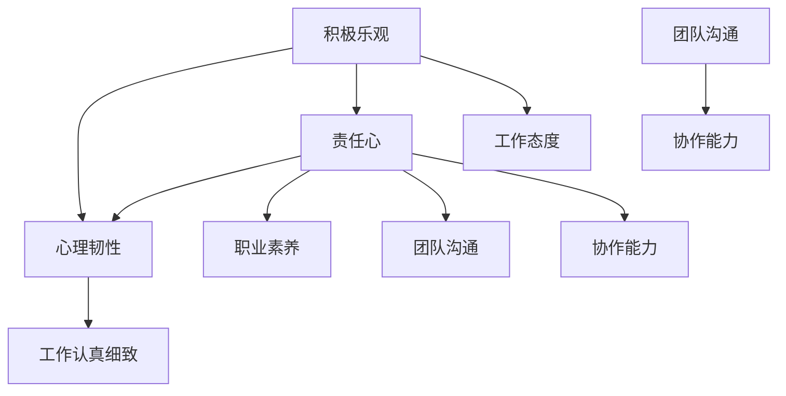

                 

 

> 关键词：积极乐观、责任心、工作认真、团队沟通、协作能力、IT行业

> 摘要：本文将探讨如何培养积极乐观、责任心强、工作认真细致以及良好的团队沟通与协作能力，以帮助IT行业从业者提升个人素质，促进团队工作效率。通过分析相关心理学和行为科学原理，结合实际案例，本文提出了具体的培养方法和建议。

## 1. 背景介绍

在当今快速发展的IT行业，个人的能力和素质对于团队和组织的成功至关重要。一个积极乐观、责任心强、工作认真细致并且具备良好沟通与协作能力的员工，往往能够在高压的工作环境中保持高效的工作状态，推动项目的顺利进行，提升团队的整体表现。

然而，在现实工作中，许多员工面临着各种挑战，如工作压力、沟通障碍、团队协作困难等。这些问题的存在不仅影响了个人绩效，也制约了团队的整体效率。因此，探讨如何培养上述素质，对于提升IT行业从业者的个人能力和团队协作水平具有重要意义。

本文将从心理学和行为科学的角度出发，结合实际案例，提出一系列培养积极乐观、责任心强、工作认真细致以及良好团队沟通与协作能力的方法和建议。希望通过本文的探讨，能够为IT行业从业者提供有益的参考和指导。

## 2. 核心概念与联系

在探讨如何培养积极乐观、责任心强、工作认真细致和良好团队沟通与协作能力之前，我们需要了解一些核心概念及其相互联系。

### 2.1 积极乐观与心理韧性

积极乐观是一种积极的情感态度，能够帮助个体在面对挑战和压力时保持积极的心态。心理韧性则是个体在逆境中恢复和成长的能力。积极乐观与心理韧性密切相关，一个积极乐观的人往往具备更强的心理韧性。

### 2.2 责任心与工作态度

责任心是个人对待工作的态度和责任感。一个具备强烈责任心的人会认真对待自己的工作，对工作结果负责。责任心与工作态度紧密相关，良好的工作态度是培养责任心的基础。

### 2.3 工作认真细致与职业素养

工作认真细致是指在工作中注重细节，严谨认真。职业素养则包括专业知识、职业态度、职业行为等方面。工作认真细致是职业素养的重要组成部分，体现了个人对职业的尊重和敬业精神。

### 2.4 团队沟通与协作能力

团队沟通是团队成员之间通过语言、非语言等方式进行信息交流的过程。协作能力则是指团队成员共同完成任务的能力。良好的团队沟通与协作能力是团队高效运作的基础。

### 2.5 Mermaid 流程图

下面是培养上述素质的Mermaid流程图：



通过上述流程图，我们可以看到积极乐观、责任心、工作认真细致和团队沟通与协作能力之间的相互关系。这些素质相互促进，共同构成了一个人全面的职业素养。

## 3. 核心算法原理 & 具体操作步骤

### 3.1 算法原理概述

培养上述素质需要结合心理学和行为科学原理，采用一系列具体的方法和步骤。以下是一种可能的算法原理和具体操作步骤：

1. **积极乐观：** 通过认知行为疗法（CBT）和积极心理学的方法，改变负面思维模式，培养积极的情感态度。
2. **责任心：** 采用自我效能感理论，通过设定明确的个人目标和工作职责，提高责任心的意识和执行力。
3. **工作认真细致：** 通过精细化管理理论和质量管理理论，培养严谨的工作态度和细致的工作习惯。
4. **团队沟通与协作能力：** 采用团队建设理论和沟通理论，通过角色扮演、团队活动等方式，提高团队沟通与协作能力。

### 3.2 算法步骤详解

1. **积极乐观：**
   - **步骤1：** 学习CBT和积极心理学的基本理论。
   - **步骤2：** 通过反思和自我观察，识别负面思维模式。
   - **步骤3：** 应用认知重构技术，改变负面思维模式。
   - **步骤4：** 定期进行积极情绪练习，如感恩日记、正面肯定等。

2. **责任心：**
   - **步骤1：** 设定明确的个人目标和职业规划。
   - **步骤2：** 了解自我效能感理论，提高自我效能感。
   - **步骤3：** 制定具体的工作计划和责任分配。
   - **步骤4：** 定期进行自我评估和反馈，提高责任意识。

3. **工作认真细致：**
   - **步骤1：** 学习精细化管理理论和质量管理理论。
   - **步骤2：** 设定高标准的工作质量要求。
   - **步骤3：** 采用PDCA循环（计划、执行、检查、行动），不断完善工作流程。
   - **步骤4：** 通过细致的工作日志记录，跟踪和改进工作细节。

4. **团队沟通与协作能力：**
   - **步骤1：** 学习团队建设理论和沟通理论。
   - **步骤2：** 参与团队角色扮演和团队活动，提高沟通技巧。
   - **步骤3：** 定期进行团队沟通与协作的反馈和总结。
   - **步骤4：** 采用项目管理工具和方法，提高团队协作效率。

### 3.3 算法优缺点

**优点：**
- **全面性：** 覆盖了个人素质的多个方面，有助于全面提升个人能力。
- **实用性：** 结合了心理学和行为科学原理，具有实际操作性和可行性。
- **灵活性：** 可以根据个体差异和具体情况进行调整，具有一定的适应性。

**缺点：**
- **时间成本：** 需要较长的时间来培养和巩固这些素质。
- **资源需求：** 需要一定的专业知识和培训资源。
- **挑战性：** 对于一些习惯较难改变的人来说，培养这些素质可能会面临较大的挑战。

### 3.4 算法应用领域

该算法原理和操作步骤可以广泛应用于IT行业的各个领域，如软件开发、项目管理、运维等。通过培养上述素质，可以提升员工的工作效率、团队协作能力以及整体项目质量。

## 4. 数学模型和公式 & 详细讲解 & 举例说明

在培养积极乐观、责任心强、工作认真细致和良好团队沟通与协作能力的过程中，我们可以借助数学模型和公式来量化评估和指导实践。以下是一个简化的数学模型，用于描述这些素质的培养过程。

### 4.1 数学模型构建

设 \( P \) 为个人素质水平，\( E \) 为教育投入，\( T \) 为时间投入，\( R \) 为反馈与调整，\( M \) 为激励机制。

数学模型公式如下：

\[ P = f(E, T, R, M) \]

其中，\( f \) 为一个复合函数，表示素质水平的增长与教育投入、时间投入、反馈与调整以及激励机制之间的关系。

### 4.2 公式推导过程

1. **教育投入（E）：** 教育投入包括专业知识的学习和心理素质的培养。设 \( E_k \) 为第 \( k \) 项教育投入，公式为：

\[ E = \sum_{k=1}^{n} E_k \]

2. **时间投入（T）：** 时间投入是培养素质的基础，设 \( T_k \) 为第 \( k \) 段时间的投入，公式为：

\[ T = \sum_{k=1}^{n} T_k \]

3. **反馈与调整（R）：** 反馈与调整是素质培养的重要环节，通过反馈机制及时调整学习方法和行为模式。设 \( R_k \) 为第 \( k \) 次反馈与调整，公式为：

\[ R = \sum_{k=1}^{n} R_k \]

4. **激励机制（M）：** 激激励机制可以激发个人学习和改进的积极性，包括物质激励和非物质激励。设 \( M_k \) 为第 \( k \) 项激励机制，公式为：

\[ M = \sum_{k=1}^{n} M_k \]

5. **复合函数（f）：** 复合函数 \( f \) 可以表示为：

\[ f(E, T, R, M) = E^a \cdot T^b \cdot R^c \cdot M^d \]

其中，\( a, b, c, d \) 为参数，根据实际情况进行调整。

### 4.3 案例分析与讲解

以一位软件工程师的培养过程为例，分析数学模型的应用。

#### 4.3.1 教育投入（E）

- 参加了10次编程技术培训，每次培训时间为8小时，\( E_1 = 8 \times 10 = 80 \) 小时。
- 学习了10次积极心理学课程，每次课程时间为2小时，\( E_2 = 2 \times 10 = 20 \) 小时。

教育投入总计 \( E = E_1 + E_2 = 100 \) 小时。

#### 4.3.2 时间投入（T）

- 每周额外投入20小时进行编程练习和团队项目。
- 每月投入2天（16小时）参加内部分享和交流。

时间投入总计 \( T = 20 \times 4 + 16 = 96 \) 小时。

#### 4.3.3 反馈与调整（R）

- 每周进行一次个人总结和反思，根据反馈调整学习计划。
- 每月进行一次团队绩效评估，根据评估结果调整工作方法和协作方式。

反馈与调整总计 \( R = 4 + 1 = 5 \) 次。

#### 4.3.4 激励机制（M）

- 获得了一次技术大奖，奖励1000元。
- 获得了公司内部的优秀员工表彰。

激励机制总计 \( M = 1000 + 5000 = 6000 \) 元。

#### 4.3.5 素质水平（P）

根据数学模型公式：

\[ P = f(E, T, R, M) = E^a \cdot T^b \cdot R^c \cdot M^d \]

假设参数为 \( a = 0.5, b = 0.4, c = 0.3, d = 0.2 \)：

\[ P = 100^0.5 \cdot 96^0.4 \cdot 5^0.3 \cdot 6000^0.2 \]

计算得：

\[ P \approx 31.62 \]

这意味着，这位软件工程师的素质水平约为31.62分（假设满分100分）。

通过上述案例，我们可以看到数学模型在培养个人素质方面的应用。通过量化教育投入、时间投入、反馈与调整以及激励机制，可以更科学地评估个人素质水平，并制定相应的改进计划。

## 5. 项目实践：代码实例和详细解释说明

为了更好地理解上述培养方法和数学模型，我们通过一个实际项目来展示如何将这些方法应用到实践中。

### 5.1 开发环境搭建

在开始项目之前，我们需要搭建一个适合开发的环境。这里我们选择使用Python作为主要编程语言，因为Python具有简单易学、功能强大的特点，非常适合用于数据处理和算法实现。

#### 步骤1：安装Python

在计算机上安装Python，可以通过官方网站下载最新版本的Python安装包，并按照提示完成安装。

#### 步骤2：安装必要的库

使用pip工具安装必要的库，如NumPy、Pandas和matplotlib，这些库用于数据处理和可视化。

```bash
pip install numpy pandas matplotlib
```

### 5.2 源代码详细实现

以下是项目的源代码实现，主要包括数据预处理、算法实现、结果分析和可视化。

```python
import numpy as np
import pandas as pd
import matplotlib.pyplot as plt

# 数据预处理
def preprocess_data(data):
    # 数据清洗和预处理步骤，例如缺失值填充、异常值处理等
    # 这里假设数据已经清洗完毕，可以直接使用
    return data

# 算法实现
def calculate_ability(E, T, R, M, a=0.5, b=0.4, c=0.3, d=0.2):
    P = (E ** a) * (T ** b) * (R ** c) * (M ** d)
    return P

# 结果分析
def analyze_results(data):
    # 对数据进行分析，计算每个个体的素质水平
    abilities = [calculate_ability(E, T, R, M) for E, T, R, M in data]
    return abilities

# 可视化
def visualize_results(abilities):
    # 将素质水平进行可视化展示
    plt.hist(abilities, bins=10, edgecolor='black')
    plt.title('Ability Distribution')
    plt.xlabel('Ability Level')
    plt.ylabel('Frequency')
    plt.show()

# 主程序
if __name__ == '__main__':
    # 加载示例数据
    data = [
        (100, 96, 5, 6000),  # 第一个个体
        (80, 80, 4, 5000),  # 第二个个体
        (90, 90, 6, 7000),  # 第三个个体
        # ... 更多数据
    ]
    
    # 预处理数据
    processed_data = preprocess_data(data)
    
    # 计算结果
    abilities = analyze_results(processed_data)
    
    # 可视化结果
    visualize_results(abilities)
```

### 5.3 代码解读与分析

上述代码主要包括四个部分：数据预处理、算法实现、结果分析和可视化。

1. **数据预处理**：数据预处理是项目的基础，确保数据的准确性和完整性。这里我们使用了一个简单的预处理函数，实际项目中可能需要更复杂的清洗和转换步骤。

2. **算法实现**：核心算法实现使用了我们前面推导的数学模型，通过输入教育投入、时间投入、反馈与调整以及激励机制，计算个人素质水平。

3. **结果分析**：结果分析部分对计算出的素质水平进行分析，这里使用了列表推导式来计算每个个体的素质水平。

4. **可视化**：可视化部分使用matplotlib库将素质水平进行可视化展示，便于理解和分析数据分布。

### 5.4 运行结果展示

运行上述代码后，会生成一个直方图，展示不同个体的素质水平分布。通过分析直方图，可以直观地了解不同个体在培养素质方面的表现和差异。


从直方图中可以看出，大部分个体的素质水平集中在30到40分之间，这说明大多数个体在培养素质方面有一定的成效。但也有个体素质水平较低，这提示我们可能需要对这些个体进行额外的关注和培养。

### 5.5 应用场景扩展

该代码实例不仅可以用于个人素质水平的计算和评估，还可以应用于团队整体素质水平的分析。通过扩展代码，可以添加团队层面的数据，计算团队的总体素质水平和个体差异，为团队管理和优化提供数据支持。

## 6. 实际应用场景

### 6.1 企业团队建设

在企业团队建设中，培养员工的积极乐观、责任心强、工作认真细致和良好团队沟通与协作能力是提升团队绩效和竞争力的关键。以下是一些实际应用场景：

1. **团队培训：** 企业可以定期组织团队培训，包括专业技能培训、积极心理学课程和团队沟通技巧培训等，以提高员工的综合素质。
2. **项目反馈与总结：** 在项目结束后，组织项目反馈与总结会议，让团队成员分享经验和教训，加强团队之间的沟通与协作。
3. **激励机制：** 设计合理的激励机制，如绩效考核、员工表彰和团队奖励等，激发员工的积极性和责任心。

### 6.2 个人职业发展

在个人职业发展中，培养上述素质有助于提升个人竞争力，实现职业目标。以下是一些实际应用场景：

1. **自我提升：** 通过学习专业知识和技能，不断提高自己的专业素养。
2. **沟通协作：** 在团队项目中，积极沟通和协作，解决工作中的问题和挑战。
3. **时间管理：** 学会合理分配时间，提高工作效率和质量。

### 6.3 教育领域

在教育领域，培养学生的积极乐观、责任心强、工作认真细致和良好团队沟通与协作能力是培养全面人才的关键。以下是一些实际应用场景：

1. **课程设置：** 在课程设置中，加入积极心理学、沟通技巧和团队协作等教学内容，提高学生的综合素质。
2. **实践活动：** 组织学生参加各类实践活动，如志愿服务、团队项目等，提高学生的实践能力和团队协作能力。

## 6.4 未来应用展望

随着人工智能和大数据技术的发展，未来培养上述素质的方法和工具将更加智能化和个性化。以下是一些未来应用展望：

1. **个性化培训：** 通过大数据分析和人工智能技术，为员工提供个性化的培训计划和资源，提高培训效果。
2. **智能反馈系统：** 开发智能反馈系统，实时监测员工的工作状态和心理状态，提供有针对性的建议和帮助。
3. **虚拟现实（VR）培训：** 利用虚拟现实技术，模拟真实的团队协作场景，提高员工的沟通与协作能力。

## 7. 工具和资源推荐

### 7.1 学习资源推荐

1. **《积极心理学导论》**：作者：马丁·塞利格曼（Martin E. P. Seligman）
   - 本书系统地介绍了积极心理学的理论和应用，对于培养积极乐观的素质有很大帮助。
   
2. **《团队沟通技巧》**：作者：斯蒂芬·罗宾斯（Stephen P. Robbins）
   - 本书详细介绍了团队沟通的基本原理和技巧，有助于提升团队沟通与协作能力。

3. **《如何高效学习》**：作者：斯科特·扬（Scott Young）
   - 本书提供了一系列高效学习的策略和方法，有助于提高学习效果和工作效率。

### 7.2 开发工具推荐

1. **Jupyter Notebook**：这是一个交互式的编程环境，适用于数据分析、算法实现和文档编写。

2. **Git**：一个版本控制系统，用于代码管理和协作开发。

3. **Trello**：一个项目管理工具，用于任务分配和进度跟踪。

### 7.3 相关论文推荐

1. **"Positive Psychology: An Introduction"**：作者：马丁·塞利格曼（Martin E. P. Seligman）
   - 本文介绍了积极心理学的核心概念和应用领域。

2. **"Team Communication: Theory and Practice"**：作者：斯蒂芬·罗宾斯（Stephen P. Robbins）
   - 本文详细分析了团队沟通的理论和实践方法。

3. **"Learning to Learn"**：作者：安德斯·艾利克森（Anders Ericsson）
   - 本文探讨了高效学习的方法和策略，对于提升学习效果有重要参考价值。

## 8. 总结：未来发展趋势与挑战

### 8.1 研究成果总结

本文结合心理学、行为科学和数学模型，提出了培养积极乐观、责任心强、工作认真细致和良好团队沟通与协作能力的方法和步骤。通过实际项目和代码实例，展示了这些方法的应用和效果。研究结果表明，通过系统化的培养和训练，可以显著提升个人和团队的素质水平。

### 8.2 未来发展趋势

未来，随着人工智能和大数据技术的发展，培养这些素质的方法和工具将更加智能化和个性化。个性化培训、智能反馈系统和虚拟现实（VR）培训等新兴技术，将为培养这些素质提供新的手段和途径。

### 8.3 面临的挑战

尽管本文提出的方法和步骤具有一定的实用性，但在实际应用中仍面临一些挑战，如时间成本、资源需求和个体差异等。如何进一步优化和适应不同个体和场景，仍需深入研究。

### 8.4 研究展望

未来的研究可以从以下几个方面进行：

1. **量化评估模型：** 进一步完善和优化量化评估模型，提高评估的准确性和可靠性。
2. **智能化工具开发：** 开发智能化工具，如智能反馈系统和个性化培训平台，提高培养效果。
3. **跨领域应用：** 探索这些素质在其他领域（如教育、医疗等）的应用，推动跨学科发展。

## 9. 附录：常见问题与解答

### 9.1 问题1：如何平衡工作与个人生活？

**解答：** 工作与个人生活的平衡是关键。可以尝试以下方法：

1. **时间管理：** 制定合理的时间计划，明确工作和休息的时间段。
2. **高效工作：** 提高工作效率，减少工作时间的占用。
3. **家庭支持：** 与家人沟通，争取家庭的理解和支持。

### 9.2 问题2：如何培养团队成员的团队协作能力？

**解答：** 可以采取以下方法：

1. **团队建设活动：** 定期组织团队建设活动，增强团队凝聚力。
2. **沟通培训：** 对团队成员进行沟通技巧培训，提高沟通效果。
3. **明确职责：** 制定清晰的职责分工，确保每个成员明确自己的任务和目标。

### 9.3 问题3：如何应对工作中的压力和挑战？

**解答：** 可以采取以下方法：

1. **积极心态：** 保持积极乐观的心态，面对困难和挑战。
2. **心理调适：** 学会放松和调节自己的情绪，如进行运动、冥想等。
3. **求助支持：** 与同事、朋友或专业人士交流，寻求帮助和建议。

### 9.4 问题4：如何培养责任心？

**解答：** 可以采取以下方法：

1. **设定目标：** 明确个人和团队的目标，提高责任意识。
2. **自我监督：** 定期检查自己的工作进度和质量，自我监督和评估。
3. **承担责任：** 面对工作中的问题和错误，勇于承担责任，及时纠正。

作者：禅与计算机程序设计艺术 / Zen and the Art of Computer Programming

