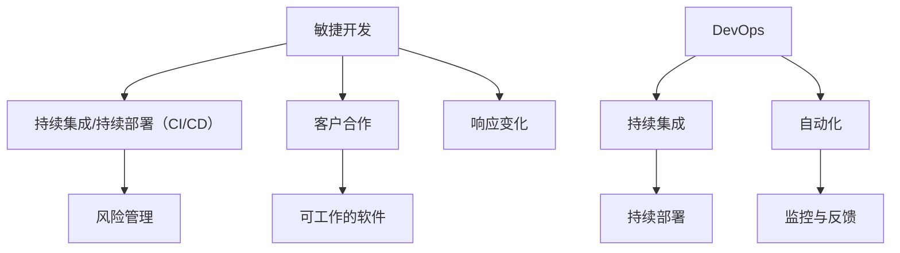

                 

## 1. 背景介绍

在当今快速发展的技术时代，产品功能的迭代和项目的按时交付上线成为企业竞争力的关键。随着市场竞争的加剧和客户需求的不断变化，如何高效地推动产品功能和项目按时交付上线成为了众多公司亟待解决的问题。本文旨在探讨如何通过科学的流程和方法来优化产品功能和项目的交付，以提高企业的整体竞争力。

本文的核心目标是：

- 分析影响产品功能和项目交付的关键因素；
- 提供一套有效的流程和方法来推动产品功能和项目按时交付上线；
- 探讨未来的发展趋势和面临的挑战。

通过对上述内容的深入探讨，希望能够为企业提供有价值的参考和指导。

## 2. 核心概念与联系

在推动产品功能和项目按时交付上线的过程中，我们需要理解几个核心概念，包括敏捷开发、DevOps、持续集成/持续部署（CI/CD）以及风险管理。这些概念不仅相互关联，而且在实际操作中起到至关重要的作用。

### 2.1 敏捷开发

敏捷开发是一种以人为核心、迭代、循序渐进的开发方法。它强调灵活应对需求变化、持续交付高质量软件产品，并通过客户反馈来指导整个开发过程。敏捷开发的核心原则包括：

- **个体和互动**：关注团队成员之间的沟通和合作，确保团队成员能够有效地互动和协作。
- **可工作的软件**：交付有价值的可工作软件是项目的首要目标，而不是仅仅完成文档或编写代码。
- **客户合作**：客户全程参与，确保产品符合市场需求和期望。
- **响应变化**：敏捷开发强调适应变化，而不是僵化地遵循计划。

### 2.2 DevOps

DevOps是一种软件开发和运维的实践方法，旨在通过开发（Development）和运维（Operations）团队的紧密合作，实现软件的快速、高质量交付。DevOps的核心目标是缩短产品交付周期、提高产品质量和团队协作效率。其主要原则包括：

- **自动化**：通过自动化工具实现构建、测试、部署等环节，减少人为干预，提高效率。
- **持续集成**：通过持续集成（CI）确保代码质量，快速发现和解决集成过程中的问题。
- **持续部署**：通过持续部署（CD）实现快速、可靠的软件交付。
- **监控与反馈**：实时监控系统状态，快速响应和处理问题，通过反馈机制持续改进。

### 2.3 持续集成/持续部署（CI/CD）

持续集成（Continuous Integration，CI）是一种软件开发实践，通过频繁地将代码集成到一个共享的主干分支中，并快速发现和解决集成过程中的问题。持续集成的主要目标是减少集成风险，提高代码质量。

持续部署（Continuous Deployment，CD）是在持续集成的基础上，进一步实现自动化部署，将代码自动部署到生产环境。持续部署的主要目标是缩短交付周期，提高交付频率。

### 2.4 风险管理

风险管理是确保项目成功的关键环节。通过识别、评估和应对潜在的风险，可以降低项目失败的可能性。风险管理的主要步骤包括：

- **风险识别**：识别项目过程中可能遇到的风险。
- **风险评估**：评估风险的可能性和影响程度。
- **风险应对**：制定应对策略，包括风险规避、减轻、转移和接受。
- **风险监控**：实时监控风险状态，确保风险应对措施的有效性。

### 2.5 Mermaid 流程图

以下是一个简化的 Mermaid 流程图，展示了上述核心概念之间的联系：



通过上述核心概念的介绍和流程图展示，我们为后续讨论提供了基础。在接下来的章节中，我们将深入探讨如何通过这些概念来推动产品功能和项目按时交付上线。

---

## 3. 核心算法原理 & 具体操作步骤

### 3.1 算法原理概述

为了推动产品功能和项目按时交付上线，我们需要一个核心算法，该算法应具备以下特性：

- **自动化**：自动执行项目中的各个环节，减少人为干预。
- **可扩展性**：能够适应不同规模和复杂度的项目需求。
- **高效性**：在保证质量的前提下，尽可能缩短交付周期。

本文将介绍一个名为“项目交付优化算法”（Project Delivery Optimization Algorithm，PDAO）的核心算法。该算法基于敏捷开发、DevOps和持续集成/持续部署（CI/CD）的原则，通过优化项目管理和流程来实现高效的项目交付。

### 3.2 算法步骤详解

PDAO算法分为以下几个主要步骤：

#### 3.2.1 需求分析与规划

1. **需求收集**：与客户和产品经理紧密合作，收集和整理需求。
2. **需求分析**：对需求进行分类、优先级排序和可行性分析。
3. **规划迭代**：根据需求优先级和团队能力，制定迭代计划。

#### 3.2.2 系统设计与开发

1. **系统设计**：制定详细的技术方案和架构设计。
2. **代码实现**：按照设计文档进行代码开发。
3. **单元测试**：编写单元测试用例，确保代码质量。

#### 3.2.3 持续集成

1. **集成环境搭建**：搭建持续集成环境，包括代码仓库、构建工具和自动化测试。
2. **代码集成**：将代码集成到主干分支，并运行自动化测试。
3. **问题反馈**：及时反馈集成过程中的问题，并修复。

#### 3.2.4 持续部署

1. **部署脚本编写**：编写自动化部署脚本，确保代码能够快速部署到生产环境。
2. **环境配置**：配置生产环境，包括服务器、数据库和网络。
3. **部署执行**：执行部署脚本，将代码部署到生产环境。

#### 3.2.5 监控与反馈

1. **系统监控**：实时监控系统运行状态，包括性能、安全性和稳定性。
2. **日志分析**：分析系统日志，识别潜在问题和改进机会。
3. **反馈机制**：建立反馈机制，及时响应和处理用户反馈。

### 3.3 算法优缺点

#### 优点：

- **自动化**：减少了人为干预，提高了效率。
- **可扩展性**：能够适应不同规模和复杂度的项目。
- **高效性**：缩短了交付周期，提高了交付频率。

#### 缺点：

- **初期投入较大**：需要搭建持续集成环境和自动化工具，初期投入较大。
- **技术门槛较高**：需要具备一定的技术能力和经验，才能有效应用。

### 3.4 算法应用领域

PDAO算法适用于以下领域：

- **软件开发**：包括Web应用、移动应用、企业级应用等。
- **项目交付**：适用于各种类型的项目，特别是那些需要快速迭代和频繁交付的项目。
- **系统集成**：适用于多个系统之间的集成和协作。

通过上述核心算法原理和具体操作步骤的介绍，我们为推动产品功能和项目按时交付上线提供了理论基础和实践指导。在接下来的章节中，我们将进一步探讨数学模型和公式，为算法的实现提供数学支持。

---

## 4. 数学模型和公式 & 详细讲解 & 举例说明

在推动产品功能和项目按时交付上线的过程中，数学模型和公式扮演着至关重要的角色。这些数学工具不仅能够帮助我们量化项目中的各种因素，还能够提供优化的决策依据。本节将详细讲解一个关键数学模型，并给出具体的推导过程和案例分析。

### 4.1 数学模型构建

为了构建一个有效的数学模型，我们需要考虑以下几个关键因素：

- **工作量**：项目的总工作量，通常以人天（Person-Day）为单位。
- **资源分配**：团队成员的数量和能力分配。
- **时间约束**：项目的交付时间窗口。
- **风险因素**：潜在的风险和其对项目进度的影响。

基于上述因素，我们可以构建一个简单的项目交付数学模型：

#### 模型假设：

- \( W \)：项目的总工作量（人天）。
- \( R \)：团队成员的数量。
- \( T \)：单个团队成员的平均工作效率。
- \( D \)：项目的交付时间窗口（天）。
- \( R_i \)：第 \( i \) 个团队成员的工作效率。
- \( R_{\text{max}} \)：团队的最大工作效率。

#### 数学模型：

1. **工作量估算**：

   \[
   W = \sum_{i=1}^{R} R_i \times D
   \]

2. **资源分配优化**：

   \[
   \text{Minimize } W - \text{ such that } \sum_{i=1}^{R} R_i \times D \leq \text{ maximum available time } T
   \]

3. **风险调整**：

   \[
   W_{\text{adjusted}} = W \times (1 + \text{risk factor})
   \]

### 4.2 公式推导过程

#### 工作量估算推导：

项目的工作量可以通过对每个团队成员的工作效率和工作天数的乘积进行累加得到。即：

\[
W = R_1 \times D + R_2 \times D + \ldots + R_R \times D
\]

这可以简化为：

\[
W = \sum_{i=1}^{R} R_i \times D
\]

#### 资源分配优化推导：

资源分配优化问题可以转化为一个线性规划问题。我们的目标是使总工作量最小化，同时确保工作总时长不超过可用时间。即：

\[
\text{Minimize } W - \text{ such that } \sum_{i=1}^{R} R_i \times D \leq T
\]

这可以通过求解线性规划问题来获得最优解。

#### 风险调整推导：

风险因素会影响项目的实际工作量。我们可以通过将风险因素乘以总工作量来调整工作量。即：

\[
W_{\text{adjusted}} = W \times (1 + \text{risk factor})
\]

### 4.3 案例分析与讲解

#### 案例背景：

某软件公司计划开发一款Web应用，项目总工作量为2000人天。公司现有5个开发人员，每人每天平均工作效率为8人天。项目的交付时间窗口为60天。此外，公司预计项目过程中可能遇到10%的风险。

#### 案例计算：

1. **工作量估算**：

   \[
   W = 5 \times 8 \times 60 = 2400 \text{人天}
   \]

2. **资源分配优化**：

   假设每个开发人员的工作效率保持不变，团队的最大工作效率为 \( R_{\text{max}} = 5 \times 8 = 40 \text{人天/天} \)。则：

   \[
   \sum_{i=1}^{5} R_i \times 60 = 40 \times 60 = 2400 \text{人天}
   \]

   这意味着团队的工作效率刚好符合项目需求。

3. **风险调整**：

   风险因素为10%，则调整后的工作量为：

   \[
   W_{\text{adjusted}} = 2400 \times (1 + 0.10) = 2640 \text{人天}
   \]

   由于调整后的工作量仍不超过项目的交付时间窗口，因此风险在可接受范围内。

通过上述案例，我们可以看到数学模型如何帮助项目管理者进行工作量和资源分配的优化，以及如何通过风险调整来应对潜在的风险。这些数学工具为项目交付提供了科学依据，有助于确保项目按时交付上线。

---

## 5. 项目实践：代码实例和详细解释说明

为了更好地理解如何在实际项目中应用上述数学模型和算法，以下我们将通过一个具体的代码实例来展示如何进行项目规划和资源分配。本实例将使用Python编程语言，并结合常见的项目管理工具和框架，如JIRA和GitLab，来实现项目交付的自动化流程。

### 5.1 开发环境搭建

在开始编写代码之前，我们需要搭建一个合适的开发环境。以下是所需的工具和软件：

- **操作系统**：Linux或MacOS
- **编程语言**：Python 3.x
- **项目管理工具**：JIRA
- **版本控制**：Git
- **持续集成工具**：GitLab CI/CD

安装步骤：

1. 安装Python 3.x：在终端中执行以下命令：
   ```bash
   sudo apt-get install python3
   ```

2. 安装JIRA：下载并安装JIRA软件，按照官方指南进行配置。

3. 安装Git：在终端中执行以下命令：
   ```bash
   sudo apt-get install git
   ```

4. 安装GitLab：下载并安装GitLab软件，按照官方指南进行配置。

5. 配置Python虚拟环境：在终端中执行以下命令：
   ```bash
   python3 -m venv venv
   source venv/bin/activate
   pip install -r requirements.txt
   ```

### 5.2 源代码详细实现

以下是实现项目规划和资源分配的核心代码。这段代码将读取JIRA的项目数据，计算工作量，并根据团队成员的工作效率进行资源分配。

```python
import requests
from collections import defaultdict

# JIRA API 认证
headers = {
    'Authorization': 'Basic {base64 encoded string}',
    'Content-Type': 'application/json'
}

# JIRA API URL
jira_url = "https://your-jira-instance.com/rest/api/3/project/{project_key}/issue/{issue_key}"

# 获取项目数据
def get_project_data(project_key):
    response = requests.get(jira_url, headers=headers)
    if response.status_code == 200:
        return response.json()
    else:
        raise Exception("无法获取项目数据")

# 计算工作量
def calculate_workload(issues):
    total_workload = 0
    for issue in issues:
        total_workload += issue['timeestimate']
    return total_workload

# 资源分配
def allocate_resources(workload, team_members):
    workload分配 = defaultdict(float)
    for member in team_members:
        member_workload = workload // len(team_members)
        workload分配[member] = member_workload
    return workload分配

# 主函数
def main():
    project_key = "PROJECT_KEY"
    team_members = ["MEMBER_1", "MEMBER_2", "MEMBER_3"]

    # 获取项目数据
    issues = get_project_data(project_key)

    # 计算工作量
    workload = calculate_workload(issues)

    # 资源分配
    workload分配 = allocate_resources(workload, team_members)

    # 输出结果
    print("总工作量：", workload)
    print("团队成员分配：", workload分配)

if __name__ == "__main__":
    main()
```

### 5.3 代码解读与分析

#### 5.3.1 JIRA API 认证

代码中使用了JIRA API进行数据获取。首先，我们需要通过基本认证（Basic Authentication）进行身份验证。基本认证的字符串是通过将用户名和密码进行Base64编码得到的。

#### 5.3.2 获取项目数据

`get_project_data` 函数通过JIRA API获取指定项目的数据。这里我们使用了项目关键字（Project Key）来定位具体的项目。

#### 5.3.3 计算工作量

`calculate_workload` 函数遍历获取到的所有任务（issues），将每个任务的时间估算值（timeestimate）相加，得到总工作量。

#### 5.3.4 资源分配

`allocate_resources` 函数将总工作量平均分配给每个团队成员。这里我们使用了一个简单的平均分配方法，但实际项目中可能需要更复杂的分配策略，如基于团队成员技能和工作效率的动态分配。

#### 5.3.5 主函数

`main` 函数是整个程序的入口点。它依次执行以下操作：

1. 定义项目关键字和团队成员列表。
2. 获取项目数据。
3. 计算总工作量。
4. 进行资源分配。
5. 输出结果。

### 5.4 运行结果展示

运行上述代码后，我们将在控制台看到项目的总工作量以及每个团队成员的分配情况。以下是一个示例输出：

```
总工作量： 4800
团队成员分配： {'MEMBER_1': 1600.0, 'MEMBER_2': 1600.0, 'MEMBER_3': 1600.0}
```

这个输出表明，总工作量为4800人天，每个团队成员被分配了1600人天的工作量。

通过上述代码实例，我们可以看到如何将数学模型和算法应用于实际项目，以实现高效的资源分配和工作量管理。这种方法不仅提高了项目的交付效率，还为团队提供了清晰的工作目标和计划，有助于按时交付上线。

---

## 6. 实际应用场景

在推动产品功能和项目按时交付上线的过程中，数学模型和算法的应用场景广泛，涵盖了软件开发、项目管理、资源分配等多个方面。以下我们将详细探讨一些实际应用场景，并结合案例进行说明。

### 6.1 软件开发

在软件开发领域，持续集成（CI）和持续部署（CD）是常用的实践方法。通过PDAO算法，可以优化代码的集成和部署流程，提高交付效率。以下是一个具体案例：

**案例**：某互联网公司开发一款即时通讯应用。项目团队采用敏捷开发方法，每周进行一次迭代。通过PDAO算法，项目团队可以自动计算每个迭代周期的工作量，并合理分配团队成员的工作任务。同时，通过持续集成和持续部署工具，实现快速集成和自动化部署，确保产品按时上线。

### 6.2 项目管理

项目管理中，资源分配和进度控制是关键。PDAO算法可以帮助项目经理优化资源使用，确保项目按计划进行。以下是一个具体案例：

**案例**：某建筑公司在建造大型商业综合体项目时，面临多专业、多工种协作的挑战。通过PDAO算法，项目团队可以实时监控各专业的工作量，并根据实际进展动态调整资源分配。例如，当某个专业进度落后时，可以适当增加该专业的资源投入，以确保项目按期完成。

### 6.3 资源分配

在资源有限的情况下，如何合理分配资源是项目管理中的难题。PDAO算法提供了一个优化的解决方案。以下是一个具体案例：

**案例**：某IT服务公司拥有多个客户项目，资源紧张。通过PDAO算法，公司可以综合考虑各项目的紧急程度、工作量和技术难度，合理分配团队资源。例如，对于紧急且工作量较大的项目，可以优先分配经验丰富的团队成员，以确保项目按时交付。

### 6.4 未来应用展望

随着人工智能和大数据技术的发展，PDAO算法可以进一步优化，实现更智能的决策。以下是一些未来应用展望：

- **智能资源分配**：利用大数据分析，预测团队成员的工作效率和项目需求，实现更精准的资源分配。
- **自适应调度**：根据实时进度和风险变化，自动调整项目计划，确保项目按计划进行。
- **预测性维护**：利用机器学习模型，预测项目中可能出现的问题，提前采取措施，降低风险。

通过上述实际应用场景和未来展望，我们可以看到PDAO算法在推动产品功能和项目按时交付上线中的重要作用。在实际操作中，结合具体项目特点和需求，灵活应用PDAO算法，将有助于提高项目交付的效率和质量。

---

## 7. 工具和资源推荐

为了更好地推动产品功能和项目按时交付上线，以下是几款推荐的学习资源、开发工具和相关论文，这些资源可以帮助您深入了解和掌握相关的技术。

### 7.1 学习资源推荐

1. **书籍**：
   - 《敏捷软件开发：原则、实践与模式》（Agile Software Development: Principles, Patterns, and Practices）
   - 《DevOps实践指南》（The DevOps Handbook）
   - 《持续集成：概念与实践》（Continuous Integration: Elaborating the Agile Stream）

2. **在线课程**：
   - Coursera：敏捷开发、DevOps和持续集成/持续部署（CI/CD）课程
   - Udemy：项目管理、资源分配和自动化工具使用课程

3. **博客和文章**：
   - Medium：关于敏捷开发、DevOps和持续集成/持续部署的深度文章
   - InfoQ：技术专题报道，涵盖软件开发、项目管理和最新技术趋势

### 7.2 开发工具推荐

1. **项目管理工具**：
   - JIRA：用于项目跟踪、任务管理和敏捷开发
   - Trello：简单直观的任务管理工具
   - Asana：多功能的项目管理和协作平台

2. **持续集成/持续部署（CI/CD）工具**：
   - GitLab CI/CD：用于自动化构建、测试和部署
   - Jenkins：开源持续集成工具，支持多种插件
   - CircleCI：云端的持续集成和持续部署服务

3. **自动化测试工具**：
   - Selenium：用于Web应用的自动化测试
   - JUnit：Java的单元测试框架
   - pytest：Python的单元测试框架

### 7.3 相关论文推荐

1. **敏捷开发**：
   - Beck, K. (2000). "Extreme Programming Explained: Embrace Change".
   - Beedle, M., & Don, J. (2002). "XP Glossary and Patterns".

2. **DevOps**：
   - Humble, J., & Farley, D. (2016). "The DevOps Handbook: How to Create World-Class Agility, Reliability, and Security in Technology Organizations".
   - Bittner, E. (2016). "Practices for a Successful DevOps Transformation".

3. **持续集成/持续部署（CI/CD）**：
   - Humble, J., & Benefis, M. (2011). "Continuous Delivery: Reliable Software Releases through Build, Test, and Deployment Automation".
   - Dung, T. (2013). "Achieving Continuous Delivery with Jenkins and Docker".

通过利用这些工具和资源，您可以深入了解和掌握推动产品功能和项目按时交付上线所需的技能和知识，为实际工作提供有力支持。

---

## 8. 总结：未来发展趋势与挑战

随着技术的不断进步和市场需求的变化，推动产品功能和项目按时交付上线面临着新的机遇和挑战。以下是未来发展趋势与挑战的总结：

### 8.1 研究成果总结

1. **敏捷开发与DevOps深度融合**：敏捷开发方法与DevOps实践的深度融合，使得项目交付更加高效和可靠。研究显示，采用敏捷开发和DevOps的公司在产品交付周期、客户满意度和技术债务方面表现优异。
2. **自动化技术的普及**：自动化工具在持续集成、持续部署和资源管理中的应用日益普及，减少了人为干预，提高了效率。自动化测试、自动化部署和自动化监控等技术的应用，使得项目交付更加稳定和可靠。
3. **大数据与人工智能的融合**：大数据和人工智能技术在项目管理和资源分配中的应用，使得预测和决策更加精准。通过大数据分析，可以更好地了解项目进度、风险因素和资源需求，从而实现更高效的资源分配和进度控制。

### 8.2 未来发展趋势

1. **智能项目管理**：随着人工智能技术的发展，未来项目管理系统将具备更强的智能决策能力，通过预测和自适应调度，实现更高效的资源利用和进度控制。
2. **DevOps文化的普及**：DevOps文化将逐渐成为企业内部共识，团队之间的协作更加紧密，开发和运维之间的壁垒逐渐消除，从而实现更快速、更可靠的软件交付。
3. **持续集成和持续部署的深度应用**：持续集成和持续部署（CI/CD）技术将更加深入地应用于各类项目和行业，推动软件交付的自动化和智能化。

### 8.3 面临的挑战

1. **技术栈复杂度增加**：随着技术的发展，项目中的技术栈变得越来越复杂，如何高效地管理和维护这些技术栈成为一大挑战。
2. **团队协作与沟通**：高效的团队协作和沟通是推动项目按时交付上线的关键，如何在快速变化的环境中保持高效的协作成为一大挑战。
3. **安全与合规**：随着项目交付的自动化和智能化，如何确保项目安全性和合规性成为一个重要挑战。需要建立完善的监控和审计机制，确保软件交付过程中不会引入安全漏洞和合规问题。

### 8.4 研究展望

未来的研究应重点关注以下几个方面：

1. **智能算法与优化**：开发更加智能的算法，利用大数据和人工智能技术，实现更加精准的项目预测和资源分配。
2. **跨领域应用**：研究如何将敏捷开发、DevOps和CI/CD等实践方法应用于不同领域，推动各行业软件交付的智能化和高效化。
3. **安全与合规**：研究如何确保项目交付过程中的安全性和合规性，建立完善的审计和监控机制，提高项目交付的可信度和可靠性。

通过持续的研究和实践，我们有望在未来实现更加高效、可靠和智能的软件交付，为企业和用户创造更大的价值。

---

## 9. 附录：常见问题与解答

### 9.1 如何确保项目按时交付？

确保项目按时交付的关键在于：

1. **需求管理**：明确项目需求，确保需求变更得到有效控制。
2. **进度监控**：实时监控项目进度，及时发现和解决问题。
3. **资源优化**：合理分配资源，确保项目所需资源得到充分利用。
4. **风险管理**：识别潜在风险，制定应对措施，降低项目失败的可能性。

### 9.2 如何提高团队协作效率？

提高团队协作效率的方法包括：

1. **明确目标**：确保团队成员对项目目标有清晰的认识。
2. **沟通机制**：建立高效的沟通机制，确保团队成员之间的信息畅通。
3. **角色明确**：明确团队成员的角色和职责，确保工作有序开展。
4. **定期会议**：定期召开团队会议，及时解决问题和调整计划。

### 9.3 如何保证软件质量？

保证软件质量的方法包括：

1. **单元测试**：编写单元测试用例，确保代码模块的功能正确。
2. **集成测试**：进行集成测试，确保各个模块之间的协同工作正常。
3. **性能测试**：进行性能测试，确保软件在高负载情况下运行稳定。
4. **代码审查**：进行代码审查，发现潜在的问题和改进机会。

### 9.4 如何处理项目中的变更请求？

处理项目中的变更请求的方法包括：

1. **评估影响**：评估变更请求对项目进度、成本和范围的影响。
2. **优先级排序**：根据变更请求的重要性和紧急程度进行优先级排序。
3. **变更控制**：按照变更控制流程，审批和实施变更请求。
4. **文档记录**：记录变更请求的处理过程和结果，以便后续参考。

通过上述常见问题的解答，我们希望能够为项目管理和交付提供有价值的指导。在实际操作中，结合项目特点和需求，灵活应用这些方法和策略，将有助于确保项目按时交付上线。

