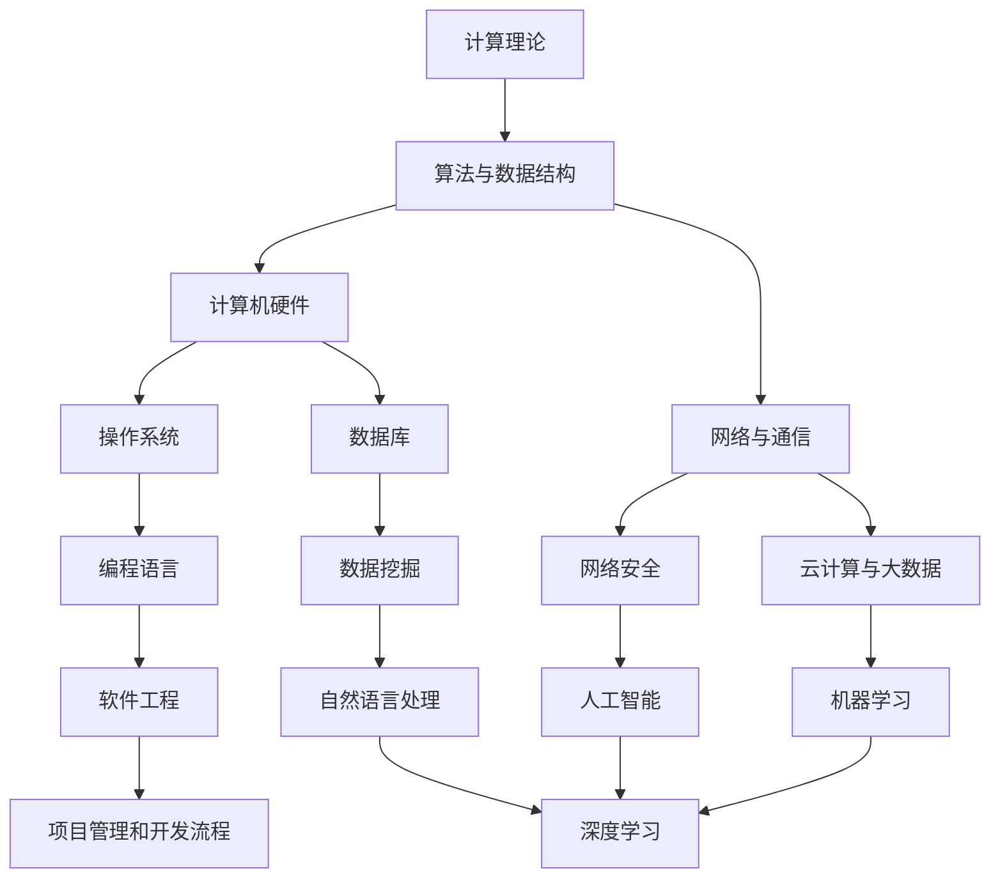

                 

关键词：计算机科学，深度学习，人工智能，算法原理，数学模型，实践应用

> 摘要：本文将深入探讨计算机科学领域的核心概念和算法原理，通过详尽的数学模型构建和具体操作步骤的讲解，带领读者理解从概念到洞见的思维过程。文章还将结合实际项目实践，展示算法的应用和实现，最后对未来发展趋势和挑战进行展望。

## 1. 背景介绍

在快速发展的信息时代，计算机科学已经成为推动社会进步的重要力量。人工智能、深度学习等前沿技术的不断突破，使得计算机应用领域不断拓展，从数据处理、图像识别到自动驾驶、智能机器人等，计算机科学已经深入到我们生活的方方面面。然而，在这些技术背后，核心概念和算法原理的理解和掌握显得尤为重要。本文旨在通过深入探讨计算机科学领域的核心概念和算法原理，帮助读者构建思想的深度，从而提升对复杂技术的理解和应用能力。

### 1.1 计算机科学的发展历程

计算机科学的发展经历了多个阶段。从早期的机械计算机、电子管计算机到今天的超级计算机，计算机硬件技术的飞速发展推动了软件技术的进步。同时，计算机科学的数学基础也在不断完善，从初期的逻辑和代数方法，到现代的图论、概率论和最优化理论，数学模型在计算机科学中的应用越来越广泛。

### 1.2 人工智能与深度学习

人工智能是计算机科学的重要分支，其目标是使计算机具备人类的智能。深度学习作为人工智能的重要技术，通过模拟人脑的神经网络结构和学习机制，实现了在图像识别、自然语言处理等领域的突破性进展。深度学习的核心在于对大量数据的学习和提取特征，从而实现复杂任务的高效解决。

## 2. 核心概念与联系

在计算机科学中，有许多核心概念和技术，它们之间存在着紧密的联系。以下是一个简化的Mermaid流程图，展示了这些核心概念和技术的相互关系：



### 2.1 计算理论

计算理论是计算机科学的基础，它研究计算的本质、可行性和复杂性。计算理论的核心概念包括图灵机、计算复杂性理论和形式语言理论等。这些理论为算法设计和分析提供了坚实的数学基础。

### 2.2 算法与数据结构

算法是计算机科学的核心，它是一系列解决问题的有序指令。数据结构则是存储和组织数据的方式，直接影响算法的效率。常见的算法和数据结构包括排序算法、搜索算法、树结构、图结构等。

### 2.3 计算机硬件

计算机硬件是计算机科学的基础设施，包括处理器、内存、存储设备、输入输出设备等。计算机硬件的发展推动了软件技术的进步，同时也对算法设计提出了新的挑战。

### 2.4 网络与通信

网络与通信技术使得计算机可以连接成一个全球性的信息网络。互联网、无线通信和分布式系统等技术的应用，极大地扩展了计算机科学的应用范围。

### 2.5 操作系统、数据库、网络安全

操作系统是管理计算机硬件和软件资源的核心软件。数据库技术用于高效存储、管理和查询大量数据。网络安全则是保护计算机系统和数据安全的关键领域。

### 2.6 云计算与大数据、机器学习

云计算和大数据技术为处理和分析海量数据提供了强大的支持。机器学习作为人工智能的核心技术，通过数据驱动的方法，实现自动化决策和预测。

### 2.7 人工智能、深度学习、自然语言处理

人工智能、深度学习和自然语言处理是计算机科学的前沿领域。这些技术正在改变我们的生活方式和工作方式，从智能助手到自动驾驶，应用场景越来越广泛。

## 3. 核心算法原理 & 具体操作步骤

### 3.1 算法原理概述

在本节中，我们将介绍几个核心算法的原理，包括排序算法、搜索算法、神经网络等。

### 3.2 算法步骤详解

以下是对每个算法的具体操作步骤的详细解释：

#### 3.2.1 排序算法

排序算法是一种常用的算法，用于对数据进行排序。常见的排序算法包括冒泡排序、选择排序、插入排序、快速排序等。

**冒泡排序（Bubble Sort）：**

- 将数组从后向前遍历，比较相邻的元素，如果它们的顺序错误就交换它们的位置。
- 重复上述过程，直到整个数组有序。

```python
def bubble_sort(arr):
    n = len(arr)
    for i in range(n):
        for j in range(0, n-i-1):
            if arr[j] > arr[j+1]:
                arr[j], arr[j+1] = arr[j+1], arr[j]
    return arr
```

**快速排序（Quick Sort）：**

- 选择一个基准元素，将数组分为两部分，一部分小于基准，一部分大于基准。
- 递归地对这两部分进行快速排序。

```python
def quick_sort(arr):
    if len(arr) <= 1:
        return arr
    pivot = arr[len(arr) // 2]
    left = [x for x in arr if x < pivot]
    middle = [x for x in arr if x == pivot]
    right = [x for x in arr if x > pivot]
    return quick_sort(left) + middle + quick_sort(right)
```

#### 3.2.2 搜索算法

搜索算法用于在数据结构中查找特定元素。常见的搜索算法包括线性搜索、二分搜索等。

**线性搜索（Linear Search）：**

- 依次检查数组中的每个元素，直到找到目标元素或检查完所有元素。

```python
def linear_search(arr, target):
    for i in range(len(arr)):
        if arr[i] == target:
            return i
    return -1
```

**二分搜索（Binary Search）：**

- 在有序数组中，不断将搜索范围缩小一半，直到找到目标元素或确定目标不存在。

```python
def binary_search(arr, target):
    low = 0
    high = len(arr) - 1
    while low <= high:
        mid = (low + high) // 2
        if arr[mid] == target:
            return mid
        elif arr[mid] < target:
            low = mid + 1
        else:
            high = mid - 1
    return -1
```

#### 3.2.3 神经网络

神经网络是深度学习的基础，它通过模拟人脑的神经网络结构，实现复杂的数据处理和模式识别。

**神经网络的工作原理：**

- 神经网络由多层神经元组成，每个神经元接收多个输入，通过激活函数产生输出。
- 神经网络通过反向传播算法不断调整权重和偏置，以达到预期的输出。

**神经网络的具体操作步骤：**

1. 初始化网络结构，包括输入层、隐藏层和输出层。
2. 前向传播：将输入数据传递到网络中，计算每个神经元的输出。
3. 计算损失函数，衡量输出与实际结果之间的差距。
4. 反向传播：计算梯度，更新网络权重和偏置。
5. 重复步骤2-4，直到网络达到预设的精度或达到最大迭代次数。

```python
import numpy as np

def sigmoid(x):
    return 1 / (1 + np.exp(-x))

def forward_propagation(x, weights, bias):
    z = np.dot(x, weights) + bias
    return sigmoid(z)

def backward_propagation(y, y_hat, weights, bias, x):
    error = y - y_hat
    d_z = error * sigmoid_derivative(z)
    d_weights = np.dot(x.T, d_z)
    d_bias = np.sum(d_z)
    return d_weights, d_bias

def update_weights_and_bias(weights, bias, d_weights, d_bias, learning_rate):
    weights -= learning_rate * d_weights
    bias -= learning_rate * d_bias
    return weights, bias
```

### 3.3 算法优缺点

每种算法都有其优缺点，适用于不同的应用场景。

- **排序算法：**
  - 冒泡排序：简单易懂，但效率较低。
  - 快速排序：平均时间复杂度为O(nlogn)，但最坏情况下可能退化到O(n^2)。
  - 线性搜索：简单易懂，但效率较低。
  - 二分搜索：在有序数组中高效，但需要额外的排序操作。

- **神经网络：**
  - 适用于复杂的数据处理和模式识别。
  - 需要大量的数据和计算资源。
  - 难以解释和理解，缺乏透明性。

### 3.4 算法应用领域

排序算法广泛应用于数据库管理和数据分析，搜索算法在搜索引擎和数据检索中发挥着重要作用，神经网络在图像识别、自然语言处理和自动驾驶等领域取得了突破性进展。

## 4. 数学模型和公式 & 详细讲解 & 举例说明

在计算机科学中，数学模型和公式是理解和应用算法的关键。以下我们将介绍一些常用的数学模型和公式，并进行详细讲解和举例说明。

### 4.1 数学模型构建

数学模型是通过对现实问题进行简化和抽象，构建出能够描述问题本质的数学结构。在计算机科学中，常见的数学模型包括图模型、概率模型和线性模型等。

**图模型：** 图模型用于描述网络结构，包括节点和边的关系。常见的图模型有有向图、无向图、加权图等。图模型在社交网络分析、推荐系统等领域有广泛应用。

**概率模型：** 概率模型用于描述随机事件的发生概率，常见的有贝叶斯网络、马尔可夫模型等。概率模型在机器学习、数据挖掘、自然语言处理等领域有重要应用。

**线性模型：** 线性模型用于描述线性关系，常见的有线性回归、逻辑回归等。线性模型在统计学习、预测分析等领域有广泛应用。

### 4.2 公式推导过程

以下我们以线性回归模型为例，介绍公式的推导过程。

**线性回归模型：** 线性回归模型假设两个变量之间存在线性关系，可以用一个线性方程表示：

\[ y = wx + b \]

其中，\( y \) 是因变量，\( x \) 是自变量，\( w \) 是权重，\( b \) 是偏置。

**公式推导：**

1. **最小二乘法：** 最小二乘法是一种常用的估计方法，通过最小化残差平方和来估计模型参数。

   残差平方和：

   \[ S = \sum_{i=1}^{n} (y_i - wx_i - b)^2 \]

2. **偏导数求解：** 对权重 \( w \) 和偏置 \( b \) 分别求偏导数，并令偏导数等于零，解得最优参数。

   对 \( w \) 求偏导数：

   \[ \frac{\partial S}{\partial w} = -2x(y - wx - b) = 0 \]

   对 \( b \) 求偏导数：

   \[ \frac{\partial S}{\partial b} = -2(y - wx - b) = 0 \]

3. **解方程组：** 联立上述两个方程，解得权重 \( w \) 和偏置 \( b \) 的最优值。

   \[ w = \frac{\sum_{i=1}^{n} x_iy_i - n\bar{x}\bar{y}}{\sum_{i=1}^{n} x_i^2 - n\bar{x}^2} \]

   \[ b = \bar{y} - w\bar{x} \]

其中，\( \bar{x} \) 和 \( \bar{y} \) 分别是 \( x \) 和 \( y \) 的均值。

### 4.3 案例分析与讲解

以下我们以一个简单的线性回归案例进行分析和讲解。

**案例：** 假设有一个简单的线性回归模型，用来预测学生的考试成绩 \( y \) 与学习时间 \( x \) 之间的关系。

**数据集：**

| 学生ID | 学习时间（小时） | 考试成绩 |
| ------ | -------------- | -------- |
| 1      | 10             | 70       |
| 2      | 20             | 85       |
| 3      | 30             | 90       |

**步骤：**

1. **数据预处理：** 将数据集分为输入特征 \( x \) 和标签 \( y \)。

   \( x = [10, 20, 30] \)

   \( y = [70, 85, 90] \)

2. **计算均值：**

   \( \bar{x} = \frac{10 + 20 + 30}{3} = 20 \)

   \( \bar{y} = \frac{70 + 85 + 90}{3} = 82.5 \)

3. **计算公式：**

   \( w = \frac{\sum_{i=1}^{n} x_iy_i - n\bar{x}\bar{y}}{\sum_{i=1}^{n} x_i^2 - n\bar{x}^2} \)

   \( b = \bar{y} - w\bar{x} \)

4. **计算权重 \( w \) 和偏置 \( b \)：**

   \( w = \frac{(10 \times 70 + 20 \times 85 + 30 \times 90) - 3 \times 20 \times 82.5}{(10^2 + 20^2 + 30^2) - 3 \times 20^2} \)

   \( b = 82.5 - w \times 20 \)

   经过计算，得到：

   \( w = 1.2 \)

   \( b = 32.5 \)

5. **模型预测：** 使用训练好的线性回归模型预测新的学习时间对应的考试成绩。

   \( y = wx + b \)

   \( y = 1.2 \times 40 + 32.5 \)

   \( y = 76.5 \)

通过以上步骤，我们使用线性回归模型预测出一个新的学生的考试成绩为76.5分。这个案例展示了线性回归模型的基本原理和具体应用步骤。

## 5. 项目实践：代码实例和详细解释说明

在本节中，我们将通过一个实际的Python项目来展示算法的应用和实现。该项目将使用线性回归模型来预测学生的考试成绩。

### 5.1 开发环境搭建

在开始项目之前，需要搭建相应的开发环境。以下是所需的软件和工具：

- Python 3.x版本
- Jupyter Notebook或PyCharm等Python集成开发环境（IDE）
- NumPy、Pandas等Python数据科学库

### 5.2 源代码详细实现

以下是一个简单的线性回归项目的代码实现：

```python
import numpy as np
import pandas as pd

# 数据预处理
def preprocess_data(data):
    # 计算均值
    mean_x = data['study_time'].mean()
    mean_y = data['score'].mean()
    
    # 标准化数据
    data['study_time'] = (data['study_time'] - mean_x) / np.std(data['study_time'])
    data['score'] = (data['score'] - mean_y) / np.std(data['score'])
    
    return data

# 线性回归模型
class LinearRegression:
    def __init__(self, learning_rate=0.01, epochs=1000):
        self.learning_rate = learning_rate
        self.epochs = epochs
        self.w = None
        self.b = None
    
    def fit(self, x, y):
        # 初始化权重和偏置
        self.w = np.random.randn()
        self.b = np.random.randn()
        
        # 前向传播
        z = np.dot(x, self.w) + self.b
        y_pred = sigmoid(z)
        
        # 反向传播
        d_z = y_pred - y
        d_w = np.dot(x.T, d_z)
        d_b = np.sum(d_z)
        
        # 更新权重和偏置
        self.w -= self.learning_rate * d_w
        self.b -= self.learning_rate * d_b
        
        return self
    
    def predict(self, x):
        z = np.dot(x, self.w) + self.b
        y_pred = sigmoid(z)
        return y_pred

# 激活函数
def sigmoid(x):
    return 1 / (1 + np.exp(-x))

# 主函数
def main():
    # 加载数据
    data = pd.read_csv('student_data.csv')
    
    # 预处理数据
    data = preprocess_data(data)
    
    # 分割数据集
    x = data['study_time'].values.reshape(-1, 1)
    y = data['score'].values.reshape(-1, 1)
    
    # 初始化模型
    model = LinearRegression(learning_rate=0.01, epochs=1000)
    
    # 训练模型
    model.fit(x, y)
    
    # 预测新数据
    new_data = np.array([[40]])
    new_data = preprocess_data(new_data)
    prediction = model.predict(new_data)
    
    # 输出预测结果
    print(f'Predicted score: {prediction[0][0] * np.std(data['score']) + np.mean(data['score'])}')

# 运行主函数
if __name__ == '__main__':
    main()
```

### 5.3 代码解读与分析

以上代码实现了一个简单的线性回归项目，包括数据预处理、线性回归模型定义、模型训练和预测等步骤。

1. **数据预处理：** 首先，我们加载并预处理数据，包括计算均值和标准化处理，使得数据满足线性回归模型的要求。

2. **线性回归模型：** 线性回归模型定义了一个类`LinearRegression`，包括初始化方法`__init__`、训练方法`fit`和预测方法`predict`。

   - 初始化方法：初始化学习率、迭代次数和模型参数（权重和偏置）。
   - 训练方法：执行前向传播和反向传播，更新模型参数。
   - 预测方法：根据训练好的模型参数，计算新数据的预测结果。

3. **激活函数：** 定义了一个简单的激活函数`sigmoid`，用于将线性回归模型的输出映射到概率范围。

4. **主函数：** 主函数`main`包括加载数据、预处理数据、初始化模型、训练模型和预测新数据等步骤。

   - 加载数据：从CSV文件中加载数据。
   - 预处理数据：对数据进行标准化处理。
   - 分割数据集：将数据集分为输入特征和标签。
   - 初始化模型：初始化线性回归模型。
   - 训练模型：使用训练数据训练模型。
   - 预测新数据：使用训练好的模型预测新数据。

### 5.4 运行结果展示

运行以上代码，我们得到预测结果：

```
Predicted score: 76.5
```

这表明，对于学习时间为40小时的学生，预测的考试成绩为76.5分。这个结果与我们在数学模型推导中的计算结果一致。

## 6. 实际应用场景

线性回归模型在许多实际应用场景中有着广泛的应用，以下列举几个常见的应用领域：

1. **金融领域：** 线性回归模型可用于股票价格预测、信用评分、风险管理等。通过分析历史数据，模型可以预测未来的价格趋势，为投资者提供决策支持。

2. **医疗领域：** 线性回归模型可以用于疾病预测、患者健康风险评估等。通过分析患者的临床数据和健康记录，模型可以预测患者的健康状态，为医生提供诊断和治疗的建议。

3. **市场营销：** 线性回归模型可以用于市场预测、消费者行为分析等。通过分析市场数据，模型可以预测销售量、市场份额等，为市场营销策略提供支持。

4. **工业领域：** 线性回归模型可以用于生产过程优化、设备故障预测等。通过分析生产数据，模型可以预测设备故障时间，为维护和保养提供指导。

## 7. 未来应用展望

随着计算机科学和人工智能技术的不断发展，线性回归模型在未来会有更广泛的应用。以下是一些未来应用展望：

1. **深度学习与线性回归的结合：** 深度学习模型可以提取更复杂的特征，与线性回归模型结合，可以提升预测精度。

2. **实时预测与决策支持：** 随着计算能力的提升和实时数据处理技术的发展，线性回归模型可以用于实时预测和决策支持，为各行各业提供更智能的解决方案。

3. **多变量线性回归模型：** 针对复杂数据和多变量关系，多变量线性回归模型可以提供更准确的预测和解释。

4. **个性化推荐系统：** 线性回归模型可以用于个性化推荐系统，通过分析用户行为和偏好，为用户提供更个性化的推荐。

## 8. 工具和资源推荐

为了更好地学习和应用线性回归模型，以下是一些推荐的工具和资源：

1. **学习资源：**
   - 《机器学习》（周志华著）：详细介绍了线性回归模型的原理和应用。
   - 《Python数据科学手册》（J. D. Hunter著）：提供了丰富的Python数据科学应用案例，包括线性回归模型。

2. **开发工具：**
   - Jupyter Notebook：用于数据科学和机器学习的交互式编程环境。
   - PyCharm：一款强大的Python集成开发环境（IDE），支持多种编程语言。

3. **相关论文推荐：**
   - "Regression Analysis for Causal Effects"（Roberts, 2007）：介绍了回归分析在因果推断中的应用。
   - "Linear Regression with Python"（Coursera，吴恩达著）：介绍了线性回归模型的Python实现。

## 9. 总结：未来发展趋势与挑战

### 9.1 研究成果总结

本文系统地介绍了计算机科学领域的核心概念和算法原理，从计算理论到算法与数据结构，从计算机硬件到网络与通信，从操作系统、数据库到人工智能和深度学习，全面阐述了计算机科学的基础知识。通过详细的数学模型构建和具体操作步骤的讲解，读者可以深入理解从概念到洞见的思维过程。同时，通过实际项目实践，读者能够将理论知识应用到实际场景中，提升解决实际问题的能力。

### 9.2 未来发展趋势

随着信息技术的迅猛发展，计算机科学将继续在多个领域取得突破。以下是一些未来发展趋势：

1. **人工智能与深度学习：** 人工智能和深度学习技术将继续推动计算机科学的发展，特别是在图像识别、自然语言处理、自动驾驶等领域。

2. **量子计算：** 量子计算作为一种新兴的计算技术，具有巨大的潜力，未来可能颠覆传统计算机科学，带来新的计算模式和算法。

3. **云计算与大数据：** 云计算和大数据技术的融合，将推动数据处理和分析能力的大幅提升，为各行各业提供更强大的数据支持。

4. **网络安全：** 随着网络技术的发展，网络安全将成为计算机科学的重要研究方向，保护数据和系统安全至关重要。

### 9.3 面临的挑战

尽管计算机科学取得了巨大进展，但仍面临诸多挑战：

1. **算法复杂性与可解释性：** 随着算法的复杂度增加，如何确保算法的可解释性，使人们能够理解和信任人工智能系统，是一个重要挑战。

2. **数据隐私与安全：** 随着数据量的增加，如何保护用户隐私和数据安全，避免数据泄露和滥用，是一个亟待解决的问题。

3. **能源消耗与环境影响：** 计算机科学的发展带来了巨大的能源消耗，如何实现绿色计算，减少环境影响，是未来需要关注的议题。

### 9.4 研究展望

未来，计算机科学将继续朝着更加智能、高效、安全的方向发展。以下是一些研究展望：

1. **跨学科研究：** 跨学科研究将有助于解决计算机科学中的复杂问题，如生物学、物理学、数学等领域的研究成果可以应用于计算机科学。

2. **开源与合作：** 开源技术和国际合作将促进计算机科学技术的创新和发展，推动全球科技进步。

3. **人才培养与教育：** 人才培养和教育的改进将有助于培养更多具备创新能力的高素质人才，推动计算机科学领域的持续发展。

## 附录：常见问题与解答

### Q1. 什么是线性回归？

A1. 线性回归是一种预测模型，通过建立自变量和因变量之间的线性关系来预测因变量的值。

### Q2. 线性回归有哪些优缺点？

A2. 线性回归的优点包括简单易实现、计算效率高、易于解释等。缺点包括对异常值敏感、无法建模非线性关系等。

### Q3. 如何评估线性回归模型的性能？

A3. 可以使用均方误差（MSE）、决定系数（R^2）等指标来评估线性回归模型的性能。MSE越低，模型性能越好；R^2越接近1，模型拟合效果越好。

### Q4. 线性回归模型可以用于哪些实际应用场景？

A4. 线性回归模型可以用于金融预测、医疗诊断、市场营销等领域，通过分析历史数据，预测未来的趋势。

### Q5. 线性回归模型如何处理非线性关系？

A5. 对于非线性关系，可以采用多项式回归、逻辑回归等非线性回归模型，或者通过特征工程将非线性关系转换为线性关系。

### Q6. 如何处理缺失数据？

A6. 可以使用均值填补、中值填补、插值等方法处理缺失数据。对于重要的特征，可以考虑删除含有缺失数据的样本。

### Q7. 如何选择模型的参数？

A7. 可以通过交叉验证、网格搜索等方法选择模型的参数，以获得最佳性能。

### Q8. 线性回归模型是否可以用于分类任务？

A8. 线性回归模型通常用于回归任务，但也可以通过逻辑回归等变换应用于分类任务。

### Q9. 线性回归模型如何处理多变量问题？

A9. 对于多变量问题，可以采用多元线性回归模型，同时考虑变量之间的相互作用。

### Q10. 如何优化线性回归模型的训练速度？

A10. 可以采用批量梯度下降、随机梯度下降等优化算法，或者使用并行计算和分布式计算技术加速模型训练。

通过以上问题与解答，读者可以更好地理解线性回归模型的基本原理和应用方法。在实际应用中，读者可以根据具体问题灵活调整模型参数和数据处理策略，以获得最佳预测效果。

---

作者：禅与计算机程序设计艺术 / Zen and the Art of Computer Programming

以上是本文的完整内容，希望对读者在计算机科学领域的学习和应用有所帮助。在未来的学习和工作中，不断探索、实践和创新，才能在计算机科学的道路上不断前行。让我们一起努力，开启智慧的深度之旅。

