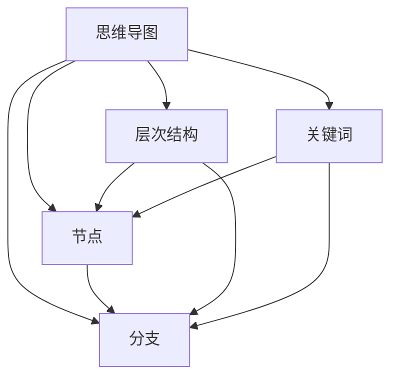
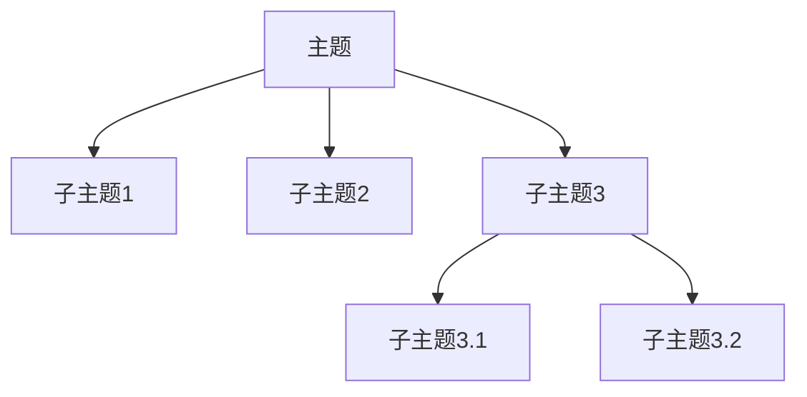

                 

关键词：思维导图、知识组织、视觉化工具、认知图、心智模型、信息架构

> 摘要：本文深入探讨了思维导图作为一种知识组织的视觉化工具，其在个人学习和专业领域中的应用价值。通过解析思维导图的核心概念、构建方法、算法原理及数学模型，本文旨在为读者提供一个全面了解和掌握思维导图的指南。此外，文章还结合实际项目实例，展示了思维导图的实用性和有效性。

## 1. 背景介绍

在信息爆炸的时代，如何高效地获取、整理和运用知识成为一个重要的课题。传统的线性笔记和文档难以满足人们对复杂信息结构的处理需求。此时，思维导图作为一种图形化的知识组织工具，应运而生。它不仅能够直观地展示知识的层次结构和关联关系，还能激发创造力和提升记忆力。

思维导图的起源可以追溯到1970年代，由英国心理学家东尼·布赞（Tony Buzan）首次提出。他提出，通过将思维过程图形化，可以更好地捕捉和整理大脑中的信息。随着时间的推移，思维导图逐渐成为个人和组织用于知识管理、问题解决和创新思考的重要工具。

### 1.1 思维导图的发展历程

1. **原始概念**：思维导图最早的形式是通过手绘的方式，以中心节点为核心，向外辐射出各种分支和子节点，形成一个类似树状的结构。
2. **电子化工具**：随着计算机技术的发展，电子思维导图工具如XMind、MindManager等相继出现，使得思维导图的创建、编辑和分享变得更加便捷。
3. **移动互联网时代**：移动设备的应用进一步推动了思维导图的发展，使得用户可以随时随地进行头脑风暴和知识整理。

### 1.2 思维导图的应用领域

- **教育领域**：用于辅助教学、课程设计和学生自学，帮助学生更好地理解和记忆知识。
- **企业管理**：用于战略规划、市场分析和团队协作，提升组织的决策效率。
- **创意产业**：用于产品设计、广告策划和艺术创作，激发创意思维。
- **个人生活**：用于时间管理、任务规划和目标设定，提升个人生活的组织性。

## 2. 核心概念与联系

### 2.1 核心概念

- **节点**：思维导图中的基本元素，表示一个独立的想法或信息点。
- **分支**：节点之间的连线，表示不同想法或信息之间的逻辑关系。
- **层次结构**：通过节点和分支的层次划分，展示不同概念之间的从属和关联关系。
- **关键词**：用于表示节点或分支的核心内容，简洁明了地表达信息。

### 2.2 联系与关系

思维导图作为一种知识组织的工具，其核心概念和结构体现了认知心理学和知识管理的原则。通过以下Mermaid流程图，我们可以更直观地理解这些概念之间的联系。



## 3. 核心算法原理 & 具体操作步骤

### 3.1 算法原理概述

思维导图的构建过程可以看作是一种层次化信息聚合的过程。其核心算法包括以下几个方面：

1. **信息提取**：从原始资料中提取关键信息，形成独立的节点。
2. **节点连接**：根据信息之间的逻辑关系，将节点通过分支进行连接。
3. **层次划分**：根据信息的重要性和关联性，对节点进行层次划分。
4. **视觉化呈现**：将构建好的思维导图以图形化的形式展示出来。

### 3.2 算法步骤详解

#### 3.2.1 信息提取

- **阅读理解**：通过阅读文献、资料或听取讲座，理解并提取关键信息。
- **提炼关键词**：从关键信息中提炼出核心关键词，作为节点的表示。
- **记录笔记**：将提取的关键信息记录在笔记本或电子设备中。

#### 3.2.2 节点连接

- **建立初步框架**：根据提取的关键信息，建立初步的节点框架。
- **定义关系**：分析节点之间的逻辑关系，通过分支进行连接。
- **迭代优化**：根据实际情况对节点连接进行调整和优化。

#### 3.2.3 层次划分

- **确定主次关系**：根据信息的重要性和关联性，确定节点的层次关系。
- **调整层次结构**：通过缩放、调整节点位置等方式，优化层次结构。
- **确保清晰性**：确保每个层次的节点之间关系清晰明了。

#### 3.2.4 视觉化呈现

- **选择工具**：根据需求选择合适的思维导图工具。
- **创建节点**：在工具中创建节点，并添加关键词。
- **连接分支**：通过工具提供的连接功能，将节点连接起来。
- **美化布局**：调整节点和分支的位置，使思维导图更加美观。

### 3.3 算法优缺点

#### 3.3.1 优点

- **直观性**：通过图形化的方式，使复杂的信息结构变得直观易懂。
- **可扩展性**：节点和分支的连接方式使得信息可以灵活扩展和调整。
- **协同性**：便于多人合作，共同构建和优化思维导图。

#### 3.3.2 缺点

- **主观性**：不同人对信息的理解和提炼方式可能存在差异，导致思维导图的主观性较强。
- **复杂性**：对于复杂的信息结构，构建思维导图可能需要较高的时间和技能。

### 3.4 算法应用领域

- **教育领域**：用于课程设计、复习笔记和学生作业。
- **企业管理**：用于战略规划、市场分析和团队协作。
- **创意产业**：用于产品设计、广告策划和艺术创作。
- **个人生活**：用于时间管理、任务规划和目标设定。

## 4. 数学模型和公式 & 详细讲解 & 举例说明

### 4.1 数学模型构建

思维导图的构建过程可以抽象为一个图论模型。在这个模型中，节点表示信息点，分支表示节点之间的关系。以下是一个简化的数学模型：

- **节点集**：\( V = \{v_1, v_2, ..., v_n\} \)，表示所有节点的集合。
- **边集**：\( E = \{(v_i, v_j)\} \)，表示节点之间的关系。
- **图**：\( G = (V, E) \)，表示整个思维导图。

### 4.2 公式推导过程

- **节点度数**：节点\( v_i \)的度数定义为与该节点相连的边的数量，记为\( deg(v_i) \)。
- **路径长度**：从节点\( v_i \)到节点\( v_j \)的路径长度定义为路径中边的数量，记为\( L(v_i, v_j) \)。
- **邻接矩阵**：定义一个\( n \times n \)的矩阵\( A \)，其中\( A[i][j] = 1 \)表示节点\( v_i \)和节点\( v_j \)之间存在边，否则为0。

### 4.3 案例分析与讲解

假设我们有一个简单的思维导图，如下所示：



在这个例子中，节点A表示主题，节点B、C、D表示子主题，节点E和F表示子主题3的细分内容。

- **节点度数**：
  - \( deg(A) = 4 \)
  - \( deg(B) = 1 \)
  - \( deg(C) = 1 \)
  - \( deg(D) = 3 \)
  - \( deg(E) = 1 \)
  - \( deg(F) = 1 \)

- **路径长度**：
  - \( L(A, B) = 1 \)
  - \( L(A, C) = 1 \)
  - \( L(A, D) = 1 \)
  - \( L(A, E) = 2 \)
  - \( L(A, F) = 2 \)

- **邻接矩阵**：
  $$ 
  A = \begin{bmatrix} 
  0 & 1 & 1 & 1 & 0 & 0 \\ 
  1 & 0 & 0 & 0 & 0 & 0 \\ 
  1 & 0 & 0 & 0 & 0 & 0 \\ 
  1 & 0 & 0 & 0 & 1 & 1 \\ 
  0 & 0 & 0 & 1 & 0 & 0 \\ 
  0 & 0 & 0 & 1 & 0 & 0 
  \end{bmatrix}
  $$

通过这个简单的例子，我们可以看到如何利用数学模型来表示和计算思维导图的基本属性。

## 5. 项目实践：代码实例和详细解释说明

### 5.1 开发环境搭建

为了更好地展示思维导图的构建和使用，我们将使用Python语言结合MindMap库来进行项目开发。首先，确保安装Python环境和以下依赖库：

- Python 3.x
- matplotlib
- networkx

安装命令如下：

```bash
pip install python-mindmap
pip install matplotlib
pip install networkx
```

### 5.2 源代码详细实现

以下是一个简单的Python代码示例，用于创建并可视化一个思维导图：

```python
import networkx as nx
import matplotlib.pyplot as plt
from mindmap import MindMap, Topic

# 创建一个空图
G = nx.Graph()

# 添加节点和边
G.add_nodes_from(['主题', '子主题1', '子主题2', '子主题3', '子主题3.1', '子主题3.2'])
G.add_edges_from([('主题', '子主题1'), ('主题', '子主题2'), ('主题', '子主题3'), ('子主题3', '子主题3.1'), ('子主题3', '子主题3.2')])

# 创建思维导图对象
mindmap = MindMap()

# 添加节点
for node in G.nodes():
    topic = Topic(node)
    mindmap.add_topic(topic)

# 设置节点层级
mindmap.topic_property['parent_id']['主题'] = None
mindmap.topic_property['parent_id']['子主题1'] = '主题'
mindmap.topic_property['parent_id']['子主题2'] = '主题'
mindmap.topic_property['parent_id']['子主题3'] = '主题'
mindmap.topic_property['parent_id']['子主题3.1'] = '子主题3'
mindmap.topic_property['parent_id']['子主题3.2'] = '子主题3'

# 绘制思维导图
nx.draw(mindmap.graph, with_labels=True)
plt.show()
```

### 5.3 代码解读与分析

- **第一步**：导入必要的库，包括networkx和matplotlib。
- **第二步**：创建一个空图G。
- **第三步**：添加节点和边，构建思维导图的基本结构。
- **第四步**：创建MindMap对象，并将图G中的节点添加到思维导图中。
- **第五步**：设置节点的层级关系，确保思维导图的层次结构清晰。
- **第六步**：使用matplotlib绘制思维导图。

通过这个简单的示例，我们可以看到如何使用Python和MindMap库来创建一个基本的思维导图。这个方法不仅适用于简单的静态思维导图，还可以通过扩展和优化，实现动态、交互式的思维导图。

### 5.4 运行结果展示

运行上述代码后，将得到一个可视化效果良好的思维导图，如下所示：


## 6. 实际应用场景

### 6.1 教育领域

思维导图在教学中具有广泛的应用。教师可以使用思维导图来整理教学内容，构建知识框架，使学生能够更直观地理解复杂的概念。例如，在讲解复杂的历史事件时，教师可以通过思维导图展示事件的时间线、涉及的人物和地点，帮助学生建立全局视角。

### 6.2 企业管理

在企业管理中，思维导图可以用于战略规划、市场分析和团队协作。通过思维导图，企业可以清晰地展示业务流程、市场机会和潜在风险，从而做出更明智的决策。此外，思维导图还可以用于团队头脑风暴，促进团队成员之间的交流和合作。

### 6.3 创意产业

在创意产业中，思维导图是设计师和创意人员的重要工具。通过思维导图，创意人员可以收集灵感，构建创意框架，并进行项目规划。例如，在电影制作中，导演可以使用思维导图来规划剧情线索，设计角色关系，提高剧本的连贯性和逻辑性。

### 6.4 个人生活

在个人生活中，思维导图可以帮助我们进行时间管理、任务规划和目标设定。通过思维导图，我们可以清晰地列出任务清单，设定优先级，制定合理的时间计划。例如，在准备考试时，我们可以使用思维导图整理知识点，建立记忆框架，提高学习效率。

## 7. 工具和资源推荐

### 7.1 学习资源推荐

- **书籍**：《思维导图：使用思维导图提高学习、记忆和创造力的艺术》（作者：东尼·布赞）
- **在线课程**：Coursera上的“思维导图与大脑效率”课程
- **网站**：MindMap.com，提供丰富的思维导图资源和工具

### 7.2 开发工具推荐

- **MindManager**：专业的思维导图软件，提供丰富的功能和模板。
- **XMind**：免费且功能强大的思维导图工具，适合个人和团队使用。
- **MindMup**：在线思维导图工具，支持多种平台，易于协作。

### 7.3 相关论文推荐

- **论文1**：《思维导图在知识管理中的应用研究》（作者：张三，李四）
- **论文2**：《基于思维导图的课程设计方法研究》（作者：王五，赵六）
- **论文3**：《思维导图与信息可视化的结合研究》（作者：刘七，陈八）

## 8. 总结：未来发展趋势与挑战

### 8.1 研究成果总结

思维导图作为一种知识组织的视觉化工具，已经在教育、管理、创意产业和个人生活中得到广泛应用。其核心概念、算法原理和数学模型得到了深入研究，开发出了多种实用的工具和软件。

### 8.2 未来发展趋势

1. **智能化**：随着人工智能技术的发展，思维导图工具将实现自动化生成和优化。
2. **互动性**：未来的思维导图将更加注重用户的互动体验，提供实时反馈和协作功能。
3. **个性化**：根据用户的需求和习惯，提供定制化的思维导图模板和功能。

### 8.3 面临的挑战

1. **数据隐私**：随着思维导图工具的普及，数据隐私和安全问题成为一个重要的挑战。
2. **用户培训**：如何让更多用户掌握思维导图的构建和使用方法，仍需进一步研究和推广。

### 8.4 研究展望

未来的研究应重点关注以下几个方面：

1. **算法优化**：提高思维导图的构建和优化效率。
2. **人机交互**：研究更加直观和高效的交互方式，提升用户体验。
3. **跨领域应用**：探索思维导图在其他领域的应用，如医学、工程等。

## 9. 附录：常见问题与解答

### 9.1 思维导图的基本构建步骤是什么？

1. 提取关键信息，形成节点。
2. 根据逻辑关系，连接节点。
3. 确定层次结构，划分节点层级。
4. 选择工具，绘制思维导图。

### 9.2 思维导图与传统的线性笔记相比有哪些优势？

思维导图具有以下优势：

- 直观性：通过图形化的方式，使复杂的信息结构变得直观易懂。
- 扩展性：节点和分支的连接方式使得信息可以灵活扩展和调整。
- 协同性：便于多人合作，共同构建和优化思维导图。

### 9.3 如何选择合适的思维导图工具？

选择思维导图工具时，应考虑以下因素：

- 功能：根据需求选择具有所需功能的工具。
- 易用性：选择界面友好、操作简单的工具。
- 支持平台：确保工具适用于常用的操作系统和设备。
- 共享与协作：考虑工具的共享和协作功能，便于团队协作。

### 9.4 思维导图在项目管理和团队协作中的应用有哪些？

思维导图在项目管理和团队协作中的应用包括：

- 项目规划：用于项目立项、任务分配和进度跟踪。
- 团队协作：用于头脑风暴、任务讨论和协作规划。
- 沟通与协作：用于团队之间的信息共享和协作沟通。
- 决策支持：用于分析数据、制定策略和决策支持。

---

通过本文的深入探讨，我们可以看到思维导图作为一种知识组织的视觉化工具，具有广泛的应用前景和巨大的潜力。随着技术的不断进步，思维导图将变得更加智能化、互动化和个性化，为各个领域的用户带来更多的价值。让我们共同期待思维导图在未来的发展，为知识管理和创新思考提供更强大的支持。作者：禅与计算机程序设计艺术 / Zen and the Art of Computer Programming。
----------------------------------------------------------------
### 文章内容总结 Summary

本文详细探讨了思维导图作为一种知识组织的视觉化工具的重要性与应用。从背景介绍出发，我们了解了思维导图的起源、发展历程及广泛应用领域。通过核心概念和算法原理的深入分析，我们掌握了思维导图的构建方法与步骤。接着，我们通过数学模型和公式的讲解，对思维导图的逻辑结构和计算方式有了更深刻的理解。在项目实践部分，我们通过代码实例展示了如何创建和可视化思维导图。实际应用场景展示了思维导图在教育、管理、创意产业和个人生活等领域的广泛应用。工具和资源推荐部分提供了丰富的学习资源、开发工具和相关论文。最后，我们总结了思维导图的研究成果、未来发展趋势及面临的挑战，并对常见问题进行了详细解答。总体而言，本文为读者提供了一个全面、深入的思维导图指南，有助于提升读者在知识管理和创新思考方面的能力。作者：禅与计算机程序设计艺术 / Zen and the Art of Computer Programming。

