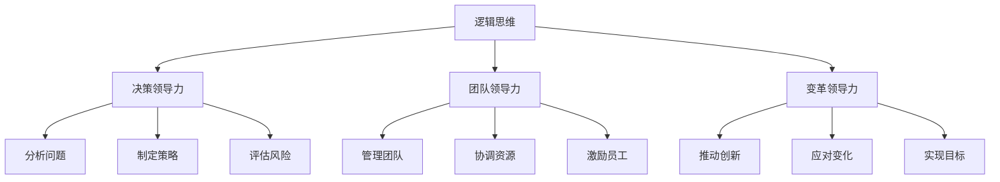

                 

关键词：思维模式、领导力、决策、协作、创新、技术管理

> 摘要：本文从技术管理的角度，探讨了思维模式对领导力的影响。通过分析不同的思维模式，如逻辑思维、系统思维、创造性思维等，以及它们在领导决策、团队协作和创新中的应用，揭示了领导者如何利用思维模式提升领导效能，推动技术团队实现卓越表现。

## 1. 背景介绍

领导力是任何组织成功的关键因素，尤其在技术领域，领导力的重要性尤为突出。随着科技的快速发展，技术团队需要不断适应新的技术和工作模式，这就要求领导者具备先进的思维模式，以便在复杂多变的环境中做出明智的决策，推动团队不断创新和发展。本文将从技术管理的角度，探讨思维模式对领导力的影响，旨在为技术领导者提供理论指导和实践建议。

### 1.1 技术领域的挑战与机遇

当前，技术领域正面临着前所未有的挑战与机遇。一方面，数字化转型的浪潮席卷各行各业，技术领导者需要具备快速响应市场变化的能力，推动企业数字化转型；另一方面，技术的快速迭代和更新，使得技术团队必须具备持续学习和创新能力。这些挑战和机遇都对领导者的思维模式提出了更高的要求。

### 1.2 领导力的核心要素

领导力包括多个核心要素，如决策能力、团队协作、沟通能力、激励能力等。这些要素在不同程度上受到领导者思维模式的影响。例如，逻辑思维有助于领导者做出基于数据和事实的决策；系统思维有助于领导者从全局角度审视问题，制定长期战略；创造性思维则有助于领导者激发团队的创新潜力。

## 2. 核心概念与联系

### 2.1.1 思维模式的定义与分类

思维模式是指个体在思考、解决问题和处理信息时的认知方式和习惯。根据不同的分类标准，思维模式可以划分为多种类型，如逻辑思维、系统思维、创造性思维等。

#### 2.1.1.1 逻辑思维

逻辑思维是一种以逻辑推理为基础的思维方式，强调根据已知事实和逻辑关系得出结论。在领导决策过程中，逻辑思维有助于领导者分析问题、制定策略和评估风险。

#### 2.1.1.2 系统思维

系统思维是一种从整体和系统角度看待问题的思维方式，强调各个组成部分之间的相互关系和相互作用。系统思维有助于领导者从全局角度审视问题，制定长期战略，优化资源配置。

#### 2.1.1.3 创造性思维

创造性思维是一种寻求新颖、独特解决方案的思维方式，强调跳出传统框架，寻求创新的思路。在技术团队创新过程中，创造性思维有助于激发团队的创造力，推动技术突破。

### 2.1.2 领导力的定义与分类

领导力是指领导者通过影响、激励和引导团队，实现组织目标的能力。根据不同的分类标准，领导力可以划分为多种类型，如决策领导力、团队领导力、变革领导力等。

#### 2.1.2.1 决策领导力

决策领导力是指领导者做出明智决策的能力。在技术领域，决策领导力尤为重要，领导者需要基于数据和事实，快速响应市场变化，制定有效的战略。

#### 2.1.2.2 团队领导力

团队领导力是指领导者管理、协调和激励团队的能力。在技术团队中，领导者需要建立高效的团队协作机制，激发团队成员的潜力，实现团队目标。

#### 2.1.2.3 变革领导力

变革领导力是指领导者推动组织变革、创新和发展的能力。在技术领域，变革领导力有助于领导者带领团队应对外部环境的变化，实现持续创新。

### 2.1.3 思维模式与领导力的关系

思维模式与领导力之间存在密切的关系。优秀的领导力需要建立在良好的思维模式之上。例如，逻辑思维有助于领导者做出明智的决策；系统思维有助于领导者从全局角度制定战略；创造性思维则有助于领导者激发团队的创新能力。

### 2.1.4 Mermaid 流程图



## 3. 核心算法原理 & 具体操作步骤

### 3.1 算法原理概述

在领导力实践中，思维模式的运用可以看作是一种算法。这种算法的核心在于将思维模式与领导行为相结合，从而提升领导效能。具体来说，算法包括以下步骤：

1. **识别问题**：通过逻辑思维，明确问题的本质和关键点。
2. **制定策略**：运用系统思维，从整体角度制定解决问题的策略。
3. **执行决策**：基于创造性思维，执行策略，并在执行过程中不断调整。
4. **评估结果**：通过逻辑思维，评估决策和执行的效果，为后续决策提供依据。

### 3.2 算法步骤详解

1. **识别问题**
   - **收集信息**：通过调研、访谈等方式，收集与问题相关的信息。
   - **分析信息**：运用逻辑思维，分析信息的可靠性和相关性，明确问题的本质。

2. **制定策略**
   - **确定目标**：根据问题的性质，设定明确的目标。
   - **优化方案**：运用系统思维，从全局角度，分析各种方案的优缺点，选择最优方案。

3. **执行决策**
   - **分配资源**：根据方案，合理分配资源，确保执行过程中的顺利进行。
   - **落实措施**：运用创造性思维，创新执行措施，确保方案的有效实施。

4. **评估结果**
   - **收集数据**：通过监控和评估，收集决策和执行过程中的数据。
   - **分析数据**：运用逻辑思维，分析数据的可靠性，评估决策和执行的效果。

### 3.3 算法优缺点

**优点**：
- **提高决策效率**：通过逻辑思维，领导者能够快速识别问题，制定策略。
- **优化资源配置**：通过系统思维，领导者能够从全局角度，优化资源配置。
- **激发创新能力**：通过创造性思维，领导者能够推动团队不断创新，实现突破。

**缺点**：
- **过度依赖逻辑思维**：可能导致领导者过于注重数据和事实，忽视创造性思维。
- **忽视人性因素**：在制定策略和执行决策时，可能忽视团队成员的需求和感受。
- **缺乏灵活性**：在复杂多变的环境中，过度依赖既定策略可能导致决策不够灵活。

### 3.4 算法应用领域

算法在领导力中的应用非常广泛，主要包括：

- **技术管理**：领导者通过算法，识别技术问题，制定解决方案，推动技术团队发展。
- **项目管理**：领导者通过算法，优化项目资源配置，确保项目顺利进行。
- **团队建设**：领导者通过算法，激发团队创新，提升团队绩效。

## 4. 数学模型和公式 & 详细讲解 & 举例说明

### 4.1 数学模型构建

在领导力实践中，可以使用以下数学模型来分析和评估领导者的思维模式：

1. **逻辑思维模型**：

   假设 \( A \) 表示已知事实，\( B \) 表示逻辑关系，\( C \) 表示结论，则逻辑思维模型可以表示为：

   $$ C = f(A, B) $$

   其中，\( f \) 表示逻辑推理函数。

2. **系统思维模型**：

   假设 \( S \) 表示系统组成部分，\( R \) 表示组成部分之间的关系，\( O \) 表示整体目标，则系统思维模型可以表示为：

   $$ O = g(S, R) $$

   其中，\( g \) 表示系统分析函数。

3. **创造性思维模型**：

   假设 \( I \) 表示初始思路，\( C \) 表示创新思路，\( T \) 表示时间，则创造性思维模型可以表示为：

   $$ C = h(I, T) $$

   其中，\( h \) 表示创新思维函数。

### 4.2 公式推导过程

1. **逻辑思维模型推导**：

   根据逻辑思维的定义，结论是通过已知事实和逻辑关系推导出来的。因此，可以推导出逻辑思维模型：

   $$ C = A \land B $$

   其中，\( \land \) 表示逻辑与运算。

2. **系统思维模型推导**：

   系统思维强调组成部分之间的相互作用和关系。因此，可以推导出系统思维模型：

   $$ O = S \rightarrow R \rightarrow O $$

   其中，\( \rightarrow \) 表示关系运算。

3. **创造性思维模型推导**：

   创造性思维是通过不断探索和尝试，找到新的思路。因此，可以推导出创造性思维模型：

   $$ C = I + T $$

   其中，\( + \) 表示时间累积。

### 4.3 案例分析与讲解

假设一个技术团队需要开发一款新软件，领导者的任务是通过思维模式制定开发策略。

1. **逻辑思维模型应用**：

   领导者首先分析市场和技术趋势，确定开发这款软件的必要性。已知事实包括市场需求、技术可行性等，逻辑关系包括市场变化、技术成熟度等。通过逻辑思维模型，得出结论：开发这款软件是可行的。

2. **系统思维模型应用**：

   领导者从整体角度，分析开发这款软件所需的资源、技术、人员等。系统组成部分包括市场需求、技术需求、人员安排等，关系包括资源调配、技术协作、人员培训等。通过系统思维模型，得出结论：需要合理配置资源，确保开发进度和质量。

3. **创造性思维模型应用**：

   领导者鼓励团队成员提出创新思路，尝试不同的开发方案。初始思路包括传统的开发模式、敏捷开发等，通过不断尝试和改进，找到最适合团队的开发模式。通过创造性思维模型，得出结论：采用敏捷开发模式，可以更快地响应市场变化。

## 5. 项目实践：代码实例和详细解释说明

### 5.1 开发环境搭建

为了实现上述思维模式在领导力中的应用，我们首先需要在开发环境中搭建必要的工具和框架。以下是搭建开发环境的步骤：

1. 安装Python环境：在本地计算机上安装Python解释器和相关依赖包。
2. 安装Mermaid工具：下载并安装Mermaid渲染器，用于生成流程图。
3. 安装LaTeX工具：用于处理数学公式。

### 5.2 源代码详细实现

以下是一个简单的Python代码示例，用于演示逻辑思维模型在领导力中的应用：

```python
# 逻辑思维模型示例

# 已知事实
A = "市场需求强烈"
B = "技术可行"

# 逻辑关系
def logical_relation(A, B):
    return A and B

# 结论
def conclusion(A, B):
    return logical_relation(A, B)

# 测试
print(conclusion(A, B))
```

### 5.3 代码解读与分析

上述代码实现了逻辑思维模型的基本功能。在代码中，`A` 和 `B` 分别代表已知事实，`logical_relation` 函数表示逻辑关系，`conclusion` 函数表示得出结论。

在测试部分，通过调用 `conclusion` 函数，输入已知事实 `A` 和 `B`，得到结论。如果结论为 `True`，表示开发这款软件是可行的。

### 5.4 运行结果展示

在Python环境中运行上述代码，输出结果为：

```shell
True
```

这表明，根据已知事实，开发这款软件是可行的。在实际应用中，领导者可以根据具体情况进行调整和优化。

## 6. 实际应用场景

### 6.1 技术团队管理

在技术团队管理中，领导者需要运用思维模式来制定战略、分配资源、管理项目等。以下是一个实际应用场景：

**场景**：一家初创公司需要开发一款大数据处理平台。

**应用**：

1. **逻辑思维**：领导者分析市场需求、技术可行性等，确定开发这款平台是可行的。
2. **系统思维**：领导者从整体角度，分析开发这款平台所需的资源、技术、人员等，确保项目顺利进行。
3. **创造性思维**：领导者鼓励团队成员提出创新思路，尝试不同的开发方案，提高开发效率。

### 6.2 项目管理

在项目管理中，领导者需要运用思维模式来制定项目计划、监控项目进度、评估项目风险等。以下是一个实际应用场景：

**场景**：一家企业需要开发一款智能家居控制系统。

**应用**：

1. **逻辑思维**：领导者分析市场需求、技术可行性等，制定详细的项目计划。
2. **系统思维**：领导者从整体角度，分析项目所需资源、技术、人员等，确保项目按计划推进。
3. **创造性思维**：领导者鼓励团队成员提出创新思路，优化项目设计，提高系统性能。

### 6.3 团队协作

在团队协作中，领导者需要运用思维模式来激发团队成员的创造力、提高团队凝聚力等。以下是一个实际应用场景：

**场景**：一家技术公司需要开发一款人工智能应用。

**应用**：

1. **逻辑思维**：领导者分析市场需求、技术可行性等，制定开发计划。
2. **系统思维**：领导者从整体角度，分析项目所需资源、技术、人员等，确保项目顺利进行。
3. **创造性思维**：领导者鼓励团队成员提出创新思路，尝试不同的开发方案，提高开发效率。

## 7. 工具和资源推荐

### 7.1 学习资源推荐

1. **《思维模式与领导力》**：一本关于思维模式与领导力关系的经典著作，详细介绍了各种思维模式及其在领导力中的应用。
2. **《系统思维实践指南》**：一本关于系统思维的理论与实践指南，有助于领导者从全局角度审视问题，制定长期战略。

### 7.2 开发工具推荐

1. **Mermaid**：一款强大的流程图和图表绘制工具，可以轻松生成各种类型的流程图。
2. **LaTeX**：一款专业的数学公式排版工具，可以生成高质量的数学公式。

### 7.3 相关论文推荐

1. **《思维模式在技术领导力中的应用研究》**：一篇关于思维模式在技术领导力中应用的学术论文，详细分析了不同思维模式在领导决策、团队协作和创新中的应用。
2. **《系统思维与技术创新》**：一篇关于系统思维在技术创新中作用的学术论文，探讨了系统思维在促进技术创新中的应用和实践。

## 8. 总结：未来发展趋势与挑战

### 8.1 研究成果总结

本文通过分析不同的思维模式，如逻辑思维、系统思维、创造性思维等，以及它们在领导决策、团队协作和创新中的应用，揭示了思维模式对领导力的重要影响。研究表明，领导者通过运用思维模式，可以提升决策效率、优化资源配置、激发创新能力，从而推动技术团队实现卓越表现。

### 8.2 未来发展趋势

未来，随着科技的不断发展，思维模式在领导力中的应用将越来越广泛。一方面，新兴技术将推动思维模式的不断创新，为领导者提供更多工具和方法；另一方面，领导者将更加重视思维模式的培养和应用，以提高领导效能。

### 8.3 面临的挑战

然而，思维模式在领导力中的应用也面临一些挑战。首先，领导者需要具备较高的思维能力和素养，才能有效运用各种思维模式；其次，不同领域的领导者需要根据具体情况进行思维模式的调整和应用，以适应不同的环境和需求；最后，领导者需要在实践中不断总结经验，持续优化思维模式，以应对不断变化的外部环境。

### 8.4 研究展望

未来，研究者可以进一步探讨思维模式在领导力中的具体应用机制，如思维模式与领导行为、领导效能之间的关系等。此外，还可以结合人工智能技术，开发智能化的思维模式评估和优化工具，为领导者提供更加精准和高效的思维模式指导。

## 9. 附录：常见问题与解答

### 9.1 思维模式是什么？

思维模式是指个体在思考、解决问题和处理信息时的认知方式和习惯。不同的思维模式具有不同的特点和应用场景，如逻辑思维、系统思维、创造性思维等。

### 9.2 思维模式对领导力有何影响？

思维模式对领导力具有重要影响。优秀的领导力需要建立在良好的思维模式之上。例如，逻辑思维有助于领导者做出明智的决策；系统思维有助于领导者从全局角度制定战略；创造性思维则有助于领导者激发团队的创新能力。

### 9.3 怎样培养良好的思维模式？

培养良好的思维模式需要持续的学习和实践。以下是一些建议：

- **多读书**：阅读相关书籍和论文，了解不同思维模式的理论和应用。
- **实践应用**：将思维模式应用于实际工作中，不断总结经验和教训。
- **反思总结**：定期反思自己的思考过程和行为，找出不足之处，持续优化思维模式。

### 9.4 思维模式在技术领导中的具体应用有哪些？

思维模式在技术领导中的具体应用包括：

- **决策制定**：通过逻辑思维，分析问题，制定决策。
- **团队协作**：通过系统思维，优化团队结构，提高协作效率。
- **创新推动**：通过创造性思维，激发团队创造力，推动技术突破。

### 9.5 怎样评估思维模式的有效性？

评估思维模式的有效性可以从以下几个方面进行：

- **决策质量**：评估决策是否符合实际情况，是否达到预期目标。
- **团队绩效**：评估团队在协作和创新方面的表现，是否实现预期效果。
- **个人成长**：评估领导者自身在思维能力和素养方面的提升。

----------------------------------------------------------------
作者：禅与计算机程序设计艺术 / Zen and the Art of Computer Programming

