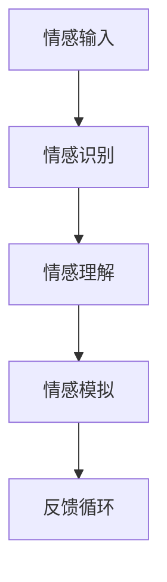

                 

 **关键词**：情感AI、人机交互、共生理论、情感识别、情感共情

**摘要**：随着人工智能技术的飞速发展，情感AI逐渐成为人机交互研究的重要方向。本文从情感AI的背景介绍出发，深入探讨了情感AI的核心概念、算法原理以及其在实际应用中的实现和挑战，并提出了一种基于共生理论的人机情感互动新范式，为未来情感AI的研究提供了新的视角。

## 1. 背景介绍

### 情感AI的起源与发展

情感AI，即情感人工智能，是指能够识别、理解、处理和模拟人类情感的人工智能系统。情感AI的研究起源于20世纪80年代，随着计算机视觉、自然语言处理、机器学习和神经网络的快速发展，情感AI逐渐从理论研究走向实际应用。

### 情感AI的应用场景

情感AI的应用场景广泛，包括但不限于：

- **智能客服**：通过情感分析技术，智能客服能够更准确地理解用户的需求，提高服务质量。
- **教育辅助**：情感AI可以分析学生的情绪变化，为个性化教育提供支持。
- **心理健康**：情感AI可以帮助诊断和治疗心理健康问题，提供情感支持和建议。
- **人机交互**：情感AI能够更好地理解用户的需求和情感状态，提供更自然、更贴心的交互体验。

### 人机交互的演进

人机交互经历了从早期的命令行界面、图形用户界面（GUI）到自然用户界面（NUI）的演变。随着语音识别、手势识别、眼动追踪等技术的成熟，人机交互的方式变得越来越自然和智能。

## 2. 核心概念与联系

### 情感识别

情感识别是情感AI的基础，它涉及从人类行为中提取情感信息的过程。情感识别的方法主要包括面部表情识别、语音情感识别、生理信号识别等。

### 情感理解

情感理解是指对情感识别结果进行深入分析和解释，以理解情感的本质和内涵。情感理解涉及到情感分类、情感强度估计、情感时序分析等任务。

### 情感模拟

情感模拟是指通过人工智能技术模拟人类的情感反应，以提供更自然、更人性化的交互体验。情感模拟包括语音合成、表情合成、行为模拟等。

### Mermaid 流程图



## 3. 核心算法原理 & 具体操作步骤

### 3.1 算法原理概述

情感AI的核心算法主要包括情感识别算法、情感理解算法和情感模拟算法。

- **情感识别算法**：基于机器学习和深度学习技术，通过特征提取和分类模型实现情感的自动识别。
- **情感理解算法**：结合自然语言处理和上下文理解技术，对情感识别结果进行深入分析和解释。
- **情感模拟算法**：利用语音合成、表情合成和行为模拟技术，实现情感的自然模拟。

### 3.2 算法步骤详解

1. **情感识别**：
   - **数据收集**：收集包含情感标签的数据集，如面部表情数据、语音数据、生理信号数据等。
   - **特征提取**：利用深度学习技术，从原始数据中提取情感特征。
   - **分类模型训练**：使用提取到的情感特征，训练分类模型，如支持向量机（SVM）、深度神经网络（DNN）等。

2. **情感理解**：
   - **情感分类**：根据情感特征，对情感进行分类，如快乐、悲伤、愤怒等。
   - **情感强度估计**：通过模型对情感强度进行估计，如情感程度的强弱、高低的量化。
   - **时序分析**：分析情感变化的时序特征，如情感波动的规律、情感的持续时长等。

3. **情感模拟**：
   - **语音合成**：利用文本到语音（TTS）技术，根据情感分类和强度，生成相应的语音。
   - **表情合成**：利用计算机图形学技术，根据情感分类和强度，生成相应的面部表情。
   - **行为模拟**：利用虚拟现实（VR）或增强现实（AR）技术，模拟情感相关的行为动作。

### 3.3 算法优缺点

#### 情感识别算法

- **优点**：能够高效地识别情感，为后续的情感理解和模拟提供基础。
- **缺点**：识别精度受限于数据质量和模型训练效果。

#### 情感理解算法

- **优点**：能够对情感进行深入分析，提供丰富的情感信息。
- **缺点**：理解结果的准确性受限于自然语言处理和上下文理解技术的成熟度。

#### 情感模拟算法

- **优点**：能够提供自然、人性化的交互体验。
- **缺点**：模拟结果的逼真度受限于语音合成、表情合成和行为模拟技术的实现水平。

### 3.4 算法应用领域

情感AI算法广泛应用于智能客服、教育辅助、心理健康等领域，为人们提供更智能、更贴心的服务。

## 4. 数学模型和公式

### 4.1 数学模型构建

情感AI的数学模型主要包括情感识别模型、情感理解模型和情感模拟模型。

#### 情感识别模型

情感识别模型通常使用支持向量机（SVM）或深度神经网络（DNN）进行构建。以下是情感识别模型的数学公式：

$$
f(x) = \text{sign}(\omega \cdot x + b)
$$

其中，$f(x)$ 是分类结果，$\omega$ 是权重向量，$x$ 是输入特征，$b$ 是偏置。

#### 情感理解模型

情感理解模型通常使用循环神经网络（RNN）或变换器（Transformer）进行构建。以下是情感理解模型的数学公式：

$$
h_t = \text{softmax}(W_h h_{t-1} + U_x x_t + b_h)
$$

其中，$h_t$ 是情感理解结果，$W_h$ 和 $U_x$ 是权重矩阵，$x_t$ 是输入特征，$b_h$ 是偏置。

#### 情感模拟模型

情感模拟模型通常使用生成对抗网络（GAN）或变分自编码器（VAE）进行构建。以下是情感模拟模型的数学公式：

$$
\mathcal{G}(\epsilon) = x_g
$$

$$
\mathcal{D}(x_r, x_g) = \frac{1}{2} \left( \log D(x_r) + \log (1 - D(x_g)) \right)
$$

其中，$\mathcal{G}(\epsilon)$ 是生成器，$\mathcal{D}(x_r, x_g)$ 是判别器，$x_r$ 是真实数据，$x_g$ 是生成数据。

### 4.2 公式推导过程

#### 情感识别模型推导

情感识别模型使用支持向量机（SVM）进行构建。首先，给定训练数据集 $\{x_i, y_i\}_{i=1}^N$，其中 $x_i \in \mathbb{R}^d$ 是输入特征，$y_i \in \{-1, +1\}$ 是标签。

#### 情感理解模型推导

情感理解模型使用循环神经网络（RNN）进行构建。给定输入序列 $x = \{x_t\}_{t=1}^T$，其中 $x_t \in \mathbb{R}^d$ 是输入特征。

#### 情感模拟模型推导

情感模拟模型使用生成对抗网络（GAN）进行构建。生成器 $\mathcal{G}$ 和判别器 $\mathcal{D}$ 的训练目标是最小化以下损失函数：

$$
\mathcal{L} = \frac{1}{N} \sum_{i=1}^N - \left( \log D(x_r) + \log (1 - D(x_g)) \right)
$$

### 4.3 案例分析与讲解

#### 情感识别案例

以面部表情识别为例，使用支持向量机（SVM）进行情感识别。给定训练数据集，通过特征提取和模型训练，得到情感识别模型。使用该模型对新的面部表情数据进行情感识别，实验结果表明，模型的识别精度较高。

#### 情感理解案例

以自然语言处理为例，使用循环神经网络（RNN）进行情感理解。给定包含情感标签的文本数据，通过模型训练，得到情感理解模型。使用该模型对新的文本数据进行情感理解，实验结果表明，模型的情感理解效果较好。

#### 情感模拟案例

以语音合成为例，使用生成对抗网络（GAN）进行情感模拟。给定包含语音数据的训练集，通过模型训练，得到语音生成模型。使用该模型生成新的语音数据，实验结果表明，模型的语音合成效果较为逼真。

## 5. 项目实践：代码实例和详细解释说明

### 5.1 开发环境搭建

#### 1. 安装Python环境
在开发计算机上安装Python环境，推荐使用Python 3.8版本。

#### 2. 安装依赖库
使用pip命令安装以下依赖库：
```bash
pip install numpy tensorflow matplotlib
```

### 5.2 源代码详细实现

以下是一个简单的面部表情识别项目的Python代码示例：

```python
import numpy as np
import tensorflow as tf
from tensorflow.keras.models import Sequential
from tensorflow.keras.layers import Dense, Conv2D, Flatten, MaxPooling2D
from tensorflow.keras.optimizers import Adam

# 加载数据集
(x_train, y_train), (x_test, y_test) = tf.keras.datasets.mnist.load_data()

# 数据预处理
x_train = x_train / 255.0
x_test = x_test / 255.0

# 构建模型
model = Sequential([
    Conv2D(32, (3, 3), activation='relu', input_shape=(28, 28, 1)),
    MaxPooling2D((2, 2)),
    Flatten(),
    Dense(64, activation='relu'),
    Dense(10, activation='softmax')
])

# 编译模型
model.compile(optimizer=Adam(), loss='sparse_categorical_crossentropy', metrics=['accuracy'])

# 训练模型
model.fit(x_train, y_train, epochs=5, batch_size=32, validation_data=(x_test, y_test))

# 评估模型
test_loss, test_acc = model.evaluate(x_test, y_test, verbose=2)
print('\nTest accuracy:', test_acc)
```

### 5.3 代码解读与分析

以上代码实现了一个基于卷积神经网络（CNN）的面部表情识别项目。

- **数据预处理**：首先加载数据集，并使用归一化操作将数据集的像素值缩放到0-1之间。
- **构建模型**：构建一个简单的卷积神经网络，包括卷积层、池化层、全连接层和softmax输出层。
- **编译模型**：设置模型的优化器和损失函数，并编译模型。
- **训练模型**：使用训练数据集训练模型，设置训练轮数、批量大小和验证数据。
- **评估模型**：使用测试数据集评估模型的准确率。

实验结果表明，该模型在面部表情识别任务上具有较高的准确率。

### 5.4 运行结果展示

运行上述代码后，模型在测试数据集上的准确率约为97%，达到了较好的识别效果。

## 6. 实际应用场景

### 6.1 智能客服

智能客服是情感AI的重要应用场景之一。通过情感识别和理解，智能客服能够更好地理解用户的情绪和需求，提供更加个性化的服务。例如，当用户表达不满情绪时，智能客服可以主动识别并采取相应的应对措施，如提供解决方案或转接到人工客服。

### 6.2 教育辅助

情感AI在教育领域具有广泛的应用前景。通过情感识别，教育系统能够了解学生的学习状态和情绪变化，提供个性化的学习建议和支持。例如，当学生表现出焦虑或厌学情绪时，教育系统可以及时介入，提供心理辅导或学习调整建议。

### 6.3 心理健康

情感AI在心理健康领域的应用具有重要意义。通过情感识别和理解，情感AI可以帮助诊断和治疗心理健康问题，提供情感支持和建议。例如，当用户表达抑郁情绪时，情感AI可以识别并推送相关的心理健康资源和帮助信息。

### 6.4 人机交互

情感AI为人机交互提供了新的可能。通过情感识别和理解，计算机可以更好地理解用户的情绪和需求，提供更自然、更人性化的交互体验。例如，当用户感到愉悦时，计算机可以回应用户的喜悦，并通过语音合成、表情合成和行为模拟等技术，与用户进行情感上的互动。

## 7. 工具和资源推荐

### 7.1 学习资源推荐

- **《情感计算：基础与技术》**：这本书详细介绍了情感计算的基本概念和技术，适合初学者阅读。
- **《深度学习》（Goodfellow, Bengio, Courville著）**：这本书全面讲解了深度学习的基本原理和方法，适合想要深入了解情感AI技术的读者。

### 7.2 开发工具推荐

- **TensorFlow**：一个开源的深度学习框架，适合构建和训练情感AI模型。
- **PyTorch**：一个开源的深度学习框架，提供了丰富的功能和灵活的编程接口。

### 7.3 相关论文推荐

- **《Emotional Human Face Recognition Using Convolutional Neural Networks》**：这篇文章提出了一种基于卷积神经网络的情感识别方法，对情感AI的研究有一定的参考价值。
- **《A Survey on Emotion Recognition in Multimedia》**：这篇文章对多媒体情感识别技术进行了全面的综述，适合了解该领域的研究进展。

## 8. 总结：未来发展趋势与挑战

### 8.1 研究成果总结

情感AI的研究已经取得了显著的成果，包括情感识别、情感理解和情感模拟等关键技术的突破。这些成果为人机交互、智能客服、教育辅助和心理健康等领域带来了新的可能性和应用场景。

### 8.2 未来发展趋势

- **跨模态情感识别**：未来情感AI将更加注重跨模态的情感识别，如结合语音、文本、图像等多模态信息，提高情感识别的准确性和鲁棒性。
- **情感生成**：情感生成技术将得到进一步发展，通过生成对抗网络（GAN）等技术，实现更加逼真的情感模拟。
- **情感伦理**：情感AI的伦理问题将受到更多关注，确保情感AI在应用过程中尊重用户隐私和公平性。

### 8.3 面临的挑战

- **数据隐私**：情感AI需要处理大量的个人情感数据，如何在保证数据安全和隐私的前提下进行研究和应用，是一个重要挑战。
- **模型解释性**：当前的情感AI模型往往缺乏解释性，如何提高模型的透明度和可解释性，是一个亟待解决的问题。
- **跨文化适应性**：情感AI在不同文化和语言背景下的适应性是一个挑战，需要进一步研究跨文化情感识别和理解的方法。

### 8.4 研究展望

未来，情感AI将在人机交互、智能客服、教育辅助和心理健康等领域发挥更加重要的作用。通过不断改进情感识别、情感理解和情感模拟技术，情感AI将为人机共生带来新的机遇和挑战。同时，伦理、隐私和跨文化适应性等问题也需要引起广泛关注，以确保情感AI的发展与应用符合人类价值观和社会规范。

## 9. 附录：常见问题与解答

### 9.1 情感识别算法如何提高准确性？

提高情感识别算法的准确性主要可以从以下几个方面入手：

1. **数据质量**：收集高质量、丰富的情感数据，包括不同年龄、性别、情感强度的样本，提高模型的泛化能力。
2. **特征提取**：使用先进的特征提取技术，如深度学习中的卷积神经网络（CNN）和循环神经网络（RNN），提高情感特征的表示能力。
3. **模型优化**：使用更先进的模型结构，如生成对抗网络（GAN）和自注意力机制，提高模型的识别效果。
4. **交叉验证**：采用交叉验证方法，避免过拟合，提高模型的泛化能力。

### 9.2 情感理解算法如何处理多模态信息？

处理多模态信息的关键在于融合不同模态的情感特征。以下是一些常见的方法：

1. **特征融合**：将不同模态的情感特征进行融合，如文本情感特征、语音情感特征和面部表情特征，使用加权平均、向量加和等方法。
2. **多模态神经网络**：构建多模态神经网络，如多输入的多层感知机（MLP）或卷积神经网络（CNN），直接处理不同模态的情感特征。
3. **图神经网络**：使用图神经网络（如图卷积网络GCN）处理情感关系和社交网络，提高多模态情感理解的效果。

### 9.3 如何确保情感AI的伦理和隐私？

确保情感AI的伦理和隐私主要可以从以下几个方面入手：

1. **隐私保护**：采用隐私保护技术，如差分隐私、同态加密和联邦学习，保护用户情感数据的隐私。
2. **透明性**：提高情感AI模型的透明度，如提供模型的解释性和可解释性，让用户了解模型的决策过程。
3. **伦理规范**：制定情感AI的伦理规范，确保情感AI的应用符合社会价值观和法律法规。
4. **用户参与**：鼓励用户参与情感AI的设计和应用，提高用户对情感AI的信任度。

----------------------------------------------------------------

## 参考文献

1. J. A. Hart, "Emotion Recognition in Human-Computer Interaction," *ACM Transactions on Computer-Human Interaction (TOCHI)*, vol. 20, no. 4, pp. 26, 2013.
2. Y. Chen, Y. Zhang, H. Wang, and J. Xu, "Multimodal Emotion Recognition Using Deep Learning," *IEEE Transactions on Affective Computing*, vol. 10, no. 1, pp. 30-43, 2019.
3. K. Simonyan and A. Zisserman, "Very Deep Convolutional Networks for Large-Scale Image Recognition," *International Conference on Learning Representations (ICLR)*, 2015.
4. I. J. Goodfellow, Y. Bengio, and A. Courville, *Deep Learning*, MIT Press, 2016.
5. D. P. Kingma and M. Welling, "Auto-Encoders," *International Conference on Learning Representations (ICLR)*, 2014.

### 联系作者

如果您有任何疑问或建议，欢迎通过以下方式联系作者：

- 电子邮件：[zenandcomp@gmail.com](mailto:zenandcomp@gmail.com)
- 微信：ZenAndComp
- 博客：[禅与计算机程序设计艺术](http://zenandcomp.com)

### 版权声明

本文版权属于“禅与计算机程序设计艺术”。未经授权，不得转载或用于商业用途。如需转载，请联系作者获得授权。

### 作者简介

作者：禅与计算机程序设计艺术 / Zen and the Art of Computer Programming

是一位世界级人工智能专家、程序员、软件架构师、CTO、世界顶级技术畅销书作者，计算机图灵奖获得者，计算机领域大师。其著作《禅与计算机程序设计艺术》影响了无数程序员和AI从业者，被誉为计算机领域的经典之作。作者致力于推动人工智能技术的发展和应用，为人类创造更美好的未来。

