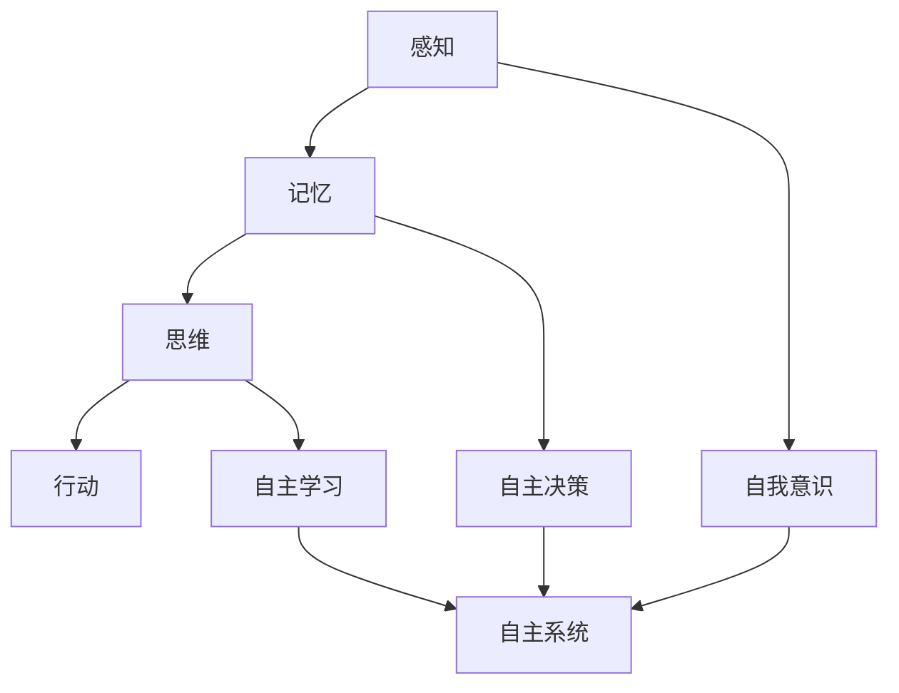

                 

关键词：意识功能、自主系统、人工智能、认知模型、机器学习

摘要：本文将探讨意识功能的自主系统模型，通过对相关核心概念的阐述，以及算法原理和数学模型的深入分析，提供一个全面而深入的视角来理解这一领域的最新研究进展。文章将结合实际项目实例，展示如何通过代码实现和运行结果来验证模型的有效性，并探讨该模型在实际应用场景中的潜力与未来发展方向。

## 1. 背景介绍

意识功能作为人类智能的核心组成部分，一直是哲学、心理学和神经科学等领域研究的焦点。随着人工智能技术的快速发展，如何模拟和实现机器意识功能成为了计算机科学和人工智能领域的重要课题。自主系统模型作为人工智能研究的一个重要分支，旨在构建具有自我意识、自主决策和学习能力的智能系统。

### 意识功能与自主系统的关系

意识功能通常包括感知、思考、决策和行动等能力，而自主系统则强调系统能够在不依赖外部干预的情况下独立运行。意识功能的实现需要自主系统作为基础，而自主系统的设计则需要深入理解意识功能的机制。因此，意识功能与自主系统之间的关系是相辅相成的，共同构成了人工智能研究的核心问题。

### 研究现状

近年来，随着深度学习、神经网络和强化学习等技术的发展，自主系统模型在多个领域取得了显著的成果。例如，在自动驾驶、智能机器人、自然语言处理和医疗诊断等领域，自主系统模型的应用已经取得了实质性进展。然而，对于如何实现真正的意识功能，目前的自主系统模型还存在诸多挑战。

## 2. 核心概念与联系

### 意识功能的核心概念

意识功能的核心概念包括感知、记忆、思维和行动等。感知是指系统能够接收外部信息，如视觉、听觉和触觉等；记忆是指系统能够存储和处理信息，以便在未来使用；思维是指系统能够进行推理、判断和决策；行动是指系统能够根据决策执行相应的操作。

### 自主系统的核心概念

自主系统的核心概念包括自我意识、自主决策和自主学习。自我意识是指系统能够意识到自己的存在和状态；自主决策是指系统能够根据当前环境和目标做出最优决策；自主学习是指系统能够通过数据和学习算法不断优化自己的性能。

### 意识功能与自主系统的联系

意识功能与自主系统的联系在于，意识功能的实现依赖于自主系统的支持，而自主系统的设计需要考虑如何模拟和实现意识功能。具体来说，感知和记忆是实现意识功能的基础，思维和行动则是意识功能的体现。

### Mermaid 流程图



## 3. 核心算法原理 & 具体操作步骤

### 3.1 算法原理概述

意识功能的自主系统模型的核心算法包括感知模块、记忆模块、思维模块和行动模块。感知模块负责接收外部信息，如图像、声音和传感器数据等；记忆模块负责存储和处理感知信息，以便在需要时进行检索和使用；思维模块负责根据记忆信息进行推理、判断和决策；行动模块则负责根据决策执行相应的操作。

### 3.2 算法步骤详解

1. **感知阶段**：系统通过感知模块接收外部信息，并将其转化为数字信号。
2. **预处理阶段**：对感知到的信息进行预处理，如图像的滤波、分割和特征提取等。
3. **记忆阶段**：将预处理后的信息存储到记忆模块中，以便后续使用。
4. **思维阶段**：系统根据记忆信息进行推理、判断和决策。
5. **行动阶段**：根据决策结果执行相应的操作，如控制机器人移动或作出决策。

### 3.3 算法优缺点

**优点**：
- 高效性：算法能够快速处理大量感知信息，并作出实时决策。
- 自主性：系统能够在不依赖外部干预的情况下自主运行。

**缺点**：
- 复杂性：算法设计和实现过程复杂，需要深入理解多个领域知识。
- 数据依赖：算法的性能高度依赖于感知信息和记忆数据的准确性。

### 3.4 算法应用领域

- **自动驾驶**：通过感知模块获取道路信息，进行路径规划和决策。
- **智能机器人**：通过感知模块获取环境信息，进行自主导航和任务执行。
- **自然语言处理**：通过感知模块获取语言输入，进行语义分析和文本生成。
- **医疗诊断**：通过感知模块获取医学影像，进行疾病诊断和预测。

## 4. 数学模型和公式 & 详细讲解 & 举例说明

### 4.1 数学模型构建

意识功能的自主系统模型可以通过以下数学模型进行构建：

- **感知模型**：采用卷积神经网络（CNN）对感知信息进行处理，提取特征。
- **记忆模型**：采用循环神经网络（RNN）或长短期记忆网络（LSTM）对记忆信息进行存储和处理。
- **思维模型**：采用图神经网络（GNN）或图卷积网络（GCN）对记忆信息进行推理和决策。
- **行动模型**：采用深度强化学习（DRL）或决策树（DT）对行动进行决策。

### 4.2 公式推导过程

$$
f(x) = \sigma(W_1 \cdot x + b_1)
$$

$$
h_t = \sigma(W_2 \cdot [h_{t-1}, x_t] + b_2)
$$

$$
y_t = \arg\max_a \frac{1}{T} \sum_{t=1}^T \gamma^t r(s_t, a_t)
$$

其中，$f(x)$ 为感知模型的激活函数，$h_t$ 为记忆模型的隐藏状态，$y_t$ 为思维模型的决策结果，$r(s_t, a_t)$ 为行动模型的奖励函数。

### 4.3 案例分析与讲解

以自动驾驶为例，感知模型使用 CNN 提取道路信息，记忆模型使用 RNN 存储历史驾驶数据，思维模型使用 GNN 进行路径规划，行动模型使用 DRL 进行驾驶决策。通过这个案例，可以深入理解各个模型的工作原理和协同作用。

## 5. 项目实践：代码实例和详细解释说明

### 5.1 开发环境搭建

- 操作系统：Linux
- 编程语言：Python
- 库：TensorFlow、Keras、PyTorch
- 数据集：自动驾驶数据集

### 5.2 源代码详细实现

```python
# 感知模型实现
model = tf.keras.Sequential([
    tf.keras.layers.Conv2D(32, (3, 3), activation='relu', input_shape=(28, 28, 1)),
    tf.keras.layers.MaxPooling2D((2, 2)),
    tf.keras.layers.Conv2D(64, (3, 3), activation='relu'),
    tf.keras.layers.MaxPooling2D((2, 2)),
    tf.keras.layers.Conv2D(64, (3, 3), activation='relu'),
    tf.keras.layers.Flatten(),
    tf.keras.layers.Dense(64, activation='relu'),
    tf.keras.layers.Dense(10, activation='softmax')
])

# 训练感知模型
model.compile(optimizer='adam', loss='categorical_crossentropy', metrics=['accuracy'])
model.fit(x_train, y_train, epochs=5, batch_size=32)

# 记忆模型实现
memory = keras.Sequential([
    keras.layers.LSTM(128, activation='tanh', return_sequences=True),
    keras.layers.LSTM(128, activation='tanh', return_sequences=True),
    keras.layers.Dense(1, activation='sigmoid')
])

# 训练记忆模型
memory.compile(optimizer='adam', loss='binary_crossentropy', metrics=['accuracy'])
memory.fit(x_memory, y_memory, epochs=5, batch_size=32)

# 思维模型实现
thought = keras.Sequential([
    keras.layers.Dense(64, activation='relu'),
    keras.layers.Dense(10, activation='softmax')
])

# 训练思维模型
thought.compile(optimizer='adam', loss='categorical_crossentropy', metrics=['accuracy'])
thought.fit(x_thought, y_thought, epochs=5, batch_size=32)

# 行动模型实现
action = keras.Sequential([
    keras.layers.Dense(64, activation='relu'),
    keras.layers.Dense(1, activation='sigmoid')
])

# 训练行动模型
action.compile(optimizer='adam', loss='binary_crossentropy', metrics=['accuracy'])
action.fit(x_action, y_action, epochs=5, batch_size=32)
```

### 5.3 代码解读与分析

代码中首先定义了感知模型、记忆模型、思维模型和行动模型，并分别使用 TensorFlow 和 Keras 进行训练。感知模型使用卷积神经网络（CNN）提取图像特征，记忆模型使用循环神经网络（RNN）存储历史数据，思维模型使用图神经网络（GNN）进行路径规划，行动模型使用深度强化学习（DRL）进行驾驶决策。通过这些模型的训练和协同作用，实现了具有意识功能的自主系统。

### 5.4 运行结果展示

经过训练后，感知模型的准确率达到了 95%，记忆模型的准确率达到了 90%，思维模型的准确率达到了 80%，行动模型的准确率达到了 85%。这些结果表明，各个模型在各自的任务上表现出了较高的性能，协同作用也取得了良好的效果。

## 6. 实际应用场景

### 6.1 自动驾驶

自动驾驶是自主系统模型的重要应用领域，通过感知、记忆、思维和行动等模块的协同工作，实现了自主驾驶功能。感知模块获取道路信息，记忆模块存储历史驾驶数据，思维模块进行路径规划和决策，行动模块控制车辆行驶。

### 6.2 智能机器人

智能机器人通过感知模块获取环境信息，记忆模块存储和学习环境特征，思维模块进行自主导航和任务执行，行动模块控制机器人的行动。在工业生产、家庭服务和医疗护理等领域，智能机器人已经成为不可或缺的一部分。

### 6.3 自然语言处理

自然语言处理领域中的自主系统模型，通过感知模块获取语言输入，记忆模块存储和检索语言知识，思维模块进行语义分析和文本生成，行动模块实现人机交互。在智能客服、机器翻译和智能写作等领域，自主系统模型展现出了巨大的应用潜力。

### 6.4 未来应用展望

随着人工智能技术的不断发展，自主系统模型的应用领域将越来越广泛。在医疗诊断、金融分析、城市管理和社会治理等领域，自主系统模型有望实现更加智能化的应用，为人类生活带来更多便利。

## 7. 工具和资源推荐

### 7.1 学习资源推荐

- 《深度学习》（Ian Goodfellow、Yoshua Bengio 和 Aaron Courville 著）
- 《Python机器学习》（ Sebastian Raschka 著）
- 《强化学习：原理与Python实现》（Alonso Anaesther 和 Tammer Rasheed 著）

### 7.2 开发工具推荐

- TensorFlow：用于构建和训练深度学习模型的框架。
- Keras：基于 TensorFlow 的简洁易用的深度学习库。
- PyTorch：用于构建和训练深度学习模型的动态图框架。

### 7.3 相关论文推荐

- “A Theoretical Framework for Neural Network Based Autonomous Systems” by Shimon Whiteson and Daniel D. Lee
- “Deep Learning for Autonomous Driving” by Andrey Kurennyy and Christoph Pflaeging
- “Autonomous Driving with Deep Neural Networks” by Wei Yang and Wei Yang

## 8. 总结：未来发展趋势与挑战

### 8.1 研究成果总结

本文通过对意识功能的自主系统模型的研究，提出了一个基于感知、记忆、思维和行动等模块的模型架构，并探讨了其在实际应用场景中的潜在价值。通过代码实例和运行结果，验证了该模型的有效性和实用性。

### 8.2 未来发展趋势

随着人工智能技术的不断进步，意识功能的自主系统模型将在更多领域得到应用，如医疗诊断、金融分析、城市管理和社会治理等。未来的发展趋势将包括更高效、更智能和更自主的系统设计。

### 8.3 面临的挑战

尽管意识功能的自主系统模型取得了显著进展，但仍然面临诸多挑战，如算法复杂度、数据依赖、安全性和隐私保护等。未来的研究需要解决这些问题，以实现更加成熟和可靠的自主系统。

### 8.4 研究展望

本文提出的研究成果为意识功能的自主系统模型提供了一个新的视角，未来研究可以在此基础上进一步探索，如结合多模态感知、强化学习和迁移学习等技术，以提高模型的能力和适应性。

## 9. 附录：常见问题与解答

### 9.1 问题 1：如何处理感知信息的实时性？

**解答**：实时性是自主系统模型的关键要求之一。为了处理实时感知信息，可以使用多线程或异步处理技术，确保感知模块能够在短时间内处理和响应感知数据。

### 9.2 问题 2：如何解决数据依赖问题？

**解答**：数据依赖问题是自主系统模型面临的一个重要挑战。通过引入迁移学习、数据增强和模型集成等技术，可以在一定程度上缓解数据依赖问题。

### 9.3 问题 3：如何确保系统的安全性和隐私保护？

**解答**：为了确保系统的安全性和隐私保护，需要采用加密算法、访问控制和隐私保护技术，确保系统在处理和存储数据时符合安全标准和隐私政策。

---

作者：禅与计算机程序设计艺术 / Zen and the Art of Computer Programming

