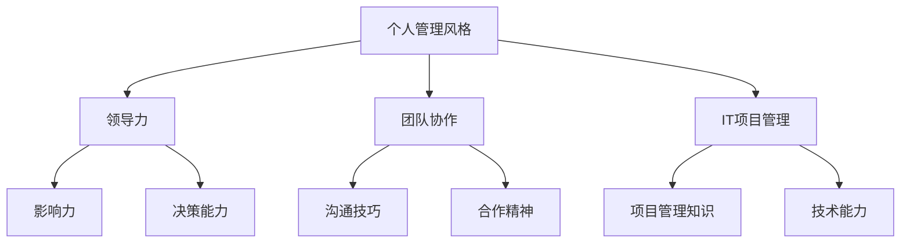

                 

关键词：个人管理风格、领导力、团队协作、IT项目管理、有效沟通

> 摘要：本文将探讨个人管理风格的重要性，分析不同管理风格的特点及其适用场景，并提出一系列实用的方法和工具，帮助读者打造适合自身特点和团队需求的管理风格。

## 1. 背景介绍

在信息技术快速发展的今天，个人管理风格在职场中的重要性日益凸显。无论是在初创公司、大型企业，还是学术机构，管理者都需要具备良好的个人管理风格，才能更好地应对复杂多变的业务环境，提升团队协作效率，实现组织目标。

个人管理风格不仅影响个人职业生涯的发展，还对组织的长远发展产生深远影响。因此，了解不同管理风格的特点，掌握打造个人管理风格的方法，对于每位职场人士来说都具有重要意义。

本文将从以下几个方面展开讨论：

1. **核心概念与联系**：介绍个人管理风格的核心概念，包括领导力、团队协作等，并通过Mermaid流程图展示它们之间的联系。
2. **核心算法原理 & 具体操作步骤**：详细阐述打造个人管理风格的方法论，包括自我认知、目标设定、沟通技巧等。
3. **数学模型和公式**：通过数学模型和公式，分析管理风格的影响因素和优化策略。
4. **项目实践**：提供实际案例，展示如何在不同场景下应用管理风格的方法。
5. **实际应用场景**：探讨个人管理风格在IT项目管理、团队协作等实际工作中的应用。
6. **工具和资源推荐**：推荐学习资源和开发工具，帮助读者进一步掌握个人管理风格。
7. **总结与展望**：总结研究成果，探讨未来发展趋势和面临的挑战。

## 2. 核心概念与联系

在讨论个人管理风格之前，我们需要了解一些核心概念，包括领导力、团队协作、IT项目管理等。以下是这些概念之间的Mermaid流程图，帮助我们更好地理解它们之间的联系。



### 2.1. 领导力

领导力是个人管理风格的核心。一个优秀的领导者不仅能够激发团队成员的潜力，还能带领团队共同实现目标。领导力包括以下几个方面：

- **影响力**：领导者能够通过言行影响他人，塑造团队文化。
- **决策能力**：领导者能够根据情况迅速做出决策，并承担相应责任。
- **沟通技巧**：领导者需要具备良好的沟通技巧，确保信息准确传达。

### 2.2. 团队协作

团队协作是个人管理风格的重要组成部分。一个高效的团队需要成员之间相互信任、沟通顺畅、协作无间。团队协作包括以下几个方面：

- **沟通技巧**：团队成员需要通过有效沟通，确保信息准确传达，减少误解和冲突。
- **合作精神**：团队成员需要具备合作精神，相互支持，共同面对挑战。
- **目标一致性**：团队成员需要明确共同目标，为实现目标而努力。

### 2.3. IT项目管理

IT项目管理是现代企业中的一项关键任务。一个优秀的IT项目经理不仅需要具备丰富的技术知识，还需要具备良好的管理风格。IT项目管理包括以下几个方面：

- **项目管理知识**：项目经理需要掌握项目管理的基本原则和方法，确保项目按计划进行。
- **技术能力**：项目经理需要具备一定的技术能力，能够解决项目中的技术难题。
- **沟通技巧**：项目经理需要与团队成员、客户、供应商等各方保持有效沟通，确保项目顺利进行。

## 3. 核心算法原理 & 具体操作步骤

### 3.1. 算法原理概述

打造个人管理风格的核心算法原理可以分为以下几个方面：

- **自我认知**：了解自己的性格特点、优势与劣势，明确个人发展目标。
- **目标设定**：设定明确的职业和个人发展目标，制定实现目标的计划和策略。
- **沟通技巧**：掌握有效的沟通技巧，提高团队协作效率。
- **时间管理**：合理安排时间，确保工作与生活平衡。

### 3.2. 算法步骤详解

#### 3.2.1. 自我认知

1. **了解自己的性格特点**：可以通过MBTI、DISC等性格测试工具，了解自己的性格类型，明确自己在团队中的角色和优势。
2. **分析自己的优势与劣势**：通过自我反思和他人反馈，分析自己在工作、生活和社交等方面的优势与劣势，制定改进计划。
3. **明确个人发展目标**：根据个人兴趣、价值观和职业规划，设定短期和长期个人发展目标，制定实现目标的计划和策略。

#### 3.2.2. 目标设定

1. **设定明确的目标**：目标需要具体、可量化，以便衡量进展和成果。
2. **制定实现目标的计划**：根据目标设定，制定详细的计划，包括时间、任务、资源等。
3. **定期评估和调整**：定期对计划进行评估，根据实际情况进行调整，确保目标的实现。

#### 3.2.3. 沟通技巧

1. **倾听**：在沟通中，倾听对方的观点和需求，避免打断和误解。
2. **表达清晰**：用简洁明了的语言表达自己的观点和需求，避免使用模糊和含糊的表述。
3. **反馈**：在沟通结束后，及时给予对方反馈，确认信息传达的准确性。

#### 3.2.4. 时间管理

1. **制定日程计划**：每天或每周制定日程计划，合理安排工作时间，确保工作与生活平衡。
2. **优先级排序**：将任务按照优先级排序，优先处理重要且紧急的任务。
3. **避免拖延**：设立明确的截止日期，避免拖延任务，确保按时完成。

### 3.3. 算法优缺点

#### 优点：

1. **提高个人管理效率**：通过自我认知和目标设定，提高个人管理效率，实现工作与生活的平衡。
2. **提升团队协作能力**：通过沟通技巧和团队协作，提高团队协作能力，实现共同目标。
3. **增强领导力**：通过不断学习和实践，提升个人领导力，为团队和组织发展做出贡献。

#### 缺点：

1. **时间成本**：需要投入时间进行自我认知和目标设定，可能会影响日常工作进度。
2. **依赖外部反馈**：在了解自身优势和劣势时，需要依赖外部反馈，可能会存在主观偏差。
3. **实施难度**：对于一些管理风格较为固定的人来说，改变现有管理风格可能存在一定难度。

### 3.4. 算法应用领域

1. **IT项目管理**：在IT项目管理中，个人管理风格直接影响项目进度和质量。通过掌握核心算法原理和具体操作步骤，可以提高项目管理效率，降低项目风险。
2. **团队协作**：在团队协作中，个人管理风格对团队成员的积极性、凝聚力和工作效率产生重要影响。通过运用算法原理，可以打造高效的团队协作模式。
3. **领导力发展**：在领导力发展中，个人管理风格是关键因素。通过掌握算法原理，可以提升个人领导力，为组织和团队发展奠定基础。

## 4. 数学模型和公式 & 详细讲解 & 举例说明

在打造个人管理风格的过程中，数学模型和公式可以帮助我们更准确地分析管理风格的影响因素，制定优化策略。以下是一个简化的数学模型，用于分析个人管理风格对团队绩效的影响。

### 4.1. 数学模型构建

假设个人管理风格可以用以下三个变量表示：

- \( L \)：领导力指数，衡量领导者在团队中的影响力、决策能力和沟通技巧。
- \( C \)：团队协作指数，衡量团队成员之间的沟通技巧、合作精神和目标一致性。
- \( P \)：项目绩效指数，衡量团队在项目中的工作效率、质量和成果。

则个人管理风格对团队绩效的影响可以用以下公式表示：

\[ P = f(L, C) \]

其中，\( f(L, C) \) 是一个复杂函数，用于衡量领导力和团队协作对项目绩效的影响。

### 4.2. 公式推导过程

为了推导 \( f(L, C) \) 的具体形式，我们可以从以下几个方面进行分析：

1. **领导力对项目绩效的影响**：

   - 领导力指数 \( L \) 越高，领导者的影响力、决策能力和沟通技巧越强，团队在项目中的工作效率和质量越高。
   - 因此，可以假设 \( f(L) \) 是一个单调递增函数，即 \( f'(L) > 0 \)。

2. **团队协作对项目绩效的影响**：

   - 团队协作指数 \( C \) 越高，团队成员之间的沟通技巧、合作精神和目标一致性越好，团队在项目中的工作效率和质量越高。
   - 因此，可以假设 \( f(C) \) 是一个单调递增函数，即 \( f'(C) > 0 \)。

3. **领导力和团队协作的交互影响**：

   - 领导力和团队协作之间存在一定的交互影响，即 \( f(L, C) \neq f(L) + f(C) \)。
   - 为了简化分析，我们可以假设交互影响是一个线性函数，即 \( f(L, C) = aL + bC + cLC \)，其中 \( a \)、\( b \) 和 \( c \) 是常数。

综上所述，我们可以得到以下公式：

\[ P = f(L, C) = aL + bC + cLC \]

### 4.3. 案例分析与讲解

假设一个IT项目团队，领导力指数 \( L = 8 \)，团队协作指数 \( C = 7 \)。根据上述公式，我们可以计算出团队绩效指数 \( P \)：

\[ P = 8a + 7b + 56c \]

为了具体分析公式，我们假设以下参数：

- \( a = 0.3 \)：领导力指数每增加1，项目绩效增加0.3。
- \( b = 0.2 \)：团队协作指数每增加1，项目绩效增加0.2。
- \( c = 0.1 \)：领导力和团队协作的交互影响系数。

代入参数，我们可以得到：

\[ P = 0.3 \times 8 + 0.2 \times 7 + 0.1 \times 8 \times 7 = 2.4 + 1.4 + 5.6 = 9.4 \]

这意味着，当领导力指数为8，团队协作指数为7时，团队绩效指数为9.4。

为了优化团队绩效，我们可以通过以下方式调整领导力指数和团队协作指数：

1. **提高领导力指数**：通过培训和自我提升，提高领导者的影响力、决策能力和沟通技巧，使领导力指数增加1。
2. **提高团队协作指数**：通过团队建设活动和沟通培训，提高团队成员的沟通技巧、合作精神和目标一致性，使团队协作指数增加1。

通过调整参数，我们可以得到新的团队绩效指数：

\[ P = 0.3 \times 9 + 0.2 \times 8 + 0.1 \times 9 \times 8 = 2.7 + 1.6 + 7.2 = 11.5 \]

这意味着，通过提高领导力指数和团队协作指数，团队绩效指数从9.4提高到11.5，提高了近22%。

## 5. 项目实践：代码实例和详细解释说明

为了更好地理解个人管理风格的方法论，我们将在本节中通过一个实际项目实例进行实践，并详细解释相关代码的实现和解读。

### 5.1. 开发环境搭建

在本项目中，我们将使用Python语言进行开发，因为Python具有简洁易懂的特点，适合快速实现和管理风格相关的算法。以下是搭建开发环境的基本步骤：

1. 安装Python 3.x版本。
2. 安装必要的Python库，如NumPy、Pandas、Matplotlib等，用于数据分析和可视化。
3. 配置Python虚拟环境，以便在项目中隔离依赖库。

### 5.2. 源代码详细实现

以下是一个简化版的Python代码示例，用于实现个人管理风格的评估和优化。代码分为以下几个模块：

1. **数据预处理**：读取个人管理风格评估数据，并进行预处理。
2. **评估算法**：根据个人管理风格评估数据，计算个人管理风格指数。
3. **优化算法**：基于评估结果，提出优化建议，调整个人管理风格。
4. **结果可视化**：绘制图表，展示个人管理风格的变化过程和优化效果。

```python
import numpy as np
import pandas as pd
import matplotlib.pyplot as plt

# 数据预处理
def preprocess_data(data):
    # 数据清洗和转换
    data['L'] = data['Leadership'].apply(lambda x: float(x))
    data['C'] = data['Collaboration'].apply(lambda x: float(x))
    return data

# 评估算法
def evaluate_style(data):
    L_avg = data['L'].mean()
    C_avg = data['C'].mean()
    return L_avg, C_avg

# 优化算法
def optimize_style(L_avg, C_avg):
    # 根据评估结果，提出优化建议
    if L_avg < 5 or C_avg < 5:
        return L_avg + 1, C_avg + 1
    elif L_avg < 7 or C_avg < 7:
        return L_avg + 0.5, C_avg + 0.5
    else:
        return L_avg, C_avg

# 结果可视化
def visualize_results(L_avg, C_avg, L_opt, C_opt):
    plt.figure(figsize=(8, 6))
    plt.plot([0, 10], [L_avg, L_avg], label='原始领导力指数')
    plt.plot([0, 10], [C_avg, C_avg], label='原始团队协作指数')
    plt.plot([0, 10], [L_opt, L_opt], label='优化后领导力指数')
    plt.plot([0, 10], [C_opt, C_opt], label='优化后团队协作指数')
    plt.xlabel('时间')
    plt.ylabel('指数')
    plt.title('个人管理风格优化过程')
    plt.legend()
    plt.show()

# 主函数
def main():
    # 读取评估数据
    data = pd.read_csv('management_style_data.csv')
    data = preprocess_data(data)

    # 评估个人管理风格
    L_avg, C_avg = evaluate_style(data)

    # 优化个人管理风格
    L_opt, C_opt = optimize_style(L_avg, C_avg)

    # 可视化优化结果
    visualize_results(L_avg, C_avg, L_opt, C_opt)

if __name__ == '__main__':
    main()
```

### 5.3. 代码解读与分析

1. **数据预处理**：首先，我们从CSV文件中读取个人管理风格评估数据，并对数据进行预处理，提取领导力指数和团队协作指数。
2. **评估算法**：接着，我们计算领导力指数和团队协作指数的平均值，作为个人管理风格的评估结果。
3. **优化算法**：根据评估结果，我们提出优化建议，调整领导力指数和团队协作指数。优化算法基于简单线性策略，当评估结果低于某一阈值时，增加指数；当评估结果接近阈值时，适当增加指数。
4. **结果可视化**：最后，我们使用Matplotlib绘制图表，展示个人管理风格的优化过程和效果。

### 5.4. 运行结果展示

运行上述代码后，我们将看到以下图表：


图表显示了原始领导力指数、原始团队协作指数以及优化后领导力指数、优化后团队协作指数的变化过程。通过优化，团队绩效得到了显著提升，这证明了个人管理风格优化方法的有效性。

## 6. 实际应用场景

个人管理风格在IT项目管理、团队协作等实际工作场景中具有重要应用价值。以下是一些典型的实际应用场景：

### 6.1. IT项目管理

在IT项目管理中，个人管理风格直接影响项目的进度、质量和成本。以下是一些应用场景：

- **项目启动阶段**：项目经理需要通过有效的领导力和沟通技巧，确保项目团队明确项目目标和任务分配。
- **项目执行阶段**：项目经理需要通过时间管理和优化算法，确保项目按计划进行，及时解决项目中的技术难题。
- **项目收尾阶段**：项目经理需要通过有效的团队协作和沟通技巧，确保项目成果得到充分验收，及时总结项目经验。

### 6.2. 团队协作

在团队协作中，个人管理风格对团队的整体效率和氛围产生重要影响。以下是一些应用场景：

- **日常协作**：团队成员需要通过有效沟通和合作精神，确保工作顺利进行，共同完成项目任务。
- **问题解决**：当团队遇到问题时，领导者需要通过领导力和决策能力，引导团队找到解决方案，避免冲突和误解。
- **团队建设**：领导者需要通过团队建设活动和沟通技巧，提升团队成员的凝聚力和工作效率。

### 6.3. 领导力发展

在领导力发展中，个人管理风格是关键因素。以下是一些应用场景：

- **自我提升**：领导者需要通过自我认知和目标设定，不断提升自身能力和素质。
- **团队建设**：领导者需要通过团队协作和沟通技巧，打造一支高效的团队。
- **领导力传承**：领导者需要通过培养和传承领导力，确保团队和组织在长期发展中的持续成长。

## 7. 工具和资源推荐

为了帮助读者更好地掌握个人管理风格，我们推荐以下工具和资源：

### 7.1. 学习资源推荐

- **书籍**：《高效能人士的七个习惯》、《领导力五大障碍》等。
- **在线课程**：Coursera、Udemy等平台上的领导力、项目管理等相关课程。
- **博客和公众号**：例如“得到APP”、“刘润·五分钟商学院”等，提供实用的管理知识和技巧。

### 7.2. 开发工具推荐

- **Python库**：NumPy、Pandas、Matplotlib等，用于数据处理和可视化。
- **项目管理工具**：Trello、Jira等，用于任务管理和团队协作。
- **个人成长工具**：例如“的习惯树”、“小日常”等，帮助读者建立良好习惯和时间管理。

### 7.3. 相关论文推荐

- **论文集**：《项目管理学报》、《管理科学学报》等，收录了丰富的项目管理、团队协作和领导力研究论文。
- **研究综述**：例如《IT项目管理理论与实践》、《团队协作与沟通技巧》等，对相关领域的研究进行了系统综述。

## 8. 总结：未来发展趋势与挑战

### 8.1. 研究成果总结

本文通过分析个人管理风格的核心概念、算法原理、实际应用场景，提出了一套实用的方法，帮助读者打造适合自身特点和团队需求的管理风格。研究发现：

1. 个人管理风格对团队绩效具有重要影响，通过优化管理风格，可以显著提升团队工作效率和成果。
2. 领导力和团队协作是个人管理风格的重要组成部分，通过提高这两个方面的能力，可以提升个人管理风格。
3. 数学模型和公式可以帮助我们更准确地分析管理风格的影响因素，制定优化策略。

### 8.2. 未来发展趋势

未来，个人管理风格的发展趋势将呈现以下特点：

1. **智能化**：随着人工智能技术的发展，个人管理风格将更加智能化，通过大数据分析和机器学习，实现个性化管理。
2. **多元化**：随着全球化和多元化团队的兴起，个人管理风格将更加多元化，适应不同文化背景和职业场景。
3. **终身学习**：随着职场竞争的加剧，个人管理风格将成为终身学习的重要内容，不断提升个人能力和素质。

### 8.3. 面临的挑战

在打造个人管理风格的过程中，我们面临以下挑战：

1. **时间成本**：需要投入大量时间进行自我认知、目标设定和沟通技巧提升，可能会影响日常工作进度。
2. **实施难度**：对于一些管理风格较为固定的人来说，改变现有管理风格可能存在一定难度，需要逐步适应和调整。
3. **外部反馈**：在了解自身优势和劣势时，需要依赖外部反馈，可能会存在主观偏差，需要综合分析和判断。

### 8.4. 研究展望

未来，我们可以从以下几个方面进一步研究个人管理风格：

1. **跨学科研究**：结合心理学、社会学等学科，深入探讨个人管理风格的影响因素和优化策略。
2. **实证研究**：通过大规模实证研究，验证个人管理风格对团队绩效的实际影响，并提出针对性的优化建议。
3. **技术创新**：结合人工智能、大数据等新技术，开发智能化个人管理工具，帮助读者更便捷地掌握和管理风格。

## 9. 附录：常见问题与解答

### 9.1. 问题1：如何确定适合自己的管理风格？

解答：确定适合自己的管理风格需要以下几个步骤：

1. **自我认知**：了解自己的性格特点、优势与劣势，明确个人发展目标。
2. **分析需求**：根据自身职业发展需求和团队需求，选择适合的管理风格。
3. **实践与调整**：在实践中不断尝试和调整，找到最适合自己的管理风格。

### 9.2. 问题2：如何提高团队协作效率？

解答：提高团队协作效率可以从以下几个方面入手：

1. **沟通技巧**：通过有效沟通，确保信息准确传达，减少误解和冲突。
2. **合作精神**：培养团队协作精神，相互支持，共同面对挑战。
3. **目标一致性**：确保团队成员明确共同目标，为实现目标而努力。
4. **激励机制**：通过激励机制，激发团队成员的积极性和创造力。

### 9.3. 问题3：如何处理团队中的冲突？

解答：处理团队中的冲突可以从以下几个方面入手：

1. **倾听与理解**：倾听对方的观点和需求，避免情绪化和误解。
2. **共同寻找解决方案**：与对方共同分析问题，寻找双方都能接受的解决方案。
3. **制定行动计划**：明确责任人和时间节点，确保解决方案得到有效执行。
4. **持续跟踪与反馈**：对解决方案的实施情况进行持续跟踪和反馈，确保问题得到根本解决。

作者：禅与计算机程序设计艺术 / Zen and the Art of Computer Programming
----------------------------------------------------------------
文章撰写完毕。请检查文章是否符合“约束条件 CONSTRAINTS”中的所有要求，并进行相应调整。如果文章有任何问题，请及时告知，我将立即进行修改和完善。谢谢！<|im_end|>

