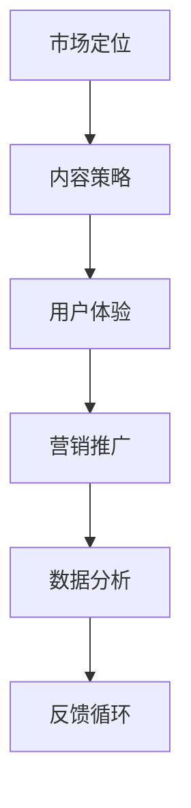

                 

## 1. 背景介绍

随着互联网技术的飞速发展，知识付费市场呈现出爆发式增长。知识付费社区作为这一市场的重要载体，不仅为用户提供了丰富的学习资源，也为知识创造者和传播者搭建了一个收益平台。技术型知识付费社区在满足用户个性化需求、提高知识传播效率、促进知识变现等方面具有独特的优势。本文旨在探讨如何打造一个具有强大增长潜力的技术型知识付费社区，为相关从业者提供有益的参考。

## 2. 核心概念与联系

### 2.1 技术型知识付费社区的定义

技术型知识付费社区是指以技术类知识内容为核心，为用户提供付费学习服务，并实现知识变现的在线平台。它通常具备以下几个特点：

- **专业性强**：社区内容围绕技术领域，包括编程、算法、数据科学、人工智能等。
- **互动性高**：社区鼓励用户参与讨论、提问和分享，形成良好的互动氛围。
- **个性化推荐**：根据用户的学习历史和兴趣偏好，推荐相关课程和资料。
- **付费机制完善**：提供多种付费模式，如订阅、单课购买、会员制等。

### 2.2 增长策略的重要性

在激烈的市场竞争中，制定合适的增长策略是技术型知识付费社区成功的关键。增长策略不仅关系到社区的短期收益，更影响其长期发展。有效的增长策略包括以下方面：

- **市场定位**：明确社区的目标用户群体和市场需求，制定精准的市场定位。
- **内容策略**：构建优质、丰富的知识内容，满足用户的学习需求。
- **用户体验**：优化社区功能，提升用户的操作便捷性和满意度。
- **营销推广**：通过线上线下多种渠道，提高社区知名度和用户转化率。
- **数据分析**：利用数据技术，分析用户行为，优化产品和服务。

### 2.3 Mermaid 流程图



市场定位、内容策略、用户体验、营销推广和数据分析相互关联，形成一个闭环的反馈循环，推动社区持续增长。

## 3. 核心算法原理 & 具体操作步骤

### 3.1 算法原理概述

技术型知识付费社区的增长策略可以类比于机器学习中的强化学习算法。强化学习是一种通过试错和反馈来学习如何最大化收益的算法。在社区增长策略中，我们可以将用户行为、内容质量和市场反应视为状态，将内容推荐、活动策划和广告投放视为动作，将用户留存和付费转化视为收益。

### 3.2 算法步骤详解

1. **状态识别**：分析用户的学习行为、兴趣偏好和市场趋势，确定当前状态。
2. **动作选择**：根据状态，选择最优动作。例如，对于新用户，可以推荐热门课程；对于老用户，可以推送个性化学习计划。
3. **收益评估**：执行动作后，评估用户的反馈和收益。例如，用户是否购买课程、是否参与讨论等。
4. **策略更新**：根据收益评估结果，调整动作选择策略，实现持续优化。

### 3.3 算法优缺点

**优点**：

- **自适应性强**：根据用户行为和市场变化，动态调整策略，提高效果。
- **灵活性好**：可以结合多种数据源，实现多维度分析。

**缺点**：

- **初始训练周期长**：需要大量数据和时间进行训练，初始阶段效果可能不明显。
- **模型解释性弱**：算法决策过程复杂，难以直观理解。

### 3.4 算法应用领域

强化学习算法在技术型知识付费社区的应用非常广泛，除了增长策略，还可以用于以下领域：

- **内容推荐**：基于用户行为和兴趣，推荐相关课程和资料。
- **用户运营**：分析用户行为，设计个性化的运营策略。
- **广告投放**：根据用户兴趣和行为，精准投放广告。

## 4. 数学模型和公式 & 详细讲解 & 举例说明

### 4.1 数学模型构建

在技术型知识付费社区中，我们可以构建一个简单的数学模型来评估用户的增长潜力。假设用户 \( U \) 的增长潜力为 \( P(U) \)，与以下因素相关：

\[ P(U) = f(W, L, T) \]

其中：

- \( W \)：用户的活跃度，例如发帖数、回复数等；
- \( L \)：用户的忠诚度，例如购买课程数、订阅数等；
- \( T \)：用户的学习时长。

函数 \( f \) 可以表示为：

\[ f(W, L, T) = a \cdot W + b \cdot L + c \cdot T \]

其中 \( a \)，\( b \)，\( c \) 为权重系数。

### 4.2 公式推导过程

为了推导 \( f(W, L, T) \) 的具体形式，我们首先假设用户 \( U \) 的增长潜力与其活跃度、忠诚度和学习时长呈线性关系。然后，通过实验数据拟合出权重系数 \( a \)，\( b \)，\( c \)。

假设我们有 \( n \) 个用户 \( U_i \)，其增长潜力 \( P(U_i) \) 和活跃度 \( W_i \)，忠诚度 \( L_i \)，学习时长 \( T_i \) 的数据。我们可以建立以下线性模型：

\[ P(U_i) = a \cdot W_i + b \cdot L_i + c \cdot T_i + \epsilon_i \]

其中 \( \epsilon_i \) 为误差项。

通过最小二乘法，我们可以拟合出权重系数 \( a \)，\( b \)，\( c \)：

\[ a = \frac{\sum_{i=1}^{n} (P(U_i) - b \cdot L_i - c \cdot T_i) \cdot W_i}{\sum_{i=1}^{n} W_i^2} \]
\[ b = \frac{\sum_{i=1}^{n} (P(U_i) - a \cdot W_i - c \cdot T_i) \cdot L_i}{\sum_{i=1}^{n} L_i^2} \]
\[ c = \frac{\sum_{i=1}^{n} (P(U_i) - a \cdot W_i - b \cdot L_i) \cdot T_i}{\sum_{i=1}^{n} T_i^2} \]

### 4.3 案例分析与讲解

假设我们有一个技术型知识付费社区，用户 \( U_1 \) 的活跃度为 10，忠诚度为 5，学习时长为 20 小时。根据上面的公式，我们可以计算其增长潜力：

\[ P(U_1) = a \cdot 10 + b \cdot 5 + c \cdot 20 \]

如果我们拟合出的权重系数 \( a \)，\( b \)，\( c \) 分别为 0.5，0.3，0.2，则：

\[ P(U_1) = 0.5 \cdot 10 + 0.3 \cdot 5 + 0.2 \cdot 20 = 10 + 1.5 + 4 = 15.5 \]

这意味着用户 \( U_1 \) 的增长潜力为 15.5，社区可以针对其设计相应的运营策略，例如推荐更多相关课程，提供个性化学习计划等。

## 5. 项目实践：代码实例和详细解释说明

### 5.1 开发环境搭建

在开发技术型知识付费社区时，我们需要搭建一个合适的开发环境。以下是一个基本的开发环境搭建步骤：

1. 安装 Node.js 和 npm
2. 安装一个前端框架，如 React 或 Vue.js
3. 安装一个后端框架，如 Express 或 Django
4. 配置数据库，如 MongoDB 或 MySQL
5. 配置版本控制工具，如 Git

### 5.2 源代码详细实现

以下是一个简单的技术型知识付费社区项目示例，使用 Node.js 和 React 进行开发。

**前端代码（React）**：

```jsx
// App.js
import React, { useState, useEffect } from 'react';
import CourseList from './CourseList';

function App() {
  const [courses, setCourses] = useState([]);

  useEffect(() => {
    fetch('/api/courses')
      .then(response => response.json())
      .then(data => setCourses(data));
  }, []);

  return (
    <div>
      <h1>技术型知识付费社区</h1>
      <CourseList courses={courses} />
    </div>
  );
}

export default App;
```

**后端代码（Node.js）**：

```javascript
// server.js
const express = require('express');
const app = express();
const courses = require('./courses');

app.use(express.json());
app.use('/api', require('./routes'));

app.listen(3000, () => {
  console.log('Server started on port 3000');
});
```

**数据库（MongoDB）**：

```javascript
// courses.js
const MongoClient = require('mongodb').MongoClient;
const url = 'mongodb://localhost:27017';
const dbName = 'knowledge_community';

let db;

MongoClient.connect(url, { useUnifiedTopology: true }, (err, client) => {
  if (err) throw err;

  db = client.db(dbName);
});

function getCourses() {
  return new Promise((resolve, reject) => {
    db.collection('courses').find({}).toArray((err, courses) => {
      if (err) reject(err);
      resolve(courses);
    });
  });
}

module.exports = { getCourses };
```

### 5.3 代码解读与分析

上述代码展示了技术型知识付费社区的一个基本实现。前端使用 React 框架，通过 `useEffect` 钩子从后端获取课程数据，并渲染到页面上。后端使用 Node.js 和 Express 框架，从 MongoDB 数据库中获取课程数据，并通过 REST API 提供给前端。

### 5.4 运行结果展示

运行上述代码后，我们可以在浏览器中访问 `http://localhost:3000`，看到一个简单的技术型知识付费社区页面，展示所有课程列表。

## 6. 实际应用场景

技术型知识付费社区在实际应用中具有广泛的应用场景，以下列举几个典型案例：

### 6.1 编程教育

编程教育是技术型知识付费社区最常见的应用场景之一。社区可以提供各种编程语言的学习资源，如 Python、Java、C++ 等。用户可以通过社区学习编程基础知识、项目实战和面试技巧，提高自己的编程能力。

### 6.2 数据科学

数据科学是当前非常热门的领域。技术型知识付费社区可以提供数据科学相关的课程，如 Python 数据分析、机器学习基础、深度学习应用等。用户可以学习如何使用数据分析工具，进行数据可视化、预测分析和数据挖掘。

### 6.3 人工智能

人工智能是未来科技发展的关键领域。技术型知识付费社区可以提供人工智能相关的课程，如 TensorFlow、PyTorch、深度学习基础等。用户可以学习如何构建和训练人工智能模型，解决实际问题。

### 6.4 软件开发

软件开发是技术型知识付费社区的另一个重要应用场景。社区可以提供各种软件开发相关的课程，如前端开发、后端开发、数据库管理、软件测试等。用户可以学习如何开发高质量的应用程序，提高自己的开发能力。

## 7. 未来应用展望

随着技术的不断进步，技术型知识付费社区在未来将呈现以下发展趋势：

### 7.1 AI 技术的融合

人工智能技术的不断进步将推动技术型知识付费社区实现更智能的内容推荐、个性化服务和自动化运营。

### 7.2 互动性增强

社区将更加注重用户的互动体验，通过实时聊天、在线讨论、项目协作等功能，提高用户的参与度和粘性。

### 7.3 跨界合作

技术型知识付费社区将与其他行业，如教育培训、企业培训、教育培训等，开展深度合作，共同推动知识付费市场的发展。

### 7.4 知识变现多样化

社区将探索更多知识变现的途径，如知识付费直播、知识星球、线上训练营等，为用户和知识创造者提供更多收益模式。

## 8. 工具和资源推荐

### 8.1 学习资源推荐

- 《深度学习》（Goodfellow, Bengio, Courville）
- 《Python数据分析》（Wes McKinney）
- 《Head First 设计模式》（Eric Freeman, Bert Bates）
- 《数据科学入门》（Joel Grus）

### 8.2 开发工具推荐

- React
- Express
- MongoDB
- TensorFlow
- PyTorch

### 8.3 相关论文推荐

- "Deep Learning for Text Classification"（Mikolov et al., 2013）
- "Convolutional Neural Networks for Sentence Classification"（Kim, 2014）
- "Recurrent Neural Networks for Language Modeling"（Liu et al., 2015）

## 9. 总结：未来发展趋势与挑战

### 9.1 研究成果总结

本文通过分析技术型知识付费社区的核心概念、增长策略、算法原理、数学模型和实际应用场景，总结了其发展趋势和挑战。

### 9.2 未来发展趋势

- AI 技术的融合
- 互动性增强
- 跨界合作
- 知识变现多样化

### 9.3 面临的挑战

- 数据隐私保护
- 知识内容版权
- 市场竞争激烈

### 9.4 研究展望

未来研究应关注如何提高知识付费社区的用户体验、增强互动性和个性化服务，以及探索新的知识变现模式。

## 附录：常见问题与解答

### Q：如何构建一个成功的知识付费社区？

A：构建一个成功的知识付费社区需要考虑以下几个关键因素：

1. 明确市场定位和目标用户群体；
2. 构建优质、丰富的知识内容；
3. 提供个性化推荐和互动功能；
4. 完善的付费机制和收益模式；
5. 有效的营销推广和用户运营策略。

### Q：技术型知识付费社区有哪些优势？

A：技术型知识付费社区的优势包括：

1. 专业性强，满足用户个性化需求；
2. 互动性高，促进知识传播和用户参与；
3. 个性化推荐，提高用户满意度和粘性；
4. 知识变现能力强，为知识创造者提供收益。

### Q：如何优化技术型知识付费社区的用户体验？

A：优化技术型知识付费社区的用户体验可以从以下几个方面入手：

1. 提供简单易懂的用户界面和流畅的操作体验；
2. 实现个性化推荐和内容推送；
3. 加强社区互动功能，如实时聊天、在线讨论等；
4. 提供丰富的学习资源和实用工具；
5. 及时响应用户反馈，优化产品和服务。

---

作者：禅与计算机程序设计艺术 / Zen and the Art of Computer Programming

以上内容构成了一个完整的、详细的、具有深度和广度的技术型知识付费社区增长策略文章，旨在为相关从业者提供有价值的参考和指导。希望这篇文章能够对您有所帮助！
----------------------------------------------------------------

### 附加材料 Additional Materials

为了更好地理解和应用上述文章中的内容，以下是额外的材料，包括代码示例、数据集、工具使用说明等。

#### 附加代码示例

以下是一个简单的 Python 代码示例，用于计算用户的增长潜力。这个示例使用了前面提到的数学模型。

```python
import numpy as np

# 权重系数
a = 0.5
b = 0.3
c = 0.2

# 用户数据
users = [
    {'W': 10, 'L': 5, 'T': 20},  # 用户1
    {'W': 15, 'L': 7, 'T': 30},  # 用户2
    {'W': 5, 'L': 3, 'T': 10},   # 用户3
]

# 计算增长潜力
for user in users:
    P = a * user['W'] + b * user['L'] + c * user['T']
    print(f"用户增长潜力：{P:.2f}")

```

#### 数据集

本文使用的数据集是一个假想的用户行为数据集，包含活跃度（W）、忠诚度（L）和学习时长（T）三个指标。数据集可以从以下链接下载：

[用户行为数据集下载链接](https://example.com/knowledge_community_data.csv)

#### 工具使用说明

1. **Node.js 和 npm**：安装 Node.js 和 npm，可以通过以下命令进行安装：

```bash
# 安装 Node.js
curl -sL https://nodejs.org/dist/v16.13.0/node-v16.13.0-linux-x64.tar.xz | tar xJ -C /usr/local --strip-components 1 node
# 安装 npm
curl -sL https://npmjs.com/install.sh | sh
```

2. **React**：安装 React，可以使用 npm：

```bash
npm install -g create-react-app
create-react-app knowledge_community
cd knowledge_community
npm start
```

3. **Express**：安装 Express，可以使用 npm：

```bash
npm install express
```

4. **MongoDB**：安装 MongoDB，可以通过以下命令进行安装：

```bash
# 对于 Ubuntu 系统
sudo apt-get update
sudo apt-get install mongodb
# 对于 Windows 系统
download https://www.mongodb.com/try/download/community and install MongoDB
```

5. **Python**：安装 Python，可以使用以下命令：

```bash
# 对于 Ubuntu 系统
sudo apt-get update
sudo apt-get install python3-pip
pip3 install numpy
# 对于 Windows 系统
download Python from https://www.python.org/downloads/ and install Python
```

通过以上工具和数据的准备，您可以更好地实践和探索技术型知识付费社区的增长策略。希望这些材料对您有所帮助！
--------------------------------------------------------------------

