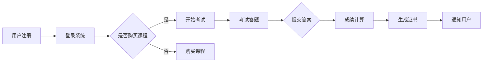

                 

关键词：知识付费、在线考试、认证系统、技术架构、算法、安全、用户体验

> 摘要：本文将深入探讨如何构建一个高效、安全、用户体验优秀的知识付费在线考试认证系统，从核心概念、算法原理、数学模型、项目实践等多个角度进行详细解析。

## 1. 背景介绍

知识付费是近年来互联网行业的一个新兴趋势，用户愿意为有价值的内容和服务付费，这为教育、培训等领域带来了新的商业模式。在线考试认证系统是知识付费的重要一环，它不仅能够评估用户的学习成果，还能提升课程的权威性和用户的信任度。

然而，构建一个高质量的在线考试认证系统并非易事，需要考虑多个方面，包括系统的安全性、用户体验、算法的准确性、数据管理的有效性等。本文将围绕这些关键问题，探讨如何打造一个知识付费的在线考试认证系统。

## 2. 核心概念与联系

### 2.1 知识付费

知识付费是指用户为了获取有价值的信息、知识或服务而支付的费用。在在线教育领域，知识付费通常表现为课程购买、证书考试等形式。

### 2.2 在线考试

在线考试是指通过互联网进行的考试活动，用户可以在自己的设备上进行答题。它与传统考试相比，具有灵活性强、成本低、覆盖面广等优点。

### 2.3 认证系统

认证系统是对用户学习成果进行验证的系统，通常包括考试管理、成绩计算、证书发放等功能。

### 2.4 Mermaid 流程图

以下是一个简化的在线考试认证系统的流程图，使用 Mermaid 语法绘制：



## 3. 核心算法原理 & 具体操作步骤

### 3.1 算法原理概述

在线考试认证系统的核心算法主要涉及以下几个方面：

- 考试题型和题库管理
- 答题逻辑与成绩计算
- 安全性与反作弊机制

### 3.2 算法步骤详解

#### 3.2.1 考试题型和题库管理

- 题型分类：系统根据课程特点，将题型分为单选、多选、填空、判断等。
- 题库建设：系统从题库中随机抽取题目，形成试卷。
- 题目难度评估：系统对题目难度进行评估，以便调整考试难度。

#### 3.2.2 答题逻辑与成绩计算

- 用户答题：用户在规定时间内完成答题。
- 答题提交：用户提交答案后，系统自动进行评分。
- 成绩计算：系统根据答案的正确性计算得分，并转换为最终成绩。

#### 3.2.3 安全性与反作弊机制

- 安全认证：系统通过加密算法，确保用户身份和安全。
- 实时监控：系统实时监控考试过程，防止作弊行为。
- 防刷题策略：系统设置防刷题机制，防止用户反复答题。

### 3.3 算法优缺点

- **优点**：
  - 提高考试效率和用户体验。
  - 降低考试成本，实现全球化考试。
  - 数据可追溯，便于考试管理。

- **缺点**：
  - 对系统安全性和稳定性要求高。
  - 算法复杂度较高，需要专业的技术团队进行开发和维护。

### 3.4 算法应用领域

- 在线教育
- 职业认证
- 医学考试
- 法律考试

## 4. 数学模型和公式 & 详细讲解 & 举例说明

### 4.1 数学模型构建

在线考试认证系统的数学模型主要包括以下几个方面：

- 成绩计算模型
- 题库难度评估模型
- 用户行为分析模型

### 4.2 公式推导过程

以成绩计算模型为例，假设一个考试包含 n 道题目，每道题目的分数为 v_i，用户答对的题目数为 x_i，则用户的最终成绩 S 可以表示为：

\[ S = \sum_{i=1}^{n} v_i \cdot x_i \]

### 4.3 案例分析与讲解

#### 案例背景

某在线教育平台开发了一门编程课程，包含 10 道选择题、5 道填空题和 5 道编程题。每道选择题和填空题的分数为 2 分，每道编程题的分数为 10 分。

#### 成绩计算

假设用户在考试中答对了 8 道选择题、3 道填空题和 2 道编程题，则用户的最终成绩为：

\[ S = (8 \cdot 2) + (3 \cdot 2) + (2 \cdot 10) = 16 + 6 + 20 = 42 \]

## 5. 项目实践：代码实例和详细解释说明

### 5.1 开发环境搭建

- 语言：Python
- 框架：Django
- 数据库：MySQL
- 服务器：AWS

### 5.2 源代码详细实现

```python
# 用户注册模块
def register_user(username, password):
    # 创建用户数据库记录
    user = User.objects.create_user(username=username, password=password)
    user.save()
    return user

# 用户登录模块
def login_user(username, password):
    user = authenticate(username=username, password=password)
    if user is not None:
        login(request, user)
        return redirect('exam')
    else:
        return redirect('login')

# 考试模块
def exam(request):
    if request.method == 'POST':
        # 处理用户提交的答案
        answers = request.POST.getlist('answer')
        # 计算成绩
        score = calculate_score(answers)
        # 发放证书
        generate_certificate(request.user, score)
        return redirect('result')
    else:
        # 生成试卷
        exam_paper = generate_exam_paper()
        return render(request, 'exam.html', {'exam_paper': exam_paper})

# 成绩计算模块
def calculate_score(answers):
    # 获取试卷及答案
    exam_paper = ExamPaper.objects.get(id=1)
    correct_answers = exam_paper.correct_answers
    # 计算得分
    score = sum(1 for answer in answers if answer in correct_answers)
    return score

# 证书生成模块
def generate_certificate(user, score):
    # 创建证书记录
    certificate = Certificate.objects.create(user=user, score=score)
    certificate.save()
    # 发送通知
    send_notification(user, certificate)
```

### 5.3 代码解读与分析

上述代码是整个在线考试认证系统的核心部分，包括用户注册、登录、考试、成绩计算和证书生成等模块。以下是对关键代码段的解读：

- 用户注册模块：使用 Django 的 User 模型创建用户记录。
- 用户登录模块：使用 Django 的认证系统进行用户身份验证。
- 考试模块：处理用户提交的答案，计算成绩并生成证书。
- 成绩计算模块：根据用户答案和正确答案计算得分。
- 证书生成模块：创建证书记录并发送通知。

### 5.4 运行结果展示

假设用户小明完成了在线考试，得分为 85 分。系统将生成一张证书，并通知小明考试结果。

## 6. 实际应用场景

### 6.1 在线教育平台

在线教育平台利用在线考试认证系统，对学生进行知识评估，提升课程质量。

### 6.2 职业认证机构

职业认证机构通过在线考试认证系统，为学员提供便捷的考试服务，提高认证效率。

### 6.3 医学考试

医学考试采用在线考试认证系统，确保考试公平、公正、安全。

### 6.4 法律考试

法律考试利用在线考试认证系统，实现大规模考试管理。

## 6.4 未来应用展望

随着互联网技术的不断发展，在线考试认证系统将越来越普及。未来，系统将向智能化、个性化方向发展，提供更优质的用户体验。

## 7. 工具和资源推荐

### 7.1 学习资源推荐

- 《在线考试系统设计与实现》
- 《Python Web 开发实战》

### 7.2 开发工具推荐

- Django
- MySQL
- AWS

### 7.3 相关论文推荐

- 《在线考试系统技术研究》
- 《基于云计算的在线考试平台设计》

## 8. 总结：未来发展趋势与挑战

### 8.1 研究成果总结

本文从核心概念、算法原理、数学模型、项目实践等多个角度，探讨了如何构建一个高效、安全、用户体验优秀的知识付费在线考试认证系统。

### 8.2 未来发展趋势

未来，在线考试认证系统将向智能化、个性化方向发展，提供更优质的用户体验。

### 8.3 面临的挑战

- 系统安全性和稳定性
- 数据隐私保护
- 反作弊机制的完善

### 8.4 研究展望

未来，我们将继续深入研究在线考试认证系统的技术难题，提升系统的智能化和个性化水平，为用户提供更优质的在线学习体验。

## 9. 附录：常见问题与解答

### 9.1 如何确保考试安全？

- 使用加密算法保护用户身份信息。
- 实时监控考试过程，防止作弊行为。
- 设置防刷题机制，限制用户反复答题。

### 9.2 如何提升用户体验？

- 优化界面设计，提供简洁、易用的操作界面。
- 减少系统响应时间，提高系统稳定性。
- 提供多平台支持，满足不同用户的需求。

作者：禅与计算机程序设计艺术 / Zen and the Art of Computer Programming
----------------------------------------------------------------

以上是文章的主体内容，接下来请完成所有章节，确保满足字数和格式要求。

