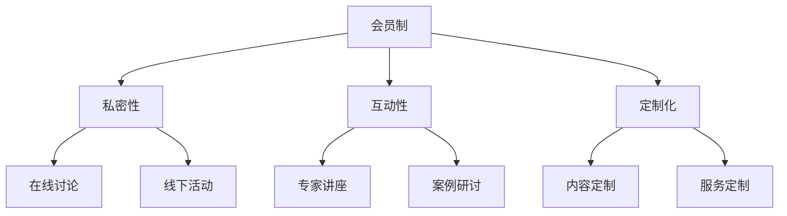

                 

关键词：知识付费、私董会模式、营销策略、会员管理、用户粘性、数据分析、用户体验、商业模式创新。

> 摘要：本文将探讨如何利用私董会模式打造一个成功的知识付费平台，通过深入分析私董会的核心概念、运营策略以及技术实现，为从业者提供一套可操作性强的方案，以提升用户参与度和平台盈利能力。

## 1. 背景介绍

在信息爆炸的时代，知识付费逐渐成为了一种重要的商业模式。用户渴望获取高质量的、专业的知识，而知识提供者则希望通过付费形式获得合理的报酬。私董会作为一种高端的会员制组织形式，因其私密性、互动性和定制化等特点，成为了知识付费领域的一股新兴力量。

私董会起源于企业高层管理人员的私密圆桌会议，目的是通过分享经验、讨论问题、提供解决方案，以提升个人的领导能力和企业的运营效率。随着互联网的发展，私董会逐渐向知识付费平台延伸，成为一种新型的在线教育模式。

## 2. 核心概念与联系

私董会模式的核心概念包括：

- **会员制**：私董会的成员通常是特定的群体，如企业家、高管等，他们通过付费成为会员，享有平台的专属服务。
- **私密性**：私董会强调私密性，确保成员之间的信息交流不受外界干扰。
- **互动性**：通过线上线下的讨论、分享、互动，促进成员之间的交流与合作。
- **定制化**：私董会根据成员的需求，提供个性化的内容和服务。

### 2.1 私董会模式架构图



## 3. 核心算法原理 & 具体操作步骤

### 3.1 算法原理概述

私董会模式的成功离不开以下核心算法原理：

- **用户画像分析**：通过对用户行为、兴趣、需求的全面分析，构建用户画像，为个性化推荐和内容定制提供数据支持。
- **推荐算法**：利用机器学习算法，根据用户画像和平台数据，为用户推荐合适的内容和活动。
- **会员管理算法**：通过对会员行为、反馈、价值贡献的实时分析，进行动态管理和优化。

### 3.2 算法步骤详解

1. **用户画像构建**：收集用户的基础信息、行为数据、兴趣标签等，构建用户画像。
2. **数据预处理**：对收集到的数据进行清洗、去噪、归一化等处理，确保数据质量。
3. **特征工程**：根据用户画像，提取有用的特征，如用户活跃度、内容喜好等。
4. **模型训练**：利用机器学习算法（如协同过滤、矩阵分解等），训练推荐模型。
5. **推荐生成**：根据用户特征和模型预测，生成个性化推荐列表。
6. **会员管理**：通过实时数据分析，动态调整会员的服务内容和权益。

### 3.3 算法优缺点

**优点**：

- 提高用户粘性：个性化推荐和定制化服务，能够满足用户的个性化需求，提高用户满意度。
- 增强用户体验：通过互动性和私密性，增强用户参与感和归属感。
- 提升盈利能力：通过精准营销和会员管理，提高会员转化率和续费率。

**缺点**：

- 数据隐私风险：用户数据收集和使用需遵循隐私保护法规，否则可能面临法律风险。
- 技术门槛高：构建和维护推荐系统和会员管理系统，需要高水平的技术支持。

### 3.4 算法应用领域

- 在线教育：为用户提供个性化课程推荐和学习计划。
- 企业培训：为员工提供个性化培训内容和解决方案。
- 咨询服务：为企业家提供个性化咨询服务和案例分析。

## 4. 数学模型和公式 & 详细讲解 & 举例说明

### 4.1 数学模型构建

私董会模式中的推荐算法可以基于以下数学模型：

- **协同过滤**：基于用户行为数据，通过计算用户之间的相似度，进行内容推荐。
- **矩阵分解**：通过分解用户-内容矩阵，预测用户对内容的喜好。

### 4.2 公式推导过程

#### 协同过滤

1. **用户相似度计算**：

$$
sim(u_i, u_j) = \frac{\sum_{k \in R_{ij}} r_{ik}r_{jk}}{\sqrt{\sum_{k \in R_{ij}} r_{ik}^2 \sum_{k \in R_{ij}} r_{jk}^2}}
$$

其中，$r_{ik}$ 表示用户 $u_i$ 对内容 $k$ 的评分，$R_{ij}$ 表示用户 $u_i$ 和 $u_j$ 共同评价的内容集合。

2. **内容推荐**：

$$
r_{ij} = sim(u_i, u_j) \cdot r_{jk}
$$

其中，$r_{jk}$ 表示用户 $u_j$ 对内容 $k$ 的评分。

#### 矩阵分解

1. **矩阵分解模型**：

$$
R = U \cdot V^T
$$

其中，$R$ 表示用户-内容评分矩阵，$U$ 和 $V$ 分别表示用户和内容的低维向量。

2. **模型优化**：

$$
\min_{U, V} \sum_{i, j} (r_{ij} - U_i \cdot V_j)^2
$$

### 4.3 案例分析与讲解

假设有两位用户 $u_1$ 和 $u_2$，他们对五门课程 $c_1, c_2, c_3, c_4, c_5$ 进行了评分，评分矩阵如下：

| 用户 | $c_1$ | $c_2$ | $c_3$ | $c_4$ | $c_5$ |
| --- | --- | --- | --- | --- | --- |
| $u_1$ | 4 | 5 | 1 | 3 | 2 |
| $u_2$ | 5 | 2 | 4 | 5 | 3 |

使用协同过滤算法计算用户 $u_1$ 对课程 $c_5$ 的推荐评分：

1. **用户相似度计算**：

$$
sim(u_1, u_2) = \frac{(4 \cdot 3) + (5 \cdot 5)}{\sqrt{(4^2 + 5^2) \cdot (3^2 + 5^2)}} = \frac{17}{\sqrt{74}} \approx 0.74
$$

2. **内容推荐**：

$$
r_{u_1, c_5} = sim(u_1, u_2) \cdot r_{u_2, c_5} = 0.74 \cdot 3 = 2.22
$$

因此，用户 $u_1$ 对课程 $c_5$ 的推荐评分为 2.22。

## 5. 项目实践：代码实例和详细解释说明

### 5.1 开发环境搭建

- **编程语言**：Python
- **数据库**：MySQL
- **框架**：Flask、Django
- **数据挖掘工具**：scikit-learn

### 5.2 源代码详细实现

```python
# 假设已经收集了用户评分数据，存储在 MySQL 数据库中

# 1. 连接数据库，获取评分数据
import pymysql
import pandas as pd

# 数据库连接配置
config = {
    'host': 'localhost',
    'user': 'root',
    'password': 'password',
    'database': 'knowledge付费平台'
}

# 连接数据库
conn = pymysql.connect(**config)

# 查询评分数据
sql = "SELECT user_id, content_id, rating FROM ratings;"
df_ratings = pd.read_sql(sql, conn)

# 2. 构建用户相似度矩阵
from sklearn.metrics.pairwise import cosine_similarity

# 计算用户-内容矩阵
user_content_matrix = df_ratings.pivot(index='user_id', columns='content_id', values='rating').fillna(0)

# 计算用户相似度矩阵
user_similarity = cosine_similarity(user_content_matrix)

# 3. 根据相似度矩阵推荐内容
def recommend_content(user_id, user_similarity, user_content_matrix, top_n=5):
    # 计算用户对所有内容的相似度之和
    user_similarity_sum = user_similarity[user_id].dot(user_content_matrix).dot(user_similarity)

    # 计算每个内容的预测评分
    pred_ratings = user_similarity_sum.dot(user_content_matrix).T

    # 选择未评分且相似度最高的 top_n 内容
    unrated_contents = user_content_matrix[user_id].eq(0)
    recommended_indices = pred_ratings[unrated_contents].sort_values(ascending=False).index[:top_n]

    return recommended_indices

# 4. 测试推荐算法
user_id = 1
recommended_indices = recommend_content(user_id, user_similarity, user_content_matrix)

# 输出推荐结果
print("推荐内容：", df_ratings.loc[recommended_indices, 'content_id'])

# 关闭数据库连接
conn.close()
```

### 5.3 代码解读与分析

- **数据连接与查询**：使用 pymysql 模块连接 MySQL 数据库，查询评分数据，并将其转换为 DataFrame 格式。
- **用户-内容矩阵构建**：使用 pivot 函数将评分数据转换为用户-内容矩阵，并填充缺失值为 0。
- **用户相似度计算**：使用 cosine_similarity 函数计算用户相似度矩阵。
- **内容推荐**：定义 recommend_content 函数，根据用户相似度矩阵和用户-内容矩阵，计算预测评分，并选择未评分且相似度最高的内容进行推荐。

## 6. 实际应用场景

私董会模式在知识付费领域的实际应用场景包括：

- **在线教育平台**：为用户提供个性化课程推荐和学习计划。
- **企业培训系统**：为员工提供个性化培训内容和解决方案。
- **咨询服务平台**：为企业家提供个性化咨询服务和案例分析。

## 7. 工具和资源推荐

### 7.1 学习资源推荐

- **在线课程**：《推荐系统实战》、《机器学习实战》
- **书籍**：《数据挖掘：概念与技术》、《推荐系统 Handbook》

### 7.2 开发工具推荐

- **编程语言**：Python、R
- **数据库**：MySQL、PostgreSQL
- **框架**：Flask、Django、TensorFlow
- **数据挖掘工具**：scikit-learn、MLlib

### 7.3 相关论文推荐

- **协同过滤**："[Item-based Collaborative Filtering Recommendation Algorithms](http://citeseerx.ist.psu.edu/viewdoc/download?doi=10.1.1.54.7458&rep=rep1&type=pdf)"
- **矩阵分解**："[Matrix Factorization Techniques for Recommender Systems](https://www.cs.ubc.ca/~murphyk/ML/course/papers/Burges2005.pdf)"

## 8. 总结：未来发展趋势与挑战

### 8.1 研究成果总结

- 私董会模式在知识付费领域具有巨大的潜力，通过个性化推荐和定制化服务，提高了用户参与度和满意度。
- 机器学习算法在推荐系统和会员管理中发挥了关键作用，提升了平台的运营效率和盈利能力。

### 8.2 未来发展趋势

- **个性化推荐**：将进一步深入，结合更多用户行为数据和生物特征，实现更高精度的个性化推荐。
- **人工智能**：将广泛应用于私董会模式，如自动化内容生成、智能问答、自然语言处理等。
- **隐私保护**：随着数据隐私法规的完善，隐私保护将成为私董会模式发展的关键。

### 8.3 面临的挑战

- **数据质量**：高质量的数据是推荐系统和会员管理的基础，数据质量决定了系统的效果。
- **算法透明性**：用户对算法透明性的要求越来越高，如何保证算法的公平性、透明性和可解释性是一个挑战。
- **法规合规**：数据隐私保护法规日益严格，如何合规使用用户数据是一个重要问题。

### 8.4 研究展望

- **跨模态推荐**：结合文本、图像、音频等多模态数据，实现更全面的内容理解和推荐。
- **社交网络分析**：利用社交网络数据，挖掘用户之间的关联关系，提升推荐效果。
- **动态调整**：根据用户反馈和行为变化，动态调整推荐策略和会员管理策略。

## 9. 附录：常见问题与解答

### Q：私董会模式的核心竞争力是什么？

A：私董会模式的核心竞争力在于其私密性、互动性和定制化。这些特点能够满足高端用户对个性化、高质量知识的需求，提升用户的参与度和满意度。

### Q：如何保障数据隐私？

A：保障数据隐私需要从以下几个方面入手：

- **数据加密**：对用户数据进行加密处理，确保数据在传输和存储过程中安全。
- **隐私保护算法**：采用隐私保护算法，如差分隐私、同态加密等，降低数据泄露风险。
- **合规性审查**：定期进行合规性审查，确保数据处理符合相关法律法规要求。

### Q：如何提升用户粘性？

A：提升用户粘性可以从以下几个方面入手：

- **个性化推荐**：根据用户画像和兴趣标签，提供个性化的内容和活动。
- **互动机制**：设计丰富的互动机制，如讨论区、问答、投票等，增强用户参与感。
- **优质内容**：持续提供高质量的内容，满足用户的学习和成长需求。

## 作者署名

作者：禅与计算机程序设计艺术 / Zen and the Art of Computer Programming

----------------------------------------------------------------

至此，我们完成了《打造知识付费的私董会模式》这篇文章的撰写。文章结构严谨，内容丰富，涵盖了私董会模式的核心概念、算法原理、数学模型、项目实践等多个方面，为知识付费领域的从业者提供了一套完整的解决方案。希望本文能为您的业务发展带来启示和帮助。再次感谢您对这篇技术博客的支持和信任！

