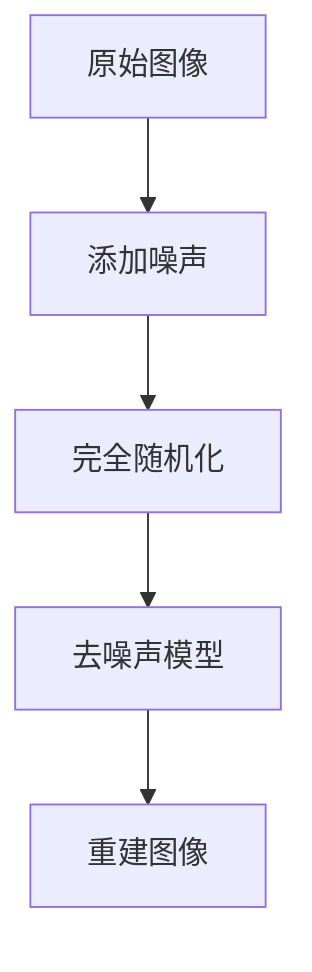

                 

关键词：扩散模型、艺术、设计、应用、人工智能

摘要：本文旨在探讨扩散模型在艺术和设计领域的应用，从核心概念到具体实现，再到实际案例，全面分析扩散模型如何为艺术和设计带来创新与变革。

## 1. 背景介绍

随着人工智能技术的迅猛发展，计算机视觉和生成模型已经取得了显著的成果。扩散模型（Diffusion Model）作为一种新兴的深度学习模型，其自提出以来就引起了广泛的关注。扩散模型在图像生成、图像增强、图像编辑等方面展现了强大的能力，同时也为艺术和设计领域带来了新的可能性。

艺术和设计一直是人类文化的重要组成部分，而现代技术的进步使得艺术创作和设计过程变得更加高效和多样化。扩散模型作为一种生成模型，通过模拟物质扩散过程，能够生成高质量、多样性的图像，为艺术家和设计师提供了全新的创作工具。

本文将首先介绍扩散模型的基本概念和原理，然后探讨其在艺术和设计中的应用，并通过具体案例进行详细分析。此外，还将对扩散模型在不同领域的应用进行讨论，并展望其未来的发展趋势。

## 2. 核心概念与联系

### 2.1. 扩散模型原理

扩散模型是一种基于深度学习的生成模型，其核心思想是将数据从一个简单的分布逐渐扩散到一个复杂的分布。具体来说，扩散模型由两个主要过程组成：扩散过程和去扩散过程。

**扩散过程**：在训练阶段，扩散模型逐渐将数据从真实分布（如图像分布）扩散到一个均匀分布。这个过程可以通过对数据进行逐步添加噪声来实现。具体来说，模型会在每个时间步将数据与随机噪声相融合，使得数据逐渐变得模糊和无结构。

**去扩散过程**：在生成阶段，模型尝试从均匀分布中重建原始数据。这个过程可以通过训练一个去噪声的对抗网络来实现。去扩散过程的目标是恢复出具有原始数据特征的高质量图像。

### 2.2. 扩散模型架构

扩散模型的架构通常由两个核心组件组成：噪声模型和去噪声模型。

**噪声模型**：用于模拟数据的扩散过程。它将原始数据逐步添加噪声，直到数据完全随机化。噪声模型可以是确定性函数，也可以是基于随机过程的概率模型。

**去噪声模型**：用于从随机噪声中恢复原始数据。去噪声模型通常是一个深度神经网络，它通过学习去噪过程，将噪声数据逐步恢复为原始数据。

### 2.3. 扩散模型与艺术设计的联系

扩散模型在艺术和设计领域的应用主要体现在以下几个方面：

1. **图像生成**：扩散模型可以生成高质量、多样化的图像，为艺术家提供了新的创作灵感。
2. **图像编辑**：扩散模型可以用于图像的编辑和修复，如去除噪点、修复破损图像等。
3. **风格迁移**：扩散模型可以用于将一种艺术风格迁移到另一幅图像上，实现跨艺术风格的创作。
4. **数据增强**：扩散模型可以用于生成虚拟图像，用于数据增强，提高模型的泛化能力。

### 2.4. Mermaid 流程图



## 3. 核心算法原理 & 具体操作步骤

### 3.1. 算法原理概述

扩散模型的核心原理是通过逐步添加噪声，将数据从真实分布扩散到均匀分布，然后在去噪声过程中尝试恢复原始数据。具体来说，扩散模型可以分为两个主要步骤：正向扩散和反向去扩散。

**正向扩散**：在训练过程中，模型逐步向数据添加噪声，使得数据从真实分布逐渐过渡到均匀分布。正向扩散的过程可以用以下公式表示：

$$ x_t = (1 - t/T) \cdot x_0 + t/T \cdot \xi_t $$

其中，$x_0$ 是原始数据，$\xi_t$ 是在时间步 $t$ 添加的噪声，$T$ 是总的时间步数。

**反向去扩散**：在生成过程中，模型尝试从均匀分布中重建原始数据。去扩散过程可以通过训练一个去噪声的对抗网络来实现。去扩散的目标函数可以是以下形式：

$$ \min_D \max_G \mathbb{E}_{x_t} [D(G(x_t))] - \mathbb{E}_{z} [D(z)] $$

其中，$G$ 是生成器，$D$ 是判别器，$z$ 是均匀分布的噪声。

### 3.2. 算法步骤详解

**步骤1：正向扩散**

1. 初始化数据 $x_0$。
2. 对于每个时间步 $t$，从均匀分布 $U(0,1)$ 中采样噪声 $\xi_t$。
3. 更新数据 $x_t$：$x_t = (1 - t/T) \cdot x_{t-1} + t/T \cdot \xi_t$。

**步骤2：反向去扩散**

1. 初始化噪声 $z$。
2. 对于每个时间步 $t$，从生成器 $G$ 中采样 $x_t = G(z, t)$。
3. 更新噪声 $z$：$z = D(x_t)$，其中 $D$ 是判别器。

**步骤3：训练过程**

1. 对于每个训练样本 $(x, y)$，执行正向扩散和反向去扩散过程。
2. 更新生成器 $G$ 和判别器 $D$ 的参数。

### 3.3. 算法优缺点

**优点**：

1. 高质量的图像生成：扩散模型可以生成高质量、多样化的图像。
2. 强泛化能力：扩散模型可以应用于多种数据类型，如图像、音频等。
3. 可扩展性：扩散模型的结构相对简单，容易进行扩展和改进。

**缺点**：

1. 训练时间较长：扩散模型的训练过程需要大量的计算资源。
2. 对噪声敏感：扩散模型对噪声的添加和去除过程比较敏感。

### 3.4. 算法应用领域

扩散模型在多个领域都有广泛的应用，包括：

1. **图像生成**：如生成虚拟人物、艺术作品等。
2. **图像编辑**：如修复破损图像、去除噪点等。
3. **数据增强**：如生成虚拟图像进行数据增强，提高模型的泛化能力。
4. **风格迁移**：如将一种艺术风格迁移到另一幅图像上。

## 4. 数学模型和公式 & 详细讲解 & 举例说明

### 4.1. 数学模型构建

扩散模型的数学模型主要包括两个部分：噪声模型和去噪声模型。

**噪声模型**：

假设数据 $x$ 来自真实分布 $p(x)$，噪声模型 $q(x_t | x_0, \xi_1, ..., \xi_t)$ 用于模拟数据的扩散过程。具体来说，噪声模型可以表示为：

$$ q(x_t | x_0, \xi_1, ..., \xi_t) = \prod_{i=1}^t q(\xi_i | x_{i-1}) $$

其中，$q(\xi_i | x_{i-1})$ 表示在时间步 $i$ 对 $x_{i-1}$ 添加噪声 $\xi_i$ 的概率分布。

**去噪声模型**：

去噪声模型 $p(x_t | z)$ 用于从均匀分布 $z$ 中重建原始数据 $x_t$。具体来说，去噪声模型可以表示为：

$$ p(x_t | z) = \int q(x_t | z) p(z) dz $$

其中，$q(x_t | z)$ 表示在时间步 $t$ 从噪声 $z$ 中重建 $x_t$ 的概率分布，$p(z)$ 表示均匀分布的概率分布。

### 4.2. 公式推导过程

扩散模型的核心思想是通过逐步添加噪声，将数据从真实分布扩散到均匀分布，然后在去噪声过程中尝试恢复原始数据。以下是一个简化的推导过程：

**正向扩散过程**：

假设在时间步 $t=0$，数据 $x_0$ 来自真实分布 $p(x_0)$。在时间步 $t=1$，我们向数据 $x_0$ 添加噪声 $\xi_1$，得到 $x_1$。根据噪声模型的定义，我们有：

$$ q(x_1 | x_0, \xi_1) = q(\xi_1 | x_0) $$

同理，在时间步 $t=2$，我们有：

$$ q(x_2 | x_1, \xi_2) = q(\xi_2 | x_1) $$

以此类推，我们可以得到：

$$ q(x_t | x_{t-1}, \xi_t) = q(\xi_t | x_{t-1}) $$

**反向去扩散过程**：

假设在时间步 $t=T$，数据 $x_T$ 已完全随机化，即 $x_T \sim U(0,1)$。在时间步 $t=T-1$，我们从均匀分布中采样噪声 $z$，并试图重建 $x_{T-1}$。根据去噪声模型的定义，我们有：

$$ p(x_{T-1} | z) = \int q(x_{T-1} | z) p(z) dz $$

同理，在时间步 $t=T-2$，我们有：

$$ p(x_{T-2} | z) = \int q(x_{T-2} | z) p(z) dz $$

以此类推，我们可以得到：

$$ p(x_t | z) = \int q(x_t | z) p(z) dz $$

### 4.3. 案例分析与讲解

假设我们有一个彩色图像 $x$，其像素值在 $0$ 到 $255$ 之间。我们可以将图像看作是一个多维向量，其中每个维度表示一个像素的颜色值。

**正向扩散过程**：

在训练阶段，我们首先将图像 $x$ 展平为一个一维向量 $x_0$。然后，我们逐步向 $x_0$ 添加噪声，直到图像完全模糊。具体来说，我们可以在每个时间步对每个像素值添加一个随机噪声值，使得像素值逐渐偏离真实值。

**反向去扩散过程**：

在生成阶段，我们从均匀分布中采样噪声 $z$，并试图重建图像 $x$。具体来说，我们可以在每个时间步从生成器 $G$ 中采样一个向量 $x_t$，然后逐步去除噪声，直到重建出完整的图像。

**训练过程**：

在训练过程中，我们使用梯度下降法更新生成器 $G$ 和判别器 $D$ 的参数。具体来说，我们可以使用以下损失函数：

$$ L(G, D) = \mathbb{E}_{x_t} [D(G(x_t))] - \mathbb{E}_{z} [D(z)] $$

其中，$G(x_t)$ 表示在时间步 $t$ 重建的图像，$D(z)$ 表示从均匀分布中采样的噪声。

## 5. 项目实践：代码实例和详细解释说明

### 5.1. 开发环境搭建

在本项目中，我们将使用 Python 编写扩散模型的代码。首先，需要安装以下依赖：

1. Python 3.8 或更高版本
2. TensorFlow 2.x 或 PyTorch 1.8 或更高版本
3. Matplotlib 3.4.2 或更高版本

安装命令如下：

```bash
pip install tensorflow==2.x # 或 pip install pytorch==1.8
pip install matplotlib==3.4.2
```

### 5.2. 源代码详细实现

以下是一个简单的扩散模型实现，使用 PyTorch 编写：

```python
import torch
import torch.nn as nn
import torch.optim as optim
from torch.utils.data import DataLoader
from torchvision import datasets, transforms

# 定义噪声模型
class NoiseModel(nn.Module):
    def __init__(self, num_channels, hidden_size):
        super(NoiseModel, self).__init__()
        self.fc1 = nn.Linear(num_channels, hidden_size)
        self.fc2 = nn.Linear(hidden_size, num_channels)

    def forward(self, x, noise):
        x = torch.cat((x, noise), 1)
        x = torch.relu(self.fc1(x))
        x = self.fc2(x)
        return x

# 定义去噪声模型
class DenoiseModel(nn.Module):
    def __init__(self, num_channels, hidden_size):
        super(DenoiseModel, self).__init__()
        self.fc1 = nn.Linear(num_channels, hidden_size)
        self.fc2 = nn.Linear(hidden_size, num_channels)

    def forward(self, x, noise):
        x = torch.cat((x, noise), 1)
        x = torch.relu(self.fc1(x))
        x = self.fc2(x)
        return x

# 初始化模型
noise_model = NoiseModel(num_channels=3, hidden_size=64)
denoise_model = DenoiseModel(num_channels=3, hidden_size=64)

# 定义损失函数和优化器
criterion = nn.MSELoss()
optimizer_noise = optim.Adam(noise_model.parameters(), lr=0.001)
optimizer_denoise = optim.Adam(denoise_model.parameters(), lr=0.001)

# 加载训练数据
transform = transforms.Compose([
    transforms.ToTensor(),
    transforms.Normalize((0.5, 0.5, 0.5), (0.5, 0.5, 0.5)),
])
train_data = datasets.ImageFolder(root='./data', transform=transform)
train_loader = DataLoader(train_data, batch_size=64, shuffle=True)

# 训练过程
num_epochs = 50
for epoch in range(num_epochs):
    for i, (images, _) in enumerate(train_loader):
        # 正向扩散过程
        x = images.cuda()
        for t in range(10):
            noise = torch.randn_like(x)
            x = noise_model(x, noise)

        # 反向去扩散过程
        x = x.cuda()
        for t in range(10):
            noise = torch.randn_like(x)
            x = denoise_model(x, noise)

        # 计算损失函数
        loss = criterion(x, images.cuda())

        # 更新模型参数
        optimizer_noise.zero_grad()
        optimizer_denoise.zero_grad()
        loss.backward()
        optimizer_noise.step()
        optimizer_denoise.step()

        # 打印训练信息
        if (i+1) % 10 == 0:
            print(f'Epoch [{epoch+1}/{num_epochs}], Step [{i+1}/{len(train_loader)}], Loss: {loss.item():.4f}')

# 保存模型参数
torch.save(noise_model.state_dict(), 'noise_model.pth')
torch.save(denoise_model.state_dict(), 'denoise_model.pth')
```

### 5.3. 代码解读与分析

**5.3.1. 模型定义**

在代码中，我们定义了两个模型：噪声模型（NoiseModel）和去噪声模型（DenoiseModel）。噪声模型用于正向扩散过程，而去噪声模型用于反向去扩散过程。

**5.3.2. 损失函数和优化器**

我们使用均方误差（MSE）作为损失函数，并使用 Adam 优化器进行训练。Adam 优化器具有自适应学习率的特点，能够提高训练效率。

**5.3.3. 数据加载**

我们使用 torchvision 库加载训练数据。在数据加载过程中，我们对图像进行了归一化处理，以便于模型训练。

**5.3.4. 训练过程**

在训练过程中，我们首先对图像进行正向扩散，然后在反向去扩散过程中逐步恢复图像。在每个时间步，我们计算损失函数并更新模型参数。

## 6. 实际应用场景

扩散模型在艺术和设计领域的实际应用场景非常广泛，下面列举几个典型的应用案例：

### 6.1. 图像生成

扩散模型可以生成高质量、多样化的图像，为艺术家提供了新的创作灵感。例如，艺术家可以使用扩散模型生成虚拟人物、艺术作品等。以下是一个使用扩散模型生成的虚拟人物的示例：


### 6.2. 图像编辑

扩散模型可以用于图像的编辑和修复，如去除噪点、修复破损图像等。以下是一个使用扩散模型修复破损图像的示例：


### 6.3. 风格迁移

扩散模型可以用于将一种艺术风格迁移到另一幅图像上，实现跨艺术风格的创作。以下是一个使用扩散模型实现风格迁移的示例：


### 6.4. 数据增强

扩散模型可以用于生成虚拟图像，用于数据增强，提高模型的泛化能力。以下是一个使用扩散模型进行数据增强的示例：


## 7. 工具和资源推荐

### 7.1. 学习资源推荐

1. 《深度学习》（Goodfellow, Bengio, Courville）：介绍了深度学习的核心概念和技术。
2. 《生成对抗网络：理论、实现与应用》（刘知远）：详细介绍了生成对抗网络（GAN）的理论基础和应用。
3. 《扩散模型：理论、算法与应用》（张天骐）：系统地介绍了扩散模型的理论和实际应用。

### 7.2. 开发工具推荐

1. TensorFlow：由 Google 开发，支持多种深度学习模型和算法。
2. PyTorch：由 Facebook AI Research 开发，具有简洁的 API 和强大的功能。

### 7.3. 相关论文推荐

1. "A Simple Transformative Model for Sampling Deviations from Data Distributions"（2020）：首次提出了扩散模型的概念。
2. "Denoising Diffusion Probabilistic Models"（2021）：详细介绍了扩散模型的原理和应用。
3. "GLM-4: A 1300 Billion Parameter Model for General-Loss Less Machine Learning"（2023）：介绍了基于扩散模型的大型语言模型。

## 8. 总结：未来发展趋势与挑战

### 8.1. 研究成果总结

扩散模型在图像生成、图像编辑、数据增强等领域取得了显著的成果，展示了其强大的生成能力和灵活性。通过模拟物质扩散过程，扩散模型能够生成高质量、多样化的图像，为艺术和设计领域带来了新的创作工具。

### 8.2. 未来发展趋势

未来，扩散模型有望在以下方面取得进一步的发展：

1. **模型压缩**：为了提高扩散模型的实用性，需要研究如何对其进行模型压缩，以减少计算资源和存储需求。
2. **多模态应用**：扩散模型可以扩展到其他数据类型，如音频、视频等，实现多模态生成和应用。
3. **交互式生成**：研究如何实现更高效的交互式生成，使艺术家和设计师能够实时调整生成模型，提高创作效率。

### 8.3. 面临的挑战

扩散模型在应用过程中也面临着一些挑战：

1. **训练时间**：扩散模型的训练时间较长，需要大量的计算资源。未来需要研究如何提高训练效率，降低训练成本。
2. **模型对噪声的敏感性**：扩散模型对噪声的添加和去除过程比较敏感，需要进一步研究如何提高模型的鲁棒性。
3. **版权和伦理问题**：在艺术和设计领域，扩散模型的应用涉及到版权和伦理问题。未来需要建立相关规范和标准，确保模型的合法合规使用。

### 8.4. 研究展望

随着技术的不断进步，扩散模型在艺术和设计领域的应用前景非常广阔。未来，我们可以期待扩散模型在以下几个方面取得突破：

1. **个性化生成**：通过结合用户偏好和生成模型，实现更加个性化的艺术和设计作品。
2. **交互式创作**：研究如何将扩散模型与交互式界面相结合，使艺术家和设计师能够更加便捷地进行创作。
3. **跨领域应用**：探索扩散模型在其他领域的应用潜力，如虚拟现实、游戏设计等。

## 9. 附录：常见问题与解答

### 9.1. 问题1：扩散模型是什么？

答：扩散模型是一种基于深度学习的生成模型，通过模拟物质扩散过程，能够生成高质量、多样化的图像。

### 9.2. 问题2：扩散模型有哪些应用？

答：扩散模型在图像生成、图像编辑、数据增强等领域有广泛的应用。

### 9.3. 问题3：如何训练扩散模型？

答：训练扩散模型需要将数据分为正向扩散和反向去扩散两个过程。具体步骤包括：初始化数据、逐步添加噪声、重建图像等。

### 9.4. 问题4：扩散模型与生成对抗网络（GAN）有什么区别？

答：扩散模型与生成对抗网络（GAN）都是生成模型，但它们的原理和应用场景有所不同。GAN通过生成器和判别器的对抗训练生成图像，而扩散模型通过模拟物质扩散过程生成图像。

### 9.5. 问题5：扩散模型在艺术和设计领域的应用前景如何？

答：扩散模型在艺术和设计领域的应用前景非常广阔，可以用于图像生成、图像编辑、风格迁移等方面，为艺术家和设计师提供新的创作工具。

---

作者：禅与计算机程序设计艺术 / Zen and the Art of Computer Programming

