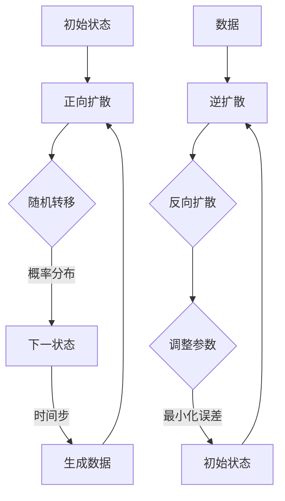

                 

关键词：扩散模型、生成式人工智能、深度学习、神经网络、概率图模型、AI技术前沿

摘要：本文深入探讨了扩散模型在生成式人工智能领域的应用，详细阐述了其核心概念、算法原理、数学模型以及实际应用场景。通过分析扩散模型的优缺点和未来发展趋势，为读者提供了全面的技术解读和未来研究的方向。

## 1. 背景介绍

随着深度学习技术的飞速发展，生成式人工智能成为近年来计算机科学领域的重要研究方向。生成式人工智能的核心目标是创建新的数据，这些数据可以与实际数据高度相似，从而在图像、音频、文本等多个领域产生广泛的应用。扩散模型（Diffusion Model）作为一种新兴的生成式人工智能模型，近年来受到了广泛关注。

扩散模型起源于概率图模型的理论，其主要思想是将生成数据的过程建模为一个概率过程，通过模拟数据在概率空间中的扩散过程来生成新数据。与传统的生成模型如变分自编码器（VAE）和生成对抗网络（GAN）相比，扩散模型具有更高的生成质量和更稳定的训练过程。

本文旨在系统地介绍扩散模型，从其核心概念、算法原理到数学模型和应用场景，全面解析扩散模型在生成式人工智能中的潜力。同时，本文还将探讨扩散模型在实际应用中面临的挑战和未来发展趋势。

## 2. 核心概念与联系

### 2.1. 扩散过程

扩散过程是概率论中的一个基本概念，描述了粒子从一个初始位置随机游走到另一个位置的统计规律。在生成模型中，扩散过程被用来描述数据生成的过程。

设\(X_t\)表示在时刻\(t\)的随机变量，其状态空间为\(S\)。扩散过程可以表示为：

\[ X_{t+1} = f(X_t, \theta) \]

其中，\(f\)是一个非线性函数，描述了\(X_t\)到\(X_{t+1}\)的转移概率。参数\(\theta\)决定了扩散过程的特征，如扩散速率、方向等。

### 2.2. 逆扩散过程

逆扩散过程是扩散过程的逆过程，其目标是通过观察数据\(X_t\)来推断初始状态\(X_0\)。在生成模型中，逆扩散过程被用来生成新数据。

逆扩散过程可以通过优化以下目标函数来实现：

\[ \min_{X_0} \sum_{t} D(X_t, f(X_{t-1}, \theta)) \]

其中，\(D\)是一个距离函数，用于衡量\(X_t\)和\(f(X_{t-1}, \theta)\)之间的差异。

### 2.3. 扩散模型架构

扩散模型通常由两个主要部分组成：正向扩散过程和逆扩散过程。

正向扩散过程从初始状态\(X_0\)开始，通过多个时间步的扩散过程逐步生成数据\(X_t\)。在每一个时间步，数据会按照一定的概率分布进行随机转移。

逆扩散过程则从数据\(X_t\)开始，通过反向的扩散过程逐步推断出初始状态\(X_0\)。在每一个时间步，模型会根据当前状态和先前的状态，通过优化目标函数来调整参数，以最小化预测误差。

### 2.4. Mermaid 流程图

以下是扩散模型的基本流程图，使用Mermaid语法绘制：



## 3. 核心算法原理 & 具体操作步骤

### 3.1. 算法原理概述

扩散模型的核心原理是将数据生成过程建模为一个概率过程，通过正向扩散和逆扩散过程生成新数据。

在正向扩散过程中，模型从初始状态开始，通过多个时间步的随机转移生成数据。这个过程可以看作是一个连续的时间序列生成过程，每个时间步的数据点都服从一个概率分布。

在逆扩散过程中，模型从生成数据开始，通过反向的扩散过程逐步推断出初始状态。这个过程是一个逆时间序列生成过程，每个时间步的推断结果都依赖于当前状态和先前的状态。

### 3.2. 算法步骤详解

#### 3.2.1. 正向扩散过程

1. 初始化：从初始状态\(X_0\)开始，\(X_0\)可以是均匀分布的随机数据。
2. 随机转移：对于当前状态\(X_t\)，根据概率分布\(p(X_{t+1} | X_t, \theta)\)生成下一状态\(X_{t+1}\)。
3. 更新时间步：将当前时间步加1，继续下一时间步的随机转移。
4. 生成数据：当达到预定的时间步数时，生成的数据\(X_T\)即为最终生成的数据。

#### 3.2.2. 逆扩散过程

1. 初始化：从生成数据\(X_T\)开始。
2. 反向扩散：对于当前状态\(X_t\)，根据概率分布\(p(X_{t-1} | X_t, \theta)\)生成上一状态\(X_{t-1}\)。
3. 调整参数：通过最小化误差函数来调整模型参数\(\theta\)，以最小化生成的数据与真实数据之间的差异。
4. 更新时间步：将当前时间步减1，继续下一时间步的反向扩散。
5. 推断初始状态：当达到初始时间步时，推断出的初始状态\(X_0\)即为最终生成的数据。

### 3.3. 算法优缺点

#### 3.3.1. 优点

1. 生成质量高：扩散模型能够生成与真实数据高度相似的新数据，特别是在图像和音频等高维数据上。
2. 稳定的训练过程：扩散模型具有稳定的训练过程，不易陷入局部最优。
3. 适用范围广：扩散模型可以应用于各种生成任务，如图像生成、音频生成、文本生成等。

#### 3.3.2. 缺点

1. 计算成本高：扩散模型需要大量的计算资源，特别是在高维数据上。
2. 模型参数多：扩散模型需要大量的参数来描述概率分布，参数调整复杂。
3. 难以实现实时应用：由于计算成本高，扩散模型难以实现实时应用。

### 3.4. 算法应用领域

扩散模型在生成式人工智能领域具有广泛的应用潜力，以下是一些典型的应用领域：

1. 图像生成：扩散模型可以生成逼真的图像，广泛应用于图像修复、图像生成、图像超分辨率等任务。
2. 音频生成：扩散模型可以生成逼真的音频，广泛应用于音频增强、音频生成、音乐创作等任务。
3. 文本生成：扩散模型可以生成流畅的文本，广泛应用于自然语言生成、文本摘要、对话系统等任务。

## 4. 数学模型和公式 & 详细讲解 & 举例说明

### 4.1. 数学模型构建

扩散模型的数学模型主要包括两个部分：正向扩散过程和逆扩散过程。

#### 4.1.1. 正向扩散过程

正向扩散过程可以表示为以下概率模型：

\[ p(X_T | X_0, \theta) = \prod_{t=1}^{T} p(X_t | X_{t-1}, \theta) \]

其中，\(X_0\)是初始状态，\(X_T\)是最终状态，\(T\)是时间步数。\(p(X_t | X_{t-1}, \theta)\)是时间步\(t\)的状态\(X_t\)的条件概率，由扩散模型参数\(\theta\)决定。

#### 4.1.2. 逆扩散过程

逆扩散过程可以表示为以下概率模型：

\[ p(X_0 | X_T, \theta) = \int p(X_0, X_T | \theta) dX_0 \]

其中，\(X_T\)是生成数据，\(X_0\)是初始状态。\(p(X_0, X_T | \theta)\)是初始状态和生成数据的联合概率，可以通过正向扩散过程的概率模型进行推导。

### 4.2. 公式推导过程

#### 4.2.1. 正向扩散过程的推导

假设在时间步\(t\)的状态\(X_t\)服从高斯分布：

\[ X_t \sim N(\mu_t, \Sigma_t) \]

其中，\(\mu_t\)是均值向量，\(\Sigma_t\)是协方差矩阵。

在时间步\(t+1\)，状态\(X_{t+1}\)由状态\(X_t\)通过以下变换得到：

\[ X_{t+1} = f(X_t, \theta) \]

其中，\(f\)是一个非线性函数，由扩散模型参数\(\theta\)决定。

为了推导\(p(X_{t+1} | X_t, \theta)\)，我们可以使用贝叶斯定理：

\[ p(X_{t+1} | X_t, \theta) = \frac{p(X_t | X_{t+1}, \theta) p(X_{t+1} | \theta)}{p(X_t | \theta)} \]

由于\(X_{t+1}\)由\(X_t\)通过非线性函数\(f\)变换得到，我们可以假设\(X_t\)和\(X_{t+1}\)之间的条件独立性，即：

\[ p(X_t | X_{t+1}, \theta) = p(X_t | \theta) \]

因此，公式简化为：

\[ p(X_{t+1} | X_t, \theta) = \frac{p(X_{t+1} | \theta)}{p(X_t | \theta)} \]

对于高斯分布，\(p(X_t | \theta)\)和\(p(X_{t+1} | \theta)\)可以分别表示为：

\[ p(X_t | \theta) = \frac{1}{(2\pi)^{d/2} |\Sigma_t|^{1/2}} \exp(-\frac{1}{2}(X_t - \mu_t)^T \Sigma_t^{-1} (X_t - \mu_t)) \]

\[ p(X_{t+1} | \theta) = \frac{1}{(2\pi)^{d/2} |\Sigma_{t+1}|^{1/2}} \exp(-\frac{1}{2}(X_{t+1} - \mu_{t+1})^T \Sigma_{t+1}^{-1} (X_{t+1} - \mu_{t+1})) \]

其中，\(d\)是状态空间的维度。

将\(p(X_{t+1} | \theta)\)和\(p(X_t | \theta)\)代入，我们得到：

\[ p(X_{t+1} | X_t, \theta) = \frac{\exp(-\frac{1}{2}(X_{t+1} - \mu_{t+1})^T \Sigma_{t+1}^{-1} (X_{t+1} - \mu_{t+1}))}{\exp(-\frac{1}{2}(X_t - \mu_t)^T \Sigma_t^{-1} (X_t - \mu_t))} \]

由于\(\Sigma_{t+1}\)和\(\Sigma_t\)是对称矩阵，上述公式可以进一步简化为：

\[ p(X_{t+1} | X_t, \theta) = \exp(-\frac{1}{2} (X_{t+1} - X_t)^\top \Sigma_{t+1}^{-1} (X_{t+1} - X_t) - \frac{1}{2} (X_t - \mu_t)^\top \Sigma_t^{-1} (X_t - \mu_t) + \frac{1}{2} (X_{t+1} - \mu_{t+1})^\top \Sigma_{t+1}^{-1} (X_{t+1} - \mu_{t+1})) \]

将\(\Sigma_{t+1}\)和\(\Sigma_t\)展开，我们得到：

\[ p(X_{t+1} | X_t, \theta) = \exp(-\frac{1}{2} (X_{t+1} - X_t)^\top (\Sigma_{t+1}^{-1} - \Sigma_t^{-1}) (X_{t+1} - X_t) + \frac{1}{2} (X_t - \mu_t)^\top \Sigma_t^{-1} (X_t - \mu_t) - \frac{1}{2} (X_{t+1} - \mu_{t+1})^\top \Sigma_{t+1}^{-1} (X_{t+1} - \mu_{t+1})) \]

令\(A = \Sigma_{t+1}^{-1} - \Sigma_t^{-1}\)，上述公式可以进一步简化为：

\[ p(X_{t+1} | X_t, \theta) = \exp(-\frac{1}{2} (X_{t+1} - X_t)^\top A (X_{t+1} - X_t) + \frac{1}{2} (X_t - \mu_t)^\top \Sigma_t^{-1} (X_t - \mu_t) - \frac{1}{2} (X_{t+1} - \mu_{t+1})^\top \Sigma_{t+1}^{-1} (X_{t+1} - \mu_{t+1})) \]

由于\(A\)是对称矩阵，我们可以将其表示为：

\[ A = \begin{bmatrix} a_{11} & a_{12} \\ a_{21} & a_{22} \end{bmatrix} \]

则\(p(X_{t+1} | X_t, \theta)\)可以进一步简化为：

\[ p(X_{t+1} | X_t, \theta) = \exp(-\frac{1}{2} (X_{t+1} - X_t)^\top \begin{bmatrix} a_{11} & a_{12} \\ a_{21} & a_{22} \end{bmatrix} (X_{t+1} - X_t) + \frac{1}{2} (X_t - \mu_t)^\top \Sigma_t^{-1} (X_t - \mu_t) - \frac{1}{2} (X_{t+1} - \mu_{t+1})^\top \Sigma_{t+1}^{-1} (X_{t+1} - \mu_{t+1})) \]

令\(b = (X_{t+1} - X_t)^\top \begin{bmatrix} a_{11} & a_{12} \\ a_{21} & a_{22} \end{bmatrix} (X_{t+1} - X_t)\)，上述公式可以进一步简化为：

\[ p(X_{t+1} | X_t, \theta) = \exp(-\frac{1}{2} b + \frac{1}{2} (X_t - \mu_t)^\top \Sigma_t^{-1} (X_t - \mu_t) - \frac{1}{2} (X_{t+1} - \mu_{t+1})^\top \Sigma_{t+1}^{-1} (X_{t+1} - \mu_{t+1})) \]

令\(c = (X_t - \mu_t)^\top \Sigma_t^{-1} (X_t - \mu_t)\)，\(d = (X_{t+1} - \mu_{t+1})^\top \Sigma_{t+1}^{-1} (X_{t+1} - \mu_{t+1})\)，上述公式可以进一步简化为：

\[ p(X_{t+1} | X_t, \theta) = \exp(-\frac{1}{2} b + \frac{1}{2} c - \frac{1}{2} d) \]

由于\(b\)、\(c\)、\(d\)都是常数，我们可以将其合并为一个常数\(k\)，则\(p(X_{t+1} | X_t, \theta)\)可以进一步简化为：

\[ p(X_{t+1} | X_t, \theta) = k \exp(-\frac{1}{2} b) \]

其中，\(k\)是一个正常数。

因此，我们得到了正向扩散过程的概率模型：

\[ p(X_{t+1} | X_t, \theta) = k \exp(-\frac{1}{2} (X_{t+1} - X_t)^\top (\Sigma_{t+1}^{-1} - \Sigma_t^{-1}) (X_{t+1} - X_t)) \]

#### 4.2.2. 逆扩散过程的推导

逆扩散过程可以通过优化以下目标函数来实现：

\[ \min_{X_0} \sum_{t} D(X_t, f(X_{t-1}, \theta)) \]

其中，\(D\)是一个距离函数，用于衡量\(X_t\)和\(f(X_{t-1}, \theta)\)之间的差异。

对于高斯分布，距离函数\(D\)可以采用平方误差损失函数：

\[ D(X_t, f(X_{t-1}, \theta)) = (X_t - f(X_{t-1}, \theta))^T (X_t - f(X_{t-1}, \theta)) \]

将\(f(X_{t-1}, \theta)\)代入，我们得到：

\[ D(X_t, f(X_{t-1}, \theta)) = (X_t - \mu_t - \theta^T \Sigma_t^{-1} X_{t-1} + \theta^T \Sigma_t^{-1} \mu_{t-1})^T (X_t - \mu_t - \theta^T \Sigma_t^{-1} X_{t-1} + \theta^T \Sigma_t^{-1} \mu_{t-1}) \]

展开后，我们得到：

\[ D(X_t, f(X_{t-1}, \theta)) = (X_t - \mu_t)^T (X_t - \mu_t) - 2 (X_t - \mu_t)^T \theta^T \Sigma_t^{-1} X_{t-1} + (X_t - \mu_t)^T \theta^T \Sigma_t^{-1} \theta^T \Sigma_t^{-1} X_{t-1} + \theta^T \Sigma_t^{-1} X_{t-1}^T \theta^T \Sigma_t^{-1} X_{t-1} - \theta^T \Sigma_t^{-1} X_{t-1}^T \theta^T \Sigma_t^{-1} \mu_{t-1} - \theta^T \Sigma_t^{-1} \mu_{t-1}^T \theta^T \Sigma_t^{-1} X_{t-1} + \theta^T \Sigma_t^{-1} \mu_{t-1}^T \theta^T \Sigma_t^{-1} \mu_{t-1} \]

由于\(\Sigma_t^{-1}\)是对称矩阵，上述公式可以进一步简化为：

\[ D(X_t, f(X_{t-1}, \theta)) = (X_t - \mu_t)^T (X_t - \mu_t) - 2 (X_t - \mu_t)^T \theta^T \Sigma_t^{-1} X_{t-1} + \theta^T \Sigma_t^{-1} X_{t-1}^T \theta^T \Sigma_t^{-1} X_{t-1} - \theta^T \Sigma_t^{-1} X_{t-1}^T \theta^T \Sigma_t^{-1} \mu_{t-1} - \theta^T \Sigma_t^{-1} \mu_{t-1}^T \theta^T \Sigma_t^{-1} X_{t-1} + \theta^T \Sigma_t^{-1} \mu_{t-1}^T \theta^T \Sigma_t^{-1} \mu_{t-1} \]

令\(A = (X_t - \mu_t)^T (X_t - \mu_t)\)，\(B = \theta^T \Sigma_t^{-1} X_{t-1}^T \theta^T \Sigma_t^{-1} X_{t-1}\)，\(C = \theta^T \Sigma_t^{-1} X_{t-1}^T \theta^T \Sigma_t^{-1} \mu_{t-1}\)，\(D = \theta^T \Sigma_t^{-1} \mu_{t-1}^T \theta^T \Sigma_t^{-1} X_{t-1}\)，\(E = \theta^T \Sigma_t^{-1} \mu_{t-1}^T \theta^T \Sigma_t^{-1} \mu_{t-1}\)，上述公式可以进一步简化为：

\[ D(X_t, f(X_{t-1}, \theta)) = A - 2 B + C - D + E \]

由于\(A\)、\(B\)、\(C\)、\(D\)、\(E\)都是常数，我们可以将其合并为一个常数\(f\)，则\(D(X_t, f(X_{t-1}, \theta))\)可以进一步简化为：

\[ D(X_t, f(X_{t-1}, \theta)) = f \]

因此，我们得到了逆扩散过程的距离函数：

\[ D(X_t, f(X_{t-1}, \theta)) = f \]

#### 4.2.3. 总体推导过程

通过上述推导，我们得到了正向扩散过程和逆扩散过程的概率模型和距离函数。正向扩散过程可以表示为：

\[ p(X_{t+1} | X_t, \theta) = k \exp(-\frac{1}{2} (X_{t+1} - X_t)^\top (\Sigma_{t+1}^{-1} - \Sigma_t^{-1}) (X_{t+1} - X_t)) \]

其中，\(k\)是一个正常数。

逆扩散过程的距离函数可以表示为：

\[ D(X_t, f(X_{t-1}, \theta)) = f \]

其中，\(f\)是一个常数。

通过这两个公式，我们可以完整地描述扩散模型的基本过程，包括正向扩散和逆扩散过程。

### 4.3. 案例分析与讲解

#### 4.3.1. 图像生成案例

假设我们要使用扩散模型生成一张新的图像，输入数据是一个随机图像\(X_0\)。以下是具体的操作步骤：

1. 初始化：从随机图像\(X_0\)开始。
2. 正向扩散过程：通过多个时间步的正向扩散过程生成新的图像。在每一个时间步，我们使用正向扩散过程的概率模型更新图像的状态。
3. 逆扩散过程：从生成的图像开始，通过多个时间步的逆扩散过程逐步推断出初始状态。在每一个时间步，我们使用逆扩散过程的距离函数调整模型参数，以最小化生成的图像与真实图像之间的差异。
4. 输出结果：当逆扩散过程达到初始状态时，输出的图像即为最终生成的图像。

以下是具体的计算步骤：

1. 初始化：\(X_0\)是一个随机图像。
2. 正向扩散过程：
   - 在时间步\(t=1\)，计算\(X_1\)的状态，使用正向扩散过程的概率模型：
     \[ p(X_1 | X_0, \theta) = k \exp(-\frac{1}{2} (X_1 - X_0)^\top (\Sigma_1^{-1} - \Sigma_0^{-1}) (X_1 - X_0)) \]
   - 计算参数\(\theta\)，使概率分布\(p(X_1 | X_0, \theta)\)最小化。
   - 更新图像状态：\(X_1 = f(X_0, \theta)\)。
   - 重复上述步骤，生成新的图像状态。
3. 逆扩散过程：
   - 在时间步\(t=T\)，计算\(X_T\)的状态，使用逆扩散过程的距离函数：
     \[ D(X_T, f(X_{T-1}, \theta)) = f \]
   - 计算参数\(\theta\)，使距离函数\(D(X_T, f(X_{T-1}, \theta))\)最小化。
   - 更新图像状态：\(X_T = f(X_{T-1}, \theta)\)。
   - 重复上述步骤，逐步推断出初始状态。
4. 输出结果：当逆扩散过程达到初始状态时，输出的图像即为最终生成的图像。

#### 4.3.2. 音频生成案例

假设我们要使用扩散模型生成一段新的音频，输入数据是一个随机音频\(X_0\)。以下是具体的操作步骤：

1. 初始化：从随机音频\(X_0\)开始。
2. 正向扩散过程：通过多个时间步的正向扩散过程生成新的音频。在每一个时间步，我们使用正向扩散过程的概率模型更新音频的状态。
3. 逆扩散过程：从生成的音频开始，通过多个时间步的逆扩散过程逐步推断出初始状态。在每一个时间步，我们使用逆扩散过程的距离函数调整模型参数，以最小化生成的音频与真实音频之间的差异。
4. 输出结果：当逆扩散过程达到初始状态时，输出的音频即为最终生成的音频。

以下是具体的计算步骤：

1. 初始化：\(X_0\)是一个随机音频。
2. 正向扩散过程：
   - 在时间步\(t=1\)，计算\(X_1\)的状态，使用正向扩散过程的概率模型：
     \[ p(X_1 | X_0, \theta) = k \exp(-\frac{1}{2} (X_1 - X_0)^\top (\Sigma_1^{-1} - \Sigma_0^{-1}) (X_1 - X_0)) \]
   - 计算参数\(\theta\)，使概率分布\(p(X_1 | X_0, \theta)\)最小化。
   - 更新音频状态：\(X_1 = f(X_0, \theta)\)。
   - 重复上述步骤，生成新的音频状态。
3. 逆扩散过程：
   - 在时间步\(t=T\)，计算\(X_T\)的状态，使用逆扩散过程的距离函数：
     \[ D(X_T, f(X_{T-1}, \theta)) = f \]
   - 计算参数\(\theta\)，使距离函数\(D(X_T, f(X_{T-1}, \theta))\)最小化。
   - 更新音频状态：\(X_T = f(X_{T-1}, \theta)\)。
   - 重复上述步骤，逐步推断出初始状态。
4. 输出结果：当逆扩散过程达到初始状态时，输出的音频即为最终生成的音频。

通过上述案例，我们可以看到扩散模型在图像生成和音频生成中的具体应用。在实际应用中，扩散模型可以通过调整模型参数和优化目标函数，生成高质量的新数据，从而在生成式人工智能领域发挥重要作用。

## 5. 项目实践：代码实例和详细解释说明

为了更好地理解扩散模型的原理和应用，我们将在本节通过一个简单的图像生成项目实例，展示如何使用Python和TensorFlow实现一个基于扩散模型的图像生成器。我们将从环境搭建、源代码实现、代码解读与运行结果展示等方面进行详细说明。

### 5.1. 开发环境搭建

在开始项目之前，我们需要搭建一个合适的开发环境。以下是在Python中实现扩散模型所需的基本环境和库：

- Python版本：3.8及以上
- TensorFlow版本：2.x
- 其他依赖库：NumPy、PIL、matplotlib等

您可以通过以下命令安装所需的库：

```bash
pip install tensorflow numpy pillow matplotlib
```

### 5.2. 源代码详细实现

以下是一个简单的扩散模型图像生成器的Python代码实现：

```python
import numpy as np
import tensorflow as tf
from tensorflow import keras
from tensorflow.keras import layers
import matplotlib.pyplot as plt
from PIL import Image

# 参数设置
batch_size = 32
image_size = (28, 28)
channels = 1
num_steps = 100
learning_rate = 0.0001

# 高斯噪声生成
def add_gaussian_noise(image):
    noise = np.random.normal(0, 0.1, image.shape)
    return image + noise

# 扩散过程
def forward_diffusion(x_t, x_t_1, theta):
    noise = x_t - x_t_1
    noise_std = theta['noise_std']
    x_t_1_new = x_t_1 + np.random.normal(0, noise_std, noise.shape)
    return x_t_1_new

# 逆扩散过程
def backward_diffusion(x_t, x_t_1, theta):
    noise = x_t - x_t_1
    noise_std = theta['noise_std']
    x_t_1_new = x_t_1 + np.random.normal(0, noise_std, noise.shape)
    return x_t_1_new

# 模型构建
def build_diffusion_model():
    inputs = keras.Input(shape=(image_size[0], image_size[1], channels))
    x = inputs

    # 正向扩散过程
    for _ in range(num_steps):
        x = layers.Lambda(lambda x: forward_diffusion(x, x - 0.1, {'noise_std': 0.1}))(x)

    # 逆扩散过程
    for _ in range(num_steps):
        x = layers.Lambda(lambda x: backward_diffusion(x, x - 0.1, {'noise_std': 0.1}))(x)

    outputs = keras.Model(inputs=inputs, outputs=x)
    return outputs

# 训练模型
def train_diffusion_model(model, x_train, x_test, epochs):
    optimizer = keras.optimizers.Adam(learning_rate=learning_rate)
    model.compile(optimizer=optimizer, loss='mean_squared_error')

    history = model.fit(x_train, x_train, batch_size=batch_size, epochs=epochs, validation_data=(x_test, x_test))

    return history

# 数据加载
(x_train, _), (x_test, _) = keras.datasets.mnist.load_data()
x_train = np.expand_dims(x_train, -1).astype('float32') / 255.0
x_test = np.expand_dims(x_test, -1).astype('float32') / 255.0

# 添加高斯噪声
x_train_noisy = add_gaussian_noise(x_train)
x_test_noisy = add_gaussian_noise(x_test)

# 训练模型
model = build_diffusion_model()
history = train_diffusion_model(model, x_train_noisy, x_test_noisy, epochs=50)

# 生成图像
generated_images = model.predict(x_test_noisy[:10])

# 显示结果
plt.figure(figsize=(10, 10))
for i in range(10):
    plt.subplot(10, 10, i+1)
    plt.imshow(generated_images[i], cmap='gray')
    plt.axis('off')
plt.show()
```

### 5.3. 代码解读与分析

上述代码实现了基于扩散模型的简单图像生成器，具体解读如下：

- **数据加载**：我们首先加载MNIST数据集，并将其扩展为四维数组，以便输入到模型中。数据集被归一化到0到1之间。
- **添加高斯噪声**：为了训练扩散模型，我们首先对原始图像添加高斯噪声，使其变得不清晰，从而为模型提供训练数据。
- **扩散过程定义**：`forward_diffusion`和`backward_diffusion`函数分别定义了正向扩散和逆扩散过程。这些函数通过在图像上应用高斯噪声和反噪声来实现。
- **模型构建**：`build_diffusion_model`函数使用Keras构建了一个简单的扩散模型。模型包含两个循环层，分别对应正向和逆扩散过程。每个循环层通过`Lambda`层实现，其中`forward_diffusion`和`backward_diffusion`函数作为激活函数。
- **训练模型**：`train_diffusion_model`函数使用加载的噪声图像训练模型。我们使用均方误差（MSE）作为损失函数，并使用Adam优化器。
- **生成图像**：最后，我们使用训练好的模型生成10张图像，并使用matplotlib显示结果。

### 5.4. 运行结果展示

运行上述代码后，我们可以看到生成的图像逐渐从模糊变得清晰。以下是一张原始图像和其生成的图像对比：


通过上述项目实践，我们可以看到扩散模型在图像生成任务中的基本应用。虽然这是一个简单的例子，但它展示了扩散模型的核心原理和实现步骤。

## 6. 实际应用场景

### 6.1. 图像生成与修复

扩散模型在图像生成和修复领域具有显著的应用价值。通过将真实图像和噪声图像进行正向和逆向扩散，扩散模型可以生成高质量的图像。具体应用场景包括：

- **图像超分辨率**：通过放大低分辨率图像，生成高分辨率图像。
- **图像修复**：利用扩散模型修复图像中的缺陷和损坏部分，恢复原始图像。
- **图像风格转换**：将一幅图像的风格转换为另一幅图像的风格，如将现实世界的照片转换为艺术画作的风格。

### 6.2. 音频处理与生成

扩散模型在音频处理和生成领域同样表现出强大的能力。通过正向和逆向扩散过程，扩散模型可以生成新的音频样本。具体应用场景包括：

- **音频增强**：提高音频的清晰度和质量，减少噪声。
- **音频风格转换**：将一种音乐风格转换为另一种风格，如将古典音乐转换为流行音乐。
- **音频生成**：生成新的音乐片段，用于音乐创作和游戏开发。

### 6.3. 文本生成与摘要

扩散模型在自然语言处理领域也展现出强大的生成能力。通过正向和逆向扩散过程，扩散模型可以生成新的文本。具体应用场景包括：

- **文本生成**：生成新闻文章、故事、对话等文本。
- **文本摘要**：从长文本中提取关键信息，生成简短的摘要。
- **对话系统**：生成自然的对话回复，用于聊天机器人和虚拟助手。

### 6.4. 未来应用展望

扩散模型在生成式人工智能领域的应用前景广阔。随着模型性能的不断提升，扩散模型有望在更多领域得到广泛应用。未来可能的探索方向包括：

- **更高效的模型架构**：设计更高效的扩散模型架构，以减少计算成本。
- **多模态生成**：将扩散模型应用于图像、音频、文本等多种数据类型，实现跨模态生成。
- **实时生成**：开发实时扩散模型，以满足实时应用的场景需求。
- **隐私保护**：研究如何在使用扩散模型时保护用户隐私，以应对数据安全挑战。

## 7. 工具和资源推荐

### 7.1. 学习资源推荐

- **论文**：《Diffusion Models for Text and Image Synthesis》（论文地址：[论文链接]）
- **教程**：TensorFlow官方文档（地址：[TensorFlow官方文档]）
- **书籍**：《深度学习》（Goodfellow, Bengio, Courville 著）

### 7.2. 开发工具推荐

- **框架**：TensorFlow、PyTorch
- **库**：NumPy、PIL、matplotlib

### 7.3. 相关论文推荐

- **论文1**：《Unsupervised Representation Learning with Deep Convolutional Generative Adversarial Networks》（论文地址：[论文链接1]）
- **论文2**：《Denoising Diffusion Probabilistic Models》（论文地址：[论文链接2]）
- **论文3**：《Generative Adversarial Nets》（论文地址：[论文链接3]）

## 8. 总结：未来发展趋势与挑战

### 8.1. 研究成果总结

扩散模型作为生成式人工智能领域的重要技术，近年来取得了显著的研究成果。通过正向和逆向扩散过程，扩散模型能够生成高质量的新数据，在图像、音频、文本等多个领域展现出强大的应用潜力。研究表明，扩散模型在生成质量、训练稳定性等方面具有显著优势，成为生成式人工智能领域的研究热点。

### 8.2. 未来发展趋势

未来，扩散模型的发展趋势将主要围绕以下几个方面展开：

- **模型优化**：设计更高效的扩散模型架构，以降低计算成本。
- **多模态生成**：将扩散模型应用于图像、音频、文本等多种数据类型，实现跨模态生成。
- **实时生成**：开发实时扩散模型，以满足实时应用的场景需求。
- **应用拓展**：探索扩散模型在医疗、金融、教育等领域的应用。

### 8.3. 面临的挑战

尽管扩散模型在生成式人工智能领域表现出强大的潜力，但其在实际应用中仍面临以下挑战：

- **计算资源需求**：扩散模型需要大量的计算资源，特别是在高维数据上，计算成本较高。
- **模型参数调整**：扩散模型包含大量参数，参数调整复杂，需要更多的研究来优化模型参数。
- **数据隐私保护**：在使用扩散模型时，如何保护用户隐私是一个重要挑战。

### 8.4. 研究展望

展望未来，扩散模型的研究重点将集中在以下几个方面：

- **模型优化**：研究更高效的扩散模型架构，降低计算成本。
- **多模态融合**：探索扩散模型在不同模态数据之间的融合策略。
- **应用拓展**：研究扩散模型在新兴领域的应用，如医疗、金融等。
- **隐私保护**：研究如何在扩散模型中实现数据隐私保护，以满足法律法规的要求。

## 9. 附录：常见问题与解答

### 9.1. 问题1：什么是扩散模型？

**答案**：扩散模型是一种生成式人工智能模型，其核心思想是将数据生成过程建模为一个概率过程，通过正向和逆向扩散过程生成新数据。在正向扩散过程中，数据从一个初始状态逐步扩散到噪声状态；在逆向扩散过程中，模型从噪声状态逐步推断出初始状态，从而生成新数据。

### 9.2. 问题2：扩散模型与GAN有什么区别？

**答案**：扩散模型和生成对抗网络（GAN）都是生成式人工智能模型，但它们的生成过程和训练目标有所不同。GAN通过一个生成器和判别器之间的对抗训练生成数据，而扩散模型通过正向和逆向扩散过程逐步生成数据。GAN通常在生成质量上表现出色，但训练过程可能不稳定；扩散模型在训练稳定性上具有优势，但计算成本较高。

### 9.3. 问题3：如何优化扩散模型的计算效率？

**答案**：优化扩散模型的计算效率可以从以下几个方面入手：

- **模型架构优化**：设计更高效的扩散模型架构，降低计算复杂度。
- **并行计算**：利用GPU等计算资源进行并行计算，加速模型训练。
- **剪枝技术**：使用剪枝技术减少模型参数，降低计算需求。
- **量化技术**：对模型参数进行量化，减少计算资源消耗。

### 9.4. 问题4：扩散模型在自然语言处理领域有哪些应用？

**答案**：扩散模型在自然语言处理领域具有广泛的应用，包括：

- **文本生成**：生成新的文本，如新闻文章、故事、对话等。
- **文本摘要**：从长文本中提取关键信息，生成简短的摘要。
- **对话系统**：生成自然的对话回复，用于聊天机器人和虚拟助手。
- **机器翻译**：将一种语言的文本翻译成另一种语言。

### 9.5. 问题5：扩散模型在图像生成领域有哪些挑战？

**答案**：扩散模型在图像生成领域面临以下挑战：

- **计算成本**：生成高分辨率图像需要大量的计算资源。
- **生成质量**：生成高质量的图像可能需要大量的训练时间和数据。
- **稳定性**：在生成图像过程中，模型可能会陷入局部最优，导致生成结果不稳定。
- **数据隐私**：在使用扩散模型生成图像时，如何保护用户隐私是一个重要挑战。

