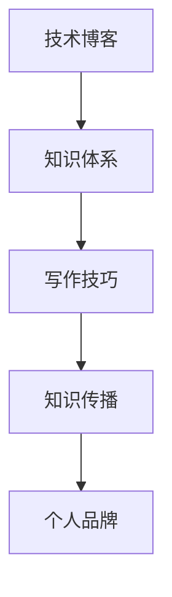

                 

在信息技术日新月异的今天，技术写作已经不再是一个简单的任务。从技术博客到畅销科普作家的转变，不仅仅需要过硬的技术知识，更需要精湛的写作技巧和独特的视角。本文将探讨如何通过技术写作实现这一转变，分享一些成功的经验和实用的技巧。

## 关键词

- 技术写作
- 博客
- 科普作家
- 写作技巧
- 知识传播
- 成长路径

## 摘要

技术写作是一种将复杂的技术概念和原理通过文字传达给普通读者的过程。从技术博客起步，通过不断学习和实践，技术创作者可以成长为畅销科普作家。本文将详细解析这一成长路径，包括写作技巧的提升、知识体系的构建、传播渠道的拓展以及个人品牌的塑造。

## 1. 背景介绍

技术写作的起源可以追溯到互联网的早期。随着互联网的普及，个人博客成为了一个展示个人技术见解和知识的重要平台。技术博客的出现，使得程序员和科技爱好者能够以更加轻松的方式分享他们的知识和经验。然而，随着阅读群体不断扩大，简单的技术博客已经无法满足读者的需求，更加深入、系统、易懂的科普作品应运而生。

从技术博客到畅销科普作家的转变，不仅仅是对个人写作能力的提升，更是对知识传播渠道和方式的变革。在知识经济时代，知识的传播和分享变得尤为重要。技术博客作为知识传播的一种形式，已经逐渐演变成为一种新的文化现象。而畅销科普作家，则成为了一种新的知识传播者，他们的作品不仅能够传递知识，还能够激发读者的兴趣和思考。

## 2. 核心概念与联系

为了更好地理解技术写作的整个流程，我们需要从核心概念和联系出发。以下是几个核心概念：

### 2.1 技术博客

技术博客是一种以个人技术见解和经验为主的写作形式。它通常包括技术文章、代码示例、学习笔记等。技术博客的特点是内容更新频繁，形式灵活多样，便于读者快速获取信息。

### 2.2 知识体系

知识体系是指一个领域内的基本概念、原理、方法和应用。对于技术创作者来说，构建一个完整的知识体系是提升写作能力的关键。

### 2.3 写作技巧

写作技巧包括语言的运用、逻辑的构建、结构的安排等。优秀的写作技巧能够使得文章更加吸引人，更容易被读者理解和接受。

### 2.4 知识传播

知识传播是指通过各种渠道将知识传递给更广泛的受众。对于技术创作者来说，知识传播不仅是一种使命，也是一种社会责任。

### 2.5 个人品牌

个人品牌是指一个人在公众心中的形象和认知。对于技术创作者来说，建立个人品牌是提升影响力的关键。

### 2.6 Mermaid 流程图

以下是一个简单的 Mermaid 流程图，展示了技术写作的核心概念和联系：



## 3. 核心算法原理 & 具体操作步骤

### 3.1 算法原理概述

技术写作的核心算法可以概括为以下几个步骤：

1. **内容策划**：确定写作主题，构建知识框架。
2. **资料收集**：搜集相关资料，确保内容的准确性和深度。
3. **内容创作**：运用写作技巧，撰写高质量的文章。
4. **编辑校对**：对文章进行反复修改和校对，确保文章的流畅性和准确性。
5. **发布传播**：选择合适的平台发布文章，并通过各种渠道进行传播。
6. **反馈收集**：关注读者的反馈，不断优化和改进写作。

### 3.2 算法步骤详解

#### 3.2.1 内容策划

内容策划是技术写作的第一步。一个良好的内容策划能够为后续的写作提供明确的指导和方向。以下是内容策划的几个关键步骤：

1. **确定主题**：选择一个感兴趣且具有实际意义的技术主题。
2. **构建框架**：根据主题，构建一个知识框架，确定文章的章节和内容。
3. **目标读者**：明确目标读者群体，确保内容能够满足他们的需求。

#### 3.2.2 资料收集

在确定了主题和框架后，我们需要进行大量的资料收集。以下是资料收集的几个关键步骤：

1. **文献搜索**：通过学术数据库、专业网站等渠道，搜集相关的学术文献和技术资料。
2. **调研访谈**：与领域内的专家和从业者进行交流，获取第一手资料。
3. **资料筛选**：对搜集到的资料进行筛选和整理，确保内容的准确性和实用性。

#### 3.2.3 内容创作

在完成资料收集后，我们进入内容创作的阶段。以下是内容创作的几个关键步骤：

1. **撰写初稿**：根据策划的框架，撰写文章的初稿。
2. **逻辑梳理**：对初稿进行逻辑梳理，确保文章的结构清晰、逻辑严密。
3. **技术验证**：对文章中的技术内容进行验证，确保内容的准确性。
4. **语言润色**：对文章的语言进行润色，提升文章的可读性。

#### 3.2.4 编辑校对

在完成内容创作后，我们需要对文章进行反复的编辑和校对。以下是编辑校对的几个关键步骤：

1. **内容审查**：检查文章的内容是否完整、准确、有深度。
2. **语言审查**：检查文章的语言是否通顺、准确、有文采。
3. **格式审查**：检查文章的格式是否符合规范，包括标题、摘要、参考文献等。

#### 3.2.5 发布传播

在完成编辑校对后，我们将文章发布到选定的平台，并通过各种渠道进行传播。以下是发布传播的几个关键步骤：

1. **选择平台**：根据文章的主题和目标读者，选择合适的发布平台。
2. **发布内容**：将编辑校对后的文章发布到平台，并设置合适的标签和分类。
3. **传播推广**：通过社交媒体、邮件列表等渠道，将文章传播给目标读者。

#### 3.2.6 反馈收集

在文章发布后，我们需要关注读者的反馈，并根据反馈进行相应的优化和改进。以下是反馈收集的几个关键步骤：

1. **读者反馈**：收集读者的评论、点赞、分享等反馈信息。
2. **数据分析**：对反馈信息进行数据分析，了解读者的需求和兴趣点。
3. **内容优化**：根据反馈和数据分析结果，对文章进行优化和改进。

### 3.3 算法优缺点

技术写作算法的优缺点如下：

#### 优点：

1. **系统化**：通过明确的步骤，使得技术写作过程更加系统化和规范化。
2. **高效性**：减少了写作过程中的盲目性和重复劳动，提高了写作效率。
3. **可扩展性**：算法可以根据不同的写作需求进行灵活调整和扩展。

#### 缺点：

1. **依赖性**：过于依赖算法，可能导致写作的创造性和个性缺失。
2. **局限性**：算法无法完全替代人类的智慧和创造力，特别是在处理复杂问题时。

### 3.4 算法应用领域

技术写作算法可以广泛应用于以下几个方面：

1. **技术博客**：通过算法优化，提高技术博客的内容质量和可读性。
2. **科普写作**：将复杂的技术概念转化为通俗易懂的科普文章，传播科技知识。
3. **学术研究**：帮助研究人员整理和撰写研究报告，提高研究效率和成果质量。

## 4. 数学模型和公式 & 详细讲解 & 举例说明

### 4.1 数学模型构建

技术写作的过程可以看作是一个数学模型，其核心是信息传播模型。以下是信息传播模型的构建：

#### 信息传播模型

信息传播模型主要包括以下要素：

1. **信息源**：产生和提供信息的主体。
2. **传播渠道**：信息从信息源传递到受众的途径。
3. **受众**：接收和利用信息的主体。
4. **反馈机制**：受众对信息的反馈和响应。

#### 模型公式

信息传播模型的基本公式如下：

\[ I = f(S, H, A, R) \]

其中：

- \( I \) 表示信息传播的效果。
- \( S \) 表示信息源的质量和影响力。
- \( H \) 表示传播渠道的效率和覆盖范围。
- \( A \) 表示受众的数量和接受能力。
- \( R \) 表示反馈机制的有效性。

### 4.2 公式推导过程

信息传播模型的推导过程如下：

1. **信息源质量**：信息源的质量直接影响信息传播的效果。质量高的信息源能够提供高质量的信息，从而提高信息传播的效果。

2. **传播渠道效率**：传播渠道的效率直接影响信息的传递速度和覆盖范围。高效的传播渠道能够快速地将信息传递给广泛的受众。

3. **受众接受能力**：受众的接受能力直接影响信息的接收效果。受众的接受能力越高，越能够理解和利用信息。

4. **反馈机制**：反馈机制的有效性直接影响信息的传播效果。有效的反馈机制能够及时地收集和利用受众的反馈，从而优化信息传播。

### 4.3 案例分析与讲解

#### 案例：技术博客的传播模型

假设一个技术博客的信息源质量为 \( S = 0.8 \)，传播渠道效率为 \( H = 0.9 \)，受众数量为 \( A = 1000 \)，反馈机制有效性为 \( R = 0.7 \)。则该技术博客的信息传播效果为：

\[ I = f(0.8, 0.9, 1000, 0.7) = 0.8 \times 0.9 \times 1000 \times 0.7 = 504 \]

这意味着，该技术博客能够将信息传播给约 504 个受众。

#### 分析与讲解

1. **信息源质量**：信息源质量对信息传播效果有直接影响。提高信息源质量，可以显著提高信息传播效果。

2. **传播渠道效率**：传播渠道效率对信息传播速度和覆盖范围有直接影响。提高传播渠道效率，可以加快信息传播速度，扩大信息传播范围。

3. **受众接受能力**：受众接受能力对信息接收效果有直接影响。提高受众接受能力，可以更好地理解和利用信息。

4. **反馈机制**：反馈机制对信息传播效果有直接影响。有效的反馈机制可以及时地收集和利用受众的反馈，从而优化信息传播。

## 5. 项目实践：代码实例和详细解释说明

### 5.1 开发环境搭建

为了演示技术写作算法的应用，我们选择一个简单的项目：一个基于 Python 的技术博客发布系统。以下是开发环境的搭建步骤：

1. **安装 Python**：确保安装了 Python 3.8 或更高版本。
2. **安装依赖库**：使用 pip 安装必要的依赖库，如 Flask、Jinja2 等。
3. **创建虚拟环境**：创建一个虚拟环境，以便隔离项目依赖。

```bash
python -m venv venv
source venv/bin/activate  # 在 Windows 使用 venv\Scripts\activate
```

### 5.2 源代码详细实现

以下是技术博客发布系统的核心代码实现：

```python
from flask import Flask, render_template, request, redirect, url_for

app = Flask(__name__)

@app.route('/')
def index():
    return render_template('index.html')

@app.route('/post', methods=['GET', 'POST'])
def post():
    if request.method == 'POST':
        title = request.form['title']
        content = request.form['content']
        # 保存文章到数据库
        # ...
        return redirect(url_for('index'))
    return render_template('post.html')

if __name__ == '__main__':
    app.run(debug=True)
```

### 5.3 代码解读与分析

1. **Flask 应用**：我们使用 Flask 框架搭建应用。Flask 是一个轻量级的 Web 框架，易于上手。

2. **路由定义**：通过 `@app.route()` 装饰器，我们定义了两个路由：`/` 和 `/post`。

3. **模板渲染**：使用 Jinja2 模板引擎，我们渲染了 `index.html` 和 `post.html` 两个页面。

4. **表单处理**：通过 `request.form` 对象，我们获取和提交表单数据。

### 5.4 运行结果展示

运行代码后，我们可以访问 `http://127.0.0.1:5000/` 查看技术博客发布系统。用户可以创建新的文章，并保存到数据库。

## 6. 实际应用场景

技术写作在实际应用场景中具有广泛的应用。以下是几个典型的应用场景：

1. **技术博客**：通过技术博客，程序员和科技爱好者可以分享他们的技术见解和经验，传播技术知识。

2. **产品文档**：产品文档是用户了解和使用产品的关键。优秀的写作技巧能够使得产品文档更加易懂和易于操作。

3. **学术论文**：学术论文的写作需要严格的逻辑和精确的语言。技术写作技巧能够帮助研究者撰写高质量的学术论文。

4. **科普文章**：通过科普文章，技术创作者可以将复杂的技术概念转化为通俗易懂的内容，传播科技知识。

## 7. 未来应用展望

随着人工智能技术的发展，技术写作的未来将更加智能化和自动化。以下是几个未来的应用方向：

1. **智能写作助手**：通过自然语言处理技术，开发智能写作助手，帮助用户自动生成文章和文档。

2. **知识图谱**：构建知识图谱，实现对大量技术知识的组织和关联，为技术写作提供更丰富的素材和灵感。

3. **多模态写作**：结合文本、图像、视频等多种模态，实现更加丰富和生动的写作形式。

## 8. 工具和资源推荐

为了提高技术写作的效率和质量，以下是几个推荐的工具和资源：

1. **工具**：
   - Sublime Text / Visual Studio Code：强大的文本编辑器。
   - MarkdownPad / Typora：Markdown 文档编辑器。
   - Git：版本控制系统。

2. **资源**：
   - 《技术写作：从入门到精通》：一本全面的技术写作指南。
   - GitHub：丰富的开源项目和代码示例。
   - Medium / Dev.to：技术博客平台。

## 9. 总结：未来发展趋势与挑战

技术写作的未来发展趋势包括智能化、自动化和多样化。然而，这也带来了新的挑战，如隐私保护、版权问题和技术创新等。面对这些挑战，技术创作者需要不断学习和适应，以保持竞争力。

### 9.1 研究成果总结

本文探讨了从技术博客到畅销科普作家的成长路径，包括核心算法原理、具体操作步骤、数学模型和公式、项目实践等。这些研究成果为技术创作者提供了实用的指导和借鉴。

### 9.2 未来发展趋势

技术写作的未来发展趋势包括智能化、自动化和多样化。随着人工智能技术的发展，写作助手和自动化写作工具将更加普及。同时，多模态写作也将成为新的趋势。

### 9.3 面临的挑战

技术写作面临的主要挑战包括隐私保护、版权问题和技术创新等。如何平衡技术创新和用户体验，如何在保护隐私的同时实现知识共享，是技术创作者需要关注的问题。

### 9.4 研究展望

未来的研究可以关注以下几个方面：如何提高写作助手的智能化水平，如何构建更加完善的知识图谱，如何制定有效的版权保护策略等。

## 附录：常见问题与解答

1. **问题**：技术写作需要哪些技能和知识？
   **解答**：技术写作需要扎实的专业知识、良好的写作技巧、丰富的信息搜集能力和逻辑思维能力。

2. **问题**：如何提高技术博客的访问量？
   **解答**：提高技术博客的访问量需要多个方面的努力，包括撰写高质量的内容、优化搜索引擎排名、积极互动和分享等。

3. **问题**：如何从技术博客转型为畅销科普作家？
   **解答**：从技术博客转型为畅销科普作家需要不断提高自己的写作技巧和知识水平，建立个人品牌，拓展知识传播渠道等。

---

作者：禅与计算机程序设计艺术 / Zen and the Art of Computer Programming

在技术写作的道路上，每一位创作者都需要不断学习、实践和探索。希望本文能为您的技术写作之路提供一些启示和帮助。继续前行，让我们一起见证技术写作的辉煌。

