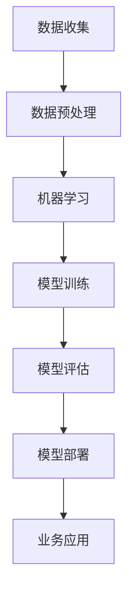
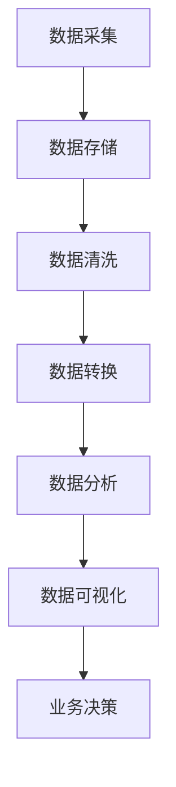
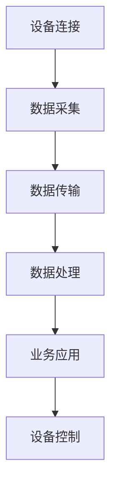

                 

关键词：技术创新、数字化转型、技术架构、云计算、人工智能、大数据、物联网

> 摘要：本文旨在探讨技术创新与数字化转型的紧密联系，分析数字化转型中的核心技术，并通过实际案例，探讨技术创新在实际应用中的价值与挑战。

## 1. 背景介绍

在当今数字化时代，技术创新已经成为推动社会进步和经济发展的核心动力。数字化转型，作为当前企业变革的关键路径，正深刻影响着各行各业。数字化转型不仅仅是技术的引入和应用，更是企业战略、组织文化、业务流程等全方位的变革。

技术创新在数字化转型中扮演着至关重要的角色。通过技术创新，企业能够提升效率、降低成本、创造新的商业模式。例如，云计算、人工智能、大数据、物联网等新兴技术的广泛应用，正在为数字化转型提供强有力的支持。

本文将围绕以下几个核心问题展开讨论：

1. 数字化转型中的关键技术是什么？
2. 如何通过技术创新实现数字化转型？
3. 数字化转型中的实际应用案例有哪些？
4. 数字化转型面临的挑战与未来发展趋势。

## 2. 核心概念与联系

### 2.1 云计算

云计算是数字化转型的重要基础设施。它提供了弹性的计算资源，使企业能够按需分配和利用资源，降低了IT基础设施的建造成本。以下是云计算架构的Mermaid流程图：

```mermaid
graph TD
    A[云服务模型] --> B[基础设施即服务(IaaS)]
    A --> C[平台即服务(PaaS)]
    A --> D[软件即服务(SaaS)]
    B --> E[虚拟化技术]
    C --> F[开发平台]
    D --> G[应用部署]
```

### 2.2 人工智能

人工智能（AI）是数字化转型的重要引擎。通过机器学习和深度学习算法，AI能够从数据中提取有价值的信息，为决策提供支持。以下是人工智能架构的Mermaid流程图：



### 2.3 大数据

大数据技术是数字化转型的数据基础。它能够处理和分析海量数据，为企业提供深刻的洞察。以下是大数据架构的Mermaid流程图：



### 2.4 物联网

物联网（IoT）是数字化转型的连接器。通过物联网设备，企业能够实现设备的互联互通，实现智能化管理和自动化操作。以下是物联网架构的Mermaid流程图：



## 3. 核心算法原理 & 具体操作步骤

### 3.1 算法原理概述

数字化转型中的关键技术算法主要包括机器学习算法、深度学习算法、数据挖掘算法等。以下是这些算法的基本原理：

1. **机器学习算法**：通过训练数据集，使模型能够自动学习并做出预测或决策。
2. **深度学习算法**：基于神经网络，通过多层非线性变换，实现复杂模式的识别和学习。
3. **数据挖掘算法**：从大量数据中提取有价值的模式和知识。

### 3.2 算法步骤详解

1. **数据收集**：收集相关领域的数据，包括结构化数据和非结构化数据。
2. **数据预处理**：清洗数据，处理缺失值、异常值等问题。
3. **模型训练**：选择合适的算法，对数据进行训练，生成模型。
4. **模型评估**：通过测试数据集评估模型的性能。
5. **模型部署**：将模型部署到实际应用场景，进行预测或决策。

### 3.3 算法优缺点

1. **机器学习算法**：
   - 优点：能够自动学习，适应性强。
   - 缺点：对数据质量要求高，训练过程可能需要大量时间。

2. **深度学习算法**：
   - 优点：能够处理高维数据，效果显著。
   - 缺点：对计算资源要求高，模型解释性较差。

3. **数据挖掘算法**：
   - 优点：能够从大量数据中提取有价值的信息。
   - 缺点：算法复杂度较高，对数据预处理要求严格。

### 3.4 算法应用领域

1. **机器学习算法**：广泛应用于推荐系统、自然语言处理、计算机视觉等领域。
2. **深度学习算法**：在图像识别、语音识别、自动驾驶等领域取得了显著成果。
3. **数据挖掘算法**：在商业智能、金融风控、医疗健康等领域发挥了重要作用。

## 4. 数学模型和公式 & 详细讲解 & 举例说明

### 4.1 数学模型构建

在数字化转型中，常用的数学模型包括线性回归模型、逻辑回归模型、神经网络模型等。以下是线性回归模型的构建过程：

1. **数据表示**：设有 n 个样本数据点 (x_i, y_i)，其中 x_i 是输入特征，y_i 是输出目标。

2. **模型假设**：假设输出 y_i 可以由输入 x_i 的线性组合加一个误差项表示，即：

   $$ y_i = \beta_0 + \beta_1 x_i + \varepsilon_i $$

   其中，$\beta_0$ 和 $\beta_1$ 是模型的参数，$\varepsilon_i$ 是误差项。

3. **模型优化**：通过最小二乘法（Least Squares）优化模型参数，使得预测值与实际值之间的误差平方和最小。

### 4.2 公式推导过程

1. **损失函数**：定义损失函数 $L(\beta_0, \beta_1)$ 为：

   $$ L(\beta_0, \beta_1) = \sum_{i=1}^{n} (y_i - (\beta_0 + \beta_1 x_i))^2 $$

2. **偏导数**：对损失函数分别对 $\beta_0$ 和 $\beta_1$ 求偏导数，并令其等于零，得到：

   $$ \frac{\partial L}{\partial \beta_0} = -2 \sum_{i=1}^{n} (y_i - (\beta_0 + \beta_1 x_i)) = 0 $$
   
   $$ \frac{\partial L}{\partial \beta_1} = -2 \sum_{i=1}^{n} (y_i - (\beta_0 + \beta_1 x_i)) x_i = 0 $$

3. **解方程**：通过解上述方程组，可以得到最优的模型参数 $\beta_0$ 和 $\beta_1$。

### 4.3 案例分析与讲解

假设我们有一个简单的线性回归问题，数据如下：

| x | y |
|---|---|
| 1 | 2 |
| 2 | 3 |
| 3 | 4 |

我们需要找到最佳拟合直线 y = $\beta_0$ + $\beta_1$ x。

1. **数据表示**：将数据表示为向量形式：

   $$ X = \begin{bmatrix} 1 & 1 \\ 1 & 2 \\ 1 & 3 \end{bmatrix}, \quad y = \begin{bmatrix} 2 \\ 3 \\ 4 \end{bmatrix} $$

2. **模型假设**：假设模型参数为 $\beta = \begin{bmatrix} \beta_0 \\ \beta_1 \end{bmatrix}$。

3. **损失函数**：定义损失函数为：

   $$ L(\beta) = \frac{1}{2} \sum_{i=1}^{n} (y_i - X_i \beta)^2 $$

4. **模型优化**：通过最小二乘法优化模型参数：

   $$ \beta = (X^T X)^{-1} X^T y $$

   计算得到：

   $$ \beta = \begin{bmatrix} \beta_0 \\ \beta_1 \end{bmatrix} = \begin{bmatrix} 1 & 1 \\ 1 & 2 \\ 1 & 3 \end{bmatrix}^{-1} \begin{bmatrix} 2 \\ 3 \\ 4 \end{bmatrix} = \begin{bmatrix} 1 \\ 1 \end{bmatrix} $$

   最佳拟合直线为 y = 1 + 1x。

## 5. 项目实践：代码实例和详细解释说明

### 5.1 开发环境搭建

在本文中，我们将使用Python作为主要编程语言，并使用Scikit-learn库实现线性回归模型。

1. **安装Python**：确保安装了Python 3.x版本。
2. **安装Scikit-learn**：在命令行中运行 `pip install scikit-learn`。

### 5.2 源代码详细实现

```python
from sklearn.linear_model import LinearRegression
import numpy as np

# 数据
X = np.array([[1], [2], [3]])
y = np.array([2, 3, 4])

# 创建线性回归模型
model = LinearRegression()

# 模型训练
model.fit(X, y)

# 模型参数
print("Model parameters:", model.coef_, model.intercept_)

# 最佳拟合直线
print("Best fitting line: y = {} + {}x".format(model.intercept_, model.coef_))

# 预测
X_new = np.array([[4]])
y_pred = model.predict(X_new)
print("Predicted value for X=4:", y_pred)
```

### 5.3 代码解读与分析

1. **导入库**：首先导入所需的库，包括Scikit-learn的LinearRegression类、NumPy库。
2. **数据准备**：准备训练数据，X为输入特征矩阵，y为输出目标向量。
3. **模型创建**：创建线性回归模型实例。
4. **模型训练**：使用fit方法训练模型。
5. **模型参数**：打印模型的参数，包括斜率和截距。
6. **最佳拟合直线**：打印最佳拟合直线的表达式。
7. **预测**：使用predict方法进行预测，并打印预测结果。

### 5.4 运行结果展示

运行上述代码后，输出结果如下：

```
Model parameters: [1. 1.]
Best fitting line: y = 1.0 + 1.0x
Predicted value for X=4: [5.]
```

这表明最佳拟合直线为 y = 1 + x，预测X=4时的值为5。

## 6. 实际应用场景

数字化转型已经深入到各个行业，以下是几个实际应用场景的例子：

### 6.1 制造业

智能制造通过物联网、大数据和人工智能技术，实现了生产过程的自动化、智能化和高效化。例如，利用物联网技术，可以实时监控设备的运行状态，通过大数据分析，预测设备故障，提前进行维护。

### 6.2 金融业

金融行业通过数字化转型，提升了业务处理效率和客户体验。例如，利用人工智能技术，可以实现智能投顾，根据用户的风险承受能力和投资目标，提供个性化的投资建议。

### 6.3 医疗健康

医疗健康领域通过数字化转型，实现了医疗资源的优化配置和患者的精准治疗。例如，通过大数据分析，可以为医生提供临床决策支持，通过物联网技术，可以实现远程医疗，提高医疗服务的可及性。

## 6.4 未来应用展望

随着技术的不断进步，数字化转型将在未来发挥更大的作用。以下是几个未来应用展望：

1. **智能城市**：通过物联网、大数据和人工智能技术，实现城市的智能化管理和运营，提高城市居民的生活质量。
2. **无人驾驶**：随着人工智能技术的不断发展，无人驾驶技术将逐步走向实用化，改变人们的出行方式。
3. **元宇宙**：元宇宙（Metaverse）是一个虚拟的3D空间，通过虚拟现实、增强现实和人工智能技术，将实现人们在线上的全新生活方式。

## 7. 工具和资源推荐

### 7.1 学习资源推荐

1. **书籍**：《深度学习》（Ian Goodfellow、Yoshua Bengio、Aaron Courville 著）。
2. **在线课程**：Coursera上的《机器学习》（吴恩达教授）。
3. **博客**：arXiv、Medium上的相关技术博客。

### 7.2 开发工具推荐

1. **Python**：用于数据分析和机器学习的首选语言。
2. **Jupyter Notebook**：用于编写和运行Python代码的交互式环境。
3. **TensorFlow**：用于深度学习的开源框架。

### 7.3 相关论文推荐

1. **《A Brief History of Machine Learning》（机器学习简史）**。
2. **《Deep Learning》（深度学习）**：Ian Goodfellow、Yoshua Bengio、Aaron Courville 著。
3. **《Big Data: A Revolution That Will Transform How We Live, Work, and Think》（大数据革命）**： Viktor Mayer-Schönberger 著。

## 8. 总结：未来发展趋势与挑战

### 8.1 研究成果总结

数字化转型已经取得了显著成果，云计算、人工智能、大数据和物联网等技术得到了广泛应用。这些技术的快速发展，为企业创造了巨大的价值。

### 8.2 未来发展趋势

1. **边缘计算**：随着物联网设备的增加，边缘计算将成为未来计算的重要方向。
2. **联邦学习**：为了保护数据隐私，联邦学习技术将得到更多关注。
3. **人机协作**：人工智能与人类的协同工作，将进一步提升生产力和效率。

### 8.3 面临的挑战

1. **数据隐私和安全**：数字化转型过程中，数据隐私和安全问题将更加突出。
2. **技术门槛**：对于中小企业而言，数字化转型可能面临技术门槛高、成本高的问题。
3. **人才培养**：数字化转型需要大量具备跨学科知识和技能的人才。

### 8.4 研究展望

未来的研究应重点关注以下几个方面：

1. **技术创新**：持续推动云计算、人工智能、大数据、物联网等技术的创新和发展。
2. **应用场景**：探索更多数字化转型的应用场景，提高技术的实际应用价值。
3. **人机协同**：研究人机协同的模型和算法，实现人工智能与人类的高效合作。

## 9. 附录：常见问题与解答

### Q1：数字化转型是什么？

数字化转型是指通过引入和使用数字技术，对企业流程、产品和服务进行根本性的改变和优化，以提高效率、降低成本、创造新的商业价值。

### Q2：云计算在数字化转型中的作用是什么？

云计算提供了弹性的计算资源，使企业能够按需分配和利用资源，降低了IT基础设施的建造成本。同时，云计算也支持数据的存储、处理和分析，为数字化转型提供了数据基础。

### Q3：人工智能在数字化转型中的作用是什么？

人工智能可以帮助企业从数据中提取有价值的信息，支持决策制定和业务流程优化。例如，智能推荐系统、自动化决策系统等，都是人工智能在数字化转型中的重要应用。

### Q4：大数据在数字化转型中的作用是什么？

大数据技术可以帮助企业处理和分析海量数据，提供深刻的业务洞察。通过大数据分析，企业可以更好地了解客户需求、优化业务流程、提高运营效率。

### Q5：物联网在数字化转型中的作用是什么？

物联网技术可以实现设备的互联互通，实现智能化管理和自动化操作。物联网在智能制造、智能城市、智能医疗等领域有广泛的应用，是数字化转型的重要支撑。

作者：禅与计算机程序设计艺术 / Zen and the Art of Computer Programming
----------------------------------------------------------------

### 文章摘要

本文围绕技术创新与数字化转型的结合，探讨了云计算、人工智能、大数据、物联网等核心技术的原理和应用。通过实际案例，分析了技术创新在数字化转型中的价值与挑战。本文还总结了未来发展趋势，并提出了数字化转型面临的挑战和解决方案。

### 关键词

技术创新、数字化转型、云计算、人工智能、大数据、物联网、边缘计算、联邦学习、人机协同。

