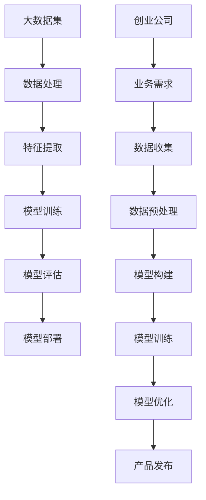

                 

关键词：大模型、创业、技术应用、深度学习、算法、AI、软件开发、商业策略

> 摘要：随着人工智能技术的不断进步，大模型已成为创新和商业成功的利器。本文将深入探讨大模型在创业中的应用，分析其核心算法原理、数学模型、实践案例，并展望其未来的发展前景。

## 1. 背景介绍

在过去的十年中，人工智能（AI）技术取得了前所未有的突破。深度学习、神经网络等算法的进步，使得计算机在图像识别、语音识别、自然语言处理等方面表现优异。这些技术的成熟，催生了许多新兴的创业公司，它们利用大模型技术实现了业务的快速增长。

大模型，通常指的是具有数百万甚至数十亿参数的神经网络模型。这些模型在训练过程中需要大量的数据和高性能计算资源。随着硬件性能的提升和云计算的发展，大模型的构建和训练变得越来越可行。因此，大模型成为了创业公司竞相追逐的利器。

## 2. 核心概念与联系

为了更好地理解大模型在创业中的应用，我们需要先了解其核心概念和原理。以下是关键概念及其关系的 Mermaid 流程图：



### 2.1 大数据集

大数据集是大模型训练的基础。创业公司需要收集大量的数据，包括用户行为数据、市场数据、文本数据等。数据的质量和数量直接影响模型的性能。

### 2.2 数据处理

数据处理包括数据清洗、数据归一化等步骤。这一步确保数据的质量和一致性，为后续的特征提取和模型训练奠定基础。

### 2.3 特征提取

特征提取是将原始数据转换为模型可以理解的形式。这一步涉及到数据降维、特征选择等技术，对于提高模型性能至关重要。

### 2.4 模型训练

模型训练是构建大模型的核心步骤。通过大量的数据训练，模型可以学会识别数据中的规律，从而实现预测和分类等功能。

### 2.5 模型评估

模型评估用于测试模型的性能。创业公司需要通过交叉验证、A/B 测试等方法评估模型的效果，以指导模型的优化。

### 2.6 模型部署

模型部署是将训练好的模型应用到实际业务中。创业公司需要将模型集成到产品中，以实现自动化决策和优化。

### 2.7 创业公司

创业公司是大模型技术的直接受益者。通过构建和优化大模型，创业公司可以更好地满足用户需求，提高市场竞争力。

## 3. 核心算法原理 & 具体操作步骤

### 3.1 算法原理概述

大模型的核心算法是深度学习，特别是卷积神经网络（CNN）和循环神经网络（RNN）。CNN 适用于图像识别和图像处理任务，而 RNN 适用于序列数据，如自然语言处理和时间序列预测。

### 3.2 算法步骤详解

#### 3.2.1 数据准备

- 数据收集：创业公司需要收集大量的数据，如用户行为数据、市场数据等。
- 数据清洗：去除数据中的噪声和异常值，确保数据质量。

#### 3.2.2 特征提取

- 数据预处理：对数据进行归一化、标准化等处理，使其符合模型训练要求。
- 特征选择：通过降维、特征选择等技术，提取对模型训练有帮助的特征。

#### 3.2.3 模型构建

- 选择模型架构：根据任务类型选择合适的模型架构，如 CNN 或 RNN。
- 初始化参数：为模型初始化参数，如权重、偏置等。

#### 3.2.4 模型训练

- 定义损失函数：根据任务类型选择合适的损失函数，如交叉熵损失。
- 定义优化器：选择合适的优化器，如随机梯度下降（SGD）或 Adam。
- 训练过程：通过迭代更新模型参数，使模型在训练数据上达到最佳性能。

#### 3.2.5 模型评估

- 交叉验证：将训练数据分为训练集和验证集，评估模型在验证集上的性能。
- A/B 测试：在实际环境中评估模型的性能，以便调整模型参数和策略。

#### 3.2.6 模型部署

- 模型集成：将训练好的模型集成到产品中，实现自动化决策和优化。
- 持续优化：根据用户反馈和业务需求，持续优化模型性能。

### 3.3 算法优缺点

#### 优点

- 高效性：深度学习模型可以处理大量数据，提高算法的效率和准确性。
- 自适应性：模型可以根据不同的任务和数据集进行调整，具有较好的泛化能力。
- 易于集成：深度学习模型可以方便地集成到现有的产品中，实现快速部署。

#### 缺点

- 计算资源需求高：训练大模型需要大量的计算资源和时间。
- 数据依赖性：模型的性能很大程度上取决于数据质量和数量。
- 黑盒特性：深度学习模型的结构和决策过程较为复杂，难以解释。

### 3.4 算法应用领域

深度学习算法在多个领域具有广泛应用，包括：

- 图像识别：计算机视觉领域的重要应用，如人脸识别、图像分类等。
- 自然语言处理：语音识别、机器翻译、情感分析等。
- 语音识别：将语音信号转换为文本或指令，应用于智能助手和语音交互系统。
- 电子商务：用户行为分析、推荐系统、价格优化等。

## 4. 数学模型和公式

### 4.1 数学模型构建

深度学习模型通常由多层神经网络组成，每层由多个神经元（节点）组成。神经元的激活函数通常是 sigmoid 或 ReLU。

### 4.2 公式推导过程

假设我们有一个包含 L 层的神经网络，输入数据为 \( x \)，输出数据为 \( y \)。每层神经元的输出可以表示为：

\[ z_l = \sigma(W_l \cdot a_{l-1} + b_l) \]

其中，\( W_l \) 和 \( b_l \) 分别表示权重和偏置，\( \sigma \) 表示激活函数。对于输出层，损失函数通常为交叉熵损失：

\[ L = -\sum_{i} y_i \log (\sigma(z_L)) \]

### 4.3 案例分析与讲解

假设我们有一个分类问题，数据集包含 1000 个样本，每个样本有 10 个特征。我们要构建一个深度神经网络进行分类。

- 数据准备：收集并清洗数据，将数据分为训练集和测试集。
- 特征提取：对数据进行归一化处理，提取主要特征。
- 模型构建：选择合适的神经网络架构，如卷积神经网络（CNN）。
- 模型训练：使用训练集数据训练模型，选择合适的优化器和损失函数。
- 模型评估：使用测试集数据评估模型性能，调整模型参数。
- 模型部署：将训练好的模型集成到产品中，实现自动化决策。

## 5. 项目实践：代码实例

### 5.1 开发环境搭建

- 安装 Python 3.8 及以上版本
- 安装 TensorFlow 2.4.0 及以上版本
- 安装 NumPy 1.19.5 及以上版本

### 5.2 源代码详细实现

```python
import tensorflow as tf
from tensorflow.keras.layers import Dense, Flatten, Conv2D, MaxPooling2D
from tensorflow.keras.models import Sequential

# 数据准备
(x_train, y_train), (x_test, y_test) = tf.keras.datasets.mnist.load_data()
x_train = x_train.astype("float32") / 255.0
x_test = x_test.astype("float32") / 255.0

# 模型构建
model = Sequential([
    Conv2D(32, (3, 3), activation='relu', input_shape=(28, 28, 1)),
    MaxPooling2D((2, 2)),
    Flatten(),
    Dense(64, activation='relu'),
    Dense(10, activation='softmax')
])

# 模型编译
model.compile(optimizer='adam',
              loss='sparse_categorical_crossentropy',
              metrics=['accuracy'])

# 模型训练
model.fit(x_train, y_train, epochs=5, batch_size=64)

# 模型评估
test_loss, test_acc = model.evaluate(x_test, y_test)
print(f"Test accuracy: {test_acc:.2f}")

# 模型部署
predictions = model.predict(x_test)
```

### 5.3 代码解读与分析

该示例使用 TensorFlow 构建了一个简单的卷积神经网络（CNN）模型，用于手写数字识别。代码分为以下几个部分：

- 数据准备：加载和预处理 MNIST 数据集。
- 模型构建：定义 CNN 模型的架构，包括卷积层、池化层、全连接层等。
- 模型编译：配置优化器和损失函数。
- 模型训练：使用训练集数据训练模型。
- 模型评估：使用测试集数据评估模型性能。
- 模型部署：将训练好的模型应用到实际数据上。

## 6. 实际应用场景

大模型在创业中的应用场景广泛，以下是一些典型案例：

- 智能医疗：利用深度学习模型对医疗数据进行处理和分析，实现疾病预测、诊断和个性化治疗。
- 金融科技：通过深度学习模型分析用户行为和金融市场数据，实现风险控制和投资策略优化。
- 电子商务：利用深度学习模型进行用户行为分析、推荐系统和价格优化，提高用户体验和销售额。
- 智能制造：通过深度学习模型实现设备故障预测、生产优化和质量检测，提高生产效率和产品质量。

## 7. 工具和资源推荐

### 7.1 学习资源推荐

- 《深度学习》（Ian Goodfellow、Yoshua Bengio、Aaron Courville 著）
- 《神经网络与深度学习》（邱锡鹏 著）
- Coursera 上的《深度学习》课程

### 7.2 开发工具推荐

- TensorFlow：适用于构建和训练深度学习模型的开源框架。
- PyTorch：适用于研究和开发的深度学习框架。
- Keras：基于 TensorFlow 的高级深度学习库，易于使用和扩展。

### 7.3 相关论文推荐

- "Deep Learning" (Goodfellow et al., 2016)
- "A Theoretically Grounded Application of Dropout in Computer Vision" (Srivastava et al., 2014)
- "Convolutional Neural Networks for Visual Recognition" (LeCun et al., 2015)

## 8. 总结：未来发展趋势与挑战

### 8.1 研究成果总结

近年来，深度学习和大模型技术取得了显著成果。算法性能不断提高，应用场景不断拓展。特别是在计算机视觉、自然语言处理等领域，深度学习已经超越了传统算法，成为主流技术。

### 8.2 未来发展趋势

- 算法性能的提升：随着硬件性能的提升和算法的优化，大模型的性能将继续提高。
- 算法应用的拓展：深度学习将应用于更多领域，如自动驾驶、智能城市、医疗健康等。
- 算法解释性增强：为了提高算法的可解释性，研究者将致力于开发可解释性深度学习算法。

### 8.3 面临的挑战

- 数据质量和隐私保护：高质量的数据是深度学习模型训练的基础。然而，数据质量和隐私保护是一个亟待解决的问题。
- 计算资源需求：训练大模型需要大量的计算资源和时间，这对创业公司的资源管理提出了挑战。
- 算法黑盒特性：深度学习模型的决策过程复杂，难以解释。为了提高算法的可解释性，研究者需要开发新的方法和技术。

### 8.4 研究展望

未来，深度学习和大模型技术将在多个领域取得突破。随着算法性能的提升和应用场景的拓展，深度学习将为企业带来更多的商业机会。同时，为了应对挑战，研究者需要关注数据质量和隐私保护、计算资源管理以及算法可解释性等问题。

## 9. 附录：常见问题与解答

### 9.1 什么是深度学习？

深度学习是一种基于神经网络的机器学习技术，通过多层神经网络对数据进行处理和分析，实现图像识别、语音识别、自然语言处理等任务。

### 9.2 大模型训练需要哪些计算资源？

大模型训练需要大量的计算资源和时间。通常，需要使用高性能计算服务器或 GPU 来加速训练过程。

### 9.3 深度学习算法如何提高性能？

提高深度学习算法性能的方法包括优化算法架构、改进训练策略、使用更大的数据集等。此外，研究者还可以通过迁移学习、数据增强等方法提高算法的泛化能力。

### 9.4 大模型在创业中的应用有哪些？

大模型在创业中的应用包括智能医疗、金融科技、电子商务、智能制造等领域。通过构建和应用大模型，企业可以实现自动化决策、优化业务流程和提高用户体验。

### 9.5 如何评估深度学习模型的性能？

评估深度学习模型的性能通常使用准确率、召回率、F1 值等指标。此外，还可以通过交叉验证、A/B 测试等方法评估模型在不同数据集上的性能。

---

### 作者署名

作者：禅与计算机程序设计艺术 / Zen and the Art of Computer Programming
```

