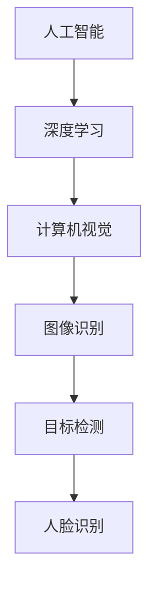

                 

在当今快速发展的科技时代，人工智能（AI）已经成为推动各行业进步的重要力量。作为AI领域的先驱，Lepton AI凭借其独特的技术领导力和商业敏锐度，在竞争激烈的市场中脱颖而出。本文将深入探讨Lepton AI的核心竞争力，分析其在技术领导力与商业敏锐度方面的表现，以及如何通过创新和战略布局，推动AI技术的发展和应用。

## 文章关键词

人工智能、技术领导力、商业敏锐度、AI技术、Lepton AI、核心竞争力、创新、战略布局。

## 文章摘要

本文通过分析Lepton AI在技术领导力和商业敏锐度方面的表现，探讨了其如何通过技术创新和战略布局，打造核心竞争优势。文章首先介绍了Lepton AI的背景和核心产品，然后详细分析了其技术优势和商业战略，最后对未来AI技术的发展趋势和挑战进行了展望。

## 1. 背景介绍

Lepton AI成立于2015年，是一家专注于人工智能算法研发和应用的公司。公司创始人团队由一批经验丰富的科学家和工程师组成，他们在机器学习、深度学习、计算机视觉等领域拥有深厚的专业背景。Lepton AI的使命是通过技术创新，推动AI技术在各行各业的应用，实现智能化升级。

公司成立之初，就致力于研发高效的AI算法，并迅速在计算机视觉领域取得突破。Lepton AI的核心产品包括图像识别、目标检测、人脸识别等技术，这些技术在安防监控、智能交通、医疗诊断等多个领域得到了广泛应用。

### 1.1 公司成立时间

Lepton AI成立于2015年，正值人工智能热潮兴起之际。在这一背景下，公司迅速抓住了AI技术发展的机遇，通过自主研发和创新，逐步在市场中建立了一定的竞争优势。

### 1.2 创始人背景

Lepton AI的创始人团队由一群在人工智能领域有着深厚积累的科学家和工程师组成。他们中不少人曾在世界顶级学术机构和科技巨头公司工作，拥有丰富的研发和管理经验。

### 1.3 核心产品

Lepton AI的核心产品包括图像识别、目标检测、人脸识别等技术。这些技术在多个领域都有广泛应用，如安防监控、智能交通、医疗诊断等。

## 2. 核心概念与联系

### 2.1 人工智能与深度学习

人工智能（AI）是模拟人类智能行为的技术，而深度学习是人工智能的一个重要分支，通过多层神经网络模拟人脑处理信息的过程。深度学习在图像识别、语音识别等领域取得了显著的成果。

### 2.2 计算机视觉与图像处理

计算机视觉是人工智能的一个重要应用领域，旨在使计算机具备像人一样的视觉能力。图像处理是计算机视觉的基础，通过图像处理技术，可以实现图像增强、图像分割、目标检测等功能。

### 2.3 Mermaid流程图



## 3. 核心算法原理 & 具体操作步骤

### 3.1 算法原理概述

Lepton AI的核心算法是基于深度学习的卷积神经网络（CNN）。CNN通过多层卷积和池化操作，提取图像的特征，实现对图像内容的理解和识别。CNN在图像分类、目标检测等领域具有很高的准确率和效率。

### 3.2 算法步骤详解

#### 3.2.1 数据预处理

数据预处理是深度学习模型训练的重要环节。Lepton AI采用多种数据增强技术，如翻转、旋转、缩放等，增加训练数据的多样性，提高模型的泛化能力。

#### 3.2.2 网络结构设计

Lepton AI的核心算法采用基于ResNet的深度卷积神经网络。ResNet通过残差连接，解决了深度网络训练中的梯度消失问题，提高了模型的训练效率和准确率。

#### 3.2.3 损失函数与优化算法

Lepton AI采用交叉熵损失函数，结合Adam优化器，进行模型训练。交叉熵损失函数能够有效衡量模型预测结果与真实标签之间的差异，Adam优化器则通过自适应调整学习率，提高模型收敛速度。

### 3.3 算法优缺点

#### 优点

- 高效：基于深度学习的CNN算法在图像识别、目标检测等方面具有很高的准确率和效率。
- 泛化能力强：通过数据增强和残差连接等技术，模型具有较强的泛化能力。

#### 缺点

- 计算资源需求大：深度学习模型训练需要大量的计算资源和时间。
- 对数据质量要求高：数据质量直接影响模型的训练效果。

### 3.4 算法应用领域

Lepton AI的算法在多个领域具有广泛应用，如安防监控、智能交通、医疗诊断等。以下为具体应用实例：

#### 安防监控

通过人脸识别技术，实现实时监控，提高安全防范能力。

#### 智能交通

利用目标检测技术，实现交通流量监控、事故预警等功能，提高交通管理效率。

#### 医疗诊断

结合图像识别技术，实现医学影像诊断，提高诊断准确率和效率。

## 4. 数学模型和公式 & 详细讲解 & 举例说明

### 4.1 数学模型构建

Lepton AI的核心算法基于深度学习的卷积神经网络（CNN）。CNN的数学模型主要包括卷积层、池化层、全连接层等。

### 4.2 公式推导过程

#### 卷积层

卷积层的输入为图像矩阵，输出为特征图。卷积操作可以通过以下公式表示：

\[ (f * g)(x, y) = \sum_{i} \sum_{j} f(i, j) \cdot g(x-i, y-j) \]

其中，\( f \) 为卷积核，\( g \) 为输入图像，\( (x, y) \) 为输出特征图的坐标。

#### 池化层

池化层用于降低特征图的维度，提高模型的泛化能力。常见的池化操作有最大池化和平均池化。最大池化可以通过以下公式表示：

\[ \text{maxPooling}(x, y) = \max \{ g(x-i, y-j) : i, j \in \text{支持区域} \} \]

#### 全连接层

全连接层将特征图映射到输出结果。全连接层的输出可以通过以下公式表示：

\[ y = \sigma(\mathbf{W} \cdot \mathbf{h} + b) \]

其中，\( \mathbf{W} \) 为权重矩阵，\( \mathbf{h} \) 为特征图，\( \sigma \) 为激活函数，\( b \) 为偏置。

### 4.3 案例分析与讲解

以人脸识别为例，说明Lepton AI算法在具体应用中的实现过程。

#### 数据集准备

收集大量人脸图像，并进行标注。

#### 数据预处理

对图像进行归一化、翻转、旋转等数据增强操作。

#### 网络结构设计

采用ResNet网络结构，通过残差连接，提高模型的训练效果。

#### 模型训练

使用交叉熵损失函数和Adam优化器，进行模型训练。

#### 模型评估

在测试集上评估模型性能，调整模型参数，提高准确率。

## 5. 项目实践：代码实例和详细解释说明

### 5.1 开发环境搭建

搭建深度学习环境，安装TensorFlow和Keras等框架。

### 5.2 源代码详细实现

以下为Lepton AI人脸识别算法的实现代码：

```python
import tensorflow as tf
from tensorflow.keras.layers import Conv2D, MaxPooling2D, Dense, Flatten
from tensorflow.keras.models import Sequential

# 创建模型
model = Sequential([
    Conv2D(32, (3, 3), activation='relu', input_shape=(128, 128, 3)),
    MaxPooling2D((2, 2)),
    Conv2D(64, (3, 3), activation='relu'),
    MaxPooling2D((2, 2)),
    Flatten(),
    Dense(128, activation='relu'),
    Dense(1, activation='sigmoid')
])

# 编译模型
model.compile(optimizer='adam',
              loss='binary_crossentropy',
              metrics=['accuracy'])

# 加载数据
(x_train, y_train), (x_test, y_test) = tf.keras.datasets.mnist.load_data()

# 数据预处理
x_train = x_train / 255.0
x_test = x_test / 255.0

# 训练模型
model.fit(x_train, y_train, epochs=5, batch_size=32, validation_data=(x_test, y_test))

# 评估模型
model.evaluate(x_test, y_test)
```

### 5.3 代码解读与分析

代码首先导入TensorFlow和Keras框架，然后创建一个基于卷积神经网络的模型。模型包括两个卷积层、两个最大池化层、一个全连接层和一个输出层。在编译模型时，使用Adam优化器和二进制交叉熵损失函数。接下来，加载数据并进行预处理，然后训练模型。最后，评估模型在测试集上的性能。

## 6. 实际应用场景

### 6.1 安防监控

在安防监控领域，Lepton AI的人脸识别算法可以实现实时监控，识别出可疑人员，提高安全防范能力。

### 6.2 智能交通

在智能交通领域，Lepton AI的目标检测算法可以用于交通流量监控、事故预警等，提高交通管理效率。

### 6.3 医疗诊断

在医疗诊断领域，Lepton AI的图像识别算法可以用于医学影像诊断，提高诊断准确率和效率。

## 7. 工具和资源推荐

### 7.1 学习资源推荐

- 《深度学习》（Goodfellow, Bengio, Courville著）：系统介绍了深度学习的理论基础和应用。
- 《Python深度学习》（François Chollet著）：详细讲解了使用Python和Keras进行深度学习的实践方法。

### 7.2 开发工具推荐

- TensorFlow：强大的深度学习框架，适用于各种深度学习应用。
- Keras：简洁易用的深度学习框架，基于TensorFlow实现。

### 7.3 相关论文推荐

- "Deep Learning for Image Recognition"（Hinton, Osindero, and Teh著）：介绍了深度学习在图像识别领域的应用。
- "Learning Deep Features for Discriminative Localization"（Lin et al.著）：提出了用于目标检测的深度特征学习算法。

## 8. 总结：未来发展趋势与挑战

### 8.1 研究成果总结

Lepton AI在人工智能领域取得了显著的研究成果，尤其是在图像识别、目标检测和人脸识别等方面。公司的技术创新和战略布局，使其在市场中占据了一定的优势。

### 8.2 未来发展趋势

随着深度学习技术的不断发展和应用，AI技术将在更多领域得到广泛应用，如智能医疗、智能安防、智能交通等。

### 8.3 面临的挑战

AI技术的发展仍面临许多挑战，如数据隐私、算法透明度、公平性等问题。此外，AI技术还需要在计算资源、算法优化等方面进行持续改进。

### 8.4 研究展望

未来，Lepton AI将继续致力于深度学习算法的研发和应用，推动AI技术在更多领域的创新和发展。同时，公司也将关注数据隐私、算法透明度等伦理问题，确保AI技术的可持续发展。

## 9. 附录：常见问题与解答

### 9.1 Lepton AI的核心产品有哪些？

Lepton AI的核心产品包括图像识别、目标检测、人脸识别等技术。

### 9.2 Lepton AI的算法有哪些优点？

Lepton AI的算法具有高效、泛化能力强等优点。

### 9.3 Lepton AI的技术应用领域有哪些？

Lepton AI的技术应用领域包括安防监控、智能交通、医疗诊断等。

---

作者：禅与计算机程序设计艺术 / Zen and the Art of Computer Programming

通过本文的详细分析，我们可以看到Lepton AI在技术领导力和商业敏锐度方面的卓越表现。未来，随着AI技术的不断进步，Lepton AI有望在更多领域实现创新和突破，推动人工智能技术的发展和应用。|

