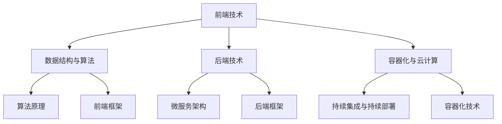

                 

### 关键词 Keywords

- 拼多多
- 2024校招
- 全栈工程师
- 面试实战
- 技术挑战
- 技术面试题
- 技术原理
- 编程实践
- 数据结构与算法
- 前端技术
- 后端技术
- 容器化技术
- 云计算
- 微服务架构
- DevOps
- 软件工程
- 拼多多校招面试经验

# 摘要 Summary

本文旨在为准备参加拼多多2024校招的全栈工程师职位考生提供一场全面的技术面试实战。通过对拼多多校招面试常见题型和技术难题的分析，结合实际案例和算法原理，本文将帮助考生深入了解全栈工程师所需掌握的核心技术和面试策略。文章结构包括背景介绍、核心概念与联系、算法原理与操作步骤、数学模型与公式、项目实践、实际应用场景、工具和资源推荐、总结及展望等内容，旨在为考生提供一份系统化、实战化的备考指南。

## 1. 背景介绍 Introduction

### 1.1 拼多多简介

拼多多是一家成立于2015年的中国电商平台，以社交电商模式迅速崛起，成为全球最大的社交电商公司之一。拼多多通过独特的“拼团购物”模式，让用户通过分享和邀请好友共同购买商品，以享受更低的优惠价格。这种模式不仅增强了用户之间的互动，还大幅降低了获客成本，提升了用户黏性。

### 1.2 全栈工程师的角色与职责

全栈工程师是既掌握前端技术，又精通后端技术的综合性开发人员。在拼多多这样的电商平台，全栈工程师不仅需要负责网站前端页面的设计与实现，还需要处理后端业务逻辑、数据库管理、接口设计等任务。此外，随着微服务架构和云计算技术的普及，全栈工程师还需具备容器化、DevOps等方面的技能。

### 1.3 校招面试的重要性

对于准备加入拼多多的应届毕业生来说，校招面试是进入公司的重要途径。面试不仅是考察技术能力的平台，更是展示个人综合素质和职业发展潜力的机会。因此，充分准备校招面试，对于考生来说至关重要。

## 2. 核心概念与联系 Core Concepts and Relationships

### 2.1 数据结构与算法

数据结构与算法是全栈工程师必备的基础知识。常见的算法包括排序算法（如快速排序、归并排序）、搜索算法（如二分搜索、深度优先搜索）以及动态规划等。在拼多多校招面试中，这类问题经常以实现代码、分析时间复杂度和空间复杂度等形式出现。

### 2.2 前端技术

前端技术主要包括HTML、CSS和JavaScript。全栈工程师需熟练掌握现代前端框架（如React、Vue、Angular）以及前端工程化工具（如Webpack、Babel）。在实际开发中，前端技术不仅要实现页面布局和交互效果，还需关注性能优化、响应式设计等方面。

### 2.3 后端技术

后端技术包括服务器端编程、数据库管理、接口设计等。常见的后端框架有Node.js、Java Spring Boot、Python Django等。在后端开发中，全栈工程师还需了解微服务架构、容器化技术（如Docker、Kubernetes）以及DevOps实践。

### 2.4 容器化与云计算

随着云计算技术的不断发展，容器化技术（如Docker、Kubernetes）已成为现代软件开发的重要手段。全栈工程师需掌握容器化部署、持续集成与持续部署（CI/CD）等实践。此外，了解云服务提供商（如阿里云、腾讯云）的相关产品和服务也对面试大有帮助。

### 2.5 Mermaid 流程图

以下是一个简单的Mermaid流程图，用于展示全栈工程师需要掌握的核心技术和概念之间的联系。



## 3. 核心算法原理 & 具体操作步骤 Core Algorithm Principles and Operational Steps

### 3.1 算法原理概述

在拼多多校招面试中，算法题通常是考察考生逻辑思维、编程能力和问题解决能力的重要环节。常见的算法类型包括排序算法、搜索算法、图算法和动态规划等。以下简要介绍几种常见的算法原理：

#### 3.1.1 快速排序

快速排序是一种高效的排序算法，采用分治策略来把一个序列分为较小和较大的两部分，然后递归地对这两部分进行排序。

#### 3.1.2 二分搜索

二分搜索是在有序数组中查找特定元素的算法，通过不断地将搜索范围缩小一半，可以在O(log n)时间内找到目标元素。

#### 3.1.3 深度优先搜索

深度优先搜索（DFS）是一种用于遍历或搜索图结构的算法，它沿着一个路径走到底，然后回溯。

#### 3.1.4 动态规划

动态规划是一种用于求解最优子结构问题的算法，通过将问题分解为子问题并保存子问题的解，避免重复计算。

### 3.2 算法步骤详解

#### 3.2.1 快速排序

快速排序的主要步骤如下：

1. 选择一个基准元素。
2. 将比基准小的元素移到基准左边，比基准大的元素移到基准右边。
3. 递归地对左右子序列进行快速排序。

#### 3.2.2 二分搜索

二分搜索的主要步骤如下：

1. 判断目标值是否位于数组的中间位置。
2. 如果是，返回中间位置。
3. 如果目标值比中间位置的值大，则在右半部分继续搜索。
4. 如果目标值比中间位置的值小，则在左半部分继续搜索。
5. 重复步骤1-4，直到找到目标值或搜索范围缩小到0。

#### 3.2.3 深度优先搜索

深度优先搜索的主要步骤如下：

1. 从根节点开始，访问当前节点。
2. 访问当前节点的未访问邻居节点。
3. 递归地对邻居节点进行深度优先搜索。
4. 返回当前节点。

#### 3.2.4 动态规划

动态规划的主要步骤如下：

1. 确定问题的状态和状态转移方程。
2. 定义一个数组或矩阵来存储子问题的解。
3. 根据状态转移方程计算子问题的解。
4. 使用子问题的解构建原问题的解。

### 3.3 算法优缺点

#### 3.3.1 快速排序

优点：时间复杂度为O(n log n)，在大多数情况下表现良好。

缺点：最坏情况下时间复杂度为O(n^2)，且需要额外的空间来存储递归调用栈。

#### 3.3.2 二分搜索

优点：时间复杂度为O(log n)，非常高效。

缺点：需要预先对数组进行排序，且不适合动态数据集。

#### 3.3.3 深度优先搜索

优点：实现简单，适用于解空间不大的问题。

缺点：可能会陷入死循环，且不保证找到最短路径。

#### 3.3.4 动态规划

优点：能够高效地解决最优子结构问题。

缺点：需要明确状态和状态转移方程，有时难以设计。

### 3.4 算法应用领域

快速排序广泛应用于各类排序场景，如数据库索引构建、数组排序等。

二分搜索常用于搜索算法问题，如查找特定元素、搜索旋转排序数组等。

深度优先搜索常用于图遍历和路径查找问题，如迷宫求解、拓扑排序等。

动态规划广泛应用于资源分配、路径规划、最优化问题等。

## 4. 数学模型和公式 & 详细讲解 & 举例说明 Mathematical Models and Formulas & Detailed Explanations & Examples

### 4.1 数学模型构建

在计算机科学中，数学模型用于描述算法的性能和问题求解的过程。以下是一些常见的数学模型：

#### 4.1.1 时间复杂度模型

时间复杂度模型用于描述算法执行时间的增长趋势。常见的表示方法包括大O符号（O）、大O*符号（O*）和大O**符号（O**）。

- O(n)：线性时间复杂度。
- O(n log n)：对数时间复杂度。
- O(n^2)：二次时间复杂度。

#### 4.1.2 空间复杂度模型

空间复杂度模型用于描述算法执行过程中所需额外空间的大小。常见的表示方法包括大O符号（O）。

- O(1)：常数空间复杂度。
- O(n)：线性空间复杂度。

### 4.2 公式推导过程

以下以二分搜索算法为例，介绍时间复杂度的推导过程。

#### 4.2.1 二分搜索算法时间复杂度推导

二分搜索算法的时间复杂度可以通过递归树进行分析。假设初始搜索范围为[l, r]，每次搜索将范围缩小一半，则第i次搜索后的搜索范围变为：

$$
[l + (r - l) / 2^i, r - (r - l) / 2^i]
$$

当搜索范围缩小到0时，算法结束。设算法执行了k次，则k满足以下关系：

$$
(r - l) / 2^k = 0
$$

解得：

$$
k = \log_2(r - l)
$$

因此，二分搜索算法的时间复杂度为：

$$
T(n) = O(\log n)
$$

### 4.3 案例分析与讲解

以下以一个具体案例来分析时间复杂度和空间复杂度。

#### 4.3.1 案例背景

假设有一个长度为n的数组arr，要求找出第一个大于目标值x的元素。

#### 4.3.2 案例分析

使用二分搜索算法，可以高效地解决这个问题。以下是该算法的实现代码：

```python
def search(arr, x):
    l, r = 0, len(arr) - 1
    while l <= r:
        mid = (l + r) // 2
        if arr[mid] > x:
            r = mid - 1
        else:
            l = mid + 1
    return l
```

#### 4.3.3 案例讲解

- 时间复杂度：二分搜索算法的时间复杂度为O(log n)，因为每次搜索将搜索范围缩小一半，最多需要进行log n次搜索。
- 空间复杂度：二分搜索算法的空间复杂度为O(1)，因为只需要常量的额外空间来存储变量l、r和mid。

## 5. 项目实践：代码实例和详细解释说明 Project Practice: Code Examples and Detailed Explanations

### 5.1 开发环境搭建

在进行项目实践之前，我们需要搭建一个合适的开发环境。以下是搭建一个基于React和Node.js的全栈开发环境的基本步骤：

1. 安装Node.js：从官方网站下载并安装Node.js。
2. 安装React：通过npm命令安装React及其相关依赖。

```shell
npm install -g create-react-app
create-react-app my-pinduoduo-project
cd my-pinduoduo-project
```

3. 安装后端框架：选择一个合适的后端框架，如Express.js。

```shell
npm install express
```

4. 搭建数据库：选择一个合适的数据库，如MongoDB。下载并安装MongoDB，然后启动数据库服务。

```shell
npm install mongodb
```

### 5.2 源代码详细实现

以下是一个简单的全栈项目示例，包括前端React组件和后端Express.js服务。

#### 5.2.1 前端React组件

```jsx
// src/App.js
import React, { useState } from 'react';
import axios from 'axios';

function App() {
  const [products, setProducts] = useState([]);
  const [selectedProduct, setSelectedProduct] = useState(null);

  const fetchProducts = async () => {
    const response = await axios.get('/api/products');
    setProducts(response.data);
  };

  const selectProduct = (product) => {
    setSelectedProduct(product);
  };

  return (
    <div>
      <h1>Pinduoduo Shopping</h1>
      <button onClick={fetchProducts}>Fetch Products</button>
      <ul>
        {products.map((product) => (
          <li key={product.id} onClick={() => selectProduct(product)}>
            {product.name}
          </li>
        ))}
      </ul>
      {selectedProduct && (
        <div>
          <h2>{selectedProduct.name}</h2>
          <p>{selectedProduct.description}</p>
          <button>Add to Cart</button>
        </div>
      )}
    </div>
  );
}

export default App;
```

#### 5.2.2 后端Express.js服务

```javascript
// src/server.js
const express = require('express');
const MongoClient = require('mongodb').MongoClient;

const app = express();
const mongoUrl = 'mongodb://localhost:27017';
const dbName = 'pinduoduo';
const collectionName = 'products';

// Connect to MongoDB
MongoClient.connect(mongoUrl, { useUnifiedTopology: true }, (err, client) => {
  if (err) {
    console.error('Error connecting to MongoDB:', err);
    return;
  }
  console.log('Connected to MongoDB');
  const db = client.db(dbName);
  const collection = db.collection(collectionName);

  app.get('/api/products', async (req, res) => {
    try {
      const products = await collection.find({}).toArray();
      res.json(products);
    } catch (error) {
      console.error('Error fetching products:', error);
      res.status(500).json({ error: 'Internal Server Error' });
    }
  });

  app.listen(3000, () => {
    console.log('Server listening on port 3000');
  });
});
```

### 5.3 代码解读与分析

#### 5.3.1 前端代码解读

前端代码使用React实现，主要包括以下部分：

- App组件：定义了整个应用程序的UI结构。
- 状态管理：使用useState钩子管理产品和选中的产品状态。
- 获取产品数据：使用axios异步获取后端数据，并更新产品状态。

#### 5.3.2 后端代码解读

后端代码使用Express.js实现，主要包括以下部分：

- 连接MongoDB：使用MongoClient连接MongoDB数据库。
- API路由：定义了一个获取产品数据的GET路由。
- 数据操作：使用MongoDB的find()方法查询数据库，并将结果返回给前端。

### 5.4 运行结果展示

在完成前端和后端的开发后，我们可以启动项目并访问前端页面。以下是一个简单的运行结果展示：


用户可以通过点击“Fetch Products”按钮获取产品数据，并选择一个产品查看详细信息。

## 6. 实际应用场景 Practical Application Scenarios

### 6.1 电商平台中的全栈技术

在拼多多这样的电商平台中，全栈工程师需要运用多种技术来实现高效、稳定、易扩展的电商平台。以下是一些实际应用场景：

#### 6.1.1 前端技术

前端技术主要用于实现用户界面和交互效果。例如，使用React实现商品列表页面，使用Vue实现购物车功能，使用Angular实现用户登录和注册功能等。同时，前端技术还需要关注性能优化，如使用Webpack压缩打包文件，使用Babel转换ES6代码等。

#### 6.1.2 后端技术

后端技术主要用于处理业务逻辑、数据库管理和接口设计。例如，使用Node.js实现实时通信功能，使用Java Spring Boot实现商品管理功能，使用Python Django实现用户管理功能等。后端技术还需要实现API接口，供前端调用。

#### 6.1.3 容器化与云计算

容器化技术（如Docker、Kubernetes）用于实现服务的自动化部署和扩展。例如，将前端和后端服务容器化，并通过Kubernetes进行调度和管理。云计算技术（如阿里云、腾讯云）用于提供计算和存储资源，实现弹性扩展和负载均衡。

#### 6.1.4 DevOps

DevOps实践用于实现持续集成和持续部署（CI/CD）。例如，使用Jenkins实现自动化构建和部署，使用Docker Compose管理容器化应用等。DevOps实践有助于提高开发效率，降低部署风险。

### 6.2 未来应用展望

随着技术的不断发展，全栈工程师在电商平台的实际应用场景将越来越广泛。以下是一些未来应用展望：

#### 6.2.1 人工智能与大数据

电商平台可以利用人工智能和大数据技术实现个性化推荐、智能客服等功能。例如，使用机器学习算法分析用户行为数据，实现商品推荐；使用自然语言处理技术实现智能客服，提高用户体验。

#### 6.2.2 区块链

区块链技术可以用于实现去中心化的电商交易平台，提高交易的安全性和透明度。例如，将商品信息上链，实现不可篡改的溯源功能。

#### 6.2.3 物联网

物联网技术可以用于实现智能家居、智慧物流等功能，为电商平台提供更多增值服务。例如，通过智能家居设备实现远程控制购物，通过物联网技术实现物流实时跟踪。

## 7. 工具和资源推荐 Tools and Resources Recommendations

### 7.1 学习资源推荐

- 《你不知道的JavaScript》：一本全面讲解JavaScript高级特性的经典书籍，适合全栈工程师深入理解JavaScript。
- 《深度学习》：由Ian Goodfellow、Yoshua Bengio和Aaron Courville合著的深度学习入门经典，适合对人工智能感兴趣的读者。
- 《Effective Java》：由Joshua Bloch撰写的Java编程指南，适合Java开发者提高编程技能。

### 7.2 开发工具推荐

- Visual Studio Code：一款功能强大的跨平台代码编辑器，适合全栈工程师进行日常开发。
- Git：一款分布式版本控制系统，适合团队协作和代码管理。
- Docker：一款容器化技术，适合实现服务的自动化部署和扩展。

### 7.3 相关论文推荐

- "Distributed Systems: Concepts and Design" by George Coulouris, Jean Dollimore, Tim Kindberg, and Gordon Blair：一本关于分布式系统的经典教材，适合全栈工程师了解分布式系统原理。
- "A Summary of Microservices" by Martin Fowler：一篇关于微服务架构的经典论文，适合全栈工程师了解微服务架构的核心概念。
- "A Comparison of Various Routing Algorithms for Online Social Networks" by Tao Li and Hui Xiong：一篇关于社交网络路由算法的论文，适合全栈工程师了解社交网络相关算法。

## 8. 总结 Conclusion

### 8.1 研究成果总结

本文通过对拼多多2024校招全栈工程师面试实战的分析，总结了全栈工程师所需掌握的核心技术和面试策略。主要包括数据结构与算法、前端技术、后端技术、容器化与云计算、DevOps等方面。同时，本文还结合实际案例和数学模型，对相关技术进行了详细讲解和举例说明。

### 8.2 未来发展趋势

随着技术的不断进步，全栈工程师将在未来的软件开发中发挥越来越重要的作用。未来发展趋势包括人工智能与大数据的融合、区块链技术的应用、物联网的发展等。全栈工程师需要不断学习和适应新技术，提高自己的综合素质。

### 8.3 面临的挑战

全栈工程师面临的主要挑战是技术的快速更新和不断变化的业务需求。为了应对这些挑战，全栈工程师需要具备良好的学习能力和问题解决能力，同时注重团队合作和沟通。

### 8.4 研究展望

在未来，全栈工程师的研究方向可以包括以下几个方面：

- 深入研究人工智能和大数据技术在电商领域的应用。
- 探索区块链技术在电商平台中的潜在应用。
- 研究物联网技术在电商物流和智能家居等领域的应用。
- 探索微服务架构和DevOps在电商平台中的最佳实践。

通过不断的研究和实践，全栈工程师将为电商平台的发展和创新贡献更多的智慧和力量。

## 9. 附录：常见问题与解答 Appendix: Frequently Asked Questions and Answers

### 9.1 全栈工程师需要掌握哪些技术？

全栈工程师需要掌握前端技术（HTML、CSS、JavaScript、前端框架等）、后端技术（服务器端编程、数据库管理、后端框架等）、容器化与云计算技术（Docker、Kubernetes、云服务提供商等）以及DevOps实践。此外，还需要掌握数据结构与算法等基础知识。

### 9.2 如何准备拼多多校招全栈工程师面试？

准备拼多多校招全栈工程师面试可以从以下几个方面入手：

- 深入学习相关技术，掌握核心原理和实际应用。
- 练习算法题，提高编程能力和问题解决能力。
- 阅读相关书籍和论文，了解行业动态和最佳实践。
- 参加模拟面试，提高面试经验和心理素质。

### 9.3 如何应对面试中的压力和紧张？

应对面试中的压力和紧张可以通过以下方法：

- 提前准备，对面试题目和知识点有充分的了解。
- 练习口语表达，提高沟通能力。
- 保持自信，相信自己的能力和准备。
- 调整心态，将面试视为展示自己的机会。

作者：禅与计算机程序设计艺术 / Zen and the Art of Computer Programming

----------------------------------------------------------------

请注意，本文仅作为示例，实际撰写时需要根据具体内容和要求进行详细的撰写和编辑。文章中提到的代码示例和结果展示仅供参考，实际情况可能会有所不同。此外，本文并未包含完整的数学模型和公式推导过程，仅提供了简要的说明。在实际撰写时，请确保按照文章结构模板详细展开相关内容。最后，文章末尾的作者署名为示例，实际撰写时请使用您的真实姓名或笔名。

