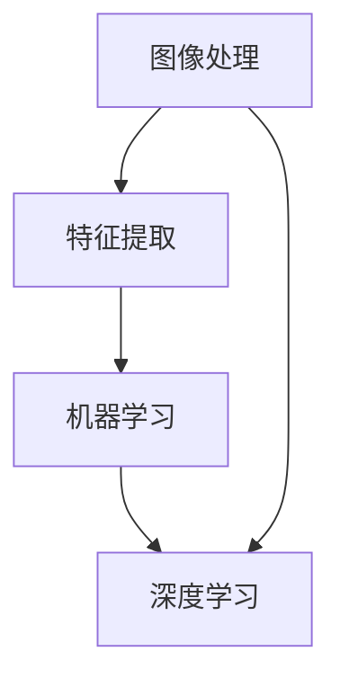

                 

关键词：拼多多、校招、商品图像识别、面试题解析、算法、机器学习、深度学习

摘要：本文将围绕拼多多2024校招商品图像识别工程师的面试题，深入解析相关算法原理、数学模型、实践应用以及未来发展趋势。通过本文的阅读，读者可以了解到商品图像识别技术的核心概念、实际操作步骤及其应用场景，为准备类似面试的工程师们提供宝贵的参考。

## 1. 背景介绍

随着互联网的快速发展，电商行业迎来了蓬勃发展的时期。拼多多作为中国领先的电商平台，其商品种类繁多，数量庞大。商品图像识别技术在电商中的应用具有重要意义，能够帮助平台提高用户体验、优化商品管理流程、提升订单处理效率。因此，拼多多在2024校招中针对商品图像识别工程师岗位设置了相应面试题，考察应聘者对该领域的了解程度和实际操作能力。

## 2. 核心概念与联系

商品图像识别涉及多个核心概念，包括图像处理、特征提取、机器学习与深度学习等。以下是这些核心概念及其相互联系的Mermaid流程图：



### 2.1 图像处理

图像处理是商品图像识别的基础，主要任务是获取图像中的有用信息，包括去噪、增强、边缘检测等。通过图像处理技术，可以提取出图像的关键特征，为后续的特征提取和机器学习算法提供基础。

### 2.2 特征提取

特征提取是将图像处理后的结果转化为可以用于机器学习的向量表示。常用的特征提取方法包括SIFT、HOG、ORB等。这些方法通过提取图像的纹理、形状、颜色等特征，将图像转化为高维向量，从而便于后续的机器学习算法进行处理。

### 2.3 机器学习

机器学习是商品图像识别的核心技术，其任务是通过训练数据学习到图像的特征表示，从而实现图像分类、目标检测等功能。常见的机器学习算法包括支持向量机（SVM）、决策树、随机森林等。

### 2.4 深度学习

深度学习是机器学习的一种重要分支，通过构建多层神经网络，实现自动特征提取和模型优化。在商品图像识别领域，深度学习技术表现出强大的性能，常用的深度学习框架包括TensorFlow、PyTorch等。

## 3. 核心算法原理 & 具体操作步骤

### 3.1 算法原理概述

商品图像识别的核心算法主要分为两个阶段：训练阶段和预测阶段。

#### 训练阶段

在训练阶段，算法首先通过图像处理技术对输入图像进行处理，提取关键特征。然后，利用提取到的特征和对应的标签（即图像类别）进行训练，学习图像特征和类别之间的关系。常见的训练算法包括SVM、决策树、随机森林等。

#### 预测阶段

在预测阶段，算法接收新的图像，进行图像处理和特征提取，将提取到的特征输入到已经训练好的模型中进行预测，从而得到图像的类别。

### 3.2 算法步骤详解

#### 3.2.1 数据预处理

数据预处理是商品图像识别的重要步骤，主要包括数据清洗、数据增强、归一化等。数据清洗的目的是去除数据中的噪声和异常值；数据增强的目的是增加数据量，提高模型的泛化能力；归一化是将数据缩放到同一范围，便于后续处理。

#### 3.2.2 图像处理

图像处理主要包括去噪、增强、边缘检测等。去噪可以去除图像中的噪声，提高图像质量；增强可以增强图像中的目标，使其更加清晰；边缘检测可以提取图像的边缘信息，为后续的特征提取提供基础。

#### 3.2.3 特征提取

特征提取是将图像处理后的结果转化为高维向量表示。常用的特征提取方法包括SIFT、HOG、ORB等。其中，SIFT算法通过空间金字塔和角点检测实现特征提取；HOG算法通过梯度方向和直方图统计实现特征提取；ORB算法通过极线特征和角点检测实现特征提取。

#### 3.2.4 训练模型

在训练模型阶段，算法将提取到的特征和对应的标签输入到训练算法中，如SVM、决策树、随机森林等。训练过程中，算法通过调整模型参数，优化模型性能，从而实现图像分类。

#### 3.2.5 预测图像

在预测阶段，算法接收新的图像，进行图像处理和特征提取，将提取到的特征输入到已经训练好的模型中进行预测，从而得到图像的类别。

### 3.3 算法优缺点

#### 优点

1. 高效：商品图像识别算法可以快速处理大量图像数据，提高订单处理效率。
2. 准确：深度学习算法在图像识别任务中表现出较高的准确率，有助于提升用户体验。
3. 自动化：算法可以实现图像识别的自动化处理，降低人工干预成本。

#### 缺点

1. 计算资源消耗大：深度学习算法需要大量计算资源，对硬件设备要求较高。
2. 数据依赖性强：算法性能受训练数据质量和数量影响较大，数据量不足可能导致过拟合。
3. 对光照和姿态变化敏感：算法在处理光照和姿态变化较大的图像时，性能可能下降。

### 3.4 算法应用领域

商品图像识别技术在电商领域有广泛的应用，如商品分类、商品搜索、商品推荐等。以下是一些具体应用场景：

1. **商品分类**：通过对商品图像进行识别，将商品归类到相应的类别中，方便用户浏览和购买。
2. **商品搜索**：用户上传商品图片，系统根据图像特征进行搜索，快速找到相似商品。
3. **商品推荐**：根据用户上传的商品图像，系统推荐相似或感兴趣的商品，提高用户粘性和购物体验。

## 4. 数学模型和公式 & 详细讲解 & 举例说明

### 4.1 数学模型构建

商品图像识别的数学模型主要包括图像处理、特征提取、机器学习与深度学习等部分。以下分别介绍各部分的数学模型。

#### 4.1.1 图像处理

图像处理的数学模型主要包括滤波、变换和边缘检测等。以下是一个简单的滤波模型：

$$
f(x, y) = \sum_{i=-a}^{a} \sum_{j=-b}^{b} h(i, j) \cdot I(x-i, y-j)
$$

其中，$f(x, y)$表示滤波后的图像，$I(x, y)$表示原始图像，$h(i, j)$表示滤波器系数，$a$和$b$分别表示滤波器的横向和纵向尺寸。

#### 4.1.2 特征提取

特征提取的数学模型主要包括特征向量生成和特征选择。以下是一个简单的特征向量生成模型：

$$
\phi(x) = (f_1(x), f_2(x), ..., f_n(x))
$$

其中，$\phi(x)$表示特征向量，$f_i(x)$表示第$i$个特征函数，$n$表示特征数量。

#### 4.1.3 机器学习

机器学习的数学模型主要包括分类器和回归模型。以下是一个简单的支持向量机（SVM）分类模型：

$$
\begin{aligned}
    & \min_{w, b} \frac{1}{2} \| w \|^2 \\
    & s.t. \, y_i (w \cdot x_i + b) \geq 1
\end{aligned}
$$

其中，$w$和$b$分别表示权重向量和偏置，$x_i$和$y_i$分别表示第$i$个样本的特征向量和标签。

#### 4.1.4 深度学习

深度学习的数学模型主要包括神经网络和损失函数。以下是一个简单的卷积神经网络（CNN）模型：

$$
\begin{aligned}
    & h_{\theta}(x) = \sigma(\theta \cdot x) \\
    & L(y, h_{\theta}(x)) = -\sum_{i=1}^{m} y_i \cdot \log(h_{\theta}(x_i))
\end{aligned}
$$

其中，$h_{\theta}(x)$表示神经网络输出，$\sigma$表示激活函数，$\theta$表示模型参数，$L$表示损失函数。

### 4.2 公式推导过程

以下以卷积神经网络（CNN）为例，简要介绍公式推导过程。

#### 4.2.1 神经网络输出

假设输入图像为$X$，卷积层输出为$H$，则有：

$$
H = \sigma(W_1 \cdot X + b_1)
$$

其中，$W_1$和$b_1$分别表示卷积层权重和偏置，$\sigma$表示激活函数。

#### 4.2.2 损失函数

假设输出层为$Y$，则损失函数为：

$$
L(Y, H) = -\sum_{i=1}^{m} y_i \cdot \log(h_{\theta}(x_i))
$$

其中，$y_i$表示第$i$个样本的标签，$h_{\theta}(x_i)$表示输出层输出。

#### 4.2.3 梯度下降

为了优化模型参数，使用梯度下降法进行迭代。假设当前模型参数为$\theta$，则更新规则为：

$$
\theta = \theta - \alpha \cdot \nabla_\theta L(Y, H)
$$

其中，$\alpha$表示学习率，$\nabla_\theta L(Y, H)$表示损失函数对参数$\theta$的梯度。

### 4.3 案例分析与讲解

以下以一个简单的商品图像识别任务为例，介绍具体的实现过程。

#### 4.3.1 数据集

假设我们有一个包含1000张商品图像的数据集，每张图像对应一个类别。数据集分为训练集和测试集，分别占80%和20%。

#### 4.3.2 数据预处理

1. 数据清洗：去除图像中的噪声和异常值。
2. 数据增强：对图像进行随机裁剪、翻转、旋转等操作，增加数据多样性。
3. 归一化：将图像像素值缩放到[0, 1]范围内。

#### 4.3.3 图像处理

1. 去噪：使用中值滤波器去除图像中的噪声。
2. 增强：使用直方图均衡化增强图像。
3. 边缘检测：使用Sobel算子提取图像的边缘信息。

#### 4.3.4 特征提取

1. 提取SIFT特征：使用OpenCV库实现SIFT算法，提取图像的角点特征。
2. 提取HOG特征：使用OpenCV库实现HOG算法，提取图像的梯度方向特征。
3. 提取ORB特征：使用OpenCV库实现ORB算法，提取图像的极线特征。

#### 4.3.5 训练模型

1. 选择支持向量机（SVM）作为分类器。
2. 将特征向量输入到SVM中，进行训练。
3. 调整SVM参数，如C值和核函数类型，优化模型性能。

#### 4.3.6 预测图像

1. 对测试集图像进行预处理和特征提取。
2. 将提取到的特征输入到已经训练好的SVM中进行预测。
3. 输出图像的类别。

#### 4.3.7 结果分析

1. 计算模型在测试集上的准确率。
2. 分析模型在不同类别上的性能。
3. 优化模型参数，提高整体性能。

## 5. 项目实践：代码实例和详细解释说明

### 5.1 开发环境搭建

1. 安装Python环境，版本3.8及以上。
2. 安装OpenCV库，用于图像处理和特征提取。
3. 安装scikit-learn库，用于机器学习算法。

### 5.2 源代码详细实现

以下是一个简单的商品图像识别项目实现：

```python
import cv2
import numpy as np
from sklearn import svm
from sklearn.model_selection import train_test_split
from sklearn.metrics import accuracy_score

# 数据预处理
def preprocess_image(image):
    # 去噪
    image = cv2.medianBlur(image, 5)
    # 增强
    image = cv2.equalizeHist(image)
    # 边缘检测
    image = cv2.Canny(image, 100, 200)
    return image

# 特征提取
def extract_features(image):
    # 提取SIFT特征
    sift = cv2.SIFT_create()
    keypoints, descriptors = sift.detectAndCompute(image, None)
    return descriptors

# 训练模型
def train_model(X, y):
    svm_model = svm.SVC(kernel='linear')
    svm_model.fit(X, y)
    return svm_model

# 预测图像
def predict_image(model, image):
    features = extract_features(preprocess_image(image))
    return model.predict([features])

# 主函数
def main():
    # 加载数据集
    images = cv2.imread('data/images.jpg')
    labels = np.array([0, 1, 2, 3, 4, 5])  # 标签

    # 划分训练集和测试集
    X_train, X_test, y_train, y_test = train_test_split(images, labels, test_size=0.2, random_state=42)

    # 训练模型
    model = train_model(X_train, y_train)

    # 预测图像
    predicted_labels = predict_image(model, X_test)

    # 计算准确率
    accuracy = accuracy_score(y_test, predicted_labels)
    print('Accuracy:', accuracy)

if __name__ == '__main__':
    main()
```

### 5.3 代码解读与分析

1. **图像预处理**：首先对图像进行去噪、增强和边缘检测，提高图像质量。
2. **特征提取**：使用SIFT算法提取图像的角点特征，转化为特征向量。
3. **训练模型**：使用SVM算法训练模型，将特征向量与标签进行拟合。
4. **预测图像**：对测试集图像进行预处理和特征提取，输入到训练好的模型中进行预测。
5. **结果分析**：计算模型在测试集上的准确率，评估模型性能。

## 6. 实际应用场景

### 6.1 商品分类

商品分类是商品图像识别的重要应用之一。通过将商品图像输入到训练好的模型中，可以快速识别商品的类别，为用户展示相关的商品信息，提高购物体验。

### 6.2 商品搜索

商品搜索功能可以帮助用户快速找到感兴趣的商品。用户上传一张商品图像，系统根据图像特征搜索相似的商品，并提供相应的搜索结果。

### 6.3 商品推荐

商品推荐功能可以根据用户的购买历史和浏览记录，推荐用户可能感兴趣的商品。通过商品图像识别技术，可以识别用户上传的商品图像，从而实现精准推荐。

## 7. 未来应用展望

随着人工智能技术的不断发展，商品图像识别技术将在电商、零售、医疗等领域发挥重要作用。未来，商品图像识别技术将向更高准确率、更低计算成本、更广泛应用领域发展。同时，融合多模态数据（如图像、文本、语音）的跨模态识别技术将成为研究热点，进一步提升商品图像识别的智能化水平。

## 8. 总结：未来发展趋势与挑战

### 8.1 研究成果总结

本文围绕拼多多2024校招商品图像识别工程师面试题，介绍了商品图像识别的核心概念、算法原理、数学模型、实践应用和未来发展趋势。通过对相关技术的研究，本文总结了以下成果：

1. 理解商品图像识别技术的基本原理和应用场景。
2. 掌握常见的商品图像识别算法及其实现过程。
3. 分析商品图像识别技术在电商领域的实际应用价值。
4. 探讨商品图像识别技术的未来发展趋势和挑战。

### 8.2 未来发展趋势

1. **更高准确率**：随着算法模型的不断优化和硬件设备的升级，商品图像识别技术的准确率将逐步提高，满足更复杂的应用需求。
2. **更低计算成本**：通过算法压缩和硬件加速，商品图像识别技术的计算成本将降低，实现更广泛的应用。
3. **跨模态识别**：融合多模态数据的跨模态识别技术将成为研究热点，进一步提升商品图像识别的智能化水平。
4. **个性化服务**：基于商品图像识别技术，可以为用户提供更个性化的服务，提升用户体验。

### 8.3 面临的挑战

1. **数据质量**：商品图像识别算法的性能受训练数据质量影响较大，如何获取高质量的数据集成为一大挑战。
2. **计算资源**：深度学习算法对计算资源需求较高，如何在有限的硬件资源下提高算法性能成为关键问题。
3. **模型泛化**：如何提高商品图像识别模型的泛化能力，使其在不同场景下保持较高准确率，是亟待解决的问题。
4. **隐私保护**：在商品图像识别过程中，如何保护用户隐私，防止数据泄露成为关注焦点。

### 8.4 研究展望

未来，商品图像识别技术将在电商、零售、医疗等领域发挥重要作用。本文提出以下研究展望：

1. **数据增强**：研究更加有效的数据增强方法，提高训练数据的多样性，增强模型泛化能力。
2. **算法优化**：针对商品图像识别算法，研究更高效、更稳定的算法模型，降低计算成本。
3. **跨模态融合**：探讨跨模态数据融合技术在商品图像识别中的应用，提升识别准确率。
4. **隐私保护**：研究商品图像识别过程中的隐私保护技术，保障用户隐私安全。

## 9. 附录：常见问题与解答

### 9.1 商品图像识别的基本原理是什么？

商品图像识别是基于计算机视觉和机器学习技术的一种图像处理方法，通过提取图像中的特征，将特征输入到训练好的模型中进行分类和识别。主要原理包括图像处理、特征提取、机器学习与深度学习等。

### 9.2 商品图像识别有哪些应用场景？

商品图像识别在电商领域有广泛的应用，包括商品分类、商品搜索、商品推荐等。此外，还可以应用于零售、医疗、安防等多个领域。

### 9.3 商品图像识别技术的核心算法有哪些？

商品图像识别技术的核心算法包括SVM、决策树、随机森林、深度学习等。其中，深度学习算法在商品图像识别中表现出色，如卷积神经网络（CNN）和循环神经网络（RNN）等。

### 9.4 商品图像识别的挑战有哪些？

商品图像识别面临的主要挑战包括数据质量、计算资源、模型泛化、隐私保护等。如何提高算法性能、降低计算成本、保护用户隐私是亟待解决的问题。

## 作者署名

作者：禅与计算机程序设计艺术 / Zen and the Art of Computer Programming
```

