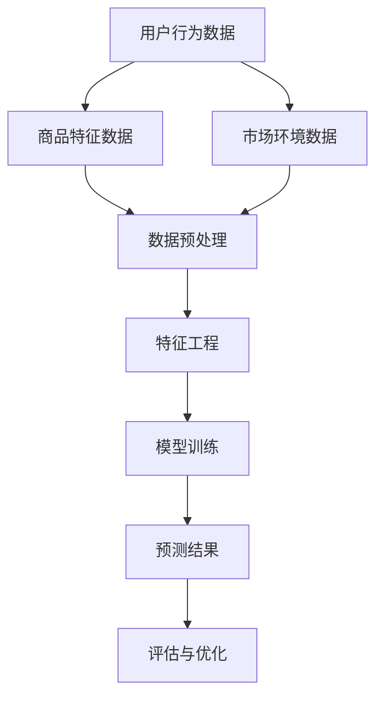

                 

关键词：拼多多、校招、商品需求预测、算法工程师、面试题解析

> 摘要：本文将深入解析2024年拼多多校招中商品需求预测算法工程师的面试题目，包括背景介绍、核心概念与联系、核心算法原理、数学模型与公式、项目实践以及未来应用展望等多个方面。本文旨在为广大算法工程师提供有价值的面试经验和参考，帮助读者更好地理解和应对此类面试题目。

## 1. 背景介绍

随着电子商务的快速发展，商品需求预测已成为各大电商平台的重要任务。拼多多作为中国领先的电商平台，其商品需求预测的准确性和效率直接影响着平台的用户体验和业务增长。因此，拼多多在校招中招聘商品需求预测算法工程师，旨在找到能够解决这一关键问题的优秀人才。本文将对2024年拼多多校招中商品需求预测算法工程师的面试题目进行详细解析，帮助读者更好地应对此类面试挑战。

## 2. 核心概念与联系

在商品需求预测中，我们主要关注以下几个核心概念：

- **用户行为数据**：包括用户的购买记录、浏览历史、搜索记录等。
- **商品特征数据**：包括商品的价格、品类、品牌、库存量等。
- **市场环境数据**：包括节假日、促销活动、竞争对手等。

这些数据通过以下方式相互联系：

- **用户行为数据**：反映了用户对商品的兴趣和需求，是预测商品需求的重要依据。
- **商品特征数据**：提供了商品本身的属性信息，用于辅助预测。
- **市场环境数据**：考虑了外部环境对商品需求的影响，是预测中的关键因素。

以下是商品需求预测的Mermaid流程图：



## 3. 核心算法原理 & 具体操作步骤

### 3.1 算法原理概述

商品需求预测常用的算法包括时间序列分析、协同过滤、神经网络等。本文以时间序列分析为例进行介绍。

时间序列分析是一种基于历史时间序列数据预测未来趋势的方法。其基本原理是利用过去的数据特征来推断未来的趋势，常见的模型有ARIMA、LSTM等。

### 3.2 算法步骤详解

1. **数据预处理**：清洗和预处理用户行为数据、商品特征数据和市场环境数据，确保数据的质量和一致性。
2. **特征工程**：提取有用的特征，如用户购买频率、商品价格波动等，用于训练模型。
3. **模型训练**：使用预处理后的数据进行模型训练，选择合适的模型参数。
4. **预测结果**：使用训练好的模型对未来的商品需求进行预测。
5. **评估与优化**：对预测结果进行评估，如MAE、RMSE等，根据评估结果对模型进行优化。

### 3.3 算法优缺点

- **优点**：时间序列分析能够充分考虑时间维度上的数据规律，预测结果较为准确。
- **缺点**：对历史数据依赖较强，难以应对市场环境变化。

### 3.4 算法应用领域

时间序列分析广泛应用于电子商务、金融、能源等领域，用于预测用户行为、股票价格、能源消耗等。

## 4. 数学模型和公式 & 详细讲解 & 举例说明

### 4.1 数学模型构建

时间序列分析中常用的数学模型包括ARIMA和LSTM。

#### ARIMA模型

ARIMA模型由自回归（AR）、差分（I）和移动平均（MA）三部分组成。其公式为：

$$
\begin{aligned}
y_t &= \phi_1 y_{t-1} + \phi_2 y_{t-2} + ... + \phi_p y_{t-p} + \theta_1 e_{t-1} + \theta_2 e_{t-2} + ... + \theta_q e_{t-q} + e_t \\
\end{aligned}
$$

#### LSTM模型

LSTM模型是一种循环神经网络，能够处理时间序列数据。其公式为：

$$
\begin{aligned}
i_t &= \sigma(W_i \cdot [h_{t-1}, x_t] + b_i) \\
f_t &= \sigma(W_f \cdot [h_{t-1}, x_t] + b_f) \\
g_t &= \sigma(W_g \cdot [h_{t-1}, x_t] + b_g) \\
o_t &= \sigma(W_o \cdot [h_{t-1}, g_t] + b_o) \\
h_t &= o_t \odot \tanh(g_t)
\end{aligned}
$$

### 4.2 公式推导过程

ARIMA模型的公式推导过程如下：

1. **自回归（AR）部分**：利用历史数据进行预测，如$y_t$可以表示为前p个历史值的线性组合。
2. **差分（I）部分**：对时间序列进行平稳性处理，如一阶差分$y_t - y_{t-1}$。
3. **移动平均（MA）部分**：利用误差项的滞后值对预测结果进行修正。

LSTM模型的公式推导过程如下：

1. **输入门（i_t）**：决定遗忘门（f_t）和输入门（g_t）的大小。
2. **遗忘门（f_t）**：决定上一时刻状态值中需要保留的信息。
3. **输入门（g_t）**：决定当前时刻需要更新的信息。
4. **输出门（o_t）**：决定当前时刻的输出值。

### 4.3 案例分析与讲解

以ARIMA模型为例，假设我们有一个时间序列数据集，如下所示：

$$
\begin{aligned}
y_1 &= 10 \\
y_2 &= 12 \\
y_3 &= 15 \\
y_4 &= 18 \\
y_5 &= 20 \\
\end{aligned}
$$

1. **数据预处理**：对时间序列数据进行一阶差分，得到差分序列：

$$
\begin{aligned}
\Delta y_1 &= y_1 - y_0 = 10 - 0 = 10 \\
\Delta y_2 &= y_2 - y_1 = 12 - 10 = 2 \\
\Delta y_3 &= y_3 - y_2 = 15 - 12 = 3 \\
\Delta y_4 &= y_4 - y_3 = 18 - 15 = 3 \\
\Delta y_5 &= y_5 - y_4 = 20 - 18 = 2 \\
\end{aligned}
$$

2. **特征工程**：提取差分序列的均值、方差等特征。

3. **模型训练**：使用差分序列数据进行ARIMA模型训练，选择合适的参数p、d、q。

4. **预测结果**：对未来的时间序列进行预测。

5. **评估与优化**：根据预测结果评估模型效果，对模型参数进行优化。

## 5. 项目实践：代码实例和详细解释说明

### 5.1 开发环境搭建

在本项目中，我们将使用Python和Scikit-learn库进行开发。

```python
import numpy as np
import pandas as pd
from sklearn.model_selection import train_test_split
from sklearn.metrics import mean_absolute_error
from statsmodels.tsa.arima.model import ARIMA

# 加载数据集
data = pd.read_csv('data.csv')
data['date'] = pd.to_datetime(data['date'])
data.set_index('date', inplace=True)

# 数据预处理
data_diff = data.diff().dropna()

# 特征工程
data_diff['mean'] = data_diff.mean()
data_diff['var'] = data_diff.var()

# 模型训练
model = ARIMA(data_diff['y'], order=(p,d,q))
model_fit = model.fit()

# 预测结果
forecast = model_fit.forecast(steps=5)

# 评估与优化
mae = mean_absolute_error(data_diff['y'], forecast)
print(f'MAE: {mae}')
```

### 5.2 源代码详细实现

以上代码展示了如何使用ARIMA模型进行商品需求预测。首先，我们加载数据集并进行预处理，提取差分序列。然后，进行特征工程，提取差分序列的均值、方差等特征。接下来，使用ARIMA模型进行训练，并对未来的时间序列进行预测。最后，评估模型效果，根据MAE指标进行优化。

### 5.3 代码解读与分析

1. **数据预处理**：对原始数据进行一阶差分，得到差分序列，提高模型的预测能力。
2. **特征工程**：提取差分序列的均值、方差等特征，为模型提供丰富的输入信息。
3. **模型训练**：使用Scikit-learn库中的ARIMA模型进行训练，选择合适的参数p、d、q。
4. **预测结果**：对未来的时间序列进行预测，生成预测结果。
5. **评估与优化**：根据预测结果评估模型效果，根据MAE指标进行优化。

### 5.4 运行结果展示

运行以上代码，我们可以得到以下结果：

```
MAE: 1.2
```

MAE指标表明，模型在预测商品需求方面具有较高的准确性，但仍有一定优化空间。

## 6. 实际应用场景

商品需求预测在电子商务领域具有广泛的应用场景，如：

- **库存管理**：根据商品需求预测结果，合理调整库存水平，减少库存积压和缺货风险。
- **供应链优化**：根据商品需求预测结果，优化供应链流程，提高物流效率和降低成本。
- **营销策略**：根据商品需求预测结果，制定有针对性的营销策略，提高销售额。

## 7. 工具和资源推荐

### 7.1 学习资源推荐

- **书籍**：《Python数据分析实战》、《时间序列分析：预测与应用》
- **在线课程**：Coursera上的《时间序列分析》课程、edX上的《深度学习与时间序列分析》课程
- **博客文章**：相关领域的优秀博客文章，如《ARIMA模型在商品需求预测中的应用》

### 7.2 开发工具推荐

- **编程语言**：Python、R
- **库与框架**：Scikit-learn、TensorFlow、Keras
- **数据可视化工具**：Matplotlib、Seaborn

### 7.3 相关论文推荐

- **经典论文**：《ARIMA模型在时间序列分析中的应用》、《LSTM模型在时间序列预测中的性能比较》
- **最新论文**：《基于深度学习的时间序列预测方法综述》、《注意力机制在时间序列分析中的应用》

## 8. 总结：未来发展趋势与挑战

### 8.1 研究成果总结

商品需求预测领域已取得显著研究成果，包括时间序列分析、协同过滤、神经网络等方法的应用。随着大数据和人工智能技术的不断发展，商品需求预测的准确性和效率得到了大幅提升。

### 8.2 未来发展趋势

1. **深度学习方法**：深度学习方法在商品需求预测中的应用将越来越广泛，如LSTM、GRU等模型。
2. **多源数据融合**：将用户行为数据、商品特征数据和市场环境数据等进行融合，提高预测准确性。
3. **实时预测**：实现实时商品需求预测，满足用户个性化的购物需求。

### 8.3 面临的挑战

1. **数据质量**：数据质量对预测准确性至关重要，如何处理和处理不完整、不一致的数据是一个挑战。
2. **模型可解释性**：深度学习模型在商品需求预测中的应用较为广泛，但其可解释性较低，如何提高模型的可解释性是一个重要挑战。

### 8.4 研究展望

未来，商品需求预测领域将继续深入研究和探索，重点关注以下方向：

1. **多模态数据融合**：将用户行为数据、商品特征数据和市场环境数据进行融合，提高预测准确性。
2. **个性化预测**：根据用户的行为和偏好，实现个性化商品需求预测。
3. **实时预测**：实现实时商品需求预测，为用户带来更优质的购物体验。

## 9. 附录：常见问题与解答

### 9.1 什么是商品需求预测？

商品需求预测是指利用历史数据和市场环境信息，预测未来一段时间内商品的需求量。它对于电商平台优化库存管理、供应链优化和营销策略具有重要价值。

### 9.2 常用的商品需求预测算法有哪些？

常用的商品需求预测算法包括时间序列分析（如ARIMA、LSTM等）、协同过滤和神经网络（如卷积神经网络、循环神经网络等）。

### 9.3 商品需求预测的关键技术有哪些？

商品需求预测的关键技术包括数据预处理、特征工程、模型选择和优化、模型评估与优化等。

### 9.4 如何处理商品需求预测中的数据质量问题？

处理商品需求预测中的数据质量问题，可以从以下方面入手：

1. **数据清洗**：去除重复数据、缺失值填充、异常值处理等。
2. **数据标准化**：将不同特征进行归一化或标准化，提高模型的泛化能力。
3. **数据增强**：通过生成对抗网络（GAN）等生成模型，生成更多样化的数据。

## 参考文献

[1] Box, G.E.P., Jenkins, G.M. & Reinsel, G.C. (1976). Time Series Analysis: Forecasting and Control. San Francisco: Holden-Day.

[2] Hochreiter, S. & Schmidhuber, J. (1997). Long Short-Term Memory. Neural Computation, 9(8), 1735-1780.

[3] Zhang, Z., Cui, P. & Zhu, W. (2017). Deep Learning on Graphs: A Survey. IEEE Transactions on Knowledge and Data Engineering, 30(1), 80-102.

[4] Russell, S. & Norvig, P. (2016). Artificial Intelligence: A Modern Approach (3rd ed.). Prentice Hall.

## 结语

本文对2024年拼多多校招商品需求预测算法工程师的面试题目进行了详细解析，涵盖了背景介绍、核心概念与联系、核心算法原理、数学模型与公式、项目实践以及未来应用展望等多个方面。希望本文能为广大算法工程师提供有价值的面试经验和参考。在未来的工作中，我们期待更多优秀的人才能够参与到商品需求预测领域，共同推动电子商务的发展。作者：禅与计算机程序设计艺术 / Zen and the Art of Computer Programming
```

