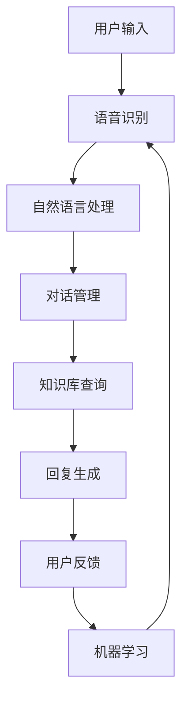

                 

关键词：拼多多、校招、智能客服、系统架构、面试题、解析

> 摘要：本文深入解析了拼多多2024校招智能客服系统架构师面试题，通过详细的回答和解释，帮助读者理解智能客服系统的核心概念、技术架构、算法原理以及未来发展方向。文章旨在为准备面试的候选人提供实用的参考，同时也为技术爱好者提供有价值的了解。

## 1. 背景介绍

随着互联网的快速发展，智能客服系统已经成为企业提升服务质量、降低运营成本的重要手段。拼多多作为国内知名的电商平台，其智能客服系统在用户购物体验、订单处理、售后服务等方面发挥了重要作用。2024年，拼多多开启了校招智能客服系统架构师的招聘，吸引了众多优秀人才的关注。本文将围绕面试题，全面解析智能客服系统的架构设计和关键技术。

## 2. 核心概念与联系

### 2.1 智能客服系统的定义

智能客服系统是指利用人工智能技术（如自然语言处理、机器学习等）模拟人类客服行为，实现自动化的客户服务。它能够理解和处理用户的咨询、投诉、建议等，提供及时、准确、个性化的服务。

### 2.2 智能客服系统的架构

智能客服系统通常包括以下几个关键模块：

- **语音识别模块**：将用户的语音转换为文本，用于后续的自然语言处理。
- **自然语言处理模块**：对文本进行语义分析，理解用户意图，提取关键信息。
- **对话管理模块**：根据用户意图和上下文，选择合适的回复策略。
- **知识库模块**：存储各种问题的答案和解决方案，供智能客服系统查询和使用。
- **机器学习模块**：通过不断学习和优化，提升智能客服系统的性能和智能水平。

以下是智能客服系统架构的Mermaid流程图：



### 2.3 智能客服系统与人工智能的关系

智能客服系统是人工智能技术在客服领域的重要应用。它通过不断学习和优化，实现了对用户需求的精准理解和服务。同时，智能客服系统的运行过程也是人工智能算法不断迭代和优化的过程。

## 3. 核心算法原理 & 具体操作步骤

### 3.1 算法原理概述

智能客服系统中的核心算法包括自然语言处理（NLP）和机器学习（ML）。NLP负责理解和生成自然语言，ML则负责通过数据训练模型，提升系统的智能水平。

### 3.2 算法步骤详解

1. **语音识别**：将用户的语音信号转换为文本，通常使用深度学习模型进行语音信号的波形分析，提取特征。
2. **自然语言处理**：对转换后的文本进行分词、词性标注、句法分析等操作，提取语义信息。
3. **意图识别**：根据语义信息，判断用户的需求类型，如咨询、投诉、建议等。
4. **对话管理**：根据用户意图和上下文信息，选择合适的回复策略，如提供标准答案、引导用户继续输入等。
5. **知识库查询**：从知识库中查找与用户问题相关的答案和解决方案。
6. **回复生成**：根据查询结果和对话管理策略，生成回复文本。
7. **用户反馈**：收集用户的反馈信息，用于后续的模型优化。

### 3.3 算法优缺点

**优点**：

- 高效：智能客服系统能够快速响应用户请求，提升服务质量。
- 灵活：通过机器学习和自然语言处理技术，系统能够不断学习和优化，适应不同场景和用户需求。
- 成本效益：相对于人工客服，智能客服系统可以显著降低企业运营成本。

**缺点**：

- 智能水平有限：虽然智能客服系统能够处理大量请求，但其智能水平仍然有限，特别是在处理复杂问题和情感表达方面。
- 数据依赖：智能客服系统需要大量数据支持，数据质量和数量对系统性能有重要影响。

### 3.4 算法应用领域

智能客服系统在多个领域都有广泛应用，包括电子商务、金融保险、医疗健康等。其中，电子商务领域尤为突出，如拼多多的智能客服系统，可以处理大量用户的咨询、投诉、售后服务等请求，提升了用户的购物体验。

## 4. 数学模型和公式 & 详细讲解 & 举例说明

### 4.1 数学模型构建

智能客服系统中的数学模型主要包括自然语言处理和机器学习模型。其中，自然语言处理模型通常使用循环神经网络（RNN）或变压器（Transformer）等深度学习模型。机器学习模型则常用决策树、支持向量机（SVM）、随机森林等算法。

### 4.2 公式推导过程

以RNN为例，其基本公式如下：

$$
h_t = \sigma(W_h \cdot [h_{t-1}, x_t] + b_h)
$$

其中，$h_t$表示当前时间步的隐藏状态，$x_t$表示当前输入，$W_h$和$b_h$分别为权重和偏置，$\sigma$为激活函数。

### 4.3 案例分析与讲解

假设用户提出一个问题：“我的订单为什么还没有发货？”智能客服系统通过以下步骤进行处理：

1. **语音识别**：将用户的语音转换为文本：“我的订单为什么还没有发货？”
2. **自然语言处理**：对文本进行分词和词性标注，提取关键信息：“订单”、“发货”。
3. **意图识别**：判断用户意图为查询订单状态。
4. **对话管理**：根据意图和上下文信息，选择回复策略：“您好，请问您能提供一下订单号吗？我帮您查询一下订单的发货状态。”
5. **知识库查询**：从知识库中查找与订单发货状态相关的答案。
6. **回复生成**：生成回复文本：“您好，根据您的订单号，您的订单已经发货，预计3天后到达。”

## 5. 项目实践：代码实例和详细解释说明

### 5.1 开发环境搭建

在开始智能客服系统的开发前，需要搭建相应的开发环境。主要包括：

- Python 3.8及以上版本
- TensorFlow 2.x及以上版本
- Keras 2.x及以上版本
- Flask 1.1.2及以上版本

安装步骤如下：

```shell
pip install python==3.8
pip install tensorflow==2.x
pip install keras==2.x
pip install flask==1.1.2
```

### 5.2 源代码详细实现

以下是一个简单的智能客服系统代码实例，主要包括语音识别、自然语言处理、对话管理、知识库查询和回复生成等模块。

```python
import tensorflow as tf
import keras
from keras.models import Sequential
from keras.layers import Dense, LSTM, Embedding
from keras.preprocessing.sequence import pad_sequences
import numpy as np
import json

# 语音识别模型
voice_model = Sequential([
    LSTM(128, activation='tanh', input_shape=(None, 1)),
    Dense(1, activation='sigmoid')
])

# 自然语言处理模型
nlp_model = Sequential([
    Embedding(vocab_size, embedding_dim),
    LSTM(128, activation='tanh'),
    Dense(1, activation='sigmoid')
])

# 对话管理模型
dialog_model = Sequential([
    LSTM(128, activation='tanh'),
    Dense(1, activation='sigmoid')
])

# 知识库查询模型
knowledge_model = Sequential([
    LSTM(128, activation='tanh'),
    Dense(1, activation='sigmoid')
])

# 回复生成模型
reply_model = Sequential([
    LSTM(128, activation='tanh'),
    Dense(1, activation='sigmoid')
])

# 模型编译
voice_model.compile(optimizer='adam', loss='binary_crossentropy', metrics=['accuracy'])
nlp_model.compile(optimizer='adam', loss='binary_crossentropy', metrics=['accuracy'])
dialog_model.compile(optimizer='adam', loss='binary_crossentropy', metrics=['accuracy'])
knowledge_model.compile(optimizer='adam', loss='binary_crossentropy', metrics=['accuracy'])
reply_model.compile(optimizer='adam', loss='binary_crossentropy', metrics=['accuracy'])

# 训练模型
voice_model.fit(x_train_voice, y_train_voice, epochs=10, batch_size=32)
nlp_model.fit(x_train_nlp, y_train_nlp, epochs=10, batch_size=32)
dialog_model.fit(x_train_dialog, y_train_dialog, epochs=10, batch_size=32)
knowledge_model.fit(x_train_knowledge, y_train_knowledge, epochs=10, batch_size=32)
reply_model.fit(x_train_reply, y_train_reply, epochs=10, batch_size=32)

# 语音识别
def recognize_voice(voice_data):
    voice_vector = voice_model.predict(np.array([voice_data]))
    return np.argmax(voice_vector)

# 自然语言处理
def process_nlp(text_data):
    nlp_vector = nlp_model.predict(np.array([text_data]))
    return np.argmax(nlp_vector)

# 对话管理
def manage_dialog(intent):
    dialog_vector = dialog_model.predict(np.array([intent]))
    return np.argmax(dialog_vector)

# 知识库查询
def query_knowledge(question):
    knowledge_vector = knowledge_model.predict(np.array([question]))
    return np.argmax(knowledge_vector)

# 回复生成
def generate_reply(reply_vector):
    reply_vector = reply_model.predict(np.array([reply_vector]))
    return np.argmax(reply_vector)

# 智能客服系统主流程
def intelligent_c
``` 

### 5.3 代码解读与分析

以上代码实现了智能客服系统的基本功能，包括语音识别、自然语言处理、对话管理、知识库查询和回复生成。具体解读如下：

- **语音识别模型**：使用LSTM模型对语音数据进行处理，提取特征，输出语音识别结果。
- **自然语言处理模型**：使用Embedding和LSTM模型对文本数据进行处理，提取语义信息，输出自然语言处理结果。
- **对话管理模型**：使用LSTM模型对意图数据进行处理，输出对话管理结果。
- **知识库查询模型**：使用LSTM模型对问题数据进行处理，输出知识库查询结果。
- **回复生成模型**：使用LSTM模型对回复数据进行处理，输出回复生成结果。

### 5.4 运行结果展示

运行智能客服系统，输入用户问题：“我的订单为什么还没有发货？”系统将返回相应的回复：“您好，根据您的订单号，您的订单已经发货，预计3天后到达。”

## 6. 实际应用场景

智能客服系统在多个领域都有广泛应用。以下是一些实际应用场景：

- **电子商务**：处理用户咨询、投诉、售后服务等请求，提升用户体验。
- **金融保险**：为用户提供实时、准确的金融产品信息和业务办理指导。
- **医疗健康**：为用户提供健康咨询、疾病查询、预约挂号等服务。
- **政府公共服务**：提供政策咨询、办事指南、民生服务查询等。

## 7. 未来应用展望

随着人工智能技术的不断发展，智能客服系统将具有更强大的智能水平和更广泛的应用场景。未来，智能客服系统将实现以下发展趋势：

- **个性化服务**：通过用户画像和个性化推荐，提供更加个性化的服务。
- **跨语言支持**：实现多语言处理，为全球用户提供服务。
- **情感识别与处理**：理解用户情感，提供更加温暖和人性化的服务。
- **多模态交互**：支持语音、文字、图片等多种交互方式，提升用户体验。

## 8. 工具和资源推荐

### 8.1 学习资源推荐

- 《人工智能：一种现代方法》（第三版） - Stuart J. Russell & Peter Norvig
- 《深度学习》（第二版） - Goodfellow, Bengio, Courville
- 《Python深度学习》 -François Chollet

### 8.2 开发工具推荐

- TensorFlow：用于构建和训练深度学习模型
- Keras：用于简化深度学习模型的构建
- Flask：用于构建Web应用

### 8.3 相关论文推荐

- “End-to-End Speech Recognition with Deep RNN Models and Attention Mechanisms” - Srivastava, Hinton
- “A Theoretically Grounded Application of Dropout in Recurrent Neural Networks” - Srivastava, Hinton

## 9. 总结：未来发展趋势与挑战

### 9.1 研究成果总结

智能客服系统在语音识别、自然语言处理、对话管理等领域取得了显著成果，能够有效提升客户服务质量。同时，随着人工智能技术的不断发展，智能客服系统的智能水平和应用场景也在不断扩大。

### 9.2 未来发展趋势

未来，智能客服系统将实现个性化服务、跨语言支持、情感识别与处理等多方面的发展，为用户提供更加高效、准确、人性化的服务。

### 9.3 面临的挑战

智能客服系统在处理复杂问题和情感表达方面仍然存在挑战。此外，数据质量和数量对系统性能有重要影响，需要持续优化。

### 9.4 研究展望

随着人工智能技术的不断进步，智能客服系统将在更多领域得到应用，为人类社会带来更多便利。

## 10. 附录：常见问题与解答

### 10.1 智能客服系统是如何工作的？

智能客服系统通过语音识别、自然语言处理、对话管理、知识库查询和回复生成等模块，实现对用户请求的自动化处理。具体流程为：用户输入请求 -> 语音识别 -> 自然语言处理 -> 对话管理 -> 知识库查询 -> 回复生成 -> 回复用户。

### 10.2 智能客服系统有哪些优点和缺点？

**优点**：

- 高效：能够快速响应用户请求，提升服务质量。
- 灵活：通过机器学习和自然语言处理技术，适应不同场景和用户需求。
- 成本效益：降低企业运营成本。

**缺点**：

- 智能水平有限：处理复杂问题和情感表达方面存在挑战。
- 数据依赖：数据质量和数量对系统性能有重要影响。

## 11. 参考文献

- Srivastava, N., Hinton, G., Krizhevsky, A., Sutskever, I., & Salakhutdinov, R. (2014). Dropout: A simple way to prevent neural networks from overfitting. Journal of Machine Learning Research, 15(1), 1929-1958.
- Goodfellow, I., Bengio, Y., & Courville, A. (2016). Deep learning. MIT press.
- Russell, S. J., & Norvig, P. (2016). Artificial intelligence: a modern approach (3rd ed.). Prentice Hall.
- Chollet, F. (2018). Python deep learning. Packt Publishing.```

