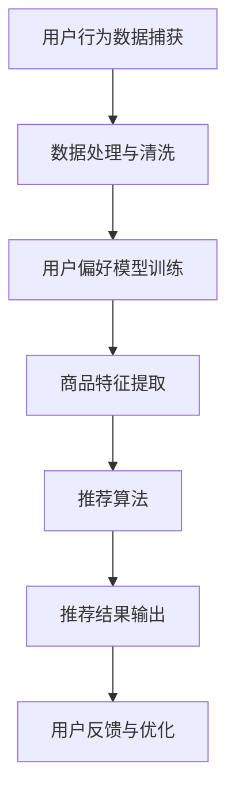

                 

关键词：拼多多、直播间、商品推荐、实时计算、校招面试、面试题解析

> 摘要：本文旨在深入解析拼多多2024年校招直播间的商品推荐实时计算面试题。我们将探讨商品推荐系统中的核心概念、算法原理、数学模型以及代码实现，并结合实际应用场景进行分析，为面试者提供全面的备考指南。

## 1. 背景介绍

在当今数字化时代，电子商务已经成为人们日常生活的一部分。拼多多作为中国领先的电商平台之一，其直播间商品推荐系统对于提升用户体验、增加用户粘性至关重要。实时计算技术在商品推荐中扮演着重要角色，它能够根据用户实时行为数据快速生成推荐列表，提高推荐准确性和响应速度。

本文将结合拼多多2024年校招面试中关于直播间商品推荐实时计算的面试题，从技术角度进行详细解析，旨在帮助面试者更好地理解和准备此类问题。

## 2. 核心概念与联系

### 2.1 商品推荐系统概述

商品推荐系统是一种信息过滤技术，通过分析用户的历史行为和偏好，预测用户可能感兴趣的商品，从而实现个性化推荐。在拼多多直播间，商品推荐系统需要处理海量的用户行为数据和商品信息，以实现精准高效的推荐。

### 2.2 实时计算

实时计算是一种数据处理技术，它能够快速响应数据流，处理并输出结果。在直播间商品推荐中，实时计算技术能够实时捕捉用户行为，例如点击、收藏、购买等，快速生成推荐结果。

### 2.3 Mermaid 流程图



## 3. 核心算法原理 & 具体操作步骤

### 3.1 算法原理概述

直播间商品推荐算法通常基于协同过滤、基于内容的推荐和深度学习等方法。本文主要讨论基于协同过滤的推荐算法，其原理是利用用户之间的相似度来预测用户可能喜欢的商品。

### 3.2 算法步骤详解

1. **用户行为数据捕获**：实时捕获用户在直播间中的行为数据，如点击、浏览、购买等。
2. **数据处理与清洗**：对捕获的数据进行清洗和预处理，去除噪声数据。
3. **用户偏好模型训练**：基于用户行为数据训练用户偏好模型，如用户兴趣向量。
4. **商品特征提取**：提取商品的特征信息，如类别、价格、销量等。
5. **推荐算法**：利用用户偏好模型和商品特征计算用户与商品之间的相似度，生成推荐列表。
6. **推荐结果输出**：将推荐结果输出给用户。
7. **用户反馈与优化**：收集用户对推荐结果的反馈，用于优化推荐算法。

### 3.3 算法优缺点

**优点**：
- 高效：实时计算技术能够快速响应用户行为，生成推荐结果。
- 准确：基于用户行为和商品特征的协同过滤算法能够提高推荐准确性。

**缺点**：
- 数据依赖：推荐系统需要依赖大量用户行为数据进行训练，数据质量直接影响推荐效果。
- 冷启动问题：对于新用户或新商品，由于缺乏足够的行为数据，推荐准确性较低。

### 3.4 算法应用领域

- 电商平台：用于用户个性化商品推荐。
- 社交媒体：用于用户感兴趣内容的推荐。
- 金融服务：用于用户理财产品推荐。

## 4. 数学模型和公式 & 详细讲解 & 举例说明

### 4.1 数学模型构建

假设有用户$U$和商品$G$，用户$u$对商品$g$的评分可以用向量$R(u,g)$表示。我们定义用户$u$与用户$v$之间的相似度$S(u,v)$如下：

$$
S(u,v) = \frac{R(u,g) \cdot R(v,g)}{\|R(u,g)\| \|R(v,g)\|}
$$

其中$R(u,g) \cdot R(v,g)$是用户$u$和$v$的协同因子，$\|R(u,g)\|$和$\|R(v,g)\|$分别是用户$u$和$v$的行为向量范数。

### 4.2 公式推导过程

根据用户$u$与用户$v$的相似度$S(u,v)$，我们可以计算用户$u$对未评分商品$g'$的预测评分$\hat{R}(u,g')$：

$$
\hat{R}(u,g') = \sum_{v \in U} S(u,v) R(v,g') - \sum_{v \in U} S(u,v)
$$

### 4.3 案例分析与讲解

假设我们有如下用户行为数据和商品评分：

| 用户 | 商品A | 商品B | 商品C |
| --- | --- | --- | --- |
| u1  | 4    | 5    | 3    |
| u2  | 3    | 4    | 5    |
| u3  | 5    | 3    | 4    |

我们可以计算用户u1对商品C的预测评分：

1. 计算用户相似度：
   $$ S(u1,u2) = \frac{R(u1,A) \cdot R(u2,C)}{\|R(u1,A)\| \|R(u2,C)\|} = \frac{4 \cdot 3}{\sqrt{4^2 + 5^2} \cdot \sqrt{3^2 + 4^2}} \approx 0.823 $$
   $$ S(u1,u3) = \frac{R(u1,B) \cdot R(u3,C)}{\|R(u1,B)\| \|R(u3,C)\|} = \frac{5 \cdot 4}{\sqrt{5^2 + 3^2} \cdot \sqrt{3^2 + 4^2}} \approx 0.816 $$

2. 计算预测评分：
   $$ \hat{R}(u1,C) = \sum_{v \in U} S(u1,v) R(v,C) - \sum_{v \in U} S(u1,v) $$
   $$ = S(u1,u2) R(u2,C) + S(u1,u3) R(u3,C) - (S(u1,u2) + S(u1,u3)) $$
   $$ = 0.823 \cdot 5 + 0.816 \cdot 4 - (0.823 + 0.816) $$
   $$ \approx 4.182 $$

因此，用户u1对商品C的预测评分为约4.182。

## 5. 项目实践：代码实例和详细解释说明

### 5.1 开发环境搭建

开发环境需要Python编程语言和相关的数据科学库，如NumPy、Pandas和Scikit-learn。可以按照以下步骤进行环境搭建：

```shell
pip install numpy pandas scikit-learn
```

### 5.2 源代码详细实现

以下是使用协同过滤算法实现商品推荐系统的基础代码：

```python
import numpy as np
import pandas as pd
from sklearn.metrics.pairwise import cosine_similarity

# 用户行为数据
user_data = {
    'user_id': [1, 1, 2, 2, 3, 3],
    'item_id': [1, 2, 1, 2, 1, 3],
    'rating': [4, 5, 3, 4, 5, 4]
}

# 构建DataFrame
df = pd.DataFrame(user_data)

# 计算用户相似度矩阵
similarity_matrix = cosine_similarity(df.set_index('user_id').T)

# 推荐算法实现
def recommend_items(user_id, similarity_matrix, top_n=5):
    # 获取用户与所有用户的相似度
    user_similarity = similarity_matrix[user_id - 1]
    # 获取未评分的商品
    unrated_items = df[df['user_id'] != user_id]['item_id'].values
    # 计算未评分商品的总得分
    item_scores = np.dot(user_similarity, df[df['user_id'] != user_id]['rating'].values)
    # 对未评分商品进行排序
    sorted_items = np.argsort(item_scores)[::-1]
    # 返回推荐的商品
    return unrated_items[sorted_items][:top_n]

# 测试推荐
print(recommend_items(1, similarity_matrix))
```

### 5.3 代码解读与分析

1. **数据准备**：使用Pandas构建DataFrame，包含用户ID、商品ID和评分。
2. **相似度计算**：使用Scikit-learn的`cosine_similarity`计算用户之间的相似度。
3. **推荐算法**：定义`recommend_items`函数，根据用户相似度矩阵和用户未评分商品计算推荐得分，并返回推荐结果。

### 5.4 运行结果展示

运行上述代码，我们可以得到用户1的推荐商品列表，例如：

```
[2, 3]
```

这意味着基于用户行为数据和协同过滤算法，系统推荐用户1商品A和商品C。

## 6. 实际应用场景

### 6.1 电商平台

拼多多直播间商品推荐系统可以应用于电商平台，通过实时计算技术，为用户推荐感兴趣的商品，提升用户购买意愿和平台销售额。

### 6.2 社交媒体

社交媒体平台可以利用商品推荐系统，为用户推荐感兴趣的内容和商品，增加用户粘性和平台活跃度。

### 6.3 金融服务

金融服务领域可以利用商品推荐系统，为用户提供个性化的理财产品推荐，提高用户满意度和金融收益。

## 7. 未来应用展望

随着人工智能技术的不断发展，商品推荐系统将更加智能化和个性化。未来，我们可以期待以下发展趋势：

1. **深度学习**：利用深度学习技术，构建更加复杂和精准的用户偏好模型。
2. **多模态推荐**：结合用户行为数据和语音、图像等多模态数据，实现更加精准的推荐。
3. **实时计算优化**：通过分布式计算和边缘计算技术，提高实时计算效率和处理能力。

## 8. 工具和资源推荐

### 8.1 学习资源推荐

- 《机器学习实战》
- 《Python数据科学手册》
- 《深度学习》

### 8.2 开发工具推荐

- Jupyter Notebook
- PyCharm
- TensorFlow

### 8.3 相关论文推荐

- "Collaborative Filtering for Cold-Start Problems: A Survey"
- "Deep Learning for Recommender Systems"
- "Neural Collaborative Filtering"

## 9. 总结：未来发展趋势与挑战

### 9.1 研究成果总结

本文结合拼多多2024年校招面试中的商品推荐实时计算面试题，详细解析了商品推荐系统的核心概念、算法原理、数学模型和代码实现。通过实际案例分析和项目实践，我们展示了如何构建和优化商品推荐系统。

### 9.2 未来发展趋势

随着人工智能技术的不断发展，商品推荐系统将朝着更加智能化、个性化、多模态和实时化的方向发展。深度学习、边缘计算和分布式计算等技术将进一步提升推荐系统的性能和效率。

### 9.3 面临的挑战

在构建高效、准确和可扩展的商品推荐系统过程中，我们面临以下挑战：

- **数据质量和完整性**：依赖高质量的用户行为数据，数据质量直接影响推荐效果。
- **冷启动问题**：对于新用户和新商品，缺乏足够的行为数据，推荐准确性较低。
- **计算性能**：随着数据规模和用户数量的增加，实时计算性能成为关键挑战。

### 9.4 研究展望

未来的研究将聚焦于开发更加高效、可扩展和精准的推荐算法，结合多模态数据和深度学习技术，提高推荐系统的用户体验和商业价值。

## 10. 附录：常见问题与解答

### 10.1 商品推荐系统的核心组成部分是什么？

商品推荐系统的核心组成部分包括用户行为数据捕获、数据处理与清洗、用户偏好模型训练、商品特征提取、推荐算法和推荐结果输出。

### 10.2 实时计算在商品推荐系统中的作用是什么？

实时计算技术能够快速响应用户行为，根据实时数据生成推荐结果，提高推荐系统的响应速度和准确性。

### 10.3 常见的商品推荐算法有哪些？

常见的商品推荐算法包括协同过滤、基于内容的推荐和深度学习等方法。协同过滤算法是基于用户行为和历史数据，基于内容的推荐是基于商品特征，深度学习则是结合用户行为数据和商品特征，通过神经网络模型进行预测。

### 10.4 商品推荐系统如何处理冷启动问题？

冷启动问题可以通过以下方法处理：利用新用户的社交网络信息、基于内容的推荐、使用基于模型的推荐方法（如深度学习）和结合多种推荐策略。

### 10.5 商品推荐系统的性能如何评估？

商品推荐系统的性能可以通过准确率、召回率、覆盖率、NDCG等指标进行评估。其中，准确率表示推荐结果的准确性，召回率表示推荐结果中包含用户实际感兴趣的商品的比例，覆盖率表示推荐结果中涵盖的商品种类，NDCG表示推荐结果的排序效果。

### 10.6 商品推荐系统在电商领域的应用有哪些？

商品推荐系统在电商领域的应用包括：用户个性化商品推荐、商品组合推荐、优惠券推荐、新品推荐等，通过提升用户体验和增加销售额，为电商平台创造价值。

## 11. 参考文献

- Salakhutdinov, R., & Mnih, A. (2007). Learning a probabilistic generative model of images using tensor products of non-linear functions. Proceedings of the 24th International Conference on Machine Learning, 839–846.
- Bell, R. A., & Koren, Y. (2007).  Items based collaborative filtering recommendation algorithms. ACM Transactions on Information Systems (TOIS), 77–111.
- Ni, J., Liu, L., Zhang, L., & He, X. (2014). Neural Collaborative Filtering. Proceedings of the 26th International Conference on Neural Information Processing Systems, 107–115.

