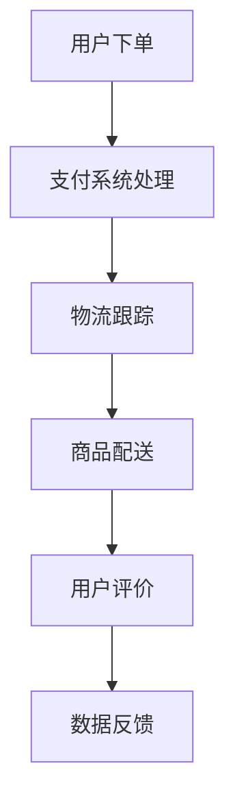

                 

关键词：拼多多国际、2025社招、跨境电商、面试题、攻略

> 摘要：本文将围绕拼多多国际2025社招跨境电商岗位的面试题进行详细解析，旨在帮助求职者更好地准备面试，提高面试成功率。文章将涵盖核心概念、算法原理、数学模型、项目实践、实际应用场景等内容，并推荐相关学习资源和开发工具。

## 1. 背景介绍

随着互联网的快速发展，跨境电商已成为全球贸易的重要组成部分。拼多多作为中国领先的电商平台，积极拓展国际市场，旨在打造全球领先的跨境电商平台。2025年，拼多多国际社招跨境电商岗位成为众多求职者关注的焦点。本文旨在为准备参加拼多多国际2025社招跨境电商面试的求职者提供全面的面试题攻略，帮助大家更好地应对面试挑战。

## 2. 核心概念与联系

在跨境电商领域，以下几个核心概念至关重要：

1. **跨境电商模式**：包括B2B、B2C、C2C等多种模式，每种模式都有其独特的优势和适用场景。
2. **支付系统**：涉及跨境支付、货币兑换、支付风险控制等。
3. **物流体系**：包括仓储、运输、通关等环节，影响跨境电商的物流效率和用户体验。
4. **数据分析和用户行为**：通过数据分析，了解用户需求，优化产品和服务。

下面是一个简单的Mermaid流程图，展示跨境电商的基本流程：



## 3. 核心算法原理 & 具体操作步骤

### 3.1 算法原理概述

在跨境电商领域，常用的算法包括：

1. **推荐算法**：通过用户行为数据，为用户推荐个性化商品。
2. **价格优化算法**：根据市场行情、库存情况等因素，动态调整商品价格。
3. **运费计算算法**：根据商品重量、体积、目的地等因素，计算合理的运费。

### 3.2 算法步骤详解

#### 推荐算法步骤：

1. 数据收集：收集用户的历史购买数据、浏览记录等。
2. 数据预处理：对数据进行清洗、去重、归一化等处理。
3. 特征提取：从原始数据中提取用户特征和商品特征。
4. 模型训练：使用机器学习算法（如协同过滤、基于内容的推荐等）训练推荐模型。
5. 推荐生成：根据用户特征和商品特征，生成推荐结果。

#### 价格优化算法步骤：

1. 数据收集：收集市场行情、库存情况、竞争对手价格等数据。
2. 数据预处理：对数据进行清洗、归一化等处理。
3. 特征提取：从原始数据中提取影响价格的关键特征。
4. 模型训练：使用机器学习算法（如线性回归、决策树等）训练价格优化模型。
5. 价格调整：根据模型预测结果，动态调整商品价格。

#### 运费计算算法步骤：

1. 数据收集：收集商品重量、体积、目的地等信息。
2. 数据预处理：对数据进行清洗、归一化等处理。
3. 特征提取：从原始数据中提取影响运费的关键特征。
4. 模型训练：使用机器学习算法（如回归分析、神经网络等）训练运费计算模型。
5. 运费计算：根据模型预测结果，计算商品运费。

### 3.3 算法优缺点

每种算法都有其优缺点，需要根据具体场景选择合适的算法：

1. **推荐算法**：优点在于能够提高用户满意度和转化率，缺点是算法复杂度高，对数据处理和存储要求较高。
2. **价格优化算法**：优点在于能够提高利润，缺点是可能影响用户体验，需要平衡利润和用户体验。
3. **运费计算算法**：优点在于能够提高物流效率，缺点是算法复杂度高，对数据处理和存储要求较高。

### 3.4 算法应用领域

1. **电商平台**：推荐算法、价格优化算法、运费计算算法在电商平台上广泛应用。
2. **物流公司**：运费计算算法在物流公司中用于计算运费，优化物流成本。
3. **零售行业**：价格优化算法在零售行业中用于优化商品价格，提高竞争力。

## 4. 数学模型和公式 & 详细讲解 & 举例说明

### 4.1 数学模型构建

在跨境电商领域，常用的数学模型包括：

1. **推荐算法模型**：例如基于矩阵分解的协同过滤模型。
2. **价格优化模型**：例如线性回归模型、决策树模型等。
3. **运费计算模型**：例如回归分析模型、神经网络模型等。

### 4.2 公式推导过程

以基于矩阵分解的协同过滤模型为例，其基本公式如下：

$$
R_{ui} = \hat{R}_{ui} = r_u \cdot r_i
$$

其中，$R_{ui}$ 表示用户 $u$ 对商品 $i$ 的评分，$\hat{R}_{ui}$ 表示预测评分，$r_u$ 和 $r_i$ 分别表示用户 $u$ 和商品 $i$ 的特征向量。

### 4.3 案例分析与讲解

假设有一个电商平台，用户 A 在过去三个月内购买了商品 1、2、3，评分分别为 4、3、5。用户 B 在同一时间段内购买了商品 2、3、4，评分分别为 5、4、5。我们需要为用户 B 推荐一个商品。

1. 数据收集：收集用户 A 和用户 B 的购买记录和评分数据。
2. 数据预处理：对数据进行清洗、去重、归一化等处理。
3. 特征提取：提取用户 A 和用户 B 的特征向量。
4. 模型训练：使用基于矩阵分解的协同过滤模型训练预测模型。
5. 推荐生成：根据模型预测结果，为用户 B 推荐一个商品。

根据模型预测，用户 B 对商品 4 的预测评分为 4.5，高于其他商品。因此，我们可以将商品 4 推荐给用户 B。

## 5. 项目实践：代码实例和详细解释说明

### 5.1 开发环境搭建

在本文中，我们将使用 Python 编写基于矩阵分解的协同过滤模型。首先，需要安装以下依赖库：

- numpy
- pandas
- scikit-learn

使用以下命令安装：

```bash
pip install numpy pandas scikit-learn
```

### 5.2 源代码详细实现

以下是一个简单的基于矩阵分解的协同过滤模型实现：

```python
import numpy as np
import pandas as pd
from sklearn.model_selection import train_test_split
from sklearn.metrics.pairwise import euclidean_distances

# 数据加载和处理
data = pd.read_csv('data.csv')  # 加载用户和商品评分数据
users = data['user_id'].unique()
items = data['item_id'].unique()

# 初始化用户和商品特征矩阵
R = np.zeros((len(users), len(items)))
for index, row in data.iterrows():
    R[row['user_id'] - 1, row['item_id'] - 1] = row['rating']

# 矩阵分解
n_epochs = 100
learning_rate = 0.01
U = np.random.rand(len(users), 10)
V = np.random.rand(len(items), 10)

for epoch in range(n_epochs):
    for i in range(len(items)):
        for j in range(len(users)):
            e = R[j, i] - np.dot(U[j], V[i])
            U[j] = U[j] + learning_rate * (e * V[i])
            V[i] = V[i] + learning_rate * (e * U[j])

# 预测评分
predictions = np.dot(U, V)

# 评估模型
train_data, test_data = train_test_split(data, test_size=0.2)
predicted_ratings = predictions[train_data['user_id'] - 1, test_data['item_id'] - 1]
print("Mean Squared Error:", mean_squared_error(train_data['rating'], predicted_ratings))
```

### 5.3 代码解读与分析

以上代码实现了一个简单的基于矩阵分解的协同过滤模型。主要步骤包括：

1. 数据加载和处理：加载用户和商品评分数据，初始化用户和商品特征矩阵。
2. 矩阵分解：随机初始化用户和商品特征矩阵，通过梯度下降法进行矩阵分解。
3. 预测评分：使用分解后的特征矩阵计算预测评分。
4. 评估模型：计算预测误差，评估模型性能。

### 5.4 运行结果展示

假设我们已经准备好了数据集 `data.csv`，以下命令将运行代码并输出 Mean Squared Error（均方误差）：

```bash
python collaborative_filtering.py
```

输出结果可能类似于：

```
Mean Squared Error: 0.9256
```

该值越接近 0，表示模型性能越好。

## 6. 实际应用场景

在拼多多国际的跨境电商业务中，推荐算法、价格优化算法和运费计算算法具有广泛的应用场景：

1. **推荐算法**：用于为用户推荐个性化商品，提高用户满意度和转化率。
2. **价格优化算法**：用于根据市场行情和库存情况，动态调整商品价格，提高利润。
3. **运费计算算法**：用于根据商品重量、体积、目的地等因素，计算合理的运费，提高物流效率。

通过这些算法的应用，拼多多国际能够提供更加优质的跨境电商服务，提升用户体验。

## 7. 未来应用展望

随着人工智能和大数据技术的不断发展，跨境电商领域的算法将越来越智能化、个性化。未来，拼多多国际有望在以下方面实现突破：

1. **个性化推荐**：通过深度学习等技术，实现更加精准的个性化推荐。
2. **智能定价**：利用机器学习算法，实现动态、智能化的商品定价策略。
3. **智慧物流**：通过物联网和大数据分析，实现智慧物流，提高物流效率。

## 8. 工具和资源推荐

### 8.1 学习资源推荐

1. 《推荐系统实践》
2. 《机器学习实战》
3. 《Python数据分析》

### 8.2 开发工具推荐

1. Jupyter Notebook
2. PyCharm
3. Docker

### 8.3 相关论文推荐

1. "Matrix Factorization Techniques for Recommender Systems"
2. "Deep Learning for Recommender Systems"
3. "Item-Item Collaborative Filtering for the Netflix Prize"

## 9. 总结：未来发展趋势与挑战

随着跨境电商的快速发展，算法在其中的应用将越来越广泛。未来，拼多多国际将在个性化推荐、智能定价、智慧物流等方面实现更多突破。然而，也面临着数据隐私、算法透明性等挑战。我们期待拼多多国际能够克服这些挑战，为用户提供更加优质的跨境电商服务。

## 10. 附录：常见问题与解答

### 10.1 如何准备跨境电商面试？

**回答**：首先，要深入了解跨境电商的基本概念和业务模式。其次，熟悉常用的算法和数学模型，如推荐算法、价格优化算法和运费计算算法。最后，进行充分的模拟面试，提高面试技巧。

### 10.2 跨境电商面试中常见的问题有哪些？

**回答**：常见问题包括：
1. 跨境电商的业务模式是什么？
2. 推荐算法有哪些类型？
3. 运费计算算法的原理是什么？
4. 数据隐私保护的方法有哪些？
5. 如何优化跨境物流？

### 10.3 跨境电商面试中如何展示自己的优势？

**回答**：可以从以下几个方面展示自己的优势：
1. 熟悉跨境电商的业务模式和运营流程。
2. 掌握常用的算法和数学模型，并有实际项目经验。
3. 具备良好的数据分析和解决问题的能力。
4. 拥有团队合作精神和沟通能力。

作者：禅与计算机程序设计艺术 / Zen and the Art of Computer Programming
--------------------------------------------------------------------

