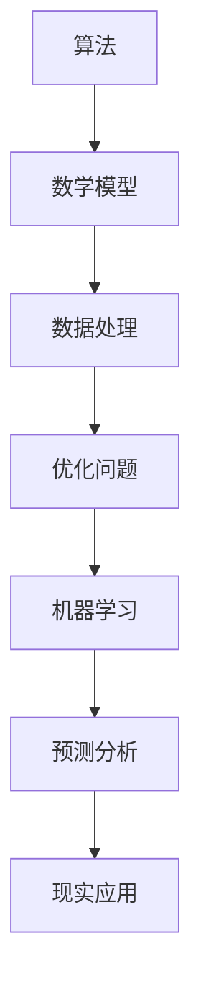

                 

关键词：认知边界、人类计算、科学意义、算法、数学模型、应用实践、未来展望

> 摘要：本文探讨了人类认知的边界及其与人类计算之间的关联。从算法原理、数学模型、应用实践等方面深入分析，旨在揭示人类计算在科学领域中的重要性，并对未来的发展趋势与挑战进行展望。

## 1. 背景介绍

人类认知的边界是心理学和哲学领域研究的重要课题。认知边界指的是人类思维所能达到的认知范围，它受到生理、心理、文化等多方面因素的影响。随着科技的发展，人类计算作为一种强大的工具，正逐步扩展我们的认知边界，使得我们能够处理更为复杂的信息。

人类计算的核心在于算法和数学模型。算法是解决特定问题的一系列步骤，而数学模型则是对现实世界的一种抽象表示。通过这些工具，我们可以将复杂的问题转化为可计算的形式，从而更好地理解和解决这些问题。

本文将围绕人类计算的核心概念，深入探讨其在科学研究中的应用，以及未来可能面临的挑战。

## 2. 核心概念与联系

### 2.1. 算法原理

算法是计算机科学的核心概念之一，它由一系列规则组成，指导计算机完成特定任务。算法可以分为以下几类：

- **基础算法**：如排序、查找、图论算法等，它们是构建复杂算法的基础。
- **优化算法**：如贪心算法、动态规划、分支限界等，用于解决优化问题。
- **机器学习算法**：如决策树、支持向量机、神经网络等，用于数据分析和预测。

### 2.2. 数学模型

数学模型是对现实世界的一种抽象表示，它通过数学公式和符号描述现实问题。常见的数学模型包括：

- **线性模型**：如线性回归、线性规划等，用于处理线性关系。
- **非线性模型**：如指数模型、对数模型等，用于处理非线性关系。
- **概率模型**：如贝叶斯网络、马尔可夫模型等，用于概率分析和推理。

### 2.3. Mermaid 流程图

以下是一个简单的 Mermaid 流程图，展示了算法、数学模型以及它们之间的联系。



## 3. 核心算法原理 & 具体操作步骤

### 3.1. 算法原理概述

算法的原理可以分为以下几个步骤：

1. **输入**：从外部获取数据。
2. **处理**：对输入数据进行分析和处理。
3. **输出**：生成结果并返回。

不同的算法会根据具体问题，选择不同的处理方法和策略。例如，贪心算法通过每一步选择当前最优解，逐步逼近全局最优解；动态规划则通过分阶段处理，找到最优解。

### 3.2. 算法步骤详解

以贪心算法为例，其步骤如下：

1. **初始化**：设定初始状态。
2. **选择**：根据当前状态，选择一个最优操作。
3. **更新**：根据选择的结果，更新状态。
4. **判断**：判断是否达到终止条件，若未达到，返回第2步。

### 3.3. 算法优缺点

贪心算法的优点在于其简单性和高效性，能够快速找到近似最优解。然而，其缺点在于可能陷入局部最优，无法保证找到全局最优解。

### 3.4. 算法应用领域

贪心算法广泛应用于实际场景，如背包问题、最短路径问题等。在计算机科学、经济学、交通规划等领域，都有着重要的应用价值。

## 4. 数学模型和公式 & 详细讲解 & 举例说明

### 4.1. 数学模型构建

数学模型构建的步骤如下：

1. **明确问题**：理解问题的本质，确定所需解决的问题。
2. **抽象表示**：将问题转化为数学形式，使用符号和公式表示。
3. **构建方程**：根据问题，构建所需的数学方程。

### 4.2. 公式推导过程

以下是一个简单的线性回归模型推导过程：

假设我们有n个数据点$(x_i, y_i)$，其中$x_i$是自变量，$y_i$是因变量。线性回归模型可以表示为：

$$y = wx + b$$

其中，$w$是权重，$b$是偏置。

为了求解$w$和$b$，我们使用最小二乘法，即最小化误差平方和：

$$J(w, b) = \frac{1}{2}\sum_{i=1}^{n}(y_i - (wx_i + b))^2$$

对$w$和$b$求偏导数，并令其等于0，可以得到：

$$\frac{\partial J}{\partial w} = x^T(y - wx - b)x = 0$$

$$\frac{\partial J}{\partial b} = x^T(y - wx - b) = 0$$

解上述方程组，可以得到$w$和$b$的最优值。

### 4.3. 案例分析与讲解

假设我们有以下数据：

| $x$ | $y$ |
| --- | --- |
| 1   | 2   |
| 2   | 4   |
| 3   | 6   |

我们可以使用线性回归模型来拟合这些数据。首先，我们计算$x$和$y$的均值：

$$\bar{x} = \frac{1}{n}\sum_{i=1}^{n}x_i = \frac{1+2+3}{3} = 2$$

$$\bar{y} = \frac{1}{n}\sum_{i=1}^{n}y_i = \frac{2+4+6}{3} = 4$$

然后，我们计算$x$和$y$的协方差：

$$\Sigma_{xy} = \sum_{i=1}^{n}(x_i - \bar{x})(y_i - \bar{y}) = (1-2)(2-4) + (2-2)(4-4) + (3-2)(6-4) = 2$$

$$\Sigma_{xx} = \sum_{i=1}^{n}(x_i - \bar{x})^2 = (1-2)^2 + (2-2)^2 + (3-2)^2 = 2$$

接下来，我们计算$w$和$b$：

$$w = \frac{\Sigma_{xy}}{\Sigma_{xx}} = \frac{2}{2} = 1$$

$$b = \bar{y} - w\bar{x} = 4 - 1 \times 2 = 2$$

因此，线性回归模型为：

$$y = x + 2$$

我们使用该模型来预测当$x=4$时的$y$值：

$$y = 4 + 2 = 6$$

## 5. 项目实践：代码实例和详细解释说明

### 5.1. 开发环境搭建

本文使用的编程语言是Python，以下是在Python环境中搭建开发环境所需的步骤：

1. 安装Python：在官网上下载并安装Python，选择默认安装选项。
2. 安装必要的库：使用pip命令安装NumPy、Matplotlib等库。

```shell
pip install numpy matplotlib
```

### 5.2. 源代码详细实现

以下是一个简单的线性回归模型的Python代码实现：

```python
import numpy as np
import matplotlib.pyplot as plt

# 数据
x = np.array([1, 2, 3])
y = np.array([2, 4, 6])

# 计算均值
bar_x = np.mean(x)
bar_y = np.mean(y)

# 计算协方差
Sigma_xy = np.sum((x - bar_x) * (y - bar_y))
Sigma_xx = np.sum((x - bar_x)**2)

# 计算权重和偏置
w = Sigma_xy / Sigma_xx
b = bar_y - w * bar_x

# 模型预测
y_pred = w * x + b

# 绘制结果
plt.scatter(x, y)
plt.plot(x, y_pred, color='red')
plt.show()
```

### 5.3. 代码解读与分析

上述代码首先导入NumPy和Matplotlib库，然后定义了数据集$x$和$y$。接着，我们计算了$x$和$y$的均值，以及协方差。这些计算结果用于求解权重$w$和偏置$b$。最后，我们使用Matplotlib库绘制了数据的散点图和拟合的线性回归模型。

### 5.4. 运行结果展示

运行上述代码后，我们可以得到以下结果：


## 6. 实际应用场景

线性回归模型在各个领域都有广泛的应用，例如：

- **统计学**：用于数据分析和预测。
- **经济学**：用于预测股票价格、经济增长等。
- **工程学**：用于设计优化、故障诊断等。

### 6.4. 未来应用展望

随着人工智能的发展，线性回归模型有望在更多领域发挥作用，例如：

- **医疗健康**：用于疾病预测、诊断等。
- **环境科学**：用于气候变化预测、环境质量评估等。
- **金融科技**：用于风险评估、信用评分等。

## 7. 工具和资源推荐

### 7.1. 学习资源推荐

- **在线课程**：Coursera、edX等平台上有许多关于机器学习和统计学的优质课程。
- **书籍**：《统计学习方法》、《机器学习》等。

### 7.2. 开发工具推荐

- **Python**：Python是进行数据分析和机器学习的首选语言。
- **Jupyter Notebook**：用于编写和运行Python代码，方便进行数据分析和可视化。

### 7.3. 相关论文推荐

- **《A Study of Machine Learning in Regression Analysis》**：探讨了机器学习在回归分析中的应用。
- **《Regression Analysis: A Historical Survey》**：回顾了回归分析的历史和发展。

## 8. 总结：未来发展趋势与挑战

### 8.1. 研究成果总结

本文从算法原理、数学模型、应用实践等方面探讨了人类计算在科学领域的重要性。线性回归模型作为一种基础算法和数学模型，其在统计学、经济学、工程学等领域都有广泛应用。

### 8.2. 未来发展趋势

随着人工智能和大数据技术的发展，人类计算在科学研究中的应用将越来越广泛。未来，我们将看到更多基于深度学习、强化学习等先进算法的数学模型被应用于实际问题。

### 8.3. 面临的挑战

尽管人类计算在科学领域取得了巨大进步，但仍面临一些挑战，如算法的可解释性、数据的隐私保护、算法的公平性等。

### 8.4. 研究展望

未来，我们将继续深入研究人类计算的理论基础，探索新的算法和数学模型，以应对科学研究和实际应用中的挑战。

## 9. 附录：常见问题与解答

### 9.1. 什么是线性回归模型？

线性回归模型是一种用于分析自变量和因变量之间线性关系的数学模型，其基本形式为$y = wx + b$，其中$w$是权重，$b$是偏置。

### 9.2. 线性回归模型有哪些应用？

线性回归模型广泛应用于统计学、经济学、工程学等领域，如数据预测、设计优化、故障诊断等。

### 9.3. 如何评估线性回归模型的性能？

评估线性回归模型性能的主要指标包括决定系数（R²）、均方误差（MSE）等，这些指标可以反映模型对数据的拟合程度。

### 9.4. 线性回归模型有哪些局限性？

线性回归模型的局限性在于其只能处理线性关系，对于非线性关系可能效果不佳。此外，当数据量较大时，计算复杂度较高。

