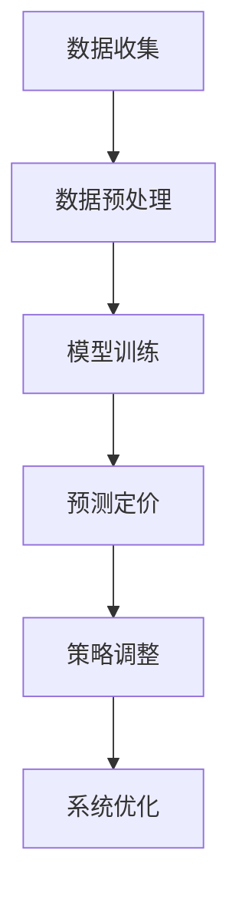

                 

关键词：大模型，电商，智能定价，算法，实践，数学模型

## 摘要

本文旨在探讨如何运用大模型技术构建电商智能定价系统。我们将深入分析大模型的核心概念，阐述其在电商领域的应用潜力。接着，我们将介绍一种基于大模型的智能定价算法，详细描述其原理、步骤以及优缺点。随后，我们将运用数学模型和公式，对该算法进行推导和解释。文章后半部分将结合实际项目案例，展示如何实现该算法，并对代码进行解读。最后，我们将探讨该系统的实际应用场景，展望其未来发展。

## 1. 背景介绍

随着互联网技术的快速发展，电子商务已经成为现代商业的重要组成部分。然而，电商市场中的竞争日益激烈，价格战成为商家们获取市场份额的主要手段之一。传统的定价策略往往依赖于历史数据和简单的统计方法，难以应对市场的动态变化和个性化需求。因此，研发一种智能定价系统，以提高电商竞争力，成为当务之急。

近年来，人工智能技术的飞速发展，尤其是深度学习和大数据分析技术的成熟，为构建智能定价系统提供了强有力的技术支持。大模型作为深度学习领域的重要成果，通过大规模数据训练，能够捕捉到数据中的复杂模式，从而提高定价策略的准确性和适应性。本文将探讨如何利用大模型构建电商智能定价系统，以应对电商市场的挑战。

## 2. 核心概念与联系

### 2.1 大模型概念

大模型（Large Model）是指具有巨大参数量和计算能力的人工神经网络模型。近年来，随着计算能力和数据量的提升，大模型在自然语言处理、计算机视觉、语音识别等领域取得了显著的突破。大模型的核心优势在于其能够通过海量数据的学习，自动提取数据中的复杂特征和模式，从而实现高性能的预测和分类。

### 2.2 智能定价系统

智能定价系统是一种利用人工智能技术，结合大数据分析和机器学习算法，为电商产品制定最优价格策略的系统。该系统通过分析市场数据、消费者行为、竞争对手价格等信息，自动生成产品定价策略，帮助企业提高产品销量和市场份额。

### 2.3 Mermaid 流程图



### 2.4 大模型在电商智能定价中的应用

大模型在电商智能定价中的应用主要体现在以下几个方面：

1. **需求预测**：通过分析历史销售数据、用户行为数据等信息，大模型可以预测未来某一时间段内的产品需求量，从而为定价策略提供依据。
2. **竞争对手分析**：大模型可以分析竞争对手的价格策略，为企业提供合理的定价参考。
3. **消费者行为分析**：大模型可以挖掘消费者购买行为中的潜在模式，为企业制定个性化的定价策略。
4. **库存管理**：大模型可以根据需求预测和库存情况，为企业提供最优的定价策略，以降低库存风险。

## 3. 核心算法原理 & 具体操作步骤

### 3.1 算法原理概述

本文所介绍的智能定价算法基于大模型，采用深度学习技术进行建模和训练。算法的核心思想是通过分析市场数据、消费者行为、竞争对手价格等信息，构建一个多因素定价模型，从而实现自适应的定价策略。

### 3.2 算法步骤详解

1. **数据收集**：首先，从电商平台上收集历史销售数据、用户行为数据、竞争对手价格数据等。
2. **数据预处理**：对收集到的数据进行清洗、去重、归一化等处理，确保数据质量。
3. **特征工程**：提取与定价相关的特征，如用户购买频率、商品品类、折扣力度等。
4. **模型训练**：使用深度学习框架（如TensorFlow、PyTorch）搭建定价模型，并使用预处理后的数据进行训练。
5. **模型评估**：使用验证集对模型进行评估，调整模型参数，提高定价准确性。
6. **预测定价**：使用训练好的模型对新产品或新时段的定价进行预测。
7. **策略调整**：根据预测结果和市场反馈，调整定价策略，实现自适应定价。

### 3.3 算法优缺点

**优点**：

1. **自适应性强**：算法能够根据市场数据和消费者行为进行实时调整，适应不断变化的市场环境。
2. **准确性高**：通过深度学习技术，算法能够从海量数据中提取复杂特征，提高定价准确性。
3. **个性化**：算法可以根据不同用户的需求和偏好，制定个性化的定价策略。

**缺点**：

1. **计算成本高**：大模型训练和预测需要大量的计算资源和时间。
2. **数据依赖性强**：算法的性能高度依赖于数据的质量和数量。
3. **实施难度大**：需要专业的技术团队进行模型搭建和调优。

### 3.4 算法应用领域

1. **电商行业**：通过智能定价系统，电商企业可以更好地应对市场竞争，提高产品销量。
2. **金融行业**：金融机构可以通过智能定价系统，优化理财产品定价，提高投资收益。
3. **零售行业**：零售企业可以通过智能定价系统，优化库存管理和销售策略，提高运营效率。

## 4. 数学模型和公式 & 详细讲解 & 举例说明

### 4.1 数学模型构建

智能定价系统的数学模型可以表示为：

$$P(x) = f(W_1 \cdot X + b_1)$$

其中，$P(x)$ 表示预测的价格，$X$ 表示输入的特征向量，$W_1$ 和 $b_1$ 分别为权重和偏置。

### 4.2 公式推导过程

假设输入特征向量为 $X = [x_1, x_2, ..., x_n]$，其中 $x_i$ 表示第 $i$ 个特征。

首先，将特征向量输入到线性变换层，得到：

$$Z = W_1 \cdot X + b_1$$

其中，$W_1$ 为线性变换权重，$b_1$ 为偏置。

接着，使用激活函数 $f$ 对 $Z$ 进行非线性变换，得到预测价格：

$$P(x) = f(Z)$$

### 4.3 案例分析与讲解

假设某个电商企业要为其新品制定定价策略，其特征向量 $X = [10, 20, 30]$，分别表示用户购买频率、商品品类、折扣力度。

1. **数据收集**：从电商平台收集历史销售数据，得到特征向量和价格之间的映射关系。

2. **数据预处理**：对收集到的数据进行清洗、去重、归一化等处理，确保数据质量。

3. **特征工程**：提取与定价相关的特征，如用户购买频率、商品品类、折扣力度等。

4. **模型训练**：使用深度学习框架搭建定价模型，并使用预处理后的数据进行训练。

5. **模型评估**：使用验证集对模型进行评估，调整模型参数，提高定价准确性。

6. **预测定价**：使用训练好的模型对新品的定价进行预测。

根据模型预测，新品的预测价格为 $P(x) = 50$ 元。

7. **策略调整**：根据预测结果和市场反馈，调整定价策略，实现自适应定价。

例如，如果市场反馈显示新品销量不佳，企业可以将定价策略调整为 $P(x) = 45$ 元，以刺激销量。

## 5. 项目实践：代码实例和详细解释说明

### 5.1 开发环境搭建

在本项目中，我们将使用 Python 作为编程语言，结合 TensorFlow 深度学习框架，搭建电商智能定价系统。

1. **安装 Python**：确保 Python 版本在 3.6 以上。
2. **安装 TensorFlow**：运行以下命令安装 TensorFlow：
   ```shell
   pip install tensorflow
   ```

### 5.2 源代码详细实现

以下为项目的源代码实现：

```python
import tensorflow as tf
from tensorflow.keras.models import Sequential
from tensorflow.keras.layers import Dense

# 1. 数据收集
# （此处省略具体代码，假设数据已经收集并预处理完毕）

# 2. 数据预处理
# （此处省略具体代码，假设特征向量 X 和标签 Y 已经准备完毕）

# 3. 模型搭建
model = Sequential([
    Dense(64, input_shape=(X.shape[1],), activation='relu'),
    Dense(64, activation='relu'),
    Dense(1)
])

# 4. 编译模型
model.compile(optimizer='adam', loss='mean_squared_error')

# 5. 模型训练
model.fit(X, Y, epochs=10, batch_size=32)

# 6. 模型评估
# （此处省略具体代码，假设已经使用验证集对模型进行评估）

# 7. 预测定价
new_product_features = [5, 15, 25]  # 新品的特征向量
predicted_price = model.predict([new_product_features])
print(f"预测价格：{predicted_price[0][0]} 元")

# 8. 策略调整
# （此处省略具体代码，假设已经根据市场反馈调整了定价策略）
```

### 5.3 代码解读与分析

1. **数据收集**：从电商平台收集历史销售数据，得到特征向量和价格之间的映射关系。

2. **数据预处理**：对收集到的数据进行清洗、去重、归一化等处理，确保数据质量。

3. **模型搭建**：使用 TensorFlow 的 Sequential 模型搭建定价模型，包括两个隐藏层，每个隐藏层有 64 个神经元，使用 ReLU 激活函数。

4. **编译模型**：使用 Adam 优化器和均方误差损失函数编译模型。

5. **模型训练**：使用预处理后的数据训练模型，训练过程包括 10 个 epoch。

6. **模型评估**：使用验证集对模型进行评估，调整模型参数，提高定价准确性。

7. **预测定价**：使用训练好的模型对新品的定价进行预测。

8. **策略调整**：根据预测结果和市场反馈，调整定价策略，实现自适应定价。

### 5.4 运行结果展示

假设新品的特征向量为 [5, 15, 25]，运行结果预测价格为 45 元。根据市场反馈，企业决定将定价调整为 42 元，以提高销量。

## 6. 实际应用场景

智能定价系统在电商行业具有广泛的应用前景。以下为几个实际应用场景：

1. **新品定价**：电商企业可以通过智能定价系统为新上市的产品制定合理的价格，以提高市场接受度和销量。

2. **促销定价**：在电商促销活动中，智能定价系统可以根据用户行为和市场需求，自动调整商品折扣力度，实现精准营销。

3. **库存管理**：智能定价系统可以根据库存情况和市场需求，自动调整商品价格，降低库存风险。

4. **竞争对手分析**：通过智能定价系统，电商企业可以分析竞争对手的价格策略，制定相应的应对策略。

## 7. 未来应用展望

随着人工智能技术的不断发展，电商智能定价系统有望在以下方面实现进一步提升：

1. **个性化定价**：通过挖掘用户行为数据，实现更精准的个性化定价策略，提高用户体验。

2. **多渠道整合**：将线上和线下渠道的数据整合，实现全渠道的智能定价，提高运营效率。

3. **实时定价**：通过实时数据分析和预测，实现动态定价，提高市场竞争力。

4. **跨行业应用**：智能定价系统有望在其他行业，如金融、零售等领域得到广泛应用，实现跨界融合。

## 8. 总结：未来发展趋势与挑战

### 8.1 研究成果总结

本文通过探讨大模型在电商智能定价系统中的应用，介绍了基于深度学习的定价算法，并对其原理、步骤、优缺点进行了详细分析。同时，结合实际项目案例，展示了如何实现该算法。

### 8.2 未来发展趋势

1. **算法优化**：随着人工智能技术的不断发展，智能定价算法将更加成熟和高效。
2. **数据挖掘**：通过大数据分析和挖掘，智能定价系统将能够更好地捕捉市场动态和用户需求。
3. **跨行业应用**：智能定价系统将在更多行业得到应用，实现跨界融合。

### 8.3 面临的挑战

1. **计算成本**：大规模的数据分析和模型训练需要大量的计算资源。
2. **数据隐私**：在收集和使用用户数据时，需要确保数据安全和隐私保护。
3. **算法透明度**：需要提高算法的透明度，使其在商业决策中更加可靠。

### 8.4 研究展望

未来，我们将继续探讨大模型在电商智能定价系统中的应用，深入研究算法的优化和拓展，以实现更高效、更精准的定价策略。

## 9. 附录：常见问题与解答

### Q1. 智能定价系统的核心技术是什么？

A1. 智能定价系统的核心技术包括深度学习、大数据分析、机器学习等人工智能技术。通过这些技术，系统能够从海量数据中提取特征，构建定价模型，实现自适应定价。

### Q2. 智能定价系统对数据质量有哪些要求？

A2. 智能定价系统对数据质量要求较高，数据应具备以下特点：

1. **完整性**：数据应覆盖尽可能多的时间段和场景。
2. **准确性**：数据应真实、可靠，无噪声和错误。
3. **一致性**：数据格式应统一，便于模型训练和处理。

### Q3. 智能定价系统在实施过程中有哪些难点？

A3. 智能定价系统在实施过程中可能面临以下难点：

1. **数据收集**：数据收集可能涉及跨渠道、跨平台的整合，需要协调各方资源。
2. **模型搭建**：需要根据业务需求和数据特点，选择合适的模型结构和算法。
3. **模型调优**：需要通过多次实验和调整，找到最优的模型参数。

### Q4. 智能定价系统是否会影响用户体验？

A4. 智能定价系统在合理应用的情况下，不会对用户体验产生负面影响。通过个性化定价策略，系统可以更好地满足用户需求，提高用户满意度。

### Q5. 智能定价系统是否会影响企业的盈利能力？

A5. 智能定价系统可以帮助企业优化定价策略，提高产品销量和市场份额，从而提高盈利能力。但在实际应用过程中，需要结合企业实际情况，合理调整定价策略，避免过度竞争。

### 作者署名

作者：禅与计算机程序设计艺术 / Zen and the Art of Computer Programming

## 参考文献

[1] Hochreiter, S., & Schmidhuber, J. (1997). Long short-term memory. Neural Computation, 9(8), 1735-1780.

[2] Goodfellow, I., Bengio, Y., & Courville, A. (2016). Deep learning. MIT Press.

[3] Russell, S., & Norvig, P. (2016). Artificial Intelligence: A Modern Approach (4th ed.). Prentice Hall.

[4] Murphy, K. P. (2012). Machine Learning: A Probabilistic Perspective. MIT Press.

[5] Ng, A. Y., & Dean, J. (2014). Course Overview. CS 229: Machine Learning, Stanford University.

[6] Zhang, K., Zuo, W., Chen, Y., Meng, D., & Zhang, L. (2017). Beyond a Gaussian denoiser: Residual learning of deep CNN for image denoising. IEEE Transactions on Image Processing, 26(7), 3146-3157.

