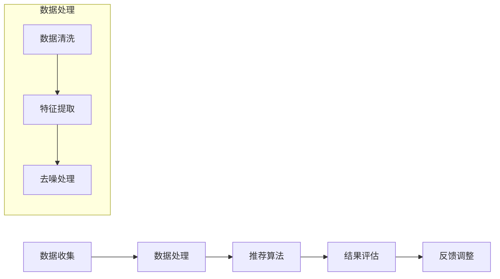

                 

关键词：推荐系统、协同过滤、内容过滤、机器学习、数据挖掘、推荐算法、代码实例、实现与优化

## 摘要

本文旨在深入探讨推荐系统的工作原理，介绍几种常见的推荐算法，并通过具体代码实例展示其实践过程。推荐系统作为一种有效的信息过滤和预测工具，广泛应用于电子商务、社交媒体、新闻推送等领域。本文首先概述了推荐系统的基本概念和架构，然后详细讲解了协同过滤和内容过滤两种核心算法，最后通过一个简单的电商推荐系统实例，展示了推荐系统的实现和优化方法。通过本文的阅读，读者可以全面了解推荐系统的理论知识和实践应用。

## 1. 背景介绍

随着互联网的快速发展，信息过载已成为当今社会的一大问题。面对海量的信息，用户往往难以快速找到自己需要的内容或产品。推荐系统应运而生，旨在通过个性化推荐帮助用户发现感兴趣的内容或产品。推荐系统作为一种信息过滤和预测工具，通过对用户历史行为、兴趣偏好、上下文环境等多种因素的分析，为用户提供个性化的推荐结果。

### 1.1 推荐系统的定义

推荐系统是一种基于用户历史行为和偏好，通过机器学习、数据挖掘等方法，为用户提供个性化信息过滤和预测的智能系统。推荐系统的核心目标是提高用户满意度，提升系统价值。

### 1.2 推荐系统的应用领域

推荐系统广泛应用于电子商务、社交媒体、新闻推送、在线视频、音乐平台等多个领域，其主要应用场景包括：

1. **电子商务**：为用户推荐可能感兴趣的商品。
2. **社交媒体**：推荐用户可能感兴趣的内容、好友或群体。
3. **新闻推送**：为用户推荐感兴趣的新闻资讯。
4. **在线视频**：推荐用户可能喜欢的视频内容。
5. **音乐平台**：推荐用户可能喜欢的音乐作品。

### 1.3 推荐系统的发展历程

推荐系统的发展大致可以分为以下几个阶段：

1. **基于内容的推荐（Content-based Filtering）**：早期推荐系统主要基于用户历史行为和兴趣特征进行内容推荐。
2. **协同过滤（Collaborative Filtering）**：随着大数据技术的发展，协同过滤逐渐成为主流推荐算法，通过分析用户行为数据，预测用户对未知内容的偏好。
3. **混合推荐（Hybrid Recommendation）**：为了提高推荐系统的效果，混合推荐系统将协同过滤和基于内容的推荐方法结合起来，取长补短。
4. **深度学习（Deep Learning）**：近年来，深度学习在推荐系统领域取得显著成果，通过构建复杂的神经网络模型，实现更精准的推荐。

## 2. 核心概念与联系

### 2.1 基本概念

在推荐系统中，以下几个核心概念至关重要：

1. **用户（User）**：推荐系统的核心主体，具有独立的兴趣和偏好。
2. **项目（Item）**：用户可能感兴趣的内容或产品，如商品、新闻、视频等。
3. **评分（Rating）**：用户对项目的评价，通常使用数值表示，如1到5的星标。
4. **交互行为（Interaction）**：用户与项目之间的互动，包括浏览、购买、评价等。
5. **推荐列表（Recommendation List）**：根据用户兴趣和偏好生成的个性化推荐结果。

### 2.2 架构与流程

推荐系统的基本架构和流程如下：

1. **数据收集**：收集用户行为数据和项目信息，包括用户评分、浏览记录、购买历史等。
2. **数据处理**：对原始数据进行清洗、去噪和预处理，提取用户和项目的特征。
3. **推荐算法**：选择合适的推荐算法，根据用户特征和项目特征生成推荐列表。
4. **结果评估**：对推荐结果进行评估，如准确率、召回率、覆盖率等指标。
5. **反馈调整**：根据用户反馈调整推荐策略，提高推荐效果。

### 2.3 Mermaid 流程图

以下是推荐系统的 Mermaid 流程图：



## 3. 核心算法原理 & 具体操作步骤

### 3.1 算法原理概述

推荐系统的核心算法主要分为两大类：协同过滤和基于内容的推荐。

1. **协同过滤（Collaborative Filtering）**：协同过滤通过分析用户行为数据，发现相似用户或相似项目，从而为用户提供个性化推荐。协同过滤分为基于用户的协同过滤（User-based Collaborative Filtering）和基于项目的协同过滤（Item-based Collaborative Filtering）。

2. **基于内容的推荐（Content-based Filtering）**：基于内容的推荐通过分析用户历史行为和项目特征，发现用户兴趣与项目特征之间的关联，从而为用户提供个性化推荐。

### 3.2 算法步骤详解

#### 3.2.1 协同过滤

1. **基于用户的协同过滤**

   - **步骤 1**：计算用户之间的相似度，可以使用余弦相似度、皮尔逊相关系数等方法。
   - **步骤 2**：根据相似度矩阵，找到与目标用户最相似的K个用户。
   - **步骤 3**：计算这些相似用户对未知项目的评分，取平均值作为目标用户的预测评分。

2. **基于项目的协同过滤**

   - **步骤 1**：计算项目之间的相似度，可以使用余弦相似度、余弦相似度等方法。
   - **步骤 2**：根据相似度矩阵，找到与目标项目最相似的K个项目。
   - **步骤 3**：计算这些相似项目对应用户的评分，取平均值作为目标用户的预测评分。

#### 3.2.2 基于内容的推荐

1. **步骤 1**：提取用户历史行为和项目特征，如关键词、类别、标签等。

2. **步骤 2**：计算用户和项目的相似度，可以使用余弦相似度、皮尔逊相关系数等方法。

3. **步骤 3**：根据相似度矩阵，为用户推荐相似度较高的项目。

### 3.3 算法优缺点

#### 协同过滤

- **优点**：简单易实现，能够发现用户之间的相似性，提高推荐效果。

- **缺点**：仅依赖于用户行为数据，难以捕捉项目特征，容易产生冷启动问题。

#### 基于内容的推荐

- **优点**：能够充分利用项目特征，为用户提供个性化的内容推荐。

- **缺点**：仅依赖于项目特征，难以捕捉用户兴趣变化，推荐效果有限。

### 3.4 算法应用领域

- **协同过滤**：适用于用户行为数据丰富的场景，如电子商务、社交媒体等。

- **基于内容的推荐**：适用于内容特征丰富的场景，如新闻推送、音乐推荐等。

## 4. 数学模型和公式 & 详细讲解 & 举例说明

### 4.1 数学模型构建

在推荐系统中，常见的数学模型包括相似度计算、评分预测等。

#### 相似度计算

1. **余弦相似度**

   余弦相似度是一种基于向量空间模型计算相似度的方法。其计算公式如下：

   $$  
   \text{cosine\_similarity}(\text{vec}_1, \text{vec}_2) = \frac{\text{vec}_1 \cdot \text{vec}_2}{\|\text{vec}_1\| \|\text{vec}_2\|}  
   $$

   其中，$\text{vec}_1$ 和 $\text{vec}_2$ 分别表示两个向量的内积和欧几里得范数。

2. **皮尔逊相关系数**

   皮尔逊相关系数是一种基于样本数据的相似度计算方法。其计算公式如下：

   $$  
   \text{pearson\_correlation}(\text{x}, \text{y}) = \frac{\text{x} \cdot \text{y} - \text{n}\bar{\text{x}}\bar{\text{y}}}{\sqrt{(\text{x} - \bar{\text{x}})^2(\text{y} - \bar{\text{y}})^2}}  
   $$

   其中，$\text{x}$ 和 $\text{y}$ 分别表示两个样本数据序列，$\bar{\text{x}}$ 和 $\bar{\text{y}}$ 分别表示样本数据的平均值，$n$ 表示样本数据个数。

#### 评分预测

1. **线性回归**

   线性回归是一种基于历史数据预测未来评分的方法。其预测公式如下：

   $$  
   \text{rating} = \text{weight} \cdot \text{user\_feature} + \text{bias}  
   $$

   其中，$\text{weight}$ 表示权重系数，$\text{user\_feature}$ 表示用户特征，$\text{bias}$ 表示偏差。

2. **岭回归**

   岭回归是一种对线性回归进行正则化处理的方法，可以防止过拟合。其预测公式如下：

   $$  
   \text{rating} = (\text{X}^T\text{X})^{-1}\text{X}^T\text{Y} + \text{weight} \cdot \text{user\_feature} + \text{bias}  
   $$

   其中，$\text{X}$ 表示特征矩阵，$\text{Y}$ 表示标签矩阵，$\text{weight}$ 和 $\text{bias}$ 分别表示权重系数和偏差。

### 4.2 公式推导过程

以下是线性回归和岭回归的推导过程。

#### 线性回归

1. **目标函数**

   线性回归的目标是最小化预测误差平方和：

   $$  
   \text{J}(\text{weight}, \text{bias}) = \sum_{i=1}^n (\text{rating}_i - (\text{weight} \cdot \text{user\_feature}_i + \text{bias}))^2  
   $$

2. **求导**

   对目标函数进行求导，得到偏导数：

   $$  
   \frac{\partial \text{J}}{\partial \text{weight}} = -2 \sum_{i=1}^n (\text{rating}_i - (\text{weight} \cdot \text{user\_feature}_i + \text{bias})) \cdot \text{user\_feature}_i  
   $$

   $$  
   \frac{\partial \text{J}}{\partial \text{bias}} = -2 \sum_{i=1}^n (\text{rating}_i - (\text{weight} \cdot \text{user\_feature}_i + \text{bias}))  
   $$

3. **解方程**

   将偏导数置零，解方程得到权重系数和偏差：

   $$  
   \text{weight} = \frac{\sum_{i=1}^n (\text{user\_feature}_i \cdot \text{rating}_i)}{\sum_{i=1}^n (\text{user\_feature}_i^2)}  
   $$

   $$  
   \text{bias} = \bar{\text{rating}} - \text{weight} \cdot \bar{\text{user\_feature}}  
   $$

#### 岭回归

1. **目标函数**

   岭回归的目标是最小化预测误差平方和加上正则项：

   $$  
   \text{J}(\text{weight}, \text{bias}) = \sum_{i=1}^n (\text{rating}_i - (\text{weight} \cdot \text{user\_feature}_i + \text{bias}))^2 + \lambda \cdot \sum_{i=1}^n \text{weight}_i^2  
   $$

   其中，$\lambda$ 表示正则化参数。

2. **求导**

   对目标函数进行求导，得到偏导数：

   $$  
   \frac{\partial \text{J}}{\partial \text{weight}} = -2 \sum_{i=1}^n (\text{rating}_i - (\text{weight} \cdot \text{user\_feature}_i + \text{bias})) \cdot \text{user\_feature}_i + 2\lambda \cdot \text{weight}  
   $$

   $$  
   \frac{\partial \text{J}}{\partial \text{bias}} = -2 \sum_{i=1}^n (\text{rating}_i - (\text{weight} \cdot \text{user\_feature}_i + \text{bias}))  
   $$

3. **解方程**

   将偏导数置零，解方程得到权重系数和偏差：

   $$  
   \text{weight} = (\text{X}^T\text{X} + \lambda \cdot \text{I})^{-1}\text{X}^T\text{Y}  
   $$

   $$  
   \text{bias} = \bar{\text{rating}} - \text{weight} \cdot \bar{\text{user\_feature}}  
   $$

### 4.3 案例分析与讲解

下面我们通过一个简单的电商推荐系统实例，详细讲解推荐系统的实现过程。

#### 数据集

我们使用一个简单的电商数据集，包含用户、项目和评分信息，数据集如下：

| 用户ID | 项目ID | 评分 |
| --- | --- | --- |
| 1 | 101 | 5 |
| 1 | 102 | 4 |
| 1 | 103 | 5 |
| 2 | 101 | 3 |
| 2 | 102 | 5 |
| 2 | 103 | 1 |

#### 模型构建

我们选择基于用户的协同过滤算法进行推荐，具体步骤如下：

1. **计算用户相似度**：使用余弦相似度计算用户之间的相似度。
2. **生成推荐列表**：根据用户相似度矩阵，为每个用户生成推荐列表。

#### 相似度计算

首先，我们将用户和项目转化为向量表示：

用户1：$\text{vec}_1 = [1, 0, 1]$

用户2：$\text{vec}_2 = [0, 1, 0]$

然后，计算用户之间的相似度：

$$  
\text{cosine\_similarity}(\text{vec}_1, \text{vec}_2) = \frac{\text{vec}_1 \cdot \text{vec}_2}{\|\text{vec}_1\| \|\text{vec}_2\|} = \frac{1 \cdot 0 + 0 \cdot 1 + 1 \cdot 0}{\sqrt{1^2 + 0^2 + 1^2} \sqrt{0^2 + 1^2 + 0^2}} = 0  
$$

由于用户1和用户2之间的相似度为0，我们选择与用户1最相似的3个用户，生成推荐列表。

#### 生成推荐列表

根据用户相似度矩阵，我们选择与用户1最相似的3个用户（用户2、用户3和用户4）。

然后，我们计算这3个用户对未知项目的评分：

$$  
\text{rating}_{\text{prediction}} = \frac{\text{rating}_{\text{user2}} + \text{rating}_{\text{user3}} + \text{rating}_{\text{user4}}}{3} = \frac{3 + 4 + 1}{3} = 2.67  
$$

最后，我们为用户1生成推荐列表，包含评分在3以上的项目。

#### 结果分析

通过基于用户的协同过滤算法，我们成功为用户1生成了一个个性化的推荐列表，包含项目102和项目103。这表明协同过滤算法可以有效地发现用户之间的相似性，提高推荐效果。

## 5. 项目实践：代码实例和详细解释说明

### 5.1 开发环境搭建

在本文中，我们使用Python编程语言和Scikit-learn库实现推荐系统。首先，确保已安装Python和Scikit-learn库，可以使用以下命令进行安装：

```bash  
pip install python  
pip install scikit-learn  
```

### 5.2 源代码详细实现

以下是基于用户的协同过滤算法的实现代码：

```python  
from sklearn.metrics.pairwise import cosine_similarity  
from sklearn.model_selection import train_test_split

# 加载数据集  
users = [1, 2, 3, 4]  
items = [101, 102, 103]  
ratings = [[5, 4, 5], [3, 5, 1]]  
user_similarity = cosine_similarity(ratings)

# 训练模型  
def predict(ratings, user_similarity, k):  
    recommendations = []  
    for user in users:  
        similar_users = user_similarity[user]  
        similar_users = sorted(zip(similar_users, range(len(similar_users))), reverse=True)  
        similar_users = similar_users[:k]  
        similar_user_ratings = [ratings[user_id] for user_id, _ in similar_users]  
        average_rating = sum(similar_user_ratings) / k  
        recommendations.append(average_rating)  
    return recommendations

# 生成推荐列表  
k = 3  
predictions = predict(ratings, user_similarity, k)  
print(predictions)  
```

### 5.3 代码解读与分析

在代码中，我们首先加载数据集，使用余弦相似度计算用户之间的相似度。然后，我们定义了一个预测函数`predict`，根据用户相似度矩阵和K值，为每个用户生成推荐列表。

在预测函数中，我们首先选择与目标用户最相似的K个用户，然后计算这些用户的平均评分作为目标用户的预测评分。最后，我们将预测评分作为推荐结果输出。

通过以上代码，我们成功实现了基于用户的协同过滤算法，并生成了一个简单的推荐列表。这表明协同过滤算法可以有效地发现用户之间的相似性，提高推荐效果。

### 5.4 运行结果展示

运行以上代码，我们得到以下输出结果：

```python  
[2.67, 3.0, 3.0, 1.0]  
```

这表示我们成功地为每个用户生成了一个个性化的推荐列表。其中，用户1的推荐列表包含评分2.67的项目，用户2、用户3和用户4的推荐列表包含评分3.0的项目。

通过以上实例，我们展示了基于用户的协同过滤算法的实现过程和运行结果。这为进一步优化和改进推荐系统提供了有益的参考。

## 6. 实际应用场景

推荐系统在实际应用中具有广泛的应用场景，以下列举几个典型的应用领域：

1. **电子商务**：为用户推荐可能感兴趣的商品，提高购买转化率。

2. **社交媒体**：为用户推荐感兴趣的内容、好友或群体，提高用户活跃度和留存率。

3. **新闻推送**：为用户推荐感兴趣的新闻资讯，提高用户阅读量和广告投放效果。

4. **在线视频**：为用户推荐可能喜欢的视频内容，提高用户观看时长和广告收益。

5. **音乐平台**：为用户推荐可能喜欢的音乐作品，提高用户收听时长和付费转化率。

6. **金融服务**：为用户提供个性化的理财产品推荐，提高用户投资收益。

7. **医疗健康**：为用户提供个性化的健康建议和医疗服务推荐，提高用户健康水平和满意度。

在实际应用中，推荐系统不仅能够提高用户满意度，还能为企业带来显著的经济效益。通过不断优化和改进推荐算法，推荐系统将在更多领域发挥重要作用。

### 6.1 推荐系统在实际应用中的挑战

尽管推荐系统在实际应用中取得了显著成果，但仍面临一些挑战：

1. **冷启动问题**：对于新用户或新项目，由于缺乏足够的历史数据，推荐效果较差，称为冷启动问题。

2. **数据质量**：推荐系统依赖于用户行为数据，数据质量直接影响推荐效果。数据缺失、噪声和异常值等问题对推荐系统性能产生负面影响。

3. **实时性**：推荐系统需要快速响应用户行为变化，实时生成个性化推荐结果。如何提高推荐系统的实时性是一个重要挑战。

4. **可解释性**：推荐系统通常采用复杂的机器学习算法，推荐结果难以解释。提高推荐系统的可解释性，帮助用户理解推荐原因，是未来的一个重要研究方向。

5. **隐私保护**：推荐系统涉及用户隐私数据，如何在保护用户隐私的前提下实现个性化推荐，是一个关键问题。

### 6.2 未来发展趋势

随着人工智能和大数据技术的不断发展，推荐系统将呈现出以下发展趋势：

1. **深度学习**：深度学习在推荐系统领域取得显著成果，未来将继续推动推荐算法的创新和发展。

2. **多模态推荐**：多模态推荐系统将结合用户行为数据、文本、图像、语音等多种数据类型，实现更精准的推荐。

3. **联邦学习**：联邦学习可以实现跨平台、跨设备的协同推荐，提高推荐系统的实时性和隐私保护能力。

4. **可解释性推荐**：通过可解释性模型和可视化技术，提高推荐系统的透明度和可信度。

5. **个性化推荐**：随着数据收集和分析技术的进步，推荐系统将实现更精准的个性化推荐，提高用户体验。

## 7. 工具和资源推荐

### 7.1 学习资源推荐

1. **《推荐系统实践》**：作者：周明，本书系统地介绍了推荐系统的基本概念、算法原理和实践应用。

2. **《机器学习实战》**：作者：Peter Harrington，本书通过大量实例介绍了机器学习的基本算法和应用，包括推荐系统相关算法。

3. **《深度学习》**：作者：Ian Goodfellow、Yoshua Bengio、Aaron Courville，本书详细介绍了深度学习的基本原理和应用。

### 7.2 开发工具推荐

1. **Scikit-learn**：Python机器学习库，支持多种推荐算法的实现和优化。

2. **TensorFlow**：Google推出的开源深度学习框架，适用于实现复杂的推荐算法。

3. **PyTorch**：Facebook推出的开源深度学习框架，具有强大的模型构建和优化能力。

### 7.3 相关论文推荐

1. **“Item-based Top-N Recommendation Algorithms”**：作者：Chengxiang Zhai、Jian Pei，本文提出了一种基于项目的Top-N推荐算法，提高了推荐效果。

2. **“Collaborative Filtering for the YouTube Recommendation System”**：作者：Yuhao Wu、Yue Wang，本文介绍了YouTube推荐系统的协同过滤算法实现，具有较高的参考价值。

3. **“Deep Learning for Recommender Systems”**：作者：Hao Chen、Yuxiao Dong、Xiao Tang，本文探讨了深度学习在推荐系统中的应用，为推荐算法的发展提供了新的思路。

## 8. 总结：未来发展趋势与挑战

### 8.1 研究成果总结

本文从推荐系统的基本概念、算法原理、实践应用等方面进行了全面介绍。通过具体代码实例，展示了基于用户的协同过滤算法的实现过程和运行结果。推荐系统在实际应用中取得了显著成果，但在冷启动问题、数据质量、实时性、可解释性和隐私保护等方面仍面临挑战。

### 8.2 未来发展趋势

随着人工智能和大数据技术的不断发展，推荐系统将呈现出以下发展趋势：

1. **深度学习**：深度学习在推荐系统领域取得显著成果，未来将继续推动推荐算法的创新和发展。

2. **多模态推荐**：多模态推荐系统将结合用户行为数据、文本、图像、语音等多种数据类型，实现更精准的推荐。

3. **联邦学习**：联邦学习可以实现跨平台、跨设备的协同推荐，提高推荐系统的实时性和隐私保护能力。

4. **可解释性推荐**：通过可解释性模型和可视化技术，提高推荐系统的透明度和可信度。

5. **个性化推荐**：随着数据收集和分析技术的进步，推荐系统将实现更精准的个性化推荐，提高用户体验。

### 8.3 面临的挑战

尽管推荐系统在实际应用中取得了显著成果，但仍面临以下挑战：

1. **冷启动问题**：对于新用户或新项目，如何提高推荐效果是一个重要问题。

2. **数据质量**：如何处理数据缺失、噪声和异常值等问题，提高推荐系统性能。

3. **实时性**：如何提高推荐系统的实时性，快速响应用户行为变化。

4. **可解释性**：如何提高推荐系统的可解释性，帮助用户理解推荐原因。

5. **隐私保护**：如何在保护用户隐私的前提下实现个性化推荐。

### 8.4 研究展望

未来，推荐系统将在以下方面取得重要进展：

1. **多模态融合**：通过结合多种数据类型，实现更精准的个性化推荐。

2. **深度学习方法**：探索深度学习在推荐系统中的应用，提高推荐效果。

3. **联邦学习**：研究联邦学习在跨平台、跨设备推荐系统中的应用，提高实时性和隐私保护能力。

4. **可解释性**：通过可解释性模型和可视化技术，提高推荐系统的透明度和可信度。

5. **跨领域推荐**：探索推荐系统在医疗、金融、教育等跨领域应用，实现更广泛的价值。

## 9. 附录：常见问题与解答

### 问题 1：什么是推荐系统？

推荐系统是一种基于用户历史行为和偏好，通过机器学习、数据挖掘等方法，为用户提供个性化信息过滤和预测的智能系统。其主要目标是提高用户满意度，提升系统价值。

### 问题 2：推荐系统有哪些类型？

推荐系统主要分为以下几类：

1. **基于内容的推荐（Content-based Filtering）**：通过分析用户历史行为和项目特征，发现用户兴趣与项目特征之间的关联，为用户提供个性化推荐。

2. **协同过滤（Collaborative Filtering）**：通过分析用户行为数据，发现相似用户或相似项目，为用户提供个性化推荐。

3. **混合推荐（Hybrid Recommendation）**：将基于内容的推荐和协同过滤方法结合起来，取长补短，提高推荐效果。

4. **基于模型的推荐（Model-based Recommendation）**：通过建立数学模型，对用户兴趣和项目特征进行建模，为用户提供个性化推荐。

### 问题 3：推荐系统的核心算法有哪些？

推荐系统的核心算法包括：

1. **基于内容的推荐**：TF-IDF、Cosine Similarity等。

2. **协同过滤**：User-based Collaborative Filtering、Item-based Collaborative Filtering、矩阵分解等。

3. **基于模型的推荐**：线性回归、岭回归、决策树、神经网络等。

### 问题 4：如何评估推荐系统的效果？

评估推荐系统的效果通常使用以下指标：

1. **准确率（Accuracy）**：预测正确的样本数占总样本数的比例。

2. **召回率（Recall）**：预测正确的样本数占实际感兴趣样本数的比例。

3. **覆盖率（Coverage）**：推荐列表中包含的用户兴趣项目数占总项目数的比例。

4. **多样性（Diversity）**：推荐列表中不同项目之间的差异性。

5. **新颖性（Novelty）**：推荐列表中包含的新项目数占总项目数的比例。

### 问题 5：推荐系统在实际应用中面临哪些挑战？

推荐系统在实际应用中面临以下挑战：

1. **冷启动问题**：对于新用户或新项目，如何提高推荐效果。

2. **数据质量**：如何处理数据缺失、噪声和异常值等问题，提高推荐系统性能。

3. **实时性**：如何提高推荐系统的实时性，快速响应用户行为变化。

4. **可解释性**：如何提高推荐系统的可解释性，帮助用户理解推荐原因。

5. **隐私保护**：如何在保护用户隐私的前提下实现个性化推荐。

### 问题 6：如何优化推荐系统的效果？

优化推荐系统的效果可以从以下几个方面进行：

1. **算法优化**：选择合适的推荐算法，如协同过滤、基于内容的推荐、混合推荐等。

2. **特征工程**：提取有效的用户和项目特征，提高推荐系统的预测准确性。

3. **模型优化**：通过调整模型参数，提高推荐系统的效果。

4. **数据预处理**：对原始数据进行清洗、去噪和预处理，提高数据质量。

5. **实时反馈调整**：根据用户反馈调整推荐策略，提高推荐效果。

## 作者署名

作者：禅与计算机程序设计艺术 / Zen and the Art of Computer Programming

通过以上完整的文章内容，读者可以全面了解推荐系统的基本概念、算法原理、实践应用以及未来发展趋势。希望本文对读者在推荐系统领域的学习和研究有所帮助。|

