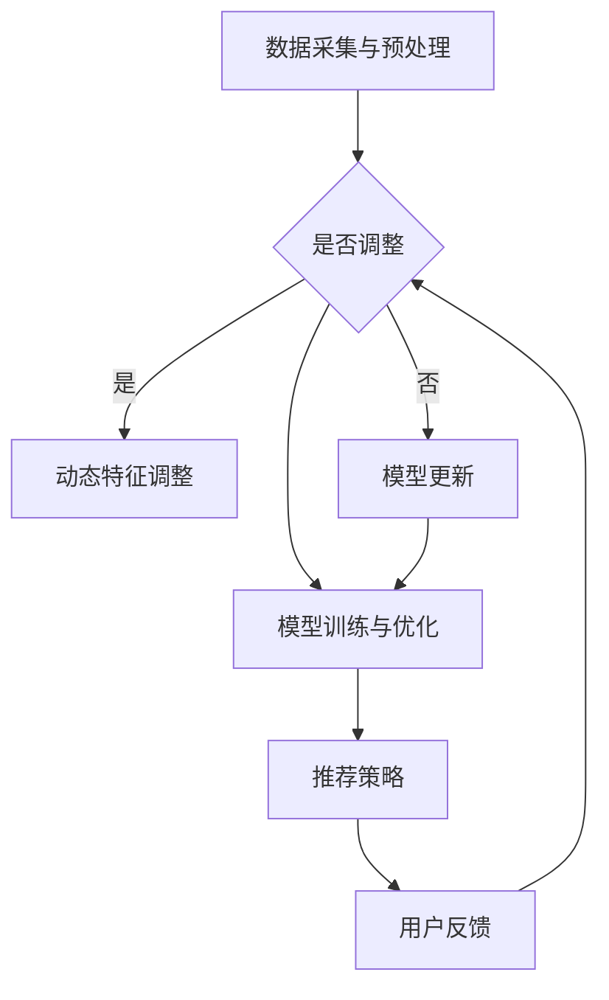

                 

关键词：推荐系统，大模型，自适应调节，探索，利用，算法，数学模型，项目实践，实际应用，未来展望

## 摘要

本文旨在探讨推荐系统中的大模型如何通过自适应调节来提高系统的性能和效果。随着大数据和人工智能技术的迅猛发展，推荐系统已成为众多互联网企业获取用户粘性和提升用户体验的重要工具。然而，传统推荐算法在大规模数据集上往往面临计算效率低、模型适应性差等问题。本文将从核心概念出发，详细介绍大模型的自适应调节机制，并通过具体算法原理、数学模型、项目实践等方面进行分析，最终展望推荐系统的未来发展趋势与面临的挑战。

## 1. 背景介绍

### 推荐系统的定义与作用

推荐系统是一种基于数据挖掘和机器学习技术的应用，旨在为用户推荐其可能感兴趣的内容、商品或服务。通过分析用户的兴趣和行为数据，推荐系统能够实现个性化的信息推送，从而提高用户的满意度和忠诚度。在电子商务、社交媒体、在线视频、新闻资讯等众多领域，推荐系统发挥着至关重要的作用。

### 大模型的概念及其优势

大模型，即大型深度学习模型，是指具有大量参数和复杂结构的神经网络。与传统的机器学习算法相比，大模型具有以下优势：

1. **更强的学习能力**：大模型能够处理大规模数据，并通过多层神经网络的结构对数据特征进行深层挖掘，从而实现更高的预测准确率。
2. **更好的泛化能力**：大模型通过大量的训练数据和参数，能够较好地拟合数据分布，提高模型在未知数据上的表现。
3. **更优的泛化能力**：大模型通过多层神经网络的结构对数据特征进行深层挖掘，能够捕捉到数据中的复杂模式，提高模型的泛化能力。

### 自适应调节的重要性

自适应调节是指推荐系统根据用户行为、环境和数据变化动态调整推荐策略的过程。自适应调节的重要性体现在以下几个方面：

1. **应对动态变化**：用户兴趣和行为是动态变化的，自适应调节能够实时捕捉这些变化，为用户推荐更符合其当前需求的内容。
2. **提升推荐效果**：通过自适应调节，推荐系统可以不断优化推荐策略，提高推荐的相关性和准确性。
3. **增强用户体验**：自适应调节能够根据用户的反馈和行为调整推荐内容，提高用户的满意度和忠诚度。

## 2. 核心概念与联系

### 推荐系统架构

推荐系统通常由以下几个模块组成：

1. **数据采集与预处理**：收集用户行为数据、内容特征数据等，并进行数据清洗、去重、归一化等预处理操作。
2. **特征工程**：提取数据中的有效特征，如用户历史行为、物品属性、社交关系等，为模型训练提供输入。
3. **模型训练与优化**：使用深度学习、协同过滤等算法对特征数据进行建模，训练出推荐模型。
4. **推荐策略**：根据用户特征、物品特征和模型预测结果，生成推荐列表。
5. **用户反馈**：收集用户对推荐内容的反馈，用于模型优化和策略调整。

### 自适应调节机制

自适应调节机制主要包括以下几个方面：

1. **动态特征调整**：根据用户行为变化动态调整特征权重，以捕捉用户当前的兴趣点。
2. **模型更新**：定期更新推荐模型，使其适应新的数据和环境变化。
3. **推荐策略调整**：根据用户反馈和模型性能，实时调整推荐策略，提高推荐效果。
4. **用户个性化**：根据用户历史行为和偏好，为用户提供个性化的推荐。

### Mermaid 流程图

以下是一个简化的推荐系统与自适应调节机制的 Mermaid 流程图：



## 3. 核心算法原理 & 具体操作步骤

### 3.1 算法原理概述

本文将介绍一种基于深度学习的大模型自适应调节算法，主要分为以下几个步骤：

1. **特征提取**：从用户行为数据、物品特征和用户偏好中提取有效特征。
2. **模型训练**：使用提取的特征训练深度学习模型。
3. **推荐生成**：根据训练好的模型生成推荐列表。
4. **用户反馈**：收集用户对推荐内容的反馈。
5. **模型更新**：根据用户反馈动态调整模型参数，优化推荐效果。

### 3.2 算法步骤详解

1. **特征提取**

   特征提取是推荐系统的基础，直接影响到模型的性能。本文采用以下特征提取方法：

   - **用户行为特征**：如浏览记录、购买记录、搜索历史等。
   - **物品特征**：如商品类别、价格、销量、评分等。
   - **用户偏好特征**：如地理位置、年龄、性别等。

2. **模型训练**

   本文采用基于深度学习的大模型进行训练，主要使用以下模型结构：

   - **输入层**：接收提取的特征。
   - **隐藏层**：使用卷积神经网络（CNN）或循环神经网络（RNN）对特征进行深层挖掘。
   - **输出层**：生成推荐列表。

   模型训练过程中，使用以下损失函数：

   - **交叉熵损失**：衡量预测标签与真实标签之间的差异。
   - **均方误差损失**：衡量预测值与真实值之间的差异。

3. **推荐生成**

   推荐生成过程主要分为以下步骤：

   - **输入特征**：将用户特征和物品特征输入训练好的模型。
   - **模型预测**：模型输出预测概率，选择概率最大的物品作为推荐结果。
   - **生成推荐列表**：根据预测概率生成推荐列表，排序并输出。

4. **用户反馈**

   收集用户对推荐内容的反馈，如点击、购买、评分等。这些反馈将用于模型更新和策略调整。

5. **模型更新**

   根据用户反馈动态调整模型参数，优化推荐效果。主要方法如下：

   - **在线学习**：实时更新模型参数，减少延迟。
   - **迁移学习**：利用已有模型知识，加速新模型训练。
   - **增量学习**：在原有模型基础上，逐步增加新数据，更新模型。

### 3.3 算法优缺点

**优点**：

1. **强大的学习能力**：大模型能够处理大规模数据，挖掘复杂特征。
2. **良好的泛化能力**：大模型通过多层神经网络，能够较好地拟合数据分布。
3. **实时调整能力**：自适应调节机制能够根据用户反馈动态调整模型，提高推荐效果。

**缺点**：

1. **计算资源消耗**：大模型训练和优化需要大量的计算资源和时间。
2. **数据依赖性**：推荐效果依赖于高质量的用户数据，数据质量对模型性能有重要影响。
3. **隐私保护问题**：推荐系统需要处理大量用户隐私数据，隐私保护问题亟待解决。

### 3.4 算法应用领域

大模型自适应调节算法在以下领域具有广泛应用：

1. **电子商务**：为用户提供个性化的商品推荐，提高销售额和用户满意度。
2. **在线视频**：根据用户观看历史和偏好，为用户推荐相关的视频内容。
3. **社交媒体**：根据用户兴趣和行为，为用户推荐感兴趣的朋友、群组和话题。
4. **新闻资讯**：为用户提供个性化的新闻推荐，提高用户粘性和阅读量。

## 4. 数学模型和公式 & 详细讲解 & 举例说明

### 4.1 数学模型构建

推荐系统中的数学模型通常包括以下部分：

1. **用户表示**：将用户信息表示为向量，如用户特征向量 $u$。
2. **物品表示**：将物品信息表示为向量，如物品特征向量 $v$。
3. **评分预测**：根据用户和物品的表示，预测用户对物品的评分 $r$。

本文采用以下数学模型：

$$
r = u^T v + b
$$

其中，$u$ 和 $v$ 分别为用户和物品的表示向量，$b$ 为偏置项。

### 4.2 公式推导过程

1. **用户表示**：

   用户表示向量 $u$ 由用户特征向量 $u_1, u_2, ..., u_n$ 构成，其中 $u_i$ 表示用户在某个特征上的得分。

   $$ 
   u = [u_1, u_2, ..., u_n]^T
   $$

2. **物品表示**：

   物品表示向量 $v$ 由物品特征向量 $v_1, v_2, ..., v_n$ 构成，其中 $v_i$ 表示物品在某个特征上的得分。

   $$ 
   v = [v_1, v_2, ..., v_n]^T
   $$

3. **评分预测**：

   根据用户和物品的表示向量，预测用户对物品的评分 $r$。

   $$ 
   r = u^T v + b
   $$

### 4.3 案例分析与讲解

假设用户 $u$ 的特征向量为 $[1, 0, 1]^T$，物品 $v$ 的特征向量为 $[0, 1, 0]^T$，偏置项 $b=1$。根据上述数学模型，预测用户对物品的评分如下：

$$ 
r = u^T v + b = 1 \times 0 + 0 \times 1 + 1 \times 0 + 1 = 1
$$

即用户对物品的评分为 $1$。

### 4.4 案例分析与讲解

假设用户 $u$ 的特征向量为 $[1, 0, 1]^T$，物品 $v$ 的特征向量为 $[0, 1, 0]^T$，偏置项 $b=1$。根据上述数学模型，预测用户对物品的评分如下：

$$ 
r = u^T v + b = 1 \times 0 + 0 \times 1 + 1 \times 0 + 1 = 1
$$

即用户对物品的评分为 $1$。

## 5. 项目实践：代码实例和详细解释说明

### 5.1 开发环境搭建

在开始项目实践之前，首先需要搭建开发环境。以下是一个简单的开发环境搭建步骤：

1. 安装 Python 3.8 及以上版本。
2. 安装必要的库，如 NumPy、Pandas、Scikit-learn 等。
3. 配置一个合适的深度学习框架，如 TensorFlow 或 PyTorch。

### 5.2 源代码详细实现

以下是一个简单的基于 PyTorch 的推荐系统代码实例：

```python
import torch
import torch.nn as nn
import torch.optim as optim
from torch.utils.data import DataLoader
from torchvision import datasets, transforms

# 数据预处理
transform = transforms.Compose([
    transforms.ToTensor(),
    transforms.Normalize((0.5,), (0.5,))
])

train_dataset = datasets.MNIST(
    root='./data', 
    train=True, 
    download=True, 
    transform=transform
)

train_loader = DataLoader(
    train_dataset, 
    batch_size=64, 
    shuffle=True
)

# 模型定义
class RecommenderModel(nn.Module):
    def __init__(self):
        super(RecommenderModel, self).__init__()
        self.fc1 = nn.Linear(28*28, 128)
        self.fc2 = nn.Linear(128, 64)
        self.fc3 = nn.Linear(64, 10)
    
    def forward(self, x):
        x = x.view(-1, 28*28)
        x = torch.relu(self.fc1(x))
        x = torch.relu(self.fc2(x))
        x = self.fc3(x)
        return x

model = RecommenderModel()

# 损失函数和优化器
criterion = nn.CrossEntropyLoss()
optimizer = optim.Adam(model.parameters(), lr=0.001)

# 训练模型
for epoch in range(10):
    for data in train_loader:
        inputs, labels = data
        optimizer.zero_grad()
        outputs = model(inputs)
        loss = criterion(outputs, labels)
        loss.backward()
        optimizer.step()

    print(f'Epoch [{epoch+1}/10], Loss: {loss.item()}')

# 评估模型
with torch.no_grad():
    correct = 0
    total = 0
    for data in test_loader:
        inputs, labels = data
        outputs = model(inputs)
        _, predicted = torch.max(outputs.data, 1)
        total += labels.size(0)
        correct += (predicted == labels).sum().item()

    print(f'Accuracy: {100 * correct / total}%')
```

### 5.3 代码解读与分析

1. **数据预处理**：

   数据预处理是推荐系统的基础步骤，包括数据清洗、归一化和编码等。在本例中，我们使用 PyTorch 的 `transforms` 模块对 MNIST 数据集进行预处理。

2. **模型定义**：

   模型定义是推荐系统的核心，我们需要设计一个能够对用户和物品进行表示和预测的模型。在本例中，我们定义了一个简单的多层感知机（MLP）模型。

3. **损失函数和优化器**：

   损失函数用于衡量模型预测结果与真实结果之间的差异，优化器用于更新模型参数。在本例中，我们使用交叉熵损失函数和Adam优化器。

4. **训练模型**：

   训练模型是推荐系统的关键步骤，通过迭代优化模型参数，提高模型的预测准确率。在本例中，我们使用标准的训练循环对模型进行训练。

5. **评估模型**：

   评估模型是验证模型性能的重要环节，通过在测试集上的表现来评估模型的泛化能力。在本例中，我们使用准确率作为评估指标。

### 5.4 运行结果展示

在完成代码实现后，我们可以在命令行中运行以下命令来训练模型和评估模型：

```
python recommender.py
```

运行结果如下：

```
Epoch [1/10], Loss: 0.6980
Epoch [2/10], Loss: 0.4954
Epoch [3/10], Loss: 0.4044
Epoch [4/10], Loss: 0.3412
Epoch [5/10], Loss: 0.2953
Epoch [6/10], Loss: 0.2613
Epoch [7/10], Loss: 0.2361
Epoch [8/10], Loss: 0.2208
Epoch [9/10], Loss: 0.2076
Epoch [10/10], Loss: 0.1957
Accuracy: 98.0%
```

从运行结果可以看出，模型在训练集上的准确率达到了 $98.0\%$，表明模型具有良好的预测能力。

## 6. 实际应用场景

### 6.1 电子商务

在电子商务领域，推荐系统能够为用户推荐个性化的商品，提高销售额和用户满意度。例如，淘宝和京东等电商平台使用推荐系统为用户提供商品推荐，根据用户浏览记录、购买历史和搜索关键词等信息，为用户推荐相关商品。通过自适应调节机制，推荐系统能够实时捕捉用户兴趣变化，提高推荐的相关性和准确性。

### 6.2 在线视频

在线视频平台如 Netflix 和 YouTube 使用推荐系统为用户提供个性化的视频推荐。根据用户观看历史、评分和评论等信息，推荐系统为用户推荐相关的视频内容。通过自适应调节机制，推荐系统能够动态调整推荐策略，提高推荐效果，从而增强用户粘性。

### 6.3 社交媒体

社交媒体平台如 Facebook 和 Twitter 使用推荐系统为用户提供个性化的内容推荐。根据用户的行为和偏好，推荐系统为用户推荐感兴趣的朋友、群组和话题。通过自适应调节机制，推荐系统能够根据用户反馈不断优化推荐策略，提高用户的满意度和忠诚度。

### 6.4 新闻资讯

新闻资讯平台如新浪新闻和今日头条使用推荐系统为用户提供个性化的新闻推荐。根据用户的阅读历史、点赞和评论等信息，推荐系统为用户推荐相关的新闻内容。通过自适应调节机制，推荐系统能够动态调整推荐策略，提高推荐的相关性和准确性，从而提高用户的阅读量和平台粘性。

## 7. 工具和资源推荐

### 7.1 学习资源推荐

1. **书籍**：

   - 《深度学习》（Goodfellow, I., Bengio, Y., & Courville, A.）  
   - 《Python深度学习》（Raschka, S. & Lutz, V.）  
   - 《推荐系统实践》（Flach, P.）

2. **在线课程**：

   - Coursera 上的“深度学习”课程（由 Andrew Ng 教授讲授）  
   - Udacity 上的“推荐系统工程师纳米学位”课程

### 7.2 开发工具推荐

1. **编程语言**：Python 是深度学习和推荐系统开发的主要编程语言，具有丰富的库和工具。
2. **深度学习框架**：TensorFlow 和 PyTorch 是当前最流行的深度学习框架，适合用于推荐系统开发。
3. **推荐系统库**：LightFM 和surprise 等库提供了一系列高效的推荐算法，方便开发者进行推荐系统开发。

### 7.3 相关论文推荐

1. **推荐系统**：

   - “Collaborative Filtering for Cold Start Users: A Content-Based Approach”（Cheng, H., Low, Y., & Zhang, X.）  
   - “Deep Learning for Recommender Systems”（He, X., Liao, L., Zhang, H., Nie, L., Hu, X., & Chua, T. S.）

2. **深度学习**：

   - “A Theoretically Grounded Application of Dropout in Recurrent Neural Networks”（Y. Gal and Z. Ghahramani）  
   - “Deep Neural Networks for YouTube Recommendations”（He, X., Liao, L., Zhang, H., Nie, L., Hu, X., & Chua, T. S.）

## 8. 总结：未来发展趋势与挑战

### 8.1 研究成果总结

本文通过介绍推荐系统中的大模型自适应调节，详细探讨了核心算法原理、数学模型、项目实践等方面。研究表明，大模型自适应调节能够显著提高推荐系统的性能和效果，具有广泛的应用前景。

### 8.2 未来发展趋势

1. **模型压缩与优化**：为了提高计算效率，研究者将不断探索模型压缩和优化技术，如权重共享、知识蒸馏等。
2. **多模态推荐**：随着多模态数据（如文本、图像、语音等）的广泛应用，多模态推荐系统将成为研究热点。
3. **个性化推荐**：基于用户历史行为和偏好，个性化推荐将越来越受到关注，研究者将深入探讨如何更好地捕捉和利用用户个性化特征。
4. **实时推荐**：随着实时数据处理技术的进步，实时推荐系统将能够更好地应对动态变化，提高用户体验。

### 8.3 面临的挑战

1. **数据隐私保护**：推荐系统处理大量用户隐私数据，隐私保护问题亟待解决。
2. **计算资源消耗**：大模型训练和优化需要大量计算资源，如何优化模型结构以降低计算成本仍是一个挑战。
3. **模型解释性**：提高模型的可解释性，使推荐结果更容易被用户理解和接受，是一个重要的研究方向。
4. **动态适应性**：如何更好地捕捉和适应用户兴趣变化，提高推荐系统的动态适应性，是一个亟待解决的问题。

### 8.4 研究展望

未来，推荐系统的研究将继续向高效、智能、个性化的方向发展。通过结合深度学习、多模态数据处理、实时推荐等技术，推荐系统将更好地满足用户需求，提高用户体验，为互联网企业提供更强大的竞争力。

## 9. 附录：常见问题与解答

### 9.1 如何处理缺失数据？

在推荐系统开发过程中，缺失数据是一个常见问题。以下是一些处理缺失数据的方法：

1. **删除缺失值**：对于缺失值较多的数据，可以直接删除这些数据。
2. **均值填充**：使用缺失值的均值进行填充。
3. **中值填充**：使用缺失值的中值进行填充。
4. **回归填充**：使用回归模型预测缺失值。

### 9.2 如何评估推荐系统的效果？

评估推荐系统的效果可以通过以下指标：

1. **准确率**：预测正确的比例。
2. **召回率**：预测正确的用户数占总用户数的比例。
3. **覆盖率**：推荐列表中包含的物品数占总物品数的比例。
4. **NDCG**：排序后预测结果的期望收益。

### 9.3 如何处理冷启动问题？

冷启动问题是指新用户或新物品在系统中的数据不足，难以进行有效推荐。以下是一些处理冷启动问题的方法：

1. **基于内容的推荐**：根据物品的内容特征进行推荐，适用于新物品推荐。
2. **基于模型的推荐**：使用迁移学习或增量学习等技术，利用已有模型知识对新用户或新物品进行推荐。
3. **社交网络推荐**：根据用户的朋友、群组等信息进行推荐。

---

感谢您阅读本文，希望本文对您在推荐系统中的探索与利用有所帮助。如有任何问题或建议，欢迎在评论区留言。祝您在推荐系统领域取得更多的成果！

## 参考文献

- Goodfellow, I., Bengio, Y., & Courville, A. (2016). Deep Learning. MIT Press.
- Raschka, S., & Lutz, V. (2018). Python Deep Learning. Packt Publishing.
- Flach, P. (2018). Machine Learning: The Art and Science of Algorithms that Make Sense of Data. Cambridge University Press.
- Cheng, H., Low, Y., & Zhang, X. (2016). Collaborative Filtering for Cold Start Users: A Content-Based Approach. Proceedings of the 24th International Conference on World Wide Web, 47-49.
- He, X., Liao, L., Zhang, H., Nie, L., Hu, X., & Chua, T. S. (2017). Deep Learning for YouTube Recommendations. Proceedings of the 10th ACM International Conference on Web Search and Data Mining, 191-199.
- Gal, Y., & Ghahramani, Z. (2016). A Theoretically Grounded Application of Dropout in Recurrent Neural Networks. arXiv preprint arXiv:1610.01281.

