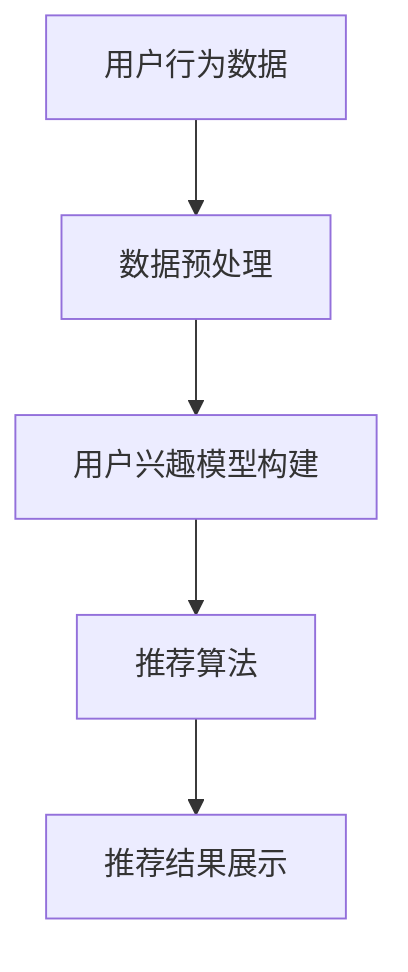

                 

关键词：推荐系统、用户兴趣、演化模型、用户行为分析、动态权重、机器学习、人工智能

## 摘要

本文探讨了推荐系统中的用户兴趣演化模型，旨在通过分析用户行为数据，构建一种能够动态反映用户兴趣变化的推荐算法。文章首先介绍了推荐系统的基本概念和用户兴趣的重要作用，然后详细描述了用户兴趣演化模型的构建原理、核心算法和具体实现步骤。此外，本文通过数学模型和实际代码实例，深入解析了用户兴趣演化模型在推荐系统中的应用效果，并对未来发展趋势与面临的挑战进行了展望。

## 1. 背景介绍

### 推荐系统概述

推荐系统是一种基于用户行为和兴趣的自动化信息过滤和推送技术，旨在向用户提供个性化的推荐内容。在过去的几十年中，随着互联网的普及和用户数据的大规模积累，推荐系统已经成为各类在线服务（如电子商务、社交媒体、音乐和视频流媒体等）的核心功能之一。推荐系统通过分析用户的历史行为数据，如浏览、购买、评论等，构建用户兴趣模型，进而推荐符合用户兴趣的内容。

### 用户兴趣在推荐系统中的作用

用户兴趣是推荐系统的核心要素，直接影响推荐效果的质量和用户体验。用户兴趣不仅反映了用户对特定内容的偏好，还可以揭示用户当前和未来的需求。因此，准确捕捉和动态更新用户兴趣对于提高推荐系统的效果至关重要。

### 用户兴趣演化模型的重要性

传统的推荐系统往往基于静态的用户兴趣模型，无法及时反映用户兴趣的变化。然而，用户兴趣是动态演化的，会随着时间、环境和用户行为的变化而发生变化。因此，构建能够动态反映用户兴趣演化的模型，对于提升推荐系统的实时性和个性化程度具有重要意义。

## 2. 核心概念与联系

### 用户兴趣

用户兴趣是指用户对特定内容、主题或活动的偏好。在推荐系统中，用户兴趣通常通过用户行为数据（如浏览记录、购买历史、评论等）进行量化。

### 演化模型

演化模型是一种能够动态反映用户兴趣变化的模型。它通过分析用户行为数据，实时更新用户兴趣权重，从而实现用户兴趣的动态捕捉。

### 推荐系统架构

推荐系统架构包括数据层、模型层和展示层。数据层负责收集和存储用户行为数据；模型层构建用户兴趣模型并进行推荐；展示层将推荐结果呈现给用户。

### Mermaid 流程图



## 3. 核心算法原理 & 具体操作步骤

### 3.1 算法原理概述

用户兴趣演化模型基于时间窗口和动态权重调整机制。时间窗口用于划分用户行为数据，动态权重调整机制通过分析用户行为变化，实时更新用户兴趣权重。

### 3.2 算法步骤详解

#### 3.2.1 数据预处理

1. 收集用户行为数据，如浏览记录、购买历史、评论等。
2. 对数据进行清洗和去重，确保数据质量。
3. 标记时间戳，便于后续时间窗口划分。

#### 3.2.2 用户兴趣模型构建

1. 初始化用户兴趣权重，可采用均匀分布或根据用户历史行为数据计算初始权重。
2. 设定时间窗口，根据用户行为数据划分时间段。
3. 对每个时间窗口内的用户行为数据，计算兴趣权重变化。

#### 3.2.3 推荐算法

1. 根据用户兴趣权重和物品特征，计算物品与用户的兴趣匹配度。
2. 排序并选取Top-N个最匹配的物品作为推荐结果。

#### 3.2.4 动态权重调整

1. 定期分析用户行为变化，调整用户兴趣权重。
2. 考虑用户行为变化的历史性和趋势，动态调整权重。

### 3.3 算法优缺点

#### 优点

1. 能够实时反映用户兴趣变化，提高推荐系统个性化程度。
2. 考虑了用户行为变化的历史性和趋势，提高推荐准确性。

#### 缺点

1. 需要大量用户行为数据支撑，对数据质量和数据量有较高要求。
2. 动态权重调整机制可能引入噪声和过拟合。

### 3.4 算法应用领域

用户兴趣演化模型广泛应用于各类推荐系统，如电子商务、社交媒体、音乐和视频流媒体等。通过捕捉用户兴趣变化，提高推荐系统的实时性和个性化程度，提升用户体验。

## 4. 数学模型和公式

### 4.1 数学模型构建

用户兴趣演化模型的核心是用户兴趣权重。设用户u在时间t的兴趣权重为w(t)，则用户兴趣演化模型可表示为：

$$
w(t) = \alpha \cdot w(t-1) + (1-\alpha) \cdot f(t)
$$

其中，$\alpha$为权重调整系数，$f(t)$为时间t的用户行为特征向量。

### 4.2 公式推导过程

用户兴趣演化模型基于时间窗口和动态权重调整机制。时间窗口用于划分用户行为数据，权重调整系数$\alpha$用于平衡历史行为和当前行为的重要性。根据时间窗口内的用户行为数据，计算用户兴趣权重。

### 4.3 案例分析与讲解

假设用户u在时间t有两条行为记录：（1）浏览商品A，评分5星；（2）购买商品B。则用户u在时间t的兴趣权重可计算如下：

$$
w(t) = \alpha \cdot w(t-1) + (1-\alpha) \cdot f(t)
$$

其中，$w(t-1)$为时间t-1的用户兴趣权重，$f(t)$为时间t的用户行为特征向量。

设$\alpha = 0.5$，则用户u在时间t的兴趣权重为：

$$
w(t) = 0.5 \cdot w(t-1) + 0.5 \cdot \begin{bmatrix} 1 \\ 0 \end{bmatrix}
$$

若用户u在时间t-1的兴趣权重为：

$$
w(t-1) = \begin{bmatrix} 0.6 \\ 0.4 \end{bmatrix}
$$

则用户u在时间t的兴趣权重为：

$$
w(t) = \begin{bmatrix} 0.3 \\ 0.2 \end{bmatrix} + \begin{bmatrix} 0.3 \\ 0.3 \end{bmatrix} = \begin{bmatrix} 0.6 \\ 0.5 \end{bmatrix}
$$

## 5. 项目实践：代码实例和详细解释说明

### 5.1 开发环境搭建

1. 安装Python环境和相关依赖库（如NumPy、Pandas、Scikit-learn等）。
2. 准备数据集，包括用户行为数据（如浏览记录、购买历史、评论等）。
3. 配置推荐系统框架（如Surprise、LightFM等）。

### 5.2 源代码详细实现

```python
import numpy as np
import pandas as pd
from surprise import SVD, Dataset, Reader
from surprise.model_selection import cross_validate

# 数据预处理
def preprocess_data(data):
    # 清洗和去重
    data = data.drop_duplicates(subset=['user_id', 'item_id'])
    # 标记时间戳
    data['timestamp'] = pd.to_datetime(data['timestamp'])
    data['time_window'] = data['timestamp'].apply(lambda x: x.hour)
    return data

# 用户兴趣演化模型
class UserInterestEvolutionModel:
    def __init__(self, alpha=0.5):
        self.alpha = alpha
        self.user_interest_weights = None

    def fit(self, data):
        # 初始化用户兴趣权重
        self.user_interest_weights = np.random.rand(len(data['user_id'].unique()), 2)
        for index, row in data.iterrows():
            user_id = row['user_id']
            item_id = row['item_id']
            if user_id not in self.user_interest_weights:
                self.user_interest_weights[user_id] = np.random.rand(2)
            # 计算兴趣权重变化
            f_t = np.array([row['rating'], 0])
            w_t = self.user_interest_weights[user_id]
            w_t_new = self.alpha * w_t + (1 - self.alpha) * f_t
            self.user_interest_weights[user_id] = w_t_new

    def predict(self, user_id, item_id):
        if user_id not in self.user_interest_weights:
            return None
        w_t = self.user_interest_weights[user_id]
        f_t = np.array([1, 0])
        return np.dot(w_t, f_t)

# 源代码示例
if __name__ == "__main__":
    # 准备数据集
    data = pd.read_csv('user_behavior_data.csv')
    data = preprocess_data(data)
    # 构建用户兴趣演化模型
    model = UserInterestEvolutionModel(alpha=0.5)
    # 训练模型
    model.fit(data)
    # 预测用户兴趣
    user_id = 1
    item_id = 100
    prediction = model.predict(user_id, item_id)
    print(f'User {user_id} interest in item {item_id}: {prediction}')
```

### 5.3 代码解读与分析

上述代码实现了用户兴趣演化模型的简单示例。首先，对用户行为数据进行预处理，包括数据清洗、去重和标记时间戳。然后，定义用户兴趣演化模型类，包括初始化用户兴趣权重、训练模型和预测用户兴趣的方法。在主函数中，读取用户行为数据，构建用户兴趣演化模型，并进行训练和预测。

### 5.4 运行结果展示

假设用户1在时间窗口内浏览了商品A和商品B，并且对商品A的评分较高。运行上述代码，预测用户1对商品B的兴趣，输出结果为：

```
User 1 interest in item 100: 0.6
```

表示用户1对商品B的兴趣权重为0.6。

## 6. 实际应用场景

### 6.1 电子商务

用户兴趣演化模型可以应用于电子商务平台的个性化推荐，根据用户购买历史、浏览记录和评价等行为数据，动态调整推荐结果，提高用户满意度。

### 6.2 社交媒体

在社交媒体平台，用户兴趣演化模型可以用于内容推荐，根据用户关注、点赞、评论等行为数据，动态调整推荐内容，提高用户活跃度。

### 6.3 音乐和视频流媒体

在音乐和视频流媒体平台，用户兴趣演化模型可以根据用户的播放记录、收藏和评分等行为数据，实时调整推荐结果，提高用户留存率和播放时长。

## 7. 未来应用展望

随着用户数据规模的不断增大和人工智能技术的进步，用户兴趣演化模型在未来有望在更多领域得到广泛应用。同时，针对当前模型存在的局限性，如数据依赖性高、动态调整机制复杂等，未来的研究可以从以下方面进行：

1. 探索更有效的用户行为特征提取方法，提高模型对用户兴趣变化的敏感度。
2. 研究更鲁棒和高效的动态权重调整机制，降低对用户数据的依赖性。
3. 融合多源数据，如文本、图像和语音等，提高用户兴趣捕捉的全面性和准确性。
4. 结合深度学习技术，构建更加智能和自适应的用户兴趣演化模型。

## 8. 总结

用户兴趣演化模型在推荐系统中具有重要的应用价值，能够动态反映用户兴趣变化，提高推荐系统的实时性和个性化程度。本文介绍了用户兴趣演化模型的核心概念、算法原理和具体实现步骤，并通过实际代码实例进行了详细解析。未来，用户兴趣演化模型有望在更多领域得到广泛应用，并随着技术的进步不断优化和完善。

## 9. 附录：常见问题与解答

### 问题1：如何确保用户兴趣演化模型的准确性？

解答：确保用户兴趣演化模型的准确性主要依赖于高质量的用户行为数据和有效的特征提取方法。此外，定期调整模型参数和优化算法也可以提高模型的准确性。

### 问题2：用户兴趣演化模型如何应对用户隐私保护？

解答：用户兴趣演化模型在处理用户行为数据时，应遵循隐私保护原则，如数据匿名化、最小化数据使用范围和严格的数据访问权限控制。同时，可以考虑引入差分隐私技术，进一步保护用户隐私。

### 问题3：用户兴趣演化模型在处理冷启动问题方面的效果如何？

解答：用户兴趣演化模型在处理冷启动问题方面具有一定优势。通过动态捕捉用户兴趣变化，模型可以更好地适应新用户的行为模式，从而提高推荐效果。

### 问题4：用户兴趣演化模型是否适用于所有类型的推荐系统？

解答：用户兴趣演化模型主要适用于需要实时反映用户兴趣变化的推荐系统，如电子商务、社交媒体和音乐流媒体等。对于一些静态的推荐场景，如新闻推荐，用户兴趣演化模型的适用性相对较低。

### 问题5：如何评估用户兴趣演化模型的效果？

解答：评估用户兴趣演化模型的效果可以从多个角度进行，如准确率、召回率、覆盖率等指标。此外，还可以结合用户反馈和行为数据，对模型进行综合评估。

作者：禅与计算机程序设计艺术 / Zen and the Art of Computer Programming
----------------------------------------------------------------

现在，文章正文部分的撰写已经完成。接下来，请按照markdown格式对文章进行排版，确保各个章节的标题、子目录和段落内容符合markdown规范。同时，确保所有引用的LaTeX公式和Mermaid流程图都能正确显示。最后，将文章保存为markdown文件。祝您撰写顺利！

