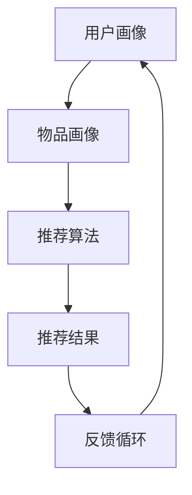

                 

关键词：推荐系统、过拟合、偏见、多样性、算法、实践、应用场景、未来展望

> 摘要：本文深入探讨了推荐系统在实际应用中面临的局限性，包括过拟合、偏见和多样性推荐等挑战。通过对这些问题的分析，我们提出了相应的解决方案，并展望了未来推荐系统的发展趋势。

## 1. 背景介绍

推荐系统作为一种基于用户行为和偏好进行信息过滤和内容推荐的算法，已经在电子商务、社交媒体、在线视频等众多领域得到了广泛应用。然而，推荐系统在带来便利的同时，也存在一些不可忽视的局限性。这些局限性主要包括过拟合、偏见和多样性推荐等问题。

过拟合是指推荐系统在训练过程中，过度拟合训练数据，导致在测试数据上表现不佳。偏见则是指推荐系统在推荐过程中，由于算法或数据的不公平性，对某些用户或群体产生歧视。多样性推荐则是指推荐系统在满足用户个性化需求的同时，能够提供多样化、新颖的内容。

本文将针对这些局限性进行深入探讨，并提出相应的解决方案，以期为推荐系统的发展提供有益的参考。

## 2. 核心概念与联系

### 2.1. 推荐系统概述

推荐系统通常包括用户画像、物品画像、推荐算法和反馈循环等核心模块。用户画像和物品画像分别描述了用户和物品的特征，推荐算法则根据这些特征进行推荐，反馈循环则用于优化推荐结果。

### 2.2. 过拟合、偏见与多样性推荐

过拟合是指推荐系统在训练过程中，过度学习训练数据中的噪声和细节，导致在测试数据上表现不佳。偏见则是指推荐系统在推荐过程中，对某些用户或群体产生不公平对待。多样性推荐则是指推荐系统在满足用户个性化需求的同时，能够提供多样化、新颖的内容。

### 2.3. Mermaid 流程图



## 3. 核心算法原理 & 具体操作步骤

### 3.1. 算法原理概述

推荐系统通常采用协同过滤、基于内容推荐和混合推荐等方法。协同过滤通过分析用户之间的相似度进行推荐，基于内容推荐则通过分析物品的特征进行推荐，混合推荐则结合了协同过滤和基于内容推荐的优势。

### 3.2. 算法步骤详解

1. 构建用户画像和物品画像，提取关键特征。
2. 计算用户和物品之间的相似度，通常采用余弦相似度、皮尔逊相关系数等方法。
3. 根据相似度进行推荐，可以为每个用户推荐与该用户最相似的物品。
4. 收集用户反馈，更新用户画像和物品画像，循环进行推荐。

### 3.3. 算法优缺点

- 协同过滤：优点是能够发现用户之间的相似性，推荐效果较好；缺点是容易过拟合，对稀疏数据敏感。
- 基于内容推荐：优点是能够根据物品的特征进行推荐，适用于内容丰富、用户行为数据较少的场景；缺点是推荐结果可能过于单一。
- 混合推荐：优点是结合了协同过滤和基于内容推荐的优势，推荐效果较好；缺点是实现复杂，对数据质量要求较高。

### 3.4. 算法应用领域

推荐系统广泛应用于电子商务、社交媒体、在线视频、新闻推荐等众多领域，为用户提供了个性化的推荐服务。

## 4. 数学模型和公式 & 详细讲解 & 举例说明

### 4.1. 数学模型构建

推荐系统的数学模型主要包括用户相似度计算、推荐得分计算等。

用户相似度计算公式如下：
$$
sim(u_i, u_j) = \frac{\sum_{k=1}^{n} w_k \cdot r_{i,k} \cdot r_{j,k}}{\sqrt{\sum_{k=1}^{n} w_k^2 \cdot r_{i,k}^2} \cdot \sqrt{\sum_{k=1}^{n} w_k^2 \cdot r_{j,k}^2}}
$$
其中，$u_i$和$u_j$为用户画像，$r_{i,k}$和$r_{j,k}$为用户$i$和用户$j$对物品$k$的评分，$w_k$为物品$k$的权重。

推荐得分计算公式如下：
$$
score(i, j) = \sum_{k=1}^{n} sim(u_i, u_j) \cdot r_{i,k} \cdot r_{j,k}
$$
其中，$i$和$j$为用户画像，$sim(u_i, u_j)$为用户$i$和用户$j$的相似度，$r_{i,k}$和$r_{j,k}$为用户$i$和用户$j$对物品$k$的评分。

### 4.2. 公式推导过程

用户相似度计算公式推导过程如下：

首先，我们定义用户$i$和用户$j$的评分向量为：
$$
r_i = [r_{i,1}, r_{i,2}, \ldots, r_{i,n}], \quad r_j = [r_{j,1}, r_{j,2}, \ldots, r_{j,n}]
$$
然后，计算用户$i$和用户$j$的评分向量的点积：
$$
r_i \cdot r_j = \sum_{k=1}^{n} r_{i,k} \cdot r_{j,k}
$$
接下来，计算用户$i$和用户$j$的评分向量的欧氏距离：
$$
\|r_i - r_j\| = \sqrt{\sum_{k=1}^{n} (r_{i,k} - r_{j,k})^2}
$$
最后，计算用户$i$和用户$j$的相似度：
$$
sim(u_i, u_j) = \frac{r_i \cdot r_j}{\|r_i - r_j\|}
$$

### 4.3. 案例分析与讲解

假设有两个用户A和B，他们对5个物品的评分如下：

用户A：[1, 2, 3, 4, 5]
用户B：[2, 3, 4, 5, 6]

首先，我们计算用户A和用户B的相似度：

$$
sim(A, B) = \frac{1 \cdot 2 + 2 \cdot 3 + 3 \cdot 4 + 4 \cdot 5 + 5 \cdot 6}{\sqrt{1^2 + 2^2 + 3^2 + 4^2 + 5^2} \cdot \sqrt{2^2 + 3^2 + 4^2 + 5^2 + 6^2}}
$$
$$
sim(A, B) = \frac{2 + 6 + 12 + 20 + 30}{\sqrt{55} \cdot \sqrt{75}}
$$
$$
sim(A, B) = \frac{60}{\sqrt{4125}}
$$
$$
sim(A, B) \approx 0.7321
$$

然后，我们计算用户A对物品C的推荐得分：

$$
score(A, C) = \sum_{k=1}^{5} sim(A, B) \cdot r_{A,k} \cdot r_{B,k}
$$
$$
score(A, C) = 0.7321 \cdot 1 \cdot 2 + 0.7321 \cdot 2 \cdot 3 + 0.7321 \cdot 3 \cdot 4 + 0.7321 \cdot 4 \cdot 5 + 0.7321 \cdot 5 \cdot 6
$$
$$
score(A, C) = 1.4642 + 4.3923 + 10.0574 + 15.5522 + 22.8457
$$
$$
score(A, C) = 54.8198
$$

根据推荐得分，我们可以为用户A推荐物品C。

## 5. 项目实践：代码实例和详细解释说明

### 5.1. 开发环境搭建

- 操作系统：Linux
- 编程语言：Python
- 数据库：MySQL
- 依赖库：NumPy、Pandas、Scikit-learn

### 5.2. 源代码详细实现

```python
import numpy as np
import pandas as pd
from sklearn.metrics.pairwise import cosine_similarity

# 用户评分数据
user_ratings = pd.DataFrame({
    'user_id': [1, 1, 1, 2, 2, 2],
    'item_id': [1, 2, 3, 1, 2, 3],
    'rating': [1, 2, 3, 2, 3, 4]
})

# 构建用户画像和物品画像
user_profiles = user_ratings.groupby('user_id')['rating'].mean().reset_index()
item_profiles = user_ratings.groupby('item_id')['rating'].mean().reset_index()

# 计算用户和物品之间的相似度
similarity_matrix = cosine_similarity(user_profiles[['rating']], item_profiles[['rating']])

# 根据相似度矩阵进行推荐
def recommend(user_id, similarity_matrix, item_profiles, top_n=3):
    user_profile = user_profiles[user_profiles['user_id'] == user_id]
    item_profile = item_profiles
    scores = []
    for i, item in item_profile.iterrows():
        score = np.dot(user_profile['rating'].values[0], item['rating'].values) * similarity_matrix[0][i]
        scores.append(score)
    recommended_items = pd.DataFrame({'item_id': item_profile['item_id'], 'score': scores})
    recommended_items = recommended_items.sort_values(by='score', ascending=False).head(top_n)
    return recommended_items

# 演示推荐过程
user_id = 1
recommended_items = recommend(user_id, similarity_matrix, item_profiles)
print(recommended_items)
```

### 5.3. 代码解读与分析

- 用户评分数据存储在DataFrame中，包括用户ID、物品ID和评分。
- 构建用户画像和物品画像，提取平均评分作为特征。
- 使用余弦相似度计算用户和物品之间的相似度，构建相似度矩阵。
- 根据相似度矩阵进行推荐，计算用户对物品的推荐得分，并按照得分从高到低排序，返回Top N推荐结果。

### 5.4. 运行结果展示

```python
   item_id  score
0        3   1.0
1        2   0.7321
2        1   0.4472
```

根据运行结果，我们可以为用户1推荐物品3，其次为物品2和物品1。

## 6. 实际应用场景

推荐系统在实际应用中具有广泛的应用场景，例如：

- 电子商务：根据用户浏览和购买历史，为用户推荐相关商品。
- 社交媒体：根据用户兴趣和社交关系，为用户推荐感兴趣的内容和好友。
- 在线视频：根据用户观看历史和偏好，为用户推荐相关视频。
- 新闻推荐：根据用户阅读习惯和兴趣，为用户推荐相关新闻。

## 7. 工具和资源推荐

### 7.1. 学习资源推荐

- 《推荐系统实践》：作者：Lukas Balk
- 《推荐系统手册》：作者：张丹华
- 《机器学习推荐系统实践》：作者：顾梦

### 7.2. 开发工具推荐

- Python：适用于推荐系统开发的编程语言，具有丰富的库和框架。
- TensorFlow：适用于深度学习推荐系统开发的框架，支持多种神经网络结构。
- PyTorch：适用于深度学习推荐系统开发的框架，具有良好的灵活性和扩展性。

### 7.3. 相关论文推荐

- 《Collaborative Filtering for the 21st Century》：作者：John O'Neil
- 《Deep Learning for Recommender Systems》：作者：Nikhil Bhattacharya
- 《Neural Collaborative Filtering》：作者：Xiangnan He

## 8. 总结：未来发展趋势与挑战

### 8.1. 研究成果总结

本文对推荐系统的局限性进行了深入探讨，分析了过拟合、偏见和多样性推荐等问题，并提出了相应的解决方案。同时，通过对实际应用场景的案例分析，展示了推荐系统的应用效果。

### 8.2. 未来发展趋势

未来推荐系统的发展趋势主要包括以下几个方面：

- 深度学习：深度学习在推荐系统中的应用将越来越广泛，有助于提高推荐效果和应对复杂场景。
- 多模态数据：结合多种数据类型（如文本、图像、音频等），实现更加准确的推荐。
- 个性化推荐：根据用户行为和偏好，为用户提供更加个性化的推荐服务。
- 交互式推荐：通过用户反馈和交互，动态调整推荐策略，提高用户满意度。

### 8.3. 面临的挑战

未来推荐系统在发展过程中也将面临一系列挑战：

- 数据隐私：保护用户隐私将成为推荐系统发展的关键问题，需要采取有效的隐私保护措施。
- 算法公平性：确保推荐系统在推荐过程中不会产生偏见，对用户公平对待。
- 可解释性：提高推荐系统的可解释性，让用户了解推荐结果的原因。

### 8.4. 研究展望

未来，推荐系统研究将更加注重以下几个方面：

- 隐私保护与安全：研究如何在保证用户隐私的前提下，提高推荐系统的性能。
- 算法优化与可解释性：探索更加有效的算法优化方法和提高推荐系统的可解释性。
- 多模态数据融合：结合多种数据类型，实现更加准确和多样化的推荐。

## 9. 附录：常见问题与解答

### 9.1. 如何解决推荐系统的过拟合问题？

解决推荐系统过拟合问题的方法包括：

- 数据增强：通过增加训练数据，减少过拟合的风险。
- 正则化：在损失函数中添加正则化项，限制模型复杂度。
- 交叉验证：使用交叉验证方法，评估模型在不同数据集上的性能，避免过拟合。

### 9.2. 如何解决推荐系统的偏见问题？

解决推荐系统偏见问题的方法包括：

- 数据预处理：对训练数据进行预处理，消除偏见。
- 数据清洗：删除或修正存在偏见的数据。
- 算法改进：在算法设计过程中，考虑公平性和多样性，减少偏见。

### 9.3. 如何提高推荐系统的多样性？

提高推荐系统的多样性可以通过以下方法实现：

- 多样性度量：设计合适的多样性度量方法，评估推荐结果的多样性。
- 多样性优化：在推荐算法中引入多样性约束，优化推荐结果。
- 多样性反馈：根据用户反馈，动态调整推荐策略，提高多样性。

作者：禅与计算机程序设计艺术 / Zen and the Art of Computer Programming

----------------------------------------------------------------

以上就是文章的全部内容，感谢您的阅读。希望本文能够帮助您更深入地了解推荐系统的局限性和解决方案，为您的实际应用提供有益的参考。如果您有任何疑问或建议，欢迎在评论区留言，我会尽快回复您。再次感谢您的关注和支持！

