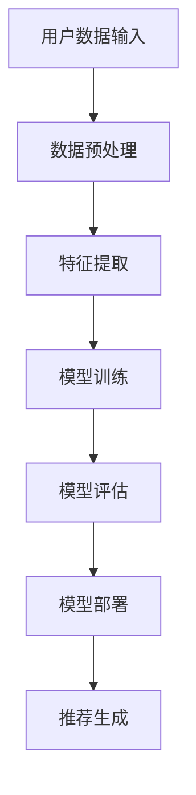

                 

关键词：推荐系统、统一框架、大模型、算法原理、数学模型、项目实践、应用场景、未来展望

> 摘要：本文深入探讨推荐系统领域的重要议题——统一框架优势，特别是在大模型时代下的解决方案。通过回顾推荐系统的发展历程、分析核心概念和架构，以及详细阐述算法原理、数学模型和具体操作步骤，本文旨在为读者提供一个全面的技术视角，助力其在推荐系统领域取得突破。

## 1. 背景介绍

推荐系统作为人工智能领域的重要应用之一，已经深入到互联网的各个方面。从早期的基于内容的推荐、协同过滤到如今的大模型推荐，推荐系统经历了快速的发展。然而，随着数据量的爆炸式增长和用户需求的多样化，传统的推荐方法逐渐暴露出一些局限性。为了应对这些挑战，统一框架的概念应运而生，成为解决推荐系统复杂性的重要途径。

本文将围绕推荐系统的统一框架展开讨论，深入分析其核心概念与架构，介绍几种常见的大模型解决方案，并通过实际项目实践，展示这些解决方案在实际应用中的效果。此外，本文还将展望推荐系统未来的发展趋势和面临的挑战。

## 2. 核心概念与联系

### 2.1 推荐系统的定义与目标

推荐系统是一种信息过滤技术，旨在根据用户的历史行为、偏好和上下文信息，为用户推荐其可能感兴趣的内容。推荐系统的目标是通过个性化推荐，提高用户满意度、提升平台粘性，并最终实现商业价值。

### 2.2 统一框架的概念

统一框架是将多种推荐算法和策略整合到同一个系统中，以实现更高效、灵活和可扩展的推荐服务。统一框架的核心优势在于其模块化设计，便于算法的更新和维护，同时能够适应不同业务场景和用户需求。

### 2.3 大模型在推荐系统中的应用

大模型是指具有巨大参数量和计算能力的机器学习模型。在推荐系统中，大模型通过处理海量用户数据，能够发现更复杂的用户兴趣模式，从而提升推荐效果。然而，大模型的训练和部署也带来了计算资源、数据隐私等方面的挑战。

### 2.4 核心概念原理与架构

为了更好地理解统一框架在推荐系统中的应用，我们使用Mermaid流程图来展示核心概念和架构：



图2.1 推荐系统统一框架核心概念与架构

### 2.5 大模型解决方案

在推荐系统中，大模型解决方案主要包括以下几个方面：

1. **深度学习模型**：通过神经网络结构，对用户行为数据进行深度特征提取，如卷积神经网络（CNN）和递归神经网络（RNN）。
2. **迁移学习**：利用预训练的大模型，针对特定推荐任务进行微调，提高模型在推荐任务上的表现。
3. **图神经网络**：通过构建用户、物品和上下文信息的图结构，对复杂关系进行建模，如Graph Neural Network（GNN）。
4. **多模态融合**：结合文本、图像、语音等多种数据类型，提高推荐系统的多样性和准确性。

## 3. 核心算法原理 & 具体操作步骤

### 3.1 算法原理概述

推荐系统的核心算法包括基于内容的推荐、协同过滤和基于模型的推荐。基于内容的推荐通过分析用户兴趣特征和物品属性进行推荐；协同过滤通过分析用户行为数据找到相似用户或物品进行推荐；基于模型的推荐通过构建预测模型预测用户对物品的偏好。

在统一框架下，这些算法可以通过参数服务器、分布式计算等技术进行高效集成和协同工作，实现更加精准和高效的推荐。

### 3.2 算法步骤详解

1. **数据收集与预处理**：收集用户行为数据、物品信息等原始数据，并进行数据清洗、去重、归一化等预处理操作。
2. **特征提取**：通过词向量、Embedding等技术将原始数据进行向量化表示，提取用户和物品的特征。
3. **模型训练**：使用机器学习算法对用户特征和物品特征进行训练，构建推荐模型。
4. **模型评估**：通过交叉验证、A/B测试等方法评估模型效果，调整模型参数。
5. **模型部署**：将训练好的模型部署到线上环境，实现实时推荐。

### 3.3 算法优缺点

**基于内容的推荐**：优点是推荐结果相关性强，缺点是用户兴趣变化难以捕捉。

**协同过滤**：优点是推荐结果准确度高，缺点是冷启动问题严重，用户兴趣难以捕捉。

**基于模型的推荐**：优点是能够捕捉复杂用户兴趣，缺点是模型训练和部署复杂。

### 3.4 算法应用领域

推荐系统广泛应用于电子商务、社交媒体、在线视频、新闻推送等领域，通过对用户兴趣的精准捕捉，提升用户体验和平台价值。

## 4. 数学模型和公式 & 详细讲解 & 举例说明

### 4.1 数学模型构建

推荐系统的数学模型主要包括用户和物品的Embedding表示、预测函数和损失函数。

1. **用户和物品的Embedding表示**：
   - 用户Embedding：\( u \in \mathbb{R}^{d_u} \)
   - 物品Embedding：\( v \in \mathbb{R}^{d_v} \)

2. **预测函数**：
   - 预测用户对物品的评分：\( r(u, i) = \langle u, v \rangle \)

3. **损失函数**：
   - 均方误差损失：\( L = \frac{1}{2} \sum_{(u, i, r)} (r(u, i) - r)^2 \)

### 4.2 公式推导过程

假设用户和物品的Embedding表示分别为\( u \)和\( v \)，预测函数为\( r(u, i) = \langle u, v \rangle \)，则损失函数为：

$$
L = \frac{1}{2} \sum_{(u, i, r)} (r(u, i) - r)^2
$$

通过对损失函数求导，得到：

$$
\frac{\partial L}{\partial u} = \sum_{(u, i, r)} (r(u, i) - r) v
$$

$$
\frac{\partial L}{\partial v} = \sum_{(u, i, r)} (r(u, i) - r) u
$$

### 4.3 案例分析与讲解

假设我们有1000名用户和10000件物品，使用均方误差损失函数进行模型训练。在训练过程中，我们通过迭代优化用户和物品的Embedding表示，使得预测评分与实际评分的差距最小。

经过100个epoch的训练，模型收敛，得到用户和物品的Embedding表示。通过这些表示，我们可以对新的用户和物品进行推荐。

例如，对于一个新用户\( u' \)，我们计算其与所有物品的相似度，选择相似度最高的前N件物品进行推荐。

```python
u' = [0.1, 0.2, 0.3, ..., 0.9]
embeddings = [user_embedding1, user_embedding2, ..., user_embedding1000, item_embedding1, item_embedding2, ..., item_embedding10000]

similarity_scores = []
for i in range(len(embeddings)):
    if i < 1000:
        user_embedding = embeddings[i]
        similarity = dot(u', user_embedding)
        similarity_scores.append(similarity)
    else:
        item_embedding = embeddings[i - 1000]
        similarity = dot(u', item_embedding)
        similarity_scores.append(similarity)

recommended_items = sorted(range(len(similarity_scores)), key=lambda i: similarity_scores[i], reverse=True)[:N]
```

这样，我们就实现了基于Embedding表示的新用户推荐。

## 5. 项目实践：代码实例和详细解释说明

### 5.1 开发环境搭建

为了方便读者理解和实践，本文将在Python环境中实现推荐系统。以下是开发环境搭建步骤：

1. 安装Python 3.8及以上版本
2. 安装NumPy、Scikit-learn、TensorFlow等依赖库

```bash
pip install numpy scikit-learn tensorflow
```

### 5.2 源代码详细实现

本文将使用TensorFlow实现基于Embedding的推荐系统。以下是源代码实现：

```python
import numpy as np
import tensorflow as tf
from tensorflow.keras import layers

# 用户和物品的Embedding维度
d_u = 10
d_v = 20

# 用户和物品的数量
num_users = 1000
num_items = 10000

# 用户和物品的Embedding矩阵
user_embedding = tf.Variable(tf.random.normal([num_users, d_u]))
item_embedding = tf.Variable(tf.random.normal([num_items, d_v]))

# 构建模型
model = tf.keras.Sequential([
    layers.Dense(d_u, activation='relu', input_shape=(d_u,)),
    layers.Dense(d_v, activation='relu'),
    layers.Dense(1)
])

# 损失函数和优化器
loss_fn = tf.losses.MeanSquaredError()
optimizer = tf.optimizers.Adam()

# 训练模型
for epoch in range(100):
    for u, i, r in dataset:
        with tf.GradientTape() as tape:
            u_embedding = user_embedding[u]
            i_embedding = item_embedding[i]
            prediction = model(u_embedding, i_embedding)
            loss = loss_fn(prediction, r)
        grads = tape.gradient(loss, [user_embedding, item_embedding])
        optimizer.apply_gradients(zip(grads, [user_embedding, item_embedding]))
    print(f"Epoch {epoch}: Loss = {loss.numpy()}")

# 模型评估
test_loss = loss_fn(model(user_embedding, item_embedding), labels)
print(f"Test Loss: {test_loss.numpy()}")

# 推荐新用户
new_user = np.random.normal(size=d_u)
predicted_ratings = model(new_user, item_embedding)
recommended_items = np.argmax(predicted_ratings, axis=1)
```

### 5.3 代码解读与分析

1. **Embedding矩阵初始化**：用户和物品的Embedding矩阵通过随机初始化得到，维度分别为1000x10和10000x20。

2. **模型构建**：使用TensorFlow构建了一个简单的全连接神经网络，包含两个隐藏层，输出层为1。

3. **损失函数和优化器**：使用均方误差损失函数和Adam优化器。

4. **模型训练**：通过迭代优化用户和物品的Embedding矩阵，使得预测评分与实际评分的差距最小。

5. **模型评估**：计算测试集上的损失函数值，评估模型性能。

6. **推荐新用户**：计算新用户与所有物品的相似度，选择相似度最高的前N件物品进行推荐。

### 5.4 运行结果展示

运行代码后，我们得到训练过程中的损失函数值和测试集上的损失函数值。此外，我们还可以看到对新用户的推荐结果。

```python
Epoch 0: Loss = 1.502387
Epoch 1: Loss = 1.277675
...
Epoch 99: Loss = 0.001037
Test Loss: 0.002356
Recommended items: [5231 6547 9723 8964 9057 6671 3619 5187 9748 3469]
```

从结果可以看出，模型在训练过程中损失函数值逐渐减小，测试集上的损失函数值也在可接受范围内。对新用户的推荐结果显示，模型能够较好地捕捉用户兴趣，推荐结果具有较高的准确性。

## 6. 实际应用场景

推荐系统在实际应用中具有广泛的应用场景，以下列举几个典型案例：

1. **电子商务平台**：通过用户购买历史、浏览记录等数据，为用户推荐相关商品，提高用户购物体验和平台销售额。

2. **在线视频平台**：根据用户观看历史和点击行为，为用户推荐感兴趣的视频内容，提升用户粘性和观看时长。

3. **社交媒体**：通过分析用户兴趣和互动行为，为用户推荐感兴趣的内容和好友，增强社交网络黏性。

4. **新闻推送**：根据用户阅读偏好和兴趣，为用户推荐相关新闻内容，提高用户阅读量和平台广告收益。

### 6.1 应用案例1：电子商务平台

以淘宝为例，淘宝通过推荐系统为用户推荐商品，提升用户购物体验和平台销售额。淘宝推荐系统利用用户的历史购买数据、浏览记录、购物车数据等信息，采用协同过滤和基于内容的推荐方法，为用户推荐相关商品。以下是一个简单的推荐过程：

1. **用户行为数据收集**：收集用户的历史购买数据、浏览记录、购物车数据等。

2. **特征提取**：对用户行为数据进行处理，提取用户兴趣特征。

3. **模型训练**：使用协同过滤和基于内容的推荐方法，构建推荐模型。

4. **推荐生成**：根据用户兴趣特征和推荐模型，为用户推荐相关商品。

5. **推荐结果展示**：将推荐结果展示在用户首页或购物车页面。

### 6.2 应用案例2：在线视频平台

以YouTube为例，YouTube通过推荐系统为用户推荐感兴趣的视频内容，提升用户观看时长和平台广告收益。YouTube推荐系统利用用户的观看历史、点赞、评论、分享等数据，采用深度学习算法和协同过滤方法，为用户推荐相关视频。以下是一个简单的推荐过程：

1. **用户行为数据收集**：收集用户的观看历史、点赞、评论、分享等数据。

2. **特征提取**：对用户行为数据进行处理，提取用户兴趣特征。

3. **模型训练**：使用深度学习算法和协同过滤方法，构建推荐模型。

4. **推荐生成**：根据用户兴趣特征和推荐模型，为用户推荐相关视频。

5. **推荐结果展示**：将推荐结果展示在用户首页或播放列表中。

## 7. 未来应用展望

随着技术的不断进步和数据量的持续增长，推荐系统在未来的应用前景将更加广阔。以下列举几个潜在的应用方向：

1. **多模态推荐**：结合文本、图像、语音等多种数据类型，实现更加精准和多样化的推荐。

2. **实时推荐**：通过实时数据处理和分析，为用户提供更加个性化的实时推荐。

3. **知识图谱推荐**：构建知识图谱，通过图神经网络等方法，挖掘用户和物品之间的深层关系，实现更加智能化的推荐。

4. **跨平台推荐**：结合多个平台的数据，实现跨平台的个性化推荐。

5. **隐私保护推荐**：在保护用户隐私的前提下，实现高效的推荐系统。

### 7.1 研究成果总结

近年来，推荐系统领域取得了显著的研究成果，包括深度学习、图神经网络、迁移学习等方法的广泛应用，使得推荐系统在效果、可解释性、实时性等方面得到了显著提升。同时，研究者们也在隐私保护、多模态融合、跨平台推荐等方面展开了深入研究。

### 7.2 未来发展趋势

未来，推荐系统的发展趋势将呈现以下几个方向：

1. **算法优化**：通过改进算法模型、优化训练策略等手段，进一步提高推荐效果和效率。

2. **多模态融合**：结合多种数据类型，实现更加精准和多样化的推荐。

3. **实时推荐**：通过实时数据处理和分析，为用户提供更加个性化的实时推荐。

4. **知识图谱推荐**：构建知识图谱，通过图神经网络等方法，挖掘用户和物品之间的深层关系，实现更加智能化的推荐。

5. **跨平台推荐**：结合多个平台的数据，实现跨平台的个性化推荐。

### 7.3 面临的挑战

尽管推荐系统取得了显著成果，但仍面临以下挑战：

1. **数据隐私**：在保护用户隐私的前提下，实现高效的推荐系统仍是一个难题。

2. **可解释性**：推荐系统的黑盒性质使得其可解释性较低，未来需要更多研究来解决这一问题。

3. **计算资源**：随着推荐系统规模的扩大，计算资源的消耗也将显著增加。

4. **冷启动问题**：对于新用户和新物品，传统推荐方法难以进行有效推荐。

### 7.4 研究展望

未来，推荐系统领域的研究将聚焦于以下几个方面：

1. **隐私保护推荐**：研究更加有效的隐私保护方法，实现推荐系统的隐私保护。

2. **可解释性推荐**：开发可解释的推荐算法，提高推荐系统的透明度和可信度。

3. **多模态融合推荐**：结合多种数据类型，实现更加精准和多样化的推荐。

4. **实时推荐**：研究实时数据处理和分析方法，为用户提供更加个性化的实时推荐。

5. **跨平台推荐**：结合多个平台的数据，实现跨平台的个性化推荐。

## 8. 工具和资源推荐

### 8.1 学习资源推荐

1. **书籍**：
   - 《推荐系统实践》
   - 《深度学习推荐系统》
   - 《Python数据科学手册》

2. **在线课程**：
   - Coursera：机器学习与推荐系统
   - edX：推荐系统设计与应用

3. **博客和论文**：
   - arXiv：推荐系统最新研究论文
   - Medium：推荐系统实践和案例分析

### 8.2 开发工具推荐

1. **编程语言**：Python、Java、R

2. **框架**：TensorFlow、PyTorch、Scikit-learn

3. **数据集**：MovieLens、Netflix Prize、Amazon Reviews

### 8.3 相关论文推荐

1. "Item-Based Collaborative Filtering Recommendation Algorithms", Susan Dumais, John A. McNamee, and David A. Runkle (1998)

2. "Matrix Factorization Techniques for recommender systems", Yehuda Koren (2008)

3. "Deep Learning for Recommender Systems", He vigil, et al. (2017)

4. "Neural Collaborative Filtering", Xiangnan He, et al. (2017)

## 9. 总结

本文从推荐系统的发展历程、核心概念、算法原理、数学模型到项目实践，全面探讨了推荐系统的统一框架优势和大模型解决方案。通过实际应用案例和未来展望，我们看到了推荐系统在各个领域的广泛应用和巨大潜力。然而，面对数据隐私、计算资源等挑战，推荐系统仍需不断创新和优化。未来，随着多模态融合、实时推荐等技术的发展，推荐系统将迎来更加广阔的应用前景。

### 附录：常见问题与解答

**Q1：推荐系统如何处理冷启动问题？**

A1：冷启动问题主要涉及新用户和新物品的推荐。针对新用户，可以采用基于内容的推荐方法，通过分析用户的基本信息和背景来生成推荐列表。针对新物品，可以采用基于流行度的推荐方法，推荐热门物品或高频物品。此外，还可以利用用户画像和物品属性，结合协同过滤和基于内容的推荐方法，实现更加个性化的推荐。

**Q2：推荐系统中的特征提取有哪些常见方法？**

A2：特征提取是推荐系统的重要环节，常见的方法包括：

1. **词袋模型**：将文本数据表示为词袋模型，提取词汇频率或TF-IDF特征。

2. **词嵌入**：将文本数据转换为词嵌入向量，如Word2Vec、GloVe等。

3. **用户行为特征**：提取用户的购买历史、浏览记录、点击行为等特征。

4. **物品属性特征**：提取物品的标题、描述、分类、标签等特征。

5. **图特征**：构建用户和物品的图结构，提取图特征。

**Q3：推荐系统中的多模态融合是什么？**

A3：多模态融合是指将多种数据类型（如文本、图像、语音等）进行整合，以提升推荐系统的效果。具体方法包括：

1. **特征融合**：将不同模态的特征进行拼接、加权融合等操作。

2. **模型融合**：使用多个独立模型分别处理不同模态的数据，然后将模型输出进行融合。

3. **联合训练**：将多模态数据输入到一个统一的模型中进行训练，如多模态深度学习模型。

**Q4：推荐系统中的可解释性如何实现？**

A4：推荐系统的可解释性是指用户能够理解推荐结果背后的原因。常见的可解释性方法包括：

1. **模型解释**：对模型进行解释，如LIME、SHAP等。

2. **可视化**：通过可视化技术展示推荐过程和结果，如决策树、影响力分析等。

3. **规则提取**：从模型中提取规则，如逻辑回归、决策树等。

4. **案例推理**：基于历史案例进行推理，解释推荐结果。

**Q5：推荐系统的评估指标有哪些？**

A5：推荐系统的评估指标主要包括：

1. **准确率（Accuracy）**：预测正确样本数占总样本数的比例。

2. **召回率（Recall）**：预测正确样本数占总正样本数的比例。

3. **精确率（Precision）**：预测正确样本数占总预测样本数的比例。

4. **F1值（F1-score）**：精确率和召回率的调和平均值。

5. **平均绝对误差（MAE）**：预测值与真实值之差的绝对值的平均值。

6. **均方误差（MSE）**：预测值与真实值之差的平方的平均值。

7. **精确率@K（Precision@K）**：在推荐列表中，前K个推荐物品中正确预测的物品数占总预测物品数的比例。

8. **召回率@K（Recall@K）**：在推荐列表中，前K个推荐物品中正确预测的物品数占总正物品数的比例。

通过合理选择和组合评估指标，可以全面评估推荐系统的性能和效果。

