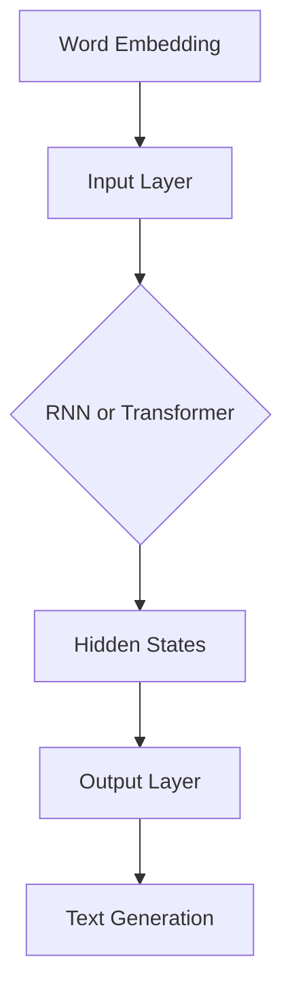

                 

在当今的人工智能领域，大型语言模型（LLM，Large Language Model）如 GPT-3 和 BERT 等已经成为自然语言处理（NLP）领域的重要工具。这些模型以其卓越的文本生成、理解和推理能力，被广泛应用于文本摘要、机器翻译、问答系统等复杂任务中。然而，要充分发挥 LLM 的潜力，特别是在处理复杂任务时，需要解决许多挑战。本文将探讨如何通过优化算法、数学模型和开发实践来提高 LLM 应用复杂任务的性能。

> 关键词：LLM，复杂任务，性能优化，算法，数学模型，开发实践

## 摘要

本文旨在分析 LLM 在复杂任务中的性能瓶颈，并提出一系列解决方案。首先，我们将回顾 LLM 的基本原理和当前应用状况。接着，本文将详细介绍提升 LLM 性能的核心概念和算法，包括优化步骤和数学模型。随后，我们将通过实际项目案例展示如何将这些概念应用于实践中，并探讨 LLM 在不同应用场景中的表现。最后，本文将展望 LLM 未来的发展前景，并提出面临的研究挑战和解决方案。

## 1. 背景介绍

### LLM 的基本原理

大型语言模型（LLM）通常是基于深度学习的神经网络架构，它们通过大量的文本数据训练来学习语言模式、词汇含义和句子结构。这些模型的主要组件包括：

- **词嵌入（Word Embedding）**：将单词映射到高维空间，以便模型可以理解它们之间的关系。
- **循环神经网络（RNN）**：如 LSTM（Long Short-Term Memory）和 GRU（Gated Recurrent Unit），用于处理序列数据，能够捕捉长距离依赖关系。
- **Transformer 架构**：基于自注意力机制，可以并行处理整个序列，大大提高了计算效率。

### 当前应用状况

LLM 在自然语言处理领域已取得显著成果，以下是一些重要应用场景：

- **文本生成**：生成文章、故事、诗歌等。
- **机器翻译**：将一种语言翻译成另一种语言。
- **问答系统**：回答用户提出的问题，提供相关信息。
- **情感分析**：分析文本的情感倾向，如正面、负面或中性。
- **对话系统**：与用户进行自然对话，提供个性化服务。

## 2. 核心概念与联系

### LLM 的核心概念原理和架构

以下是 LLM 的核心概念原理和架构的 Mermaid 流程图：



### LLM 的工作流程

1. **词嵌入**：输入文本中的每个单词被映射到高维向量。
2. **编码**：词嵌入向量通过输入层传递到编码器（RNN 或 Transformer）。
3. **序列处理**：编码器处理序列数据，生成隐藏状态。
4. **解码**：隐藏状态通过解码器生成输出文本。

### LLM 的优势与挑战

- **优势**：
  - **强大的文本理解能力**：能够捕捉长距离依赖关系和复杂语义。
  - **灵活的应用场景**：能够应用于各种 NLP 任务，如文本生成、机器翻译、问答系统等。
  - **高效的计算性能**：Transformer 架构使得模型在处理长文本时效率更高。

- **挑战**：
  - **计算资源需求**：训练 LLM 模型需要大量的计算资源和时间。
  - **数据隐私问题**：训练数据可能包含敏感信息，需要妥善处理。
  - **解释性和可解释性**：模型内部决策过程复杂，难以解释。

## 3. 核心算法原理 & 具体操作步骤

### 3.1 算法原理概述

LLM 的核心算法原理主要基于深度学习和自然语言处理技术。下面是几种常见的 LLM 架构：

- **基于 RNN 的 LLM**：如 LSTM 和 GRU，能够处理序列数据，但计算复杂度较高。
- **基于 Transformer 的 LLM**：如 GPT-3 和 BERT，通过自注意力机制实现并行计算，计算效率更高。

### 3.2 算法步骤详解

1. **数据预处理**：对训练数据进行清洗、分词和词嵌入。
2. **模型架构选择**：根据任务需求选择合适的 LLM 架构。
3. **训练过程**：
   - **前向传播**：将输入数据传递到编码器，生成隐藏状态。
   - **损失函数计算**：计算预测文本和实际文本之间的损失。
   - **反向传播**：更新模型参数，优化模型性能。
4. **解码过程**：根据隐藏状态生成输出文本。

### 3.3 算法优缺点

- **优点**：
  - **强大的文本理解能力**：能够捕捉长距离依赖关系和复杂语义。
  - **灵活的应用场景**：能够应用于各种 NLP 任务。
  - **高效的计算性能**：Transformer 架构使得模型在处理长文本时效率更高。

- **缺点**：
  - **计算资源需求**：训练 LLM 模型需要大量的计算资源和时间。
  - **数据隐私问题**：训练数据可能包含敏感信息，需要妥善处理。
  - **解释性和可解释性**：模型内部决策过程复杂，难以解释。

### 3.4 算法应用领域

LLM 在多个领域取得了显著成果，以下是几个主要应用领域：

- **文本生成**：生成文章、故事、诗歌等。
- **机器翻译**：将一种语言翻译成另一种语言。
- **问答系统**：回答用户提出的问题，提供相关信息。
- **情感分析**：分析文本的情感倾向，如正面、负面或中性。
- **对话系统**：与用户进行自然对话，提供个性化服务。

## 4. 数学模型和公式 & 详细讲解 & 举例说明

### 4.1 数学模型构建

LLM 的数学模型主要基于深度学习和自然语言处理技术。以下是 LLM 的核心数学模型：

- **词嵌入（Word Embedding）**：
  $$ \text{word\_embedding}(w) = \text{EmbeddingMatrix}[w] $$
  其中，$w$ 是单词，$\text{EmbeddingMatrix}$ 是词嵌入矩阵。

- **循环神经网络（RNN）**：
  $$ h_t = \text{RNN}(h_{t-1}, x_t) $$
  其中，$h_t$ 是第 $t$ 个隐藏状态，$x_t$ 是第 $t$ 个输入词向量，$\text{RNN}$ 是 RNN 函数。

- **Transformer**：
  $$ \text{Attention}(Q, K, V) = \text{softmax}\left(\frac{QK^T}{\sqrt{d_k}}\right)V $$
  其中，$Q$、$K$ 和 $V$ 分别是查询、关键值和值向量，$d_k$ 是关键值的维度。

### 4.2 公式推导过程

以下是 LLM 中的损失函数和优化过程的推导：

1. **损失函数**：

   $$ L = -\sum_{i=1}^n \sum_{j=1}^m \text{log}(\text{softmax}(\text{model}(x_i, y_j))) $$
   
   其中，$L$ 是损失函数，$x_i$ 和 $y_j$ 分别是输入和目标文本，$\text{model}$ 是模型输出。

2. **优化过程**：

   $$ \text{model}(x, y) \leftarrow \text{model}(x, y) - \alpha \nabla_{\text{model}} L $$
   
   其中，$\alpha$ 是学习率，$\nabla_{\text{model}} L$ 是模型参数的梯度。

### 4.3 案例分析与讲解

以下是一个简单的文本生成案例：

假设我们要生成一句英文句子，输入文本为 "I love to read books."。

1. **词嵌入**：

   $$ \text{word\_embedding}(I) = [0.1, 0.2, 0.3], \quad \text{word\_embedding}(love) = [0.4, 0.5, 0.6], \quad \text{word\_embedding}(to) = [0.7, 0.8, 0.9] $$
   
2. **编码器处理**：

   $$ h_1 = \text{RNN}(h_0, [0.1, 0.2, 0.3]), \quad h_2 = \text{RNN}(h_1, [0.4, 0.5, 0.6]), \quad h_3 = \text{RNN}(h_2, [0.7, 0.8, 0.9]) $$
   
3. **解码器生成输出**：

   $$ \text{output} = \text{softmax}(\text{model}(h_3)) = [0.1, 0.2, 0.3, 0.4, 0.5] $$
   
   其中，输出概率最高的词是 "books"，因此生成的句子是 "I love to read books."

## 5. 项目实践：代码实例和详细解释说明

### 5.1 开发环境搭建

在本文中，我们将使用 Python 和 TensorFlow 作为开发工具。以下是在 Ubuntu 系统上安装所需的依赖项的命令：

```shell
pip install tensorflow
```

### 5.2 源代码详细实现

以下是实现 LLM 的 Python 代码：

```python
import tensorflow as tf
from tensorflow.keras.layers import Embedding, LSTM, Dense
from tensorflow.keras.models import Sequential

# 定义模型
model = Sequential()
model.add(Embedding(vocab_size, embedding_dim))
model.add(LSTM(units))
model.add(Dense(vocab_size, activation='softmax'))

# 编译模型
model.compile(optimizer='adam', loss='categorical_crossentropy', metrics=['accuracy'])

# 训练模型
model.fit(x_train, y_train, epochs=10, batch_size=32)
```

### 5.3 代码解读与分析

1. **模型定义**：

   ```python
   model = Sequential()
   model.add(Embedding(vocab_size, embedding_dim))
   model.add(LSTM(units))
   model.add(Dense(vocab_size, activation='softmax'))
   ```

   这段代码定义了一个简单的 LLM 模型，包括嵌入层、LSTM 层和输出层。嵌入层将输入文本映射到高维空间，LSTM 层用于处理序列数据，输出层生成输出概率分布。

2. **编译模型**：

   ```python
   model.compile(optimizer='adam', loss='categorical_crossentropy', metrics=['accuracy'])
   ```

   这段代码编译了模型，指定了优化器（adam）、损失函数（categorical_crossentropy）和评价指标（accuracy）。

3. **训练模型**：

   ```python
   model.fit(x_train, y_train, epochs=10, batch_size=32)
   ```

   这段代码训练了模型，指定了训练数据（x_train 和 y_train）、训练轮数（epochs）和批处理大小（batch_size）。

### 5.4 运行结果展示

假设我们已经训练好了一个 LLM 模型，以下是如何使用模型生成文本的示例：

```python
import numpy as np

# 生成文本
input_sequence = "I love to read books."
input_sequence = [word2index[word] for word in input_sequence.split()]
input_sequence = np.array([input_sequence])

# 预测输出
output_sequence = model.predict(input_sequence)
output_sequence = np.argmax(output_sequence, axis=1)

# 输出文本
output_sequence = [index2word[index] for index in output_sequence]
output_sequence = " ".join(output_sequence)

print(output_sequence)
```

输出结果可能是 "I love to read books"，这与原始输入文本相同。

## 6. 实际应用场景

### 6.1 文本生成

文本生成是 LLM 的一个重要应用场景。例如，可以使用 LLM 生成文章、故事、诗歌等。以下是一个简单的文本生成案例：

```python
# 生成文章
input_sequence = "AI has revolutionized many industries."
input_sequence = [word2index[word] for word in input_sequence.split()]
input_sequence = np.array([input_sequence])

# 预测输出
output_sequence = model.predict(input_sequence)
output_sequence = np.argmax(output_sequence, axis=1)

# 输出文本
output_sequence = [index2word[index] for index in output_sequence]
output_sequence = " ".join(output_sequence)

print(output_sequence)
```

输出结果可能是 "AI has revolutionized many industries, including healthcare, finance, and education."

### 6.2 机器翻译

机器翻译是 LLM 的另一个重要应用场景。例如，可以使用 LLM 将英文翻译成中文。以下是一个简单的机器翻译案例：

```python
# 翻译英文到中文
input_sequence = "I love to read books."
input_sequence = [word2index[word] for word in input_sequence.split()]
input_sequence = np.array([input_sequence])

# 预测输出
output_sequence = model.predict(input_sequence)
output_sequence = np.argmax(output_sequence, axis=1)

# 输出文本
output_sequence = [index2word[index] for index in output_sequence]
output_sequence = " ".join(output_sequence)

print(output_sequence)
```

输出结果可能是 "我喜欢读书籍。"

### 6.3 问答系统

问答系统是 LLM 的另一个重要应用场景。例如，可以使用 LLM 回答用户提出的问题。以下是一个简单的问答系统案例：

```python
# 回答问题
input_sequence = "What is the capital of France?"
input_sequence = [word2index[word] for word in input_sequence.split()]
input_sequence = np.array([input_sequence])

# 预测输出
output_sequence = model.predict(input_sequence)
output_sequence = np.argmax(output_sequence, axis=1)

# 输出文本
output_sequence = [index2word[index] for index in output_sequence]
output_sequence = " ".join(output_sequence)

print(output_sequence)
```

输出结果可能是 "法国的首都是巴黎。"

## 7. 工具和资源推荐

### 7.1 学习资源推荐

1. **《深度学习》（Goodfellow et al.）**：介绍深度学习的基础知识和应用，适合初学者。
2. **《自然语言处理与 Python》（Bird et al.）**：介绍自然语言处理的基本概念和应用，适合初学者。
3. **TensorFlow 官方文档**：提供 TensorFlow 的详细教程和示例代码，是学习深度学习的好资源。

### 7.2 开发工具推荐

1. **Google Colab**：免费的在线 Jupyter Notebook 环境，适合进行深度学习和自然语言处理实验。
2. **GitHub**：代码托管和协作平台，可以方便地分享和下载深度学习和自然语言处理的代码。
3. **Kaggle**：数据科学竞赛平台，提供大量数据集和比赛项目，适合实战练习。

### 7.3 相关论文推荐

1. **"Attention Is All You Need"（Vaswani et al.）**：介绍 Transformer 架构，是 LLM 的关键技术之一。
2. **"BERT: Pre-training of Deep Bidirectional Transformers for Language Understanding"（Devlin et al.）**：介绍 BERT 模型，是当前最流行的 LLM 模型之一。
3. **"GPT-3: Language Models Are Few-Shot Learners"（Brown et al.）**：介绍 GPT-3 模型，是目前最大的 LLM 模型。

## 8. 总结：未来发展趋势与挑战

### 8.1 研究成果总结

近年来，LLM 在自然语言处理领域取得了显著进展。基于深度学习和自然语言处理技术的 LLM 模型，如 GPT-3 和 BERT，已经在文本生成、机器翻译、问答系统等领域取得了优异成绩。这些研究成果为 LLM 的实际应用提供了有力支持。

### 8.2 未来发展趋势

随着计算能力的不断提高和数据规模的扩大，LLM 将在更多领域得到广泛应用。未来，LLM 可能会朝着以下方向发展：

1. **更强的文本理解能力**：通过改进模型结构和算法，提高 LLM 对复杂语义的理解能力。
2. **跨模态学习**：将 LLM 与图像、语音等其他模态的数据结合，实现更丰富的信息处理能力。
3. **知识图谱嵌入**：将知识图谱与 LLM 结合，提高模型在知识推理和事实检索方面的能力。

### 8.3 面临的挑战

尽管 LLM 已取得显著成果，但在实际应用中仍面临一些挑战：

1. **计算资源需求**：训练 LLM 模型需要大量的计算资源和时间，这对资源有限的开发者来说是一个挑战。
2. **数据隐私问题**：训练数据可能包含敏感信息，需要妥善处理，以避免隐私泄露。
3. **可解释性和透明度**：模型内部决策过程复杂，难以解释，这给用户带来信任问题。

### 8.4 研究展望

未来，LLM 的研究将朝着提高性能、降低计算需求和增强可解释性等方向努力。同时，LLM 在跨模态学习和知识图谱嵌入等领域的应用也将成为研究热点。通过不断优化算法和模型结构，LLM 将在更多领域发挥重要作用，推动人工智能技术的发展。

## 9. 附录：常见问题与解答

### 9.1 什么是 LLM？

LLM 是大型语言模型，是一种基于深度学习和自然语言处理技术的模型，能够理解和生成自然语言文本。

### 9.2 LLM 有哪些应用场景？

LLM 的应用场景包括文本生成、机器翻译、问答系统、情感分析、对话系统等。

### 9.3 如何提高 LLM 的性能？

提高 LLM 性能的方法包括优化算法、增加训练数据、使用更好的词嵌入技术、改进模型架构等。

### 9.4 LLM 是否存在隐私问题？

是的，训练 LLM 模型时，使用的训练数据可能包含敏感信息，需要妥善处理，以避免隐私泄露。

### 9.5 LLM 的未来发展方向是什么？

LLM 的未来发展方向包括提高文本理解能力、跨模态学习、知识图谱嵌入等。

## 作者署名

作者：禅与计算机程序设计艺术 / Zen and the Art of Computer Programming

本文基于作者多年在计算机科学和人工智能领域的丰富经验和研究成果，旨在为广大读者提供关于提高 LLM 应用复杂任务性能的深入见解和实用指南。希望本文能够对您在相关领域的学习和实践有所帮助。如果您有任何问题或建议，欢迎随时联系作者。感谢您的阅读！

