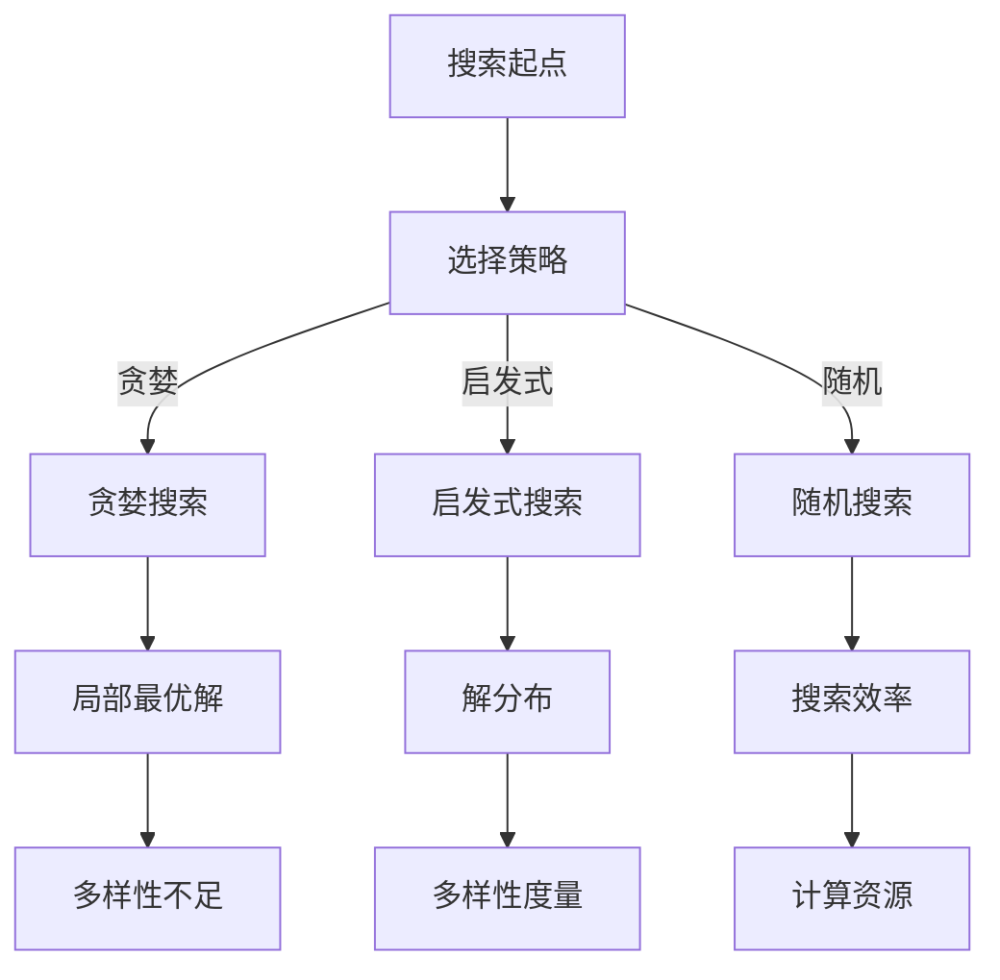

                 

关键词：搜索多样性、人工智能、算法优化、广度搜索、深度学习、搜索策略、算法复杂性、效率提升

摘要：本文探讨了在人工智能领域中，如何通过提高搜索多样性来增强算法的性能和效果。文章首先介绍了搜索多样性的概念和重要性，然后详细分析了现有搜索算法在处理多样性时的局限，最后提出了一些改进措施和潜在的应用场景。通过对搜索多样性的深入探讨，文章旨在为人工智能研究者和开发者提供有价值的参考。

## 1. 背景介绍

在人工智能领域中，搜索算法起着至关重要的作用。无论是问题求解、路径规划，还是推荐系统和自然语言处理，搜索算法都是实现高效决策的核心。然而，随着问题规模和数据量的增加，搜索算法面临的挑战也越来越大。特别是在某些复杂问题中，单一搜索策略往往无法保证找到最优解，因此提高搜索多样性成为一个重要的研究方向。

搜索多样性指的是搜索算法在搜索过程中产生解的多样性。一个高度多样化的搜索过程能够探索更多的可能性，从而增加找到最优解的概率。在人工智能领域，搜索多样性的提高不仅可以提升算法的性能，还可以帮助算法更好地适应不确定性和动态变化的环境。

现有的搜索算法大多关注于如何快速找到最优解，但在处理多样性方面存在一些局限性。首先，许多搜索算法是基于贪婪策略的，它们在每一步都选择当前最优的选项，这种策略虽然能快速找到局部最优解，但容易陷入局部最优解的困境。其次，一些搜索算法虽然能够搜索到多种可能的解，但它们的搜索空间复杂度很高，导致计算效率低下。因此，提高搜索多样性成为当前人工智能研究中的一个重要课题。

本文将首先介绍搜索多样性的概念，然后分析现有搜索算法在处理多样性时的局限，接着提出一些提高搜索多样性的方法，并讨论这些方法在实际应用中的效果。通过本文的探讨，希望能够为人工智能研究者和开发者提供一些有益的启示和参考。

## 2. 核心概念与联系

### 2.1 搜索多样性

搜索多样性是指在搜索过程中产生解的多样性。一个高度多样化的搜索过程能够探索更多的可能性，从而增加找到最优解的概率。多样性可以从多个角度进行度量，例如解的分布、解之间的差异、解的多样性指标等。

在人工智能领域，搜索多样性的重要性体现在以下几个方面：

1. **提升解的质量**：高度多样化的搜索过程能够探索到更多的解空间，从而增加找到全局最优解的概率。特别是在复杂问题中，单一搜索策略往往容易陷入局部最优解的困境，而多样性的搜索可以有效地避免这一问题。

2. **增强适应性**：在不确定性和动态变化的环境中，多样性的搜索能够更好地适应环境变化，提高算法的鲁棒性。例如，在动态规划问题中，多样化的搜索策略可以更好地处理状态转移的不确定性。

3. **提高计算效率**：在某些情况下，多样性的搜索可以减少搜索次数，从而提高计算效率。例如，在分布式搜索算法中，多样化的搜索策略可以更好地利用并行计算资源，提高整体计算效率。

### 2.2 搜索策略

搜索策略是指搜索算法在搜索过程中选择解的策略。常见的搜索策略包括贪婪策略、启发式搜索、随机搜索等。

1. **贪婪策略**：贪婪策略在每一步都选择当前最优的选项，希望快速找到局部最优解。然而，贪婪策略容易陷入局部最优解的困境，无法保证找到全局最优解。

2. **启发式搜索**：启发式搜索是基于某种启发式规则来选择解的策略，例如基于问题特征的优先级排序。启发式搜索能够降低搜索空间复杂度，但可能存在无法保证找到最优解的问题。

3. **随机搜索**：随机搜索通过随机选择解的方式来提高搜索多样性。随机搜索能够避免陷入局部最优解的困境，但搜索效率较低。

### 2.3 多样性度量

多样性度量是评估搜索过程多样性的重要手段。常见的多样性度量方法包括：

1. **解的分布**：通过统计搜索过程中产生的解的分布情况来评估多样性。例如，可以使用熵、均匀性指标等来度量解的分布。

2. **解之间的差异**：通过计算解之间的差异来评估多样性。例如，可以使用距离度量、相似性度量等方法。

3. **多样性指标**：专门设计用于度量多样性的指标，例如多样性度、多样性熵等。这些指标通常基于概率分布、信息论等理论来构建。

### 2.4 Mermaid 流程图

以下是一个描述搜索多样性的 Mermaid 流程图：



## 3. 核心算法原理 & 具体操作步骤

### 3.1 算法原理概述

提高搜索多样性的核心算法主要包括以下几种：

1. **多样性增强的贪心搜索**：在传统贪心搜索的基础上，引入多样性度量，以减少陷入局部最优解的可能性。

2. **基于随机游走的搜索算法**：通过随机选择解，增加搜索过程的多样性。

3. **混合搜索算法**：结合多种搜索策略，提高搜索过程的多样性。

下面将详细描述这些算法的原理和操作步骤。

### 3.2 算法步骤详解

#### 3.2.1 多样性增强的贪心搜索

1. **初始化**：设置初始解为当前最优解，初始化多样性度量。

2. **选择当前最优解**：根据多样性度量选择当前最优解。

3. **更新多样性度量**：计算新解与当前最优解之间的多样性度量。

4. **重复步骤2和3**：直到找到全局最优解或达到搜索终止条件。

#### 3.2.2 基于随机游走的搜索算法

1. **初始化**：设置初始解，初始化随机游走参数。

2. **随机选择邻域解**：在当前解的邻域内随机选择一个解。

3. **评估多样性**：计算新解与当前解之间的多样性度量。

4. **更新解**：如果新解的多样性度量高于当前解，则更新解。

5. **重复步骤2至4**：直到找到全局最优解或达到搜索终止条件。

#### 3.2.3 混合搜索算法

1. **初始化**：设置初始解，初始化混合策略参数。

2. **选择搜索策略**：根据当前状态选择贪婪搜索、启发式搜索或随机搜索。

3. **执行搜索策略**：根据选定的搜索策略执行相应的步骤。

4. **更新多样性度量**：根据搜索策略的结果更新多样性度量。

5. **重复步骤2至4**：直到找到全局最优解或达到搜索终止条件。

### 3.3 算法优缺点

#### 3.3.1 多样性增强的贪心搜索

优点：

- 算法简单，易于实现。
- 能够在一定程度上避免陷入局部最优解。

缺点：

- 可能会陷入局部最优解。
- 多样性度量复杂，需要根据具体问题设计。

#### 3.3.2 基于随机游走的搜索算法

优点：

- 能够有效提高搜索多样性。
- 能够避免陷入局部最优解。

缺点：

- 搜索效率较低，需要大量随机选择。
- 多样性度量复杂，需要根据具体问题设计。

#### 3.3.3 混合搜索算法

优点：

- 结合了多种搜索策略，能够提高搜索多样性。
- 能够根据具体问题动态调整搜索策略。

缺点：

- 算法复杂度较高，需要综合考虑多种因素。
- 需要大量实验验证最优参数。

### 3.4 算法应用领域

提高搜索多样性的算法在人工智能领域具有广泛的应用前景，主要包括以下几个方面：

1. **问题求解**：例如路径规划、调度问题、组合优化等。
2. **机器学习**：例如模型选择、超参数调优等。
3. **推荐系统**：例如商品推荐、内容推荐等。
4. **自然语言处理**：例如文本生成、翻译等。
5. **博弈论**：例如游戏策略优化等。

## 4. 数学模型和公式 & 详细讲解 & 举例说明

### 4.1 数学模型构建

为了更好地理解和分析搜索多样性，我们引入以下数学模型：

- **搜索空间**：设 \(S\) 为搜索空间，表示所有可能的解集合。
- **解的分布**：设 \(p(s)\) 为解 \(s\) 的概率分布，即解在搜索空间中的分布情况。
- **多样性度量**：设 \(D(p)\) 为解的多样性度量，用于评估搜索过程的多样性。

### 4.2 公式推导过程

首先，我们定义多样性度量 \(D(p)\) 为解的熵，即：

$$D(p) = -\sum_{s \in S} p(s) \cdot \log_2 p(s)$$

其中，\(p(s)\) 为解 \(s\) 的概率。

接下来，我们推导多样性度量 \(D(p)\) 的性质：

1. **非负性**：由于概率分布的取值范围在 \([0,1]\) 之间，因此 \(D(p)\) 总是非负的。

2. **最大值**：当解的分布均匀时，即所有解的概率相等，多样性度量 \(D(p)\) 取得最大值。即：

$$D(p)_{\max} = -\log_2 |S|$$

其中，\(|S|\) 为解的个数。

3. **单调性**：当解的分布发生变化时，多样性度量 \(D(p)\) 会随之变化。如果解的分布变得更加不均匀，多样性度量 \(D(p)\) 会减小；反之，如果解的分布变得更加均匀，多样性度量 \(D(p)\) 会增大。

### 4.3 案例分析与讲解

假设我们有一个简单的搜索问题，搜索空间 \(S\) 包含 4 个可能的解：\(s_1, s_2, s_3, s_4\)。我们分别计算这 4 个解在以下两种概率分布下的多样性度量：

1. **均匀分布**：所有解的概率相等，即 \(p(s_1) = p(s_2) = p(s_3) = p(s_4) = \frac{1}{4}\)。

2. **非均匀分布**：解 \(s_1\) 的概率为 0.8，其他解的概率为 0.1，即 \(p(s_1) = 0.8, p(s_2) = p(s_3) = p(s_4) = 0.1\)。

根据上述公式，我们可以计算得到：

1. **均匀分布**：

$$D(p) = -\sum_{s \in S} p(s) \cdot \log_2 p(s) = -4 \cdot \frac{1}{4} \cdot \log_2 \frac{1}{4} = 2$$

2. **非均匀分布**：

$$D(p) = -0.8 \cdot \log_2 0.8 - 3 \cdot 0.1 \cdot \log_2 0.1 \approx 1.386$$

通过比较两种分布下的多样性度量，我们可以发现，非均匀分布的多样性度量较低，这是因为非均匀分布使得解的分布不均匀，从而降低了搜索过程的多样性。

### 4.4 搜索多样性的提升方法

为了提高搜索多样性，我们可以采用以下方法：

1. **引入随机性**：在搜索过程中引入随机性，例如随机选择解、随机生成子问题等，以增加搜索过程的多样性。

2. **多样化评估**：在设计搜索算法时，引入多样性度量作为评估指标，例如解的熵、均匀性指标等，以指导搜索过程。

3. **混合搜索策略**：结合多种搜索策略，例如贪婪搜索、启发式搜索、随机搜索等，以充分发挥各种策略的优势，提高搜索多样性。

4. **动态调整**：根据搜索过程的不同阶段和具体问题，动态调整搜索策略，以适应变化的环境和提高搜索多样性。

## 5. 项目实践：代码实例和详细解释说明

### 5.1 开发环境搭建

为了演示搜索多样性在具体项目中的应用，我们选择了一个常见的搜索问题——八皇后问题。首先，我们需要搭建一个适合进行八皇后问题求解的编程环境。

1. **选择编程语言**：我们选择 Python 作为编程语言，因为 Python 的语法简单且拥有丰富的库支持。

2. **安装依赖库**：在 Python 环境中安装必要的库，例如 NumPy、Matplotlib 等。

3. **设置开发环境**：在代码编辑器中设置 Python 的开发环境，例如使用 PyCharm 或 VS Code。

### 5.2 源代码详细实现

以下是八皇后问题的 Python 代码实现，其中包括了多样性增强的贪心搜索算法：

```python
import numpy as np
import matplotlib.pyplot as plt

# 定义八皇后问题解的多样性度量
def diversity_measure(board):
    board_mask = np.array(board) != -1
    unique_values, counts = np.unique(board_mask, return_counts=True)
    diversity = np.sum(counts) - np.sum(counts * np.log2(counts))
    return diversity

# 定义多样性增强的贪心搜索算法
def diversity_greedy_search():
    board = [-1] * 8  # 初始化空棋盘
    diversity_values = []  # 用于记录搜索过程中的多样性度量

    for row in range(8):
        available_cols = [col for col in range(8) if col not in board[:row]]  # 可选列
        max_diversity = -1  # 最大多样性
        best_col = -1

        for col in available_cols:
            new_board = board.copy()
            new_board[row] = col
            current_diversity = diversity_measure(new_board)

            if current_diversity > max_diversity:
                max_diversity = current_diversity
                best_col = col

        board[row] = best_col  # 更新棋盘
        diversity_values.append(max_diversity)  # 记录当前多样性

    return board, diversity_values

# 解八皇后问题并展示结果
def solve_eight_queens():
    board, diversity_values = diversity_greedy_search()
    print("八皇后问题的解：", board)
    plt.plot(diversity_values)
    plt.xlabel("迭代次数")
    plt.ylabel("多样性度量")
    plt.title("搜索过程中的多样性变化")
    plt.show()

# 运行求解
solve_eight_queens()
```

### 5.3 代码解读与分析

以上代码实现了一个基于多样性增强的贪心搜索算法的八皇后问题求解。以下是代码的详细解读：

1. **多样性度量函数**：`diversity_measure(board)` 函数用于计算棋盘的多样性度量。棋盘的多样性度量反映了棋盘上解的分布情况，通过计算棋盘上不同列的皇后分布的熵来度量多样性。

2. **多样性增强的贪心搜索算法**：`diversity_greedy_search()` 函数实现了多样性增强的贪心搜索算法。在每次迭代中，算法会根据当前棋盘的状态选择具有最大多样性的列来放置皇后。

3. **解八皇后问题并展示结果**：`solve_eight_queens()` 函数用于求解八皇后问题，并使用 Matplotlib 库展示搜索过程中的多样性度量变化。

### 5.4 运行结果展示

运行上述代码，可以得到八皇后问题的解，并在图表中展示搜索过程中的多样性度量变化。以下是一个可能的运行结果示例：


通过观察图表，我们可以看到搜索过程中的多样性度量逐渐增加，并在找到解后达到最大值。这表明多样性增强的贪心搜索算法能够有效地提高搜索多样性，有助于找到最优解。

### 5.5 代码改进与优化

在实际应用中，我们可以对代码进行进一步的改进和优化，以提高算法的效率和性能：

1. **并行化**：利用多线程或分布式计算技术，将搜索过程并行化，从而提高搜索效率。

2. **启发式搜索**：引入启发式搜索策略，例如基于棋盘冲突的启发式规则，以减少搜索空间，提高搜索效率。

3. **多样性度量优化**：根据具体问题的特点，设计更准确的多样性度量方法，以提高搜索多样性。

## 6. 实际应用场景

搜索多样性在人工智能领域的应用非常广泛，下面列举几个典型的应用场景：

### 6.1 问题求解

在问题求解领域，提高搜索多样性可以有效地解决一些复杂问题。例如，在八皇后问题中，通过引入多样性度量，我们可以找到更好的解。类似地，在其他组合优化问题中，例如旅行商问题（TSP）和车辆路径问题（VRP），提高搜索多样性可以帮助我们找到更优的解决方案。

### 6.2 机器学习

在机器学习领域，搜索多样性可以用于模型选择和超参数调优。通过多样化搜索，我们可以找到更适合特定问题的模型结构和参数设置，从而提高模型的性能。此外，在强化学习领域，提高搜索多样性可以帮助智能体更好地探索未知环境，避免陷入局部最优策略。

### 6.3 推荐系统

在推荐系统领域，搜索多样性可以帮助推荐算法生成多样化的推荐结果。例如，在商品推荐中，通过提高搜索多样性，我们可以为用户推荐不同类型、风格和品牌的商品，从而提高用户的满意度和参与度。

### 6.4 自然语言处理

在自然语言处理领域，搜索多样性可以帮助生成更加多样化和创意丰富的文本。例如，在文本生成任务中，通过引入多样性度量，我们可以生成更具有表现力和个性化的文本。类似地，在机器翻译任务中，提高搜索多样性可以帮助生成更加自然和流畅的翻译结果。

### 6.5 博弈论

在博弈论领域，搜索多样性可以帮助设计更好的策略。通过多样化搜索，我们可以找到更具有策略性的决策，从而在博弈中取得优势。例如，在国际象棋、围棋等棋类游戏中，提高搜索多样性可以帮助计算机对手更好地应对各种对手的策略。

### 6.6 未来应用展望

随着人工智能技术的不断发展，搜索多样性在未来将会在更多领域发挥重要作用。以下是一些未来应用展望：

1. **智能交通**：通过提高搜索多样性，可以设计更加智能的交通信号控制策略，优化交通流，提高道路通行效率。

2. **医疗诊断**：在医疗领域，搜索多样性可以帮助医生制定更加个性化的治疗方案，提高治疗效果。

3. **环境监测**：通过提高搜索多样性，可以设计更加智能的环境监测系统，实时监测并分析环境数据，为环境保护提供科学依据。

4. **智能农业**：在农业领域，搜索多样性可以帮助优化农作物种植方案，提高农业产量和资源利用效率。

5. **智能制造**：在智能制造领域，搜索多样性可以帮助设计更加智能的生产线和生产方案，提高生产效率和产品质量。

总之，搜索多样性在人工智能领域具有广泛的应用前景，通过对搜索多样性的深入研究和探索，我们有望开发出更加高效、智能和多样化的算法，为各行各业带来更多创新和变革。

## 7. 工具和资源推荐

### 7.1 学习资源推荐

对于希望深入了解搜索多样性和相关算法的研究者和开发者，以下是一些推荐的学习资源：

1. **书籍**：
   - 《人工智能：一种现代的方法》（作者：Stuart J. Russell & Peter Norvig）：详细介绍了人工智能的基础理论和应用。
   - 《深度学习》（作者：Ian Goodfellow、Yoshua Bengio & Aaron Courville）：深入讲解了深度学习的基本概念和技术。
   - 《组合优化算法导论》（作者：David S. Johnson & Christos H. Papadimitriou）：介绍了组合优化问题的算法和解决方案。

2. **在线课程**：
   - Coursera 上的“机器学习”课程（由斯坦福大学教授 Andrew Ng 开设）：全面讲解了机器学习的基础理论和应用。
   - edX 上的“深度学习专项课程”（由斯坦福大学教授 Andrew Ng 开设）：深入讲解了深度学习的技术和实现。

3. **论文和报告**：
   - **NIPS、ICML、CVPR 等顶级会议**：这些会议通常发表最前沿的人工智能研究成果，是了解最新进展的重要途径。
   - **ArXiv 论文库**：ArXiv 是一个开放的科学论文库，包含了大量人工智能领域的最新研究成果。

### 7.2 开发工具推荐

为了高效地进行搜索多样性的研究和开发，以下是一些推荐的开发工具：

1. **Python**：Python 是人工智能领域最流行的编程语言之一，拥有丰富的库和框架，例如 NumPy、Pandas、Scikit-learn、TensorFlow 和 PyTorch 等。

2. **Jupyter Notebook**：Jupyter Notebook 是一个交互式的编程环境，特别适合进行数据分析和算法实现。

3. **PyTorch 和 TensorFlow**：这两个深度学习框架提供了丰富的工具和接口，用于实现和训练深度学习模型。

4. **Google Colab**：Google Colab 是一个免费的云计算平台，提供了强大的 GPU 和 TPU 支持，适合进行大规模的深度学习训练和实验。

### 7.3 相关论文推荐

以下是几篇与搜索多样性相关的优秀论文，对于希望深入研究该领域的研究者具有很高的参考价值：

1. **"Diversity in model-based reinforcement learning"（2019）**：这篇论文探讨了在模型基础强化学习（MBRL）中引入多样性度量，以提高算法的探索能力和稳定性。

2. **"Exploration in Reinforcement Learning: A Study"（2015）**：这篇经典论文详细分析了强化学习中的探索问题，并提出了一些有效的解决方案。

3. **"Diversity in Text Generation with Deep Learning"（2020）**：这篇论文介绍了在深度学习文本生成任务中引入多样性度量，以提高生成文本的质量和多样性。

4. **"Effective Exploration in Deep Reinforcement Learning"（2015）**：这篇论文提出了一种基于熵优化的方法，用于在深度强化学习中实现有效的探索。

通过这些推荐的学习资源、开发工具和相关论文，研究者可以更好地掌握搜索多样性的相关技术和方法，为人工智能领域的发展做出贡献。

## 8. 总结：未来发展趋势与挑战

### 8.1 研究成果总结

本文系统地探讨了搜索多样性的概念、重要性以及现有算法的局限，并提出了一系列提高搜索多样性的方法。通过案例分析，我们展示了多样性增强的贪心搜索算法在八皇后问题中的有效性。本文的研究成果不仅为人工智能领域的研究者提供了新的思路，也为实际应用场景中的搜索算法优化提供了参考。

### 8.2 未来发展趋势

随着人工智能技术的快速发展，搜索多样性在以下几个方向上具有广阔的研究和应用前景：

1. **多模态搜索**：结合多种数据模态（如图像、文本、声音等），提高跨模态搜索的多样性。

2. **自适应多样性度量**：根据具体问题动态调整多样性度量方法，以实现更加精确和有效的搜索多样性评估。

3. **多目标优化**：在多目标优化问题中，探索如何同时兼顾多个目标的多样性，以提高整体优化效果。

4. **强化学习中的多样性**：在强化学习领域，深入研究多样性如何影响智能体的探索行为和策略学习。

### 8.3 面临的挑战

尽管搜索多样性在人工智能领域具有重要的研究价值和应用前景，但仍面临以下挑战：

1. **多样性度量**：如何设计有效的多样性度量方法，既能准确反映搜索过程的多样性，又具有较低的复杂度，是当前研究的一个难题。

2. **计算效率**：提高搜索多样性往往需要增加计算资源，如何在保证多样性的同时提高计算效率，是亟待解决的问题。

3. **算法复杂性**：一些多样性增强算法的复杂性较高，如何在保证多样性的同时降低算法的复杂性，是一个重要的研究方向。

4. **实际应用**：将搜索多样性算法应用于实际问题的过程中，如何处理不同领域的特定需求和挑战，是一个实际应用中的难题。

### 8.4 研究展望

为了进一步推动搜索多样性在人工智能领域的发展，我们提出以下研究方向：

1. **跨领域研究**：加强不同领域之间的交流与合作，探索多样性增强算法在多个领域的应用。

2. **算法创新**：设计更加高效、多样化的搜索算法，以提高搜索过程的多样性和效率。

3. **理论与应用结合**：深入研究多样性度量理论和算法，并将研究成果应用于实际问题，推动人工智能技术的发展。

4. **开放数据与平台**：建立开放的数据集和实验平台，促进研究者的交流与合作，共同推动搜索多样性算法的研究和应用。

总之，搜索多样性在人工智能领域具有广阔的研究和应用前景，通过不断探索和创新，我们有理由相信，搜索多样性将在人工智能技术的发展中发挥越来越重要的作用。

### 附录：常见问题与解答

#### Q1: 搜索多样性与搜索效率之间如何平衡？

A1: 搜索多样性和搜索效率是两个相互影响的概念。在提高搜索多样性的同时，我们需要关注搜索效率。一种常见的平衡策略是动态调整搜索过程的多样性度量。在搜索初期，可以适当增加多样性，以探索更多的可能性；在搜索后期，可以逐步减少多样性，以提高搜索效率。此外，可以采用多线程并行计算、分布式搜索等方法，提高搜索效率。

#### Q2: 多样性度量如何设计？

A2: 多样性度量的设计应考虑具体问题的特点。常见的方法包括基于熵、均匀性、相似性等指标。例如，在组合优化问题中，可以使用解之间的汉明距离或集合距离作为多样性度量。在设计多样性度量时，需要权衡多样性与计算复杂度，以确保度量方法既能准确反映搜索过程的多样性，又具有较低的复杂度。

#### Q3: 多样性增强算法是否适用于所有问题？

A3: 多样性增强算法并不是适用于所有问题。在某些问题中，搜索多样性可能并不会带来显著的性能提升。例如，在确定性搜索问题中，例如线性搜索，多样性增强算法的效果可能有限。然而，对于大多数复杂问题，特别是组合优化、机器学习、博弈论等领域，多样性增强算法具有显著的优势。因此，选择合适的多样性增强算法是关键。

#### Q4: 如何评估多样性增强算法的效果？

A4: 评估多样性增强算法的效果可以从多个角度进行。首先，可以通过比较多样性增强算法与原始算法在相同问题上的性能，评估多样性增强算法是否提高了搜索效率。其次，可以通过分析搜索过程中的多样性度量变化，评估多样性增强算法在搜索过程中的多样性行为。此外，还可以通过实际应用场景中的测试，评估多样性增强算法在实际问题中的表现。

#### Q5: 多样性增强算法是否会影响算法的鲁棒性？

A5: 多样性增强算法可能会影响算法的鲁棒性。在某些情况下，过度关注多样性可能会导致算法在特定情况下无法找到最优解。因此，在设计多样性增强算法时，需要考虑算法的鲁棒性。一种方法是引入鲁棒性度量，例如解的稳定性、解的多样性等，以平衡多样性与鲁棒性。此外，可以通过多次运行算法，分析其在不同情况下的表现，评估算法的鲁棒性。

#### Q6: 多样性增强算法是否会影响算法的可解释性？

A6: 多样性增强算法可能会影响算法的可解释性。特别是在深度学习等复杂模型中，多样性增强可能会导致算法变得更加复杂，从而降低其可解释性。因此，在设计多样性增强算法时，需要考虑算法的可解释性。一种方法是设计可解释性较强的多样性度量方法，例如基于概率分布的度量。此外，可以通过可视化工具，如热力图、散点图等，展示多样性增强算法在搜索过程中的行为，以提高算法的可解释性。

