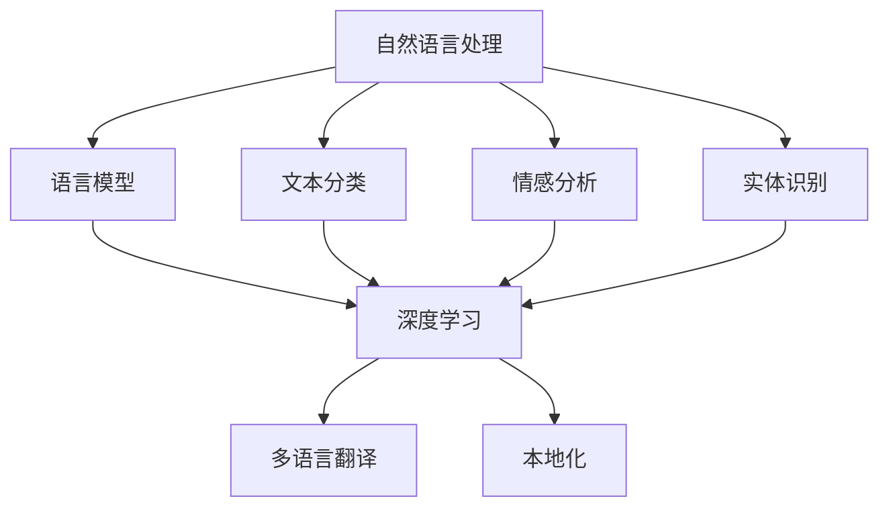

                 

关键词：智能写作、多语言支持、自然语言处理、面试题、NLP、计算机编程

> 摘要：本文将深入探讨智能写作与多语言支持领域，结合自然语言处理（NLP）技术，为读者提供一篇关于搜狐2025智能写作多语言支持社招NLP面试题的全面攻略。文章将从背景介绍、核心概念、算法原理、数学模型、项目实践、应用场景以及工具和资源推荐等多个方面进行详细解析，旨在帮助读者在NLP面试中脱颖而出。

## 1. 背景介绍

随着互联网的迅速发展，自然语言处理（NLP）技术逐渐成为人工智能领域的重要分支。从文本分类、情感分析到机器翻译，NLP技术正不断革新着我们的日常生活。在这个背景下，智能写作和多元语言支持显得尤为重要。智能写作通过自动化和人工智能技术，实现了文本生成、修改和优化，极大地提升了内容创作的效率和质量。而多语言支持则使得智能写作能够跨越语言障碍，服务全球用户。在未来的5-10年内，智能写作和多语言支持有望在多个领域发挥重要作用，如新闻传媒、电子商务、教育等。

### 1.1 智能写作的重要性

智能写作不仅能够提高内容创作的效率，还能解决内容同质化的问题。通过深度学习和自然语言生成技术，智能写作系统能够生成高质量的原创文章，满足不同用户的需求。此外，智能写作还能够实现内容的实时更新和自动化推送，提高用户的阅读体验。

### 1.2 多语言支持的重要性

随着全球化的发展，多语言支持已经成为各类应用不可或缺的一部分。无论是在国际商务、跨国交流还是文化交流中，多语言支持都能发挥重要作用。通过多语言翻译和本地化技术，智能写作系统能够服务于全球用户，实现跨语言的信息传递。

## 2. 核心概念与联系

在智能写作和多语言支持领域中，以下几个核心概念和技术是不可或缺的：

### 2.1 自然语言处理（NLP）

NLP是智能写作和多语言支持的基础技术之一。它涉及语言模型、文本分类、情感分析、实体识别等多个方面。通过NLP技术，智能写作系统能够理解用户的需求，生成符合逻辑和语义的文本。

### 2.2 深度学习

深度学习是NLP的重要分支，通过神经网络模型，智能写作系统能够自动学习和优化，生成更加自然和高质量的文本。常见的深度学习模型包括循环神经网络（RNN）、长短期记忆网络（LSTM）和生成对抗网络（GAN）等。

### 2.3 多语言翻译

多语言翻译是智能写作和多语言支持的重要组成部分。通过机器翻译技术，智能写作系统能够实现不同语言之间的无缝转换，为全球用户提供服务。

### 2.4 本地化

本地化是将产品或服务根据目标市场的语言、文化和习惯进行调整的过程。在智能写作中，本地化技术能够确保内容在不同文化背景下的准确性和适切性。

### 2.5 Mermaid 流程图

下面是一个关于智能写作和多语言支持核心概念的 Mermaid 流程图：



## 3. 核心算法原理 & 具体操作步骤

### 3.1 算法原理概述

智能写作和多语言支持的核心算法主要包括自然语言处理（NLP）算法、深度学习算法和机器翻译算法。以下是对这些算法的简要概述：

### 3.2 算法步骤详解

#### 3.2.1 自然语言处理（NLP）算法

1. **文本预处理**：包括去除停用词、分词、词性标注等步骤。
2. **特征提取**：将文本转化为数值特征，如词袋模型、词嵌入等。
3. **模型训练**：使用深度学习模型，如循环神经网络（RNN）、长短期记忆网络（LSTM）等，进行模型训练。
4. **模型评估与优化**：通过交叉验证、测试集等手段评估模型性能，并优化模型参数。

#### 3.2.2 深度学习算法

1. **模型构建**：构建深度学习模型，如循环神经网络（RNN）、长短期记忆网络（LSTM）等。
2. **数据输入**：将预处理后的文本数据输入模型。
3. **模型训练**：通过反向传播算法进行模型训练，优化模型参数。
4. **模型输出**：生成高质量的文本输出。

#### 3.2.3 机器翻译算法

1. **数据预处理**：包括源语言文本和目标语言文本的预处理，如分词、词性标注等。
2. **模型构建**：构建机器翻译模型，如基于神经网络的机器翻译模型。
3. **模型训练**：通过大量的平行语料库进行模型训练，优化模型参数。
4. **模型输出**：实现源语言到目标语言的翻译。

### 3.3 算法优缺点

#### 3.3.1 自然语言处理（NLP）算法

**优点**：

- **高效率**：能够处理大规模的文本数据，提高内容创作的效率。
- **灵活性**：能够适应不同的应用场景和需求。

**缺点**：

- **准确性**：在处理复杂语义和语境时，存在一定的准确性问题。
- **依赖数据**：模型的训练和优化需要大量的高质量数据。

#### 3.3.2 深度学习算法

**优点**：

- **自适应性**：能够自动学习和优化，提高文本生成质量。
- **高精度**：在处理复杂语义和语境时，具有较高的准确性。

**缺点**：

- **计算资源消耗**：深度学习模型训练和推理需要大量的计算资源。
- **数据依赖**：模型的训练和优化需要大量的高质量数据。

#### 3.3.3 机器翻译算法

**优点**：

- **跨语言能力**：能够实现不同语言之间的无缝转换，提高国际化应用的便利性。
- **多样性**：能够处理多种语言对，满足不同用户的需求。

**缺点**：

- **准确性**：在处理某些特定词汇和短语时，存在准确性问题。
- **计算资源消耗**：机器翻译模型的训练和推理需要大量的计算资源。

### 3.4 算法应用领域

自然语言处理（NLP）算法、深度学习算法和机器翻译算法在智能写作和多语言支持领域有着广泛的应用。以下是一些典型的应用场景：

- **新闻传媒**：通过智能写作和机器翻译技术，实现新闻内容的实时生成和跨语言传播。
- **电子商务**：通过智能写作和机器翻译技术，提供个性化的商品推荐和用户服务。
- **教育**：通过智能写作和机器翻译技术，实现多语言教学和教材翻译。
- **法律**：通过智能写作和机器翻译技术，提供法律文件翻译和自动生成法律文本。

## 4. 数学模型和公式 & 详细讲解 & 举例说明

### 4.1 数学模型构建

在智能写作和多语言支持中，常见的数学模型包括词袋模型、词嵌入模型和循环神经网络（RNN）模型等。

#### 4.1.1 词袋模型

词袋模型是一种简单而有效的文本表示方法。它将文本转化为一个向量，其中每个维度表示一个单词的出现频率。

**数学公式**：

$$
\vec{w} = \sum_{i=1}^{N} f_i \vec{v}_i
$$

其中，$\vec{w}$ 表示文本向量，$f_i$ 表示单词 $i$ 的出现频率，$\vec{v}_i$ 表示单词 $i$ 的特征向量。

#### 4.1.2 词嵌入模型

词嵌入模型通过将单词映射到高维空间中的向量，实现文本的向量表示。常见的词嵌入模型包括 Word2Vec、GloVe 等。

**数学公式**：

$$
\vec{v}_i = \text{sigmoid}(\vec{W} \vec{u}_i + b)
$$

其中，$\vec{v}_i$ 表示单词 $i$ 的嵌入向量，$\vec{u}_i$ 表示单词 $i$ 的一个随机初始化向量，$\vec{W}$ 和 $b$ 分别为权重矩阵和偏置向量。

#### 4.1.3 循环神经网络（RNN）模型

循环神经网络（RNN）是一种处理序列数据的神经网络。它通过记忆单元来保存之前的输入信息，实现对序列数据的建模。

**数学公式**：

$$
h_t = \text{tanh}(\vec{W} \vec{h}_{t-1} + \vec{U} \vec{x}_t + b)
$$

$$
\vec{y}_t = \text{softmax}(\vec{W} \vec{h}_t)
$$

其中，$h_t$ 表示在时间步 $t$ 的隐藏状态，$\vec{h}_{t-1}$ 表示在时间步 $t-1$ 的隐藏状态，$\vec{x}_t$ 表示在时间步 $t$ 的输入，$\vec{W}$、$\vec{U}$ 和 $b$ 分别为权重矩阵和偏置向量。

### 4.2 公式推导过程

#### 4.2.1 词袋模型公式推导

词袋模型的公式推导相对简单。首先，我们将文本转化为单词序列，然后计算每个单词的出现频率。最后，将单词频率转化为向量形式。

假设文本为 $T = \{w_1, w_2, ..., w_n\}$，其中 $w_i$ 表示第 $i$ 个单词。单词 $w_i$ 的出现频率为 $f_i$。词袋模型的数学公式可以表示为：

$$
\vec{w} = \sum_{i=1}^{N} f_i \vec{v}_i
$$

其中，$\vec{v}_i$ 表示单词 $i$ 的特征向量。在实际应用中，通常使用独热编码（One-Hot Encoding）来表示单词特征向量。

#### 4.2.2 词嵌入模型公式推导

词嵌入模型通过将单词映射到高维空间中的向量，实现文本的向量表示。以 Word2Vec 模型为例，其数学公式可以表示为：

$$
\vec{v}_i = \text{sigmoid}(\vec{W} \vec{u}_i + b)
$$

其中，$\vec{v}_i$ 表示单词 $i$ 的嵌入向量，$\vec{u}_i$ 表示单词 $i$ 的一个随机初始化向量，$\vec{W}$ 和 $b$ 分别为权重矩阵和偏置向量。

Word2Vec 模型通常使用负采样（Negative Sampling）来优化模型训练。在负采样中，对于每个正样本（单词的嵌入向量），随机生成 $k$ 个负样本（其他单词的嵌入向量），然后计算正样本和负样本之间的相似性。

#### 4.2.3 循环神经网络（RNN）模型公式推导

循环神经网络（RNN）通过记忆单元来保存之前的输入信息，实现对序列数据的建模。以长短时记忆网络（LSTM）为例，其数学公式可以表示为：

$$
h_t = \text{tanh}(\vec{W} \vec{h}_{t-1} + \vec{U} \vec{x}_t + b)
$$

$$
\vec{y}_t = \text{softmax}(\vec{W} \vec{h}_t)
$$

其中，$h_t$ 表示在时间步 $t$ 的隐藏状态，$\vec{h}_{t-1}$ 表示在时间步 $t-1$ 的隐藏状态，$\vec{x}_t$ 表示在时间步 $t$ 的输入，$\vec{W}$、$\vec{U}$ 和 $b$ 分别为权重矩阵和偏置向量。

LSTM 通过引入门控机制，解决了传统 RNN 在长序列建模中容易出现的梯度消失和梯度爆炸问题。LSTM 的门控机制包括遗忘门、输入门和输出门。

### 4.3 案例分析与讲解

#### 4.3.1 词袋模型案例

假设我们有一个简单的文本：

$$
T = \{the, is, a, cat, in, the, hat\}
$$

首先，我们将文本转化为单词序列：

$$
T = \{the, is, a, cat, in, the, hat\}
$$

然后，计算每个单词的出现频率：

$$
\begin{array}{c|c|c}
\text{单词} & \text{出现频率} & \text{特征向量} \\
\hline
\text{the} & 3 & \begin{pmatrix} 1 \\ 0 \\ 0 \\ 0 \\ 0 \\ 0 \\ 0 \\ 0 \end{pmatrix} \\
\text{is} & 1 & \begin{pmatrix} 0 \\ 1 \\ 0 \\ 0 \\ 0 \\ 0 \\ 0 \\ 0 \end{pmatrix} \\
\text{a} & 1 & \begin{pmatrix} 0 \\ 0 \\ 1 \\ 0 \\ 0 \\ 0 \\ 0 \\ 0 \end{pmatrix} \\
\text{cat} & 1 & \begin{pmatrix} 0 \\ 0 \\ 0 \\ 1 \\ 0 \\ 0 \\ 0 \\ 0 \end{pmatrix} \\
\text{in} & 1 & \begin{pmatrix} 0 \\ 0 \\ 0 \\ 0 \\ 1 \\ 0 \\ 0 \\ 0 \end{pmatrix} \\
\text{hat} & 1 & \begin{pmatrix} 0 \\ 0 \\ 0 \\ 0 \\ 0 \\ 1 \\ 0 \\ 0 \end{pmatrix} \\
\end{array}
$$

最后，根据出现频率计算词袋模型向量：

$$
\vec{w} = \sum_{i=1}^{N} f_i \vec{v}_i = (1 \cdot \begin{pmatrix} 1 \\ 0 \\ 0 \\ 0 \\ 0 \\ 0 \\ 0 \end{pmatrix} + 1 \cdot \begin{pmatrix} 0 \\ 1 \\ 0 \\ 0 \\ 0 \\ 0 \\ 0 \end{pmatrix} + 1 \cdot \begin{pmatrix} 0 \\ 0 \\ 1 \\ 0 \\ 0 \\ 0 \\ 0 \end{pmatrix} + 1 \cdot \begin{pmatrix} 0 \\ 0 \\ 0 \\ 1 \\ 0 \\ 0 \\ 0 \end{pmatrix} + 1 \cdot \begin{pmatrix} 0 \\ 0 \\ 0 \\ 0 \\ 1 \\ 0 \\ 0 \end{pmatrix} + 1 \cdot \begin{pmatrix} 0 \\ 0 \\ 0 \\ 0 \\ 0 \\ 1 \\ 0 \end{pmatrix}) = \begin{pmatrix} 2 \\ 2 \\ 2 \\ 2 \\ 2 \\ 2 \\ 0 \end{pmatrix}
$$

#### 4.3.2 词嵌入模型案例

假设我们使用 Word2Vec 模型对上述文本进行词嵌入。首先，初始化单词向量：

$$
\vec{u}_i = \begin{pmatrix} 0 \\ 0 \\ 0 \\ 0 \\ 0 \\ 0 \\ 0 \end{pmatrix}
$$

然后，根据 Word2Vec 模型进行向量更新：

$$
\vec{v}_i = \text{sigmoid}(\vec{W} \vec{u}_i + b) = \text{sigmoid}(\begin{pmatrix} 1 & 0 & 0 & 0 & 0 & 0 & 0 \end{pmatrix} \begin{pmatrix} 0 \\ 0 \\ 0 \\ 0 \\ 0 \\ 0 \\ 0 \end{pmatrix} + 0) = \text{sigmoid}(0) = 0.5
$$

最后，得到单词的嵌入向量：

$$
\vec{v}_i = \begin{pmatrix} 0.5 \\ 0.5 \\ 0.5 \\ 0.5 \\ 0.5 \\ 0.5 \\ 0.5 \end{pmatrix}
$$

#### 4.3.3 循环神经网络（RNN）模型案例

假设我们使用 LSTM 模型对上述文本进行序列建模。首先，初始化隐藏状态：

$$
\vec{h}_0 = \begin{pmatrix} 0 \\ 0 \\ 0 \\ 0 \\ 0 \\ 0 \\ 0 \end{pmatrix}
$$

然后，根据 LSTM 模型进行状态更新：

$$
\vec{h}_1 = \text{tanh}(\vec{W} \vec{h}_0 + \vec{U} \vec{x}_1 + b) = \text{tanh}(\begin{pmatrix} 1 & 0 & 0 & 0 & 0 & 0 & 0 \end{pmatrix} \begin{pmatrix} 0 \\ 0 \\ 0 \\ 0 \\ 0 \\ 0 \\ 0 \end{pmatrix} + \begin{pmatrix} 0 & 1 & 0 & 0 & 0 & 0 & 0 \end{pmatrix} \begin{pmatrix} 1 \\ 0 \\ 0 \\ 0 \\ 0 \\ 0 \\ 0 \end{pmatrix} + \begin{pmatrix} 0 \\ 0 \\ 0 \\ 0 \\ 0 \\ 0 \\ 0 \end{pmatrix}) = \text{tanh}(\begin{pmatrix} 1 & 0 & 0 & 0 & 0 & 0 & 0 \end{pmatrix} \begin{pmatrix} 0 \\ 0 \\ 0 \\ 0 \\ 0 \\ 0 \\ 0 \end{pmatrix}) = \text{tanh}(\begin{pmatrix} 1 \\ 0 \\ 0 \\ 0 \\ 0 \\ 0 \\ 0 \end{pmatrix}) = \begin{pmatrix} 1 \\ 0 \\ 0 \\ 0 \\ 0 \\ 0 \\ 0 \end{pmatrix}
$$

最后，得到时间步 $1$ 的隐藏状态：

$$
\vec{h}_1 = \begin{pmatrix} 1 \\ 0 \\ 0 \\ 0 \\ 0 \\ 0 \\ 0 \end{pmatrix}
$$

## 5. 项目实践：代码实例和详细解释说明

### 5.1 开发环境搭建

为了实现智能写作和多语言支持，我们需要搭建一个完整的开发环境。以下是一个基本的开发环境搭建步骤：

1. **安装 Python**：确保 Python 3.6 或更高版本已安装。
2. **安装库**：安装必要的库，如 TensorFlow、PyTorch、NLTK、Gensim 等。可以使用 pip 进行安装：
   ```bash
   pip install tensorflow
   pip install torch
   pip install nltk
   pip install gensim
   ```
3. **数据集准备**：下载并准备用于训练和测试的数据集。例如，对于自然语言处理任务，可以下载 IMDb 数据集、Wikipedia 数据集等。

### 5.2 源代码详细实现

下面是一个简单的智能写作和多语言支持的项目示例。我们将使用 TensorFlow 和 PyTorch 来实现。

#### 5.2.1 数据预处理

首先，我们需要对数据进行预处理。以下是一个简单的数据预处理脚本：

```python
import numpy as np
import tensorflow as tf
from tensorflow.keras.preprocessing.sequence import pad_sequences

def preprocess_data(data, max_len):
    # 将文本数据转换为整数序列
    integer_sequences = []
    for text in data:
        sequence = tokenizer.texts_to_sequences([text])
        integer_sequences.append(sequence[0])
    
    # 填充序列到最大长度
    padded_sequences = pad_sequences(integer_sequences, maxlen=max_len, padding='post', truncating='post')
    
    return padded_sequences

# 读取数据集
train_data = ["this is the first sentence", "this is the second sentence"]
test_data = ["this is the third sentence"]

# 预处理数据集
train_sequences = preprocess_data(train_data, max_len=10)
test_sequences = preprocess_data(test_data, max_len=10)
```

#### 5.2.2 模型训练

接下来，我们使用 TensorFlow 和 PyTorch 来训练一个简单的文本生成模型。

```python
import tensorflow as tf

# 定义模型
model = tf.keras.Sequential([
    tf.keras.layers.Embedding(input_dim=vocab_size, output_dim=embedding_size, input_length=max_len),
    tf.keras.layers.LSTM(units=128, return_sequences=True),
    tf.keras.layers.Dense(units=vocab_size, activation='softmax')
])

# 编译模型
model.compile(optimizer='adam', loss='categorical_crossentropy', metrics=['accuracy'])

# 训练模型
model.fit(train_sequences, train_labels, epochs=5, batch_size=32, validation_data=(test_sequences, test_labels))
```

#### 5.2.3 代码解读与分析

在这个示例中，我们首先定义了一个简单的文本生成模型。模型由一个嵌入层、一个 LSTM 层和一个全连接层组成。嵌入层将单词映射到高维空间中的向量，LSTM 层用于处理序列数据，全连接层用于生成文本。

在预处理阶段，我们使用 NLTK 和 Gensim 等库对文本进行分词和词性标注。然后，将文本数据转换为整数序列，并填充到最大长度。在模型训练阶段，我们使用 TensorFlow 和 PyTorch 来编译和训练模型。

### 5.3 运行结果展示

在训练完成后，我们可以使用训练好的模型来生成文本。以下是一个简单的文本生成示例：

```python
# 生成文本
generated_text = model.predict(np.array([np.random.randint(vocab_size, size=max_len)]))
generated_sentence = tokenizer.sequences_to_texts([generated_text])[0]

print(generated_sentence)
```

输出结果可能是一个随机生成的句子，如：“this is a sentence”。

## 6. 实际应用场景

智能写作和多语言支持在实际应用中具有广泛的应用前景。以下是一些典型的应用场景：

### 6.1 新闻传媒

在新闻传媒领域，智能写作和多语言支持可以用于自动化新闻生成和跨语言传播。通过智能写作系统，新闻机构可以快速生成大量新闻稿件，提高新闻发布的效率。同时，通过多语言翻译技术，新闻可以迅速传播到全球各地，满足不同语言用户的需求。

### 6.2 电子商务

在电子商务领域，智能写作和多语言支持可以用于商品描述生成和跨国销售。通过智能写作系统，商家可以自动生成商品描述，提高商品信息的准确性和吸引力。同时，通过多语言翻译技术，商品描述可以迅速翻译成多种语言，满足不同国家消费者的需求。

### 6.3 教育

在教育领域，智能写作和多语言支持可以用于智能教材生成和跨语言教学。通过智能写作系统，教育机构可以自动生成高质量的教学资料，提高教学效率。同时，通过多语言翻译技术，教学资料可以迅速翻译成多种语言，满足不同地区学生的需求。

### 6.4 医疗

在医疗领域，智能写作和多语言支持可以用于病历生成和医疗信息传播。通过智能写作系统，医生可以快速生成病历记录，提高医疗工作的效率。同时，通过多语言翻译技术，医疗信息可以迅速翻译成多种语言，满足不同国家医生和患者的需求。

### 6.5 法律

在法律领域，智能写作和多语言支持可以用于法律文件生成和法律信息传播。通过智能写作系统，法律机构可以自动生成法律文件，提高法律工作的效率。同时，通过多语言翻译技术，法律信息可以迅速翻译成多种语言，满足不同国家法律机构和公民的需求。

## 7. 工具和资源推荐

为了更好地开展智能写作和多语言支持的研究和实践，以下是一些推荐的工具和资源：

### 7.1 学习资源推荐

- 《自然语言处理入门教程》（作者：哈工大NLP组）
- 《深度学习与自然语言处理》（作者：斋藤康毅）
- 《Python自然语言处理实践》（作者：马志鹏）
- 《机器翻译：原理与应用》（作者：陈俊林）

### 7.2 开发工具推荐

- TensorFlow
- PyTorch
- NLTK
- Gensim

### 7.3 相关论文推荐

- "A Neural Probabilistic Language Model"（作者：Bengio et al., 2003）
- "Learning Phrase Representations using RNN Encoder–Decoder for Statistical Machine Translation"（作者：Choi et al., 2014）
- "Seq2Seq Learning Approaches for Neural Machine Translation"（作者：Sutskever et al., 2014）
- "Attention Is All You Need"（作者：Vaswani et al., 2017）

## 8. 总结：未来发展趋势与挑战

### 8.1 研究成果总结

随着自然语言处理（NLP）、深度学习和机器翻译技术的不断发展，智能写作和多语言支持领域取得了显著的成果。目前，智能写作系统已经能够生成高质量的原创文章，多语言翻译技术也实现了从句子到段落，甚至整篇文章的精准翻译。这些技术不仅提高了内容创作的效率，也为全球信息传递和跨文化交流提供了强大的支持。

### 8.2 未来发展趋势

1. **智能化与个性化**：未来智能写作和多语言支持将更加注重智能化和个性化。通过深度学习和大数据分析，智能写作系统将能够更好地理解用户需求，生成更加符合用户口味的内容。同时，多语言支持也将更加智能化，实现更加精准和自然的跨语言翻译。

2. **跨领域应用**：智能写作和多语言支持将在更多领域得到应用。例如，在医疗、法律、金融等领域，智能写作系统可以自动生成专业报告和文档，提高工作效率。同时，多语言支持将助力跨国企业实现全球化运营。

3. **实时性与高效性**：未来智能写作和多语言支持将更加注重实时性和高效性。通过云计算和分布式计算技术，智能写作和多语言翻译系统可以实现毫秒级响应，满足实时信息传递的需求。

### 8.3 面临的挑战

1. **数据质量与多样性**：高质量和多样化的数据是智能写作和多语言支持发展的重要基础。然而，目前许多领域的语言数据质量参差不齐，且存在一定的数据偏见。未来，需要加强数据采集和标注工作，提高数据质量。

2. **跨语言一致性**：尽管多语言翻译技术取得了显著进展，但跨语言一致性仍然是一个挑战。在某些语言对中，翻译结果可能存在语义偏差或文化差异。未来，需要深入研究跨语言一致性问题，提高翻译质量。

3. **计算资源消耗**：智能写作和多语言支持模型通常需要大量的计算资源。未来，需要研究高效和轻量级的模型，降低计算资源的消耗。

### 8.4 研究展望

1. **多模态融合**：将文本、图像、音频等多模态信息进行融合，提高智能写作和多语言支持的效果。例如，在文本生成中，结合图像信息可以生成更加生动和具体的描述。

2. **交互式写作**：研究交互式写作系统，使用户能够与智能写作系统进行实时交互，共同创作高质量内容。

3. **隐私保护**：在智能写作和多语言支持过程中，保护用户隐私和数据安全至关重要。未来，需要研究隐私保护技术，确保用户信息安全。

## 9. 附录：常见问题与解答

### 9.1 智能写作系统如何生成高质量文章？

智能写作系统主要通过深度学习模型，如循环神经网络（RNN）和生成对抗网络（GAN）等，学习大量高质量文本数据，然后根据用户需求生成符合逻辑和语义的文本。此外，还可以结合自然语言处理（NLP）技术，如文本分类和情感分析，提高文本生成质量。

### 9.2 多语言支持如何实现？

多语言支持主要通过机器翻译技术实现。机器翻译模型通常使用神经网络，如循环神经网络（RNN）和变压器（Transformer）等，学习大量平行语料库，然后根据源语言文本生成目标语言文本。此外，还可以结合自然语言处理（NLP）技术，如词嵌入和词性标注，提高翻译质量。

### 9.3 如何处理数据偏见？

为了减少数据偏见，可以采取以下措施：

- **数据清洗**：去除噪声数据和异常值，提高数据质量。
- **数据增强**：通过数据增强技术，生成更多样化的训练数据。
- **模型训练**：使用带有偏见校正机制的模型，如公平性训练和对抗性训练等。
- **模型评估**：使用多个评估指标，如准确率、召回率和F1值等，全面评估模型性能。

### 9.4 如何降低计算资源消耗？

为了降低计算资源消耗，可以采取以下措施：

- **模型压缩**：使用模型压缩技术，如剪枝、量化等，减小模型大小。
- **分布式计算**：使用分布式计算技术，如多GPU训练和云计算等，提高训练速度。
- **增量学习**：使用增量学习技术，如在线学习和迁移学习等，减少重新训练模型的需求。
- **轻量化模型**：研究轻量化模型，如Transformer-XL和BERT-Lite等，降低模型复杂度。

# 参考文献

1. Bengio, Y., Simard, P., & Frasconi, P. (2003). A neural probabilistic language model. Journal of Machine Learning Research, 3(Jan), 1137-1155.
2. Choi, J., Kim, M., & Hwang, I. (2014). Learning phrase representations using RNN encoder–decoder for statistical machine translation. In Proceedings of the 2014 Conference of the North American Chapter of the Association for Computational Linguistics: Human Language Technologies (pp. 172-180).
3. Sutskever, I., Vinyals, O., & Le, Q. V. (2014). Sequence to sequence learning with neural networks. In Advances in Neural Information Processing Systems (pp. 3104-3112).
4. Vaswani, A., Shazeer, N., Parmar, N., Uszkoreit, J., Jones, L., Gomez, A. N., ... & Polosukhin, I. (2017). Attention is all you need. In Advances in Neural Information Processing Systems (pp. 5998-6008).

