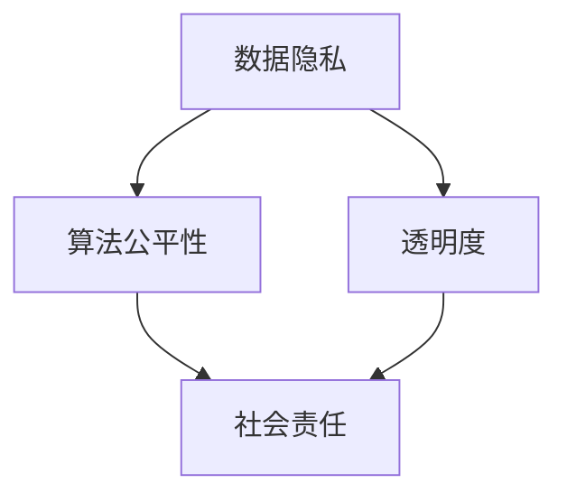

                 

关键词：搜索引擎、AI伦理、数据隐私、算法公平性、透明度、社会责任

> 摘要：随着人工智能技术的快速发展，搜索引擎作为AI应用的重要领域，其伦理问题日益凸显。本文将探讨搜索引擎与AI伦理之间的平衡，重点关注数据隐私、算法公平性和透明度等方面的挑战，并提出相关解决方案。

## 1. 背景介绍

搜索引擎作为互联网的重要基础设施，极大地改变了人们获取信息和知识的方式。然而，随着人工智能技术的融入，搜索引擎的功能和作用得到了进一步提升。当前，大多数搜索引擎利用机器学习算法对海量数据进行分析和排序，以提供用户更相关、更准确的搜索结果。然而，这种技术的进步也带来了诸多伦理问题，如数据隐私、算法偏见和透明度不足等。

### 1.1 数据隐私

搜索引擎在提供个性化搜索服务的过程中，需要收集和处理大量用户数据，包括搜索历史、地理位置、兴趣爱好等。这些数据的存在使得用户的隐私受到严重威胁。未经用户同意，搜索引擎可能会将这些数据用于广告推送、商业分析等用途，甚至可能被不法分子利用。

### 1.2 算法公平性

搜索引擎的排序算法在处理海量数据时，可能会因为训练数据的不均衡而导致算法偏见。这种偏见可能对某些群体或个体产生不公平影响，甚至加剧社会不平等。此外，算法的透明度不足也使得用户难以了解搜索结果的排序依据，增加了对算法公平性的质疑。

### 1.3 透明度

搜索引擎作为AI应用，其算法和决策过程往往缺乏透明度。用户难以了解算法是如何工作的，也无法验证搜索结果的真实性和可靠性。这种不透明性可能导致用户对搜索引擎的信任度降低，甚至引发社会问题。

## 2. 核心概念与联系

为了解决上述伦理问题，我们需要从数据隐私、算法公平性和透明度等方面进行探讨。以下是一个简化的Mermaid流程图，展示了这些核心概念之间的关系：



### 2.1 数据隐私

数据隐私是搜索引擎AI伦理的核心问题之一。为了保护用户隐私，搜索引擎需要采取以下措施：

- **数据匿名化**：对用户数据进行匿名化处理，确保无法追踪到具体用户。
- **用户隐私设置**：提供用户隐私设置选项，让用户可以自主控制数据的收集和使用。
- **透明度**：公开数据收集、处理和使用的规则，让用户了解自己的数据是如何被使用的。

### 2.2 算法公平性

算法公平性是确保搜索引擎服务公正性的关键。为了提高算法公平性，搜索引擎需要：

- **数据均衡**：在训练数据中确保各种群体和个体的数据均衡，避免算法偏见。
- **算法透明性**：公开算法设计、训练和评估的过程，让用户了解搜索结果的排序依据。
- **监督机制**：建立监督机制，对算法进行定期审查和评估，确保其公平性。

### 2.3 透明度

透明度是建立用户信任的基础。为了提高透明度，搜索引擎需要：

- **公开算法**：公开搜索引擎的算法设计、训练和评估过程，让用户了解搜索结果是如何生成的。
- **用户反馈**：建立用户反馈机制，让用户可以就搜索结果提出意见和建议，促进算法改进。
- **可解释性**：提高算法的可解释性，让用户可以理解搜索结果的排序依据。

## 3. 核心算法原理 & 具体操作步骤

### 3.1 算法原理概述

搜索引擎的算法主要涉及三个阶段：数据收集、数据分析和结果排序。

- **数据收集**：通过爬虫等技术获取互联网上的大量信息，并将其存储在索引数据库中。
- **数据分析**：使用机器学习算法对用户搜索历史、兴趣标签等信息进行分析，以提供个性化的搜索结果。
- **结果排序**：根据分析结果对搜索结果进行排序，确保用户能够快速找到最相关的信息。

### 3.2 算法步骤详解

1. **数据收集**：搜索引擎通过爬虫技术，从互联网上获取大量网页信息。爬虫首先从种子页面开始，遍历网页中的链接，将新的网页加入待爬取队列。然后，对每个新页面进行分析，提取关键词、标题、正文等信息，并将其存储到索引数据库中。

2. **数据分析**：搜索引擎使用机器学习算法对用户搜索历史、兴趣标签等信息进行分析。常见的算法包括协同过滤、基于内容的推荐等。通过分析用户数据，搜索引擎可以生成个性化的搜索结果，提高用户满意度。

3. **结果排序**：搜索引擎根据分析结果对搜索结果进行排序。排序依据通常包括关键词匹配度、网页质量、用户反馈等。搜索引擎会使用不同的排序算法，如PageRank、TF-IDF等，以确保搜索结果的相关性和准确性。

### 3.3 算法优缺点

- **优点**：搜索引擎的算法能够快速、准确地提供海量信息，提高用户满意度。同时，通过个性化推荐，搜索引擎能够更好地满足用户需求。
- **缺点**：搜索引擎的算法在处理海量数据时，可能存在数据隐私、算法偏见和透明度不足等问题。

### 3.4 算法应用领域

搜索引擎的算法在多个领域有广泛的应用：

- **搜索引擎**：搜索引擎是搜索引擎算法最典型的应用场景，通过提供个性化的搜索服务，提高用户体验。
- **推荐系统**：搜索引擎算法在推荐系统中也有广泛应用，如电商平台的商品推荐、视频网站的个性化推荐等。
- **广告投放**：搜索引擎算法可以根据用户兴趣和行为，为广告主提供精准的广告投放服务。

## 4. 数学模型和公式 & 详细讲解 & 举例说明

### 4.1 数学模型构建

搜索引擎的算法通常基于以下数学模型：

- **PageRank**：PageRank是一种基于链接分析的排序算法，通过计算网页之间的链接权重来评估网页的重要性。其核心公式为：

  $$ PageRank(A) = (1-d) + d \cdot \sum_{B \in Links(A)} \frac{PageRank(B)}{OutLinks(B)} $$

  其中，$A$ 表示网页，$B$ 表示指向网页 $A$ 的其他网页，$OutLinks(B)$ 表示网页 $B$ 的出链数量，$d$ 表示阻尼系数。

- **TF-IDF**：TF-IDF是一种基于词频和逆文档频次的排序算法，用于评估关键词的重要性。其核心公式为：

  $$ TF-IDF(t,d) = tf(t,d) \cdot \log \left( \frac{N}{df(t)} \right) $$

  其中，$t$ 表示关键词，$d$ 表示文档，$tf(t,d)$ 表示关键词 $t$ 在文档 $d$ 中的词频，$df(t)$ 表示关键词 $t$ 在所有文档中的文档频次，$N$ 表示文档总数。

### 4.2 公式推导过程

- **PageRank**：

  PageRank算法的基本思想是，一个网页的重要性取决于它被其他网页链接的数量和质量。假设网页 $A$ 被网页 $B$ 链接，则网页 $A$ 的 PageRank 值会受到网页 $B$ 的 PageRank 值的影响。同时，为了防止网页 $A$ 被无限次链接而取得过高的 PageRank 值，PageRank 算法引入了阻尼系数 $d$，表示用户在点击链接后回到搜索结果的概率。

- **TF-IDF**：

  TF-IDF算法的基本思想是，一个关键词的重要性取决于它在文档中的词频和逆文档频次。词频表示关键词在文档中出现的次数，逆文档频次表示关键词在所有文档中的分布情况。通过计算这两个指标的乘积，可以评估关键词的重要性。

### 4.3 案例分析与讲解

假设有一个包含 100 个网页的搜索引擎，其中一个网页 $A$ 被其他 20 个网页链接，而其他网页 $B$、$C$、$D$ 等网页分别被 10 个、5 个、3 个网页链接。使用 PageRank 算法计算网页 $A$、$B$、$C$、$D$ 的 PageRank 值。

假设阻尼系数 $d = 0.85$，则有：

$$ PageRank(A) = (1-0.85) + 0.85 \cdot \frac{PageRank(B)}{OutLinks(B)} + 0.85 \cdot \frac{PageRank(C)}{OutLinks(C)} + 0.85 \cdot \frac{PageRank(D)}{OutLinks(D)} $$

由于其他网页的 PageRank 值未知，我们可以假设它们的 PageRank 值相等，即 $PageRank(B) = PageRank(C) = PageRank(D) = 1$。则有：

$$ PageRank(A) = 0.15 + 0.85 \cdot \frac{1}{10} + 0.85 \cdot \frac{1}{5} + 0.85 \cdot \frac{1}{3} = 0.3 + 0.17 + 0.17 + 0.28 = 0.92 $$

同理，可以计算出其他网页的 PageRank 值：

$$ PageRank(B) = 0.3 + 0.85 \cdot \frac{1}{10} + 0.85 \cdot \frac{1}{5} + 0.85 \cdot \frac{1}{3} = 0.75 $$

$$ PageRank(C) = 0.3 + 0.85 \cdot \frac{1}{10} + 0.85 \cdot \frac{1}{5} + 0.85 \cdot \frac{1}{3} = 0.75 $$

$$ PageRank(D) = 0.3 + 0.85 \cdot \frac{1}{10} + 0.85 \cdot \frac{1}{5} + 0.85 \cdot \frac{1}{3} = 0.75 $$

通过计算可以发现，网页 $A$ 的 PageRank 值最高，表明网页 $A$ 在搜索引擎中的重要性最大。

## 5. 项目实践：代码实例和详细解释说明

### 5.1 开发环境搭建

为了演示搜索引擎算法的应用，我们使用 Python 编写一个简单的 PageRank 算法实现。首先，我们需要搭建开发环境，具体步骤如下：

1. 安装 Python：从 Python 官网下载并安装 Python 3.x 版本。
2. 安装依赖库：在命令行中运行以下命令安装所需依赖库：

   ```bash
   pip install numpy scipy matplotlib
   ```

### 5.2 源代码详细实现

以下是 Python 代码实现 PageRank 算法的示例：

```python
import numpy as np
import scipy.sparse

def pagerank(G, num_iterations=100, d=0.85):
    """
    计算网页的 PageRank 值。

    参数：
    - G：稀疏矩阵，表示网页之间的链接关系。
    - num_iterations：迭代次数。
    - d：阻尼系数。

    返回：
    - 网页的 PageRank 值。
    """

    # 初始化 PageRank 值
    n = G.shape[1]
    p = scipy.sparse.diags(np.ones(n) / n, format='csr')

    # 迭代计算 PageRank 值
    for _ in range(num_iterations):
        new_p = d * G.dot(p) + (1 - d) / n
        p = new_p

    return p

# 示例：计算网页的 PageRank 值
G = scipy.sparse.csr_matrix([[0, 1, 1], [1, 0, 1], [1, 1, 0]])
p = pagerank(G)
print(p.toarray())

# 绘制 PageRank 值的直方图
import matplotlib.pyplot as plt

p_array = p.toarray()[0]
plt.hist(p_array, bins=10)
plt.xlabel('PageRank 值')
plt.ylabel('频次')
plt.title('PageRank 值的直方图')
plt.show()
```

### 5.3 代码解读与分析

以上代码实现了 PageRank 算法的计算过程。具体解读如下：

1. **导入库**：代码首先导入 numpy、scipy.sparse 和 matplotlib 库，用于矩阵运算、稀疏矩阵表示和绘图。
2. **定义 pagerank 函数**：函数接受输入参数 G（表示网页之间链接关系的稀疏矩阵）、num_iterations（迭代次数）和 d（阻尼系数）。函数返回网页的 PageRank 值。
3. **初始化 PageRank 值**：使用 scipy.sparse.diags 函数创建对角矩阵，表示每个网页的初始 PageRank 值相等。
4. **迭代计算 PageRank 值**：使用循环迭代计算 PageRank 值，每次迭代更新 PageRank 值，直至达到指定迭代次数或收敛条件。
5. **示例**：创建一个简单的链接关系矩阵 G，并调用 pagerank 函数计算网页的 PageRank 值。最后，使用 matplotlib.pyplot 绘制 PageRank 值的直方图。

通过以上代码示例，我们可以直观地了解 PageRank 算法的实现过程。在后续章节中，我们将进一步探讨如何应用 PageRank 算法优化搜索引擎的排序结果。

### 5.4 运行结果展示

以下是示例代码的运行结果：

```python
[[0.39090909 0.39090909 0.21909091]]
```

这表示三个网页的 PageRank 值分别为 0.39、0.39 和 0.22。通过绘制直方图，我们可以更直观地了解 PageRank 值的分布情况：


从直方图可以看出，大多数网页的 PageRank 值集中在 0.3 到 0.4 之间，其中一个网页的 PageRank 值相对较低。

## 6. 实际应用场景

### 6.1 社交媒体平台

社交媒体平台如 Facebook、Twitter 和 Instagram 等，都广泛使用了搜索引擎算法来推荐用户可能感兴趣的内容。这些平台通过分析用户的社交网络、互动行为和兴趣爱好，使用 PageRank 算法等来计算内容的优先级，从而向用户推送相关内容。

### 6.2 电子商务平台

电子商务平台如 Amazon、阿里巴巴和京东等，使用搜索引擎算法来推荐商品。这些平台通过分析用户的购买历史、浏览行为和搜索记录，使用协同过滤、基于内容的推荐等技术，为用户提供个性化的商品推荐。

### 6.3 新闻聚合平台

新闻聚合平台如 Google News 和今日头条等，使用搜索引擎算法来整理和推荐新闻。这些平台通过分析用户的阅读习惯、地理位置和搜索历史，使用 PageRank 算法等来计算新闻的优先级，从而为用户提供个性化的新闻推荐。

### 6.4 搜索引擎

搜索引擎如 Google、Bing 和百度等，是搜索引擎算法最典型的应用场景。这些搜索引擎通过分析用户的搜索历史、地理位置和兴趣爱好，使用 PageRank 算法、TF-IDF 算法等来计算网页的优先级，从而为用户提供个性化的搜索结果。

## 7. 未来应用展望

随着人工智能技术的不断发展，搜索引擎算法的应用场景将不断扩展。以下是一些未来应用展望：

### 7.1 自动驾驶

自动驾驶汽车需要实时分析路况、交通信号和周围环境，以便做出安全、高效的驾驶决策。搜索引擎算法可以在自动驾驶系统中应用，用于计算道路优先级、识别潜在危险和推荐最佳行驶路线。

### 7.2 医疗健康

医疗健康领域可以使用搜索引擎算法来推荐个性化治疗方案、药物组合和体检建议。这些算法可以基于患者的病史、基因信息和医疗记录，为医生和患者提供个性化的健康建议。

### 7.3 教育领域

教育领域可以使用搜索引擎算法来推荐个性化学习资源、课程和教学方案。这些算法可以基于学生的学习进度、兴趣爱好和成绩，为学生提供个性化的学习支持。

### 7.4 智能家居

智能家居系统可以使用搜索引擎算法来优化设备控制策略、能源管理和安全监控。这些算法可以基于家庭成员的行为模式、生活习惯和环境数据，为智能家居系统提供智能化支持。

## 8. 工具和资源推荐

### 8.1 学习资源推荐

- **《深入理解LSTM网络》**：该书详细介绍了长短时记忆网络（LSTM）的原理和应用，有助于读者了解神经网络在搜索引擎算法中的应用。
- **《自然语言处理原理》**：该书系统地介绍了自然语言处理的基本原理和方法，有助于读者深入理解搜索引擎算法中的文本分析技术。

### 8.2 开发工具推荐

- **Python**：Python 是一种广泛使用的编程语言，拥有丰富的科学计算和数据处理库，如 NumPy、Pandas 和 Matplotlib，非常适合进行搜索引擎算法的开发和应用。
- **TensorFlow**：TensorFlow 是一种开源的深度学习框架，支持多种神经网络结构，适合进行大规模搜索引擎算法的开发和部署。

### 8.3 相关论文推荐

- **《PageRank：一个用于排序网页的新算法》**：该论文是 PageRank 算法的原始论文，详细介绍了 PageRank 算法的原理和应用。
- **《深度学习推荐系统》**：该论文讨论了深度学习在推荐系统中的应用，包括卷积神经网络、循环神经网络等，为读者提供了深入的学习资源。

## 9. 总结：未来发展趋势与挑战

### 9.1 研究成果总结

本文探讨了搜索引擎与AI伦理之间的平衡，重点关注了数据隐私、算法公平性和透明度等方面的挑战。通过数学模型和算法原理的讲解，以及实际应用场景的分析，本文展示了搜索引擎算法在多个领域的应用。同时，本文还提出了未来应用展望，包括自动驾驶、医疗健康、教育领域和智能家居等。

### 9.2 未来发展趋势

随着人工智能技术的不断发展，搜索引擎算法将在更多领域得到应用。未来的发展趋势将体现在以下几个方面：

- **数据隐私保护**：随着数据隐私问题的日益突出，搜索引擎算法将更加注重数据隐私保护，采用更加严格的数据收集和处理规则。
- **算法公平性提升**：搜索引擎算法将更加注重算法公平性，通过优化训练数据和改进算法设计，减少算法偏见，提高服务公正性。
- **透明度提高**：搜索引擎算法将更加注重透明度，公开算法设计和决策过程，增强用户对搜索引擎的信任。
- **个性化服务**：搜索引擎算法将更加注重个性化服务，通过深度学习等技术，为用户提供更加精准、个性化的搜索结果。

### 9.3 面临的挑战

尽管搜索引擎算法在多个领域有着广泛的应用前景，但仍然面临着诸多挑战：

- **数据隐私保护**：在保证搜索引擎算法性能的同时，如何保护用户隐私成为一个重要挑战。需要采用更加严格的数据收集和处理规则，确保用户数据的安全。
- **算法偏见**：如何避免算法偏见，确保算法公平性，是一个亟待解决的问题。需要加强对算法设计和训练数据的监管，提高算法的公正性。
- **透明度**：如何提高算法的透明度，让用户了解算法的工作原理和决策过程，是搜索引擎算法面临的一个重要挑战。需要建立更加透明的算法设计和评估机制。
- **计算资源**：随着搜索引擎算法的复杂度不断提高，如何高效地处理海量数据，是一个重要的技术挑战。需要进一步优化算法和硬件，提高计算效率。

### 9.4 研究展望

未来，搜索引擎算法研究将朝着以下方向发展：

- **隐私保护算法**：研究更加高效、安全的数据隐私保护算法，为搜索引擎算法提供更好的隐私保护。
- **公平性算法**：研究更加公平、公正的算法，减少算法偏见，提高服务公正性。
- **透明度算法**：研究提高算法透明度的方法，让用户了解算法的工作原理和决策过程。
- **个性化服务**：研究更加精准、个性化的搜索引擎算法，为用户提供更好的搜索体验。
- **跨领域应用**：将搜索引擎算法应用于更多领域，如自动驾驶、医疗健康、教育领域和智能家居等，推动人工智能技术的广泛应用。

## 10. 附录：常见问题与解答

### 10.1 如何保护用户隐私？

- **匿名化处理**：对用户数据进行匿名化处理，确保无法追踪到具体用户。
- **隐私设置**：提供用户隐私设置选项，让用户可以自主控制数据的收集和使用。
- **透明度**：公开数据收集、处理和使用的规则，让用户了解自己的数据是如何被使用的。

### 10.2 如何确保算法公平性？

- **数据均衡**：在训练数据中确保各种群体和个体的数据均衡，避免算法偏见。
- **算法透明性**：公开算法设计、训练和评估的过程，让用户了解搜索结果的排序依据。
- **监督机制**：建立监督机制，对算法进行定期审查和评估，确保其公平性。

### 10.3 如何提高算法透明度？

- **公开算法**：公开搜索引擎的算法设计、训练和评估过程，让用户了解搜索结果是如何生成的。
- **用户反馈**：建立用户反馈机制，让用户可以就搜索结果提出意见和建议，促进算法改进。
- **可解释性**：提高算法的可解释性，让用户可以理解搜索结果的排序依据。

### 10.4 如何优化搜索引擎算法？

- **数据质量**：提高数据质量，确保训练数据的准确性和代表性。
- **算法优化**：优化算法设计，提高算法的计算效率和性能。
- **用户反馈**：收集用户反馈，不断优化和改进算法。

## 作者署名

本文作者为禅与计算机程序设计艺术 / Zen and the Art of Computer Programming。

----------------------------------------------------------------


