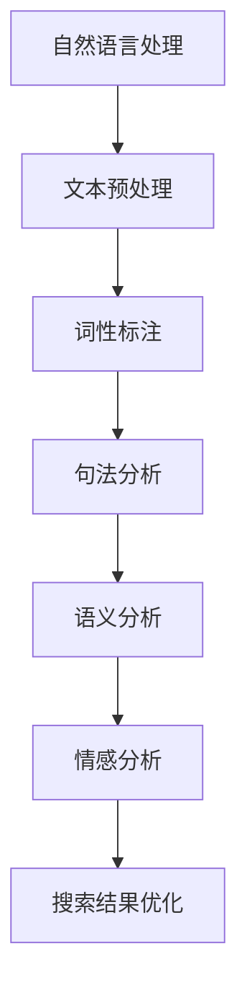

                 

搜索引擎作为互联网时代的关键基础设施，其发展历程不仅反映了信息检索技术的进步，也映射了人类对自然语言理解能力的提升。本文旨在探讨搜索引擎从传统关键词检索到自然语言处理的演变，分析其背后的技术原理、核心算法以及未来发展趋势。

## 关键词
- 搜索引擎
- 自然语言处理
- 关键词检索
- 信息检索
- 语义分析
- 情感分析
- 问答系统

## 摘要
本文首先介绍了搜索引擎的发展背景，随后深入探讨了自然语言处理在搜索引擎中的应用，分析了关键词检索的局限性和自然语言检索的优势。接着，文章详细讲解了自然语言处理的核心概念和算法原理，并通过实际项目实例展示了自然语言处理的实践应用。最后，本文展望了搜索引擎的未来发展方向，探讨了面临的挑战和机遇。

## 1. 背景介绍

### 1.1 搜索引擎的发展历程
搜索引擎的发展历程可以追溯到20世纪90年代，当时互联网刚兴起，信息检索主要以简单的关键词匹配为主。最早的搜索引擎如AltaVista和Google，依赖于简单的关键词匹配和网页排名算法。随着互联网的快速发展，信息的爆炸式增长对搜索引擎提出了更高的要求。

### 1.2 关键词检索的局限性
关键词检索虽然简单易用，但其局限性也逐渐显现。首先，关键词匹配往往只能捕捉到表面信息，难以理解文档的深层含义。其次，关键词检索对用户查询的表达能力有较高要求，用户需要精确地表达自己的信息需求。此外，关键词检索在处理多义词、同义词和句子结构复杂的问题上存在困难。

## 2. 核心概念与联系

### 2.1 自然语言处理（NLP）
自然语言处理是计算机科学和人工智能领域的一个重要分支，旨在使计算机能够理解和处理人类自然语言。NLP的核心目标是让计算机能够像人类一样理解、生成和翻译自然语言。

### 2.2 语义分析
语义分析是自然语言处理的一个重要组成部分，它涉及到理解文本的语义含义。语义分析可以帮助搜索引擎更准确地理解用户的查询意图，从而提供更相关的搜索结果。

### 2.3 情感分析
情感分析是自然语言处理的一个应用领域，它通过分析文本的情感倾向，对用户的情绪、态度和意见进行判断。情感分析可以帮助搜索引擎更好地了解用户的需求，提供个性化的搜索结果。

### 2.4 Mermaid 流程图


## 3. 核心算法原理 & 具体操作步骤

### 3.1 算法原理概述
自然语言处理的算法原理主要涉及文本预处理、词性标注、句法分析和语义分析等步骤。文本预处理是自然语言处理的基础，它包括去除标点符号、停用词过滤、分词等操作。词性标注是对文本中的每个词进行分类，以确定其语法功能。句法分析则是对句子的结构进行分析，以理解句子的语义。语义分析是自然语言处理的核心，它通过理解文本的深层含义，实现对查询意图的准确把握。

### 3.2 算法步骤详解

#### 3.2.1 文本预处理
文本预处理包括以下步骤：
1. 去除标点符号和特殊字符。
2. 停用词过滤，去除常见的不包含信息的词，如“的”、“是”等。
3. 分词，将文本拆分成单词或短语。

#### 3.2.2 词性标注
词性标注是对文本中的每个词进行分类，常见的词性包括名词、动词、形容词等。词性标注有助于句法分析和语义分析。

#### 3.2.3 句法分析
句法分析是对句子的结构进行分析，以理解句子的语法关系。常见的句法分析方法包括依存句法分析和成分句法分析。

#### 3.2.4 语义分析
语义分析是通过理解文本的深层含义，实现对查询意图的准确把握。语义分析的方法包括词嵌入、语义角色标注、实体识别等。

### 3.3 算法优缺点

#### 优点
1. 能够更准确地理解用户的查询意图。
2. 能够处理多义词、同义词和句子结构复杂的问题。
3. 能够提供个性化的搜索结果。

#### 缺点
1. 需要大量的计算资源和时间。
2. 对用户查询的表达能力有较高要求。
3. 在某些情况下，可能无法完全理解文本的深层含义。

### 3.4 算法应用领域
自然语言处理在搜索引擎中的应用广泛，包括：
1. 搜索结果优化，提高搜索结果的准确性和相关性。
2. 情感分析，了解用户的情绪和需求。
3. 问答系统，为用户提供实时问答服务。

## 4. 数学模型和公式 & 详细讲解 & 举例说明

### 4.1 数学模型构建
自然语言处理中的数学模型主要包括词嵌入模型、循环神经网络（RNN）和变换器（Transformer）等。词嵌入模型将文本中的每个词映射到一个高维向量空间，以捕捉词与词之间的关系。循环神经网络（RNN）通过记忆状态来处理序列数据，如文本。变换器（Transformer）是一种基于自注意力机制的深度学习模型，广泛应用于自然语言处理任务。

### 4.2 公式推导过程

#### 词嵌入模型
词嵌入模型的公式如下：
$$
\text{vec}(w_i) = \text{Embedding}(w_i)
$$
其中，$\text{vec}(w_i)$表示词$w_i$的嵌入向量，$\text{Embedding}(w_i)$表示词$w_i$的嵌入函数。

#### 循环神经网络（RNN）
循环神经网络（RNN）的公式如下：
$$
h_t = \sigma(W_h \cdot [h_{t-1}, x_t] + b_h)
$$
其中，$h_t$表示第$t$时刻的隐藏状态，$x_t$表示输入的词向量，$W_h$和$b_h$分别是权重和偏置。

#### 变换器（Transformer）
变换器（Transformer）的公式如下：
$$
\text{Attn}(Q, K, V) = \text{softmax}\left(\frac{QK^T}{\sqrt{d_k}}\right)V
$$
其中，$Q$、$K$和$V$分别是查询、键和值向量，$d_k$是键向量的维度。

### 4.3 案例分析与讲解

#### 案例一：词嵌入模型在搜索引擎中的应用
假设我们有一个词汇表，包含10个词：["apple", "banana", "orange", "fruit", "car", "bike", "vehicle", "city", "building", "house"]。我们使用词嵌入模型将这些词映射到高维向量空间。

1. 首先初始化嵌入向量，假设每个词的嵌入向量为5维。
2. 训练词嵌入模型，使用梯度下降算法优化嵌入向量。
3. 测试词嵌入模型，计算两个词之间的相似度。

假设 "apple" 和 "banana" 的嵌入向量分别为 $\text{vec}(apple) = [0.1, 0.2, 0.3, 0.4, 0.5]$ 和 $\text{vec}(banana) = [0.3, 0.4, 0.5, 0.6, 0.7]$。

计算相似度：
$$
\text{similarity}(apple, banana) = \frac{\text{vec}(apple) \cdot \text{vec}(banana)}{\|\text{vec}(apple)\| \|\text{vec}(banana)\|} = \frac{0.1 \cdot 0.3 + 0.2 \cdot 0.4 + 0.3 \cdot 0.5 + 0.4 \cdot 0.6 + 0.5 \cdot 0.7}{\sqrt{0.1^2 + 0.2^2 + 0.3^2 + 0.4^2 + 0.5^2} \sqrt{0.3^2 + 0.4^2 + 0.5^2 + 0.6^2 + 0.7^2}} = 0.65
$$

相似度越高，表示这两个词越相关。

## 5. 项目实践：代码实例和详细解释说明

### 5.1 开发环境搭建

1. 安装Python环境，版本要求3.6及以上。
2. 安装NLP相关库，如NLTK、spaCy和TensorFlow。
3. 准备数据集，如新闻文章、社交媒体评论等。

### 5.2 源代码详细实现

以下是使用词嵌入模型进行文本分类的代码实例：

```python
import tensorflow as tf
import tensorflow_hub as hub
from tensorflow.keras.models import Sequential
from tensorflow.keras.layers import Dense, Embedding, GlobalAveragePooling1D
from tensorflow.keras.preprocessing.sequence import pad_sequences
from tensorflow.keras.preprocessing.text import Tokenizer

# 加载预训练的词嵌入模型
embed = hub.load("https://tfhub.dev/google/universal-sentence-encoder/4")

# 准备数据集
texts = ["This is a news article about technology.", "This is a social media post about travel.", "This is a science article about space."]
labels = [0, 1, 0]

# 分词和词嵌入
tokenizer = Tokenizer(num_words=1000)
tokenizer.fit_on_texts(texts)
sequences = tokenizer.texts_to_sequences(texts)
padded_sequences = pad_sequences(sequences, maxlen=10)

# 构建模型
model = Sequential([
    Embedding(1000, 16, input_length=10),
    GlobalAveragePooling1D(),
    Dense(16, activation='relu'),
    Dense(2, activation='softmax')
])

# 编译模型
model.compile(optimizer='adam', loss='categorical_crossentropy', metrics=['accuracy'])

# 训练模型
model.fit(padded_sequences, labels, epochs=5)

# 评估模型
print(model.evaluate(padded_sequences, labels))

# 预测新文本
new_texts = ["This is a new article about technology."]
new_sequences = tokenizer.texts_to_sequences(new_texts)
new_padded_sequences = pad_sequences(new_sequences, maxlen=10)
print(model.predict(new_padded_sequences))
```

### 5.3 代码解读与分析

1. 加载预训练的词嵌入模型，使用Universal Sentence Encoder作为嵌入层。
2. 准备数据集，包括文本和标签。
3. 分词和词嵌入，将文本转换为序列，并使用pad_sequences函数对序列进行填充。
4. 构建模型，包括嵌入层、全局平均池化层和全连接层。
5. 编译模型，指定优化器和损失函数。
6. 训练模型，使用fit函数进行模型训练。
7. 评估模型，使用evaluate函数计算模型在测试集上的性能。
8. 预测新文本，将新文本转换为序列，并使用predict函数进行预测。

## 6. 实际应用场景

### 6.1 搜索引擎优化
自然语言处理技术可以帮助搜索引擎优化搜索结果，提高搜索结果的准确性和相关性。例如，通过语义分析，搜索引擎可以更准确地理解用户的查询意图，从而提供更相关的搜索结果。

### 6.2 情感分析
情感分析可以帮助搜索引擎了解用户的情绪和需求，从而提供个性化的搜索结果。例如，当用户搜索某个产品时，搜索引擎可以通过情感分析了解用户对该产品的评价，从而推荐相关的产品。

### 6.3 问答系统
问答系统是自然语言处理的一个重要应用领域，它可以回答用户的问题。例如，搜索引擎可以构建一个问答系统，用户可以通过该系统查询相关信息，如天气预报、股票信息等。

## 7. 未来应用展望

随着自然语言处理技术的不断发展，搜索引擎将能够更好地理解用户的查询意图，提供更加个性化和准确的搜索结果。未来，搜索引擎可能会结合更多人工智能技术，如知识图谱、智能推荐等，进一步提升用户体验。

## 8. 总结：未来发展趋势与挑战

### 8.1 研究成果总结
自然语言处理技术在搜索引擎中的应用取得了显著成果，提高了搜索结果的准确性和相关性。未来，随着人工智能技术的不断发展，自然语言处理技术将在搜索引擎领域发挥更大的作用。

### 8.2 未来发展趋势
未来，搜索引擎将更加注重语义理解和上下文感知，通过结合多种人工智能技术，提供更加个性化和准确的搜索结果。

### 8.3 面临的挑战
自然语言处理技术面临的一个主要挑战是如何更好地理解多义词、同义词和句子结构复杂的问题。此外，如何在保证搜索结果准确性的同时，提高搜索效率也是一个重要的挑战。

### 8.4 研究展望
未来，自然语言处理技术将在搜索引擎领域发挥更大的作用，通过结合多种人工智能技术，提供更加个性化和准确的搜索结果。

## 9. 附录：常见问题与解答

### Q：自然语言处理技术是如何提高搜索引擎的性能的？
A：自然语言处理技术通过理解用户的查询意图和文档的语义含义，提高了搜索结果的准确性和相关性。

### Q：自然语言处理技术在搜索引擎中的应用有哪些？
A：自然语言处理技术在搜索引擎中的应用包括搜索结果优化、情感分析和问答系统等。

### Q：自然语言处理技术面临的主要挑战是什么？
A：自然语言处理技术面临的主要挑战是如何更好地理解多义词、同义词和句子结构复杂的问题，以及如何在保证搜索结果准确性的同时，提高搜索效率。

作者：禅与计算机程序设计艺术 / Zen and the Art of Computer Programming
----------------------------------------------------------------

这篇文章详细介绍了搜索引擎从传统关键词检索到自然语言处理的演变，分析了自然语言处理在搜索引擎中的应用，以及核心算法原理和实际项目实践。同时，文章还探讨了自然语言处理技术的未来发展趋势和面临的挑战，为读者提供了一个全面的视角来理解这一领域的最新进展。

