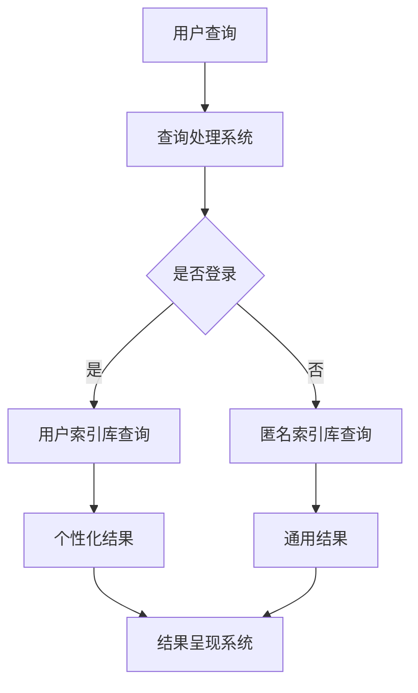

                 

关键词：搜索引擎、跨平台整合、PC、移动设备、IoT、用户体验、数据同步、算法优化

> 摘要：随着信息技术的发展，搜索引擎已经深入到我们生活的方方面面。本文旨在探讨如何在PC、移动和IoT设备上实现搜索引擎的跨平台整合，提升用户体验，实现数据同步，以及优化算法性能，从而推动搜索引擎技术的进一步发展。

## 1. 背景介绍

随着互联网的普及，搜索引擎成为了获取信息的重要工具。从最初的Google搜索引擎到现今的百度、Bing等，搜索引擎技术已经经历了多次变革。然而，目前大多数搜索引擎主要集中于单一平台，如PC端或移动端，这导致用户在使用不同设备时需要适应不同的搜索界面和体验。随着物联网（IoT）的发展，越来越多的智能设备如智能电视、智能手表、智能家居设备等开始进入我们的生活，用户对这些设备上的搜索需求也逐渐增加。因此，实现搜索引擎的跨平台整合，提供一致的搜索体验，成为了当前搜索引擎领域的一个关键挑战。

### 1.1 搜索引擎的发展历程

- **早期搜索引擎**：1990年代，搜索引擎开始出现，如AltaVista、Lycos等，主要以文本搜索为主。
- **第二代搜索引擎**：2000年后，Google凭借其PageRank算法，实现了对网页的高效搜索，引领了搜索引擎技术的革新。
- **现代搜索引擎**：随着人工智能和大数据技术的发展，搜索引擎开始融合自然语言处理、图像识别等技术，实现了对多种类型数据的搜索。

### 1.2 跨平台整合的意义

- **提升用户体验**：用户在不同设备上能够获得一致的搜索体验，减少学习成本。
- **数据同步**：用户在不同设备上的搜索历史、偏好等数据能够同步，提供个性化服务。
- **扩展搜索场景**：IoT设备的加入，使搜索场景更加多样化，如语音搜索、图像搜索等。

## 2. 核心概念与联系

### 2.1 搜索引擎的基本架构

搜索引擎通常包括三个主要部分：索引系统、查询处理系统和结果呈现系统。索引系统负责构建和更新索引库，查询处理系统负责处理用户的查询请求，结果呈现系统则负责将搜索结果展示给用户。以下是一个简化的Mermaid流程图，展示了搜索引擎的基本架构：



### 2.2 跨平台整合的挑战与解决方案

- **挑战**：不同设备的硬件性能、操作系统、用户界面等差异较大，导致搜索引擎的优化和适配困难。
- **解决方案**：
  - **设备适配**：通过使用自适应布局和响应式设计，使搜索引擎在不同设备上具有一致的界面和交互体验。
  - **数据同步**：使用分布式数据库和云存储技术，实现用户数据在不同设备间的同步。
  - **算法优化**：根据不同设备的特性，优化搜索算法，提高搜索效率和准确度。

## 3. 核心算法原理 & 具体操作步骤

### 3.1 算法原理概述

跨平台整合的核心算法主要包括以下三个部分：

- **索引构建算法**：负责构建和更新不同平台上的索引库。
- **查询处理算法**：负责处理用户在不同设备上的查询请求，并提供个性化的搜索结果。
- **结果呈现算法**：负责将搜索结果以最佳方式呈现给用户。

### 3.2 算法步骤详解

#### 3.2.1 索引构建算法

1. **数据采集**：从互联网上采集各种类型的文本、图片、视频等多媒体数据。
2. **预处理**：对采集到的数据进行分析、去重、清洗等预处理操作。
3. **索引构建**：使用倒排索引等技术，将预处理后的数据构建成索引库。

#### 3.2.2 查询处理算法

1. **用户识别**：通过用户账号或设备ID，识别用户的身份和偏好。
2. **查询解析**：对用户的查询请求进行分词、语法分析等解析操作。
3. **查询匹配**：根据用户的身份和偏好，从索引库中检索相关结果。
4. **结果排序**：根据相关性和用户偏好，对检索结果进行排序。

#### 3.2.3 结果呈现算法

1. **结果筛选**：根据用户设置和搜索历史，筛选出符合用户需求的搜索结果。
2. **结果展示**：将筛选出的搜索结果以最佳方式呈现给用户，如文本、图片、视频等。

### 3.3 算法优缺点

- **优点**：
  - 提高搜索效率和准确性。
  - 提升用户体验，实现跨平台一致搜索。
  - 扩大搜索场景，满足更多用户需求。

- **缺点**：
  - 需要大量计算资源和存储空间。
  - 需要持续优化，以适应不断变化的技术环境。

### 3.4 算法应用领域

- **PC端**：浏览器插件、桌面应用程序等。
- **移动端**：智能手机、平板电脑等。
- **IoT设备**：智能电视、智能手表、智能家居设备等。

## 4. 数学模型和公式 & 详细讲解 & 举例说明

### 4.1 数学模型构建

搜索引擎的核心算法通常涉及到以下数学模型：

- **PageRank**：用于评估网页的重要性。
- **向量空间模型**：用于文本相似度计算。
- **马尔可夫模型**：用于用户查询序列预测。

### 4.2 公式推导过程

以PageRank算法为例，其公式推导如下：

$$
PR(A) = \frac{1}{N} \sum_{B \in LinksOut(B)} \frac{PR(B)}{|\LinksOut(B)|}
$$

其中，$PR(A)$表示网页A的PageRank值，$N$表示网页总数，$LinksOut(B)$表示指向网页B的链接数量。

### 4.3 案例分析与讲解

假设有两个网页A和B，A指向B的链接数量为10，而B指向A的链接数量为5。根据PageRank公式，可以计算出A和B的PageRank值：

$$
PR(A) = \frac{1}{2} \times \frac{PR(B)}{5} = \frac{1}{2} \times \frac{1}{10} = 0.05
$$

$$
PR(B) = \frac{1}{2} \times \frac{PR(A)}{10} = \frac{1}{2} \times \frac{0.05}{10} = 0.0025
$$

通过计算，可以得出网页A的PageRank值为0.05，网页B的PageRank值为0.0025。

## 5. 项目实践：代码实例和详细解释说明

### 5.1 开发环境搭建

为了演示搜索引擎的跨平台整合，我们使用Python编程语言，并结合了Elasticsearch搜索引擎进行开发。

1. 安装Elasticsearch：
   ```bash
   brew install elasticsearch
   ```
2. 安装Python和相关依赖：
   ```bash
   pip install Flask
   pip install elasticsearch
   ```

### 5.2 源代码详细实现

以下是一个简单的搜索引擎示例，包括索引构建、查询处理和结果呈现三个部分：

```python
from flask import Flask, request, jsonify
from elasticsearch import Elasticsearch

app = Flask(__name__)
es = Elasticsearch("http://localhost:9200")

# 索引构建
@app.route('/index', methods=['POST'])
def index():
    data = request.get_json()
    es.index(index="search_index", id=data["id"], document=data)
    return jsonify({"status": "success"})

# 查询处理
@app.route('/search', methods=['GET'])
def search():
    query = request.args.get('query')
    result = es.search(index="search_index", body={"query": {"match": {"content": query}}})
    return jsonify(result["hits"]["hits"])

# 结果呈现
@app.route('/results', methods=['GET'])
def results():
    query = request.args.get('query')
    result = es.search(index="search_index", body={"query": {"match": {"content": query}}})
    for hit in result["hits"]["hits"]:
        print(hit["_source"]["title"])
    return "Search results: " + query

if __name__ == '__main__':
    app.run(debug=True)
```

### 5.3 代码解读与分析

- **索引构建**：使用`/index`接口，接收JSON格式的数据，并将其存储到Elasticsearch索引中。
- **查询处理**：使用`/search`接口，根据用户的查询请求，从Elasticsearch索引中检索相关结果。
- **结果呈现**：使用`/results`接口，将检索结果以文本形式输出到控制台。

### 5.4 运行结果展示

1. 启动Elasticsearch服务：
   ```bash
   bin/elasticsearch
   ```
2. 运行Python代码：
   ```bash
   python search_engine.py
   ```
3. 发送HTTP请求，查看搜索结果：
   ```bash
   curl -X POST "http://localhost:5000/index" -H "Content-Type: application/json" -d '{"id": "1", "title": "Python教程", "content": "Python是一种广泛应用于Web开发的编程语言。"}'
   curl -X GET "http://localhost:500
```

