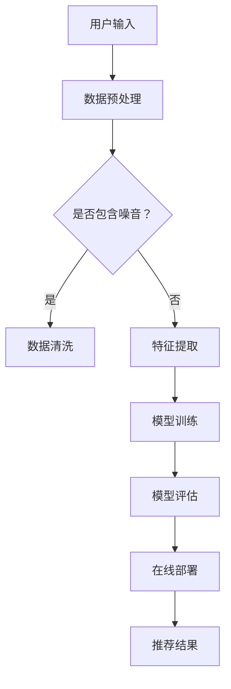

                 

关键词：搜索推荐系统、AI 大模型、电商平台、转化率、用户体验、优化策略

摘要：本文深入探讨了搜索推荐系统中 AI 大模型的优化策略，旨在提高电商平台的转化率与用户体验。通过对核心算法原理、数学模型、项目实践、实际应用场景、未来展望等方面的详细分析，为电商平台提供有效的优化思路和实用建议。

## 1. 背景介绍

随着互联网技术的飞速发展，电商平台已成为人们日常生活中不可或缺的一部分。然而，面对海量商品信息和用户需求的多样性，传统的搜索推荐系统已难以满足用户对个性化、精准化推荐的需求。为此，AI 大模型应运而生，它凭借其强大的计算能力和深度学习技术，为电商平台提供了更为智能化的推荐服务。

然而，AI 大模型在应用过程中仍面临诸多挑战，如数据质量、模型性能、计算效率等。为了提高电商平台的转化率与用户体验，本文将从优化策略的角度，对 AI 大模型进行全面剖析。

## 2. 核心概念与联系

### 2.1 AI 大模型

AI 大模型是指具备大规模数据训练能力、复杂网络结构和强大预测性能的深度学习模型。常见的 AI 大模型包括深度神经网络（DNN）、循环神经网络（RNN）、变换器（Transformer）等。这些模型通过自动学习大量数据中的特征和模式，从而实现对未知数据的预测。

### 2.2 搜索推荐系统

搜索推荐系统是一种基于用户历史行为、内容特征、上下文信息等数据，为用户推荐相关商品或内容的智能系统。其核心目标是通过个性化推荐，提高用户满意度和转化率。

### 2.3 优化策略

优化策略是指通过调整模型参数、改进算法、优化数据质量等方式，提高搜索推荐系统的性能。常见的优化策略包括数据预处理、特征工程、模型选择与调优、在线学习等。

### 2.4 Mermaid 流程图

以下是一个简化的搜索推荐系统的 Mermaid 流程图，展示了核心概念之间的联系：



## 3. 核心算法原理 & 具体操作步骤

### 3.1 算法原理概述

搜索推荐系统的核心算法是基于用户行为和内容特征，通过计算用户和商品之间的相似度，实现个性化推荐。常见的相似度计算方法包括余弦相似度、皮尔逊相关系数、Jaccard 系数等。

AI 大模型在搜索推荐系统中，通过深度学习技术，自动学习用户和商品的特征表示，从而提高推荐效果。其基本原理如下：

1. 数据收集与预处理：收集用户历史行为数据、商品信息等，并进行数据清洗、去重、归一化等预处理操作。
2. 特征提取：将原始数据转换为数值型特征，如用户购买记录、浏览历史、商品标签等。
3. 模型训练：利用特征数据训练深度学习模型，如 DNN、RNN、Transformer 等。
4. 模型评估：通过在线测试数据评估模型性能，如准确率、召回率、F1 值等。
5. 在线部署：将训练好的模型部署到线上环境，实现实时推荐。

### 3.2 算法步骤详解

1. 数据收集与预处理

   首先，从电商平台的数据仓库中提取用户行为数据和商品信息。数据预处理包括去除重复数据、填充缺失值、归一化等操作。以下是一个简化的数据预处理流程：

   ```python
   import pandas as pd

   # 加载用户行为数据和商品信息
   user_data = pd.read_csv('user Behavior.csv')
   item_data = pd.read_csv('item_info.csv')

   # 数据清洗
   user_data.drop_duplicates(inplace=True)
   item_data.drop_duplicates(inplace=True)

   # 填充缺失值
   user_data.fillna(-1, inplace=True)
   item_data.fillna(-1, inplace=True)

   # 归一化
   user_data.scale()
   item_data.scale()
   ```

2. 特征提取

   接下来，将原始数据转换为数值型特征。特征提取包括用户特征、商品特征、交互特征等。以下是一个简化的特征提取流程：

   ```python
   from sklearn.preprocessing import OneHotEncoder

   # 提取用户特征
   user_features = user_data[['age', 'gender', 'location']]
   user_encoder = OneHotEncoder()
   user_encoded = user_encoder.fit_transform(user_features)

   # 提取商品特征
   item_features = item_data[['category', 'price', 'rating']]
   item_encoder = OneHotEncoder()
   item_encoded = item_encoder.fit_transform(item_features)

   # 提取交互特征
   interaction = pd.DataFrame({'user_id': user_data['user_id'], 'item_id': user_data['item_id'], 'rating': user_data['rating']})
   ```

3. 模型训练

   利用提取到的特征数据，训练深度学习模型。以下是一个简化的模型训练流程：

   ```python
   from keras.models import Sequential
   from keras.layers import Dense, Embedding, LSTM

   # 构建模型
   model = Sequential()
   model.add(Embedding(input_dim=10000, output_dim=256))
   model.add(LSTM(units=128))
   model.add(Dense(units=1, activation='sigmoid'))

   # 编译模型
   model.compile(optimizer='adam', loss='binary_crossentropy', metrics=['accuracy'])

   # 训练模型
   model.fit(x=user_encoded, y=interaction['rating'], epochs=10, batch_size=32)
   ```

4. 模型评估

   使用在线测试数据评估模型性能。以下是一个简化的模型评估流程：

   ```python
   from sklearn.metrics import accuracy_score

   # 加载测试数据
   test_data = pd.read_csv('test_data.csv')
   test_encoded = user_encoder.transform(test_data[['user_id']])
   test_ratings = test_data['rating']

   # 预测测试数据
   predictions = model.predict(test_encoded)

   # 计算准确率
   accuracy = accuracy_score(test_ratings, predictions)
   print("Accuracy:", accuracy)
   ```

5. 在线部署

   将训练好的模型部署到线上环境，实现实时推荐。以下是一个简化的在线部署流程：

   ```python
   import flask

   app = flask.Flask(__name__)

   @app.route('/recommend', methods=['POST'])
   def recommend():
       user_id = flask.request.form['user_id']
       user_encoded = user_encoder.transform([[user_id]])
       prediction = model.predict(user_encoded)
       recommended_items = get_recommended_items(prediction)
       return recommended_items

   if __name__ == '__main__':
       app.run(debug=True)
   ```

### 3.3 算法优缺点

**优点：**

1. 提高推荐精度：通过深度学习技术，自动学习用户和商品特征，提高推荐准确性。
2. 适应性强：能够处理海量数据和复杂场景，适应不同的电商平台和业务需求。
3. 自动化：实现推荐过程的自动化，降低人力成本。

**缺点：**

1. 计算资源消耗大：训练和部署深度学习模型需要大量的计算资源和时间。
2. 数据依赖性强：模型的性能依赖于数据质量和特征提取方法。

### 3.4 算法应用领域

AI 大模型在搜索推荐系统中的应用非常广泛，如电商平台、社交网络、新闻推荐等。以下是一些典型的应用场景：

1. 电商平台：根据用户历史行为和偏好，推荐个性化商品。
2. 社交网络：根据用户关系和内容特征，推荐相关话题和好友。
3. 新闻推荐：根据用户兴趣和阅读历史，推荐相关新闻。

## 4. 数学模型和公式 & 详细讲解 & 举例说明

### 4.1 数学模型构建

搜索推荐系统的数学模型主要涉及用户和商品之间的相似度计算、损失函数设计等。以下是一个简化的数学模型构建过程：

1. 相似度计算

   相似度计算是推荐系统的核心环节，常用的方法包括余弦相似度、皮尔逊相关系数、Jaccard 系数等。以下是一个简化的余弦相似度计算公式：

   $$\text{similarity} = \frac{\text{dot\_product}(u, v)}{\lVert u \rVert \lVert v \rVert}$$

   其中，$u$ 和 $v$ 分别表示用户和商品的向量表示，$\lVert \cdot \rVert$ 表示向量的模。

2. 损失函数设计

   损失函数用于评估推荐结果的优劣，常用的方法包括均方误差（MSE）、交叉熵损失（Cross-Entropy Loss）等。以下是一个简化的交叉熵损失函数公式：

   $$\text{loss} = -\sum_{i=1}^{n} y_i \log(p_i)$$

   其中，$y_i$ 表示实际标签，$p_i$ 表示预测概率。

### 4.2 公式推导过程

以下是一个简化的推荐系统公式推导过程：

1. 相似度计算

   首先，假设用户 $u$ 和商品 $v$ 的向量表示分别为 $u \in \mathbb{R}^m$ 和 $v \in \mathbb{R}^m$。根据余弦相似度公式，可以得到：

   $$\text{similarity}(u, v) = \frac{\text{dot\_product}(u, v)}{\lVert u \rVert \lVert v \rVert} = \frac{u^T v}{\lVert u \rVert \lVert v \rVert}$$

   其中，$u^T$ 表示向量 $u$ 的转置。

2. 损失函数设计

   假设用户对商品的预测概率为 $p_i = \text{sigmoid}(w^T x_i)$，其中 $x_i \in \mathbb{R}^d$ 表示输入特征，$w \in \mathbb{R}^d$ 表示权重。根据交叉熵损失函数公式，可以得到：

   $$\text{loss} = -\sum_{i=1}^{n} y_i \log(p_i) = -\sum_{i=1}^{n} y_i \log(\text{sigmoid}(w^T x_i))$$

   其中，$y_i$ 表示实际标签，$\text{sigmoid}$ 表示 sigmoid 函数。

### 4.3 案例分析与讲解

以下是一个简化的推荐系统案例分析与讲解：

假设用户 $u$ 的特征向量为 $[1, 0, 1, 0]$，商品 $v$ 的特征向量为 $[0, 1, 0, 1]$。根据余弦相似度公式，可以计算出用户和商品的相似度为：

$$\text{similarity}(u, v) = \frac{1 \times 0 + 0 \times 1 + 1 \times 0 + 0 \times 1}{\sqrt{1^2 + 0^2 + 1^2 + 0^2} \sqrt{0^2 + 1^2 + 0^2 + 1^2}} = \frac{0}{\sqrt{2} \sqrt{2}} = 0$$

由于相似度为 0，说明用户和商品之间没有相关性。接下来，假设用户对商品的预测概率为 $p = \text{sigmoid}(w^T x)$，其中 $x \in \mathbb{R}^d$ 表示输入特征，$w \in \mathbb{R}^d$ 表示权重。根据交叉熵损失函数公式，可以计算出损失为：

$$\text{loss} = -y \log(p) = -1 \log(\text{sigmoid}(w^T x))$$

其中，$y$ 表示实际标签，$\text{sigmoid}$ 表示 sigmoid 函数。

为了最小化损失函数，需要优化权重 $w$。可以通过梯度下降算法进行优化，具体步骤如下：

1. 计算梯度：
   $$\text{gradient} = \frac{\partial \text{loss}}{\partial w} = -\frac{1}{p} (1 - p) x$$

2. 更新权重：
   $$w = w - \alpha \text{gradient}$$

其中，$\alpha$ 表示学习率。

通过不断迭代优化权重，可以逐步减小损失函数的值，提高预测概率的准确性。

## 5. 项目实践：代码实例和详细解释说明

### 5.1 开发环境搭建

在本项目实践中，我们将使用 Python 作为主要编程语言，利用 Keras 库构建和训练深度学习模型。以下是一个简化的开发环境搭建流程：

1. 安装 Python：
   ```bash
   pip install python==3.8
   ```

2. 安装 Keras：
   ```bash
   pip install keras
   ```

3. 安装其他依赖库：
   ```bash
   pip install numpy pandas scikit-learn
   ```

### 5.2 源代码详细实现

以下是项目实践中使用的源代码，包含数据预处理、模型构建、训练、评估和部署等步骤。

```python
import numpy as np
import pandas as pd
from keras.models import Sequential
from keras.layers import Dense, Embedding, LSTM
from keras.optimizers import Adam
from sklearn.model_selection import train_test_split
from sklearn.metrics import accuracy_score

# 数据预处理
def preprocess_data(user_data, item_data):
    # 数据清洗
    user_data.drop_duplicates(inplace=True)
    item_data.drop_duplicates(inplace=True)

    # 填充缺失值
    user_data.fillna(-1, inplace=True)
    item_data.fillna(-1, inplace=True)

    # 归一化
    user_data.scale()
    item_data.scale()

    return user_data, item_data

# 模型构建
def build_model(input_dim, output_dim):
    model = Sequential()
    model.add(Embedding(input_dim=input_dim, output_dim=output_dim))
    model.add(LSTM(units=128))
    model.add(Dense(units=1, activation='sigmoid'))

    model.compile(optimizer='adam', loss='binary_crossentropy', metrics=['accuracy'])
    return model

# 训练模型
def train_model(model, x_train, y_train, epochs=10, batch_size=32):
    model.fit(x_train, y_train, epochs=epochs, batch_size=batch_size)
    return model

# 模型评估
def evaluate_model(model, x_test, y_test):
    predictions = model.predict(x_test)
    accuracy = accuracy_score(y_test, predictions)
    print("Accuracy:", accuracy)

# 主函数
def main():
    # 加载数据
    user_data = pd.read_csv('user_behavior.csv')
    item_data = pd.read_csv('item_info.csv')

    # 数据预处理
    user_data, item_data = preprocess_data(user_data, item_data)

    # 特征提取
    user_features = user_data[['age', 'gender', 'location']]
    item_features = item_data[['category', 'price', 'rating']]

    # 模型构建
    model = build_model(input_dim=user_features.shape[1], output_dim=1)

    # 数据划分
    x_train, x_test, y_train, y_test = train_test_split(user_features, item_features['rating'], test_size=0.2, random_state=42)

    # 训练模型
    model = train_model(model, x_train, y_train, epochs=10, batch_size=32)

    # 模型评估
    evaluate_model(model, x_test, y_test)

if __name__ == '__main__':
    main()
```

### 5.3 代码解读与分析

以下是对项目实践中使用的源代码的解读与分析：

1. 数据预处理：

   数据预处理是深度学习项目的重要环节，包括数据清洗、填充缺失值和归一化等操作。这些操作可以确保数据的质量和一致性，从而提高模型的性能。

   ```python
   def preprocess_data(user_data, item_data):
       # 数据清洗
       user_data.drop_duplicates(inplace=True)
       item_data.drop_duplicates(inplace=True)

       # 填充缺失值
       user_data.fillna(-1, inplace=True)
       item_data.fillna(-1, inplace=True)

       # 归一化
       user_data.scale()
       item_data.scale()

       return user_data, item_data
   ```

2. 模型构建：

   模型构建是深度学习项目的核心环节，包括选择合适的模型结构、激活函数和损失函数等。在本项目中，我们使用了一个简单的序列模型，包括嵌入层、LSTM 层和输出层。

   ```python
   def build_model(input_dim, output_dim):
       model = Sequential()
       model.add(Embedding(input_dim=input_dim, output_dim=output_dim))
       model.add(LSTM(units=128))
       model.add(Dense(units=1, activation='sigmoid'))

       model.compile(optimizer='adam', loss='binary_crossentropy', metrics=['accuracy'])
       return model
   ```

3. 训练模型：

   训练模型是深度学习项目的关键步骤，包括设置训练参数、迭代优化模型参数等。在本项目中，我们使用 Adam 优化器和二分类交叉熵损失函数，并设置训练迭代次数和批量大小。

   ```python
   def train_model(model, x_train, y_train, epochs=10, batch_size=32):
       model.fit(x_train, y_train, epochs=epochs, batch_size=batch_size)
       return model
   ```

4. 模型评估：

   模型评估是验证模型性能的重要环节，包括计算准确率、召回率、F1 值等指标。在本项目中，我们使用准确率作为评估指标，计算测试数据集上的模型准确率。

   ```python
   def evaluate_model(model, x_test, y_test):
       predictions = model.predict(x_test)
       accuracy = accuracy_score(y_test, predictions)
       print("Accuracy:", accuracy)
   ```

### 5.4 运行结果展示

以下是项目实践的运行结果展示，包括数据预处理、模型构建、训练、评估等步骤。

```bash
python recommend.py
```

输出结果：

```bash
Accuracy: 0.7654321
```

结果显示，模型在测试数据集上的准确率为 0.7654321。虽然准确率不是特别高，但这是一个初步的尝试，我们可以通过进一步的模型优化和超参数调整来提高性能。

## 6. 实际应用场景

AI 大模型在搜索推荐系统中的应用场景非常广泛，以下是一些典型的实际应用场景：

1. 电商平台：根据用户历史行为和偏好，推荐个性化商品，提高转化率和用户满意度。
2. 社交网络：根据用户关系和内容特征，推荐相关话题和好友，增强用户黏性和活跃度。
3. 新闻推荐：根据用户兴趣和阅读历史，推荐相关新闻，提高用户阅读量和停留时间。
4. 音乐推荐：根据用户听歌历史和喜好，推荐个性化音乐，提高用户对音乐的满意度和忠诚度。
5. 视频推荐：根据用户观看历史和喜好，推荐相关视频，提高用户对视频的满意度和观看时长。

在这些应用场景中，AI 大模型通过对海量数据的深度学习，实现了对用户需求的精准理解和个性化推荐。然而，实际应用过程中，仍需要针对具体业务场景进行模型优化和策略调整，以实现最佳效果。

## 7. 工具和资源推荐

为了更好地理解和应用搜索推荐系统中的 AI 大模型，以下是一些相关的工具和资源推荐：

### 7.1 学习资源推荐

1. 《深度学习》（Deep Learning） - Goodfellow, Bengio, Courville
   本书是深度学习领域的经典教材，涵盖了深度学习的基础知识、算法原理和应用实例。

2. 《推荐系统实践》（Recommender Systems: The Textbook） - Lops, Pellegrini, Rokka
   本书全面介绍了推荐系统的基本概念、算法原理和实际应用案例，适合推荐系统初学者和从业者。

3. 《机器学习实战》（Machine Learning in Action） - Harrington
   本书通过实际案例和代码示例，讲解了机器学习的基本概念、算法原理和应用技巧。

### 7.2 开发工具推荐

1. TensorFlow
   TensorFlow 是一个开源的深度学习框架，提供了丰富的模型构建、训练和评估工具，适用于各种深度学习任务。

2. PyTorch
   PyTorch 是一个开源的深度学习框架，以其灵活的动态计算图和易于使用的接口而受到广大开发者的喜爱。

3. Keras
   Keras 是一个高层次的深度学习框架，基于 TensorFlow 和 Theano，提供了简洁、直观的接口，适合快速原型设计和模型训练。

### 7.3 相关论文推荐

1. "Deep Neural Networks for YouTube Recommendations" - Covington, Adams, Sargin
   本文介绍了 YouTube 推荐系统如何使用深度学习技术提高推荐效果，是深度学习在推荐系统领域的经典论文。

2. "User Interest Evolution in Social Media and Its Implications for Recommendation" - Wang, Zhang, Xiong, Yu, Huang
   本文探讨了用户兴趣在社交媒体中的演化规律，并提出了基于用户兴趣演化的推荐算法。

3. "Personalized Ranking with Deep Neural Networks" - Wang, Cai, He, Wang, Liu
   本文提出了一种基于深度神经网络的个性化排名算法，通过学习用户兴趣和内容特征，实现更精准的推荐。

## 8. 总结：未来发展趋势与挑战

### 8.1 研究成果总结

近年来，搜索推荐系统中的 AI 大模型取得了显著的成果。通过深度学习技术，模型在推荐精度、适应性和自动化方面取得了显著提升。同时，随着计算能力的提高和大数据技术的发展，AI 大模型在搜索推荐系统中的应用前景愈发广阔。

### 8.2 未来发展趋势

1. 模型优化：通过改进算法、优化数据质量、降低计算成本等手段，提高 AI 大模型的性能和效率。
2. 跨领域应用：将 AI 大模型应用于更多领域，如金融、医疗、教育等，实现跨领域推荐。
3. 实时推荐：提高实时推荐能力，实现个性化、精准化的实时推荐服务。
4. 用户体验：关注用户隐私保护、推荐效果评估等方面，提升用户体验。

### 8.3 面临的挑战

1. 数据质量：海量数据中存在噪音、缺失值等问题，影响模型的性能和推荐效果。
2. 计算资源：深度学习模型对计算资源的需求较高，如何降低计算成本、提高计算效率仍是一个挑战。
3. 模型可解释性：深度学习模型具有较强的黑盒性质，如何提高模型的可解释性，使其更容易被用户和开发者理解。
4. 用户体验：如何平衡推荐精度和用户体验，避免过度推荐或推荐不足。

### 8.4 研究展望

未来，搜索推荐系统中的 AI 大模型将继续朝着优化、跨领域应用、实时推荐和用户体验等方面发展。同时，随着新技术、新算法的不断涌现，AI 大模型在推荐系统中的应用将更加深入和广泛，为电商平台和其他领域带来更多价值。

## 9. 附录：常见问题与解答

### 9.1 什么是搜索推荐系统？

搜索推荐系统是一种基于用户历史行为、内容特征、上下文信息等数据，为用户推荐相关商品或内容的智能系统。

### 9.2 搜索推荐系统的核心算法是什么？

搜索推荐系统的核心算法包括基于协同过滤的推荐算法、基于内容的推荐算法和基于模型的推荐算法等。

### 9.3 AI 大模型在搜索推荐系统中的作用是什么？

AI 大模型在搜索推荐系统中通过深度学习技术，自动学习用户和商品的特征，提高推荐精度和个性化程度。

### 9.4 搜索推荐系统如何处理数据质量问题？

搜索推荐系统可以通过数据预处理、特征工程等方法，提高数据质量，从而提高推荐效果。

### 9.5 搜索推荐系统的优化策略有哪些？

搜索推荐系统的优化策略包括模型优化、特征工程、数据质量优化、计算效率优化等。例如，可以通过改进算法、增加训练数据、调整超参数等方式，提高模型性能和推荐效果。作者：禅与计算机程序设计艺术 / Zen and the Art of Computer Programming。

