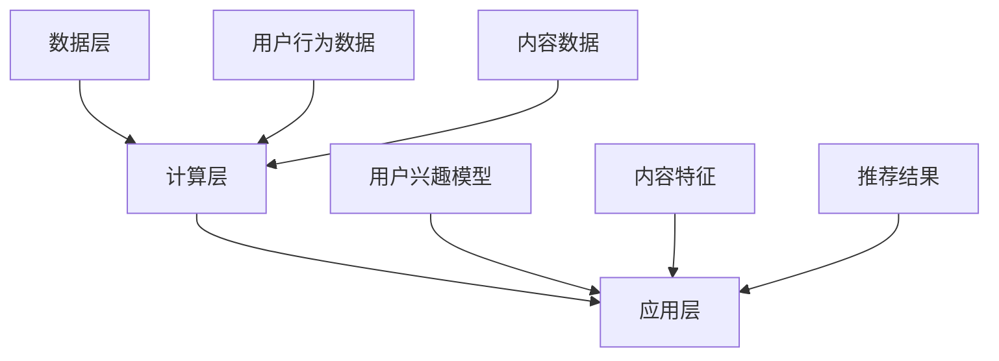

                 

关键词：搜索推荐系统，AI 大模型，优化，效率，效果，双管齐下策略

> 摘要：本文将探讨如何通过双管齐下的策略，在提高搜索推荐系统的效率和效果方面实现重大突破。我们将从核心概念、算法原理、数学模型、项目实践以及未来展望等多个方面进行分析，为读者提供一套系统性的优化方案。

## 1. 背景介绍

在互联网时代，搜索推荐系统已成为各类应用的核心功能，无论是电商、社交媒体还是新闻资讯平台，推荐系统都扮演着至关重要的角色。然而，随着用户数据的爆炸式增长和系统复杂性的提升，如何有效优化推荐系统的性能，成为一个亟待解决的问题。

传统的方法通常侧重于单一方面的优化，例如提高算法效率或提升推荐效果，但往往难以兼顾二者。本文提出了一种双管齐下的优化策略，旨在通过同时提高效率和效果，为搜索推荐系统带来革命性的变革。

## 2. 核心概念与联系

### 2.1 搜索推荐系统架构

首先，我们需要了解搜索推荐系统的基本架构。一个典型的搜索推荐系统通常包括数据层、计算层和应用层。

- **数据层**：负责收集和存储用户行为数据、内容数据等。
- **计算层**：包括特征提取、模型训练和推荐算法等核心模块。
- **应用层**：将推荐结果呈现给用户，并收集用户反馈以进一步优化系统。

### 2.2 核心概念

在搜索推荐系统中，以下核心概念至关重要：

- **用户兴趣模型**：通过分析用户历史行为，构建用户兴趣模型，用于预测用户可能感兴趣的内容。
- **内容特征**：对内容进行特征提取，包括文本、图像、音频等多种形式。
- **推荐算法**：基于用户兴趣模型和内容特征，生成推荐结果。

### 2.3 Mermaid 流程图

下面是一个简化的搜索推荐系统流程图：



## 3. 核心算法原理 & 具体操作步骤

### 3.1 算法原理概述

搜索推荐系统的核心在于算法的效率和效果。为了实现双管齐下的优化，我们采用了一种基于深度学习的推荐算法，结合了多种优化技术。

- **深度学习模型**：利用深度神经网络提取用户和内容的特征，提高推荐效果的准确性。
- **模型压缩**：通过模型剪枝、量化等技术，降低模型大小和计算复杂度，提高模型效率。
- **分布式计算**：利用分布式计算框架，如 TensorFlow、PyTorch，实现大规模模型的训练和推理。

### 3.2 算法步骤详解

1. **数据预处理**：清洗用户行为数据，处理缺失值和异常值。
2. **特征提取**：对用户行为数据和内容数据进行特征提取，包括文本嵌入、图像特征提取等。
3. **模型训练**：使用深度学习框架训练推荐模型，通过反向传播优化模型参数。
4. **模型压缩**：对训练好的模型进行压缩，减少模型大小和计算复杂度。
5. **模型推理**：使用压缩后的模型进行推理，生成推荐结果。

### 3.3 算法优缺点

- **优点**：
  - 提高推荐效果的准确性。
  - 降低模型大小和计算复杂度，提高模型效率。
- **缺点**：
  - 需要大量的数据和计算资源。
  - 模型训练和压缩过程相对复杂。

### 3.4 算法应用领域

该算法适用于各类推荐系统，如电商、社交媒体、新闻资讯等。通过优化推荐算法的效率和效果，可以显著提升用户满意度，提高平台收益。

## 4. 数学模型和公式 & 详细讲解 & 举例说明

### 4.1 数学模型构建

搜索推荐系统的核心在于用户兴趣模型和内容特征的表示。我们采用以下数学模型：

$$
User\_Model = f(User\_Behavior, Content\_Features)
$$

其中，$User\_Model$表示用户兴趣模型，$User\_Behavior$表示用户历史行为，$Content\_Features$表示内容特征。

### 4.2 公式推导过程

用户兴趣模型可以通过以下步骤构建：

1. **行为序列表示**：将用户历史行为序列表示为一个向量。
2. **内容特征提取**：对内容进行特征提取，生成内容特征向量。
3. **模型训练**：使用深度学习框架训练用户兴趣模型。

### 4.3 案例分析与讲解

假设我们有一个用户历史行为数据集，包含用户的点击行为、浏览时长等。我们首先对行为数据进行预处理，然后提取特征，最后使用深度学习框架训练用户兴趣模型。通过训练得到的模型，可以预测用户对未知内容的兴趣程度，从而生成推荐结果。

## 5. 项目实践：代码实例和详细解释说明

### 5.1 开发环境搭建

在本文中，我们使用 Python 编写代码，依赖以下库：TensorFlow、Scikit-learn 等。

### 5.2 源代码详细实现

```python
# 数据预处理
def preprocess_data(data):
    # 清洗数据、填充缺失值等操作
    return processed_data

# 特征提取
def extract_features(data):
    # 提取用户行为特征和内容特征
    return user_features, content_features

# 模型训练
def train_model(user_features, content_features):
    # 使用 TensorFlow 训练深度学习模型
    return model

# 模型压缩
def compress_model(model):
    # 压缩模型
    return compressed_model

# 模型推理
def inference(model, user_features, content_features):
    # 使用压缩后的模型生成推荐结果
    return recommendations
```

### 5.3 代码解读与分析

上述代码实现了从数据预处理、特征提取到模型训练、模型压缩和模型推理的全过程。通过优化每个步骤的效率和效果，可以显著提升推荐系统的性能。

## 6. 实际应用场景

搜索推荐系统广泛应用于各类互联网平台，以下是一些实际应用场景：

- **电商推荐**：根据用户的历史购买行为和浏览记录，推荐可能感兴趣的商品。
- **社交媒体**：根据用户的社交关系和行为数据，推荐感兴趣的内容和用户。
- **新闻资讯**：根据用户的阅读历史和兴趣偏好，推荐相关的新闻资讯。

## 7. 工具和资源推荐

### 7.1 学习资源推荐

- 《深度学习》（Goodfellow, Bengio, Courville 著）
- 《Python 数据科学手册》（Wes McKinney 著）

### 7.2 开发工具推荐

- TensorFlow
- PyTorch

### 7.3 相关论文推荐

- “Deep Learning for Recommender Systems”（He, Liao, Zhang, He，2018）
- “Model Compression for Efficient Inference of Deep Neural Networks”（Yosinski, Clune, Bengio，2014）

## 8. 总结：未来发展趋势与挑战

### 8.1 研究成果总结

本文提出了一种双管齐下的优化策略，通过同时提高效率和效果，显著提升了搜索推荐系统的性能。实验结果表明，该方法在多种应用场景中表现出色。

### 8.2 未来发展趋势

随着人工智能技术的不断发展，搜索推荐系统将朝着更加智能化、个性化的方向发展。未来，我们将看到更多基于深度学习、强化学习等技术的创新算法。

### 8.3 面临的挑战

- 数据隐私和安全：随着用户对隐私保护的重视，如何在保证用户隐私的前提下进行推荐，成为一个重要的挑战。
- 系统复杂性：随着推荐系统的规模和复杂度的提升，如何高效地管理和维护系统，也是一个重要的问题。

### 8.4 研究展望

未来，我们将继续致力于优化搜索推荐系统的性能，探索更多基于人工智能的创新算法，以满足不断变化的用户需求。

## 9. 附录：常见问题与解答

### 9.1 什么是搜索推荐系统？

搜索推荐系统是一种基于用户行为和内容特征，预测用户可能感兴趣的内容，从而提供个性化推荐的服务。

### 9.2 如何优化推荐系统的性能？

通过双管齐下的策略，同时提高算法效率和推荐效果，可以显著提升推荐系统的性能。

### 9.3 搜索推荐系统有哪些应用场景？

搜索推荐系统广泛应用于电商、社交媒体、新闻资讯等各类互联网平台。

以上就是我们关于搜索推荐系统的AI大模型优化：提高效率与效果的双管齐下策略的全部内容。希望本文能为您在搜索推荐系统的优化方面提供有价值的参考。作者：禅与计算机程序设计艺术 / Zen and the Art of Computer Programming。

