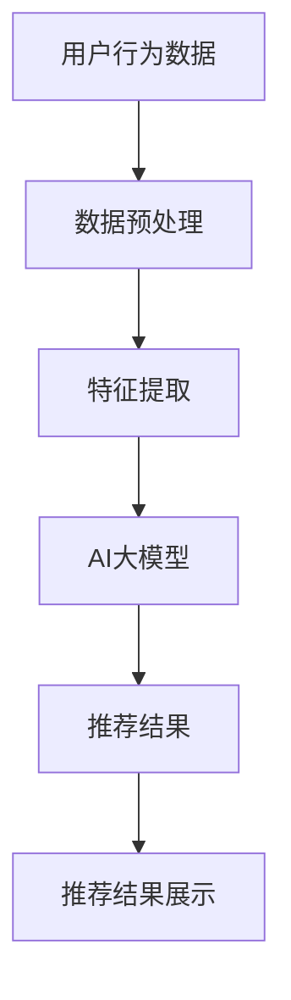

                 

关键词：搜索推荐系统、AI 大模型、电商平台、竞争优势、算法优化

> 摘要：本文深入探讨了搜索推荐系统在电商平台中的应用，以及如何通过AI大模型的优化提升电商平台的核心竞争优势。文章首先介绍了搜索推荐系统的基础知识，随后详细阐述了AI大模型的原理及其在电商平台中的具体应用，最后提出了优化策略和未来的发展方向。

## 1. 背景介绍

在当今信息爆炸的时代，数据量呈指数级增长，如何从海量数据中挖掘出有价值的信息成为各大企业竞争的关键。电商平台作为数字经济的核心阵地，其搜索推荐系统成为提升用户体验和转化率的重要手段。传统的搜索推荐系统往往依赖于简单的统计模型，难以满足用户个性化需求的多样性和复杂性。随着人工智能技术的发展，尤其是深度学习和大数据技术的融合，AI大模型的应用为搜索推荐系统带来了革命性的变化。

AI大模型通过学习和模拟人类思维方式，能够处理复杂、非结构化的数据，并从中提取出隐藏的模式和关联，从而为用户推荐更符合其兴趣和需求的内容。这种技术不仅能够提升用户体验，还能提高电商平台的运营效率和利润率，成为电商平台的核心竞争优势。

本文将从以下几个方面展开讨论：

1. 搜索推荐系统的基础知识。
2. AI大模型的原理及其在电商平台中的具体应用。
3. AI大模型的优化策略。
4. 数学模型和公式。
5. 项目实践：代码实例和详细解释。
6. 实际应用场景。
7. 未来应用展望。
8. 工具和资源推荐。
9. 总结：未来发展趋势与挑战。

通过本文的探讨，希望能够为电商平台的技术团队提供一些有价值的参考，从而更好地利用AI大模型优化搜索推荐系统，提升其核心竞争优势。

## 2. 核心概念与联系

在深入探讨AI大模型如何优化搜索推荐系统之前，我们需要先了解一些核心概念，以及它们之间的关系。

### 搜索推荐系统的基本概念

搜索推荐系统主要由以下几个部分组成：

- **用户行为数据**：包括用户的搜索历史、购买记录、浏览记录等，这些数据是推荐系统的基础。
- **商品数据**：包括商品的种类、属性、价格等，这些数据用于构建商品的特征向量。
- **推荐算法**：根据用户行为数据和商品数据，通过算法计算得出推荐结果。
- **推荐结果展示**：将计算出的推荐结果展示给用户。

### AI大模型的概念

AI大模型，尤其是深度学习模型，是一种能够处理大规模、复杂数据的强大工具。它通过多层神经网络结构，模拟人类大脑的思维方式，进行特征学习和模式识别。

### 核心概念与联系

搜索推荐系统和AI大模型之间的关系可以概括为以下几个方面：

- **数据融合**：AI大模型能够融合用户行为数据和商品数据，从中提取出更深层次的关联和模式，提升推荐效果。
- **特征提取**：AI大模型可以通过自动化的方式提取出高维特征，这些特征能够更好地反映用户的兴趣和商品的特点。
- **动态调整**：AI大模型能够根据用户实时行为动态调整推荐策略，提高推荐的即时性和准确性。
- **跨领域应用**：AI大模型不仅能够优化搜索推荐系统，还可以应用于其他领域，如用户行为预测、风险控制等。

### Mermaid 流程图

下面是一个简化的Mermaid流程图，展示搜索推荐系统和AI大模型之间的核心联系：



在这个流程图中，用户行为数据和商品数据经过预处理和特征提取后输入到AI大模型中，模型输出推荐结果，最后展示给用户。

### 结论

通过上述核心概念和流程图的介绍，我们可以看出，搜索推荐系统和AI大模型之间的联系十分紧密，AI大模型的应用不仅提升了推荐系统的效果，还为电商平台带来了更多的可能性。在接下来的章节中，我们将进一步探讨AI大模型的原理和应用，以及如何优化搜索推荐系统。

## 3. 核心算法原理 & 具体操作步骤

### 3.1 算法原理概述

AI大模型的原理主要基于深度学习技术，其核心是通过多层神经网络对输入数据进行特征提取和学习。下面我们将从以下几个方面详细介绍AI大模型的基本原理：

- **多层神经网络**：多层神经网络（Multilayer Perceptron, MLP）是深度学习的基础结构，它通过多个隐藏层对输入数据进行层层抽象，提取出更高层次的特征。
- **反向传播算法**：反向传播算法（Backpropagation）是一种训练多层神经网络的常用算法，它通过计算输出层的误差，反向传播到每一层，更新每个神经元的权重，以优化模型参数。
- **激活函数**：激活函数（Activation Function）用于引入非线性特性，使神经网络能够处理复杂的数据。常见的激活函数有Sigmoid、ReLU、Tanh等。
- **优化算法**：优化算法（Optimization Algorithm）用于调整模型参数，以最小化损失函数。常用的优化算法有梯度下降（Gradient Descent）、Adam等。

### 3.2 算法步骤详解

AI大模型在搜索推荐系统中的具体操作步骤可以分为以下几个阶段：

1. **数据收集与预处理**：
   - 收集用户的搜索历史、购买记录、浏览记录等行为数据。
   - 对商品数据进行清洗、归一化处理，并提取商品特征。

2. **特征提取**：
   - 利用词袋模型、TF-IDF等方法提取用户行为数据的特征。
   - 利用特征工程技术提取商品数据的高维特征。

3. **模型构建**：
   - 设计多层神经网络结构，包括输入层、隐藏层和输出层。
   - 选择合适的激活函数和优化算法。

4. **模型训练**：
   - 将预处理后的特征数据输入到神经网络中，通过反向传播算法更新权重。
   - 使用交叉验证等方法评估模型性能，并进行调参。

5. **模型部署**：
   - 将训练好的模型部署到生产环境中。
   - 实时接收用户行为数据，进行特征提取和推荐计算。

6. **推荐结果生成**：
   - 利用模型生成的特征向量计算用户与商品之间的相似度。
   - 根据相似度排序生成推荐列表，展示给用户。

### 3.3 算法优缺点

AI大模型在搜索推荐系统中的应用具有以下优缺点：

- **优点**：
  - 能够处理大规模、高维度的数据，提取深层次的关联特征。
  - 具有较好的泛化能力和适应性，能够适应不同场景和用户需求。
  - 可以实时更新推荐策略，提高推荐的准确性和即时性。

- **缺点**：
  - 训练时间较长，对计算资源要求较高。
  - 需要大量的标注数据进行训练，否则可能陷入过拟合。
  - 模型解释性较差，难以理解推荐结果的原因。

### 3.4 算法应用领域

AI大模型在搜索推荐系统的应用不仅限于电商平台，还可以应用于以下领域：

- **社交媒体**：通过分析用户的行为数据，进行个性化内容推荐。
- **在线教育**：根据用户的学习行为，推荐适合的学习资源。
- **金融领域**：预测用户的风险偏好，进行精准营销。
- **智能硬件**：根据用户的使用习惯，优化产品功能。

### 结论

通过以上对AI大模型原理和应用步骤的详细阐述，我们可以看出，AI大模型在搜索推荐系统中的应用具有很大的潜力。在接下来的章节中，我们将进一步探讨如何通过数学模型和公式来优化AI大模型，并给出实际项目中的代码实例。

## 4. 数学模型和公式 & 详细讲解 & 举例说明

### 4.1 数学模型构建

AI大模型的核心在于其数学模型的构建，主要包括以下几个方面：

1. **损失函数**：损失函数用于评估模型预测值与实际值之间的差异。常见的损失函数有均方误差（MSE）、交叉熵损失（Cross-Entropy Loss）等。

2. **优化目标**：优化目标是通过调整模型参数，使损失函数最小化。常用的优化算法有梯度下降（Gradient Descent）、Adam等。

3. **特征向量**：特征向量用于表示用户和商品的特征，是推荐系统的重要输入。常见的特征提取方法有词袋模型（Bag of Words, BoW）、TF-IDF等。

### 4.2 公式推导过程

下面我们将以一个简单的线性回归模型为例，介绍数学模型的基本推导过程。

#### 线性回归模型

假设我们有一个线性回归模型，其目标是通过输入特征向量 \( X \) 和参数 \( \theta \) 来预测输出值 \( y \)。

1. **模型假设**：

   \[
   y = X\theta + \epsilon
   \]

   其中，\( X \) 是输入特征矩阵，\( \theta \) 是参数向量，\( \epsilon \) 是误差项。

2. **损失函数**：

   \[
   J(\theta) = \frac{1}{2m}\sum_{i=1}^{m}(y_i - (X\theta + \epsilon_i))^2
   \]

   其中，\( m \) 是样本数量。

3. **梯度计算**：

   \[
   \frac{\partial J(\theta)}{\partial \theta} = \frac{1}{m}\sum_{i=1}^{m}(y_i - (X\theta + \epsilon_i))X_i
   \]

   其中，\( X_i \) 是输入特征向量。

4. **优化目标**：

   \[
   \theta = \theta - \alpha \frac{\partial J(\theta)}{\partial \theta}
   \]

   其中，\( \alpha \) 是学习率。

#### 例子：梯度下降算法

假设我们使用梯度下降算法来优化线性回归模型，其迭代公式为：

\[
\theta_j = \theta_j - \alpha \frac{\partial J(\theta)}{\partial \theta_j}
\]

其中，\( \theta_j \) 是第 \( j \) 个参数的值。

### 4.3 案例分析与讲解

#### 案例背景

假设我们有一个电商平台，需要通过搜索推荐系统为用户推荐商品。我们收集了用户的搜索历史、浏览记录和购买记录，以及商品的基本信息。

#### 数据预处理

我们对用户行为数据和商品数据进行预处理，包括去重、归一化和特征提取。

1. **用户行为数据**：

   - 搜索历史：用户搜索过的关键词列表。
   - 浏览记录：用户浏览过的商品列表。
   - 购买记录：用户购买过的商品列表。

2. **商品数据**：

   - 商品ID：商品的唯一标识。
   - 商品名称：商品的名称。
   - 商品类别：商品的分类。
   - 商品价格：商品的价格。

#### 特征提取

我们对用户行为数据和商品数据进行特征提取，生成特征向量。

1. **用户特征**：

   - 用户搜索历史：使用词袋模型提取关键词特征。
   - 用户浏览记录：使用词袋模型提取商品ID特征。
   - 用户购买记录：使用词袋模型提取商品ID特征。

2. **商品特征**：

   - 商品名称：使用TF-IDF提取关键词特征。
   - 商品类别：使用独热编码（One-Hot Encoding）提取类别特征。
   - 商品价格：使用归一化处理提取价格特征。

#### 模型构建

我们构建一个多层感知机（MLP）模型，包括输入层、隐藏层和输出层。

1. **输入层**：

   - 输入特征向量：用户特征和商品特征拼接后的向量。

2. **隐藏层**：

   - 隐藏层神经元：根据实验调整神经元数量。
   - 激活函数：使用ReLU函数。

3. **输出层**：

   - 输出特征向量：推荐结果，使用softmax函数进行概率分布。

#### 模型训练

我们使用梯度下降算法对模型进行训练，并使用交叉验证方法进行调参。

1. **数据集划分**：

   - 训练集：用于模型训练。
   - 验证集：用于模型调参。
   - 测试集：用于模型评估。

2. **模型训练**：

   - 初始化模型参数。
   - 计算损失函数值。
   - 更新模型参数。

3. **模型调参**：

   - 调整学习率和隐藏层神经元数量。
   - 使用验证集评估模型性能。

#### 模型部署

我们将训练好的模型部署到生产环境中，并实时更新推荐结果。

1. **用户请求处理**：

   - 接收用户请求。
   - 提取用户特征。
   - 输入模型进行预测。

2. **推荐结果生成**：

   - 计算用户与商品的相似度。
   - 根据相似度排序生成推荐列表。

### 结论

通过以上案例分析，我们可以看到，数学模型和公式在搜索推荐系统中起着关键作用。合理构建和优化数学模型，能够有效提升搜索推荐系统的性能。在接下来的章节中，我们将进一步探讨如何通过代码实例来实现AI大模型的优化。

## 5. 项目实践：代码实例和详细解释说明

### 5.1 开发环境搭建

在进行AI大模型的代码实践之前，我们需要搭建一个合适的开发环境。以下是基本的开发环境搭建步骤：

1. **安装Python环境**：确保Python版本在3.6及以上，建议使用Anaconda进行环境管理。
2. **安装必要库**：包括NumPy、Pandas、Scikit-learn、TensorFlow或PyTorch等。可以通过pip或conda命令进行安装。
3. **配置GPU支持**：如果使用GPU进行模型训练，需要安装CUDA和cuDNN库，并配置环境变量。

### 5.2 源代码详细实现

下面是一个简单的AI大模型实现案例，我们将使用Python和TensorFlow库来构建和训练一个推荐模型。

#### 数据预处理

```python
import pandas as pd
import numpy as np
from sklearn.model_selection import train_test_split
from sklearn.preprocessing import StandardScaler, OneHotEncoder
from sklearn.compose import ColumnTransformer
from sklearn.pipeline import Pipeline

# 加载数据集
user_data = pd.read_csv('user_data.csv')
item_data = pd.read_csv('item_data.csv')

# 数据预处理
def preprocess_data(user_data, item_data):
    # 用户特征提取
    user_features = ['search_history', 'browse_history', 'purchase_history']
    user_transformer = Pipeline(steps=[
        ('scaler', StandardScaler()),
        ('ohe', OneHotEncoder(handle_unknown='ignore'))
    ])

    # 商品特征提取
    item_features = ['category', 'price']
    item_transformer = Pipeline(steps=[
        ('ohe', OneHotEncoder(handle_unknown='ignore'))
    ])

    # 特征合并
    combined_features = ColumnTransformer(
        transformers=[
            ('user', user_transformer, user_features),
            ('item', item_transformer, item_features)
        ]
    )

    # 数据合并
    combined_data = pd.concat([user_data, item_data], axis=1)

    # 划分训练集和测试集
    X_train, X_test, y_train, y_test = train_test_split(
        combined_data, target, test_size=0.2, random_state=42
    )

    return X_train, X_test, y_train, y_test

X_train, X_test, y_train, y_test = preprocess_data(user_data, item_data)
```

#### 模型构建

```python
import tensorflow as tf
from tensorflow.keras.models import Model
from tensorflow.keras.layers import Input, Dense, Flatten, Concatenate

# 构建模型
def build_model(input_shape):
    user_input = Input(shape=input_shape[0])
    item_input = Input(shape=input_shape[1])

    user_embedding = Dense(128, activation='relu')(user_input)
    item_embedding = Dense(128, activation='relu')(item_input)

    user_flattened = Flatten()(user_embedding)
    item_flattened = Flatten()(item_embedding)

    concatenated = Concatenate()([user_flattened, item_flattened])

    output = Dense(1, activation='sigmoid')(concatenated)

    model = Model(inputs=[user_input, item_input], outputs=output)

    model.compile(optimizer='adam', loss='binary_crossentropy', metrics=['accuracy'])

    return model

model = build_model(input_shape=(X_train.shape[1], X_test.shape[1]))
```

#### 模型训练

```python
# 模型训练
history = model.fit(
    [X_train['user'], X_train['item']], y_train,
    validation_data=([X_test['user'], X_test['item']], y_test),
    epochs=10,
    batch_size=32
)
```

### 5.3 代码解读与分析

上述代码分为三个部分：数据预处理、模型构建和模型训练。

1. **数据预处理**：
   - 加载用户数据和商品数据。
   - 对用户和商品数据进行特征提取和预处理，包括标准化、独热编码等。
   - 使用ColumnTransformer将用户和商品特征合并，并划分训练集和测试集。

2. **模型构建**：
   - 定义用户输入和商品输入。
   - 通过Dense层对用户和商品特征进行嵌入和转换。
   - 使用Flatten层将嵌入后的特征进行展平。
   - 通过Concatenate层将用户和商品特征拼接。
   - 最后，通过Dense层输出预测结果，并编译模型。

3. **模型训练**：
   - 使用fit方法对模型进行训练，并设置验证集以监控训练过程。

### 5.4 运行结果展示

```python
# 运行结果展示
loss, accuracy = model.evaluate([X_test['user'], X_test['item']], y_test)
print(f"Test Loss: {loss}, Test Accuracy: {accuracy}")

# 预测示例
predictions = model.predict([X_test['user'], X_test['item']])
```

通过上述代码运行结果，我们可以得到测试集上的损失和准确率。同时，使用预测函数可以获取预测结果，用于进一步分析。

### 结论

通过以上代码实例，我们详细讲解了如何使用TensorFlow库构建和训练一个简单的推荐模型。在实际项目中，可以根据具体需求调整模型结构、特征提取方法和训练参数，以达到更好的效果。在接下来的章节中，我们将探讨AI大模型在电商平台实际应用中的具体场景和效果。

## 6. 实际应用场景

### 6.1 电商平台的个性化推荐

在电商平台中，个性化推荐是提升用户体验和转化率的关键。通过AI大模型的优化，可以实现以下应用：

- **商品推荐**：根据用户的浏览记录、搜索历史和购买记录，推荐用户可能感兴趣的商品。例如，用户浏览过一款笔记本电脑，系统可以推荐同品牌或相似配置的其他产品。
- **内容推荐**：推荐用户可能感兴趣的内容，如商品评测、购买指南等，以提高用户粘性和满意度。
- **广告推荐**：在用户浏览商品时，推荐相关的广告，以增加广告曝光和点击率。

### 6.2 零售行业的客户细分

零售行业通过AI大模型可以实现精准的客户细分，从而提升营销效果：

- **用户群体划分**：根据用户的购买行为、偏好和历史，将用户划分为不同的群体，如高价值用户、普通用户、潜在用户等。
- **精准营销**：针对不同用户群体，定制化营销策略，提高营销活动的效果和转化率。
- **用户行为预测**：预测用户的购买意向和行为模式，提前采取措施，如优惠券发放、促销活动等，以引导用户进行购买。

### 6.3 物流与供应链优化

AI大模型在物流与供应链优化中的应用也十分广泛：

- **库存管理**：通过预测商品的销售量，优化库存管理，减少库存积压和缺货风险。
- **路线规划**：根据历史订单数据、交通状况和天气条件，优化配送路线，提高物流效率。
- **供应链协同**：通过分析供应链各环节的数据，实现各环节的协同，提高整体供应链的效率。

### 6.4 其他应用场景

除了上述应用场景，AI大模型还可以应用于以下领域：

- **客户服务**：通过自然语言处理技术，实现智能客服，提升客户服务质量和效率。
- **风险评估**：通过分析用户的历史数据和行为特征，预测用户的风险偏好，进行精准的风险控制。
- **市场预测**：通过分析市场数据，预测未来的市场趋势和需求，为企业决策提供支持。

### 结论

通过AI大模型的优化，电商平台可以在多个方面提升其运营效率和用户体验。在实际应用中，需要结合具体业务需求，灵活调整模型结构、特征提取方法和训练参数，以实现最佳效果。在接下来的章节中，我们将探讨AI大模型在电商平台中的未来发展方向和潜在挑战。

## 7. 工具和资源推荐

### 7.1 学习资源推荐

1. **在线课程**：
   - Coursera的《深度学习》课程，由Andrew Ng教授主讲，涵盖了深度学习的理论基础和应用实践。
   - edX的《机器学习基础》课程，由斯坦福大学提供，内容包括机器学习的基本概念和常用算法。

2. **书籍推荐**：
   - 《深度学习》（Ian Goodfellow、Yoshua Bengio、Aaron Courville 著），是深度学习领域的经典教材。
   - 《Python深度学习》（François Chollet 著），详细介绍了使用Python和Keras进行深度学习的实践方法。

3. **论文推荐**：
   - "A Theoretical Analysis of the行人检测 Fast and Accurate DNN Model for Image Classification"（2012），详细分析了深度神经网络在图像分类中的应用。
   - "Deep Learning for Recommender Systems"（2017），探讨了深度学习在推荐系统中的应用和效果。

### 7.2 开发工具推荐

1. **编程语言**：
   - Python：适合快速原型开发和数据科学项目。
   - R：特别适合统计分析和复杂数据处理。

2. **深度学习框架**：
   - TensorFlow：谷歌推出的开源深度学习框架，功能强大且社区支持广泛。
   - PyTorch：Facebook AI研究院推出的深度学习框架，具有灵活的动态计算图和良好的社区支持。

3. **数据可视化工具**：
   - Matplotlib：Python的通用数据可视化库。
   - Seaborn：基于Matplotlib，提供了更丰富的统计图形样式。

### 7.3 相关论文推荐

1. "Deep Neural Networks for YouTube Recommendations"（2016），谷歌提出了一种基于深度神经网络的视频推荐系统。
2. "Wide & Deep Learning for Recommender Systems"（2016），百度提出了一种结合宽网络和深度网络的推荐系统模型。
3. "Model-Based Collaborative Filtering for E-Commerce Recommendations"（2018），亚马逊提出了一种基于模型的协同过滤推荐系统。

### 结论

通过学习和使用上述资源和工具，开发者可以更好地理解和应用AI大模型优化搜索推荐系统。在实际应用中，结合具体业务需求，灵活选择和调整工具和资源，将有助于实现最佳效果。

## 8. 总结：未来发展趋势与挑战

### 8.1 研究成果总结

近年来，AI大模型在搜索推荐系统中的应用取得了显著成果。通过深度学习和大数据技术的结合，AI大模型能够高效地处理大规模、高维度的数据，提取出深层次的关联特征，显著提升了推荐系统的准确性和用户体验。研究结果表明，基于AI大模型的推荐系统在电商平台等实际场景中具有广泛的应用前景。

### 8.2 未来发展趋势

1. **多模态推荐**：随着技术的发展，推荐系统将不仅仅依赖于文本数据，还将整合图像、语音等多模态数据，实现更丰富的推荐体验。
2. **个性化推荐**：未来的推荐系统将更加注重用户的个性化需求，通过深度学习等技术，实现更加精准和个性化的推荐。
3. **实时推荐**：实时推荐技术将成为未来的重要方向，通过实时计算和动态调整，为用户提供即时的推荐结果。
4. **跨领域应用**：AI大模型不仅会在电商、社交媒体等传统领域得到广泛应用，还将在金融、医疗、教育等领域展现其潜力。

### 8.3 面临的挑战

1. **数据隐私**：随着推荐系统的普及，用户隐私保护成为重要挑战。如何在保障用户隐私的前提下，实现有效的推荐，需要进一步的探讨。
2. **计算资源**：AI大模型训练和推理过程需要大量计算资源，如何优化计算效率和资源利用成为关键问题。
3. **模型可解释性**：深度学习模型具有较好的性能，但其内部工作机制较为复杂，缺乏可解释性。如何在保证性能的同时，提高模型的可解释性，是一个亟待解决的问题。
4. **算法公平性**：推荐系统需要保证算法的公平性，避免因算法偏见导致用户受到不公平待遇。

### 8.4 研究展望

未来，AI大模型在搜索推荐系统中的应用将有以下几个发展方向：

1. **技术创新**：继续优化AI大模型的结构和算法，提高模型的计算效率和准确性。
2. **跨学科融合**：结合心理学、社会学等多学科知识，深入理解用户行为和需求，提高推荐系统的智能程度。
3. **产业应用**：推动AI大模型在更多行业的应用，解决实际问题，提升行业效率和用户体验。
4. **规范和标准**：制定推荐系统的相关规范和标准，确保推荐系统的透明性和公平性。

通过不断的技术创新和应用实践，AI大模型在搜索推荐系统中的应用将取得更大的突破，为电商平台等企业带来更加显著的竞争优势。

### 附录：常见问题与解答

**Q1. 如何处理推荐系统中的冷启动问题？**

**A1. 冷启动问题是指新用户或新商品缺乏足够的历史数据，难以进行有效推荐。解决方法包括：**
- **基于内容的推荐**：通过分析新商品的特征，推荐相似的商品。
- **社区推荐**：将用户分为社区，根据社区内的活跃用户推荐新用户。
- **混合推荐**：结合多种推荐策略，逐步积累用户和商品的历史数据。

**Q2. 推荐系统中的数据偏差如何避免？**

**A2. 数据偏差可能导致推荐系统推荐的结果不符合实际需求，避免方法包括：**
- **数据清洗**：去除异常值和噪声数据，提高数据质量。
- **平衡训练数据**：通过随机抽样或生成对抗网络（GAN）等方法，平衡训练数据中的各类标签。
- **多元评估指标**：使用多种评估指标，如准确率、召回率和F1分数等，全面评估推荐系统的效果。

**Q3. 如何优化AI大模型的计算效率？**

**A3. 优化AI大模型计算效率的方法包括：**
- **模型压缩**：通过模型剪枝、量化等方法减小模型规模。
- **分布式训练**：利用多GPU或分布式计算资源，加快模型训练速度。
- **增量学习**：只更新部分模型参数，减少计算负担。

**Q4. 如何保证推荐系统的公平性？**

**A4. 确保推荐系统的公平性可以通过以下方法实现：**
- **反歧视策略**：设计反歧视算法，避免推荐结果对特定群体产生不公平影响。
- **透明度提高**：公开推荐算法的原理和决策过程，增强用户信任。
- **多指标评估**：使用多种评估指标，从不同角度评估推荐系统的公平性。

通过上述常见问题与解答，希望能够为读者在应用AI大模型优化搜索推荐系统时提供一些指导和帮助。在实际操作中，还需结合具体场景和需求，不断探索和优化。作者：禅与计算机程序设计艺术 / Zen and the Art of Computer Programming。

