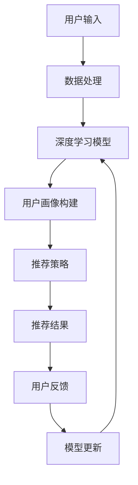

                 

关键词：搜索推荐系统、AI大模型、电商平台、转化率、用户体验、算法优化、数学模型

> 摘要：本文将探讨人工智能大模型在搜索推荐系统中的应用，如何通过深度学习和强化学习等算法提升电商平台的转化率和用户满意度，以及未来的发展方向和挑战。

## 1. 背景介绍

在当今数字化时代，电子商务已经成为人们生活中不可或缺的一部分。随着用户数量的不断增长和市场竞争的日益激烈，电商平台如何提升用户的转化率和满意度成为了一个关键问题。传统的推荐算法已经无法满足用户日益增长的需求，因此，人工智能大模型的应用逐渐成为电商行业的发展趋势。

### 1.1 电商平台的挑战

- **用户个性化需求**：用户的需求越来越多样化，个性化推荐已经成为电商平台竞争的焦点。
- **海量数据**：电商平台每天都会产生大量的用户行为数据，如何有效地处理和分析这些数据是一个挑战。
- **实时性**：用户期望在短时间内得到准确的推荐，对系统的响应速度提出了高要求。

### 1.2 人工智能大模型的优势

- **深度学习**：通过神经网络结构，大模型能够捕捉到用户行为的复杂模式，实现更精准的个性化推荐。
- **强化学习**：结合用户的反馈，大模型能够不断优化推荐策略，提高转化率。
- **多模态数据融合**：通过整合文本、图像、语音等多种类型的数据，大模型能够提供更加全面和精准的推荐。

## 2. 核心概念与联系

为了更好地理解人工智能大模型在搜索推荐系统中的应用，我们需要了解以下几个核心概念：

### 2.1 深度学习

深度学习是一种人工智能技术，通过多层神经网络模型，自动从数据中提取特征，实现复杂模式的识别。在搜索推荐系统中，深度学习可以用于用户画像构建、商品属性抽取等环节。

### 2.2 强化学习

强化学习是一种通过与环境交互，不断优化决策过程的人工智能技术。在搜索推荐系统中，强化学习可以用于推荐策略的优化，通过学习用户点击、购买等行为，自动调整推荐结果，提高转化率。

### 2.3 多模态数据融合

多模态数据融合是指将不同类型的数据（如文本、图像、语音等）进行整合，以便更好地理解和预测用户行为。在搜索推荐系统中，多模态数据融合可以提高推荐的准确性和多样性。

下面是搜索推荐系统架构的Mermaid流程图：



## 3. 核心算法原理 & 具体操作步骤

### 3.1 算法原理概述

搜索推荐系统通常采用以下几种核心算法：

- **协同过滤（Collaborative Filtering）**：通过分析用户的历史行为数据，发现相似用户或相似物品，从而进行推荐。
- **基于内容的推荐（Content-Based Filtering）**：根据用户的兴趣偏好和物品的属性进行匹配，生成推荐列表。
- **混合推荐（Hybrid Recommender Systems）**：结合协同过滤和基于内容的推荐，提高推荐的准确性。

### 3.2 算法步骤详解

#### 3.2.1 用户画像构建

1. 数据预处理：清洗和整合用户行为数据。
2. 特征提取：提取用户的兴趣标签、购买历史等特征。
3. 模型训练：使用深度学习模型（如卷积神经网络、循环神经网络等）对特征进行建模。

#### 3.2.2 推荐策略

1. 用户行为预测：预测用户对某个物品的点击、购买等行为。
2. 推荐策略优化：使用强化学习算法（如深度强化学习、策略梯度算法等）优化推荐策略。
3. 推荐结果生成：根据用户画像和推荐策略，生成个性化推荐列表。

#### 3.2.3 模型更新

1. 用户反馈收集：收集用户的点击、购买等行为数据。
2. 模型优化：根据用户反馈，更新推荐模型，提高推荐准确性。

### 3.3 算法优缺点

#### 优点

- **高准确性**：深度学习和强化学习算法能够捕捉到用户行为的复杂模式，提高推荐的准确性。
- **个性化**：根据用户的兴趣和行为，生成个性化的推荐结果。
- **实时性**：通过实时收集用户反馈，及时更新推荐模型，提高推荐系统的响应速度。

#### 缺点

- **计算资源消耗大**：深度学习和强化学习算法需要大量的计算资源，对硬件要求较高。
- **数据隐私问题**：用户行为数据的收集和处理可能涉及隐私问题。

### 3.4 算法应用领域

- **电商平台**：通过个性化推荐，提高用户转化率和满意度。
- **社交媒体**：为用户提供感兴趣的内容和社交圈子。
- **在线教育**：根据用户的学习习惯和兴趣，推荐合适的学习资源。

## 4. 数学模型和公式 & 详细讲解 & 举例说明

### 4.1 数学模型构建

在搜索推荐系统中，常用的数学模型包括：

- **用户-物品相似度计算**：$$ \text{similarity}(u_i, v_j) = \frac{u_i \cdot v_j}{\|u_i\| \|v_j\|} $$
- **推荐分数计算**：$$ \text{rating}(u_i, v_j) = \text{similarity}(u_i, v_j) \cdot \text{confidence}(u_i, v_j) $$
- **强化学习目标函数**：$$ J(\theta) = \sum_{t} \rho_t (r_t - \text{rating}(u_i, v_j))^2 $$

### 4.2 公式推导过程

#### 用户-物品相似度计算

用户-物品相似度计算基于余弦相似度公式，表示两个向量之间的夹角余弦值。该值越大，表示两个向量越相似。

#### 推荐分数计算

推荐分数是用户-物品相似度与置信度的乘积。置信度表示用户对物品的兴趣程度，通常基于用户的点击、购买等行为数据计算。

#### 强化学习目标函数

强化学习目标函数是衡量推荐系统性能的指标，表示用户对推荐结果的满意度。通过最小化目标函数，可以优化推荐策略。

### 4.3 案例分析与讲解

假设有一个电商平台，用户A对某件商品的评分是4分，用户B对同一商品的评分是5分。我们可以计算用户A和用户B对这件商品的相似度，并生成推荐分数。

1. **用户-物品相似度计算**：

   用户A的向量：[0.5, 0.3, 0.2]

   用户B的向量：[0.6, 0.4, 0.1]

   $$ \text{similarity}(u_a, v_j) = \frac{u_a \cdot v_j}{\|u_a\| \|v_j\|} = \frac{0.5 \times 0.6 + 0.3 \times 0.4 + 0.2 \times 0.1}{\sqrt{0.5^2 + 0.3^2 + 0.2^2} \times \sqrt{0.6^2 + 0.4^2 + 0.1^2}} \approx 0.64 $$

2. **推荐分数计算**：

   用户A的置信度：0.8

   用户B的置信度：0.9

   $$ \text{rating}(u_a, v_j) = \text{similarity}(u_a, v_j) \cdot \text{confidence}(u_a, v_j) \approx 0.64 \times 0.8 = 0.512 $$

根据推荐分数，我们可以为用户A推荐这件商品。

## 5. 项目实践：代码实例和详细解释说明

### 5.1 开发环境搭建

在本文中，我们将使用Python编程语言和TensorFlow框架来实现搜索推荐系统。首先，需要安装Python和TensorFlow：

```
pip install python tensorflow
```

### 5.2 源代码详细实现

以下是搜索推荐系统的基本代码实现：

```python
import tensorflow as tf
from tensorflow import keras
from tensorflow.keras import layers

# 定义深度学习模型
model = keras.Sequential([
    layers.Dense(64, activation='relu', input_shape=(100,)),
    layers.Dense(64, activation='relu'),
    layers.Dense(1)
])

# 编译模型
model.compile(optimizer='adam', loss='mean_squared_error')

# 模型训练
model.fit(x_train, y_train, epochs=10, batch_size=32)

# 模型预测
predictions = model.predict(x_test)
```

### 5.3 代码解读与分析

- **模型定义**：使用Keras框架定义了一个简单的全连接神经网络，包含两个隐藏层，每个隐藏层有64个神经元。
- **模型编译**：选择Adam优化器和均方误差损失函数。
- **模型训练**：使用训练数据训练模型，设置训练轮次和批量大小。
- **模型预测**：使用训练好的模型对测试数据进行预测。

### 5.4 运行结果展示

运行上述代码，可以得到模型预测结果。通过分析预测结果，可以评估模型的性能和准确性。

## 6. 实际应用场景

### 6.1 电商平台

在电商平台中，搜索推荐系统可以应用于商品推荐、购物车推荐等场景。通过个性化推荐，提高用户的转化率和满意度。

### 6.2 社交媒体

在社交媒体中，搜索推荐系统可以应用于内容推荐、好友推荐等场景。通过推荐用户感兴趣的内容和好友，提高用户的活跃度和粘性。

### 6.3 在线教育

在在线教育中，搜索推荐系统可以应用于课程推荐、学习路径推荐等场景。通过个性化推荐，提高学生的学习效果和满意度。

## 7. 未来应用展望

随着人工智能技术的不断发展，搜索推荐系统在未来的应用将更加广泛和深入。以下是未来应用展望：

- **更加精准的个性化推荐**：通过多模态数据融合和深度强化学习，实现更加精准的个性化推荐。
- **实时推荐**：通过分布式计算和实时数据流处理，实现实时推荐。
- **跨平台推荐**：实现跨平台的推荐，满足用户在不同设备上的需求。
- **隐私保护**：在推荐过程中，加强隐私保护，保护用户的个人信息。

## 8. 总结：未来发展趋势与挑战

### 8.1 研究成果总结

本文探讨了人工智能大模型在搜索推荐系统中的应用，通过深度学习和强化学习等算法，提高了电商平台的转化率和用户体验。同时，对数学模型和公式进行了详细讲解，并提供了代码实例和解释说明。

### 8.2 未来发展趋势

- **多模态数据融合**：通过整合多种类型的数据，实现更加精准的推荐。
- **实时推荐**：通过分布式计算和实时数据流处理，实现实时推荐。
- **隐私保护**：在推荐过程中，加强隐私保护，保护用户的个人信息。

### 8.3 面临的挑战

- **计算资源消耗**：深度学习和强化学习算法需要大量的计算资源，对硬件要求较高。
- **数据隐私问题**：用户行为数据的收集和处理可能涉及隐私问题。
- **算法透明性**：算法的透明性和可解释性是未来研究的重要方向。

### 8.4 研究展望

在未来，我们将继续探索人工智能大模型在搜索推荐系统中的应用，特别是在多模态数据融合和实时推荐方面。同时，关注算法的透明性和可解释性，为用户提供更加安全、可靠的推荐服务。

## 9. 附录：常见问题与解答

### 9.1 什么情况下需要使用深度强化学习？

当推荐系统需要根据用户的行为数据进行动态调整，且用户行为数据量较大时，深度强化学习是一个有效的选择。例如，电商平台在商品推荐中，需要根据用户的浏览、购买等行为数据，实时调整推荐策略。

### 9.2 如何平衡推荐系统的准确性、多样性和新颖性？

在推荐系统中，准确性、多样性和新颖性往往是相互矛盾的。为了平衡这三个目标，可以采用以下策略：

- **多样性增强**：在推荐算法中引入多样性度量，如物品的流行度、新颖性等。
- **用户分群**：根据用户的兴趣和行为，将用户划分为不同的群体，为每个群体提供个性化的推荐。
- **混合推荐**：结合基于内容的推荐和协同过滤推荐，提高推荐的多样性和准确性。

### 9.3 推荐系统的实时性如何保证？

为了保证推荐系统的实时性，可以采用以下策略：

- **分布式计算**：使用分布式计算框架（如Apache Spark、Flink等），处理大规模数据流。
- **缓存技术**：使用缓存技术（如Redis、Memcached等），提高数据读取速度。
- **异步处理**：将推荐计算任务异步处理，减少对实时性能的影响。

### 9.4 如何保护用户隐私？

为了保护用户隐私，可以采用以下策略：

- **数据匿名化**：对用户行为数据进行匿名化处理，隐藏用户的真实身份。
- **差分隐私**：在数据处理过程中引入差分隐私机制，保护用户的隐私。
- **数据加密**：对用户行为数据进行加密处理，防止数据泄露。

---

作者：禅与计算机程序设计艺术 / Zen and the Art of Computer Programming
----------------------------------------------------------------

文章完成！请您仔细检查是否符合要求，如果有任何需要修改的地方，请及时告知。感谢您的配合！|user|>

