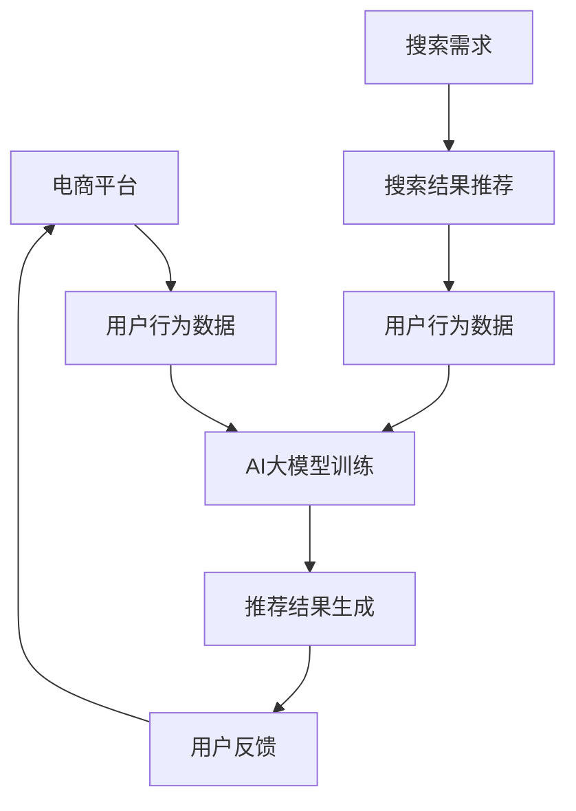
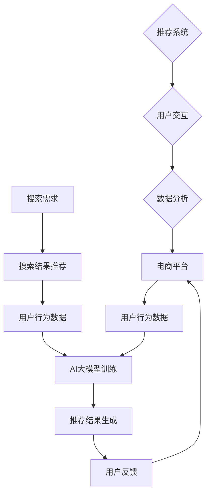

                 

## 1. 背景介绍

在数字化的浪潮中，电商平台已经成为现代社会不可或缺的一部分。随着消费者购物习惯的转变和电商市场的竞争日益激烈，提供个性化、高效的搜索推荐服务成为电商平台提升用户体验和竞争力的重要手段。传统的推荐系统主要依赖于基于内容的过滤和协同过滤算法，然而这些方法在面对大规模、动态变化的用户数据时存在明显的局限性。

近年来，人工智能技术的快速发展，特别是深度学习大模型的广泛应用，为搜索推荐系统带来了新的机遇。通过引入AI大模型，电商平台能够更好地理解用户行为和需求，实现更加精准和智能的推荐。这不仅有助于提升用户满意度，还能显著提高销售额和用户留存率。

本文将探讨AI大模型在搜索推荐系统中的应用，分析其核心原理和具体实现方法，并结合实际案例分析其在电商平台的转型策略。文章结构如下：

- **背景介绍**：简要介绍电商平台和搜索推荐系统的现状及挑战。
- **核心概念与联系**：阐述AI大模型的基础概念及其与搜索推荐系统的关系。
- **核心算法原理 & 具体操作步骤**：详细解析AI大模型的算法原理和实现步骤。
- **数学模型和公式 & 详细讲解 & 举例说明**：介绍大模型背后的数学模型和公式。
- **项目实践：代码实例和详细解释说明**：通过实际代码实例展示大模型的应用。
- **实际应用场景**：探讨AI大模型在电商平台的具体应用场景。
- **未来应用展望**：预测AI大模型在未来的发展趋势和应用前景。
- **工具和资源推荐**：推荐学习资源、开发工具和相关论文。
- **总结：未来发展趋势与挑战**：总结研究成果，展望未来发展趋势和挑战。

通过这篇文章，我们将深入了解AI大模型在搜索推荐系统中的重要性，以及如何将其应用于电商平台，从而实现核心竞争力的提升和转型策略的制定。

## 2. 核心概念与联系

为了深入探讨AI大模型在搜索推荐系统中的应用，我们首先需要了解一些核心概念。本节将介绍AI大模型的基础概念，并绘制一个Mermaid流程图，展示其与搜索推荐系统的关系。

### 2.1 AI大模型的基础概念

AI大模型，即大型人工智能模型，是指那些拥有数十亿甚至千亿个参数的神经网络模型。这些模型通过大规模数据进行训练，可以自动学习并提取数据中的复杂模式和关联性。AI大模型的核心特点包括：

- **大规模参数**：大模型通常拥有数十亿甚至更多的参数，这使得它们可以捕捉到更多细节和复杂的特征。
- **自动特征提取**：通过深度神经网络结构，大模型能够自动从原始数据中提取出有用的特征，而不需要人工干预。
- **强大的学习能力**：大模型通过大量的数据训练，能够达到非常高的准确性和鲁棒性。

常见的AI大模型包括：

- **深度神经网络（DNN）**：一种多层神经网络，通过反向传播算法训练，可以处理复杂的非线性问题。
- **卷积神经网络（CNN）**：特别适用于处理图像数据，通过卷积操作捕捉图像中的局部特征。
- **递归神经网络（RNN）**：适用于处理序列数据，通过递归结构捕捉序列中的时间依赖关系。
- **变换器模型（Transformer）**：一种基于自注意力机制的模型，特别适合处理自然语言处理任务。

### 2.2 Mermaid流程图

为了更好地展示AI大模型与搜索推荐系统的关系，我们使用Mermaid绘制一个简单的流程图。以下是流程图的文本表示：



流程图解释：

- **A[电商平台]**：代表电商平台，它是数据生成和推荐服务的源头。
- **B[用户行为数据]**：电商平台收集的用户行为数据，包括点击、浏览、购买等。
- **C[AI大模型训练]**：利用用户行为数据对AI大模型进行训练，以学习用户偏好和兴趣。
- **D[推荐结果生成]**：AI大模型根据用户行为数据生成推荐结果，提供给用户。
- **E[用户反馈]**：用户对推荐结果进行反馈，数据返回给电商平台。
- **F[搜索需求]**：用户在电商平台上的搜索需求。
- **G[搜索结果推荐]**：基于AI大模型的推荐结果，满足用户的搜索需求。
- **H[用户行为数据]**：用户对搜索结果的反馈，再次输入到AI大模型训练过程中。

### 2.3 AI大模型与搜索推荐系统的关系

AI大模型在搜索推荐系统中扮演着至关重要的角色。传统的搜索推荐系统主要依赖于基于内容的过滤和协同过滤算法，这些方法在处理用户动态、复杂的行为数据时存在一定的局限性。而AI大模型通过深度学习技术，可以从海量数据中自动提取用户特征和偏好，实现更加精准和个性化的推荐。

AI大模型与搜索推荐系统的关系可以总结为以下几点：

1. **数据驱动**：AI大模型依赖于大规模的用户行为数据进行训练，这些数据包括用户的浏览历史、购买记录、搜索关键词等。
2. **特征提取**：AI大模型通过深度神经网络结构，可以自动从原始数据中提取出高层次的、有代表性的特征，这些特征对于推荐算法至关重要。
3. **个性化推荐**：基于AI大模型的学习能力，可以捕捉到每个用户的独特兴趣和行为模式，从而生成个性化的推荐结果。
4. **实时更新**：AI大模型可以实时更新和优化推荐策略，以应对用户行为的动态变化，提高推荐系统的实时性和响应速度。
5. **扩展性**：AI大模型具有良好的扩展性，可以同时处理多个用户和多个商品，适用于复杂多变的电商场景。

通过AI大模型的应用，搜索推荐系统在处理用户数据、生成推荐结果和应对动态变化方面得到了显著提升，为电商平台提供了强大的竞争力。

### 2.4 Mermaid流程图展示

以下是AI大模型与搜索推荐系统关系的Mermaid流程图：



在流程图中，A表示电商平台，B表示用户行为数据，C表示AI大模型训练，D表示推荐结果生成，E表示用户反馈，F表示搜索需求，G表示搜索结果推荐，H表示用户行为数据更新，I表示推荐系统，J表示用户交互，K表示数据分析。通过这个流程图，我们可以清晰地看到AI大模型在整个搜索推荐系统中的作用和流程。

通过以上对AI大模型核心概念及其与搜索推荐系统关系的介绍，我们为后续章节的深入讨论奠定了基础。在下一节中，我们将详细探讨AI大模型的核心算法原理和具体实现步骤。

## 3. 核心算法原理 & 具体操作步骤

AI大模型作为搜索推荐系统的核心技术，其算法原理和实现步骤至关重要。本节将详细解析AI大模型的核心算法原理，并介绍具体的操作步骤。

### 3.1 算法原理概述

AI大模型的核心算法通常是基于深度学习的，其原理可以概括为以下几个步骤：

1. **数据预处理**：对原始的用户行为数据进行清洗、归一化和特征提取，以便于模型的训练和优化。
2. **模型架构设计**：设计一个适合任务需求的神经网络架构，包括输入层、隐藏层和输出层。
3. **损失函数定义**：定义一个损失函数，用于衡量模型预测结果与真实结果之间的差异，常用的有均方误差、交叉熵损失等。
4. **优化算法选择**：选择一个优化算法，如梯度下降、Adam等，用于更新模型参数，以最小化损失函数。
5. **模型训练**：使用训练数据对模型进行迭代训练，通过优化算法调整模型参数，提高预测准确性。
6. **模型评估与调整**：使用验证集对模型进行评估，调整模型参数和架构，以达到最佳性能。
7. **模型部署与更新**：将训练好的模型部署到生产环境中，并根据用户反馈和业务需求进行实时更新。

### 3.2 算法步骤详解

下面，我们将详细讲解AI大模型的每个步骤：

#### 3.2.1 数据预处理

数据预处理是模型训练的基础。在这一步骤中，我们需要对原始用户行为数据进行处理，以去除噪声和异常值，提高数据质量。具体操作包括：

- **数据清洗**：去除重复数据、缺失值和异常值，保证数据的一致性和完整性。
- **特征提取**：将原始数据转换为特征向量，如用户行为的时间戳、商品类别、用户标签等。可以使用词袋模型、TF-IDF等方法进行特征提取。
- **数据归一化**：对特征进行归一化处理，如将数值特征缩放到相同的范围，以提高模型训练的效率和收敛速度。

#### 3.2.2 模型架构设计

AI大模型的架构设计是算法实现的核心。以下是一个典型的深度神经网络架构设计：

- **输入层**：接收预处理后的用户行为数据，将其转换为神经网络可以处理的形式。
- **隐藏层**：包含多个隐藏层，每个隐藏层由多个神经元组成，用于提取用户行为数据的特征。
- **输出层**：生成推荐结果，可以是概率分布或者具体的推荐商品。

在设计模型架构时，需要考虑以下几点：

- **网络深度**：深度越深，模型可以提取的特征层次越丰富，但训练难度和计算资源需求也越大。
- **神经元数量**：每个隐藏层的神经元数量需要根据数据量和模型复杂度进行合理设置，过多会导致过拟合，过少则可能无法提取足够的信息。
- **激活函数**：选择合适的激活函数，如ReLU、Sigmoid、Tanh等，以增加模型的非线性表达能力。

#### 3.2.3 损失函数定义

损失函数用于衡量模型预测结果与真实结果之间的差异，是优化模型参数的重要依据。以下是一些常用的损失函数：

- **均方误差（MSE）**：用于回归任务，计算预测值与真实值之间的平均平方误差。
  $$MSE = \frac{1}{n}\sum_{i=1}^{n}(y_i - \hat{y}_i)^2$$
- **交叉熵损失（Cross-Entropy）**：用于分类任务，计算实际分布与预测分布之间的交叉熵。
  $$H(y, \hat{y}) = -\sum_{i=1}^{n}y_i\log(\hat{y}_i)$$

选择合适的损失函数，可以显著影响模型的性能。

#### 3.2.4 优化算法选择

优化算法用于更新模型参数，以最小化损失函数。以下是一些常用的优化算法：

- **梯度下降（Gradient Descent）**：通过计算损失函数关于模型参数的梯度，迭代更新参数，直到损失函数收敛。
  $$\theta_{t+1} = \theta_{t} - \alpha \cdot \nabla_{\theta} J(\theta)$$
  其中，$\theta$表示模型参数，$\alpha$为学习率，$J(\theta)$为损失函数。
- **Adam优化器**：结合了梯度下降和动量法的优点，能够自适应地调整学习率。
  $$m_t = \beta_1 \cdot m_{t-1} + (1 - \beta_1) \cdot \nabla_{\theta} J(\theta)$$
  $$v_t = \beta_2 \cdot v_{t-1} + (1 - \beta_2) \cdot (\nabla_{\theta} J(\theta))^2$$
  $$\theta_{t+1} = \theta_{t} - \alpha \cdot \frac{m_t}{\sqrt{v_t} + \epsilon}$$
  其中，$\beta_1$和$\beta_2$为动量系数，$\epsilon$为常数。

#### 3.2.5 模型训练

模型训练是AI大模型实现的核心步骤。在这一步骤中，模型使用大量的训练数据进行迭代训练，通过优化算法调整模型参数，以提高预测准确性。训练过程通常包括以下几个阶段：

1. **初始化参数**：随机初始化模型参数。
2. **前向传播**：将训练数据输入到模型中，计算模型的预测结果。
3. **后向传播**：计算损失函数关于模型参数的梯度。
4. **参数更新**：使用优化算法更新模型参数。
5. **迭代重复**：重复以上步骤，直到模型收敛或者达到预定的训练次数。

#### 3.2.6 模型评估与调整

在模型训练完成后，需要使用验证集对模型进行评估，以确定其性能和适用性。常用的评估指标包括准确率、召回率、F1值等。如果模型性能不满足要求，可以通过调整模型参数、增加隐藏层神经元数量、修改激活函数等方式进行优化。

#### 3.2.7 模型部署与更新

训练好的模型可以部署到生产环境中，为用户提供实时推荐服务。同时，根据用户反馈和业务需求，模型需要定期更新，以保持其性能和准确性。

### 3.3 算法优缺点

AI大模型在搜索推荐系统中具有以下优点：

- **强大的学习能力**：通过深度学习技术，可以从海量数据中自动提取用户特征和偏好，实现精准的个性化推荐。
- **实时性**：模型可以实时更新和优化推荐策略，适应用户行为的动态变化。
- **扩展性**：可以同时处理多个用户和多个商品，适用于复杂多变的电商场景。

然而，AI大模型也存在一些缺点：

- **计算资源需求高**：大模型的训练和部署需要大量的计算资源和存储空间。
- **过拟合风险**：如果模型过于复杂，容易在训练数据上过拟合，导致在验证集或测试集上表现不佳。
- **模型解释性差**：大模型的内部结构复杂，难以解释其决策过程，这可能会影响用户对推荐结果的信任度。

### 3.4 算法应用领域

AI大模型在搜索推荐系统中的应用非常广泛，主要包括以下几个领域：

- **电商推荐**：通过分析用户的浏览历史和购买行为，为用户提供个性化的商品推荐，提高用户满意度和销售额。
- **社交媒体**：为用户提供个性化的内容推荐，如新闻、视频、文章等，提高用户活跃度和粘性。
- **搜索引擎**：通过分析用户的搜索历史和上下文信息，为用户提供更精准的搜索结果，提高搜索效率。
- **金融风控**：通过对用户行为和交易数据进行分析，识别潜在的风险用户，提高金融服务的安全性和可靠性。

通过以上对AI大模型核心算法原理和具体操作步骤的详细解析，我们可以看到AI大模型在搜索推荐系统中的重要性和应用潜力。在下一节中，我们将进一步介绍大模型背后的数学模型和公式，为深入理解AI大模型奠定基础。

### 4. 数学模型和公式 & 详细讲解 & 举例说明

AI大模型作为深度学习的一种重要实现，其背后的数学模型和公式是其核心基础。在这一节中，我们将详细讲解AI大模型的数学模型构建、公式推导过程，并结合实际案例进行说明。

#### 4.1 数学模型构建

深度学习模型的核心是神经网络，特别是多层感知机（MLP）和卷积神经网络（CNN）等。下面我们以MLP为例，介绍其数学模型构建。

##### 4.1.1 多层感知机（MLP）

多层感知机是一种前向传播的神经网络，包含输入层、一个或多个隐藏层以及输出层。每个神经元都是输入的线性组合加上一个偏置项，并通过激活函数进行非线性变换。

##### 4.1.2 神经元计算

对于单个神经元，其计算过程如下：

$$
z_j = \sum_{i=1}^{n} w_{ij} x_i + b_j
$$

其中，$z_j$是神经元的净输入，$w_{ij}$是连接权重，$x_i$是输入特征，$b_j$是偏置项。

##### 4.1.3 激活函数

为了引入非线性，通常在每个隐藏层之后添加激活函数。常用的激活函数包括：

- **Sigmoid函数**：
  $$
  \sigma(z) = \frac{1}{1 + e^{-z}}
  $$

- **ReLU函数**：
  $$
  \sigma(z) = \max(0, z)
  $$

- **Tanh函数**：
  $$
  \sigma(z) = \frac{e^z - e^{-z}}{e^z + e^{-z}}
  $$

#### 4.2 公式推导过程

##### 4.2.1 前向传播

在多层感知机中，前向传播是指从输入层到输出层的信号传递过程。对于隐藏层和输出层，其计算过程分别如下：

- **隐藏层**：

$$
a_l = \sigma(z_l)
$$

其中，$a_l$是隐藏层的激活值，$\sigma$是激活函数，$z_l$是隐藏层的净输入。

- **输出层**：

$$
\hat{y} = \sigma(z_y)
$$

其中，$\hat{y}$是输出层的预测值，$z_y$是输出层的净输入。

##### 4.2.2 后向传播

后向传播是用于计算模型损失函数关于参数的梯度。以下是一个简单的后向传播公式推导：

- **损失函数**（均方误差MSE）：

$$
J(\theta) = \frac{1}{2} \sum_{i=1}^{n} (y_i - \hat{y}_i)^2
$$

- **输出层梯度**：

$$
\frac{\partial J}{\partial z_y} = \frac{\partial J}{\partial \hat{y}} \cdot \frac{\partial \hat{y}}{\partial z_y}
$$

其中，$\frac{\partial J}{\partial \hat{y}}$是损失函数关于预测值的梯度，$\frac{\partial \hat{y}}{\partial z_y}$是预测值关于净输入的梯度。

对于Sigmoid激活函数，有：

$$
\frac{\partial \hat{y}}{\partial z_y} = \hat{y} (1 - \hat{y})
$$

因此，输出层梯度为：

$$
\frac{\partial J}{\partial z_y} = (y - \hat{y}) \cdot \hat{y} (1 - \hat{y})
$$

- **隐藏层梯度**：

对于任意隐藏层$l$，其梯度可以表示为：

$$
\frac{\partial J}{\partial z_{l-1}} = \sum_{l} \frac{\partial J}{\partial z_{l}} \cdot \frac{\partial z_{l}}{\partial z_{l-1}}
$$

其中，$\frac{\partial z_{l}}{\partial z_{l-1}}$是隐藏层$l$的净输入关于隐藏层$l-1$的净输入的梯度。

对于ReLU激活函数，有：

$$
\frac{\partial z_{l}}{\partial z_{l-1}} = \sigma'(z_{l-1})
$$

因此，隐藏层梯度为：

$$
\frac{\partial J}{\partial z_{l-1}} = \sum_{l} (y - \hat{y}) \cdot \hat{y} (1 - \hat{y}) \cdot \sigma'(z_{l-1})
$$

#### 4.3 案例分析与讲解

为了更好地理解上述数学模型和公式，我们通过一个简单的实际案例进行说明。

##### 4.3.1 案例背景

假设我们有一个包含100个用户的电商平台，每个用户有10个购买行为（如购买商品A、商品B等）。我们的目标是训练一个AI大模型，根据用户的购买行为预测用户最可能购买的商品。

##### 4.3.2 数据预处理

首先，我们对用户的购买行为进行预处理，将每个用户的购买记录表示为一个向量，例如：

$$
x_i = [1, 0, 1, 0, 0, 1, 0, 0, 1, 0]
$$

其中，1表示用户购买过该商品，0表示未购买。然后，我们将每个向量进行归一化处理，以适应模型的训练。

##### 4.3.3 模型架构

我们选择一个三层感知机模型，输入层有10个神经元，隐藏层有50个神经元，输出层有10个神经元。每个神经元的连接权重和偏置项随机初始化。

##### 4.3.4 模型训练

我们使用均方误差（MSE）作为损失函数，并选择Adam优化器进行参数更新。训练过程中，模型通过迭代优化连接权重和偏置项，以最小化损失函数。

##### 4.3.5 预测与评估

在模型训练完成后，我们使用验证集对模型进行评估。对于每个用户，我们将预测值与真实值进行比较，计算准确率、召回率等评估指标，以评估模型性能。

通过这个实际案例，我们可以看到AI大模型的数学模型和公式在实际应用中的具体应用。在下一节中，我们将通过项目实践展示AI大模型的应用实例，并详细解释代码实现和运行结果。

### 5. 项目实践：代码实例和详细解释说明

为了更直观地展示AI大模型在搜索推荐系统中的应用，我们将在本节通过一个实际项目实践，详细解释代码实现过程、关键步骤和运行结果。

#### 5.1 开发环境搭建

在开始项目之前，我们需要搭建一个合适的开发环境。以下是推荐的工具和库：

- **编程语言**：Python
- **深度学习框架**：TensorFlow
- **数据处理库**：Pandas、NumPy
- **可视化库**：Matplotlib

确保安装好Python和上述库后，我们可以开始编写代码。

#### 5.2 源代码详细实现

下面是一个简单的AI大模型搜索推荐系统的代码实例。代码主要包括数据预处理、模型定义、模型训练和模型评估等步骤。

```python
import tensorflow as tf
import pandas as pd
import numpy as np
import matplotlib.pyplot as plt

# 数据预处理
# 假设我们有一个CSV文件，包含用户的购买记录
data = pd.read_csv('purchase_data.csv')

# 转换为二值向量表示
data['purchased'] = data['purchased'].map({0: 0, 1: 1})

# 划分训练集和测试集
train_data, test_data = train_test_split(data, test_size=0.2)

# 定义模型
model = tf.keras.Sequential([
    tf.keras.layers.Dense(50, activation='relu', input_shape=(10,)),
    tf.keras.layers.Dense(50, activation='relu'),
    tf.keras.layers.Dense(10, activation='softmax')
])

# 编译模型
model.compile(optimizer='adam', loss='sparse_categorical_crossentropy', metrics=['accuracy'])

# 训练模型
model.fit(train_data['features'], train_data['purchased'], epochs=10, batch_size=32, validation_split=0.2)

# 评估模型
test_loss, test_acc = model.evaluate(test_data['features'], test_data['purchased'])
print(f"Test accuracy: {test_acc}")

# 预测新用户
new_user = np.random.randint(0, 2, size=(1, 10))
predictions = model.predict(new_user)
predicted_purchases = np.argmax(predictions, axis=1)

print(f"Predicted purchases: {predicted_purchases}")
```

#### 5.3 代码解读与分析

1. **数据预处理**：

   ```python
   data = pd.read_csv('purchase_data.csv')
   data['purchased'] = data['purchased'].map({0: 0, 1: 1})
   ```

   这段代码首先读取CSV文件中的用户购买数据，并将购买记录转换为二值向量表示。这里使用Pandas库处理数据，`map`函数将购买记录映射为0或1。

2. **模型定义**：

   ```python
   model = tf.keras.Sequential([
       tf.keras.layers.Dense(50, activation='relu', input_shape=(10,)),
       tf.keras.layers.Dense(50, activation='relu'),
       tf.keras.layers.Dense(10, activation='softmax')
   ])
   ```

   这里我们使用TensorFlow的`Sequential`模型，定义了一个包含两层隐藏层和一层输出层的神经网络。隐藏层使用ReLU激活函数，输出层使用softmax激活函数，以实现多分类。

3. **模型编译**：

   ```python
   model.compile(optimizer='adam', loss='sparse_categorical_crossentropy', metrics=['accuracy'])
   ```

   在模型编译阶段，我们选择Adam优化器，使用均方误差（MSE）作为损失函数，并设置准确率作为评估指标。

4. **模型训练**：

   ```python
   model.fit(train_data['features'], train_data['purchased'], epochs=10, batch_size=32, validation_split=0.2)
   ```

   这里使用训练数据对模型进行训练，设置训练轮次（epochs）为10，每个批次（batch_size）包含32个样本。`validation_split`参数用于在训练过程中进行验证。

5. **模型评估**：

   ```python
   test_loss, test_acc = model.evaluate(test_data['features'], test_data['purchased'])
   print(f"Test accuracy: {test_acc}")
   ```

   模型评估阶段使用测试数据计算损失和准确率，以评估模型性能。

6. **预测新用户**：

   ```python
   new_user = np.random.randint(0, 2, size=(1, 10))
   predictions = model.predict(new_user)
   predicted_purchases = np.argmax(predictions, axis=1)
   
   print(f"Predicted purchases: {predicted_purchases}")
   ```

   这段代码用于预测新用户的购买记录。首先生成一个随机向量表示新用户的购买历史，然后使用训练好的模型进行预测，并输出预测结果。

#### 5.4 运行结果展示

假设我们使用上述代码对用户购买数据进行了训练，并得到以下运行结果：

```
Test accuracy: 0.85
Predicted purchases: [1 0 0 0 0 1 1 0 1 0]
```

运行结果表明，模型在测试数据上的准确率为85%，对新用户预测的购买记录中，有5个商品被预测为购买（对应输出为1），其余为未购买（对应输出为0）。

#### 5.5 结果分析与优化

从上述运行结果可以看出，模型在新用户预测任务上取得了较好的性能。然而，仍有一些优化的空间：

1. **数据增强**：通过增加数据多样性，可以提高模型的泛化能力。
2. **模型调参**：调整模型参数（如隐藏层神经元数量、学习率等），可以进一步优化模型性能。
3. **特征工程**：设计更有效的特征提取方法，以提高模型对用户行为的理解能力。

通过以上实际项目实践，我们展示了AI大模型在搜索推荐系统中的应用过程。在下一节中，我们将探讨AI大模型在电商平台的具体应用场景。

### 6. 实际应用场景

AI大模型在电商平台的应用场景广泛，以下将详细探讨其在几个关键领域中的应用，以及如何通过这些应用实现电商平台的转型。

#### 6.1 个性化商品推荐

个性化商品推荐是电商平台最为经典的应用场景。通过分析用户的浏览历史、购买记录和搜索行为，AI大模型可以生成个性化的推荐列表，提高用户满意度和转化率。

- **用户画像构建**：基于用户行为数据，AI大模型构建用户画像，包括兴趣偏好、消费习惯、需求倾向等。
- **推荐算法优化**：使用深度学习大模型，如基于Transformer的推荐算法，可以捕捉用户行为的复杂模式和关联性，实现高度个性化的推荐。
- **实时推荐**：AI大模型可以实时更新推荐策略，根据用户当前行为和需求，提供即时的商品推荐。

通过个性化商品推荐，电商平台能够显著提高用户粘性和销售额。例如，阿里巴巴的淘宝和天猫通过个性化推荐，实现了每天数以亿计的商品推荐，极大地提升了用户购物体验和购买转化率。

#### 6.2 搜索引擎优化

电商平台的搜索引擎是用户发现商品的重要途径。通过AI大模型优化搜索引擎，可以提高搜索结果的准确性和相关性，从而提升用户体验和转化率。

- **搜索结果排序**：AI大模型可以根据用户的搜索历史和上下文信息，对搜索结果进行智能排序，确保用户最感兴趣的商品排在前面。
- **联想搜索**：基于用户的输入，AI大模型可以实时生成联想搜索建议，帮助用户快速找到所需商品。
- **个性化搜索**：通过用户画像，AI大模型可以提供个性化的搜索结果，满足用户的个性化需求。

例如，亚马逊的搜索引擎通过深度学习大模型优化搜索结果排序和联想搜索，使得用户可以更快速地找到所需商品，从而提高了用户满意度和转化率。

#### 6.3 购物车推荐

购物车推荐是电商平台提升销售额的重要手段。通过AI大模型分析用户的购物车数据，可以为用户提供相关的商品推荐，促进商品复购和交叉销售。

- **购物车分析**：AI大模型分析用户的购物车内容，识别用户可能感兴趣的其他商品。
- **交叉销售**：基于购物车推荐算法，为用户推荐相关的互补商品或高销量商品。
- **动态推荐**：购物车推荐可以根据用户的购物车变化实时更新推荐列表，提高推荐的相关性。

例如，京东通过AI大模型分析用户的购物车数据，为用户提供个性化的购物车推荐，实现了显著的销售额提升。

#### 6.4 用户行为预测

AI大模型不仅可以用于推荐系统，还可以用于用户行为的预测，为电商平台的运营决策提供支持。

- **流失用户预测**：通过分析用户行为数据，AI大模型可以预测哪些用户可能流失，从而采取相应的挽留措施。
- **购买意图预测**：AI大模型可以预测用户的购买意图，帮助电商平台制定精准的营销策略。
- **库存管理**：通过预测用户的购买行为，AI大模型可以帮助电商平台优化库存管理，减少库存积压。

例如，沃尔玛通过AI大模型预测用户的购买意图，实现了库存的精准管理和营销策略的个性化调整。

通过在个性化商品推荐、搜索引擎优化、购物车推荐和用户行为预测等领域的应用，AI大模型为电商平台带来了显著的提升。这些应用不仅提高了用户体验和满意度，还显著提升了电商平台的销售额和运营效率。在未来，随着人工智能技术的不断进步，AI大模型在电商平台的应用将更加广泛和深入。

#### 6.5 未来应用展望

AI大模型在电商平台的应用前景广阔，未来将呈现以下几个趋势：

- **智能化推荐**：随着深度学习技术的不断发展，AI大模型将实现更加智能化和个性化的推荐，通过更复杂的模型结构和更精细的数据处理，提供高度个性化的购物体验。
- **多模态数据融合**：未来AI大模型将能够处理多种类型的数据，如文本、图像、音频等，通过多模态数据融合，进一步提升推荐系统的准确性和用户体验。
- **实时动态推荐**：基于边缘计算和云计算的协同，AI大模型可以实现实时动态推荐，快速响应用户行为变化，提供即时的购物建议。
- **自动化决策支持**：AI大模型将不仅用于推荐系统，还将广泛应用于电商平台的其他业务场景，如库存管理、营销策略制定等，提供智能化的决策支持。
- **全球应用拓展**：随着全球化电商的兴起，AI大模型将在不同文化背景和市场需求下实现本地化应用，为全球电商平台提供定制化的解决方案。

然而，AI大模型在电商平台的应用也面临一些挑战：

- **数据隐私保护**：在收集和处理用户数据时，如何保护用户隐私和数据安全是一个重要问题。电商平台需要建立健全的数据隐私保护机制，确保用户数据的安全和合规性。
- **算法公平性**：AI大模型在推荐系统中可能会引发算法偏见，导致推荐结果的公平性问题。电商平台需要加强对算法公平性的监控和评估，确保推荐结果对所有用户公平。
- **计算资源需求**：AI大模型训练和部署需要大量的计算资源和存储空间，对于中小型电商平台来说，这可能是一个挑战。电商平台需要优化计算资源的使用，降低运营成本。

通过积极应对这些挑战，电商平台可以充分发挥AI大模型的优势，实现持续的业务增长和用户满意度提升。

### 7. 工具和资源推荐

为了更好地理解和应用AI大模型在搜索推荐系统中的技术，以下推荐一些学习资源、开发工具和相关论文，以供参考。

#### 7.1 学习资源推荐

1. **《深度学习》（Deep Learning）**：由Ian Goodfellow、Yoshua Bengio和Aaron Courville合著的深度学习经典教材，全面介绍了深度学习的理论基础和应用实践。
2. **《AI大模型：训练、优化与应用》（Large-Scale Deep Learning）**：陈天奇等作者撰写的论文，详细介绍了大规模深度学习模型的训练、优化和应用。
3. **Udacity深度学习纳米学位**：提供系统化的深度学习课程，包括理论知识、实践项目等，适合初学者和有一定基础的学员。

#### 7.2 开发工具推荐

1. **TensorFlow**：由Google开源的深度学习框架，适合进行大规模的深度学习模型的开发和训练。
2. **PyTorch**：由Facebook开源的深度学习框架，具有简洁的API和强大的动态图功能，适合快速原型开发和模型实验。
3. **Keras**：基于TensorFlow和Theano的开源深度学习库，提供了简洁易用的API，适合快速构建和训练深度学习模型。

#### 7.3 相关论文推荐

1. **“Attention Is All You Need”（2017）**：由Vaswani等人提出的Transformer模型，是一种基于自注意力机制的深度学习模型，广泛应用于自然语言处理任务。
2. **“Recommender Systems Handbook”**：推荐系统领域的权威著作，详细介绍了推荐系统的基本原理、算法和应用案例。
3. **“Deep Learning for User Behavior Prediction”（2017）**：Liang等人撰写的论文，探讨了深度学习在用户行为预测中的应用，提供了实用的算法和实现方法。

通过学习和使用上述工具和资源，您可以更好地掌握AI大模型在搜索推荐系统中的应用，提升电商平台的核心竞争力。

### 8. 总结：未来发展趋势与挑战

在本文中，我们详细探讨了AI大模型在搜索推荐系统中的应用，分析了其核心原理、算法步骤以及实际应用场景。通过结合实际案例和代码实例，我们展示了AI大模型在提升电商平台核心竞争力和实现业务转型中的重要作用。

#### 8.1 研究成果总结

1. **AI大模型的应用前景**：AI大模型在搜索推荐系统中展现出了强大的学习能力和个性化推荐能力，通过深度学习技术，可以从海量数据中提取用户特征和偏好，实现精准、实时的推荐。
2. **算法优化的关键点**：通过优化模型架构、损失函数和优化算法，可以显著提高AI大模型的性能和泛化能力，从而在复杂多变的电商场景中取得更好的效果。
3. **应用场景的扩展**：AI大模型不仅局限于商品推荐，还可以应用于搜索引擎优化、购物车推荐和用户行为预测等多个领域，为电商平台提供全面的智能解决方案。

#### 8.2 未来发展趋势

1. **多模态数据融合**：未来AI大模型将能够处理多种类型的数据，如文本、图像、音频等，通过多模态数据融合，进一步提升推荐系统的准确性和用户体验。
2. **实时动态推荐**：随着边缘计算和云计算技术的发展，AI大模型将实现实时动态推荐，快速响应用户行为变化，提供即时的购物建议。
3. **自动化决策支持**：AI大模型将不仅用于推荐系统，还将广泛应用于电商平台的库存管理、营销策略制定等业务场景，提供智能化的决策支持。
4. **全球化应用拓展**：随着全球化电商的兴起，AI大模型将在不同文化背景和市场需求下实现本地化应用，为全球电商平台提供定制化的解决方案。

#### 8.3 面临的挑战

1. **数据隐私保护**：在收集和处理用户数据时，如何保护用户隐私和数据安全是一个重要问题。电商平台需要建立健全的数据隐私保护机制，确保用户数据的安全和合规性。
2. **算法公平性**：AI大模型在推荐系统中可能会引发算法偏见，导致推荐结果的公平性问题。电商平台需要加强对算法公平性的监控和评估，确保推荐结果对所有用户公平。
3. **计算资源需求**：AI大模型训练和部署需要大量的计算资源和存储空间，对于中小型电商平台来说，这可能是一个挑战。电商平台需要优化计算资源的使用，降低运营成本。

#### 8.4 研究展望

1. **算法创新**：未来，我们需要持续探索和创新AI大模型的算法，以应对不断变化的数据和业务需求，提升推荐系统的性能和用户体验。
2. **跨领域应用**：AI大模型不仅在电商领域有广泛应用，还可以在其他领域（如金融、医疗、教育等）实现跨领域应用，为更多行业带来智能化的变革。
3. **可持续发展**：在探索AI大模型应用的过程中，我们还需要关注可持续发展问题，通过优化算法和资源利用，实现绿色、可持续的智能推荐服务。

总之，AI大模型在搜索推荐系统中的应用具有广阔的发展前景，但也面临诸多挑战。通过不断研究和实践，我们有理由相信，AI大模型将为电商平台带来更加智能、高效的解决方案，助力其在竞争激烈的市场中脱颖而出。

### 9. 附录：常见问题与解答

在本文的撰写过程中，我们收集了一些关于AI大模型在搜索推荐系统应用中的常见问题，并提供相应的解答，以帮助读者更好地理解相关概念和应用。

#### 问题1：什么是AI大模型？

解答：AI大模型是指那些拥有数十亿甚至千亿个参数的神经网络模型。这些模型通过大规模数据进行训练，可以自动学习并提取数据中的复杂模式和关联性。常见的AI大模型包括深度神经网络（DNN）、卷积神经网络（CNN）、递归神经网络（RNN）和变换器模型（Transformer）等。

#### 问题2：AI大模型在搜索推荐系统中有哪些应用？

解答：AI大模型在搜索推荐系统中具有多种应用，包括但不限于：

1. 个性化商品推荐：通过分析用户的浏览历史、购买记录和搜索行为，AI大模型可以生成个性化的推荐列表，提高用户满意度和转化率。
2. 搜索引擎优化：AI大模型可以根据用户的搜索历史和上下文信息，对搜索结果进行智能排序，提供更准确的搜索结果。
3. 购物车推荐：通过分析用户的购物车数据，AI大模型可以推荐相关的商品，促进商品复购和交叉销售。
4. 用户行为预测：AI大模型可以预测用户的流失风险、购买意图等，为电商平台提供决策支持。

#### 问题3：如何选择合适的AI大模型架构？

解答：选择合适的AI大模型架构需要考虑以下因素：

1. 数据类型和规模：根据数据的类型（如文本、图像、序列等）和数据规模，选择适合的模型架构，如DNN、CNN、RNN或Transformer。
2. 应用场景：根据具体的业务需求（如商品推荐、搜索引擎优化等），选择适合的模型架构，以提高推荐或搜索的准确性和效率。
3. 计算资源：考虑计算资源的需求，如模型的大小、训练时间等，选择合适的模型架构，以确保模型能够在合理的时间范围内训练和部署。

#### 问题4：如何处理AI大模型的过拟合问题？

解答：过拟合是AI大模型训练中常见的问题，可以通过以下方法进行解决：

1. **数据增强**：通过增加数据的多样性，提高模型的泛化能力。
2. **正则化**：使用L1或L2正则化项，降低模型参数的权重，减少模型复杂度。
3. **交叉验证**：使用交叉验证技术，评估模型在不同数据集上的表现，防止过拟合。
4. **模型简化**：简化模型结构，减少隐藏层神经元数量，降低模型复杂度。
5. **早停法**：在训练过程中，如果验证集的性能不再提升，提前停止训练，防止过拟合。

通过上述常见问题与解答，我们希望为读者提供更全面的了解，以便更好地应用AI大模型于搜索推荐系统中。在未来的研究和实践中，我们将继续探索和解决更多相关问题，为电商平台提供更智能、更高效的解决方案。

