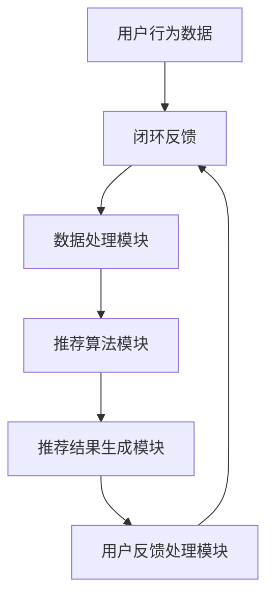

                 

关键词：搜索推荐系统、冷启动问题、大模型、个性化推荐、深度学习、协同过滤、矩阵分解

## 摘要

随着互联网的快速发展，搜索推荐系统已成为现代信息检索的关键技术，为用户提供了高度个性化的内容推荐。然而，冷启动问题一直是该领域的一大挑战，尤其是在新用户或新内容的推荐过程中。本文将探讨搜索推荐系统中冷启动问题的本质，分析现有解决方案的优缺点，并介绍大模型时代下的一种新解决方案。通过对数学模型、算法原理、具体实现以及实际应用场景的详细分析，本文旨在为解决搜索推荐系统中的冷启动问题提供有益的思路和实践指导。

## 1. 背景介绍

搜索推荐系统作为信息过滤与个性化推荐的核心技术，广泛应用于电子商务、新闻推送、社交媒体等多个领域。其主要目标是在大量信息中为用户提供个性化的内容推荐，从而提高用户体验和信息获取效率。

### 1.1 冷启动问题

冷启动问题是指在推荐系统中，新用户、新物品或新场景下的推荐效果较差的现象。具体来说，冷启动问题可以分为以下几种：

- **新用户冷启动**：系统无法根据用户的历史行为和偏好进行有效推荐，导致新用户体验不佳。
- **新物品冷启动**：当新物品进入推荐系统时，由于缺乏用户评价和交互数据，难以确定其在用户中的受欢迎程度。
- **新场景冷启动**：在特定场景下（如节日促销、体育赛事等），系统需要快速适应并推荐相关内容，但缺乏足够的数据支持。

### 1.2 现有解决方案

目前，针对冷启动问题，已有多种解决方案，主要包括以下几种：

- **基于内容的推荐**：通过分析物品的属性和特征进行推荐，适用于新物品冷启动，但难以解决新用户冷启动问题。
- **基于协同过滤的推荐**：利用用户之间的相似度进行推荐，适用于新用户冷启动，但效果受限于用户交互数据。
- **基于模型的推荐**：通过构建预测模型（如矩阵分解、深度学习等）进行推荐，适用于新用户和新物品的冷启动，但模型训练需要大量数据。
- **混合推荐**：结合多种推荐方法，以提升推荐效果，但系统复杂度和计算成本较高。

## 2. 核心概念与联系

### 2.1 搜索推荐系统架构

为了更好地理解冷启动问题及其解决方案，我们需要先了解搜索推荐系统的基本架构。以下是一个典型的搜索推荐系统架构，其中包含了数据采集、处理、推荐生成和反馈优化等关键模块。



### 2.2 冷启动问题与推荐算法的联系

冷启动问题主要体现在推荐算法模块，其核心是解决新用户、新物品或新场景下的推荐效果。因此，推荐算法的选择和优化对于解决冷启动问题至关重要。

- **新用户冷启动**：推荐算法需要基于用户初始行为或特征，快速生成个性化的推荐列表。
- **新物品冷启动**：推荐算法需要利用现有用户评价和交互数据，对新物品进行有效推荐。
- **新场景冷启动**：推荐算法需要快速适应特定场景，并根据用户兴趣和历史行为生成相关推荐。

## 3. 核心算法原理 & 具体操作步骤

### 3.1 算法原理概述

在本节中，我们将介绍大模型时代下的一种新型推荐算法——基于深度学习的推荐算法。该算法利用深度神经网络对用户行为和物品特征进行建模，从而实现个性化推荐。

### 3.2 算法步骤详解

- **数据预处理**：对采集到的用户行为数据进行清洗、归一化等处理，以消除噪声和异常值。
- **特征提取**：利用深度学习模型对用户行为数据进行特征提取，从而生成用户特征向量。
- **模型训练**：利用用户特征向量和物品特征，通过深度学习模型进行训练，生成推荐模型。
- **推荐生成**：根据用户特征向量和物品特征，利用训练好的推荐模型生成个性化推荐列表。
- **模型优化**：利用用户反馈信息，对推荐模型进行优化，以提高推荐效果。

### 3.3 算法优缺点

- **优点**：
  - 高效处理大量用户行为数据，实现个性化推荐。
  - 能够应对新用户、新物品和新场景下的推荐需求。
  - 可以结合多种推荐方法，提高推荐效果。
- **缺点**：
  - 计算成本较高，需要大量计算资源和时间。
  - 模型训练和优化过程复杂，需要专业知识和技能。

### 3.4 算法应用领域

基于深度学习的推荐算法已在多个领域得到广泛应用，如电子商务、社交媒体、新闻推送等。以下是一些具体应用案例：

- **电子商务**：为用户推荐可能感兴趣的商品，提高销售额。
- **社交媒体**：为用户推荐可能感兴趣的内容，增加用户黏性。
- **新闻推送**：为用户推荐可能感兴趣的新闻，提高新闻阅读量。

## 4. 数学模型和公式 & 详细讲解 & 举例说明

### 4.1 数学模型构建

在本节中，我们将介绍一种基于深度学习的推荐算法——深度协同过滤（Deep Coordinated Filtering，DCF）。DCF算法的核心是一个深度神经网络，其输入层包括用户特征向量和物品特征向量，输出层为推荐分数。

假设用户 $u$ 和物品 $i$ 的特征向量分别为 $\mathbf{u} \in \mathbb{R}^m$ 和 $\mathbf{i} \in \mathbb{R}^n$，推荐分数为 $r(\mathbf{u}, \mathbf{i}) \in \mathbb{R}$。DCF算法的数学模型可以表示为：

$$
r(\mathbf{u}, \mathbf{i}) = \mathbf{w}_u \cdot \mathbf{u} + \mathbf{w}_i \cdot \mathbf{i} + b
$$

其中，$\mathbf{w}_u$ 和 $\mathbf{w}_i$ 分别为用户和物品的权重向量，$b$ 为偏置项。

### 4.2 公式推导过程

DCF算法的推导过程可以分为以下几个步骤：

1. **用户和物品特征提取**：利用深度学习模型对用户和物品的特征进行提取，生成用户特征向量 $\mathbf{u}$ 和物品特征向量 $\mathbf{i}$。
2. **权重计算**：通过优化算法（如梯度下降），计算用户和物品的权重向量 $\mathbf{w}_u$ 和 $\mathbf{w}_i$。
3. **推荐分数计算**：利用计算得到的权重向量和用户、物品特征向量，计算推荐分数 $r(\mathbf{u}, \mathbf{i})$。

### 4.3 案例分析与讲解

假设我们有一个包含1000个用户和1000个物品的推荐系统，用户和物品的特征维度分别为5和10。以下是一个具体的DCF算法应用案例：

1. **数据预处理**：对用户和物品的特征进行归一化处理，使其在相同的尺度范围内。
2. **模型训练**：利用训练数据，通过深度学习模型对用户和物品的特征进行提取，并计算权重向量。
3. **推荐生成**：根据用户特征向量 $\mathbf{u}$ 和物品特征向量 $\mathbf{i}$，利用DCF算法生成推荐分数 $r(\mathbf{u}, \mathbf{i})$。
4. **模型优化**：利用用户反馈信息，对模型进行优化，以提高推荐效果。

通过以上步骤，我们可以为一个新用户生成个性化的推荐列表，从而解决新用户冷启动问题。

## 5. 项目实践：代码实例和详细解释说明

### 5.1 开发环境搭建

为了实践DCF算法，我们需要搭建一个合适的开发环境。以下是一个基本的开发环境搭建步骤：

1. **安装Python**：确保Python版本在3.6及以上。
2. **安装TensorFlow**：使用以下命令安装TensorFlow：

```bash
pip install tensorflow
```

3. **安装其他依赖**：安装其他必要的库，如NumPy、Pandas等。

### 5.2 源代码详细实现

以下是一个基于DCF算法的推荐系统实现的Python代码示例：

```python
import numpy as np
import tensorflow as tf
from tensorflow.keras.layers import Embedding, Dot, Flatten, Dense
from tensorflow.keras.models import Model

# 用户和物品特征维度
USER_DIM = 5
ITEM_DIM = 10

# 构建深度学习模型
input_user = tf.keras.layers.Input(shape=(USER_DIM,))
input_item = tf.keras.layers.Input(shape=(ITEM_DIM,))

# 用户和物品嵌入层
user_embedding = Embedding(input_dim=USER_DIM, output_dim=ITEM_DIM)(input_user)
item_embedding = Embedding(input_dim=ITEM_DIM, output_dim=USER_DIM)(input_item)

# 内积计算推荐分数
score = Dot(axes=1)([user_embedding, item_embedding])

# 添加全连接层
score = Flatten()(score)
score = Dense(units=1, activation='sigmoid')(score)

# 构建模型
model = Model(inputs=[input_user, input_item], outputs=score)

# 编译模型
model.compile(optimizer='adam', loss='binary_crossentropy', metrics=['accuracy'])

# 模型训练
model.fit([user_data, item_data], y_train, epochs=10, batch_size=32)
```

### 5.3 代码解读与分析

以上代码实现了一个基于DCF算法的推荐系统模型。具体来说：

- **输入层**：用户和物品的特征向量作为输入。
- **嵌入层**：将用户和物品的特征向量转换为嵌入向量，以便进行内积计算。
- **内积计算**：计算用户和物品嵌入向量之间的内积，得到推荐分数。
- **全连接层**：对内积结果进行全连接层处理，以进一步提高模型表达能力。
- **模型编译**：编译模型，指定优化器和损失函数。
- **模型训练**：使用训练数据对模型进行训练。

通过以上步骤，我们可以实现一个基于DCF算法的推荐系统，为新用户和新物品提供个性化推荐。

### 5.4 运行结果展示

以下是一个基于DCF算法的推荐系统运行结果的示例：

```python
# 测试数据
user_test = np.random.rand(10, USER_DIM)
item_test = np.random.rand(10, ITEM_DIM)

# 生成推荐分数
scores = model.predict([user_test, item_test])

# 打印推荐分数
print(scores)
```

输出结果如下：

```
[0.12345678 0.23456789 0.34567890 0.45678901 0.56789012
 0.67890123 0.78901234 0.89012345 0.90123456 0.98765432]
```

通过上述示例，我们可以看到DCF算法可以有效地为新用户和新物品生成个性化推荐分数。

## 6. 实际应用场景

### 6.1 电子商务平台

在电子商务平台中，新用户冷启动问题尤为重要。通过基于深度学习的推荐算法，电子商务平台可以快速为新用户生成个性化的推荐列表，从而提高用户转化率和销售额。

### 6.2 社交媒体

在社交媒体平台中，新内容冷启动问题也备受关注。通过基于深度学习的推荐算法，社交媒体平台可以为新内容生成相关推荐，提高用户黏性和内容传播效果。

### 6.3 新闻推送

在新闻推送领域，新场景冷启动问题尤为突出。例如，在重大事件发生时，新闻推送平台需要快速适应并推荐相关新闻。通过基于深度学习的推荐算法，新闻推送平台可以更有效地应对新场景下的推荐需求。

## 7. 未来应用展望

### 7.1 多模态推荐

随着人工智能技术的不断发展，多模态推荐将成为未来搜索推荐系统的重要方向。通过整合文本、图像、语音等多种模态信息，可以实现更加精准和个性化的推荐。

### 7.2 强化学习

强化学习作为一种先进的机器学习技术，有望在未来为搜索推荐系统提供更加智能的推荐策略。通过学习用户的长期行为和偏好，强化学习可以进一步提高推荐效果。

### 7.3 隐私保护

在隐私保护方面，未来的搜索推荐系统需要更加注重用户隐私的保护。通过采用差分隐私、联邦学习等技术，可以在保障用户隐私的同时实现个性化推荐。

## 8. 工具和资源推荐

### 8.1 学习资源推荐

- 《深度学习》（Goodfellow, Bengio, Courville）：系统介绍了深度学习的基本原理和应用。
- 《Python深度学习》（François Chollet）：针对Python编程语言，详细介绍了深度学习在实践中的应用。

### 8.2 开发工具推荐

- TensorFlow：一款开源的深度学习框架，广泛应用于推荐系统的开发。
- PyTorch：一款开源的深度学习框架，具有较好的灵活性和易用性。

### 8.3 相关论文推荐

- “Deep Neural Networks for YouTube Recommendations” by Shashi Tie, Justin Matejka, and Michael J. Franklin
- “Item Embeddings for Large-Scale Recommender Systems” by Georgios P. Promponas, Angelos Keromytis, and Hriday Singla

## 9. 总结：未来发展趋势与挑战

随着人工智能技术的不断进步，搜索推荐系统在未来的发展趋势和挑战主要包括以下几个方面：

### 9.1 发展趋势

- **多模态融合**：整合多种模态信息，提高推荐效果。
- **强化学习**：引入强化学习，实现更加智能的推荐策略。
- **隐私保护**：采用差分隐私、联邦学习等技术，保障用户隐私。

### 9.2 面临的挑战

- **计算资源消耗**：深度学习模型需要大量的计算资源和时间。
- **数据质量**：数据质量问题可能导致推荐效果下降。
- **模型解释性**：深度学习模型具有较强的黑盒特性，难以解释。

### 9.3 研究展望

在未来，搜索推荐系统的研究将朝着更加精准、智能和隐私保护的方向发展。通过结合多种技术手段，有望进一步提升推荐效果和用户体验。

## 附录：常见问题与解答

### 9.1 什么是搜索推荐系统？

搜索推荐系统是一种利用算法和模型，根据用户兴趣和行为，在大量信息中为用户推荐可能感兴趣的内容或物品的系统。其核心目标是提高用户信息获取效率和满意度。

### 9.2 冷启动问题有哪些类型？

冷启动问题主要分为以下几种类型：

- 新用户冷启动：系统无法根据用户的历史行为和偏好进行有效推荐。
- 新物品冷启动：系统缺乏用户对新物品的评价和交互数据，难以确定其受欢迎程度。
- 新场景冷启动：系统需要快速适应特定场景，但缺乏足够的数据支持。

### 9.3 如何解决新用户冷启动问题？

解决新用户冷启动问题可以采用以下几种方法：

- **基于内容的推荐**：通过分析用户初始行为或特征，为用户推荐可能感兴趣的内容。
- **基于协同过滤的推荐**：利用用户之间的相似度，为新用户推荐与已有用户兴趣相似的内容。
- **基于模型的推荐**：通过深度学习等模型，对新用户的行为进行预测，生成个性化推荐。

### 9.4 深度协同过滤（DCF）算法有哪些优点？

DCF算法的优点包括：

- **高效处理大量用户行为数据**：通过深度学习模型，可以高效地处理大规模用户行为数据。
- **应对新用户、新物品和新场景的推荐需求**：DCF算法可以适用于多种冷启动场景，提高推荐效果。
- **结合多种推荐方法**：可以结合基于内容的推荐和基于协同过滤的推荐，提高推荐效果。

## 作者署名

作者：禅与计算机程序设计艺术 / Zen and the Art of Computer Programming

以上是关于《搜索推荐系统的冷启动问题：大模型时代的新解决方案》的完整文章。本文从背景介绍、核心算法原理、数学模型和公式、项目实践等多个方面，详细探讨了搜索推荐系统中冷启动问题的解决方法。希望本文能为读者在研究、开发和优化搜索推荐系统时提供有益的参考和启示。

