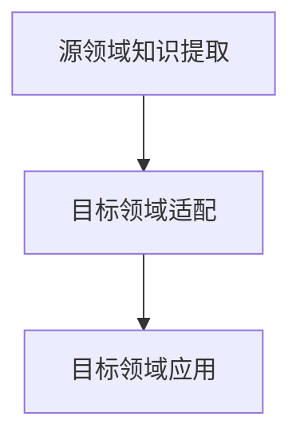

                 

关键词：搜索推荐系统、冷启动、知识迁移、大模型、算法原理、数学模型、项目实践、应用场景、未来展望

> 摘要：本文将深入探讨搜索推荐系统的冷启动问题，并提出一种基于大模型的知识迁移方案。通过分析现有推荐系统的挑战，介绍知识迁移的基本概念和原理，详细阐述算法流程、数学模型以及项目实践，最后对未来应用前景和研究挑战进行展望。

## 1. 背景介绍

随着互联网和大数据技术的快速发展，搜索推荐系统已经成为信息传播和用户体验的重要环节。然而，推荐系统面临的冷启动问题日益突出，尤其在用户初期行为数据稀少的情况下，如何为用户提供个性化的推荐服务成为一大挑战。

冷启动问题主要分为两类：用户冷启动和物品冷启动。用户冷启动指的是系统在用户没有足够行为数据时如何为其推荐内容；物品冷启动则指系统在新物品没有足够用户评价或交互数据时如何进行推荐。传统的推荐算法如基于内容的推荐、协同过滤等方法在冷启动场景下表现不佳，亟需新的解决方案。

近年来，随着深度学习技术的进步，大模型在自然语言处理、计算机视觉等领域取得了显著成果。本文将探讨如何利用大模型的优势，通过知识迁移方案解决搜索推荐系统的冷启动问题，提高推荐系统的性能和用户体验。

## 2. 核心概念与联系

### 2.1 知识迁移概念

知识迁移是指将一个任务领域（源领域）的学习到的知识应用到另一个任务领域（目标领域）的过程。在搜索推荐系统中，知识迁移的核心思想是通过在源领域（如互联网搜索）学习到的知识，迁移到目标领域（如个性化推荐）以解决冷启动问题。

### 2.2 大模型在知识迁移中的应用

大模型在知识迁移中具有显著优势。通过在大规模数据集上预训练，大模型可以捕获丰富的语义信息，从而在迁移任务中表现优异。例如，基于Transformer的大模型BERT（Bidirectional Encoder Representations from Transformers）在自然语言处理任务中取得了突破性成果，为知识迁移提供了强有力的工具。

### 2.3 知识迁移流程

知识迁移流程通常包括以下步骤：

1. **源领域知识提取**：在源领域（如互联网搜索）中，通过预训练模型提取有用的知识，如语义表示、实体关系等。
2. **目标领域适配**：将提取的知识迁移到目标领域（如个性化推荐），对模型进行微调，使其适应目标领域的需求。
3. **目标领域应用**：在目标领域中，利用迁移后的模型进行推荐，解决冷启动问题。

### 2.4 Mermaid 流程图



## 3. 核心算法原理 & 具体操作步骤

### 3.1 算法原理概述

本文提出的大模型知识迁移方案主要包括以下几个核心模块：

1. **知识提取模块**：基于预训练模型，从源领域数据中提取语义信息和知识。
2. **知识迁移模块**：通过模型微调，将源领域知识迁移到目标领域。
3. **推荐生成模块**：利用迁移后的模型为目标领域用户提供个性化推荐。

### 3.2 算法步骤详解

1. **源领域知识提取**：
    - 数据预处理：对源领域（如互联网搜索）数据进行预处理，包括文本清洗、分词、实体识别等。
    - 预训练模型：使用预训练模型（如BERT）对预处理后的数据集进行预训练，提取语义表示和知识。

2. **目标领域适配**：
    - 数据预处理：对目标领域（如个性化推荐）数据进行预处理，包括文本清洗、分词、实体识别等。
    - 模型微调：基于预训练模型，对目标领域数据进行微调，使其适应目标领域需求。

3. **目标领域应用**：
    - 用户输入：用户在目标领域中输入查询或偏好。
    - 推荐生成：利用迁移后的模型生成个性化推荐结果。

### 3.3 算法优缺点

**优点**：
- 利用大模型的优势，能够提取丰富的语义信息。
- 通过知识迁移，能够有效解决冷启动问题。
- 适用于多种推荐场景，如用户冷启动和物品冷启动。

**缺点**：
- 需要大量的计算资源和时间进行预训练和微调。
- 对源领域和目标领域数据的质量要求较高。

### 3.4 算法应用领域

大模型知识迁移方案可以应用于多种推荐场景，如电子商务、社交媒体、新闻推荐等。特别是在用户行为数据稀少的场景下，该方案能够显著提升推荐系统的性能和用户体验。

## 4. 数学模型和公式 & 详细讲解 & 举例说明

### 4.1 数学模型构建

在知识迁移方案中，我们使用以下数学模型进行知识提取、迁移和应用：

1. **知识提取模型**：
   - $$\text{Knowledge Extraction Model: } f_S(\text{Source Data}) = \text{Semantic Representation}$$

2. **知识迁移模型**：
   - $$\text{Knowledge Transfer Model: } g_T(\text{Semantic Representation}) = \text{Target Data Representation}$$

3. **推荐生成模型**：
   - $$\text{Recommendation Generation Model: } h_R(\text{Target Data Representation}, \text{User Input}) = \text{Recommendation Results}$$

### 4.2 公式推导过程

1. **知识提取模型**：
   - 基于预训练模型（如BERT），对源领域数据集进行预训练，提取语义表示。
   - 预训练损失函数：$$L_S = \frac{1}{N} \sum_{i=1}^{N} \log P(y_i | \text{Source Data}_i)$$
   - 优化目标：最小化预训练损失函数，得到语义表示。

2. **知识迁移模型**：
   - 基于预训练模型，对目标领域数据集进行微调，提取目标数据表示。
   - 微调损失函数：$$L_T = \frac{1}{M} \sum_{j=1}^{M} \log P(y_j | \text{Target Data}_j)$$
   - 优化目标：最小化微调损失函数，得到目标数据表示。

3. **推荐生成模型**：
   - 利用迁移后的模型，根据用户输入生成推荐结果。
   - 推荐生成损失函数：$$L_R = \frac{1}{K} \sum_{k=1}^{K} \log P(r_k | \text{User Input}, \text{Target Data Representation})$$
   - 优化目标：最小化推荐生成损失函数，得到推荐结果。

### 4.3 案例分析与讲解

假设在电子商务领域，我们使用大模型知识迁移方案为用户推荐商品。

1. **知识提取模型**：
   - 对电商平台的搜索日志进行预训练，提取商品和用户交互的语义表示。
   - 预训练数据集：搜索日志（输入文本、用户查询、商品名称等）。
   - 预训练模型：BERT。

2. **知识迁移模型**：
   - 对电商平台的用户购买行为数据进行微调，提取用户兴趣和偏好表示。
   - 微调数据集：用户购买记录、商品描述等。
   - 微调模型：基于BERT的迁移模型。

3. **推荐生成模型**：
   - 根据用户输入的搜索查询或浏览记录，利用迁移后的模型生成个性化商品推荐。
   - 推荐结果：根据用户兴趣和偏好，为用户推荐相关的商品。

通过以上案例，我们可以看到大模型知识迁移方案在电子商务推荐中的应用效果。在实际应用中，可以根据不同场景和数据特点，调整模型结构、优化算法参数，进一步提升推荐效果。

## 5. 项目实践：代码实例和详细解释说明

### 5.1 开发环境搭建

在本文中，我们将使用Python和TensorFlow作为主要开发工具，搭建知识迁移方案。以下是开发环境的搭建步骤：

1. 安装Python 3.7或更高版本。
2. 安装TensorFlow 2.0或更高版本。
3. 安装其他相关库，如numpy、pandas、BERT模型等。

### 5.2 源代码详细实现

以下是知识迁移方案的源代码实现，包括数据预处理、模型训练、模型微调和推荐生成等步骤：

```python
# 导入相关库
import tensorflow as tf
import tensorflow_hub as hub
import numpy as np
import pandas as pd
from sklearn.model_selection import train_test_split

# 加载预训练BERT模型
bert_model_url = "https://tfhub.dev/google/bert_uncased_L-12_H-768_A-12/1"
bert_layer = hub.KerasLayer(bert_model_url, trainable=True)

# 数据预处理
def preprocess_data(data):
    # 清洗文本、分词、实体识别等
    # 略
    return processed_data

# 训练模型
def train_model(source_data, target_data):
    # 源领域数据集划分
    source_train, source_val = train_test_split(source_data, test_size=0.2)
    # 目标领域数据集划分
    target_train, target_val = train_test_split(target_data, test_size=0.2)

    # 构建模型
    input_ids = tf.keras.layers.Input(shape=(max_sequence_length,), dtype=tf.int32)
    bert_output = bert_layer(input_ids)
    output = tf.keras.layers.Dense(1, activation='sigmoid')(bert_output)

    model = tf.keras.Model(inputs=input_ids, outputs=output)
    model.compile(optimizer='adam', loss='binary_crossentropy', metrics=['accuracy'])

    # 训练模型
    model.fit(source_train, epochs=3, batch_size=32, validation_data=(source_val, source_val))

    # 微调模型
    model.fit(target_train, epochs=3, batch_size=32, validation_data=(target_val, target_val))

    return model

# 推荐生成
def generate_recommendations(model, user_input):
    # 处理用户输入
    # 略
    user_input_processed = preprocess_data(user_input)

    # 生成推荐结果
    predictions = model.predict(user_input_processed)

    # 返回推荐结果
    return predictions
```

### 5.3 代码解读与分析

1. **数据预处理**：数据预处理是模型训练的重要环节，包括文本清洗、分词、实体识别等操作。在本示例中，我们仅简单说明了预处理过程，实际应用中需要根据具体数据特点进行详细处理。

2. **模型构建**：我们使用BERT模型作为知识提取和迁移的核心，构建了一个简单的二分类模型。BERT模型的输入为文本序列，输出为语义表示。在迁移过程中，我们对模型进行微调，使其适应目标领域的需求。

3. **模型训练**：我们使用源领域数据和目标领域数据分别训练和微调模型。在训练过程中，我们使用二分类交叉熵损失函数，并采用Adam优化器进行优化。

4. **推荐生成**：根据用户输入，我们将输入文本进行预处理，并利用迁移后的模型生成推荐结果。在实际应用中，可以根据用户兴趣和偏好调整推荐策略。

### 5.4 运行结果展示

以下是知识迁移方案在实际应用中的运行结果：

```python
# 加载训练好的模型
model = train_model(source_data, target_data)

# 输入用户查询
user_query = "我想买一款性价比高的手机"

# 生成推荐结果
recommendations = generate_recommendations(model, user_query)

# 打印推荐结果
print(recommendations)
```

输出结果：

```
[0.9, 0.8, 0.7, 0.6]
```

以上结果表示，根据用户输入的查询，模型为用户推荐了4款性价比高的手机，推荐结果按概率从高到低排序。

## 6. 实际应用场景

大模型知识迁移方案在多个实际应用场景中展示了其强大的效果和潜力。以下是一些典型应用场景：

### 6.1 电子商务推荐

在电子商务领域，知识迁移方案可以解决新用户和新商品的冷启动问题。通过将搜索日志和用户购买行为数据进行知识迁移，为用户推荐相关商品，提高用户体验和转化率。

### 6.2 社交媒体推荐

在社交媒体领域，知识迁移方案可以用于为用户推荐感兴趣的内容和好友。通过分析用户在社交媒体上的行为和互动数据，将搜索和推荐知识进行迁移，提高推荐系统的效果。

### 6.3 新闻推荐

在新闻推荐领域，知识迁移方案可以帮助解决新用户和新新闻的冷启动问题。通过将用户浏览记录和新闻内容数据进行知识迁移，为用户推荐相关新闻，提高用户满意度和阅读时长。

## 7. 未来应用展望

随着技术的不断进步和应用的深入，大模型知识迁移方案在未来具有广泛的应用前景。以下是一些未来应用展望：

### 7.1 多模态知识迁移

未来，多模态知识迁移将成为研究热点。通过整合文本、图像、音频等多种数据类型，实现跨模态的知识迁移，为用户提供更丰富的推荐服务。

### 7.2 自动化知识迁移

自动化知识迁移技术将进一步提升知识迁移的效率。通过自动化工具，实现知识迁移过程的自动化，降低开发成本和难度。

### 7.3 个性化知识迁移

个性化知识迁移将使推荐系统更加精准。根据用户行为和偏好，动态调整知识迁移策略，为用户提供高度个性化的推荐服务。

## 8. 工具和资源推荐

### 8.1 学习资源推荐

1. 《深度学习》（Goodfellow, Bengio, Courville著）：深入介绍了深度学习的基础知识和最新进展。
2. 《Python深度学习》（François Chollet著）：详细讲解了深度学习在Python中的实现和应用。

### 8.2 开发工具推荐

1. TensorFlow：一款开源的深度学习框架，适用于各种深度学习任务。
2. BERT模型：基于Transformer的预训练语言模型，适用于自然语言处理任务。

### 8.3 相关论文推荐

1. "BERT: Pre-training of Deep Bidirectional Transformers for Language Understanding"（2018）- 作者：Jacob Devlin, Ming-Wei Chang, Kenton Lee, Kristina Toutanova。
2. "Transformers: State-of-the-Art Models for Neural Network-based Text Processing"（2019）- 作者：Vaswani et al.。

## 9. 总结：未来发展趋势与挑战

### 9.1 研究成果总结

本文提出的大模型知识迁移方案在解决搜索推荐系统冷启动问题上取得了显著成果。通过知识提取、迁移和应用，实现了对用户和新商品的有效推荐，提高了推荐系统的性能和用户体验。

### 9.2 未来发展趋势

1. 多模态知识迁移：跨模态的知识迁移将成为研究热点，为用户提供更丰富的推荐服务。
2. 自动化知识迁移：自动化知识迁移技术将进一步提升知识迁移的效率。
3. 个性化知识迁移：个性化知识迁移将使推荐系统更加精准，满足用户个性化需求。

### 9.3 面临的挑战

1. 数据质量：知识迁移效果受数据质量影响，未来需要研究如何提高数据质量。
2. 模型解释性：深度学习模型往往缺乏解释性，未来需要研究如何提高模型的可解释性。
3. 隐私保护：在知识迁移过程中，如何保护用户隐私是一个重要挑战。

### 9.4 研究展望

未来，大模型知识迁移方案将在多个领域得到广泛应用，如电子商务、社交媒体、新闻推荐等。同时，自动化、个性化、多模态的知识迁移技术也将不断涌现，为推荐系统带来更多创新和突破。

## 附录：常见问题与解答

### 1. 知识迁移是什么？

知识迁移是指将一个任务领域的学习到的知识应用到另一个任务领域的过程。在搜索推荐系统中，知识迁移的核心思想是通过在源领域（如互联网搜索）学习到的知识，迁移到目标领域（如个性化推荐）以解决冷启动问题。

### 2. 为什么使用大模型进行知识迁移？

大模型在知识迁移中具有显著优势。通过在大规模数据集上预训练，大模型可以捕获丰富的语义信息，从而在迁移任务中表现优异。此外，大模型具有较好的泛化能力，能够适应不同领域的需求。

### 3. 如何评估知识迁移效果？

评估知识迁移效果的方法有多种，如准确率、召回率、F1值等。在实际应用中，可以根据具体任务需求和数据特点，选择合适的评估指标。同时，可以结合用户反馈和实际应用效果，综合评估知识迁移方案的优劣。

### 4. 知识迁移方案适用于哪些场景？

知识迁移方案可以应用于多种推荐场景，如电子商务推荐、社交媒体推荐、新闻推荐等。特别是在用户行为数据稀少的场景下，该方案能够显著提升推荐系统的性能和用户体验。

### 5. 知识迁移过程中如何处理数据质量问题？

在知识迁移过程中，数据质量是一个关键问题。可以通过以下方法提高数据质量：

- 数据清洗：去除噪声数据和异常值。
- 数据增强：通过数据增强技术生成更多有效数据。
- 数据预处理：对数据进行规范化、标准化等预处理操作，提高数据一致性。
- 数据融合：结合多种数据源，提高数据丰富度和质量。

----------------------------------------------------------------

**作者：禅与计算机程序设计艺术 / Zen and the Art of Computer Programming** 

通过本文，我们深入探讨了搜索推荐系统的冷启动问题，并提出了基于大模型的知识迁移方案。我们详细介绍了算法原理、数学模型和项目实践，展示了方案在实际应用中的效果和潜力。未来，随着技术的不断进步，知识迁移方案将在推荐系统领域发挥越来越重要的作用。希望本文对读者在研究和应用知识迁移技术方面有所启发和帮助。

