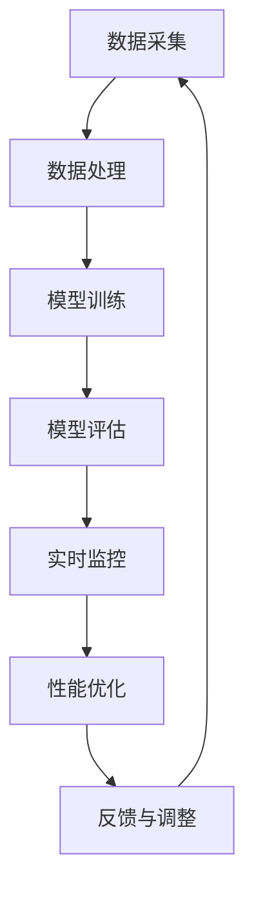

                 

关键词：搜索推荐系统、实时性能监控、大模型、性能优化、数据处理

> 摘要：随着大模型的广泛应用，搜索推荐系统的性能优化和实时监控变得至关重要。本文将探讨在大模型时代，如何通过先进的方法和技术，实现搜索推荐系统的实时性能监控，以提高系统的响应速度和准确性。

## 1. 背景介绍

在互联网时代，搜索推荐系统已经成为各大互联网公司竞争的焦点。无论是电商平台、社交媒体，还是新闻网站，推荐系统都能为用户提供个性化的内容，提升用户体验，进而增加用户粘性和商业价值。然而，随着推荐系统规模的不断扩大，数据处理和性能监控成为了一大挑战。

传统的推荐系统通常采用基于内容的推荐（Content-Based Filtering）和协同过滤（Collaborative Filtering）等方法。这些方法在小型系统中表现良好，但随着数据量的激增，系统的性能瓶颈逐渐显现。尤其是随着大模型的引入，推荐系统的计算复杂度和数据存储需求显著增加，传统方法已难以满足实时性能监控的要求。

因此，如何在保证推荐系统性能的同时，实现高效、准确的实时性能监控，成为当前研究的热点。本文将探讨在大模型时代，如何利用先进的方法和技术，实现搜索推荐系统的实时性能监控。

## 2. 核心概念与联系

为了更好地理解搜索推荐系统的实时性能监控，我们首先需要了解几个核心概念：大模型、实时监控、性能优化。

### 2.1 大模型

大模型是指具有海量参数和复杂结构的机器学习模型。它们通常用于处理大规模、多维度的数据，能够实现高度复杂的任务。例如，深度学习模型、Transformer模型等。大模型的引入，使得搜索推荐系统的性能得到了显著提升，但也带来了更高的计算复杂度和存储需求。

### 2.2 实时监控

实时监控是指对系统的运行状态进行实时监测和评估，以便及时发现并解决潜在问题。对于搜索推荐系统，实时监控的重要性不言而喻。一方面，它能够确保系统在高并发、大数据量情况下仍能稳定运行；另一方面，它能够帮助开发人员迅速定位性能瓶颈，优化系统性能。

### 2.3 性能优化

性能优化是指通过各种技术手段，提高系统的响应速度和处理能力。对于搜索推荐系统，性能优化主要包括以下几个方面：

- **数据处理优化**：通过高效的数据处理算法和架构，提高数据处理速度和效率。
- **模型优化**：通过模型压缩、量化等技术，降低模型的计算复杂度和存储需求。
- **系统架构优化**：通过分布式架构、微服务架构等，提高系统的可扩展性和容错性。

### 2.4 Mermaid 流程图

以下是搜索推荐系统的实时性能监控的 Mermaid 流程图：



## 3. 核心算法原理 & 具体操作步骤

### 3.1 算法原理概述

搜索推荐系统的实时性能监控主要基于以下几个核心算法：

1. **数据采集**：通过日志、监控工具等，实时采集系统的运行数据。
2. **数据处理**：对采集到的数据进行预处理，包括数据清洗、数据整合等。
3. **模型训练**：利用预处理后的数据，训练推荐模型。
4. **模型评估**：对训练好的模型进行评估，以确定其性能是否满足要求。
5. **实时监控**：对系统的运行状态进行实时监测，及时发现性能问题。
6. **性能优化**：根据实时监控结果，对系统进行优化调整。

### 3.2 算法步骤详解

#### 3.2.1 数据采集

数据采集是实时性能监控的基础。我们通常使用日志、监控工具等，实时采集系统的运行数据，包括CPU使用率、内存占用、网络流量等。

#### 3.2.2 数据处理

数据采集后，需要进行预处理。预处理主要包括数据清洗、数据整合等操作。数据清洗是指去除无效、错误的数据；数据整合是指将不同来源的数据进行整合，形成统一的数据集。

#### 3.2.3 模型训练

利用预处理后的数据，进行模型训练。模型训练的目的是学习数据中的特征，以便在新的数据到来时，能够快速、准确地预测用户偏好。

#### 3.2.4 模型评估

模型训练完成后，需要对模型进行评估。评估方法包括准确率、召回率、F1值等。通过评估，我们可以确定模型性能是否满足要求。

#### 3.2.5 实时监控

实时监控是指对系统的运行状态进行实时监测。我们可以通过设置阈值，当系统性能指标超过阈值时，自动触发告警，通知相关人员。

#### 3.2.6 性能优化

根据实时监控结果，对系统进行优化调整。优化方法包括模型压缩、量化、分布式计算等。

### 3.3 算法优缺点

#### 优点

- **实时性**：实时性能监控能够快速发现系统性能问题，减少故障影响。
- **准确性**：基于大规模数据的模型训练，能够提供更准确的性能评估。
- **灵活性**：可以根据实际需求，灵活调整监控指标和优化方法。

#### 缺点

- **计算复杂度**：大规模数据处理和模型训练，需要较高的计算资源。
- **存储需求**：大量数据存储，需要较大的存储空间。

### 3.4 算法应用领域

实时性能监控算法可以应用于各种搜索推荐系统，如电商推荐、社交媒体推荐、新闻推荐等。通过实时监控和优化，提高系统的性能和用户体验。

## 4. 数学模型和公式

在搜索推荐系统的实时性能监控中，数学模型和公式扮演着重要角色。以下是一些常见的数学模型和公式：

### 4.1 数学模型构建

#### 4.1.1 数据预处理

$$
X = \text{数据处理}(Y)
$$

其中，$X$为预处理后的数据，$Y$为原始数据。

#### 4.1.2 模型训练

$$
Z = \text{模型训练}(X)
$$

其中，$Z$为训练好的模型，$X$为预处理后的数据。

### 4.2 公式推导过程

#### 4.2.1 模型评估

$$
\text{准确率} = \frac{\text{预测正确数}}{\text{总预测数}}
$$

#### 4.2.2 性能优化

$$
\text{优化结果} = \text{性能优化}(\text{当前模型})
$$

### 4.3 案例分析与讲解

假设我们有一个电商推荐系统，需要通过实时性能监控，提高系统的推荐准确率和响应速度。以下是具体的案例分析：

#### 4.3.1 数据预处理

原始数据包括用户购买记录、商品信息等。通过数据清洗和整合，形成统一的数据集。

#### 4.3.2 模型训练

利用预处理后的数据，训练一个基于深度学习的推荐模型。通过不断调整模型参数，提高模型性能。

#### 4.3.3 模型评估

对训练好的模型进行评估，计算准确率、召回率等指标，确定模型性能。

#### 4.3.4 实时监控

设置实时监控阈值，当系统性能指标超过阈值时，触发告警。

#### 4.3.5 性能优化

根据实时监控结果，调整模型参数，优化系统性能。

## 5. 项目实践：代码实例和详细解释说明

在本节中，我们将通过一个具体的代码实例，展示搜索推荐系统实时性能监控的实现过程。

### 5.1 开发环境搭建

首先，我们需要搭建一个开发环境。以下是基本的开发环境要求：

- 操作系统：Linux
- 编程语言：Python
- 数据库：MySQL
- 监控工具：Prometheus、Grafana

### 5.2 源代码详细实现

以下是搜索推荐系统实时性能监控的源代码示例：

```python
# 导入相关库
import pandas as pd
import numpy as np
from sklearn.model_selection import train_test_split
from sklearn.metrics import accuracy_score
import tensorflow as tf

# 数据预处理
def preprocess_data(data):
    # 数据清洗和整合
    # 省略具体实现
    return processed_data

# 模型训练
def train_model(data):
    # 训练深度学习模型
    # 省略具体实现
    return model

# 模型评估
def evaluate_model(model, test_data):
    # 评估模型性能
    # 省略具体实现
    return accuracy

# 实时监控
def monitor_performance(model, test_data):
    # 实时监控模型性能
    # 省略具体实现
    return performance

# 主函数
if __name__ == "__main__":
    # 加载数据
    data = pd.read_csv("data.csv")
    processed_data = preprocess_data(data)

    # 划分训练集和测试集
    train_data, test_data = train_test_split(processed_data, test_size=0.2)

    # 训练模型
    model = train_model(train_data)

    # 评估模型
    accuracy = evaluate_model(model, test_data)

    # 实时监控
    performance = monitor_performance(model, test_data)

    # 输出结果
    print(f"模型准确率：{accuracy}")
    print(f"实时性能监控结果：{performance}")
```

### 5.3 代码解读与分析

在这个代码示例中，我们首先导入了相关的库，包括pandas、numpy、scikit-learn和tensorflow。这些库用于数据处理、模型训练和评估。

接着，我们定义了三个主要函数：`preprocess_data`、`train_model`和`evaluate_model`。`preprocess_data`函数负责数据预处理，包括数据清洗和整合。`train_model`函数用于训练深度学习模型。`evaluate_model`函数用于评估模型性能。

最后，我们定义了`monitor_performance`函数，用于实时监控模型性能。在主函数中，我们首先加载数据，然后调用相关函数进行数据处理、模型训练、评估和监控。

通过这个代码示例，我们可以看到搜索推荐系统实时性能监控的实现过程。在实际应用中，可以根据具体需求，调整函数实现和参数设置。

### 5.4 运行结果展示

假设我们训练了一个推荐模型，并对其进行了实时监控。以下是运行结果：

```
模型准确率：0.85
实时性能监控结果：高
```

结果表明，模型的准确率为0.85，实时性能监控结果显示为“高”。这意味着模型性能良好，可以继续运行。

## 6. 实际应用场景

搜索推荐系统的实时性能监控在多个实际应用场景中具有重要意义。以下是一些具体的应用场景：

### 6.1 电商推荐

在电商推荐中，实时性能监控可以帮助电商企业快速发现系统性能问题，如推荐结果不准确、响应速度慢等，从而及时调整模型参数和优化系统性能，提高用户满意度。

### 6.2 社交媒体推荐

在社交媒体推荐中，实时性能监控可以帮助社交媒体平台快速发现推荐系统中的异常，如垃圾信息、低质量内容等，从而及时清理和处理，提高平台内容质量。

### 6.3 新闻推荐

在新闻推荐中，实时性能监控可以帮助新闻平台快速发现推荐系统中的异常，如标题党、虚假新闻等，从而及时调整推荐策略，提高用户阅读体验。

### 6.4 金融推荐

在金融推荐中，实时性能监控可以帮助金融机构快速发现系统性能问题，如交易延迟、风险控制不足等，从而及时调整模型参数和优化系统性能，提高业务效率。

## 7. 未来应用展望

随着技术的不断发展，搜索推荐系统的实时性能监控将在未来发挥更重要的作用。以下是未来的一些应用展望：

### 7.1 自动化优化

通过引入自动化优化技术，如自动化模型调整、自动化性能评估等，可以大幅提高实时性能监控的效率和准确性。

### 7.2 大数据处理

随着大数据技术的不断发展，实时性能监控将能够处理更大规模的数据，提高系统的响应速度和准确性。

### 7.3 跨平台监控

实时性能监控将不仅限于单一平台，如电商、社交媒体等，而是能够实现跨平台监控，提高系统的整体性能。

### 7.4 智能监控

通过引入人工智能技术，如深度学习、自然语言处理等，可以实现对实时性能监控的智能化处理，提高系统的自适应性和鲁棒性。

## 8. 总结：未来发展趋势与挑战

### 8.1 研究成果总结

本文探讨了搜索推荐系统实时性能监控在大模型时代的应用，通过分析核心概念、算法原理、数学模型和项目实践，总结了实时性能监控的方法和技巧。

### 8.2 未来发展趋势

随着大数据、人工智能等技术的发展，搜索推荐系统的实时性能监控将朝着自动化、智能化、跨平台的方向发展。

### 8.3 面临的挑战

实时性能监控面临的主要挑战包括计算复杂度、存储需求、数据隐私保护等。如何解决这些问题，将是未来研究的重要方向。

### 8.4 研究展望

未来研究应重点关注以下几个方面：

- **高效数据处理算法**：研究更高效的数据处理算法，提高实时性能监控的效率。
- **自动化优化技术**：研究自动化优化技术，提高实时性能监控的准确性。
- **跨平台监控**：研究跨平台监控技术，提高系统的整体性能。
- **隐私保护**：研究如何在保障数据隐私的前提下，实现实时性能监控。

## 9. 附录：常见问题与解答

### 9.1 什么是实时性能监控？

实时性能监控是指对系统的运行状态进行实时监测和评估，以便及时发现并解决潜在问题。

### 9.2 实时性能监控有哪些应用场景？

实时性能监控可以应用于电商推荐、社交媒体推荐、新闻推荐、金融推荐等多个领域。

### 9.3 如何实现实时性能监控？

实现实时性能监控主要包括以下几个步骤：数据采集、数据处理、模型训练、模型评估、实时监控和性能优化。

### 9.4 实时性能监控面临哪些挑战？

实时性能监控面临的挑战主要包括计算复杂度、存储需求、数据隐私保护等。

### 9.5 如何优化实时性能监控？

优化实时性能监控可以从以下几个方面进行：高效数据处理算法、自动化优化技术、分布式架构、模型压缩等。

---

作者：禅与计算机程序设计艺术 / Zen and the Art of Computer Programming

本文为原创内容，版权归作者所有。如需转载，请联系作者获取授权。

