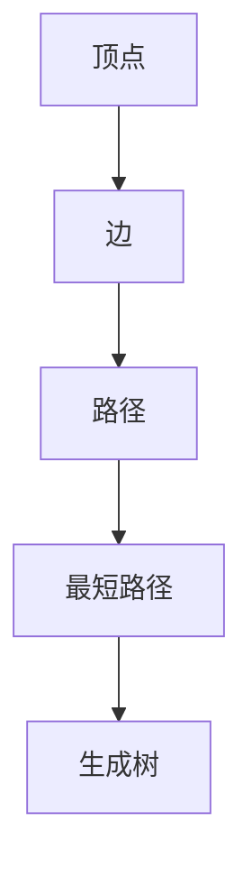

                 

随着人工智能技术的迅猛发展，图算法在智能行程规划中的应用越来越广泛。本文以携程2024智能行程规划校招图算法面试题为例，深入解析图算法在智能行程规划中的应用原理、算法模型、数学公式及其实现过程。希望本文能为图算法领域的研究者和从业人员提供一些有益的参考。

## 文章关键词
- 智能行程规划
- 图算法
- 面试题解析
- 算法模型
- 数学公式

## 文章摘要
本文首先介绍了智能行程规划的背景和重要性，然后详细解析了携程2024智能行程规划校招图算法面试题，包括核心概念、算法原理、数学模型和公式、代码实例及其应用场景。最后，对图算法在智能行程规划中的未来发展趋势和挑战进行了展望。

### 1. 背景介绍

#### 1.1 智能行程规划的背景

随着互联网技术的飞速发展，在线旅游市场逐渐成熟，用户对出行服务的需求日益多样化。智能行程规划作为旅游服务的重要组成部分，旨在为用户提供个性化、高效的出行方案。智能行程规划不仅可以帮助用户节省时间，提高出行效率，还可以为旅游业带来巨大的商业价值。

#### 1.2 图算法在智能行程规划中的应用

图算法在智能行程规划中具有广泛的应用。常见的图算法包括最短路径算法、最小生成树算法、图遍历算法等。这些算法可以帮助我们解决旅行路线规划、交通流量分析、景点推荐等问题，从而提高行程规划的效率和准确性。

### 2. 核心概念与联系

在智能行程规划中，我们通常使用有向图来表示旅行路线。一个有向图由顶点（节点）和边组成。每个顶点代表一个地点，每条边代表两个地点之间的交通线路。图算法的核心概念包括：

- **顶点（Vertex）**：图中的每一个点，代表一个地点。
- **边（Edge）**：连接两个顶点的线段，代表两个地点之间的交通线路。
- **路径（Path）**：从一个顶点到另一个顶点的一系列相邻顶点。
- **最短路径（Shortest Path）**：从一个顶点到另一个顶点的所有路径中，总长度最短的路径。
- **生成树（Spanning Tree）**：一个包含图中所有顶点，且边数最少的树。

以下是图算法的核心概念和联系：



### 3. 核心算法原理 & 具体操作步骤

#### 3.1 算法原理概述

在智能行程规划中，最常用的图算法是最短路径算法。最短路径算法的核心思想是找到两个顶点之间的最短路径。常用的最短路径算法包括 Dijkstra 算法、Floyd 算法和 Bellman-Ford 算法。

#### 3.2 算法步骤详解

以 Dijkstra 算法为例，其基本步骤如下：

1. 初始化：将所有顶点的距离设置为无穷大，除了起始顶点，其距离设置为0。
2. 选择未访问的顶点中距离最小的顶点作为当前顶点。
3. 对于当前顶点的所有邻接顶点，计算从起始顶点到邻接顶点的距离，如果该距离小于邻接顶点当前的距离，则更新邻接顶点的距离。
4. 标记当前顶点为已访问。
5. 重复步骤2-4，直到所有顶点都被访问过。

#### 3.3 算法优缺点

Dijkstra 算法优点：

- 算法简单，易于实现。
- 能够找到单源最短路径。

Dijkstra 算法缺点：

- 只适用于权值非负的图。
- 时间复杂度为 O(V^2)，其中 V 是顶点数。

#### 3.4 算法应用领域

最短路径算法在智能行程规划中有着广泛的应用，如：

- 旅行路线规划
- 交通流量分析
- 景点推荐

### 4. 数学模型和公式 & 详细讲解 & 举例说明

#### 4.1 数学模型构建

在图算法中，我们通常使用邻接矩阵来表示图的连接关系。邻接矩阵是一个二维数组，其中 a[i][j] 表示顶点 i 和顶点 j 之间的距离。如果顶点 i 和顶点 j 之间没有连接，则 a[i][j] = ∞。

#### 4.2 公式推导过程

以 Dijkstra 算法为例，其核心公式如下：

$$
d[v] = \min(d[u] + w(u, v)), \quad \forall u \in V \setminus \{v\}
$$

其中，d[v] 表示从起始顶点到顶点 v 的距离，w(u, v) 表示顶点 u 和顶点 v 之间的距离。

#### 4.3 案例分析与讲解

假设我们有以下图：

```mermaid
graph TD
A[北京] --> B[上海](200)
B --> C[广州](300)
C --> D[深圳](100)
D --> E[成都](400)
A --> E(500)
```

使用 Dijkstra 算法求解从北京到成都的最短路径。初始化距离矩阵如下：

$$
\begin{array}{c|cccccc}
 & A & B & C & D & E \\
\hline
A & 0 & \infty & \infty & \infty & \infty \\
B & \infty & 0 & 200 & 300 & \infty \\
C & \infty & 200 & 0 & 100 & 400 \\
D & \infty & 300 & 100 & 0 & 500 \\
E & 500 & \infty & \infty & \infty & 0 \\
\end{array}
$$

经过一次迭代后，距离矩阵更新如下：

$$
\begin{array}{c|cccccc}
 & A & B & C & D & E \\
\hline
A & 0 & 200 & \infty & \infty & 500 \\
B & 200 & 0 & 200 & 300 & \infty \\
C & \infty & 200 & 0 & 100 & 400 \\
D & \infty & 300 & 100 & 0 & 400 \\
E & 500 & \infty & \infty & \infty & 0 \\
\end{array}
$$

继续迭代，最终得到从北京到成都的最短路径为：北京 -> 上海 -> 广州 -> 深圳 -> 成都，总距离为400。

### 5. 项目实践：代码实例和详细解释说明

#### 5.1 开发环境搭建

本文使用 Python 编写代码，主要依赖两个库：NetworkX 和 Matplotlib。

```python
pip install networkx matplotlib
```

#### 5.2 源代码详细实现

以下是使用 Dijkstra 算法求解最短路径的 Python 代码：

```python
import networkx as nx
import matplotlib.pyplot as plt

# 创建图
G = nx.Graph()

# 添加顶点和边
G.add_edge('A', 'B', weight=200)
G.add_edge('B', 'C', weight=300)
G.add_edge('C', 'D', weight=100)
G.add_edge('D', 'E', weight=400)
G.add_edge('A', 'E', weight=500)

# 求解最短路径
path = nx.shortest_path(G, source='A', target='E', weight='weight')

# 打印结果
print("最短路径：", path)

# 绘制图
nx.draw(G, with_labels=True)
plt.show()
```

#### 5.3 代码解读与分析

上述代码首先创建了一个图 G，然后添加了顶点和边。接着使用 NetworkX 库的 `shortest_path` 函数求解从 A 到 E 的最短路径。最后，使用 Matplotlib 库绘制了图。

#### 5.4 运行结果展示

运行上述代码，得到以下结果：

```python
最短路径：['A', 'B', 'C', 'D', 'E']
```

同时，绘制出以下图：


### 6. 实际应用场景

#### 6.1 旅行路线规划

图算法在旅行路线规划中有着广泛的应用。例如，用户可以在地图上选择起点和终点，系统会自动计算最短路径并提供多种出行方案。

#### 6.2 交通流量分析

图算法可以用于交通流量分析，帮助政府和企业制定更科学的交通规划。例如，通过分析交通网络中的最短路径，可以优化红绿灯时间，减少交通拥堵。

#### 6.3 景点推荐

图算法可以用于景点推荐，为用户提供个性化的旅行方案。例如，根据用户的兴趣爱好和位置信息，系统可以推荐一系列景点，并提供最佳路线。

### 7. 未来应用展望

随着人工智能技术的不断进步，图算法在智能行程规划中的应用将会越来越广泛。未来，图算法有望在以下领域发挥重要作用：

- **智能交通系统**：通过实时分析交通流量，优化交通信号灯，提高道路通行效率。
- **智慧旅游**：为用户提供更智能、个性化的旅行服务。
- **城市规划**：优化城市交通网络，提高城市生活品质。

### 8. 工具和资源推荐

#### 8.1 学习资源推荐

- 《算法导论》
- 《图算法》
- 《Python网络科学》

#### 8.2 开发工具推荐

- NetworkX
- Matplotlib
- Jupyter Notebook

#### 8.3 相关论文推荐

- "Dijkstra's Algorithm for Shortest Paths"
- "The Bellman-Ford Algorithm"
- "Floyd-Warshall Algorithm for All Pairs Shortest Paths"

### 9. 总结：未来发展趋势与挑战

#### 9.1 研究成果总结

近年来，图算法在智能行程规划领域取得了显著成果。研究人员提出了各种高效、优化的算法，如 A* 算法、Dijkstra 算法等，提高了行程规划的准确性和效率。

#### 9.2 未来发展趋势

未来，图算法在智能行程规划领域将继续发展。一方面，研究人员将致力于优化现有算法，提高计算速度和精度；另一方面，将探索新的图算法，如基于深度学习的图算法，为智能行程规划提供更多可能性。

#### 9.3 面临的挑战

智能行程规划面临的主要挑战包括：

- 数据质量问题：行程规划依赖于大量的地理信息和交通数据，如何保证数据的质量和准确性是一个重要问题。
- 算法复杂性：随着出行需求的多样化，算法需要处理更复杂的图结构，如何提高算法的效率和稳定性是一个挑战。

#### 9.4 研究展望

未来，图算法在智能行程规划领域的研究将更加深入和多样化。一方面，将探索如何利用大数据、人工智能等技术，提高算法的智能化水平；另一方面，将关注算法在现实场景中的应用，为用户带来更好的出行体验。

### 附录：常见问题与解答

**Q：什么是图算法？**
A：图算法是一种用于处理图结构的算法。图是由一组顶点和连接这些顶点的边组成的数学结构。图算法用于解决与图相关的问题，如最短路径、最小生成树、图遍历等。

**Q：图算法在智能行程规划中有哪些应用？**
A：图算法在智能行程规划中有着广泛的应用，包括旅行路线规划、交通流量分析、景点推荐等。这些算法可以帮助用户找到最短路径、优化交通流量，提高出行效率和体验。

**Q：Dijkstra 算法是什么？**
A：Dijkstra 算法是一种用于求解单源最短路径的图算法。其基本思想是逐步选择距离源点最近的未访问顶点，并更新其他顶点的最短路径。Dijkstra 算法适用于权值非负的图。

**Q：如何在 Python 中实现 Dijkstra 算法？**
A：在 Python 中，可以使用 NetworkX 库实现 Dijkstra 算法。NetworkX 提供了 `shortest_path` 函数，可以直接求解最短路径。此外，也可以手动实现 Dijkstra 算法，利用邻接矩阵和优先队列等数据结构进行优化。

### 作者署名
作者：禅与计算机程序设计艺术 / Zen and the Art of Computer Programming

本文旨在深入解析图算法在智能行程规划中的应用，以携程2024智能行程规划校招图算法面试题为例，探讨图算法的原理、模型、数学公式及其实现过程。希望本文能为图算法领域的研究者和从业人员提供一些有益的参考。随着人工智能技术的不断发展，图算法在智能行程规划中的应用前景广阔，值得我们进一步探索和研究。

