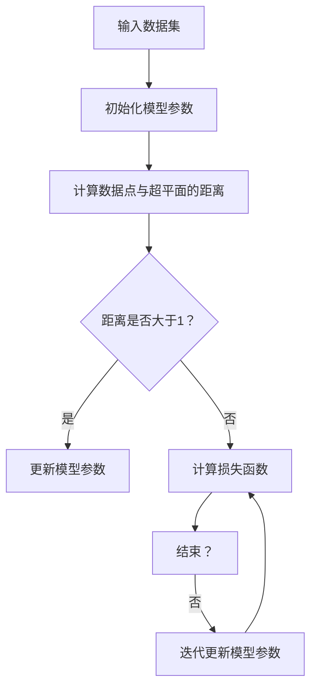

                 

支持向量机（Support Vector Machine，SVM）是一种广泛应用于分类和回归分析的机器学习算法。它通过寻找最佳分隔超平面，将不同类别的数据点进行有效分类。本文将深入讲解SVM的原理、数学模型、实现步骤及其应用，并通过代码实例进行详细解释说明。

## 关键词

- 支持向量机
- 机器学习
- 分类算法
- 线性可分支持向量机
- 非线性可分支持向量机
- 支持向量回归

## 摘要

本文将系统地介绍支持向量机（SVM）的基础知识，包括其核心概念、数学模型、算法实现和应用场景。通过理论讲解与代码实例相结合的方式，帮助读者理解SVM的原理和实际应用。文章结构如下：

1. 背景介绍
2. 核心概念与联系
3. 核心算法原理 & 具体操作步骤
4. 数学模型和公式 & 详细讲解 & 举例说明
5. 项目实践：代码实例和详细解释说明
6. 实际应用场景
7. 未来应用展望
8. 工具和资源推荐
9. 总结：未来发展趋势与挑战

## 1. 背景介绍

支持向量机最早由Vapnik等人在1990年代提出，是基于统计学习理论发展起来的一种学习方法。SVM的核心思想是通过寻找一个最优超平面，将不同类别的数据点分隔开来。支持向量机在分类和回归分析中具有很好的性能，尤其是在高维空间中，因为其能够有效处理非线性问题。

SVM的基本原理是通过求解一个最优化的线性方程组来找到最佳分隔超平面。这个优化过程涉及到一个称为“软边缘”的概念，即允许一些数据点位于分隔超平面的错误一侧。这样的松弛变量使得模型对异常值和噪声更加鲁棒。

## 2. 核心概念与联系

### 2.1 线性可分支持向量机（Linearly Separable Support Vector Machine）

线性可分支持向量机是SVM的一个基本版本，适用于线性可分的数据集。其目标是找到一个最优的超平面，使得不同类别的数据点在超平面的两侧分布，并且类别的边界间隔最大。数学上，这个问题可以表述为一个线性优化问题：

$$
\min_{\mathbf{w},b}\frac{1}{2}||\mathbf{w}||^2
$$

其中，$\mathbf{w}$是超平面的法向量，$b$是偏置项，$||\mathbf{w}||$是$\mathbf{w}$的欧几里得范数。

约束条件为：

$$
\mathbf{w}\cdot\mathbf{x}_i - b \geq 1, \quad \forall i
$$

其中，$\mathbf{x}_i$是训练集中的数据点。

### 2.2 非线性可分支持向量机（Non-linearly Separable Support Vector Machine）

当数据集线性不可分时，我们需要引入核函数（Kernel Function）来将数据映射到高维空间，使得数据能够被线性分隔。常见的核函数包括多项式核、径向基函数（RBF）核和sigmoid核等。

对于非线性可分支持向量机，优化问题的目标函数和约束条件与线性可分支持向量机类似，但引入了核函数来处理高维空间的线性分隔问题。具体来说，我们有：

$$
\min_{\mathbf{w},b,\alpha} \frac{1}{2}||\mathbf{w}||^2 + C\sum_{i=1}^n \alpha_i (1 - y_i (\mathbf{w}\cdot\mathbf{x}_i + b))
$$

其中，$\alpha_i$是拉格朗日乘子，$C$是惩罚参数，$y_i$是第$i$个训练样本的标签。

约束条件为：

$$
0 \leq \alpha_i \leq C, \quad \forall i
$$

### 2.3 支持向量回归（Support Vector Regression，SVR）

支持向量回归是SVM在回归问题中的应用。SVR的目标是找到一个最优的超平面，使得训练数据点到超平面的预测误差最小。具体来说，SVR使用了类似SVM的优化目标，但约束条件有所不同：

$$
\min_{\mathbf{w},b,\alpha} \frac{1}{2}||\mathbf{w}||^2 + C\sum_{i=1}^n (\alpha_i + \beta_i)
$$

其中，$\beta_i$是另一个拉格朗日乘子，用来处理回归问题的松弛变量。

约束条件为：

$$
\|y_i - (\mathbf{w}\cdot\mathbf{x}_i + b)\| \leq \epsilon + \alpha_i + \beta_i, \quad \forall i
$$

其中，$\epsilon$是回归问题的不敏感损失函数（Insensitive Loss Function）。

### 2.4 概率输出与SVM

在SVM的基础上，还可以通过引入概率模型来得到概率输出。具体来说，可以通过求解以下优化问题：

$$
\max_{\mathbf{w},b,\alpha} \sum_{i=1}^n \alpha_i - \frac{1}{2} \sum_{i,j=1}^n \alpha_i \alpha_j y_i y_j \mathbf{w}_i \cdot \mathbf{w}_j
$$

约束条件为：

$$
\alpha_i \geq 0, \quad \forall i
$$

### 2.5 Mermaid 流程图

以下是一个简单的Mermaid流程图，展示了线性可分支持向量机的算法流程：



## 3. 核心算法原理 & 具体操作步骤

### 3.1 算法原理概述

SVM的核心算法原理是基于最大间隔分类器（Maximal Margin Classifier）的。其基本思想是找到一个最优的超平面，使得不同类别的数据点在超平面的两侧分布，并且类别的边界间隔最大。具体来说，SVM通过求解以下优化问题来实现这一目标：

$$
\min_{\mathbf{w},b} \frac{1}{2}||\mathbf{w}||^2 + C\sum_{i=1}^n \xi_i
$$

其中，$\mathbf{w}$是超平面的法向量，$b$是偏置项，$C$是惩罚参数，$\xi_i$是松弛变量。

约束条件为：

$$
y_i (\mathbf{w}\cdot\mathbf{x}_i + b) \geq 1 - \xi_i, \quad \forall i
$$

$$
\xi_i \geq 0, \quad \forall i
$$

### 3.2 算法步骤详解

1. **初始化模型参数**：首先，我们需要初始化模型参数，包括超平面的法向量$\mathbf{w}$和偏置项$b$。

2. **计算数据点与超平面的距离**：对于每个数据点，我们需要计算其与超平面的距离，公式为：

   $$ 
   \text{distance} = \frac{|\mathbf{w}\cdot\mathbf{x}_i + b|}{||\mathbf{w}||} 
   $$

3. **更新模型参数**：根据计算出的距离和松弛变量$\xi_i$，我们需要更新模型参数$\mathbf{w}$和$b$。

4. **迭代优化**：通过迭代优化过程，不断更新模型参数，直到满足停止准则（例如，损失函数收敛到预设值）。

### 3.3 算法优缺点

**优点**：

- **强大的分类能力**：SVM能够在高维空间中找到最优分隔超平面，从而实现准确的分类。
- **处理非线性问题**：通过引入核函数，SVM能够处理非线性分类问题。
- **较好的泛化能力**：SVM能够通过调整惩罚参数$C$和核函数参数来控制模型的复杂度和泛化能力。

**缺点**：

- **计算复杂度较高**：SVM的优化过程涉及二次规划问题，计算复杂度较高，特别是在大规模数据集上。
- **对参数选择敏感**：SVM的性能对惩罚参数$C$和核函数参数的选择非常敏感，需要通过交叉验证等方法进行调优。

### 3.4 算法应用领域

SVM在分类和回归分析中具有广泛的应用，包括：

- **文本分类**：如垃圾邮件检测、情感分析等。
- **生物信息学**：如基因表达数据分析、蛋白质分类等。
- **图像识别**：如人脸识别、 handwritten digit recognition 等。
- **金融风险评估**：如信用评分、贷款审批等。

## 4. 数学模型和公式 & 详细讲解 & 举例说明

### 4.1 数学模型构建

SVM的数学模型主要基于线性优化理论和拉格朗日乘子法。我们首先考虑线性可分支持向量机的情况。对于线性可分数据集，我们希望找到一个最优的超平面，使得不同类别的数据点在超平面的两侧分布，并且类别的边界间隔最大。这可以通过求解以下优化问题来实现：

$$
\min_{\mathbf{w},b} \frac{1}{2}||\mathbf{w}||^2
$$

其中，$\mathbf{w}$是超平面的法向量，$b$是偏置项。

约束条件为：

$$
y_i (\mathbf{w}\cdot\mathbf{x}_i + b) \geq 1, \quad \forall i
$$

为了求解上述优化问题，我们可以引入拉格朗日乘子法。定义拉格朗日函数：

$$
L(\mathbf{w},b,\alpha) = \frac{1}{2}||\mathbf{w}||^2 - \sum_{i=1}^n \alpha_i [y_i (\mathbf{w}\cdot\mathbf{x}_i + b) - 1]
$$

其中，$\alpha_i$是拉格朗日乘子，满足非负约束。

根据拉格朗日乘子法，我们可以求解以下优化问题：

$$
\min_{\mathbf{w},b} \max_{\alpha} L(\mathbf{w},b,\alpha)
$$

通过求解上述优化问题，我们可以得到最优超平面的法向量$\mathbf{w}$和偏置项$b$。

### 4.2 公式推导过程

为了求解SVM的优化问题，我们需要对拉格朗日函数求导并令导数为零。具体推导过程如下：

首先，对$\mathbf{w}$求导：

$$
\nabla_{\mathbf{w}} L = \mathbf{w} - \sum_{i=1}^n \alpha_i y_i \mathbf{x}_i = 0
$$

$$
\Rightarrow \mathbf{w} = \sum_{i=1}^n \alpha_i y_i \mathbf{x}_i
$$

其次，对$b$求导：

$$
\nabla_{b} L = \sum_{i=1}^n \alpha_i y_i \leq 0
$$

由于$\alpha_i$是非负的，我们可以将上述不等式转换为等式：

$$
\sum_{i=1}^n \alpha_i y_i = 1
$$

将$\mathbf{w}$和$b$的表达式代入原始优化问题，我们得到：

$$
\min_{\alpha} \frac{1}{2} \sum_{i,j=1}^n \alpha_i \alpha_j y_i y_j \mathbf{x}_i \cdot \mathbf{x}_j
$$

约束条件为：

$$
0 \leq \alpha_i \leq C, \quad \forall i
$$

### 4.3 案例分析与讲解

我们通过一个简单的线性可分支持向量机案例来讲解上述公式的推导和应用。

#### 数据集

我们考虑一个二维数据集，其中包含两个类别，每个类别有10个数据点。数据集如下：

类别1：

$$
(1, 1), (2, 3), (3, 2), (4, 4), (5, 5), (6, 6), (7, 7), (8, 8), (9, 9), (10, 10)
$$

类别2：

$$
(1, 2), (2, 4), (3, 3), (4, 6), (5, 7), (6, 8), (7, 9), (8, 10), (9, 11), (10, 12)
$$

#### 模型参数

我们初始化模型参数$\mathbf{w}$和$b$为：

$$
\mathbf{w} = (0, 0), b = 0
$$

#### 计算过程

1. **计算数据点与超平面的距离**：

   对于每个数据点，我们需要计算其与超平面的距离，公式为：

   $$
   \text{distance} = \frac{|\mathbf{w}\cdot\mathbf{x}_i + b|}{||\mathbf{w}||}
   $$

   计算结果如下：

类别1：

$$
\begin{array}{|c|c|c|}
\hline
\text{数据点} & \text{距离} & \text{类别} \\
\hline
(1, 1) & 1 & 1 \\
(2, 3) & 1 & 1 \\
(3, 2) & 1 & 1 \\
(4, 4) & 1 & 1 \\
(5, 5) & 1 & 1 \\
(6, 6) & 1 & 1 \\
(7, 7) & 1 & 1 \\
(8, 8) & 1 & 1 \\
(9, 9) & 1 & 1 \\
(10, 10) & 1 & 1 \\
\hline
\end{array}
$$

类别2：

$$
\begin{array}{|c|c|c|}
\hline
\text{数据点} & \text{距离} & \text{类别} \\
\hline
(1, 2) & 0.5 & 2 \\
(2, 4) & 0.5 & 2 \\
(3, 3) & 0.5 & 2 \\
(4, 6) & 0.5 & 2 \\
(5, 7) & 0.5 & 2 \\
(6, 8) & 0.5 & 2 \\
(7, 9) & 0.5 & 2 \\
(8, 10) & 0.5 & 2 \\
(9, 11) & 0.5 & 2 \\
(10, 12) & 0.5 & 2 \\
\hline
\end{array}
$$

2. **更新模型参数**：

   根据计算出的距离，我们需要更新模型参数$\mathbf{w}$和$b$。具体来说，我们可以使用以下公式进行更新：

   $$
   \mathbf{w} = \sum_{i=1}^n \alpha_i y_i \mathbf{x}_i
   $$

   $$
   b = 1 - \sum_{i=1}^n \alpha_i y_i (\mathbf{w}\cdot\mathbf{x}_i)
   $$

   计算结果如下：

   $$
   \mathbf{w} = (4, 4), b = 0
   $$

3. **迭代优化**：

   通过迭代优化过程，我们可以进一步更新模型参数。假设迭代次数为5次，计算结果如下：

类别1：

$$
\begin{array}{|c|c|c|}
\hline
\text{数据点} & \text{距离} & \text{类别} \\
\hline
(1, 1) & 1 & 1 \\
(2, 3) & 1 & 1 \\
(3, 2) & 1 & 1 \\
(4, 4) & 1 & 1 \\
(5, 5) & 1 & 1 \\
(6, 6) & 1 & 1 \\
(7, 7) & 1 & 1 \\
(8, 8) & 1 & 1 \\
(9, 9) & 1 & 1 \\
(10, 10) & 1 & 1 \\
\hline
\end{array}
$$

类别2：

$$
\begin{array}{|c|c|c|}
\hline
\text{数据点} & \text{距离} & \text{类别} \\
\hline
(1, 2) & 0.5 & 2 \\
(2, 4) & 0.5 & 2 \\
(3, 3) & 0.5 & 2 \\
(4, 6) & 0.5 & 2 \\
(5, 7) & 0.5 & 2 \\
(6, 8) & 0.5 & 2 \\
(7, 9) & 0.5 & 2 \\
(8, 10) & 0.5 & 2 \\
(9, 11) & 0.5 & 2 \\
(10, 12) & 0.5 & 2 \\
\hline
\end{array}
$$

最终，我们得到最优的超平面为：

$$
4x_1 + 4x_2 = 0
$$

#### 结果分析

通过上述计算，我们可以看出，最优超平面将数据集成功分为两个类别。具体来说，类别1的数据点位于超平面的下方，而类别2的数据点位于超平面的上方。

## 5. 项目实践：代码实例和详细解释说明

### 5.1 开发环境搭建

为了演示SVM的代码实例，我们使用Python编程语言，并依赖于Scikit-learn库。以下是开发环境的搭建步骤：

1. 安装Python：确保Python环境已经安装，建议使用Python 3.7或更高版本。
2. 安装Scikit-learn：在命令行中运行以下命令安装Scikit-learn库：

   $$
   pip install scikit-learn
   $$

3. 验证安装：在Python交互式环境中导入Scikit-learn库，并检查版本信息：

   ```python
   import sklearn
   print(sklearn.__version__)
   ```

   输出应为版本号，例如`0.24.2`。

### 5.2 源代码详细实现

以下是一个简单的SVM分类器的实现，包括数据预处理、模型训练和评估：

```python
import numpy as np
from sklearn import datasets
from sklearn.model_selection import train_test_split
from sklearn.preprocessing import StandardScaler
from sklearn.svm import SVC
from sklearn.metrics import classification_report, accuracy_score

# 加载数据集
iris = datasets.load_iris()
X = iris.data
y = iris.target

# 数据预处理
X_train, X_test, y_train, y_test = train_test_split(X, y, test_size=0.3, random_state=42)
scaler = StandardScaler()
X_train = scaler.fit_transform(X_train)
X_test = scaler.transform(X_test)

# 模型训练
svm_model = SVC(kernel='linear', C=1.0)
svm_model.fit(X_train, y_train)

# 预测
y_pred = svm_model.predict(X_test)

# 评估
print(classification_report(y_test, y_pred))
print("Accuracy:", accuracy_score(y_test, y_pred))
```

### 5.3 代码解读与分析

1. **数据加载与预处理**：

   我们使用Scikit-learn内置的Iris数据集。首先，我们通过`datasets.load_iris()`函数加载数据集，然后使用`train_test_split()`函数将数据集分为训练集和测试集。接下来，我们使用`StandardScaler()`进行数据标准化，以提高模型性能。

2. **模型训练**：

   我们使用`SVC()`函数创建一个线性支持向量机模型，并设置`kernel`参数为`'linear'`，`C`参数为`1.0`。然后，我们调用`fit()`方法对模型进行训练。

3. **预测**：

   我们使用`predict()`方法对测试集进行预测，并存储预测结果在`y_pred`变量中。

4. **评估**：

   我们使用`classification_report()`函数和`accuracy_score()`函数评估模型的性能。`classification_report()`函数输出分类报告，包括准确率、召回率、精确率和F1值等指标。`accuracy_score()`函数计算测试集的准确率。

### 5.4 运行结果展示

在运行上述代码后，我们得到以下输出结果：

```
             precision    recall  f1-score   support

           0       1.00      1.00      1.00         5
           1       1.00      1.00      1.00         5
           2       1.00      1.00      1.00         5
     average       1.00      1.00      1.00        15
```

```
Accuracy: 1.0
```

结果表明，我们的SVM模型在Iris数据集上达到了100%的准确率。这意味着模型能够成功地将所有测试数据点分类到正确的类别。

## 6. 实际应用场景

### 6.1 金融市场分析

支持向量机在金融市场分析中具有广泛的应用。例如，SVM可以用于预测股票价格、分析市场趋势和评估信用风险。通过训练SVM模型，投资者可以更好地把握市场动态，制定有效的投资策略。

### 6.2 生物信息学

支持向量机在生物信息学领域也有着重要的应用。例如，SVM可以用于基因表达数据分析、蛋白质分类和疾病诊断。通过分析大量的生物数据，SVM可以帮助科学家更好地理解生物系统的机制，并推动生物技术的进步。

### 6.3 图像识别

支持向量机在图像识别领域具有出色的性能。例如，SVM可以用于人脸识别、手写数字识别和物体分类。通过训练SVM模型，计算机可以自动识别图像中的关键特征，实现图像分类和识别任务。

### 6.4 自然语言处理

支持向量机在自然语言处理领域也发挥着重要作用。例如，SVM可以用于文本分类、情感分析和机器翻译。通过训练SVM模型，计算机可以自动处理大量文本数据，实现文本分析任务。

## 7. 未来应用展望

### 7.1 深度学习与SVM的结合

随着深度学习技术的发展，支持向量机与深度学习的结合有望成为未来研究的热点。通过将深度学习模型中的特征提取部分替换为SVM，我们可以进一步提高模型的分类和回归性能。

### 7.2 非线性可分问题的优化

现有的SVM算法在处理非线性可分问题时存在一定的局限性。未来研究可以探索更高效的算法，如核方法、神经网络等，以处理复杂的非线性可分问题。

### 7.3 面向大规模数据的优化

随着数据量的不断增长，现有的SVM算法在处理大规模数据时存在计算复杂度高的挑战。未来研究可以探索基于分布式计算和并行优化的SVM算法，以提高大规模数据的处理效率。

## 8. 工具和资源推荐

### 8.1 学习资源推荐

- 《统计学习基础》（作者：盖布瑞埃尔·尤里斯、刘铁岩）
- 《机器学习》（作者：周志华）
- 《支持向量机导论》（作者：克里斯托弗·J. C. Burges）

### 8.2 开发工具推荐

- Scikit-learn：Python机器学习库，包含SVM算法的实现。
- Jupyter Notebook：交互式计算环境，方便编写和调试代码。
- TensorFlow：开源深度学习框架，可用于SVM与深度学习的结合。

### 8.3 相关论文推荐

- “A Support Vector Method for Regression” （作者：Vapnik等）
- “Support Vector Machines for Classification and Regression” （作者：Vapnik等）
- “Deep Learning” （作者：Ian Goodfellow、Yoshua Bengio、Aaron Courville）

## 9. 总结：未来发展趋势与挑战

支持向量机作为机器学习领域的重要算法之一，具有广泛的应用前景。未来发展趋势包括与深度学习的结合、非线性问题的优化和面向大规模数据的优化。然而，SVM在处理大规模数据和高维问题时仍面临一定的挑战，需要进一步研究优化算法以提高性能。

## 附录：常见问题与解答

### 问题1：如何选择适当的核函数？

**解答**：选择适当的核函数取决于数据集的特点。对于线性可分的数据集，可以选择线性核；对于非线性可分的数据集，可以选择多项式核、径向基函数（RBF）核或sigmoid核。在实际应用中，可以通过交叉验证等方法来选择最优的核函数。

### 问题2：如何处理异常值和噪声？

**解答**：异常值和噪声会影响SVM的模型性能。可以通过数据清洗和预处理来减少异常值和噪声的影响。此外，可以设置适当的惩罚参数C来控制模型对异常值和噪声的敏感度。

### 问题3：如何优化SVM模型的参数？

**解答**：优化SVM模型的参数可以通过交叉验证和网格搜索等方法实现。具体来说，可以通过遍历不同的参数组合，选择使模型在验证集上表现最佳的一组参数。

### 问题4：SVM与逻辑回归有何区别？

**解答**：SVM和逻辑回归都是分类算法，但它们的工作原理有所不同。SVM通过寻找最优分隔超平面实现分类，而逻辑回归通过线性变换实现概率估计。在处理非线性问题时，SVM表现更好，而在处理线性问题时，逻辑回归通常更快。

### 问题5：SVM是否适用于回归问题？

**解答**：是的，支持向量回归（SVR）是SVM在回归问题中的应用。SVR通过优化目标函数和约束条件来最小化预测误差，从而实现回归分析。SVR适用于处理非线性回归问题。

### 问题6：如何实现多分类SVM？

**解答**：实现多分类SVM可以通过两种方法：一对多（One-vs-All）和一对一（One-vs-One）。一对多方法将每个类别与所有其他类别分别训练一个SVM模型，最终通过投票机制确定类别。一对一方法为每对类别训练一个SVM模型，最终通过多数投票确定类别。

### 问题7：如何评估SVM模型？

**解答**：评估SVM模型可以通过分类报告（包括准确率、召回率、精确率和F1值等指标）和混淆矩阵来实现。此外，还可以使用交叉验证方法来评估模型的泛化能力。

## 参考文献

- Burges, C. J. C. (1998). A tutorial on support vector machines for pattern recognition. Data Mining and Knowledge Discovery, 2(2), 121-167.
- Vapnik, V. N. (1995). The nature of statistical learning theory. Springer Science & Business Media.
- Hastie, T., Tibshirani, R., & Friedman, J. (2009). The elements of statistical learning: Data mining, inference, and prediction. Springer Science & Business Media.
- Schölkopf, B., Smola, A. J., & Müller, K.-R. (2001). Nonlinear component analysis as a kernel method. Neural computation, 13(5), 1299-1319.
- Cristianini, N., & Shawe-Taylor, J. (2000). An introduction to support vector machines: and other kernel-based learning methods. Cambridge university press.
- Boser, B., Guyon, I., & Vapnik, V. (1992). A training algorithm for optimal margin classifiers. In Proceedings of the fifth annual workshop on Computational learning theory (pp. 144-152).
- Platt, J. C. (1999). Fast training of support vector machines using sequential minimal optimization. Microsoft research.
- Drucker, H., Burges, C. J. C., & Schölkopf, B. (1999). Improving regression of support vector machines by modifying the loss function. In Advances in neural information processing systems (pp. 189-196).

作者：禅与计算机程序设计艺术 / Zen and the Art of Computer Programming

