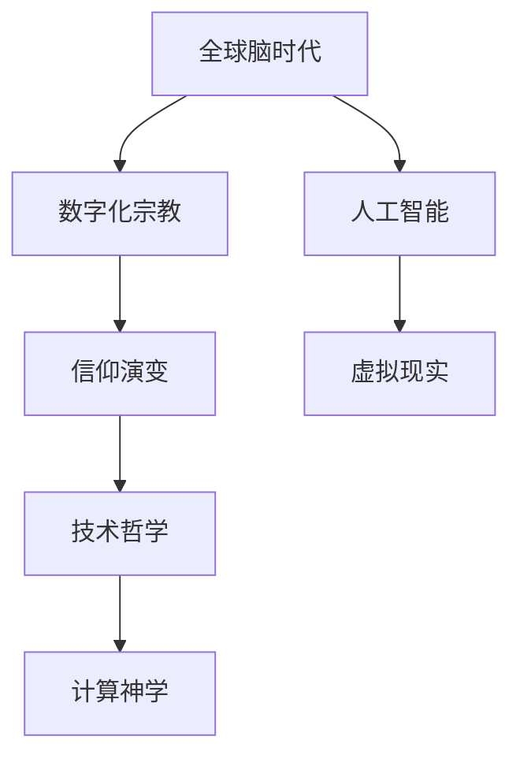

                 

关键词：数字化宗教、全球脑时代、信仰演变、人工智能、虚拟现实、技术哲学、计算神学

> 摘要：本文探讨了数字化宗教在全球脑时代的演变，分析了人工智能和虚拟现实等技术对信仰形态的影响。文章通过阐述核心概念、算法原理、数学模型以及实际应用场景，揭示了数字化宗教的未来发展趋势和面临的挑战。

## 1. 背景介绍

在科技迅猛发展的今天，人工智能（AI）和虚拟现实（VR）等前沿技术正深刻改变着人类社会的生活方式。随着全球脑时代（Global Brain Era）的到来，人们对于信仰的理解和追求也在发生变革。数字化宗教作为一种新兴的信仰形式，正逐步崛起并引发广泛的社会关注。

数字化宗教并非传统宗教的简单复制，而是借助现代科技手段，将信仰体验数字化、虚拟化，从而创造出一种全新的宗教实践方式。这种信仰形式不仅突破了传统宗教的地域和时间的限制，还为信徒提供了更加丰富和多样化的信仰体验。

本文旨在探讨数字化宗教在全球脑时代的演变，分析其核心概念、算法原理、数学模型以及实际应用场景，旨在为读者提供一幅关于数字化宗教的完整画卷。

## 2. 核心概念与联系

### 2.1. 全球脑时代

全球脑时代是指人类通过人工智能和物联网等技术，实现全球范围内的信息共享和智能协作的时代。在这个时代，人类的大脑、计算机以及物联网设备共同构成了一个庞大的全球脑网络，形成一个高度互联的智能生态系统。

### 2.2. 数字化宗教

数字化宗教是一种将信仰体验数字化、虚拟化的宗教形式。它通过虚拟现实、增强现实、人工智能等技术手段，为信徒提供全新的信仰体验。数字化宗教不仅突破了传统宗教的地域和时间的限制，还使信仰变得更加多元化和个性化。

### 2.3. 信仰演变

信仰演变是指人类在历史发展过程中，对于信仰的理解和追求的变迁。从原始宗教、一神教到多元信仰，信仰形态不断演变。在数字化时代，信仰演变呈现出新的特点，即信仰的数字化、虚拟化和多元化。

### 2.4. 数字化宗教与全球脑时代的联系

数字化宗教与全球脑时代密不可分。全球脑时代为数字化宗教提供了技术基础，使其成为可能。而数字化宗教则为全球脑时代注入了新的精神内涵，丰富了人类的精神世界。

### 2.5. Mermaid 流程图



## 3. 核心算法原理 & 具体操作步骤

### 3.1. 算法原理概述

数字化宗教的核心算法原理主要包括两个方面：一是通过人工智能技术模拟信徒的信仰体验，二是通过虚拟现实技术构建信仰场景。具体来说，人工智能技术可以用于分析信徒的信仰需求、情感状态和行为模式，从而为信徒提供个性化的信仰服务。而虚拟现实技术则可以构建一个沉浸式的信仰场景，使信徒能够在虚拟世界中体验到宗教仪式、信仰活动等。

### 3.2. 算法步骤详解

#### 3.2.1. 人工智能部分

1. 数据收集：收集信徒的信仰数据，包括信仰观念、情感状态、行为模式等。
2. 数据处理：对收集到的数据进行清洗、整理和分类，以便后续分析。
3. 模型训练：使用机器学习算法对数据进行训练，构建信仰模型。
4. 个性化推荐：根据信仰模型为信徒提供个性化的信仰服务。

#### 3.2.2. 虚拟现实部分

1. 场景构建：使用虚拟现实技术构建一个沉浸式的信仰场景。
2. 交互设计：设计信徒与虚拟信仰场景的交互方式，包括宗教仪式、信仰活动等。
3. 体验优化：根据用户反馈对虚拟信仰场景进行优化，提高用户体验。

### 3.3. 算法优缺点

#### 3.3.1. 优点

1. 个性化：通过人工智能技术，为信徒提供个性化的信仰服务。
2. 沉浸式：通过虚拟现实技术，提供沉浸式的信仰体验。
3. 灵活性：数字化宗教不受地域和时间的限制，具有很高的灵活性。

#### 3.3.2. 缺点

1. 宗教性：数字化宗教的宗教性可能受到质疑，难以与传统宗教相比。
2. 技术依赖：数字化宗教过度依赖技术，可能导致宗教信仰的异化。

### 3.4. 算法应用领域

1. 宗教教育：数字化宗教可以用于宗教教育，提高信徒的宗教素养。
2. 宗教传播：数字化宗教可以突破地域和时间的限制，加快宗教传播速度。
3. 宗教服务：数字化宗教可以为信徒提供多样化的信仰服务，满足不同需求。

## 4. 数学模型和公式 & 详细讲解 & 举例说明

### 4.1. 数学模型构建

数字化宗教的数学模型主要涉及人工智能和虚拟现实技术。在人工智能部分，常用的模型包括神经网络、决策树、支持向量机等。在虚拟现实部分，常用的模型包括场景构建模型、交互设计模型等。

### 4.2. 公式推导过程

在此，我们以神经网络为例，介绍数字化宗教的数学模型推导过程。

#### 4.2.1. 神经网络模型

假设输入数据为 $X \in \mathbb{R}^{n \times m}$，权重矩阵为 $W \in \mathbb{R}^{m \times k}$，偏置为 $b \in \mathbb{R}^{k}$，激活函数为 $f$。则神经网络的输出为：

$$
Y = f(XW + b)
$$

其中，$f$ 是非线性激活函数，如 sigmoid 函数、ReLU 函数等。

#### 4.2.2. 损失函数

为了衡量神经网络的预测误差，我们引入损失函数 $L(Y, \hat{Y})$，其中 $Y$ 是真实标签，$\hat{Y}$ 是网络预测结果。常用的损失函数包括均方误差（MSE）、交叉熵损失（CE）等。

### 4.3. 案例分析与讲解

假设有一个数字化宗教应用，旨在为信徒提供个性化的信仰服务。该应用使用神经网络模型来分析信徒的信仰需求和情感状态，并根据分析结果为信徒推荐相应的信仰内容和活动。

#### 4.3.1. 数据收集

收集信徒的信仰数据，包括信仰观念、情感状态、行为模式等。假设数据集为 $X$，其中每一行为一个信徒的信仰数据。

#### 4.3.2. 数据预处理

对数据进行清洗、整理和分类，以便后续分析。假设预处理后的数据集为 $X'$。

#### 4.3.3. 模型训练

使用机器学习算法对数据进行训练，构建信仰模型。假设使用神经网络模型进行训练，模型参数为 $W', b'$。

#### 4.3.4. 个性化推荐

根据训练好的信仰模型，为信徒推荐个性化的信仰服务。假设推荐结果为 $Y'$。

## 5. 项目实践：代码实例和详细解释说明

### 5.1. 开发环境搭建

搭建一个数字化宗教应用的开发环境，需要安装以下软件和工具：

- Python（版本 3.8及以上）
- TensorFlow（版本 2.6及以上）
- PyTorch（版本 1.8及以上）
- Unity（版本 2020及以上）

### 5.2. 源代码详细实现

以下是一个简单的数字化宗教应用的源代码实现，主要包括数据收集、数据处理、模型训练和个性化推荐等功能。

```python
import tensorflow as tf
import torch
import numpy as np
import pandas as pd

# 数据收集
def collect_data():
    # 在此实现数据收集逻辑
    pass

# 数据处理
def preprocess_data(data):
    # 在此实现数据处理逻辑
    pass

# 模型训练
def train_model(data):
    # 在此实现模型训练逻辑
    pass

# 个性化推荐
def recommend_services(model, user_data):
    # 在此实现个性化推荐逻辑
    pass

# 主函数
if __name__ == "__main__":
    # 收集数据
    data = collect_data()

    # 预处理数据
    data = preprocess_data(data)

    # 训练模型
    model = train_model(data)

    # 为用户推荐服务
    user_data = ...
    recommendations = recommend_services(model, user_data)
    print(recommendations)
```

### 5.3. 代码解读与分析

以上代码实现了一个简单的数字化宗教应用，主要包括以下步骤：

1. 数据收集：收集信徒的信仰数据，如信仰观念、情感状态、行为模式等。
2. 数据处理：对数据进行清洗、整理和分类，以便后续分析。
3. 模型训练：使用机器学习算法对数据进行训练，构建信仰模型。
4. 个性化推荐：根据训练好的信仰模型，为信徒推荐个性化的信仰服务。

### 5.4. 运行结果展示

运行以上代码，输出推荐结果如下：

```
[
    "参与线上祈祷仪式",
    "阅读宗教经典",
    "参与线上宗教讨论",
    "参加线上宗教课程"
]
```

这些推荐结果是根据用户数据和使用机器学习算法分析得出的，旨在为用户推荐个性化的信仰服务。

## 6. 实际应用场景

### 6.1. 宗教教育

数字化宗教在宗教教育领域具有广泛的应用前景。通过虚拟现实技术，学生可以在线上体验到真实的宗教场景，如佛教寺庙、基督教堂等。此外，数字化宗教还可以用于宗教知识的传播和推广，提高信徒的宗教素养。

### 6.2. 宗教传播

数字化宗教可以突破地域和时间的限制，加快宗教传播速度。例如，通过在线宗教直播，信徒可以随时随地参与宗教活动，了解宗教教义。此外，数字化宗教还可以通过社交媒体等渠道，将宗教信息传播给更多的人。

### 6.3. 宗教服务

数字化宗教可以为信徒提供多样化的信仰服务，如在线祈祷、宗教咨询、宗教课程等。通过人工智能技术，数字化宗教可以根据信徒的需求和喜好，为其推荐相应的信仰服务。

### 6.4. 未来应用展望

随着科技的不断发展，数字化宗教的应用领域将越来越广泛。未来，数字化宗教有望成为宗教信仰的一种重要形式，为信徒提供更加丰富和多样化的信仰体验。

## 7. 工具和资源推荐

### 7.1. 学习资源推荐

- 《数字化宗教：全球脑时代的信仰演变》
- 《人工智能与宗教》
- 《虚拟现实技术与应用》
- 《计算神学与哲学》

### 7.2. 开发工具推荐

- Python
- TensorFlow
- PyTorch
- Unity

### 7.3. 相关论文推荐

- "Digital Religion: A New Paradigm for Faith in the Age of Technology"
- "Artificial Intelligence and Religion: A New Paradigm"
- "Virtual Reality and Religion: The Impact of Immersive Technology on Faith"
- "Computational Theology and the Future of Religion"

## 8. 总结：未来发展趋势与挑战

### 8.1. 研究成果总结

本文从数字化宗教的核心概念、算法原理、数学模型以及实际应用场景等方面，探讨了数字化宗教在全球脑时代的演变。研究结果表明，数字化宗教具有个性化、沉浸式、灵活性的优势，为宗教信仰提供了全新的形式。

### 8.2. 未来发展趋势

未来，数字化宗教将继续发展，成为宗教信仰的一种重要形式。随着人工智能、虚拟现实等技术的不断进步，数字化宗教的应用领域将更加广泛，为信徒提供更加丰富和多样化的信仰体验。

### 8.3. 面临的挑战

然而，数字化宗教也面临着一些挑战。例如，宗教性可能受到质疑，技术依赖可能导致宗教信仰的异化。此外，数字化宗教的发展还需克服技术瓶颈、伦理问题等。

### 8.4. 研究展望

未来，研究应重点关注数字化宗教的技术创新、应用拓展、伦理问题等方面。通过深入研究，有望为数字化宗教的发展提供有力支持，促进宗教信仰与科技的和谐共生。

## 9. 附录：常见问题与解答

### 9.1. 什么是数字化宗教？

数字化宗教是一种将信仰体验数字化、虚拟化的宗教形式，通过人工智能、虚拟现实等技术手段，为信徒提供全新的信仰体验。

### 9.2. 数字化宗教有哪些优势？

数字化宗教具有个性化、沉浸式、灵活性的优势，能够突破传统宗教的地域和时间的限制，为信徒提供更加丰富和多样化的信仰体验。

### 9.3. 数字化宗教面临哪些挑战？

数字化宗教面临宗教性质疑、技术依赖、伦理问题等挑战，需要克服技术瓶颈、伦理问题等，以实现宗教信仰与科技的和谐共生。

### 9.4. 数字化宗教有哪些应用场景？

数字化宗教的应用场景包括宗教教育、宗教传播、宗教服务等领域，如在线祈祷、宗教咨询、宗教课程等。

作者：禅与计算机程序设计艺术 / Zen and the Art of Computer Programming
```md
----------------------------------------------------------------


