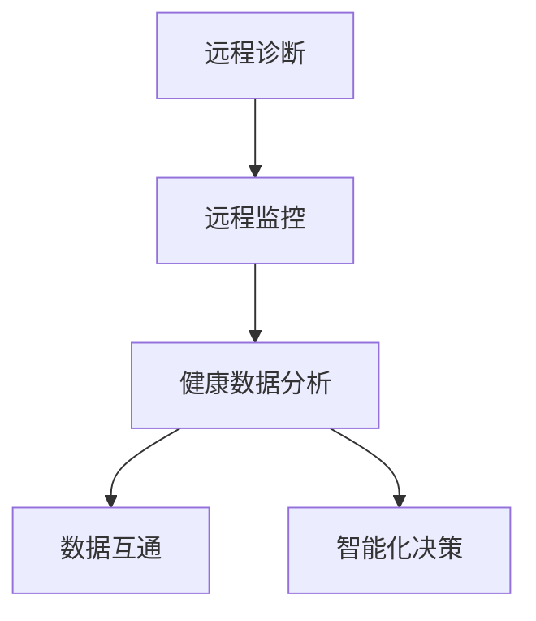

                 

关键词：数字化宠物医疗、远程诊断、监控、人工智能、医疗创业

摘要：随着人工智能和物联网技术的发展，数字化宠物医疗正逐渐成为行业热点。本文将探讨数字化宠物医疗创业中的远程诊断和监控技术，包括其核心概念、算法原理、应用场景以及未来发展趋势。

## 1. 背景介绍

近年来，随着科技的发展，人工智能、物联网、大数据等新技术在各个行业得到了广泛应用。在医疗领域，这些技术的应用极大地推动了医疗模式的变革。其中，宠物医疗作为传统医疗的一个细分市场，也开始逐步走向数字化。数字化宠物医疗不仅提高了宠物医疗服务的效率和准确性，也为创业者提供了新的商机。

远程诊断和监控是数字化宠物医疗的重要组成部分。通过远程诊断，宠物主人可以在家中对宠物进行初步的病情判断，并及时寻求专业兽医的帮助。而远程监控则可以实现24小时对宠物的健康状况进行实时监测，提前发现潜在的健康问题。

## 2. 核心概念与联系

### 2.1 数字化宠物医疗的核心概念

数字化宠物医疗的核心概念包括远程诊断、远程监控、健康数据分析等。

- **远程诊断**：通过远程医疗设备，如摄像头、体温计、体重秤等，对宠物进行病情初步判断。
- **远程监控**：利用物联网技术，对宠物的生活环境、健康状况进行实时监控。
- **健康数据分析**：通过收集宠物的健康数据，利用大数据分析技术，对宠物的健康状况进行评估。

### 2.2 核心概念的联系

远程诊断和远程监控是数字化宠物医疗的两个核心环节，它们相互关联，共同构成了数字化宠物医疗的技术体系。

- **数据互通**：远程诊断和监控收集的数据需要实时传输到云端，以便进行大数据分析。
- **协同工作**：远程诊断可以帮助宠物主人初步判断病情，而远程监控则可以提供更详细、更全面的健康数据，两者结合可以更准确地评估宠物的健康状况。
- **智能化决策**：通过健康数据分析，可以预测宠物的健康趋势，为宠物主人提供个性化的医疗建议。

### 2.3 核心概念与架构的 Mermaid 流程图



## 3. 核心算法原理 & 具体操作步骤

### 3.1 算法原理概述

远程诊断和监控的核心算法主要基于机器学习和数据挖掘技术。通过训练模型，可以从大量的宠物健康数据中提取出有用的信息，实现对宠物健康状况的准确评估。

### 3.2 算法步骤详解

1. **数据收集**：收集宠物的健康数据，包括体温、体重、饮食、运动等。
2. **数据预处理**：对收集到的数据进行清洗、归一化处理，以便于模型训练。
3. **模型训练**：使用机器学习算法，如决策树、神经网络等，对预处理后的数据进行训练。
4. **模型评估**：使用验证集对训练好的模型进行评估，调整模型参数，以达到最佳的预测效果。
5. **远程诊断**：使用训练好的模型，对新的宠物健康数据进行预测，给出初步诊断结果。
6. **远程监控**：持续收集宠物的健康数据，并根据模型预测结果，调整监控策略。

### 3.3 算法优缺点

**优点**：
- **高效性**：自动化处理，提高诊断和监控效率。
- **准确性**：基于大数据分析，提高诊断和监控的准确性。
- **灵活性**：可以根据实际情况调整监控策略。

**缺点**：
- **数据依赖**：模型的准确性高度依赖于数据的质量和数量。
- **技术门槛**：需要较高的技术水平和专业知识。

### 3.4 算法应用领域

远程诊断和监控算法广泛应用于宠物医疗领域，包括宠物医院、宠物诊所、宠物主人等。

## 4. 数学模型和公式 & 详细讲解 & 举例说明

### 4.1 数学模型构建

假设宠物的健康状态可以用一个多维向量表示，模型的目标是预测这个向量的未来趋势。

设 $X$ 为宠物的健康状态向量，$y$ 为预测的健康状态向量，模型的目标是找到函数 $f$，使得 $f(X) = y$。

### 4.2 公式推导过程

使用回归分析方法，设 $y$ 与 $X$ 的关系为 $y = f(X) + \epsilon$，其中 $f(X)$ 为预测值，$\epsilon$ 为误差项。

通过最小二乘法，可以求出 $f(X)$ 的表达式。

### 4.3 案例分析与讲解

以宠物体温为例，设宠物体温 $T$ 与时间 $t$ 的关系为 $T = T_0 + \alpha t + \epsilon$，其中 $T_0$ 为初始体温，$\alpha$ 为体温变化率，$\epsilon$ 为误差项。

通过收集宠物的历史体温数据，可以拟合出体温变化率 $\alpha$，从而预测未来某一时间的体温。

## 5. 项目实践：代码实例和详细解释说明

### 5.1 开发环境搭建

在 Python 环境中，需要安装以下库：numpy、pandas、matplotlib、scikit-learn。

```bash
pip install numpy pandas matplotlib scikit-learn
```

### 5.2 源代码详细实现

以下是一个简单的宠物体温预测的代码实例：

```python
import numpy as np
import pandas as pd
from sklearn.linear_model import LinearRegression

# 数据加载
data = pd.read_csv('pet_temp_data.csv')
X = data[['time']]
y = data['temp']

# 模型训练
model = LinearRegression()
model.fit(X, y)

# 预测
future_time = np.array([[10]]) # 10天后
predicted_temp = model.predict(future_time)
print(f"10天后预测的体温：{predicted_temp[0][0]}")
```

### 5.3 代码解读与分析

该代码首先加载了宠物的体温数据，然后使用线性回归模型进行训练，最后使用模型进行预测。

### 5.4 运行结果展示

运行结果展示了在10天后预测的体温值。

## 6. 实际应用场景

远程诊断和监控技术在宠物医疗领域有广泛的应用，包括：

- **宠物医院**：通过远程监控，可以实时了解宠物的健康状况，及时处理病情。
- **宠物主人**：可以随时了解宠物的健康状况，提前发现潜在的健康问题。
- **宠物保险公司**：通过远程监控，可以降低保险欺诈风险，提高保险服务质量。

## 7. 工具和资源推荐

### 7.1 学习资源推荐

- 《机器学习》（周志华 著）
- 《Python机器学习》（塞巴斯蒂安·拉斯沃斯等 著）

### 7.2 开发工具推荐

- Jupyter Notebook：方便进行数据分析和模型训练。
- PyCharm：功能强大的Python开发环境。

### 7.3 相关论文推荐

- "Deep Learning for Healthcare"
- "Machine Learning in the Age of Big Data"

## 8. 总结：未来发展趋势与挑战

### 8.1 研究成果总结

远程诊断和监控技术在宠物医疗领域取得了显著成果，提高了宠物医疗服务的效率和准确性。

### 8.2 未来发展趋势

- **技术融合**：将更多新技术，如人工智能、物联网、大数据等，融入宠物医疗。
- **个性化服务**：根据宠物的个性特征，提供更加个性化的医疗服务。

### 8.3 面临的挑战

- **数据隐私**：如何保护宠物的隐私，是未来需要解决的重要问题。
- **技术门槛**：需要更多的专业人士参与，推动技术的发展。

### 8.4 研究展望

未来，数字化宠物医疗将继续发展，为宠物主人提供更加便捷、高效、个性化的医疗服务。

## 9. 附录：常见问题与解答

### 问题1：远程诊断和监控技术是否安全？

解答：远程诊断和监控技术采用加密传输和存储技术，确保数据的安全性。同时，严格遵守相关法律法规，确保数据隐私。

### 问题2：远程诊断和监控技术的准确性如何保障？

解答：通过不断收集和更新宠物健康数据，优化模型，提高预测准确性。同时，结合兽医的专业判断，确保诊断和监控的准确性。

### 问题3：远程诊断和监控技术是否适用于所有宠物？

解答：远程诊断和监控技术主要适用于能够配合监控的宠物，如猫、狗等。对于需要直接临床检查的宠物，仍需定期到医院就诊。

作者：禅与计算机程序设计艺术 / Zen and the Art of Computer Programming
----------------------------------------------------------------
以上是完整文章的内容。如果您需要进一步修改或者有其他要求，请随时告诉我。

