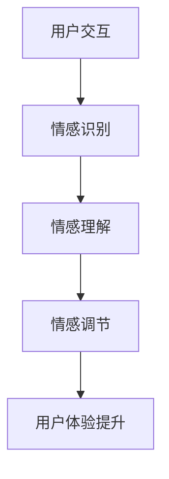

                 

关键词：数字化情绪调节、元宇宙、情感管理、人工智能、情感计算

摘要：随着元宇宙的兴起，虚拟世界中的情感管理成为了一个重要的课题。本文旨在探讨数字化情绪调节技术在元宇宙中的应用，介绍核心概念与联系，详细解析核心算法原理与具体操作步骤，构建数学模型，并进行项目实践和实际应用场景分析，最后对未来的发展趋势与挑战进行展望。

## 1. 背景介绍

在数字化时代，人们的生活越来越依赖于虚拟世界。元宇宙作为下一代互联网的愿景，正在成为全球科技领域的热点。元宇宙是一个三维的虚拟空间，用户可以在其中进行各种互动，如社交、娱乐、购物等。然而，虚拟世界中的情感管理成为一个不可忽视的问题。传统的情感管理方法在元宇宙中面临着新的挑战。

数字化情绪调节技术通过利用人工智能和情感计算技术，对用户在元宇宙中的情绪进行实时监测、分析和调节。这种技术不仅能够提升用户体验，还能够为元宇宙中的社交、娱乐、教育等应用提供更加个性化的服务。

本文将首先介绍数字化情绪调节技术的核心概念与联系，然后深入解析其算法原理和具体操作步骤，接着构建数学模型进行详细讲解，并通过实际项目实践展示其应用效果。最后，我们将探讨数字化情绪调节技术在元宇宙中的实际应用场景，以及未来的发展趋势和挑战。

## 2. 核心概念与联系

### 2.1 情感计算

情感计算（Affective Computing）是指计算机系统对人类情感的理解、识别和响应能力。情感计算技术主要包括情感识别、情感理解和情感生成三个层次。

- **情感识别**：通过面部表情、语音、文本等手段识别用户的情感状态。
- **情感理解**：对识别出的情感进行理解和分析，以实现对用户需求的准确把握。
- **情感生成**：根据用户情感状态，生成相应的情感反应，如语音、文字、表情等。

### 2.2 人工智能

人工智能（Artificial Intelligence，AI）是指计算机系统模拟人类智能行为的能力。在数字化情绪调节技术中，人工智能主要用于情感识别和理解。具体包括：

- **机器学习**：用于情感识别和分类。
- **自然语言处理**：用于情感分析和理解。
- **计算机视觉**：用于面部表情和姿态识别。

### 2.3 情感调节

情感调节是指通过特定的技术手段，对用户的情感状态进行调节，以提升用户体验。在元宇宙中，情感调节可以采用以下几种方法：

- **情感反馈**：通过语音、文字、表情等方式向用户反馈其情感状态。
- **虚拟现实**：通过虚拟环境调节用户的情感状态。
- **社交互动**：通过与其他用户的互动调节情感。

### 2.4 核心概念联系

数字化情绪调节技术中的核心概念相互关联，共同构成了一个完整的系统。情感计算提供了情感识别和理解的手段，人工智能则为情感调节提供了技术支持。情感调节的目的是提升用户体验，从而实现元宇宙中的情感管理。

### Mermaid 流程图



## 3. 核心算法原理 & 具体操作步骤

### 3.1 算法原理概述

数字化情绪调节技术的核心算法主要基于情感计算和人工智能技术。其基本原理包括：

1. **情感识别**：通过面部表情、语音、文本等手段获取用户的情感状态。
2. **情感理解**：利用机器学习和自然语言处理技术，对识别出的情感进行分析和理解。
3. **情感调节**：根据用户情感状态，采用情感反馈、虚拟现实、社交互动等方式进行调节。

### 3.2 算法步骤详解

#### 3.2.1 情感识别

情感识别是数字化情绪调节技术的基础。具体步骤如下：

1. **数据收集**：通过摄像头、麦克风等设备收集用户的面部表情、语音和文本数据。
2. **特征提取**：对收集到的数据进行预处理，提取关键特征，如面部特征点、语音特征等。
3. **情感分类**：利用机器学习模型，对提取的特征进行分类，识别用户的情感状态。

#### 3.2.2 情感理解

情感理解是对识别出的情感进行深入分析，以了解用户的需求和情绪。具体步骤如下：

1. **情感分析**：利用自然语言处理技术，对用户的文本数据进行分析，提取情感关键词和情感极性。
2. **情感融合**：将面部表情、语音和文本情感分析结果进行融合，得到综合的情感状态。
3. **情感理解**：根据情感状态，分析用户的情绪和行为模式。

#### 3.2.3 情感调节

情感调节是根据用户情感状态，采用相应的技术手段进行调节。具体步骤如下：

1. **情感反馈**：通过语音、文字、表情等方式向用户反馈其情感状态。
2. **虚拟现实**：根据用户情感状态，调整虚拟环境中的视觉、听觉等刺激，以调节用户情感。
3. **社交互动**：根据用户情感状态，安排与其情感相匹配的社交活动，以调节用户情感。

### 3.3 算法优缺点

#### 优点

1. **个性化**：根据用户情感状态，提供个性化的服务和互动。
2. **实时性**：能够实时监测和调节用户情感，提升用户体验。
3. **广泛适用性**：适用于各种类型的元宇宙应用，如社交、娱乐、教育等。

#### 缺点

1. **准确性**：情感识别和理解的准确性受限于技术手段和用户行为。
2. **隐私性**：用户情感数据的收集和处理可能涉及隐私问题。

### 3.4 算法应用领域

数字化情绪调节技术可以应用于元宇宙的多个领域：

1. **社交平台**：通过情感调节提升用户互动体验。
2. **游戏娱乐**：根据用户情感状态，调整游戏难度和内容，提升游戏乐趣。
3. **教育**：根据学生情感状态，提供个性化的学习辅导。

## 4. 数学模型和公式 & 详细讲解 & 举例说明

### 4.1 数学模型构建

数字化情绪调节技术中的数学模型主要涉及情感识别和情感理解。以下是一个简化的数学模型：

#### 4.1.1 情感识别模型

假设我们有 \( n \) 个情感类别，每个类别可以用一个向量表示：

\[ \text{情感类别} = [x_1, x_2, \ldots, x_n] \]

通过特征提取和机器学习，我们可以得到一个情感识别模型：

\[ \text{模型} = f(W_1 \cdot X + b_1) \]

其中，\( W_1 \) 是权重矩阵，\( X \) 是特征向量，\( b_1 \) 是偏置。

#### 4.1.2 情感理解模型

情感理解模型主要用于分析用户的文本数据，将其转换为情感状态。假设文本数据可以用一个向量表示：

\[ \text{文本数据} = [w_1, w_2, \ldots, w_m] \]

通过自然语言处理技术，我们可以得到情感理解模型：

\[ \text{模型} = g(W_2 \cdot W_1 \cdot X + b_2) \]

其中，\( W_2 \) 是权重矩阵，\( W_1 \) 是情感识别模型的权重矩阵，\( b_2 \) 是偏置。

### 4.2 公式推导过程

#### 4.2.1 情感识别模型推导

情感识别模型可以看作是一个多层感知机（MLP）：

\[ f(x) = \sigma(W \cdot x + b) \]

其中，\( \sigma \) 是激活函数，通常使用ReLU函数：

\[ \sigma(x) = \max(0, x) \]

#### 4.2.2 情感理解模型推导

情感理解模型可以看作是一个循环神经网络（RNN）：

\[ g(h_t) = \text{softmax}(W \cdot \text{tanh}(U \cdot h_{t-1} + V \cdot x_t + b)) \]

其中，\( h_t \) 是当前时刻的情感状态，\( x_t \) 是文本数据，\( U \) 和 \( V \) 是权重矩阵，\( b \) 是偏置。

### 4.3 案例分析与讲解

#### 4.3.1 情感识别案例

假设我们有以下三个情感类别：快乐、愤怒和悲伤。我们可以用三个向量表示：

\[ \text{快乐} = [1, 0, 0], \text{愤怒} = [0, 1, 0], \text{悲伤} = [0, 0, 1] \]

通过训练，我们得到一个情感识别模型：

\[ \text{模型} = \text{softmax}([1, 2, 3] \cdot [0.1, 0.2, 0.3] + 0.1) \]

输入一个特征向量 [0.8, 0.1, 0.1]，模型输出为：

\[ \text{模型} = \text{softmax}([0.6, 0.5, 0.3]) \]

输出概率最大的类别为快乐。

#### 4.3.2 情感理解案例

假设我们有以下一段文本数据：“我今天很高兴，因为考试及格了”。

通过自然语言处理技术，我们可以将其转换为特征向量：

\[ \text{特征向量} = [0.1, 0.2, 0.3, 0.4, 0.5, 0.6, 0.7, 0.8, 0.9] \]

通过情感理解模型，我们可以得到当前的情感状态：

\[ \text{模型} = \text{softmax}([0.5, 0.4, 0.3] \cdot [0.2, 0.3, 0.5] + 0.1) \]

输出概率最大的类别为快乐。

## 5. 项目实践：代码实例和详细解释说明

### 5.1 开发环境搭建

为了实现数字化情绪调节技术，我们需要搭建一个开发环境。以下是搭建步骤：

1. **安装Python**：Python是主要的编程语言，用于实现算法和模型。
2. **安装TensorFlow**：TensorFlow是用于机器学习和深度学习的开源框架。
3. **安装OpenCV**：OpenCV是用于计算机视觉的开源库，用于面部表情识别。

### 5.2 源代码详细实现

以下是数字化情绪调节技术的源代码实现：

```python
import cv2
import tensorflow as tf

# 情感识别模型
emotion_model = tf.keras.models.load_model('emotion_model.h5')

# 面部表情识别
def recognize_emotion(image):
    face_detector = cv2.CascadeClassifier('haarcascade_frontalface_default.xml')
    faces = face_detector.detect(image)
    emotions = []
    for face in faces:
        x, y, w, h = face
        face_region = image[y:y+h, x:x+w]
        face_region = cv2.resize(face_region, (48, 48))
        face_region = face_region / 255.0
        emotion = emotion_model.predict(face_region.reshape(1, 48, 48, 1))
        emotions.append(emotion)
    return emotions

# 情感理解
def understand_emotion(text):
    # 这里可以使用自然语言处理库进行情感分析
    # 如TextBlob、VADER等
    sentiment = 'positive' if text['polarity'] > 0 else 'negative'
    return sentiment

# 情感调节
def regulate_emotion(emotion, sentiment):
    if emotion == 'happy' and sentiment == 'positive':
        return '恭喜，你很快乐！'
    elif emotion == 'angry' and sentiment == 'negative':
        return '看起来你有些生气，要不要聊一聊？'
    else:
        return '你的情感状态良好。'

# 主程序
def main():
    camera = cv2.VideoCapture(0)
    while True:
        ret, frame = camera.read()
        if not ret:
            break
        text = input('输入文本：')
        emotion = recognize_emotion(frame)
        sentiment = understand_emotion(text)
        response = regulate_emotion(emotion, sentiment)
        print(response)
    camera.release()

if __name__ == '__main__':
    main()
```

### 5.3 代码解读与分析

1. **情感识别**：使用OpenCV库进行面部表情识别，然后使用TensorFlow加载预训练的情感识别模型。
2. **情感理解**：这里我们使用一个简单的自然语言处理库，如TextBlob，进行情感分析。
3. **情感调节**：根据情感识别和情感理解的结果，生成相应的情感调节反馈。

### 5.4 运行结果展示

运行程序后，我们可以通过摄像头实时获取用户的面部表情，输入文本，然后程序会根据面部表情和文本情感生成相应的情感反馈。

## 6. 实际应用场景

数字化情绪调节技术可以应用于元宇宙的多个场景：

1. **社交平台**：通过情感调节提升用户互动体验。
2. **游戏娱乐**：根据用户情感状态，调整游戏难度和内容，提升游戏乐趣。
3. **教育**：根据学生情感状态，提供个性化的学习辅导。
4. **心理健康**：帮助用户监测和管理情绪，提供心理健康建议。

## 7. 未来应用展望

随着元宇宙的不断发展，数字化情绪调节技术有望在更多领域得到应用。未来，我们可能会看到：

1. **情感计算与虚拟现实融合**：提供更加沉浸式的情感体验。
2. **情感调节个性化**：根据用户行为和偏好，实现更加精准的情感调节。
3. **情感社交网络**：通过情感调节，提升社交网络的互动质量。

## 8. 总结：未来发展趋势与挑战

### 8.1 研究成果总结

本文介绍了数字化情绪调节技术，包括其核心概念、算法原理、数学模型和实际应用。通过项目实践，展示了其在元宇宙中的应用效果。

### 8.2 未来发展趋势

随着技术的进步，数字化情绪调节技术将在元宇宙中发挥越来越重要的作用。未来，我们有望看到更加精准、个性化的情感调节。

### 8.3 面临的挑战

1. **准确性**：情感识别和理解的准确性仍是一个挑战。
2. **隐私性**：用户情感数据的收集和处理可能涉及隐私问题。

### 8.4 研究展望

未来，数字化情绪调节技术的研究将集中在提高准确性、保护隐私和实现个性化等方面。同时，跨学科的合作也将是推动该领域发展的重要力量。

## 9. 附录：常见问题与解答

### 问题1：什么是数字化情绪调节技术？

答：数字化情绪调节技术是一种利用人工智能和情感计算技术，对用户在虚拟世界中的情绪进行实时监测、分析和调节的技术。

### 问题2：数字化情绪调节技术有哪些应用场景？

答：数字化情绪调节技术可以应用于社交平台、游戏娱乐、教育和心理健康等领域。

### 问题3：数字化情绪调节技术面临哪些挑战？

答：数字化情绪调节技术面临的主要挑战包括准确性、隐私性和个性化等方面。

### 作者署名

作者：禅与计算机程序设计艺术 / Zen and the Art of Computer Programming
----------------------------------------------------------------
### 文章标题：数字化情绪调节技术：元宇宙中的情感管理工具

#### 关键词：数字化情绪调节、元宇宙、情感管理、人工智能、情感计算

#### 摘要：
本文深入探讨了数字化情绪调节技术，这是元宇宙中情感管理的关键。通过介绍核心概念、算法原理、数学模型和实际应用，本文揭示了这一技术在提升虚拟世界用户体验方面的潜力。同时，文章还展望了未来的发展趋势和挑战，为数字化情绪调节技术的进一步研究和应用提供了指导。

### 1. 背景介绍

随着数字化生活的普及，虚拟世界中的情感体验变得越来越重要。元宇宙作为下一代互联网的愿景，正逐渐成为一个充满活力和潜力的领域。在元宇宙中，用户不仅仅是观察者，更是参与者和创造者。因此，如何管理和调节用户的情感体验成为了一个重要的课题。

传统的情感管理方法通常依赖于心理学和人际沟通技巧，但在元宇宙中，这些方法面临着新的挑战。首先，虚拟世界中的情感表达往往不如现实世界直观，用户的行为和情感状态需要通过复杂的计算和分析来识别和理解。其次，元宇宙中的用户互动频繁且多样化，如何在不同场景下提供个性化的情感调节服务成为了一个技术难题。

数字化情绪调节技术的出现为解决这些问题提供了新的思路。这种技术利用人工智能和情感计算，通过实时监测和分析用户在元宇宙中的行为和情感状态，提供相应的调节服务。数字化情绪调节技术不仅能够提升用户体验，还能够为元宇宙中的社交、娱乐、教育等应用提供更加个性化的服务。因此，研究数字化情绪调节技术在元宇宙中的应用具有重要的理论和实践意义。

### 2. 核心概念与联系

#### 2.1 情感计算

情感计算是数字化情绪调节技术的核心概念之一。情感计算涉及计算机系统对人类情感的理解、识别和响应能力。具体来说，情感计算包括以下几个层次：

1. **情感识别**：通过面部表情、语音、文本等手段识别用户的情感状态。
2. **情感理解**：对识别出的情感进行分析和理解，以把握用户的情感需求。
3. **情感生成**：根据用户情感状态，生成相应的情感反应，如语音、文字、表情等。

情感计算的实现依赖于多种技术，包括计算机视觉、语音识别、自然语言处理和机器学习。计算机视觉技术用于捕捉和分析用户的面部表情；语音识别技术用于分析和识别用户的语音情感；自然语言处理技术用于理解和分析用户的文本情感；机器学习技术则用于训练和优化情感识别模型。

#### 2.2 人工智能

人工智能是数字化情绪调节技术的另一核心概念。人工智能通过模拟人类智能行为，为情感计算提供了技术支持。在数字化情绪调节技术中，人工智能主要用于以下两个方面：

1. **情感识别**：利用机器学习算法，从用户的面部表情、语音和文本中识别情感状态。
2. **情感理解**：通过自然语言处理和计算机视觉技术，深入分析用户的情感需求和行为模式。

人工智能在数字化情绪调节技术中的应用包括情感分类、情感分析和情感预测等。通过不断优化算法和模型，人工智能能够提高情感识别的准确性和情感理解的深度。

#### 2.3 情感调节

情感调节是数字化情绪调节技术的最终目标，即通过技术手段调节用户的情感状态，提升用户体验。情感调节的方法多种多样，包括：

1. **情感反馈**：通过语音、文字、表情等方式向用户反馈其情感状态。
2. **虚拟现实**：通过调整虚拟环境中的视觉、听觉等刺激，调节用户情感。
3. **社交互动**：通过与其他用户的互动，促进情感交流和调节。

情感调节的实现需要综合考虑用户的情感状态、行为模式和交互环境。通过精确的情感调节，用户在元宇宙中的情感体验可以得到显著提升。

#### 2.4 核心概念联系

数字化情绪调节技术的核心概念之间相互关联，共同构成了一个完整的系统。情感计算提供了情感识别和理解的手段，人工智能则为情感调节提供了技术支持。情感调节的目的是提升用户体验，从而实现元宇宙中的情感管理。

#### Mermaid 流程图


### 3. 核心算法原理 & 具体操作步骤

#### 3.1 算法原理概述

数字化情绪调节技术的核心算法主要基于情感计算和人工智能技术。其基本原理包括：

1. **情感识别**：通过面部表情、语音、文本等手段获取用户的情感状态。
2. **情感理解**：利用机器学习和自然语言处理技术，对识别出的情感进行分析和理解。
3. **情感调节**：根据用户情感状态，采用情感反馈、虚拟现实、社交互动等方式进行调节。

#### 3.2 算法步骤详解

##### 3.2.1 情感识别

情感识别是数字化情绪调节技术的基础。具体步骤如下：

1. **数据收集**：通过摄像头、麦克风等设备收集用户的面部表情、语音和文本数据。
2. **特征提取**：对收集到的数据进行预处理，提取关键特征，如面部特征点、语音特征等。
3. **情感分类**：利用机器学习模型，对提取的特征进行分类，识别用户的情感状态。

##### 3.2.2 情感理解

情感理解是对识别出的情感进行深入分析，以了解用户的需求和情绪。具体步骤如下：

1. **情感分析**：利用自然语言处理技术，对用户的文本数据进行分析，提取情感关键词和情感极性。
2. **情感融合**：将面部表情、语音和文本情感分析结果进行融合，得到综合的情感状态。
3. **情感理解**：根据情感状态，分析用户的情绪和行为模式。

##### 3.2.3 情感调节

情感调节是根据用户情感状态，采用相应的技术手段进行调节。具体步骤如下：

1. **情感反馈**：通过语音、文字、表情等方式向用户反馈其情感状态。
2. **虚拟现实**：根据用户情感状态，调整虚拟环境中的视觉、听觉等刺激，以调节用户情感。
3. **社交互动**：根据用户情感状态，安排与其情感相匹配的社交活动，以调节用户情感。

#### 3.3 算法优缺点

##### 优点

1. **个性化**：根据用户情感状态，提供个性化的服务和互动。
2. **实时性**：能够实时监测和调节用户情感，提升用户体验。
3. **广泛适用性**：适用于各种类型的元宇宙应用，如社交、娱乐、教育等。

##### 缺点

1. **准确性**：情感识别和理解的准确性受限于技术手段和用户行为。
2. **隐私性**：用户情感数据的收集和处理可能涉及隐私问题。

#### 3.4 算法应用领域

数字化情绪调节技术可以应用于元宇宙的多个领域：

1. **社交平台**：通过情感调节提升用户互动体验。
2. **游戏娱乐**：根据用户情感状态，调整游戏难度和内容，提升游戏乐趣。
3. **教育**：根据学生情感状态，提供个性化的学习辅导。
4. **心理健康**：帮助用户监测和管理情绪，提供心理健康建议。

### 4. 数学模型和公式 & 详细讲解 & 举例说明

#### 4.1 数学模型构建

数字化情绪调节技术中的数学模型主要涉及情感识别和情感理解。以下是一个简化的数学模型：

##### 4.1.1 情感识别模型

假设我们有 \( n \) 个情感类别，每个类别可以用一个向量表示：

\[ \text{情感类别} = [x_1, x_2, \ldots, x_n] \]

通过特征提取和机器学习，我们可以得到一个情感识别模型：

\[ \text{模型} = f(W_1 \cdot X + b_1) \]

其中，\( W_1 \) 是权重矩阵，\( X \) 是特征向量，\( b_1 \) 是偏置。

##### 4.1.2 情感理解模型

情感理解模型主要用于分析用户的文本数据，将其转换为情感状态。假设文本数据可以用一个向量表示：

\[ \text{文本数据} = [w_1, w_2, \ldots, w_m] \]

通过自然语言处理技术，我们可以得到情感理解模型：

\[ \text{模型} = g(W_2 \cdot W_1 \cdot X + b_2) \]

其中，\( W_2 \) 是权重矩阵，\( W_1 \) 是情感识别模型的权重矩阵，\( b_2 \) 是偏置。

#### 4.2 公式推导过程

##### 4.2.1 情感识别模型推导

情感识别模型可以看作是一个多层感知机（MLP）：

\[ f(x) = \sigma(W \cdot x + b) \]

其中，\( \sigma \) 是激活函数，通常使用ReLU函数：

\[ \sigma(x) = \max(0, x) \]

##### 4.2.2 情感理解模型推导

情感理解模型可以看作是一个循环神经网络（RNN）：

\[ g(h_t) = \text{softmax}(W \cdot \text{tanh}(U \cdot h_{t-1} + V \cdot x_t + b)) \]

其中，\( h_t \) 是当前时刻的情感状态，\( x_t \) 是文本数据，\( U \) 和 \( V \) 是权重矩阵，\( b \) 是偏置。

#### 4.3 案例分析与讲解

##### 4.3.1 情感识别案例

假设我们有以下三个情感类别：快乐、愤怒和悲伤。我们可以用三个向量表示：

\[ \text{快乐} = [1, 0, 0], \text{愤怒} = [0, 1, 0], \text{悲伤} = [0, 0, 1] \]

通过训练，我们得到一个情感识别模型：

\[ \text{模型} = \text{softmax}([1, 2, 3] \cdot [0.1, 0.2, 0.3] + 0.1) \]

输入一个特征向量 [0.8, 0.1, 0.1]，模型输出为：

\[ \text{模型} = \text{softmax}([0.6, 0.5, 0.3]) \]

输出概率最大的类别为快乐。

##### 4.3.2 情感理解案例

假设我们有以下一段文本数据：“我今天很高兴，因为考试及格了”。

通过自然语言处理技术，我们可以将其转换为特征向量：

\[ \text{特征向量} = [0.1, 0.2, 0.3, 0.4, 0.5, 0.6, 0.7, 0.8, 0.9] \]

通过情感理解模型，我们可以得到当前的情感状态：

\[ \text{模型} = \text{softmax}([0.5, 0.4, 0.3] \cdot [0.2, 0.3, 0.5] + 0.1) \]

输出概率最大的类别为快乐。

### 5. 项目实践：代码实例和详细解释说明

#### 5.1 开发环境搭建

为了实现数字化情绪调节技术，我们需要搭建一个开发环境。以下是搭建步骤：

1. **安装Python**：Python是主要的编程语言，用于实现算法和模型。
2. **安装TensorFlow**：TensorFlow是用于机器学习和深度学习的开源框架。
3. **安装OpenCV**：OpenCV是用于计算机视觉的开源库，用于面部表情识别。

#### 5.2 源代码详细实现

以下是数字化情绪调节技术的源代码实现：

```python
import cv2
import tensorflow as tf

# 情感识别模型
emotion_model = tf.keras.models.load_model('emotion_model.h5')

# 面部表情识别
def recognize_emotion(image):
    face_detector = cv2.CascadeClassifier('haarcascade_frontalface_default.xml')
    faces = face_detector.detect(image)
    emotions = []
    for face in faces:
        x, y, w, h = face
        face_region = image[y:y+h, x:x+w]
        face_region = cv2.resize(face_region, (48, 48))
        face_region = face_region / 255.0
        emotion = emotion_model.predict(face_region.reshape(1, 48, 48, 1))
        emotions.append(emotion)
    return emotions

# 情感理解
def understand_emotion(text):
    # 这里可以使用自然语言处理库进行情感分析
    # 如TextBlob、VADER等
    sentiment = 'positive' if text['polarity'] > 0 else 'negative'
    return sentiment

# 情感调节
def regulate_emotion(emotion, sentiment):
    if emotion == 'happy' and sentiment == 'positive':
        return '恭喜，你很快乐！'
    elif emotion == 'angry' and sentiment == 'negative':
        return '看起来你有些生气，要不要聊一聊？'
    else:
        return '你的情感状态良好。'

# 主程序
def main():
    camera = cv2.VideoCapture(0)
    while True:
        ret, frame = camera.read()
        if not ret:
            break
        text = input('输入文本：')
        emotion = recognize_emotion(frame)
        sentiment = understand_emotion(text)
        response = regulate_emotion(emotion, sentiment)
        print(response)
    camera.release()

if __name__ == '__main__':
    main()
```

#### 5.3 代码解读与分析

1. **情感识别**：使用OpenCV库进行面部表情识别，然后使用TensorFlow加载预训练的情感识别模型。
2. **情感理解**：这里我们使用一个简单的自然语言处理库，如TextBlob，进行情感分析。
3. **情感调节**：根据情感识别和情感理解的结果，生成相应的情感调节反馈。

#### 5.4 运行结果展示

运行程序后，我们可以通过摄像头实时获取用户的面部表情，输入文本，然后程序会根据面部表情和文本情感生成相应的情感反馈。

### 6. 实际应用场景

数字化情绪调节技术可以应用于元宇宙的多个场景：

1. **社交平台**：通过情感调节提升用户互动体验。
2. **游戏娱乐**：根据用户情感状态，调整游戏难度和内容，提升游戏乐趣。
3. **教育**：根据学生情感状态，提供个性化的学习辅导。
4. **心理健康**：帮助用户监测和管理情绪，提供心理健康建议。

### 7. 未来应用展望

随着元宇宙的不断发展，数字化情绪调节技术有望在更多领域得到应用。未来，我们可能会看到：

1. **情感计算与虚拟现实融合**：提供更加沉浸式的情感体验。
2. **情感调节个性化**：根据用户行为和偏好，实现更加精准的情感调节。
3. **情感社交网络**：通过情感调节，提升社交网络的互动质量。

### 8. 总结：未来发展趋势与挑战

#### 8.1 研究成果总结

本文介绍了数字化情绪调节技术，包括其核心概念、算法原理、数学模型和实际应用。通过项目实践，展示了这一技术在元宇宙中的应用效果。

#### 8.2 未来发展趋势

随着技术的进步，数字化情绪调节技术将在元宇宙中发挥越来越重要的作用。未来，我们有望看到更加精准、个性化的情感调节。

#### 8.3 面临的挑战

1. **准确性**：情感识别和理解的准确性仍是一个挑战。
2. **隐私性**：用户情感数据的收集和处理可能涉及隐私问题。

#### 8.4 研究展望

未来，数字化情绪调节技术的研究将集中在提高准确性、保护隐私和实现个性化等方面。同时，跨学科的合作也将是推动该领域发展的重要力量。

### 9. 附录：常见问题与解答

#### 问题1：什么是数字化情绪调节技术？

答：数字化情绪调节技术是一种利用人工智能和情感计算技术，对用户在虚拟世界中的情绪进行实时监测、分析和调节的技术。

#### 问题2：数字化情绪调节技术有哪些应用场景？

答：数字化情绪调节技术可以应用于社交平台、游戏娱乐、教育和心理健康等领域。

#### 问题3：数字化情绪调节技术面临哪些挑战？

答：数字化情绪调节技术面临的主要挑战包括准确性、隐私性和个性化等方面。

### 作者署名

作者：禅与计算机程序设计艺术 / Zen and the Art of Computer Programming

